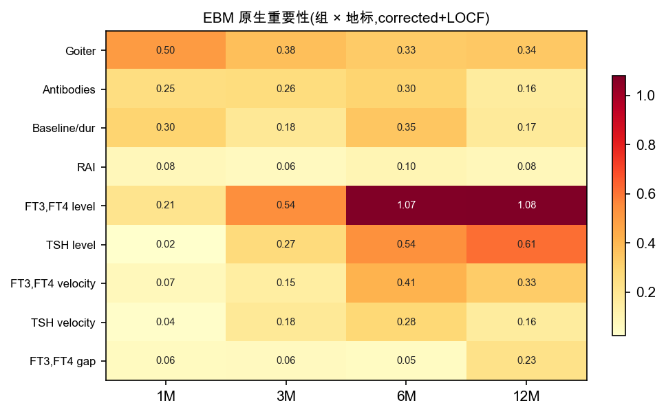
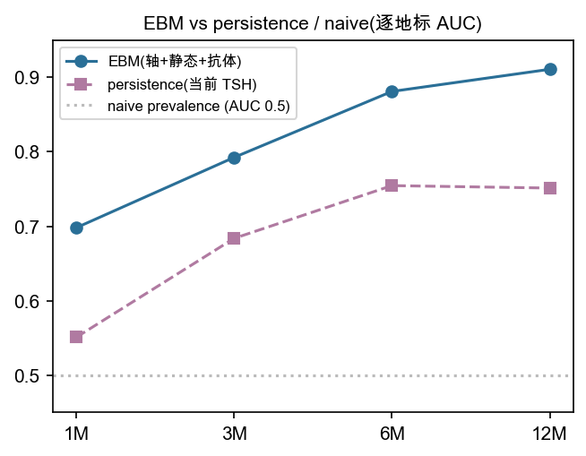
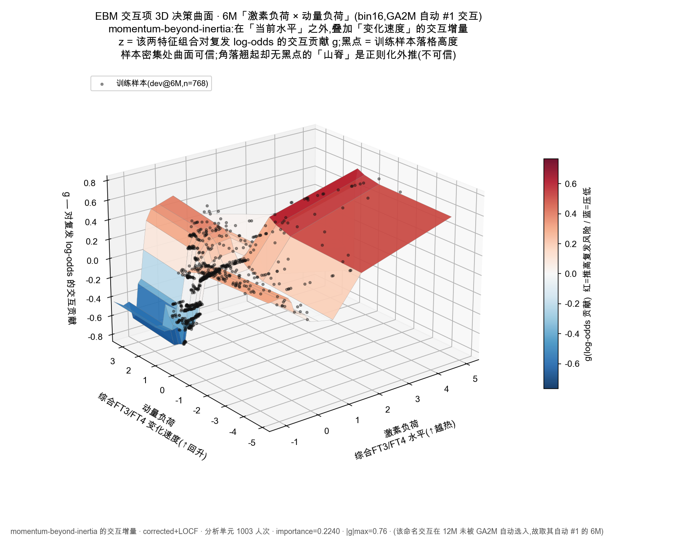
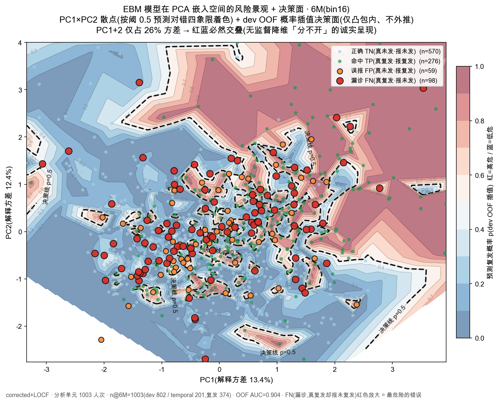
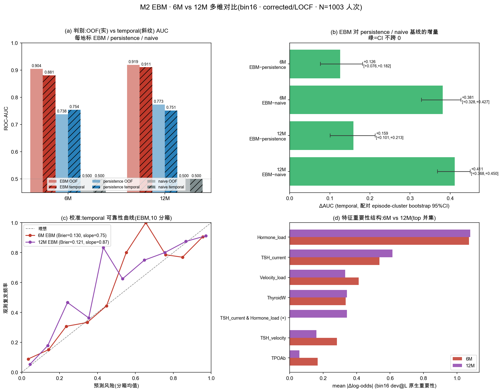
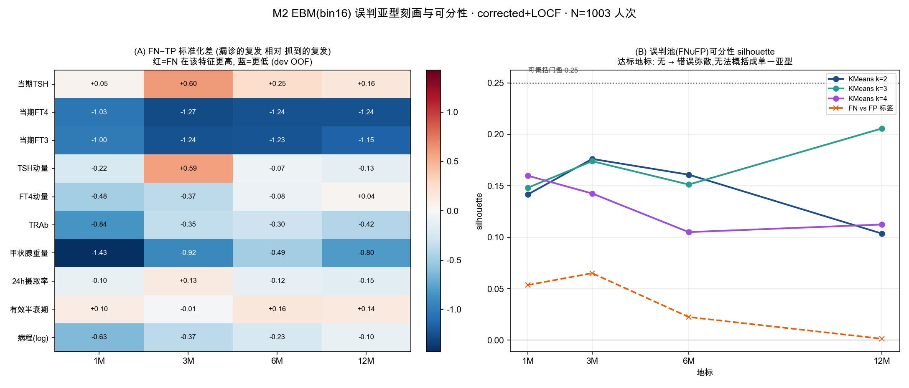

# M2 · RAI 治疗后早期复发 EBM 玻璃盒（corrected+LOCF · 1/3/6/12M）

> 本分支精简为**纯 M2**：RAI 治疗后早期固定地标的长期复发判定。
> 围绕 **1003 RAI 治疗人次**（development 802 / temporal test 201，分析单位为人次，重复治疗按独立 episode 处理），在 **1/3/6/12M** 四个固定地标各训练一个 **EBM 玻璃盒**（逐地标可解释 GAM），预测 **24M 复发（NHRH）**。所有产物（图、汇总表、报告）自包含可独立阅读，不含原始数据集。

---

## 一小时关键变化（项目总结）

### 背景

M2 回答的是治疗后早期的临床问题——「3 / 6 个月时还要不要担心 24 个月以后」。范式为**固定终点 24M NHRH** 上的多地标 landmark 更新：在 **1M / 3M / 6M / 12M** 四个固定地标各拟合一个独立的 EBM 玻璃盒，全程 time-safe（地标 L 只用 ≤L 的特征），并在每个地标并列 **naive（患病率）** 与 **persistence（time-safe 当期 TSH 逻辑回归）** 两条朴素基线以量化学习模型的增量。0M（治疗前）不由 M2 承担，归 M1 模块。分析口径为 **N=1003 人次**，CV/bootstrap 按 episode 处理，不报告 unique-patient 数。

### 最大发现：两处退化读列 bug

复盘主线数据 loader 时发现：它读取的是几乎全空的**宽列**——`FT4_6M` 在 1003 人次里只有 **13** 个真值、`FT4_12M` **全为 0**、`Eval` one-hot 列**全零**。当期甲功的真值其实一直躺在 long 表的 `*_Current` 列（按 `Current_Time=="{L}M"` 取行）里，从未被正确读出。换言之，旧主线的「当期化验」特征长期处于退化状态，旧 6M 的 0.817 主要是靠**激素变化速度 + 静态基线**撑起来的，而非当期水平本身。

### 口径修正 + 叙事反转

切换到 corrected 真值（`*_Current` 列）后，6M EBM 从 **0.817 → 0.878**、并新增 **12M = 0.908**。更关键的是叙事反转：**当期甲功水平在后期 6M / 12M 占主导**，而旧报告里「激素动量（速度）主导 6M」的结论，其实是 current 列退化后的人为产物——主 paper 与图解教程已用删除线就此更正。动量并未消失，而是以「**水平 × 速度**」12M 交互项的形式提供增量（momentum-beyond-inertia：在「现在是什么样」之上量化「正在往哪走」）。

### 其余成果

- **LOCF（结转患者自身轨迹）是最优插值**：在缺失高发的 12M 上把同一 episode 上一次真值结转，优于 missForest / KNN / median，也优于「只告诉模型这里缺了」（informative-missingness 对照≈median）——增益来自结转的**数值/轨迹本身**。
- **12M 入主 paper 且不降反升**：旧 median 口径下 12M(0.803) < 6M(0.855)（「越晚越难」），LOCF 口径下 **12M(0.908) > 6M(0.878)**，全程单调、多 seed 稳定。
- **跨地标错例：弥散 → 特征天花板**。错误不再集中于某个可命名子群，而是弥散分布——可命名的系统性错误只剩一类 **FN-silent「看似正常却复发」**；轨迹分析（temporal）显示持续对 50.2% / 转对 23.4%（信号积累）/ 转错 5.5% / 持续错 7.5%，首地标即错的 70 人里 **67% 靠后续信号积累转对、21% 顽固到底**，印证「半量特征即饱和」的天花板。
- **交互项可大幅 prune**：自动发现的两两交互项判别增益在 4/4 地标的 95% CI 均跨 0，且 GA2M（含交互）→ GAM（纯加性）的退化为非显著——交互更多是可解释性装饰而非判别来源，可透明保留供审计。配套选择性预测：弃权约 50% 后准确率升到 0.78 / NPV 0.84。
- **M1 复查无同类读列 bug**，数据干净，结论不受影响。

### 产物

loader 扩展（1/3/6/12M + corrected 真值）+ EBM-OOF 评估 + 插值对比实验 + **atlas_locf（47 图）** + 主 paper 重做（12M 入主图文版）+ prune 诊断 / 跨地标错例与变迁 / 原理教程 / 图解讲解 报告 + 可玩交互版（plotly）；全程落盘于工作日志 [`docs/worklog_m2_ebm_xland.md`](docs/worklog_m2_ebm_xland.md)。

---

### 图 1 · 重要性时间迁移热图（叙事反转核心）

各地标 EBM 分组重要性随时间迁移：解剖负荷 → 当期甲功水平在后期占主导，动量退居交互增量。

#### 风险驱动变迁表（bin16 · 原生重要性 mean&#124;Δlog-odds&#124; 排名）

> 上图的数值版：top 特征重要性排名随地标迁移。**解剖负荷（甲状腺重量）1M 独占首位 → 当期甲功水平（FT3/FT4 综合 + 当期 TSH）自 3M 起接管并主导 6M/12M**；动量（速度）3M 才显形、始终居中后排；12M 唯一进 top5 的交互项是「当期 TSH × 当期水平」——越靠终点越由「最近一次甲功状态」直接驱动。

| 特征（轴组） | 1M | 3M | 6M | 12M |
|:---|:---:|:---:|:---:|:---:|
| 当期甲功水平 Hormone_load（当期水平） | #2 | **#1** | **#1** | **#1** |
| 当期 TSH（当期水平） | – | #3 | #2 | #2 |
| 甲状腺重量（解剖负荷） | **#1** | #2 | #4 | #3 |
| 综合动量 Velocity_load（动量） | – | #5 | #3 | #5 |
| TSH 动量（动量） | – | #4 | #5 | – |
| 病程 log（慢性基线） | #3 | – | – | – |
| TPOAb（抗体） | #4 | – | – | – |
| 当期 TSH × 当期水平（交互项） | – | – | – | #4 |

### 图 2 · EBM vs persistence / naive（学习增量）

逐地标 EBM 时间外 AUC 与 persistence / naive 基线对比；EBM−persistence 的 ΔAUC（配对 episode bootstrap）四地标均为正、6M/12M 的 95% CI 排除 0（1M +0.147 / 3M +0.109 / 6M +0.126 [.077,.182] / 12M +0.159 [.101,.213]），12M 增量最大。

### 表 1 · 插值方法对比（temporal AUC，按地标）

> 数据取自 `docs/worklog_m2_ebm_xland.md`。同一正交轴 EBM × 每地标 OOF + temporal read-out + 配对 episode-cluster bootstrap（n=1000）。

| 插值方法 | 1M | 3M | 6M | 12M |
|:---|:---:|:---:|:---:|:---:|
| median（基线） | 0.704 | 0.799 | 0.855 | 0.803 |
| **LOCF（激素延续，推荐）** | 0.694 | 0.791 | **0.878** | **0.908** |
| missForest | 0.696 | 0.796 | 0.856 | 0.789 |
| KNN | 0.699 | 0.802 | 0.835 | 0.781 |
| ebm_native（NaN 原生 bin） | 0.707 | 0.802 | 0.853 | 0.801 |
| median+missing-indicator | 0.707 | 0.797 | 0.855 | 0.800 |

**ΔAUC vs median（配对 bootstrap）**：**LOCF @12M = +0.105，CI [0.059, 0.154] → 排除 0**（全矩阵唯一排除 0 的提升）；其余方法在任一地标 CI 均跨 0。低缺失地标（1/3M）各法在 bootstrap 噪声内不可区分，LOCF 的微降不可分辨；增益集中在缺失高发的 6M/12M。

---

## bin16 深化分析

> **为什么迁移到 bin16**：默认 ~62×62 交互网格对 1003 人次过细、多数格无人落入 → 交互 2D 查表近乎全外推；降到 `max_interaction_bins=16` 后网格 occupancy ~85–90%、每格有真实病人支撑，交互查表可读可信，而**单变量形状函数与判别 AUC 基本不受影响**（bins sweep 佐证）。核心评估原语与以下全部分析已统一 bin16；上方 F41/F38 等早期图集为默认 bin 产物，结论在 bin16 下一致。

### 图 3 · 最重要交互项 3D 决策曲面（momentum-beyond-inertia）

**6M 自动选中的 #1 交互**「FT3,FT4 综合水平 × 综合变化速度」的 3D 决策曲面（z=对复发 log-odds 的交互贡献，importance 0.224）。斜向山脊向「水平高 **且** 动量高（仍在快速回升）」角落抬升加码风险——同样的当期水平，「仍在上升」比「已回落」更危险，即 momentum-beyond-inertia。黑点=训练样本，密集处可信、角落无点处为正则外推。（注：该命名交互在 6M 被 GA2M 自动选为首位；12M 的自动首位交互则是「当期 TSH × 当期水平」，见上方风险变迁表——越靠终点越由最近一次甲功状态直接驱动。）

### 图 4 · 降维整体风险景观 + 决策面（PCA · 6M · bin16）

全 16 维 live 特征 PCA 到 PC1×PC2 的整体鸟瞰：背景=dev OOF 概率决策面（蓝低危→红高危，仅样本凸包内、不外推，含 p=0.5 决策线），散点按预测对错四象限着色（命中 TP / 正确 TN / 误报 FP / 漏诊 FN）。决策面右上偏红、左下偏蓝，FN/FP 多落在 p≈0.5 过渡带。PC1+2 仅约 1/4 方差（26%），红蓝必然交叠——这是无监督降维「分不开」的诚实呈现（判别力在高维、应以形状函数为准；监督 LDA 仅 1 维即 OOF AUC≈0.86，详见可玩 HTML）。

### 12M 不再不如 6M：corrected 后反转

旧口径（退化读列）下「12M 不如 6M」，corrected+LOCF+bin16 后 **12M 在判别 / 增量 / 校准 / 稳定性几乎所有维度都 ≥ 6M**——旧结论是 bug 产物。

| 维度（temporal 除非注明） | 6M | 12M | 更强 |
|:---|:---:|:---:|:---:|
| OOF AUC | 0.904 | **0.919** | 12M |
| Temporal AUC | 0.881 | **0.911** | 12M |
| ΔAUC vs persistence（配对 boot 95%CI） | +0.126 [.077,.182] | **+0.159 [.101,.213]** | 12M（均排除 0）|
| Temporal Brier（越低越好） | 0.130 | **0.121** | 12M |
| OOF−Temporal gap（越小越稳） | 0.023 | **0.008** | 12M |
| 校准 slope（理想=1） | 0.748 | **0.869** | 12M |

为何反转：12M 更长窗口的当期甲功更接近 24M 终点、信号更直接（重要性主导更突出），dev→temporal 漂移更小。唯一对 6M 有利的细节：persistence 基线本身 6M temporal AUC（0.755）略高于 12M（0.751），但 EBM 在 12M 的增量更大。

### 混淆矩阵跨地标深挖：弥散不可概括，唯一可命名是 FN-silent

bin16 + Youden@OOF 阈值，逐地标混淆与误判刻画：

- **判别随时间变准**：漏诊率（FN）1M 0.411 → 3M 0.206 → 6M 0.202 → **12M 0.123**，准确率 0.723→0.869，NPV 12M 达 0.925；3M 瓶颈反而是误报率最高（0.243，激素刚波动→过度报警），6M 起收敛。
- **误判无法概括成单一亚型（错误弥散）**：误判池聚类 silhouette 仅 0.16–0.21、FN-vs-FP 标签 silhouette ≈ 0.001–0.07（四地标 `characterizable=false`）；约 29% 误判落在决策边界 |p−阈|<0.1 内（约正确样本的 2–3 倍）；误判多「换人」（曾错的 345 人次中仅 5.8% 一直错）。
- **唯一可命名的系统性错误 = FN-silent「看似正常却复发」**：按甲功状态分层，**甲亢者几乎不漏诊**（Hyper FN 率 6M 0.016 / 12M 0.015），漏诊几乎全压在**甲功正常者**（Normal FN 率 1M 0.587→6M 0.461→12M 0.259）——化验已正常却仍走向复发的人最难抓；FN 相对 TP 的特征签名跨地标高度稳定（r=0.82）：FT3/FT4 已偏正常/偏低、腺体偏小。属现有特征集的天花板。
- **个体跨地标轨迹 = 总体「越来越对」**：802 episodes 中持续判对 57.0%、**由错转对 20.8%**（信号积累，复发率高达 0.569）、反复 13.5%、由对转错 6.2%、**顽固持续错仅 2.5%**（当期 TSH≈0 持续甲亢抑制、甲状腺 ~45g、病程长）；**83.0% 的人随地标推进判得更准**，「由错转对」远多于「由对转错」（167 vs 50）。

### 特征重要性迁移已覆盖 12M

bin16 重要性迁移表（见上方「风险驱动变迁表」）已含全 4 地标：12M 由**当期甲功水平**（Hormone_load 1.08 + 当期 TSH 0.61）牢牢主导，唯一进 top5 的交互项「当期 TSH × 当期水平」也属当期状态——越靠终点越由「最近一次甲功」直接驱动。

---

## M2 报告导航

按模块分组（口径已统一 **bin16**）。

**① 核心论文 · 入门讲解**
| 报告 | 入口 |
|:---|:---|
| **EBM 玻璃盒论文 · 图文版（47 图 + 逐图评论，★ 推荐入口）** | [Module2v2_EBM_paper.md](results/module2_v2_vertical/Module2v2_EBM_paper.md) |
| EBM 原理图解教程 / 讲解（人话→数学→1D→2D→正交辨析） | [Module2v2_EBM_讲解.md](results/module2_v2_vertical/Module2v2_EBM_讲解.md) |

**② 可玩交互可视化（bin16 · 自包含 HTML）**
| 报告 | 入口 |
|:---|:---|
| EBM 交互查表 **bin16**（形状放大镜 / 单病人 waterfall / 交互项 2D 查表） | [Module2v2_EBM_interactive_bin16.html](results/module2_v2_vertical/Module2v2_EBM_interactive_bin16.html) |
| PCA / LDA 降维整体风险景观 **bin16**（决策曲面 + 预测对错 TP/FP/FN/TN） | [Module2v2_EBM_pca_landscape.html](results/module2_v2_vertical/Module2v2_EBM_pca_landscape.html) |
| EBM 最重要交互项 3D 曲面（可旋转） | [Module2v2_EBM_interaction_3D.html](results/module2_v2_vertical/Module2v2_EBM_interaction_3D.html) |

**③ 诊断与错例分析**
| 报告 | 入口 |
|:---|:---|
| EBM 交互项诊断与 prune（判别增益 CI / 可信度分级） | [Module2v2_EBM交互项诊断与prune.md](results/module2_v2_vertical/Module2v2_EBM交互项诊断与prune.md) |
| 跨地标错例与变迁（弥散 → 特征天花板 / FN-silent） | [Module2v2_跨地标错例与变迁.md](results/module2_v2_vertical/Module2v2_跨地标错例与变迁.md) |
| probe 可解释性与诊断（偏差-方差 / 学习曲线 / 选择性预测） | [Module2v2_probe_可解释性与诊断.md](results/module2_v2_vertical/Module2v2_probe_可解释性与诊断.md) |
| 扩展四项发现 | [Module2v2_扩展四项发现.md](results/module2_v2_vertical/Module2v2_扩展四项发现.md) |

**④ 横向对比 · 架构探索**
| 报告 | 入口 |
|:---|:---|
| 12 方法对比（L2 / Elastic-net / GEE / RF / HGB / GRU…） | [Module2v2_compare.md](results/module2_v2_vertical/Module2v2_compare.md) |
| B4 时间感知 GRU / GRU-ODE | [Module2v2_B4_时间感知GRU.md](results/module2_v2_vertical/Module2v2_B4_时间感知GRU.md) |
| 三轨综合 + 论文推荐 | [Module2v2_三轨综合与论文推荐.md](results/module2_v2_synthesis/Module2v2_三轨综合与论文推荐.md) |

**⑤ v1 fallback**
| 报告 | 入口 |
|:---|:---|
| M2 · v1（per-landmark 4-LR + Eval state，早期固定地标更新） | [Module2_早期固定地标长期风险更新.md](results/module2_early_landmark_updating/Module2_早期固定地标长期风险更新.md) |

结果目录：[`results/module2_v2_vertical/`](results/module2_v2_vertical/)（含 `m2v2_ebm_full_locf/` 47 图主产物）· [`results/module2_v2_synthesis/`](results/module2_v2_synthesis/) · [`results/module2_early_landmark_updating/`](results/module2_early_landmark_updating/) · [`results/module2_v2_base/`](results/module2_v2_base/) · [`results/module2_v2_horizontal/`](results/module2_v2_horizontal/)

---

## 更新日志 / Roadmap

> 每次*有洞见*的 merge/push 在此留一行（日期 · 一句洞见 · PR/commit）；倒序，新条目加最上面。

- **2026-05-31** · **全口径迁移 bin16 + 三项深化** — 核心评估原语 `ebm_oof_and_temporal` 默认 `max_interaction_bins=16`（默认 ~62×62 交互网格过细致 2D 查表全外推 → 16×16 occupancy ~85–90% 可信，判别 AUC 基本不变）；新增 PCA/LDA 降维风险景观（监督 LDA 仅 1 维 OOF AUC≈0.86 vs 无监督 PCA 2 维≈0.70，量化「降维丢方差不丢判别力」）；**「12M 不如 6M」查证为退化 bug 产物、corrected+bin16 后全面反转**（12M OOF 0.919 / temporal 0.911 ≥ 6M，校准/稳定性同向）；混淆矩阵跨地标深挖——误判弥散不可概括（silhouette<0.25），唯一可命名是 **FN-silent「看似正常却复发」**（甲亢几乎不漏、漏诊压在甲功正常者），个体轨迹 83% 越判越准（由错转对 167 vs 由对转错 50）。
- **2026-05-31** · **统一 corrected 真值口径 + LOCF（叙事反转）** — 发现主线「当期化验」读错列（`FT4_6M` 仅 13/1003 真值、`FT4_12M` 全 0；真值其实在 long 表 `*_Current` 列）：切真值后 6M EBM **0.817→0.878**、新增 **12M 0.908**；LOCF 为最优插值（12M ΔAUC +0.105 CI 排除 0）；12M 入主图文版 paper（不降反升）；旧「激素动量主导 6M」被确认为 current 退化产物（已删除线更正），动量改以「水平×速度」12M 交互增量呈现。loader 扩到 1/3/6/12，三激素真值人次 3M 820 / 6M 746 / 12M 605。
- **2026-05-30** · 12M EBM 扩展 + 患者级分解（waterfall / 反事实）+ GREAT 对标。
- **2026-05-30** · EBM 论文 §3.6：自动发现的两两交互项「医学解读 + 可信度分级」（可信项 vs 弱交互透明保留供审计）。
- **2026-05-30** · M2 不做 0M 性能分析、从 1M 起（0M 治疗前归 M1 模块）；跨地标叙事统一为 1M/3M/6M/12M。
- **2026-05-30** · EBM 交互版升级 drill-down — 下拉选特征大图 / x 轴滑块缩放 / 交互项 2D 查表悬停看每格人次+事件率；新增 EBM 原理图解教程（人话→数学→1D 形状→2D 交互→正交/共线辨析）。
- **2026-05-29** · EBM 玻璃盒论文图文版 — 47 图内嵌 + 逐图评论 + §2.1 数学定位（GA2M / LR 局部 OR = exp(Δ)）；EBM vs 12 类 ML 方法对比（印证特征天花板）。
