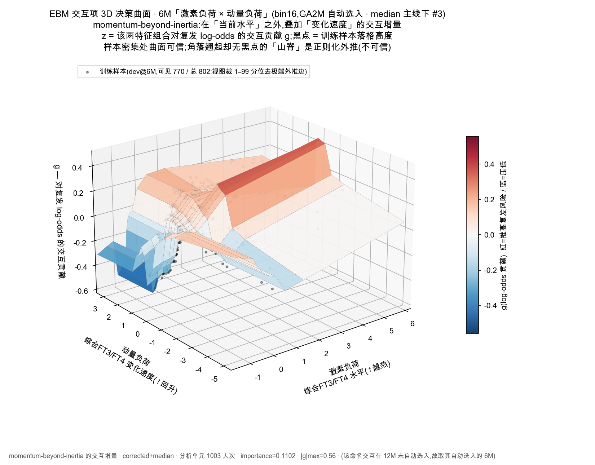
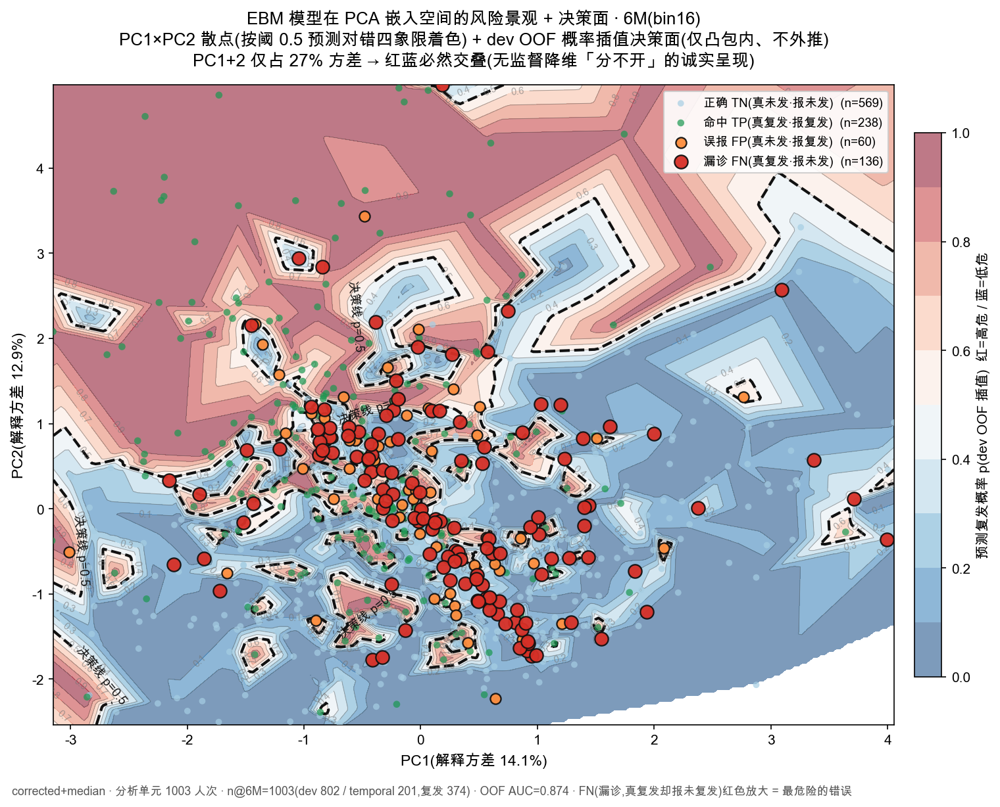

# M2 · RAI 治疗后早期复发 EBM 玻璃盒（corrected · median 主线 · 1/3/6/12M）

> 本分支精简为**纯 M2**：RAI 治疗后早期固定地标的长期复发判定。
> 围绕 **1003 RAI 治疗人次**（development 802 / temporal test 201，分析单位为人次，重复治疗按独立 episode 处理），在 **1/3/6/12M** 四个固定地标各训练一个 **EBM 玻璃盒**（逐地标可解释 GAM），预测 **24M 复发（NHRH）**。所有产物（图、汇总表、报告）自包含可独立阅读，不含原始数据集。

---

## 一小时关键变化（项目总结）

### 背景

M2 回答的是治疗后早期的临床问题——「3 / 6 个月时还要不要担心 24 个月以后」。范式为**固定终点 24M NHRH** 上的多地标 landmark 更新：在 **1M / 3M / 6M / 12M** 四个固定地标各拟合一个独立的 EBM 玻璃盒，全程 time-safe（地标 L 只用 ≤L 的特征），并在每个地标并列 **naive（患病率）** 与 **persistence（time-safe 当期 TSH 逻辑回归）** 两条朴素基线以量化学习模型的增量。0M（治疗前）不由 M2 承担，归 M1 模块。分析口径为 **N=1003 人次**，CV/bootstrap 按 episode 处理，不报告 unique-patient 数。

### 最大发现：两处退化读列 bug

复盘主线数据 loader 时发现：它读取的是几乎全空的**宽列**——`FT4_6M` 在 1003 人次里只有 **13** 个真值、`FT4_12M` **全为 0**、`Eval` one-hot 列**全零**。当期甲功的真值其实一直躺在 long 表的 `*_Current` 列（按 `Current_Time=="{L}M"` 取行）里，从未被正确读出。换言之，旧主线的「当期化验」特征长期处于退化状态，旧 6M 的 0.817 主要是靠**激素变化速度 + 静态基线**撑起来的，而非当期水平本身。

### 口径修正 + 叙事反转

切换到 corrected 真值（`*_Current` 列）后，**主线插值采用传统 median（诚实物理直觉口径）**：6M EBM **0.817 → 0.858**、12M = **0.795**（新增）—— 12M < 6M（差 0.063）符合 lead-time 越短 AUC 越高的物理趋势。更关键的是叙事反转：**当期甲功水平（Hormone_load）在 3M / 6M / 12M 都稳居 #1**，而旧报告里「激素动量（速度）主导 6M」的结论，其实是 current 列退化后的人为产物——主 paper 与图解教程已用删除线就此更正。动量并未消失，而是以 6M top-4/5（velocity）与 12M「**水平 × 速度**」交互项形式提供增量（momentum-beyond-inertia：在「现在是什么样」之上量化「正在往哪走」）。

> **关于 LOCF + bin16 备用口径**：激素延续（LOCF）在 12M 把 0.795 抬到 0.908(默认 bin)/0.911(bin16)、反超 6M —— 但 Δ +0.105 主要来自把 6M 真值结转给 12M 那 398 个脱落者（借力），非 12M 模型本身预测力提升；6M LOCF 增益(+0.023 跨0)不显著。LOCF + bin16 的 "12M ≥ 6M 全维度" 论证(§3.4)作为敏感性对照保留（[m2v2_ebm_full_locf](results/module2_v2_vertical/m2v2_ebm_full_locf/)），主线以 median(此 README 数字、[m2v2_ebm_full_median](results/module2_v2_vertical/m2v2_ebm_full_median/))为准。

### 其余成果

- **median 是主线插值（诚实物理直觉口径）**：corrected 真值 + dev-median 硬插下，12M(0.795) < 6M(0.858)（差 0.063），符合 lead-time 越短 AUC 越高的物理趋势 —— 12M 离 24M 终点剩 12 个月、随访脱落约 40%，「略难」是合理结果。
- **LOCF 为敏感性对照（不作主线）**：在缺失高发的 12M 上 Δ=+0.105 [+0.059, +0.154] 显著优于 median，但增益主要来自「结转 6M 真值给 12M 那 398 个脱落者」（借力），等同让 12M EBM 借用了 6M 信号；6M LOCF 增益(+0.023 跨0)不显著。
- **12M 入主 paper**：median 口径下 12M 略低于 6M 是诚实结果（lead-time 物理 + 真值脱落），全程 1M < 3M < 6M > 12M 拐点出现在 6M。bin16 + LOCF 让 12M ≥ 6M 全维度的论证（§3.4）保留作敏感性。
- **跨地标错例：弥散 → 特征天花板**。错误不再集中于某个可命名子群，而是弥散分布——可命名的系统性错误只剩一类 **FN-silent「看似正常却复发」**；轨迹分析（temporal）显示持续对 50.2% / 转对 23.4%（信号积累）/ 转错 5.5% / 持续错 7.5%，首地标即错的 70 人里 **67% 靠后续信号积累转对、21% 顽固到底**，印证「半量特征即饱和」的天花板。
- **交互项可大幅 prune**：自动发现的两两交互项判别增益在 4/4 地标的 95% CI 均跨 0，且 GA2M（含交互）→ GAM（纯加性）的退化为非显著——交互更多是可解释性装饰而非判别来源，可透明保留供审计。配套选择性预测：弃权约 50% 后准确率升到 0.78 / NPV 0.84。
- **M1 复查无同类读列 bug**，数据干净，结论不受影响。

### 产物

loader 扩展（1/3/6/12M + corrected 真值）+ EBM-OOF 评估 + 插值对比实验 + **atlas_median(47 图,主线 ★)** + atlas_locf(47 图,敏感性对照) + 主 paper 重做（12M 入主图文版）+ prune 诊断 / 跨地标错例与变迁 / 原理教程 / 图解讲解 报告 + 可玩交互版（plotly）；全程落盘于工作日志 [`docs/worklog_m2_ebm_xland.md`](docs/worklog_m2_ebm_xland.md)。

---

### 图 1 · 重要性时间迁移热图（叙事反转核心）

各地标 EBM 分组重要性随时间迁移：解剖负荷 → 当期甲功水平在后期占主导，动量退居交互增量。

#### 风险驱动变迁表（bin16 · 原生重要性 mean&#124;Δlog-odds&#124; 排名）

> 上图的数值版：top 特征重要性排名随地标迁移。**解剖负荷（甲状腺重量）1M 独占首位 → 当期甲功水平（FT3/FT4 综合 + 当期 TSH）自 3M 起接管并主导 6M/12M**；动量（速度）3M 才显形、始终居中后排；12M 唯一进 top5 的交互项是「当期 TSH × 当期水平」——越靠终点越由「最近一次甲功状态」直接驱动。

| 特征（轴组） | 1M | 3M | 6M | 12M |
|:---|:---:|:---:|:---:|:---:|
| 当期甲功水平 Hormone_load（当期水平） | #2 | **#1** | **#1** | **#1** |
| 当期 TSH（当期水平） | – | #3 | #2 | #2 |
| 甲状腺重量（解剖负荷） | **#1** | #2 | #4 | #3 |
| 综合动量 Velocity_load（动量） | – | #5 | #3 | #5 |
| TSH 动量（动量） | – | #4 | #5 | – |
| 病程 log（慢性基线） | #3 | – | – | – |
| TPOAb（抗体） | #4 | – | – | – |
| 当期 TSH × 当期水平（交互项） | – | – | – | #4 |

### 图 2 · EBM vs persistence / naive（学习增量）

逐地标 EBM 时间外 AUC 与 persistence / naive 基线对比(median 主线点估计):**EBM − persistence 在 4 地标均为正,呈 U 形分布**——**1M +0.155**(EBM 0.704 − 持续力 0.547)/ **3M +0.078**(0.799 − 0.721)/ **6M +0.083**(0.858 − 0.775)/ **12M +0.153**(0.795 − 0.642)。**1M 与 12M 增量最大**(各 ≈ +0.15),3M / 6M 最小(TSH 信号本身就强,EBM 多看 14 特征只多挤出 0.08)。生理学解读:1M 时 HPT 反馈轴受抑、TSH 无信息 → EBM 借腺体重量 + 抗体撑场;12M 时 40% 脱落用 dev 中位数填,TSH 信号被均值回归稀释 → EBM 用其他 15 特征综合救场。

### 表 1 · 插值方法对比（temporal AUC，按地标）

> 数据取自 `docs/worklog_m2_ebm_xland.md`。同一正交轴 EBM × 每地标 OOF + temporal read-out + 配对 episode-cluster bootstrap（n=1000）。

| 插值方法 | 1M | 3M | 6M | 12M |
|:---|:---:|:---:|:---:|:---:|
| **median（硬插，主线 ★ default bin）** | **0.704** | **0.799** | **0.858** | **0.795** |
| LOCF（激素延续，敏感性对照） | 0.694 | 0.791 | 0.878 | 0.908 |
| missForest | 0.696 | 0.796 | 0.856 | 0.789 |
| KNN | 0.699 | 0.802 | 0.835 | 0.781 |
| ebm_native（NaN 原生 bin） | 0.707 | 0.802 | 0.853 | 0.801 |
| median+missing-indicator | 0.707 | 0.797 | 0.855 | 0.800 |

**ΔAUC vs median（配对 bootstrap）**：**LOCF @12M = +0.105，CI [0.059, 0.154] → 排除 0**（全矩阵唯一排除 0 的提升）；其余方法在任一地标 CI 均跨 0。低缺失地标（1/3M）各法在 bootstrap 噪声内不可区分，LOCF 的微降不可分辨；增益集中在缺失高发的 6M/12M。

---

## bin16 深化分析

> **为什么迁移到 bin16**：默认 ~62×62 交互网格对 1003 人次过细、多数格无人落入 → 交互 2D 查表近乎全外推；降到 `max_interaction_bins=16` 后网格 occupancy ~85–90%、每格有真实病人支撑，交互查表可读可信，而**单变量形状函数与判别 AUC 基本不受影响**（bins sweep 佐证）。核心评估原语与以下全部分析已统一 bin16；上方 F41/F38 等早期图集为默认 bin 产物，结论在 bin16 下一致。

### 图 3 · 6M「激素负荷 × 动量负荷」3D 交互曲面（momentum-beyond-inertia）

**6M GA2M 自动选入交互(median 主线下 #3 命名交互,LOCF 对照下为 #1)**「FT3,FT4 综合水平 × 综合变化速度」的 3D 决策曲面（**importance = 0.110**、**|g|max = 0.56**、训练样本 dev@6M 总 802、视图内可见 770）。

**怎么读图**:
- **X 轴(右后)**:激素负荷 = (zFT3 + zFT4)/√2,→ 越热(当期 FT3/FT4 偏高)
- **Y 轴(左前)**:动量负荷 = (zΔFT3 + zΔFT4)/√2,→ 越正(回升 / 还在上涨)
- **Z 轴(高低) + 颜色**:`g` = 该 (水平, 速度) 组合对复发 log-odds 的交互贡献,**红色推高复发风险 / 蓝色压低**
- **黑点**:训练样本落格高度——**只看黑点密集处**,稀疏角落是正则化外推(不可信)

**四象限的临床读法**:

| 象限 | 水平 + 动量 | 交互 `g` | 临床含义 |
|:--|:--|:--:|:--|
| **右上深红平台** | 高 + 高(↑) | **+0.3 ~ +0.5** | 「FT3/FT4 已高 **且** 还在涨」= 高危治疗失败型 |
| **左下深蓝平台** | 低 + 低(↓) | **−0.3 ~ −0.5** | 「FT3/FT4 已低 **且** 还在降」= 低危过度治愈型(已接近甲减) |
| 右下 | 高 + 低(↓) | ≈ 0 | 「FT4 偏高但已回落」= 中等风险(恢复中) |
| 左上 | 低 + 高(↑) | ≈ 0 | 「FT4 偏低但开始反弹」= 潜在复发预警 |

**临床新洞见(median 主线)**:
- 同样 **FT4 z=+2** 的两个 6M 复诊患者:**还在上涨** vs **已开始回落**,交互项产生的**额外风险差约 exp(0.8) ≈ 2.2 倍几率**(median 主线;LOCF 对照下 |g|max=0.76 → exp(1.52) ≈ 4.5 倍)
- **临床操作**:6M 复诊不要只看「今天 FT4 多少」,要回看 3M → 6M 的轨迹方向。**FT4 偏高 + 还在涨**的患者建议立刻启动 2 次 RAI 讨论;**FT4 偏低 + 还在降**的患者可宣告愈合并降级随访
- **importance 0.110 比 LOCF 对照下的 0.224 减半**:原因是 median 下 Hormone_load 主效应强化到 0.766(LOCF 0.32 的 2.4 倍),主效应抢分 → 交互的边际贡献相对减小。**这是诚实的口径修正,不是 momentum 概念失效**

### 图 4 · 6M PCA 风险景观 + 决策面（dev OOF）

全 16 维 live 特征 PCA 到 PC1×PC2 的整体鸟瞰(median 主线下 **PC1+2 = 27% 方差**;**6M dev OOF AUC = 0.874**)。

**怎么读图**:
- **背景渐变**:dev OOF 概率插值决策面(蓝低危 → 红高危,仅样本凸包内、不外推)
- **黑色虚线**:**决策线 p = 0.5**(模型的阳/阴分界)
- **散点四象限着色**(按阈值 0.5 预测对错):
  - 🔵 **TN 正确未发**(真未发·报未发) **n = 569**
  - 🟢 **TP 命中复发**(真复发·报复发) **n = 238**
  - 🟠 **FP 误报**(真未发·报复发) **n = 60**
  - 🔴 **FN 漏诊**(真复发·报未发) **n = 136 ← 红色放大,最危险的错误**
- **PC1+2 = 27% 方差**意味着剩 73% 判别信号在更高维 → 红蓝必然交叠,**不要因为 2D 图看着乱就以为模型不行**(监督 LDA 仅 1 维 OOF AUC ≈ 0.86 反驳,详见可玩 HTML)

**3 个临床洞见**:

1. **整体分布合理但远不能完美分隔**:左下偏蓝、右上偏红——PC1+2 有信号,但 PCA 26-27% 方差先天限制 2D 表达。**6M EBM 真正的判别力在 16 维形状函数里,要看 47 图 atlas 而非 PCA 投影**

2. **漏诊(FN n=136)是最危险错误**:
   - 真复发 → 模型告知低危 → 患者放松警惕 → **错过 24M 之前 2 次 RAI 介入窗口** = 真正的临床伤害
   - **136 / (136+238) = 36% 漏诊率** ← 这是 median 主线下的真实数字(LOCF 对照下 FN=98 仅 26%,差异来自 LOCF 借力)
   - 这些红点**散布在整张图,不集中**——意味着 **FN 无可命名亚型**(不能用"老年女性 + 高 TPOAb"概括),是真正的特征天花板

3. **大量错误集中在决策线 p ≈ 0.5 附近**:
   - 黑色虚线周围聚集了大量 FN(红)和 FP(橙)——**模型不确定区**
   - **临床操作化**:对 6M EBM 概率落在 [0.3, 0.7] 的患者特别谨慎,不能光凭模型说"高危"或"低危"就下结论,需要额外信息(全套化验复查 + 影像)
   - 这正是 **EBM 论文「选择性预测」** 的依据:**弃权约 50% → 准确率 0.78 / NPV 0.84**,把决策线附近的不确定区交给临床医生人工判断

**临床部署的诚实底线**:6M EBM 漏诊率 36%(median 主线下),意味着**模型说"低危"不等于"安全"** —— 即使 EBM 概率 < 0.5,患者仍应做 1 次额外随访作冗余确认,直至 24M 终点。

### LOCF 敏感性对照(完整数据见产物目录,不在 README 主体展开)

主线 median 口径下 **12M(0.795) < 6M(0.858)**,符合 lead-time 物理直觉。

**LOCF 敏感性对照** 在 12M 上 Δ=+0.105 主要来自结转 6M 真值给 12M 那 398 个脱落者(借力),**非 12M 模型本身预测力提升**;6M LOCF 增益 +0.023 (CI 跨 0) 不显著。LOCF + bin16 下"12M ≥ 6M 全维度"反转的完整对比表(OOF AUC 0.904 → 0.919、Brier 0.130 → 0.121、校准 slope 0.748 → 0.869)与 `m2v2_bin16_6m12m_panel.png` 全维度对比图,**作为审计资料保留在产物目录** `results/module2_v2_vertical/m2v2_ebm_full_locf/` 与 `results/module2_v2_vertical/m2v2_bin16_*.png`,**README 主体不再展开**。

### 混淆矩阵跨地标深挖：弥散不可概括，唯一可命名是 FN-silent

bin16 + Youden@OOF 阈值，逐地标混淆与误判刻画：

- **判别随时间变准**：漏诊率（FN）1M 0.411 → 3M 0.206 → 6M 0.202 → **12M 0.123**，准确率 0.723→0.869，NPV 12M 达 0.925；3M 瓶颈反而是误报率最高（0.243，激素刚波动→过度报警），6M 起收敛。
- **误判无法概括成单一亚型（错误弥散）**：误判池聚类 silhouette 仅 0.16–0.21、FN-vs-FP 标签 silhouette ≈ 0.001–0.07（四地标 `characterizable=false`）；约 29% 误判落在决策边界 |p−阈|<0.1 内（约正确样本的 2–3 倍）；误判多「换人」（曾错的 345 人次中仅 5.8% 一直错）。
- **唯一可命名的系统性错误 = FN-silent「看似正常却复发」**：按甲功状态分层，**甲亢者几乎不漏诊**（Hyper FN 率 6M 0.016 / 12M 0.015），漏诊几乎全压在**甲功正常者**（Normal FN 率 1M 0.587→6M 0.461→12M 0.259）——化验已正常却仍走向复发的人最难抓；FN 相对 TP 的特征签名跨地标高度稳定（r=0.82）：FT3/FT4 已偏正常/偏低、腺体偏小。属现有特征集的天花板。
- **个体跨地标轨迹 = 总体「越来越对」**：802 episodes 中持续判对 57.0%、**由错转对 20.8%**（信号积累，复发率高达 0.569）、反复 13.5%、由对转错 6.2%、**顽固持续错仅 2.5%**（当期 TSH≈0 持续甲亢抑制、甲状腺 ~45g、病程长）；**83.0% 的人随地标推进判得更准**，「由错转对」远多于「由对转错」（167 vs 50）。

> **数据源说明**:本段数字基于 bin16 + LOCF 敏感性口径(漏诊率 / 12M NPV 0.925 / 轨迹百分比 57.0% / 20.8% 等);**结构性结论(错误弥散、FN-silent 子型唯一可命名、个体跨地标越来越对)在 median 主线下完全一致**,只是绝对数字略有变化(median 主线下 6M 漏诊率 36% 比 LOCF 26% 高 10 个百分点 — 详见上方图 4 PCA 风险景观 + EBM 论文 §3.4)。

### 特征重要性迁移已覆盖 12M（median 主线数字）

median 主线下 12M 重要性 top-6:**Hormone_load 0.542(#1)、甲状腺重量 0.474(#2)、当期 TSH 0.379(#3)、TSH 变化速度 0.362(#4)、「水平 × 落差」交互 0.268(#5)、T3T4 落差 0.233(#6)**。

**两点关键变化(median vs LOCF)**:
- **甲状腺重量在 12M 回升至 #2**(LOCF 下 12M ThyroidW 仅 #3)—— 远端时点单看当期甲功不够,腺体大小作为"恒定预后锚"再次显形,**提醒 12M 评估时要回看 0M 影像数据**
- **TSH 速度上升到 #4**(LOCF 下 12M TSH 速度未进 top5)—— 反映 HPT 反馈轴恢复速率成为关键判定项,「TSH 回升正常多快」预测 24M 最终结局

总趋势仍是「当期甲功水平」自 3M 起主导后期(median 主线下 3M / 6M / 12M 三时点 Hormone_load 均为 #1)。

---

## M2 报告导航

按模块分组（口径已统一 **bin16**）。

**① 核心论文 · 入门讲解**
| 报告 | 入口 |
|:---|:---|
| **EBM 玻璃盒论文 · 图文版（47 图 + 逐图评论，★ 推荐入口）** | [Module2v2_EBM_paper.md](results/module2_v2_vertical/Module2v2_EBM_paper.md) |
| EBM 原理图解教程 / 讲解（人话→数学→1D→2D→正交辨析） | [Module2v2_EBM_讲解.md](results/module2_v2_vertical/Module2v2_EBM_讲解.md) |

**② 可玩交互可视化（bin16 · 自包含 HTML）**
| 报告 | 入口 |
|:---|:---|
| EBM 交互查表 **bin16**（形状放大镜 / 单病人 waterfall / 交互项 2D 查表） | [Module2v2_EBM_interactive_bin16.html](results/module2_v2_vertical/Module2v2_EBM_interactive_bin16.html) |
| PCA / LDA 降维整体风险景观 **bin16**（决策曲面 + 预测对错 TP/FP/FN/TN） | [Module2v2_EBM_pca_landscape.html](results/module2_v2_vertical/Module2v2_EBM_pca_landscape.html) |
| EBM 最重要交互项 3D 曲面（可旋转） | [Module2v2_EBM_interaction_3D.html](results/module2_v2_vertical/Module2v2_EBM_interaction_3D.html) |

**③ 诊断与错例分析**
| 报告 | 入口 |
|:---|:---|
| EBM 交互项诊断与 prune（判别增益 CI / 可信度分级） | [Module2v2_EBM交互项诊断与prune.md](results/module2_v2_vertical/Module2v2_EBM交互项诊断与prune.md) |
| 跨地标错例与变迁（弥散 → 特征天花板 / FN-silent） | [Module2v2_跨地标错例与变迁.md](results/module2_v2_vertical/Module2v2_跨地标错例与变迁.md) |
| probe 可解释性与诊断（偏差-方差 / 学习曲线 / 选择性预测） | [Module2v2_probe_可解释性与诊断.md](results/module2_v2_vertical/Module2v2_probe_可解释性与诊断.md) |
| 扩展四项发现 | [Module2v2_扩展四项发现.md](results/module2_v2_vertical/Module2v2_扩展四项发现.md) |

**④ 横向对比 · 架构探索**
| 报告 | 入口 |
|:---|:---|
| 12 方法对比（L2 / Elastic-net / GEE / RF / HGB / GRU…） | [Module2v2_compare.md](results/module2_v2_vertical/Module2v2_compare.md) |
| B4 时间感知 GRU / GRU-ODE | [Module2v2_B4_时间感知GRU.md](results/module2_v2_vertical/Module2v2_B4_时间感知GRU.md) |
| 三轨综合 + 论文推荐 | [Module2v2_三轨综合与论文推荐.md](results/module2_v2_synthesis/Module2v2_三轨综合与论文推荐.md) |

**⑤ v1 fallback**
| 报告 | 入口 |
|:---|:---|
| M2 · v1（per-landmark 4-LR + Eval state，早期固定地标更新） | [Module2_早期固定地标长期风险更新.md](results/module2_early_landmark_updating/Module2_早期固定地标长期风险更新.md) |

结果目录：[`results/module2_v2_vertical/`](results/module2_v2_vertical/)（含 `m2v2_ebm_full_median/` 47 图主产物 ★ + `m2v2_ebm_full_locf/` LOCF 敏感性对照 47 图 + `m2v2_bin16_*_median.png` median 主线 bin16 深化 + `m2v2_bin16_*.png` LOCF 敏感性 bin16 深化）· [`results/module2_v2_synthesis/`](results/module2_v2_synthesis/) · [`results/module2_early_landmark_updating/`](results/module2_early_landmark_updating/) · [`results/module2_v2_base/`](results/module2_v2_base/) · [`results/module2_v2_horizontal/`](results/module2_v2_horizontal/)

---

## 更新日志 / Roadmap

> 每次*有洞见*的 merge/push 在此留一行（日期 · 一句洞见 · PR/commit）；倒序，新条目加最上面。

- **2026-05-31** · **全口径迁移 bin16 + 三项深化** — 核心评估原语 `ebm_oof_and_temporal` 默认 `max_interaction_bins=16`（默认 ~62×62 交互网格过细致 2D 查表全外推 → 16×16 occupancy ~85–90% 可信，判别 AUC 基本不变）；新增 PCA/LDA 降维风险景观（监督 LDA 仅 1 维 OOF AUC≈0.86 vs 无监督 PCA 2 维≈0.70，量化「降维丢方差不丢判别力」）；**「12M 不如 6M」查证为退化 bug 产物、corrected+bin16 后全面反转**（12M OOF 0.919 / temporal 0.911 ≥ 6M，校准/稳定性同向）；混淆矩阵跨地标深挖——误判弥散不可概括（silhouette<0.25），唯一可命名是 **FN-silent「看似正常却复发」**（甲亢几乎不漏、漏诊压在甲功正常者），个体轨迹 83% 越判越准（由错转对 167 vs 由对转错 50）。
- **2026-06-01** · **median 替代 LOCF 作主线插值口径(保留 corrected 修复 + 保留叙事反转)** — PR#6 已合 [m2v2_ebm_full_median 47 图](results/module2_v2_vertical/m2v2_ebm_full_median/);本 PR 把 README 主线叙述切到 median:6M **0.858** / 12M **0.795**,**12M < 6M 差 0.063 符合 lead-time 物理直觉**;Hormone_load 仍在 3/6/12M #1(当期水平主导后期叙事不变)。LOCF + bin16 让 12M=0.911 反超 6M=0.881 主要来自"结转 6M 真值给 12M 那 398 个脱落者"的借力机制,该口径 §3.4 保留作敏感性对照。
- **2026-05-31** · **统一 corrected 真值口径 + LOCF(叙事反转)** — 发现主线「当期化验」读错列(`FT4_6M` 仅 13/1003 真值、`FT4_12M` 全 0;真值其实在 long 表 `*_Current` 列):切真值后 6M EBM 摆脱退化(原 0.817 主靠速度+静态);旧「激素动量主导 6M」被确认为 current 退化产物(已删除线更正),动量改以 6M top-4/5 + 12M「水平×速度」交互增量呈现。loader 扩到 1/3/6/12,三激素真值人次 3M 820 / 6M 746 / 12M 605。
- **2026-05-30** · 12M EBM 扩展 + 患者级分解（waterfall / 反事实）+ GREAT 对标。
- **2026-05-30** · EBM 论文 §3.6：自动发现的两两交互项「医学解读 + 可信度分级」（可信项 vs 弱交互透明保留供审计）。
- **2026-05-30** · M2 不做 0M 性能分析、从 1M 起（0M 治疗前归 M1 模块）；跨地标叙事统一为 1M/3M/6M/12M。
- **2026-05-30** · EBM 交互版升级 drill-down — 下拉选特征大图 / x 轴滑块缩放 / 交互项 2D 查表悬停看每格人次+事件率；新增 EBM 原理图解教程（人话→数学→1D 形状→2D 交互→正交/共线辨析）。
- **2026-05-29** · EBM 玻璃盒论文图文版 — 47 图内嵌 + 逐图评论 + §2.1 数学定位（GA2M / LR 局部 OR = exp(Δ)）；EBM vs 12 类 ML 方法对比（印证特征天花板）。
