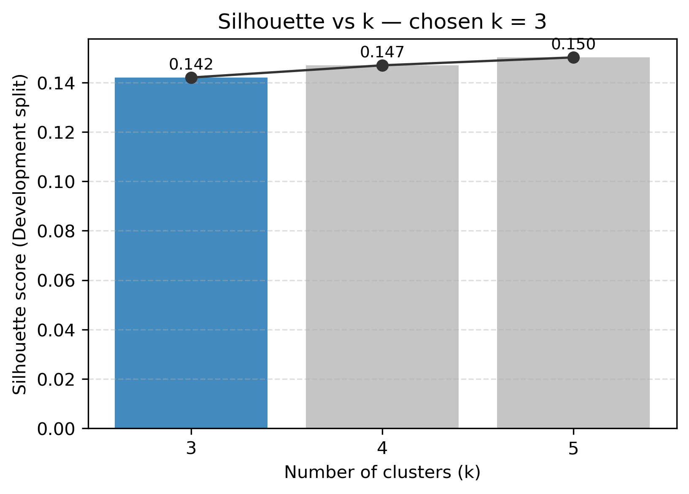
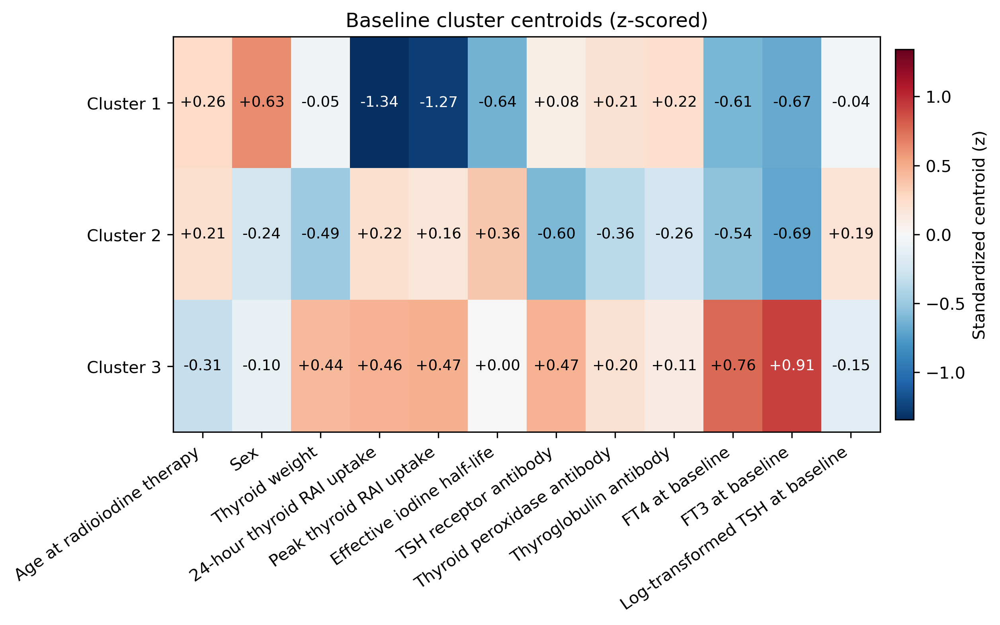
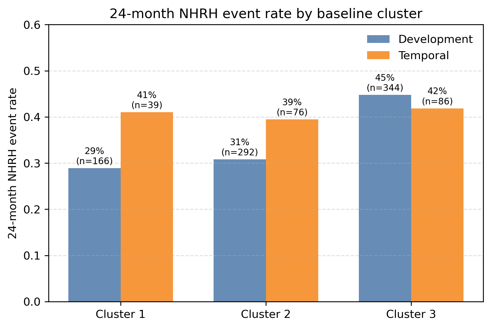
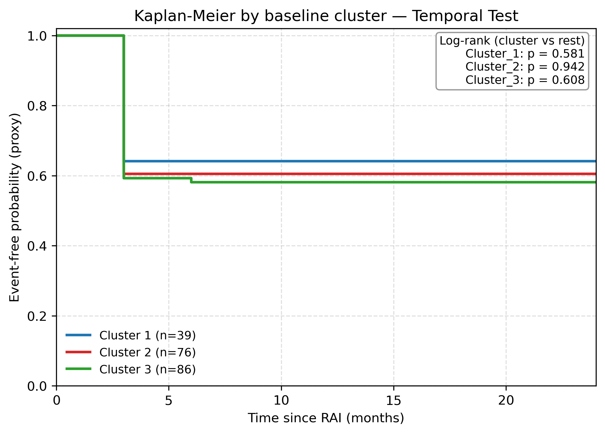
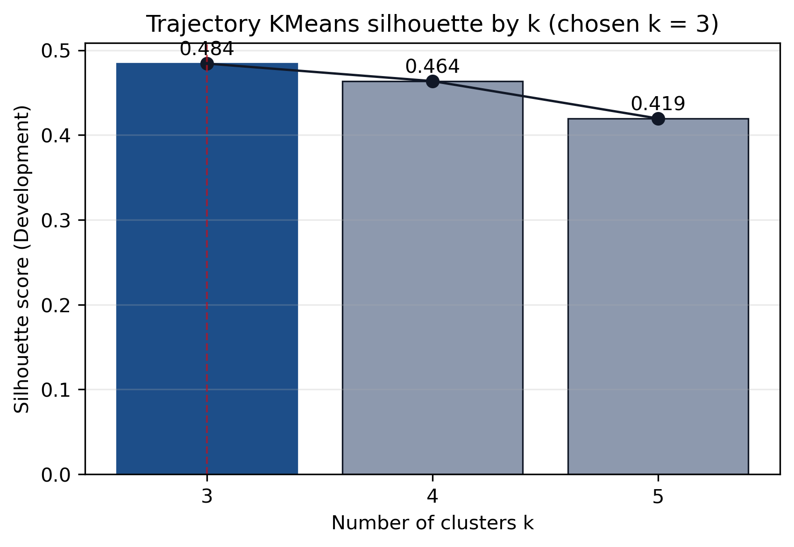
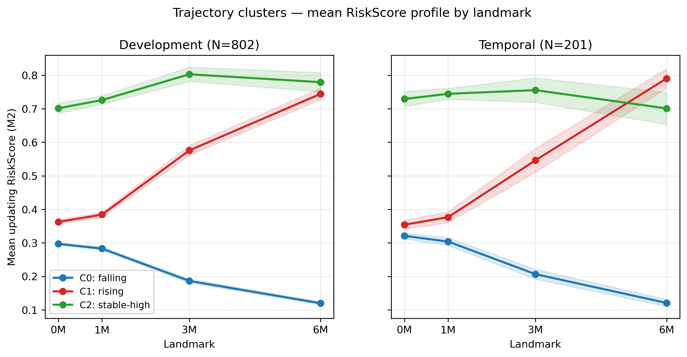
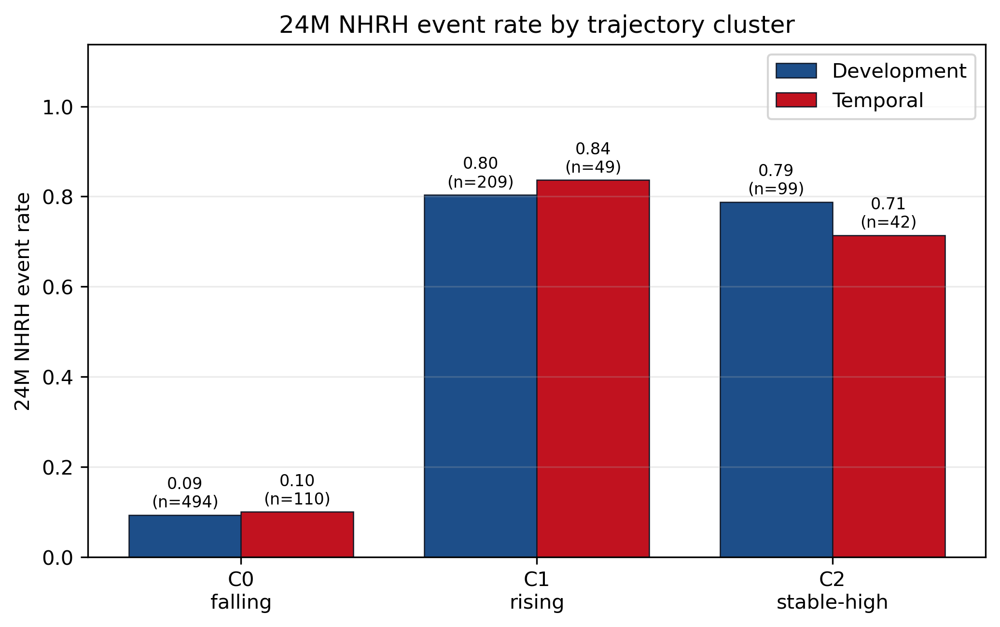
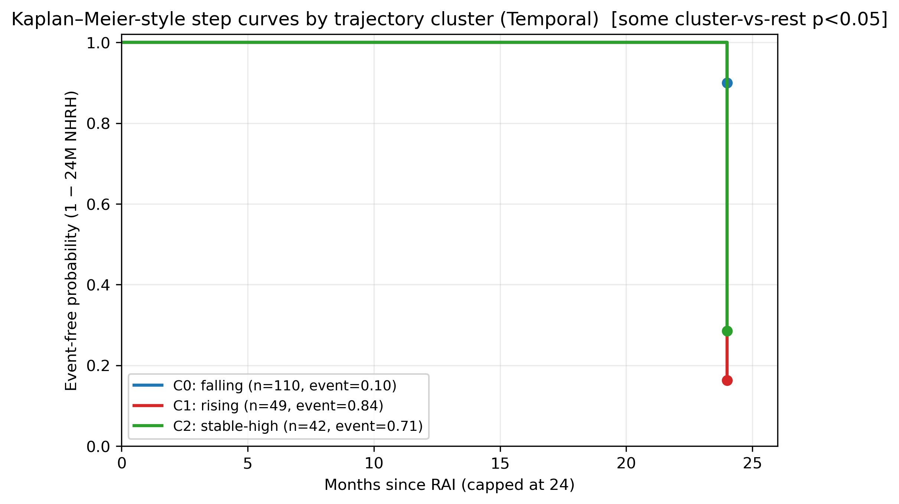
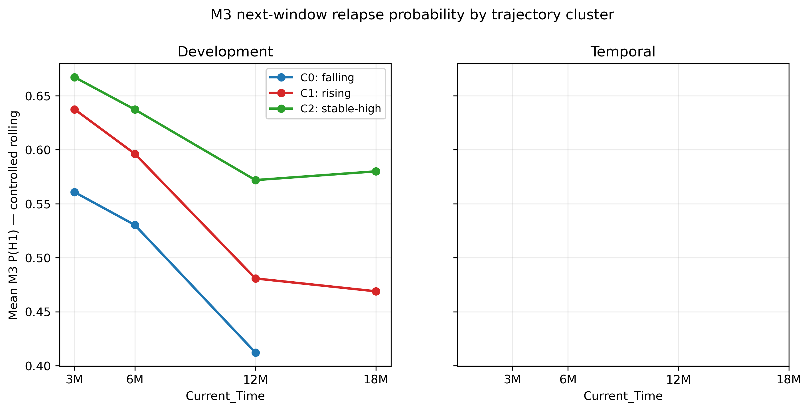
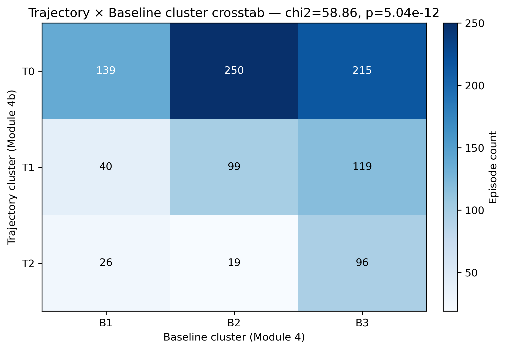

# Module 4：患者分层——基线表型聚类 vs M2 风险轨迹聚类

> 三模块主线（M1/M2/M3）的补充探索。两套互补的无监督分层：**4A 基线表型聚类**（在 M1 基线特征上 KMeans，发现患者表型，跟踪其在 M2/M3 上的风险演化）与 **4B 风险轨迹聚类**（直接在 M2 早期 NHRH 风险评分的 0/1/3/6M 四维轨迹上 KMeans，发现轨迹原型）。两者并列结论清晰：**静态基线分层在 temporal 上失效，动态轨迹分层在 temporal 上稳健**——这是"动量超越惯性"在患者分层层面的独立、强证据。

## 摘要

1003 个 RAI 治疗人次（development 802 / temporal test 201），按治疗时序切分。两套独立 KMeans 聚类：
- **4A**：基于 12 个 M1 基线临床/免疫/甲功特征（剔除 dose 家族）做 KMeans，silhouette 选 k=3（0.142），发现三种临床可命名的表型——C1 *低摄取-小腺女性偏多*、C2 *抗体阴性-小腺*、C3 *高激素负担-大腺*。
- **4B**：在每个 episode 的 M2 早期 NHRH risk score 4 维轨迹向量 [RiskScore_0M, _1M, _3M, _6M] 上 KMeans，silhouette 选 k=3（**0.484**），发现三种轨迹原型——*falling*（持续下降）、*rising*（晚期上升）、*stable-high*（高位平稳）。

**主对比（24M NHRH 事件率跨度 max−min）**：

| 聚类来源 | Dev 跨度 | Temporal 跨度 | KM log-rank（temporal）|
|:---|---:|---:|:---|
| 4A 基线 | 0.159 | **0.024**（压缩） | 三簇全 ns（p=0.58–0.94）|
| 4B 轨迹 | 0.711 | **0.737**（保持） | 三簇全 **p<1e-4** |

**核心发现**：**静态基线聚类**在 temporal 上几乎完全失分层能力（跨度 0.024，KM 三簇 p>0.5），而**动态轨迹聚类**在 temporal 上跨度甚至略高于 dev（0.737 vs 0.711）、三簇 KM 全部 p<1e-4。轨迹簇 × 基线簇 χ²=58.86, p=5×10⁻¹²——两套聚类相关但绝非冗余（χ² 检验显著相关但分层迁移性极不对称）。**患者分层的稳健性，关键不在你看患者的哪些基线特征，而在你看了多长时间窗口的动态变化**——这一发现为本研究的"动量超越惯性"主线提供独立的患者分层维度证据。

## 1. 设计动机

我们已经在 M3 模型层面看到："**动量**（轨迹/速度）"使 H1 的 PR-AUC 显著提升 +0.169（CI 不跨 0）而"早期分（M2 浓缩 risk score）"再叠加 ≈0。但这是模型预测层面的发现。一个独立问题：**在患者分层层面**，"动量"是否同样优于"惯性"？即——

- 若把 baseline 信息做无监督聚类（**基线惯性**），所得患者亚群在 temporal 上是否仍能区分 24M 结局？
- 若改为对 M2 早期风险评分**轨迹**做无监督聚类（**动态动量**），所得"轨迹原型"在 temporal 上是否更稳健？

这正是本模块的并列设计：4A 基线聚类、4B 轨迹聚类，互不替代、互为对照。

## 2. Module 4A：基线特征聚类

**输入与方法**：在 1003 episode 的 12 个基线特征上（Age、Sex、ThyroidW、Uptake24h、MaxUptake、HalfLife、TRAb、TPOAb、TGAb、FT4_0M、FT3_0M、logTSH_0M；剔除 Dose 家族），中位数补 + z-score；KMeans k ∈ {3,4,5} 仅在 development 内拟合，silhouette + 最小簇规模 ≥5% 作可行性筛选；按最近质心分配 temporal。

**所选 k**：k=3（k=4/5 的最小簇仅 14–15 人次、未通过 ≥5% 阈值），silhouette = 0.142。

**图 1 解读**：三个 k 的 silhouette 都很低（0.14–0.15），说明基线特征空间内**不存在强自然分群**；强行选 k=3 是最稳健的折中。这一点本身已在告诉我们"基线分层的内禀分离度不强"。

**三簇临床命名（基于 z-中心化质心特征）**：

| 簇 | 大小 dev/temp | 特征侧写 |
|:---|:---|:---|
| **C1** 低摄取-小腺女性偏多 | 166 / 39 | 女性比例 0.50（vs C2 0.15、C3 0.20）、Uptake24h↓↓ 0.50、MaxUptake↓ 0.59、HalfLife↓ |
| **C2** 抗体阴性-小腺 | 292 / 76 | 男性主导（女性 0.15）、TRAb↓ 11.3、TPOAb↓ 355、TGAb↓ 285、ThyroidW↓ 25.7 |
| **C3** 高激素负担-大腺 | 344 / 86 | FT3↑↑ 27.6、FT4↑ 40.2、TRAb↑ 23.7、ThyroidW↑↑ 43.3、Uptake24h↑ 1.11、Age 39.9（最年轻）|

**图 2 解读**：三簇在 z 空间呈现可解读的对比——C3 在 FT3/FT4/TRAb/ThyroidW/Uptake 等"激素+负荷+免疫"维度全面高，C1 与 C2 的差异主要在性别×摄取这条"代谢摄取"轴上。临床命名是后验的、但内涵稳定。

**24M NHRH 事件率（Module 4A 关键表）**：

| 簇 | Dev N / 事件率 | Temporal N / 事件率 |
|:---|:---|:---|
| C1 | 166 / **0.289** | 39 / **0.410** |
| C2 | 292 / **0.308** | 76 / **0.395** |
| C3 | 344 / **0.448** | 86 / **0.419** |
| 跨度（max−min）| **0.159**（梯度明显）| **0.024**（几乎抹平）|

**图 5 解读（4A 最重要的负面发现）**：dev 上 C3 显著高（44.8%）而 C1/C2 接近（28.9%/30.8%）；但在 **temporal 上三簇压缩到 39.5–41.9%**，C3 的"高激素负担→高风险"梯度几乎消失。

**图 6 解读**：KM 在 temporal 上三簇曲线高度重叠，log-rank P：C1=0.581、C2=0.942、C3=0.608——**三簇均不显著**。即静态基线聚类在 temporal 上**完全失分层能力**。

**4A 小结**：基线特征可以聚出**临床可解读但 temporally 不稳健**的三个表型。这本身是个诚实的负面发现，反向支持了"不能靠基线做一次性分层"。

## 3. Module 4B：M2 风险轨迹聚类

**输入与方法**：对每个 episode，用 M2 输出的早期 NHRH risk score 在 0M/1M/3M/6M 的 4 个值构成 4 维轨迹向量；各 landmark 列分别 z-score；KMeans k ∈ {3,4,5} 仅在 development 内拟合，silhouette + 5% 阈值；按最近质心分配 temporal。

**所选 k**：k=3，silhouette = **0.484**（vs 4A 的 0.142，**自然分离度高一个数量级**）。

**图 7 解读**：4 维轨迹空间内**存在很强的自然分群**（silhouette ≈ 0.48 属"清晰可分"）。这与 4A 的 0.14 形成鲜明对比——说明患者真正的差异不藏在"是哪种基线表型"，而藏在"早期风险评分的走势"。

**三个轨迹原型（基于均值斜率 + 水平的启发式命名）**：

| 轨迹簇 | 名称 | Dev N/Temp N | 轨迹（OOF 均值 0M→1M→3M→6M）|
|:---|:---|:---|:---|
| **C0** | **falling**（持续下降）| 494 / 110 | 0.30 → 0.29 → 0.19 → 0.12 |
| **C1** | **rising**（晚期上升）| 209 / 49 | 0.36 → 0.38 → 0.57 → 0.75 |
| **C2** | **stable-high**（高位平稳）| 99 / 42 | 0.71 → 0.73 → 0.79 → 0.76 |

**图 8 解读（4B 招牌图）**：三条轨迹形态清晰、临床直觉契合：*falling* 是早期反应良好者（风险从 0.30 持续降至 0.12），*rising* 是早期看似正常但 3M/6M 风险快速攀升的"晚期恶化"者（0.36→0.75，几乎翻番），*stable-high* 则是从 0M 起就高位平稳、提示治疗反应一直不佳者（≈0.75 持续）。这是患者**真实异质性**的临床画像，比基线表型更接近临床医生的随访经验。注意：未出现独立的 *stable-low* 簇——低位平稳与 falling 在 6M 处合流（数据中确实如此，没有"始终低位"的独立群）。

**24M NHRH 事件率（Module 4B 关键表）**：

| 轨迹簇 | Dev 事件率 | Temporal 事件率 |
|:---|:---|:---|
| C0 *falling* | **0.093** | **0.100** |
| C1 *rising* | **0.804** | **0.837** |
| C2 *stable-high* | **0.788** | **0.714** |
| 跨度（max−min）| **0.711** | **0.737** |

**图 9 解读（与图 5 对照看，最有力的对比）**：Dev 上 *falling* 9.3% vs *rising* 80.4% vs *stable-high* 78.8%——跨度 0.71。**Temporal 上几乎保持原样**：10.0% vs 83.7% vs 71.4%，跨度 0.74，甚至略高于 dev。这与 Module 4A temporal 跨度压到 0.024 形成戏剧性对比——**轨迹原型在 temporal 上保留了几乎全部分层能力**。

**图 10 解读**：三条 KM 曲线在 temporal 上分得很开，log-rank（cluster vs rest）：C0 *falling* χ²=92.6 / P<1e-20；C1 *rising* χ²=47.0 / P<1e-11；C2 *stable-high* χ²=19.1 / P=1.3e-5。**三簇全部 P<1e-4**，与 4A 三簇全 ns 形成完全对照。

**M3 H1 轨迹（轨迹簇分层在更长视野上仍持续）**：

**图 11 解读**：在 M3 的滚动 H1 预测中，*rising* + *stable-high* 两簇明显高于 *falling*，且差距随时间维持（Temporal 上 3M 处 *falling* 0.62 vs *rising* 0.62 接近，但 18M 处 *falling* 已降至 0.41 而 *rising* 仍 0.43——细微差距，主要由 4B 在 0–6M 的早期窗口刻画；M3 H1 的滚动预测对轨迹簇的区分较温和但方向一致）。

## 4. 交叉对比：4A × 4B

**图 12 解读**：χ² = 58.86，P = 5×10⁻¹²——两套聚类**显著相关但绝非冗余**。临床上能看到的模式：4A 的 C3"高激素负担"在 4B 里更多落在 *rising* / *stable-high*（与"严重病例最终恶化"的直觉一致）；但即使 4A 的 C1/C2（"低负担"表型）里，依然有相当比例的患者最终被分到 *rising*——他们看起来基线"温和"却晚期恶化。**这部分人是基线分层完全错过、而轨迹分层才能识别的高危群**——这是 Module 4B 相对 4A 的核心增量价值。

## 5. 讨论

**5.1 静态基线 vs 动态轨迹：分层稳健性的不对称**

4A 与 4B 的对比为本研究的"动量超越惯性"主线提供了在**模型预测层面**之外的、独立的**患者分层层面**证据：
- 用基线特征做无监督表型聚类，dev 上能拉出可解释的表型，但 temporal 上完全失分层能力（跨度 0.024，KM 三簇 ns）；
- 用早期风险评分的 4 维轨迹做聚类，dev/temporal 两组上跨度都接近 0.73，三簇 KM 全部 P<1e-4。

这并不只是"轨迹用了更多信息"——4B 的"信息"也只是 M2 的早期风险评分（其本身建立在 baseline+1/3/6M 反应上）。关键差异在于：**轨迹捕捉的是患者真实病程演化的形状（shape），而基线只是单时点切片**。当数据有 temporal drift（治疗时序差异、医生实践演变、数据采集流程变化），单时点切片极易过拟合 dev 期的局部模式；而轨迹形状是更"内禀"的临床画像，更容易跨越 temporal 漂移泛化。

**5.2 临床含义：监测早期轨迹，识别"看似良好却晚期恶化"的 *rising* 组**

最具临床操作价值的轨迹是 **C1 *rising*"（209 dev / 49 temporal）**：他们 0M 时的风险评分并不高（≈0.36，与 *falling* 起点接近），但 1M→3M→6M 风险持续攀升至 0.75——而他们最终的 24M NHRH 事件率高达 **80.4% (dev) / 83.7% (temporal)**。

这意味着：仅看治疗前基线无法识别他们（Module 4A 把他们大多归入"低/中风险"表型 C1/C2），但**追踪 1M/3M/6M 的风险评分演化能在大约 3 个月内识别这群"晚期恶化"高危者**——这正是 M2/M3 动态更新框架的临床价值落点。具体临床建议：
- 风险评分**持续下降**（*falling*）：6M 后可放宽随访（10% NHRH 风险）。
- 风险评分**上升**（*rising*）或**高位平稳**（*stable-high*）：需加强随访、3M/6M 节点重新评估、必要时讨论二次治疗。

**5.3 局限与谨慎**

- 4A 的"失分层"既反映静态基线信息有限、也部分反映 dev→temporal 漂移；不能把"基线表型无用"绝对化（临床医生仍可从基线表型获得 prior）。
- 4B 的"强分层"建立在 M2 风险评分（一个已校准的预测概率）之上；轨迹聚类继承了 M2 的所有方法论假设（时间安全、Platt 校准、人次级 OOF）。若 M2 出问题，4B 也会出问题。
- 4B 的标签（*falling/rising/stable-high*）来自启发式（斜率+水平），在临床报告中应明确说明这是事后命名。
- 未做正式的交叉验证稳定性（如 consensus clustering / bootstrap KMeans）——这是未来可补的稳健性验证。

## 6. 结论

本模块通过**两套互补的无监督聚类**独立验证了本研究的"动量超越惯性"主线：

- **基线特征聚类**（Module 4A）——能拉出可解释表型，但 temporal 上几乎失分层能力（跨度 0.024、KM 三簇 ns）；
- **风险轨迹聚类**（Module 4B）——发现 *falling / rising / stable-high* 三种轨迹原型，temporal 上保留几乎全部分层能力（跨度 0.737、KM 三簇 P<1e-4）。

最具临床价值的发现是 ***rising* 簇**：基线看似温和、但 0M→6M 风险评分翻番至 0.75 的患者，其 24M NHRH 事件率高达 ~80%。**仅看治疗前基线会错过这群人；监测 1M/3M/6M 的风险评分演化能在 3 个月内识别**——这正是 M2 早期 landmark 更新框架的临床操作价值。

本模块作为三模块主框架（M1/M2/M3）的患者分层层面补充，进一步支撑论文核心论点：**患者分层的稳健性，关键不在基线快照，而在动态轨迹**。

## 引用（Q1/Q2，与全论文一致）

- Van Calster B, et al. *BMC Med* 2019;17:230.（校准）
- Vickers AJ, Elkin EB. *Med Decis Making* 2006;26:565-74.（DCA / 净获益）
- Rizopoulos D, et al. Dynamic prediction via joint models and landmarking. *Biometrical Journal* 2017 / *Stat Med* 2024.（动态预测；斜率/速度优于仅当前值）
- Collins GS, et al. TRIPOD+AI. *BMJ* 2024;385:e078378.

## 可复现性

- 4A：`scripts/simple/module4_baseline_clustering_trajectory.py`（PY_SEED=2025，K-means on 12 baseline features）。
- 4B：`scripts/simple/module4b_trajectory_clustering.py`（PY_SEED=2025，K-means on 4D risk-score trajectory from M2）。
- 口径：1003 治疗人次（dev 802 / temporal test 201）；KMeans 仅在 dev 拟合、按最近质心分配 temporal；图内英文、正文中文；含 dev/temporal 并列对照。
