# 固定 Landmark 甲亢结局预测报告

## 摘要

### 研究亮点

**方法学与实现亮点**

- **严格时间外推验证**：患者顺序 temporal split，阈值和模型选择不看 temporal test，降低回顾性数据中常见的信息泄漏风险。
- **Landmark-safe 预处理**：缺失值使用 MissForest 条件插补，并且只在开发集拟合；3M 模型只插补 3M 及以前变量，6M 模型只插补 6M 及以前变量，避免未来随访信息进入当前 landmark。
- **患者级分组验证**：内部模型选择使用 patient-level GroupKFold / OOF 预测，同一患者不会同时出现在训练折和验证折，适配 RAI 随访记录存在同患者多治疗轮次与重复观测的特点。
- **阈值开发集锁定**：classification threshold 由 OOF / development prediction 决定，temporal test 只套用固定阈值；因此 accuracy、F1、sensitivity、specificity 不是 test-set 调参后的结果。
- **稳定性筛选而非单次筛选**：3M 特征不是一次性全数据挑选，而是结合 clinical core、Elastic-net LR、LightGBM importance 和 permutation importance 的 train-only 稳定性筛选，保留同时有医学意义和统计稳定性的变量。
- **多模型 benchmark 完整**：同时比较 Logistic Regression、Elastic-net LR、SVM、Random Forest、Balanced RF、ExtraTrees、LightGBM、MLP、blend、cascade / routed specialist 等模型族，避免只展示单一模型的偶然最优。
- **重复 seed 稳定性验证**：主性能候选 LGBM 使用 30 个随机种子聚合，报告 mean / std，而不是只取单 seed 最高分。
- **校准与判别并重**：除 AUC / PR-AUC 外，系统报告 Brier score、calibration intercept / slope、calibration curve 与 isotonic / Platt calibration，强调概率是否可信而不只是排序是否好。
- **临床效用分析闭环**：引入 DCA / net benefit 和 threshold sensitivity，展示不同风险阈值下模型相对 treat-all / treat-none 的潜在临床净获益。
- **可解释主线与性能主线分离**：top25 LGBM 作为主性能候选；sparse Elastic LR 作为可解释/校准主线，只有 `13` 个非零变量，便于写成 nomogram、OR 表和临床风险因子表。
- **错误分析可审计**：不只给总体分数，还输出 FP / FN / TP / TN 错题本、错误组特征画像和单例线性贡献，使模型失误能够被逐例复盘。
- **解释图谱齐全**：树模型提供 SHAP summary / bar；线性模型提供 coefficient、OR forest、nomogram-style points 和 local contribution，兼顾黑箱性能与临床可读性。
- **探索性结果与正式报告分离**：accuracy ceiling、test-aware probe、routed specialist 等用于理解上限；正式候选仍按 development / OOF 规则解释，避免把探索性结果包装成严格模型选择。

**特征工程与临床信号亮点**

- **3M 早期反应已经可用**：只用 baseline、1M、3M 信息，3M 二分类测试集 Acc 约 `0.82`、AUC 约 `0.86`、PR-AUC 约 `0.76`，说明 RAI 后 3M 的早期治疗反应已经携带强预后信号。
- **6M 形成更强证据链**：6M 二分类最佳 AUC 达 `0.911`，验证“随访证据积累越多，Hyper vs non-Hyper 判别越稳定”的临床直觉。
- **RAI 剂量-摄取-甲状腺负荷机制特征**：显式构造 `IDPG_Dose_per_ThyroidW`、`Dose_x_Uptake24h`、`Dose_x_HalfLife`、`Estimated_TID_Dose_x_Uptake24h_x_HalfLife` 等变量，把“给了多少碘、吸收了多少、甲状腺负荷多大”转化为可学习的疗效信号。
- **早期治疗反应特征**：除当前 FT3 / FT4 / TSH 外，还加入 0M 到 3M 百分比下降、近期差值、均值、标准差、FT3/FT4 比值、FT4/(TSH+1) 比值等，捕捉“是否真正从甲亢轨道下行”。
- **抗体与甲状腺功能交互**：构造 `TRAb_x_FT3_last`、`ThyroidW_x_FT3_last` 等交互项，表达免疫活性、甲状腺负荷与当前激素水平共同决定持续甲亢风险。
- **临床核心变量强制保留**：FT3、FT4、TSH、ThyroidW、RAI uptake、HalfLife、IDPG、早期下降幅度等核心变量不会因为一次筛选波动被轻易丢弃，增强可解释性和可重复性。
- **单变量与多变量同时呈现**：报告单个特征的 temporal-test benchmark，同时展示多变量 LGBM / sparse LR 的综合提升，说明模型不是单一 FT3 或 TSH 阈值的简单替代。
- **二分类与三分类并行**：主文用 Hyper vs non-Hyper 对齐临床疗效预测和文献常见终点；补充三分类 Hyper / Normal / Hypo，不合并 Normal 与 Hypo，展示更细粒度状态判别能力。
- **报告闭环完整**：不只报 AUC，还系统给出 PR-AUC、混淆矩阵、PPV/NPV、Brier、calibration、DCA、SHAP/系数解释、阈值敏感性、错题本、单变量 benchmark 和特征中文释义附录。

本报告是当前 fixed-landmark 结果的唯一主报告，合并原先 `landmark_focus` 与 `3M-only` 两份 README。3M-only 目录仍保留数据缓存和实验表，但不再单独维护 README，避免两个版本分叉。

LR 扫描已经完成。3M 二分类里，最强 LR accuracy probe 在时间外推测试集达到 Acc `0.822`；但综合 AUC、PR-AUC、30 个随机种子的稳定性和主性能定位，当前主候选仍然是锁定的 top25 LightGBM。

当前最强 fixed-landmark 结果如下：

- 3M 二分类 accuracy ceiling：`LGBM top25`，Acc `0.822`，AUC `0.860`，PR-AUC `0.761`。
- 3M 二分类稳健 LGBM：30-seed 平均 Acc `0.822`，AUC `0.859`，PR-AUC `0.764`，Brier `0.150`。
- 6M 二分类最佳 AUC：`Random Forest`，AUC `0.911`，Acc `0.837`。
- 6M 二分类最佳 Acc：`Elastic LR`，Acc `0.846`，AUC `0.895`。
- 3M 三分类最佳 temporal macro AUC `0.804`，Acc `0.663`。
- 6M 三分类最佳 temporal macro AUC `0.848`，Acc `0.721`。

## 任务定义

```text
3M 二分类：
  输入 = baseline/static + 1M + 3M 化验 + early response / RAI physiology 特征
  目标 = final Hyper vs non-Hyper
  开发集 = 795 条治疗记录，Hyper = 259
  时间外推测试集 = 208 条治疗记录，Hyper = 80，prevalence = 0.385

6M 二分类：
  输入 = baseline/static + 0M/1M/3M/6M 信息
  目标 = final Hyper vs non-Hyper

3M / 6M 三分类：
  类别 = Hyper / Normal / Hypo
  指标 = macro OVR AUC、macro PR-AUC、accuracy、balanced accuracy、macro F1
```

阈值只在 development / OOF 或锁定配置中确定。Temporal test 只用于最终报告，不参与模型选择。

## 3M 二分类：LR vs LGBM

### 时间外推测试集 15 项核心指标

| Model | Feature_Count | N | Events | Prevalence | Threshold | TP | FP | TN | FN | ROC_AUC | PR_AUC | PR_AUC_Lift | Accuracy | Sensitivity_Recall | Specificity | PPV_Precision | NPV | F1 | Balanced_Accuracy | Brier | Calibration_Intercept | Calibration_Slope |
| --- | --- | --- | --- | --- | --- | --- | --- | --- | --- | --- | --- | --- | --- | --- | --- | --- | --- | --- | --- | --- | --- | --- |
| LR sparse stable | 22 | 208 | 80 | 0.385 | 0.330 | 60 | 18 | 110 | 20 | 0.854 | 0.759 | 1.974 | 0.817 | 0.750 | 0.859 | 0.769 | 0.846 | 0.759 | 0.805 | 0.147 | 0.065 | 0.834 |
| LR interaction Acc | 18 | 208 | 80 | 0.385 | 0.370 | 64 | 21 | 107 | 16 | 0.847 | 0.743 | 1.932 | 0.822 | 0.800 | 0.836 | 0.753 | 0.870 | 0.776 | 0.818 | 0.162 | 0.236 | 1.085 |
| LGBM top25 | 25 | 208 | 80 | 0.385 | 0.360 | 65 | 22 | 106 | 15 | 0.860 | 0.761 | 1.979 | 0.822 | 0.812 | 0.828 | 0.747 | 0.876 | 0.778 | 0.820 | 0.149 | 0.293 | 1.111 |

Bootstrap 95% CI 保存在 `tables/3m_lr_lgbm_bootstrap_ci.csv`。

### 30-seed LGBM 稳定性

上表的 LGBM 行使用一个代表 seed 生成 ROC / PR / SHAP 等图。模型选择和稳定性判断使用 30-seed 聚合结果：

| N_Seeds | OOF_AUC | OOF_Accuracy | Test_AUC | Test_PR_AUC | Test_Brier | Test_Accuracy | Std_Test_Accuracy | Test_Recall | Test_Specificity | Test_F1 | Test_BalancedAccuracy |
| --- | --- | --- | --- | --- | --- | --- | --- | --- | --- | --- | --- |
| 30 | 0.842 | 0.768 | 0.859 | 0.764 | 0.150 | 0.822 | 0.005 | 0.811 | 0.829 | 0.778 | 0.820 |

解释：LR 在固定阈值 accuracy 上可以追平或略微挑战 LGBM，但 top25 LGBM 的 30-seed AUC / PR-AUC 更高，accuracy 也稳定，因此更适合作为 3M 二分类主性能模型。

### 对比图

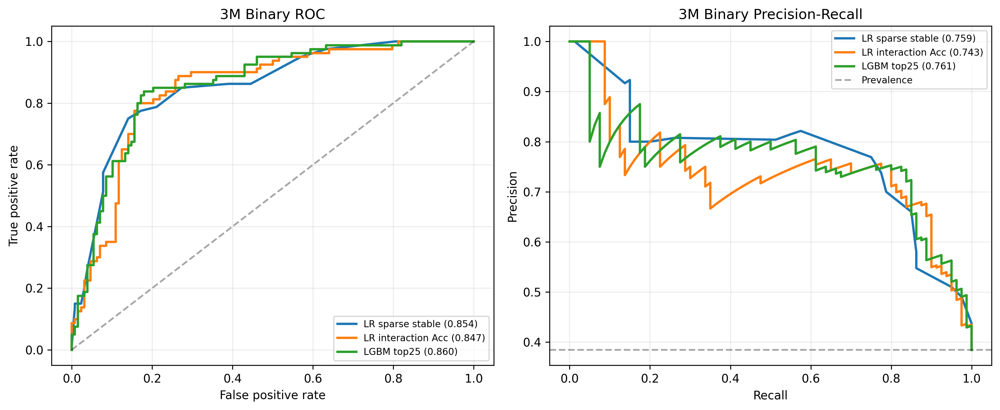

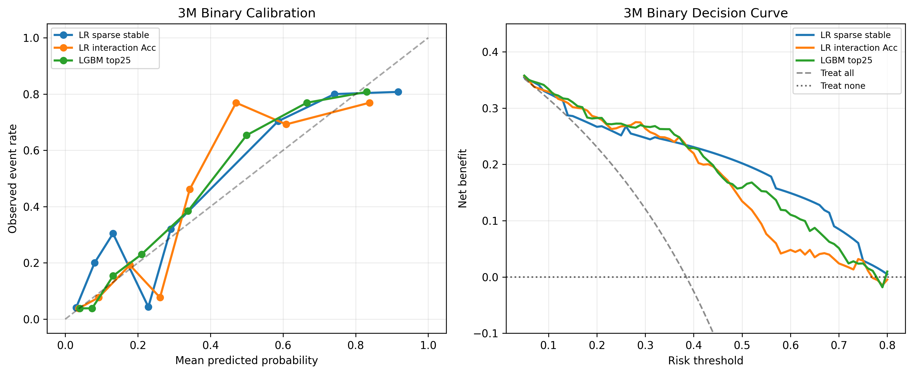

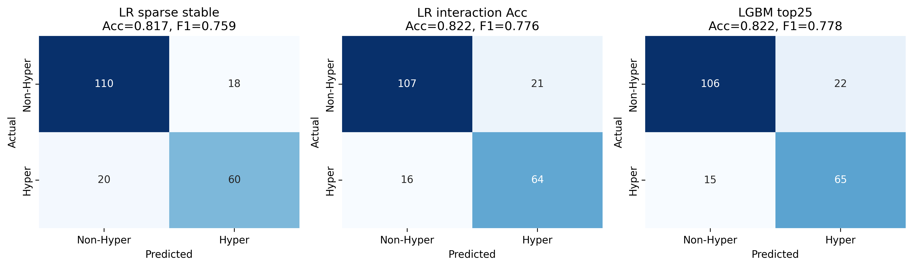

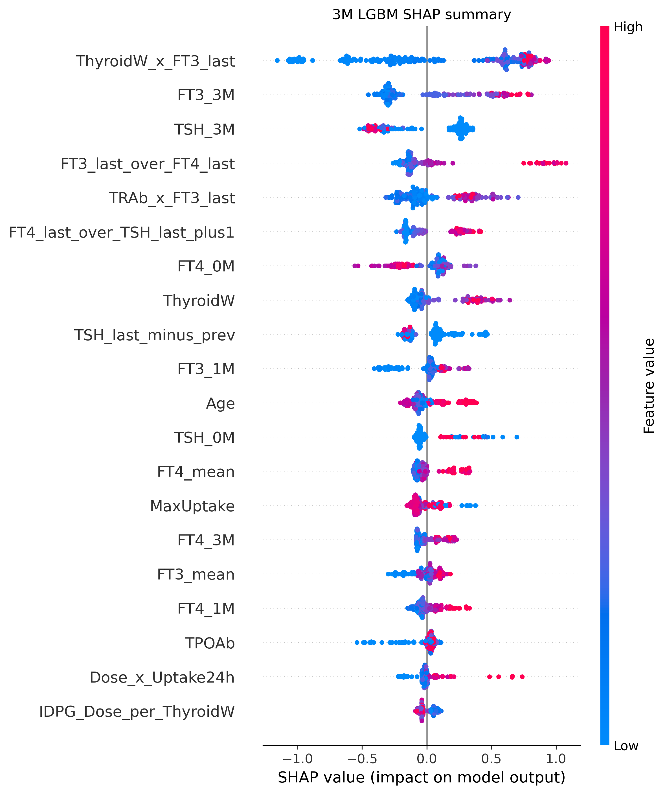

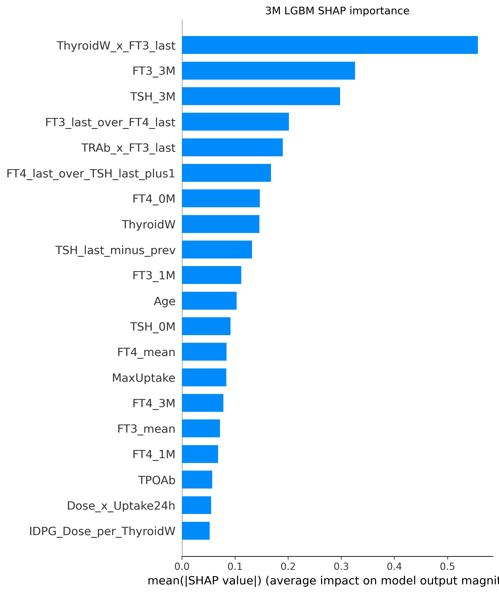

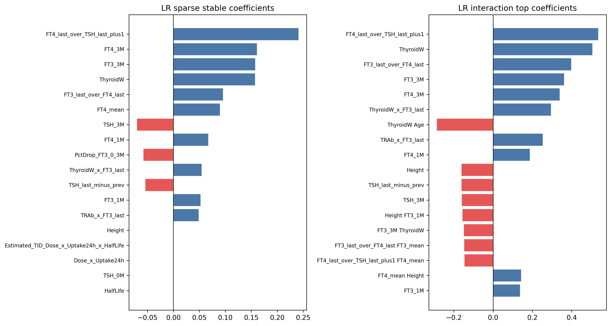

### 3M 图表完整性核查

3M 二分类主线的关键医学预测图表已经齐全。树模型解释使用 SHAP summary 和 mean(|SHAP|) 条形图；线性解释使用 sparse Elastic LR 的系数、OR forest、nomogram-style points 和局部贡献图。DCA、calibration、threshold sensitivity、confusion matrix、错题本和单变量 benchmark 均已落盘并在正文引用。

| 模块 | 状态 | 正文/文件位置 |
| --- | --- | --- |
| ROC / PR curve | 已包含 | `figures/Figure_3M_LR_vs_LGBM_ROC_PR.png` |
| Calibration + DCA | 已包含 | `figures/Figure_3M_LR_vs_LGBM_Calibration_DCA.png`、`figures/Figure_LR_Sparse_Calibration_DCA.png` |
| Confusion matrix | 已包含 | `figures/Figure_3M_LR_vs_LGBM_Confusion.png` |
| LGBM SHAP summary | 已包含 | `figures/Figure_3M_LGBM_SHAP_Summary.png` |
| LGBM SHAP bar | 已包含 | `figures/Figure_3M_LGBM_SHAP_Bar.png` |
| Sparse LR coefficient / OR / nomogram | 已包含 | `figures/Figure_3M_LR_Coefficients.png`、`figures/Figure_LR_Sparse_OR_Forest.png`、`figures/Figure_LR_Sparse_OR_Nomogram.png` |
| Threshold sensitivity | 已包含 | `figures/Figure_LR_Sparse_Threshold_Sensitivity.png` |
| Error casebook / error profile | 已包含 | `tables/3m_lr_sparse_error_casebook.csv`、`figures/Figure_LR_Sparse_Error_Profile.png` |
| Single-feature benchmark | 已包含 | `tables/3m_lr_sparse_single_feature_benchmarks.csv`、`figures/Figure_LR_Sparse_Single_Feature_Benchmarks.png` |
| Feature dictionary | 已包含 | 文末“附录：特征名中文释义”与 `tables/feature_name_chinese_appendix.csv` |

## Sparse Elastic LR 可解释模型线

Sparse Elastic LR 是最适合作为论文可解释模型的 3M 线：`22` 个输入变量、`13` 个非零 elastic-net 系数、isotonic calibration，temporal-test Brier 为 `0.147`。线性系数按标准化后的特征解释；isotonic calibrator 再把原始 LR 分数映射成校准后的概率。

### 13 个非零变量

Elastic-net 的作用不是把 22 个输入全部硬塞进解释模型，而是在保留候选变量池的同时把弱变量系数压到 0。最终 `13` 个非零变量如下：

| Feature | 中文含义 | Coefficient_per_1SD | OR_per_1SD | Nomogram_Points_per_1SD | 风险方向 |
| --- | --- | --- | --- | --- | --- |
| FT4_last_over_TSH_last_plus1 | 当前 landmark FT4 / (TSH + 1) 比值 | 0.241 | 1.272 | 100.000 | 数值越高，Hyper 风险越高 |
| FT4_3M | 3M 时点 游离甲状腺素 FT4 | 0.161 | 1.175 | 66.848 | 数值越高，Hyper 风险越高 |
| FT3_3M | 3M 时点 游离三碘甲状腺原氨酸 FT3 | 0.157 | 1.170 | 65.338 | 数值越高，Hyper 风险越高 |
| ThyroidW | 甲状腺重量/体积负荷 | 0.157 | 1.170 | 65.244 | 数值越高，Hyper 风险越高 |
| FT3_last_over_FT4_last | 当前 landmark FT3 / FT4 比值 | 0.095 | 1.100 | 39.593 | 数值越高，Hyper 风险越高 |
| FT4_mean | 截至当前 landmark 的 游离甲状腺素 FT4 均值 | 0.090 | 1.094 | 37.247 | 数值越高，Hyper 风险越高 |
| TSH_3M | 3M 时点 促甲状腺激素 TSH | -0.070 | 0.932 | 29.065 | 数值越高，Hyper 风险越低 |
| FT4_1M | 1M 时点 游离甲状腺素 FT4 | 0.067 | 1.069 | 27.871 | 数值越高，Hyper 风险越高 |
| PctDrop_FT3_0_3M | FT3_0_3M 的百分比下降幅度 | -0.058 | 0.944 | 23.951 | 数值越高，Hyper 风险越低 |
| ThyroidW_x_FT3_last | 甲状腺重量/体积负荷 与 当前 landmark 的 游离三碘甲状腺原氨酸 FT3 的乘积交互 | 0.054 | 1.056 | 22.606 | 数值越高，Hyper 风险越高 |
| TSH_last_minus_prev | 当前 landmark TSH 减去上一个随访时点 TSH | -0.054 | 0.948 | 22.382 | 数值越高，Hyper 风险越低 |
| FT3_1M | 1M 时点 游离三碘甲状腺原氨酸 FT3 | 0.052 | 1.054 | 21.664 | 数值越高，Hyper 风险越高 |
| TRAb_x_FT3_last | 促甲状腺激素受体抗体 与 当前 landmark 的 游离三碘甲状腺原氨酸 FT3 的乘积交互 | 0.048 | 1.050 | 20.126 | 数值越高，Hyper 风险越高 |

完整非零变量表保存在 `tables/3m_lr_sparse_nonzero_coefficients.csv`。

### 系数、OR 与 nomogram-style points

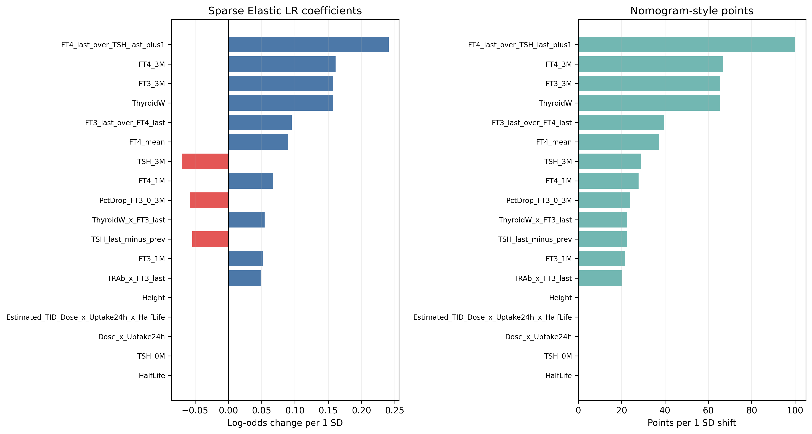

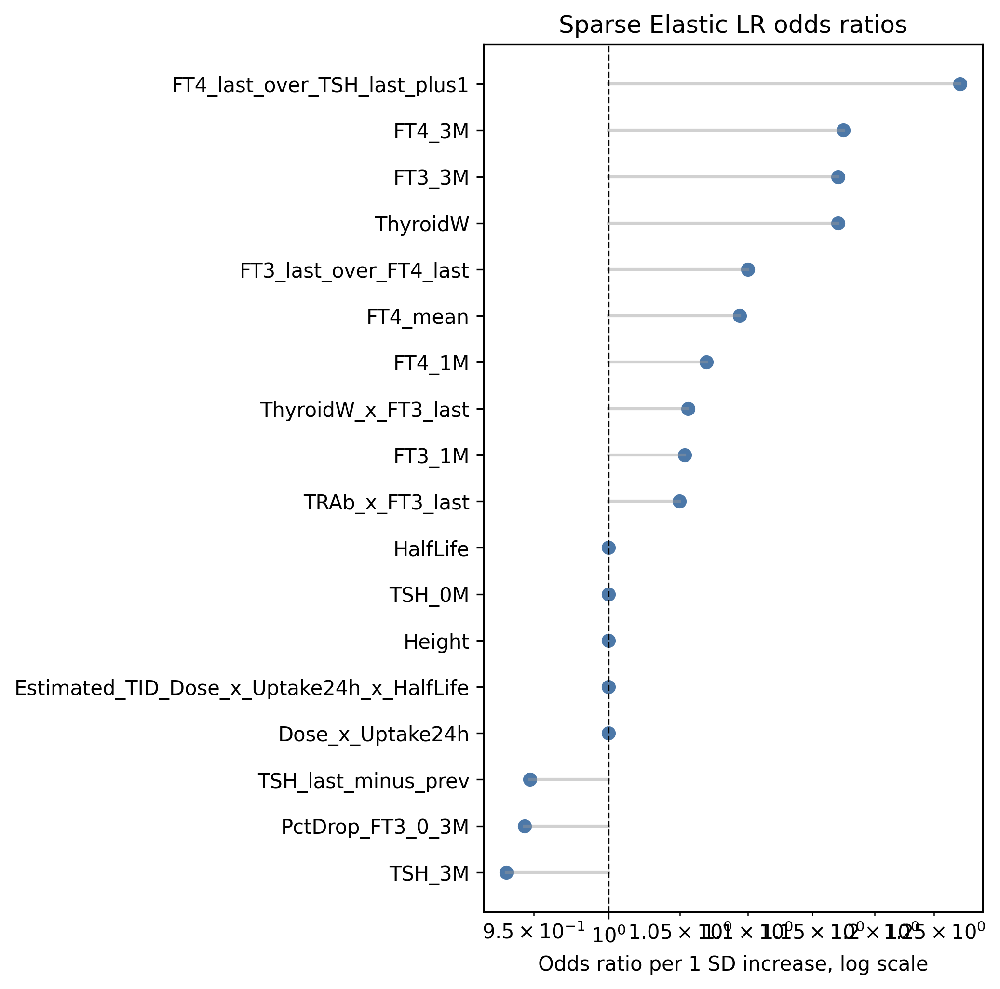

### 校准、DCA 与阈值敏感性

校准分箱表保存在 `tables/3m_lr_sparse_calibration_bins.csv`；阈值敏感性表保存在 `tables/3m_lr_sparse_threshold_sensitivity.csv`。

| Risk_Decile | N | Events | Mean_Predicted_Risk | Observed_Risk | Min_Predicted_Risk | Max_Predicted_Risk |
| --- | --- | --- | --- | --- | --- | --- |
| 1 | 21 | 0 | 0.026 | 0.000 | 0.000 | 0.030 |
| 2 | 21 | 2 | 0.033 | 0.095 | 0.030 | 0.033 |
| 3 | 21 | 3 | 0.074 | 0.143 | 0.033 | 0.132 |
| 4 | 20 | 6 | 0.132 | 0.300 | 0.132 | 0.143 |
| 5 | 21 | 1 | 0.232 | 0.048 | 0.143 | 0.250 |
| 6 | 21 | 7 | 0.281 | 0.333 | 0.250 | 0.323 |
| 7 | 20 | 11 | 0.505 | 0.550 | 0.323 | 0.565 |
| 8 | 21 | 16 | 0.668 | 0.762 | 0.565 | 0.742 |
| 9 | 21 | 17 | 0.761 | 0.810 | 0.742 | 0.824 |
| 10 | 21 | 17 | 0.939 | 0.810 | 0.824 | 1.000 |

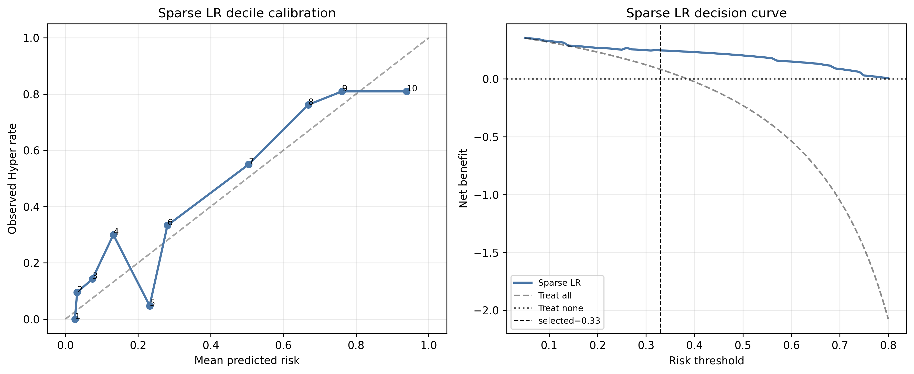

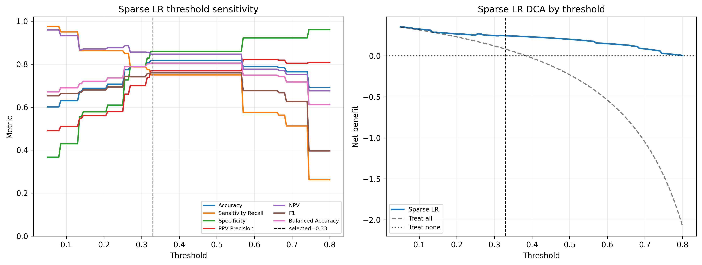

### 风险分布与错题本

完整 patient-level 错题本保存在 `tables/3m_lr_sparse_error_casebook.csv`，包含 Patient_ID、真实标签、预测标签、概率、TP/FP/FN/TN 分组，以及该患者最主要的正向和负向线性贡献项。

| Error_Group | N | Events | Mean_Probability | Median_Probability |
| --- | --- | --- | --- | --- |
| FN | 20 | 20 | 0.184 | 0.132 |
| FP | 18 | 0 | 0.707 | 0.742 |
| TN | 110 | 0 | 0.129 | 0.106 |
| TP | 60 | 60 | 0.758 | 0.742 |

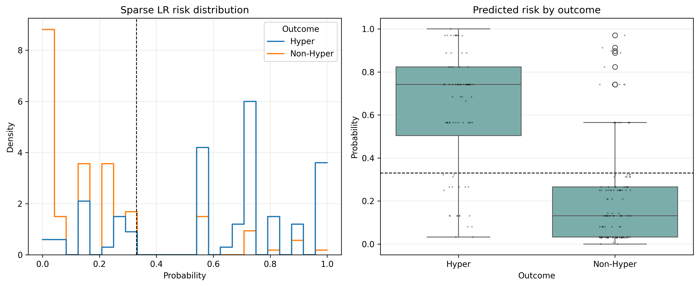

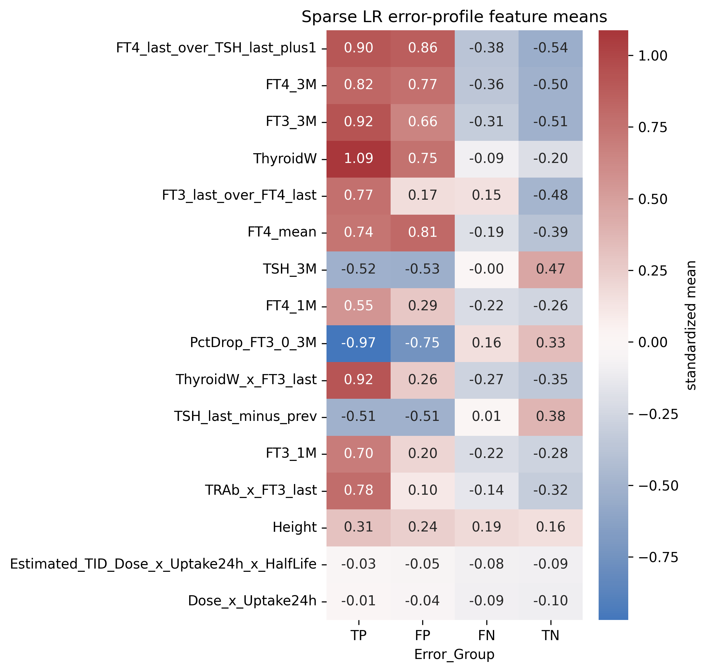

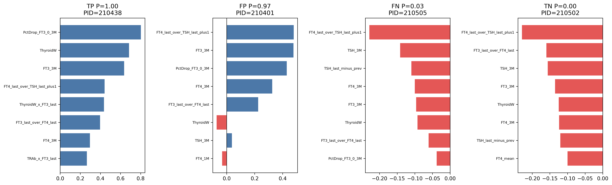

### 单变量 benchmark

这张表不用于模型选择，只用于描述每个 LR 输入变量单独在 temporal test 上能做到什么程度；方向只用于描述性 benchmark。

| Feature | Risk_Direction | ROC_AUC_directional | PR_AUC_directional | Mean_Hyper | Mean_NonHyper |
| --- | --- | --- | --- | --- | --- |
| ThyroidW_x_FT3_last | higher | 0.832 | 0.770 | 597.029 | 149.922 |
| FT3_3M | higher | 0.830 | 0.743 | 10.358 | 4.702 |
| FT4_last_over_TSH_last_plus1 | higher | 0.794 | 0.694 | 18.014 | 7.247 |
| FT4_3M | higher | 0.783 | 0.693 | 20.085 | 11.834 |
| FT3_last_over_FT4_last | higher | 0.770 | 0.693 | 0.501 | 0.376 |
| TSH_3M | lower | 0.755 | 0.597 | 3.816 | 22.347 |
| TSH_last_minus_prev | lower | 0.747 | 0.574 | 3.456 | 19.836 |
| TRAb_x_FT3_last | higher | 0.729 | 0.704 | 240.027 | 77.293 |
| PctDrop_FT3_0_3M | lower | 0.722 | 0.603 | 0.068 | 0.603 |
| FT4_mean | higher | 0.714 | 0.625 | 25.689 | 20.046 |

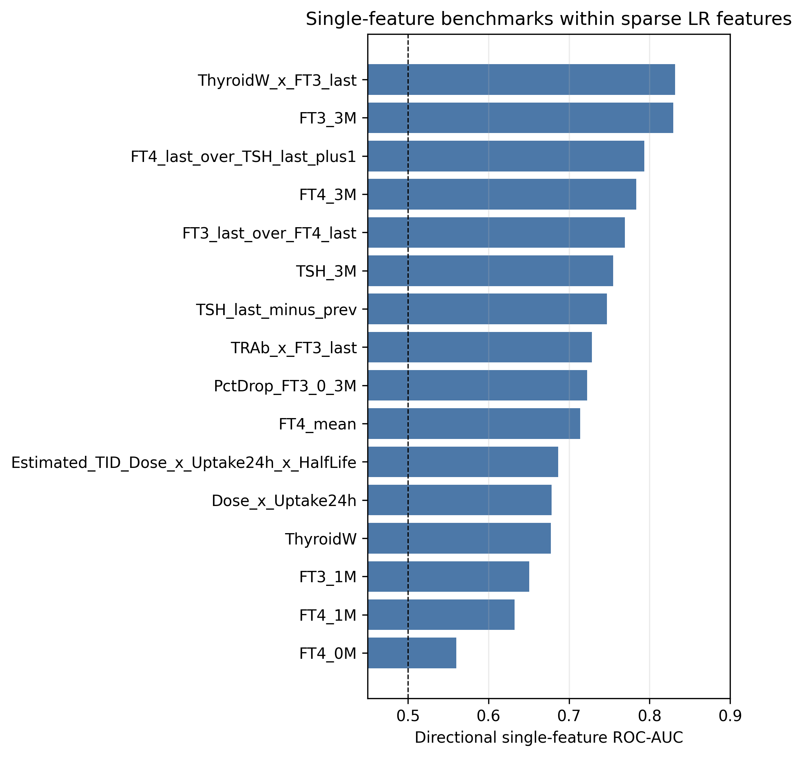

## 3M 特征故事

锁定的 LGBM 使用这 25 个 stable-selected 特征：

```text
FT3_last_over_FT4_last, FT3_3M, TSH_3M, FT4_last_over_TSH_last_plus1, TSH_last_minus_prev, FT4_mean, ThyroidW, FT4_1M, Estimated_TID_Dose_x_Uptake24h_x_HalfLife, Height, FT3_1M, Age, Dose_x_Uptake24h, ThyroidW_x_FT3_last, TSH_0M, FT4_3M, FT3_mean, TRAb_x_FT3_last, HalfLife, TPOAb, MaxUptake, FT4_0M, Weight, IDPG_Dose_per_ThyroidW, Dose_x_HalfLife
```

Stable feature selection 由三部分组成：强制保留临床核心变量、train-only Elastic-net LR 稳定筛选、LightGBM importance / permutation importance 稳定性评估。Top selected features 如下：

| Feature | clinical_core | elasticnet_freq | lgbm_freq | permutation_freq | stability_score |
| --- | --- | --- | --- | --- | --- |
| FT3_last_over_FT4_last | False | 1.000 | 1.000 | 0.800 | 0.940 |
| FT3_3M | True | 0.800 | 1.000 | 1.000 | 0.930 |
| TSH_3M | True | 1.000 | 0.800 | 0.800 | 0.870 |
| FT4_last_over_TSH_last_plus1 | False | 1.000 | 0.800 | 0.800 | 0.870 |
| TSH_last_minus_prev | False | 0.800 | 1.000 | 0.800 | 0.870 |
| FT4_mean | False | 0.800 | 0.800 | 1.000 | 0.860 |
| ThyroidW | True | 1.000 | 0.800 | 0.600 | 0.810 |
| FT4_1M | False | 1.000 | 0.800 | 0.600 | 0.810 |
| Estimated_TID_Dose_x_Uptake24h_x_HalfLife | False | 0.800 | 1.000 | 0.600 | 0.810 |
| Height | False | 1.000 | 0.600 | 0.600 | 0.740 |
| FT3_1M | False | 0.600 | 0.600 | 1.000 | 0.720 |
| Age | False | 0.600 | 1.000 | 0.400 | 0.680 |
| Dose_x_Uptake24h | False | 0.800 | 0.600 | 0.600 | 0.670 |
| ThyroidW_x_FT3_last | False | 0.000 | 1.000 | 1.000 | 0.650 |
| TSH_0M | False | 1.000 | 0.400 | 0.400 | 0.610 |
| FT4_3M | True | 1.000 | 0.000 | 0.800 | 0.590 |
| FT3_mean | False | 0.400 | 0.600 | 0.800 | 0.590 |
| TRAb_x_FT3_last | False | 0.000 | 0.800 | 1.000 | 0.580 |
| HalfLife | True | 0.600 | 0.800 | 0.200 | 0.550 |
| TPOAb | False | 0.400 | 0.800 | 0.400 | 0.540 |
| MaxUptake | True | 0.400 | 0.600 | 0.600 | 0.530 |
| FT4_0M | False | 0.000 | 0.800 | 0.800 | 0.520 |
| Weight | False | 0.800 | 0.600 | 0.000 | 0.490 |
| IDPG_Dose_per_ThyroidW | True | 0.800 | 0.200 | 0.400 | 0.470 |
| Dose_x_HalfLife | False | 1.000 | 0.000 | 0.400 | 0.470 |
| Uptake24h | True | 0.000 | 0.800 | 0.600 | 0.460 |
| PctDrop_FT4_0_3M | True | 0.200 | 0.600 | 0.600 | 0.460 |
| D_FT4_3M-0M | False | 0.200 | 0.600 | 0.600 | 0.460 |
| PctDrop_FT3_0_3M | True | 0.800 | 0.200 | 0.000 | 0.350 |
| Dose | True | 0.200 | 0.000 | 0.200 | 0.130 |

临床解释：模型主要读取 3M 当前甲功状态（`FT3_3M`、`FT4_3M`、`TSH_3M`）、早期反应（`TSH_last_minus_prev`、`FT4_mean`、比值类特征）、甲状腺负荷（`ThyroidW`）、抗体/甲状腺交互，以及 RAI 剂量-摄取生理特征（`IDPG`、`Dose_x_Uptake24h`、估计总碘暴露）。

## 6M 二分类

6M 判别力更强，符合临床直觉：RAI 后反应信息积累越多，Hyper vs non-Hyper 的边界越清楚。这里把原 fixed-landmark 图复制到统一报告目录中，但不改动原始 `results/fixed_landmark_binary/` 结果。

| Model | N | Events | Prevalence | ROC_AUC | Accuracy | Sensitivity_Recall | Specificity | PPV_Precision_derived | NPV_derived | F1 | Balanced_Accuracy |
| --- | --- | --- | --- | --- | --- | --- | --- | --- | --- | --- | --- |
| Random Forest | 208 | 80 | 0.385 | 0.911 | 0.837 | 0.887 | 0.805 | 0.740 | 0.920 | 0.807 | 0.846 |
| Balanced RF | 208 | 80 | 0.385 | 0.906 | 0.841 | 0.863 | 0.828 | 0.758 | 0.906 | 0.807 | 0.845 |
| LightGBM | 208 | 80 | 0.385 | 0.902 | 0.837 | 0.838 | 0.836 | 0.761 | 0.892 | 0.798 | 0.837 |
| Elastic+LGBM Blend | 208 | 80 | 0.385 | 0.901 | 0.793 | 0.637 | 0.891 | 0.785 | 0.797 | 0.703 | 0.764 |
| Elastic LR | 208 | 80 | 0.385 | 0.895 | 0.846 | 0.850 | 0.844 | 0.773 | 0.900 | 0.810 | 0.847 |
| Logistic Reg. | 208 | 80 | 0.385 | 0.892 | 0.846 | 0.838 | 0.852 | 0.779 | 0.893 | 0.807 | 0.845 |
| MLP | 208 | 80 | 0.385 | 0.887 | 0.812 | 0.863 | 0.781 | 0.711 | 0.901 | 0.780 | 0.822 |
| SVM | 208 | 80 | 0.385 | 0.863 | 0.812 | 0.812 | 0.812 | 0.730 | 0.874 | 0.769 | 0.812 |

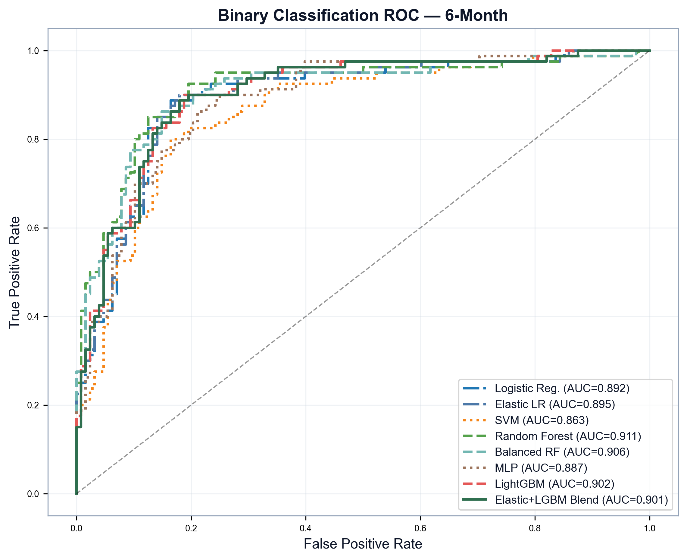

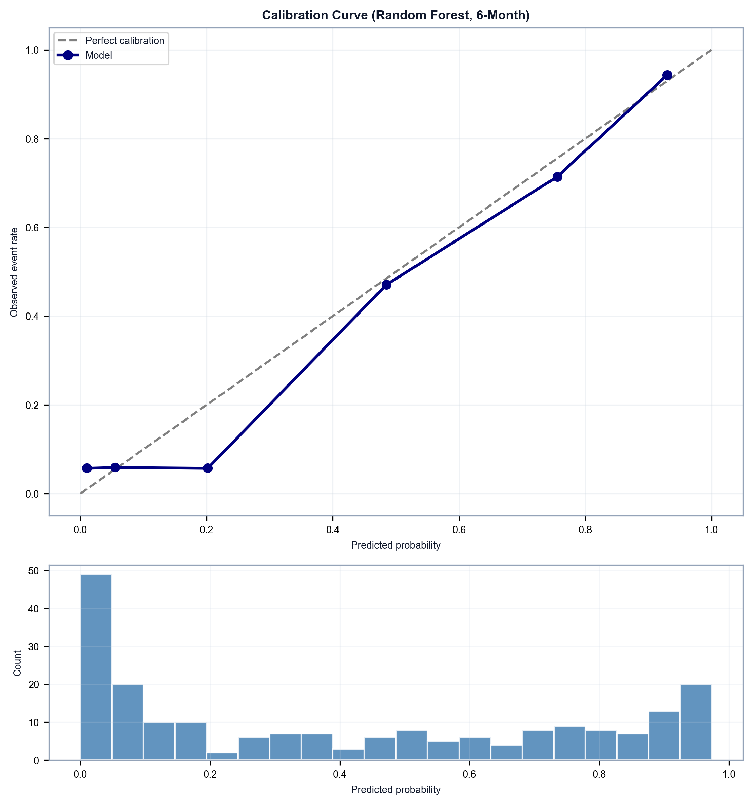

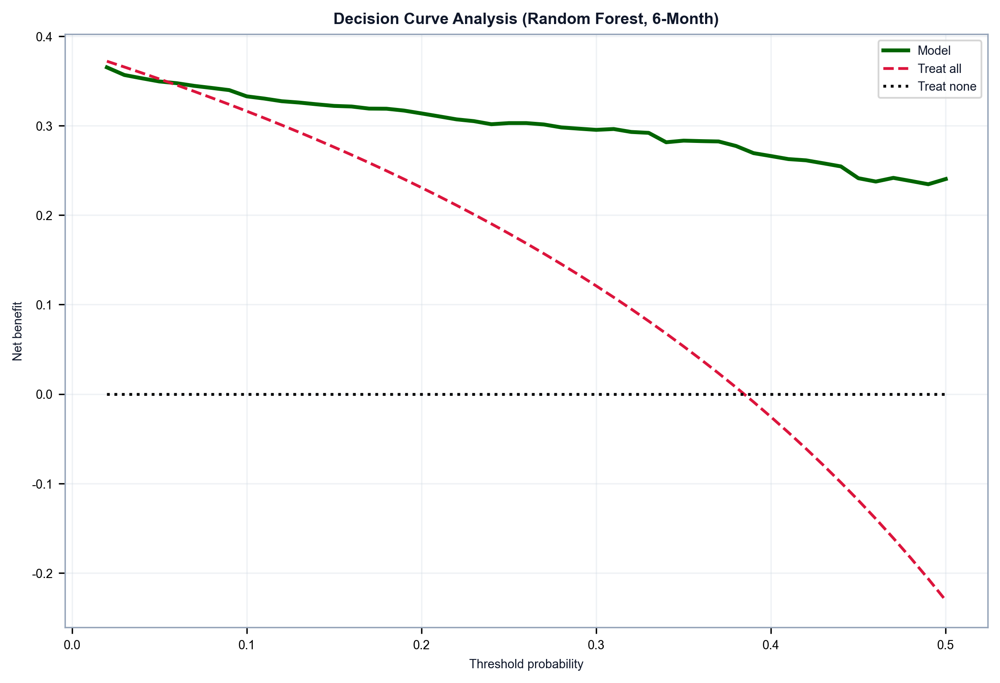

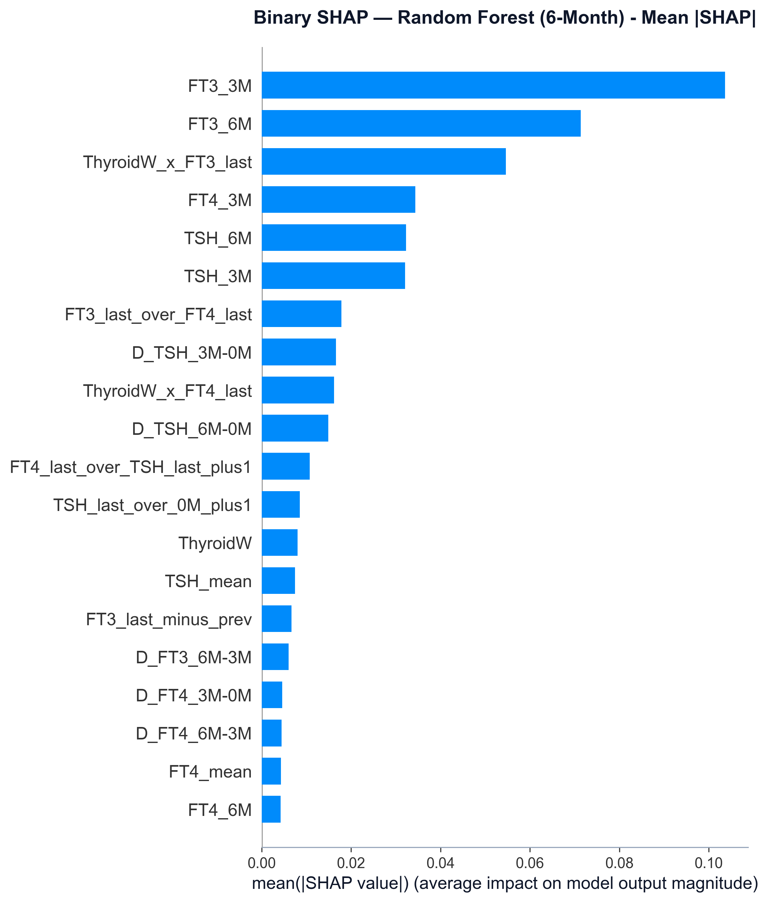

## 3M / 6M 三分类

三分类比常见的 remission / non-remission 二分类更难，因为 Normal 和 Hypo 没有被合并。

| Landmark | Model | N | Accuracy | Balanced_Accuracy | Macro_F1 | Macro_AUC_OVR | Macro_PR_AUC_OVR | Hyper_AUC | Normal_AUC | Hypo_AUC | Brier_Multiclass |
| --- | --- | --- | --- | --- | --- | --- | --- | --- | --- | --- | --- |
| 3M | Cascade RF | 208 | 0.663 | 0.663 | 0.654 | 0.804 | 0.652 | 0.853 | 0.832 | 0.727 | 0.486 |
| 6M | Cascade RF | 208 | 0.721 | 0.726 | 0.716 | 0.848 | 0.722 | 0.907 | 0.874 | 0.764 | 0.412 |

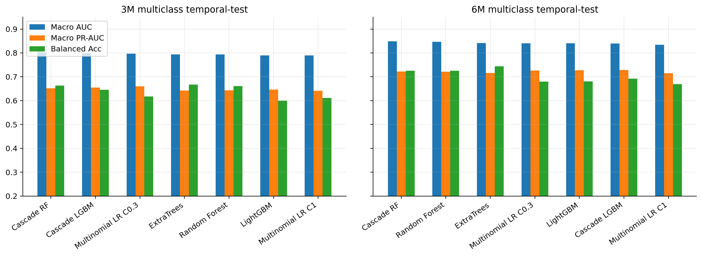

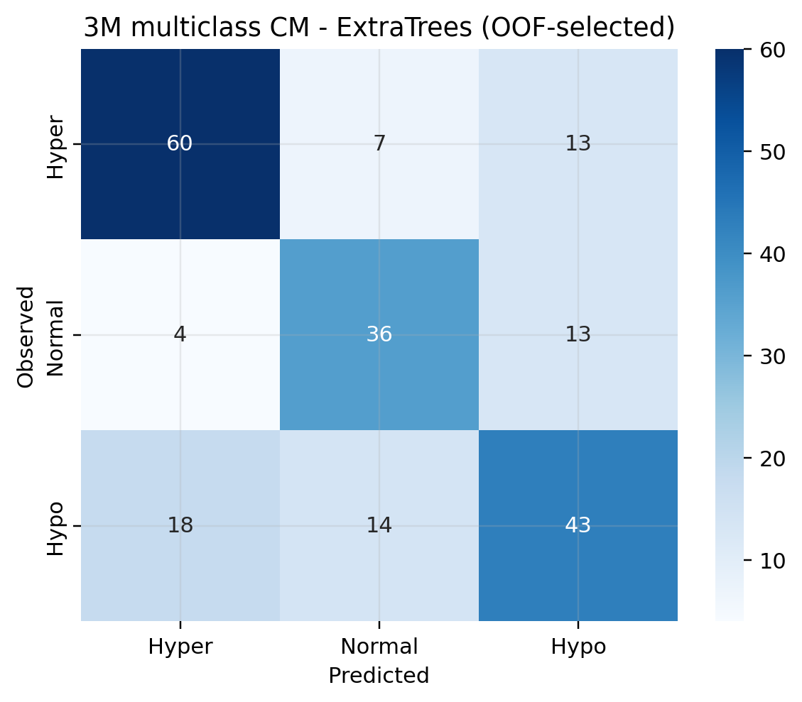

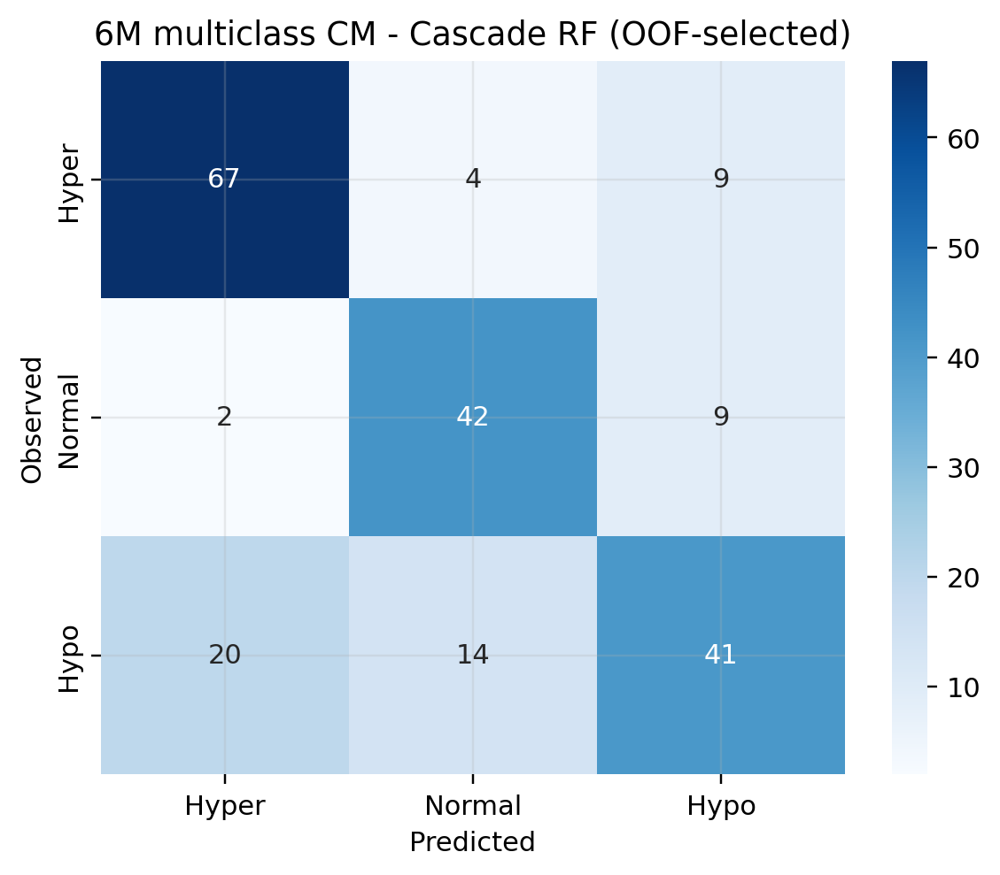

## 推荐报告口径

3M binary 主文建议固定报告 15 项：N / events / prevalence、阈值和阈值选择规则、混淆矩阵、ROC-AUC、PR-AUC / AP、accuracy、sensitivity / recall、specificity、PPV、NPV、F1、balanced accuracy、Brier score、calibration intercept / slope、calibration curve、DCA / net benefit。额外补 ROC / PR 曲线、SHAP 或 coefficient plot、train/test baseline table、feature-selection table、threshold sensitivity plot，作为方法透明度和临床解释性材料，不再继续堆无关指标。

## 附录：特征名中文释义

完整表保存在 `tables/feature_name_chinese_appendix.csv`。下面列出当前报告中出现的主要特征名及中文含义。

| Feature | Feature_Group | 中文含义 |
| --- | --- | --- |
| Age | 人口学 | 年龄 |
| BMI | 人口学 | 体重指数 |
| D_FT3_3M-0M | 早期变化量 | FT3_3M-0M 的差值变化量 |
| D_FT3_6M-0M | 早期变化量 | FT3_6M-0M 的差值变化量 |
| D_FT3_6M-3M | 早期变化量 | FT3_6M-3M 的差值变化量 |
| D_FT4_3M-0M | 早期变化量 | FT4_3M-0M 的差值变化量 |
| D_FT4_6M-0M | 早期变化量 | FT4_6M-0M 的差值变化量 |
| D_FT4_6M-3M | 早期变化量 | FT4_6M-3M 的差值变化量 |
| D_TSH_3M-0M | 早期变化量 | TSH_3M-0M 的差值变化量 |
| D_TSH_6M-0M | 早期变化量 | TSH_6M-0M 的差值变化量 |
| D_TSH_6M-3M | 早期变化量 | TSH_6M-3M 的差值变化量 |
| Dose | RAI 剂量/摄取 | 放射性碘治疗剂量 |
| Dose_per_Uptake24h | 标准化剂量 | 一个变量按另一个变量标准化后的比值 |
| Dose_x_HalfLife | 交互项 | 放射性碘治疗剂量 与 有效半衰期 的乘积交互 |
| Dose_x_ThyroidW | 交互项 | 放射性碘治疗剂量 与 甲状腺重量/体积负荷 的乘积交互 |
| Dose_x_Uptake24h | 交互项 | 放射性碘治疗剂量 与 24 小时摄碘率 的乘积交互 |
| Estimated_TID_Dose_x_Uptake24h_x_HalfLife | RAI 剂量/摄取 | 估计总碘暴露量：剂量、摄取率和半衰期的组合 |
| Exophthalmos | 基线体征 | 突眼情况 |
| FT3_0M | 甲功当前值 | 0M 时点 游离三碘甲状腺原氨酸 FT3 |
| FT3_1M | 甲功当前值 | 1M 时点 游离三碘甲状腺原氨酸 FT3 |
| FT3_3M | 甲功当前值 | 3M 时点 游离三碘甲状腺原氨酸 FT3 |
| FT3_6M | 甲功当前值 | 6M 时点 游离三碘甲状腺原氨酸 FT3 |
| FT3_last_minus_prev | 早期变化量 | 当前 landmark 数值减去上一个随访时点数值 |
| FT3_last_over_FT4_last | 甲功比值 | 当前 landmark FT3 / FT4 比值 |
| FT3_mean | 早期轨迹摘要 | 截至当前 landmark 的 游离三碘甲状腺原氨酸 FT3 均值 |
| FT3_std | 早期轨迹摘要 | 截至当前 landmark 的 游离三碘甲状腺原氨酸 FT3 标准差 |
| FT4_0M | 甲功当前值 | 0M 时点 游离甲状腺素 FT4 |
| FT4_1M | 甲功当前值 | 1M 时点 游离甲状腺素 FT4 |
| FT4_3M | 甲功当前值 | 3M 时点 游离甲状腺素 FT4 |
| FT4_6M | 甲功当前值 | 6M 时点 游离甲状腺素 FT4 |
| FT4_last_minus_prev | 早期变化量 | 当前 landmark 数值减去上一个随访时点数值 |
| FT4_last_over_TSH_last_plus1 | 甲功比值 | 当前 landmark FT4 / (TSH + 1) 比值 |
| FT4_mean | 早期轨迹摘要 | 截至当前 landmark 的 游离甲状腺素 FT4 均值 |
| FT4_std | 早期轨迹摘要 | 截至当前 landmark 的 游离甲状腺素 FT4 标准差 |
| HalfLife | RAI 剂量/摄取 | 有效半衰期 |
| Height | 人口学 | 身高 |
| IDPG_Dose_per_ThyroidW | RAI 剂量/摄取 | 单位甲状腺重量放射性碘剂量 |
| IDPG_x_FT3_Response_0_3M | 交互项 | 单位甲状腺重量放射性碘剂量 与 FT3 从 0M 到 3M 的治疗反应幅度 的乘积交互 |
| IDPG_x_FT4_Response_0_3M | 交互项 | 单位甲状腺重量放射性碘剂量 与 FT4 从 0M 到 3M 的治疗反应幅度 的乘积交互 |
| Likely_Hyper_3M | 早期状态标记 | 3M 时点仍处于或接近甲亢轨道的标记 |
| MaxUptake | RAI 剂量/摄取 | 最大摄碘率 |
| PctDrop_FT3_0_1M | 早期反应 | FT3_0_1M 的百分比下降幅度 |
| PctDrop_FT3_0_3M | 早期反应 | FT3_0_3M 的百分比下降幅度 |
| PctDrop_FT4_0_1M | 早期反应 | FT4_0_1M 的百分比下降幅度 |
| PctDrop_FT4_0_3M | 早期反应 | FT4_0_3M 的百分比下降幅度 |
| RAI3d | RAI 剂量/摄取 | RAI 治疗后 3 日相关测量值 |
| Sex | 人口学 | 性别 |
| TGAb | 抗体 | 甲状腺球蛋白抗体 |
| TGAb_HighQ75 | 高值分层 | TGAb 高于训练集第 75 百分位的标记 |
| TGAb_HighQ90 | 高值分层 | TGAb 高于训练集第 90 百分位的标记 |
| TPOAb | 抗体 | 甲状腺过氧化物酶抗体 |
| TPOAb_HighQ75 | 高值分层 | TPOAb 高于训练集第 75 百分位的标记 |
| TRAb | 抗体 | 促甲状腺激素受体抗体 |
| TRAb_HighQ75 | 高值分层 | TRAb 高于训练集第 75 百分位的标记 |
| TRAb_HighQ90 | 高值分层 | TRAb 高于训练集第 90 百分位的标记 |
| TRAb_x_FT3_last | 交互项 | 促甲状腺激素受体抗体 与 当前 landmark 的 游离三碘甲状腺原氨酸 FT3 的乘积交互 |
| TSH_0M | 甲功当前值 | 0M 时点 促甲状腺激素 TSH |
| TSH_1M | 甲功当前值 | 1M 时点 促甲状腺激素 TSH |
| TSH_3M | 甲功当前值 | 3M 时点 促甲状腺激素 TSH |
| TSH_6M | 甲功当前值 | 6M 时点 促甲状腺激素 TSH |
| TSH_Recovered_3M | 早期恢复标记 | 3M 时点 TSH 是否恢复的标记 |
| TSH_last_minus_prev | 早期变化量 | 当前 landmark TSH 减去上一个随访时点 TSH |
| ThyroidW | 甲状腺负荷 | 甲状腺重量/体积负荷 |
| ThyroidW_x_FT3_Response_0_3M | 交互项 | 甲状腺重量/体积负荷 与 FT3 从 0M 到 3M 的治疗反应幅度 的乘积交互 |
| ThyroidW_x_FT3_last | 交互项 | 甲状腺重量/体积负荷 与 当前 landmark 的 游离三碘甲状腺原氨酸 FT3 的乘积交互 |
| ThyroidW_x_FT4_Response_0_3M | 交互项 | 甲状腺重量/体积负荷 与 FT4 从 0M 到 3M 的治疗反应幅度 的乘积交互 |
| ThyroidW_x_logTSH_3M | 交互项 | 甲状腺重量/体积负荷 与 3M 时点 log 转换后的 TSH 的乘积交互 |
| TreatCount | 治疗史 | 第几次 RAI 治疗 |
| Uptake24h | RAI 剂量/摄取 | 24 小时摄碘率 |
| Weight | 人口学 | 体重 |
