# Module 1：治疗前 RAI 结局预期评估（Pre-RAI Expected 24-Month Outcome）

## 摘要

本模块回答 Graves 甲亢患者在碘-131（RAI）治疗**之前**最关心的问题：仅凭治疗前可获得的信息，能否估计这次治疗后两年内"稳定控制"还是"持续不愈／复发"（NHRH 复合终点）？分析单位固定为 **1003 治疗人次**，按治疗时间顺序切分为 development（802 人次）与 temporal test（201 人次，82 例事件），所有特征处理、交叉验证、阈值、概率校准与 bootstrap 均在人次层面、且仅在 development 内完成，temporal test 只做一次性最终评估。

主要发现是诚实而克制的：治疗前 baseline 信息**确实携带可用的预后信号，但上限有限**。可解释的 L2 logistic（core LR）在 temporal test 上 ROC-AUC 0.688、PR-AUC 0.666、Brier 0.208；加入病程、治疗前 ATD 使用、停药间隔等增强字段后（augmented LR）升至 ROC-AUC 0.704、PR-AUC 0.671，但相对 core 的增量 95% bootstrap 区间跨 0，属"**可见但统计上不稳定**"。复杂非线性模型——随机森林、ExtraTrees、HistGradientBoosting，以及在隔离环境中补齐的 XGBoost / LightGBM / CatBoost——在 temporal test 上均未稳定超过 LR，且普遍 Brier 变差。因此 **Module 1 的主模型保留为校准良好、可解释的 LR**；它定位为治疗前预期评估与初始风险分层工具，而非排除不良结局的 rule-out 工具，也不是对 RAI 净获益的因果推断。

> 定位声明：本模块输出的是"接受 RAI 后 24 个月内的预期结局概率"（pre-RAI expected outcome），由于缺乏 ATD／手术／不治疗对照组，不作严格因果意义上的"治疗获益预测"。

---

## 1. 研究设计与数据

**分析单位与切分。** 以 RAI 治疗人次（疗程）为独立分析单位，N = 1003；重复治疗的患者按独立人次处理，不做患者级分组。按治疗时间先后切分 development（802）与 temporal test（201），后者模拟"用过去的数据预测未来到来的患者"，是比随机划分更严格的验证。

**特征集（两套）。** Core（M1_v1）只用治疗前／index RAI 时点已确定的核心变量：年龄、性别、甲状腺重量、给药 RAI 活度、24 小时摄碘率与峰值摄碘率、有效碘半衰期、每克甲状腺剂量、TRAb／TgAb／TPOAb、治疗前 FT3／FT4／TSH 及其对数变换、baseline TSH 恢复指标等。Augmented（M1_v2）在此之上加入由合表得到、且仍属治疗前可见的字段：病程（含 log 变换与缺失指示）、治疗前是否使用 ATD、服碘前 ATD 停药天数、眼征来源标记、合并症文本存在性。

**终点。** 主终点为 **24 个月 NHRH 二分类**（持续甲亢未控制，或控制后复发，二者合并为复合治疗失败终点）。人次级事件率约 37%（temporal test 82/201）。

**泄漏控制。** 严格排除 1M／3M／6M 的甲功反应、post-RAI 用药与任何由结局反推的派生变量；插补、标准化、特征处理、校准与阈值锁定全部在训练折／development 内完成。原始 `1003.xlsx` 未被覆盖。

---

## 2. 模型比较总览

下表汇总 core 与 augmented 两套特征集下各模型在 development OOF 与 temporal test 的判别与校准指标（括号为人次级 bootstrap 95% CI）。

| 特征集 | 模型 | Split | ROC-AUC | PR-AUC | Brier |
|:---|:---|:---|:---|:---|:---|
| Core | LR | Temporal | **0.688 (0.604–0.758)** | 0.666 (0.568–0.756) | 0.208 (0.187–0.235) |
| Core | LR | Dev-OOF | 0.720 (0.681–0.755) | 0.615 (0.557–0.674) | 0.200 (0.188–0.212) |
| Core | RandomForest | Temporal | 0.672 (0.597–0.745) | 0.594 (0.487–0.707) | 0.218 |
| Core | ExtraTrees | Temporal | 0.676 (0.598–0.753) | 0.656 | 0.211 |
| Core | HistGBM | Temporal | 0.648 (0.572–0.720) | 0.578 | 0.225 |
| Augmented | LR | Temporal | **0.704 (0.629–0.775)** | 0.671 (0.563–0.762) | 0.207 (0.186–0.231) |
| Augmented | LR | Dev-OOF | 0.711 (0.672–0.747) | 0.606 | 0.201 |
| Augmented | RandomForest | Temporal | 0.692 (0.615–0.764) | 0.636 | 0.212 |
| Augmented | ExtraTrees | Temporal | 0.721 (0.644–0.785) | 0.683 | 0.204 |
| Augmented | HistGBM | Temporal | 0.665 | 0.616 | 0.222 |

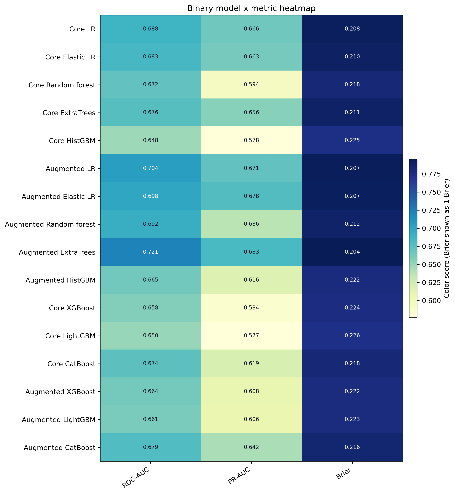

**图 1 解读。** 热图把 10 个模型（core／augmented × 5 种算法）在 ROC-AUC、PR-AUC、Brier 三个维度上并排呈现，便于一眼比较。三点值得注意：其一，**所有模型的 ROC-AUC 都落在 0.65–0.72 的狭窄区间**，没有任何算法拉开代差，这本身就是 Module 1 的核心信息——治疗前信息的预测上限有限，而非某个算法不够强。其二，augmented ExtraTrees 的 temporal ROC-AUC 点估计最高（0.721），但它与 LR 的置信区间大幅重叠，且 PR-AUC、Brier 并未同步形成稳定优势。其三，Brier 列（深蓝、白字标注）显示 LR 系列的概率误差最低（0.207–0.208），树模型与 boosting 普遍偏高，提示 LR 不仅判别力不输，概率质量更好。综合看，**没有模型在 temporal test 上稳定优于校准 LR**，这为"保留 LR 为主模型"提供了第一层证据。

---

## 3. 判别性能：ROC 与 PR 曲线

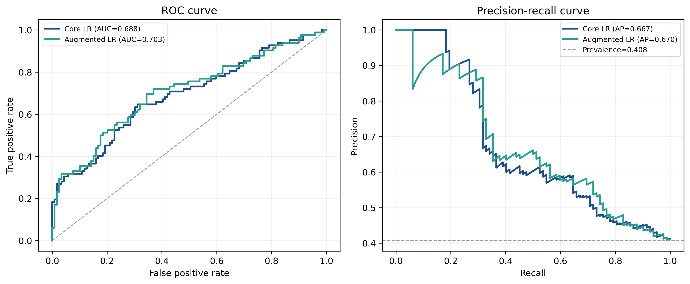

**图 2 解读。** 左图 ROC：augmented LR（AUC 0.703）整体略高于 core LR（0.688），两条曲线在中段（FPR 0.2–0.5）分离最明显——这正是临床上最关心的"中等假阳性容忍度"区间。右图 PR：两条曲线远高于 0.408 的患病率参考线，说明模型在阳性识别上确有信息量（augmented AP 0.670、core AP 0.667）；但随召回率升高，精确率回落较快，意味着若要"抓住大部分将失败者"，会以较多假阳性为代价。换言之，**模型适合做风险排序与分层，而不适合作为高精度的二元判决器**。这一判别水平（AUC≈0.69–0.70）与文献中纯治疗前 RAI 结局模型的量级一致，符合"治疗前信息有限"的先验。

---

## 4. 优势比解释层（OR Forest）

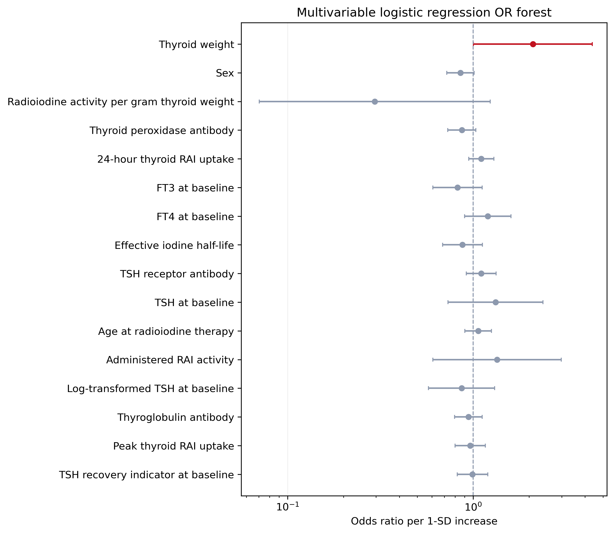

**图 3A 解读。** core 模型中，**甲状腺重量**是唯一置信区间稳定偏向风险升高的变量（OR>1，红色）——甲状腺越大、组织负荷越重，单位剂量难以充分破坏的风险越高，这与 RAI 剂量学的生物学机制一致。其余如每克甲状腺剂量、摄碘率、半衰期、抗体与 baseline 甲功多数项区间跨 1，单独看不构成稳定方向，反映治疗前单变量信号普遍偏弱、且彼此存在共线与交互。

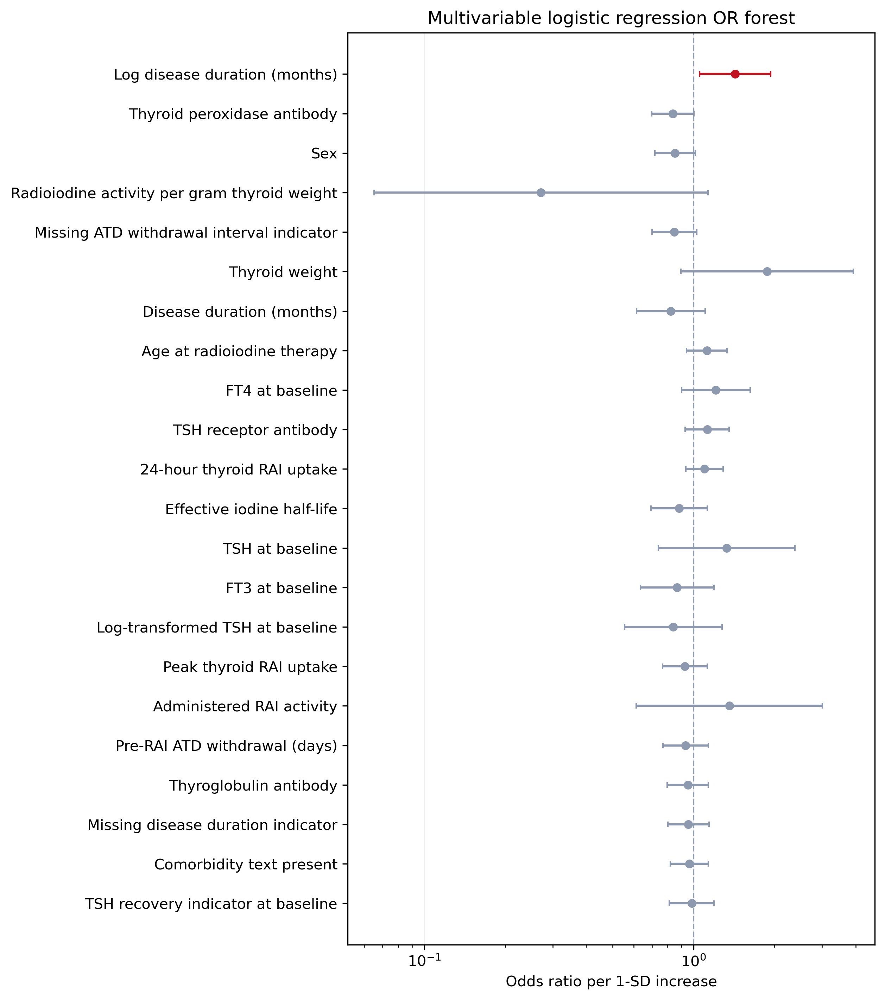

**图 3B 解读。** 加入增强字段后，**log 病程**成为新的、区间不跨 1 的风险升高项（OR>1，红色，置于顶部），方向为"病程更长→风险更高"，符合直觉（慢性、免疫活跃的病程更难一次治愈）。但需谨慎：同一模型里"原始病程"项的 OR 略小于 1，与 log 病程方向相反——这是两个共线派生项分摊效应造成的不稳定，而非可靠的反向证据（详见第 9、11 节）。"服碘前 ATD 停药天数""ATD 停药缺失指示""合并症文本存在""baseline TSH 恢复指标"等项基本居中。整体上，OR 层在临床机制上**可读、可讲**，但不应把任何单项当作确证的因果因子。

---

## 5. 概率校准（Calibration）

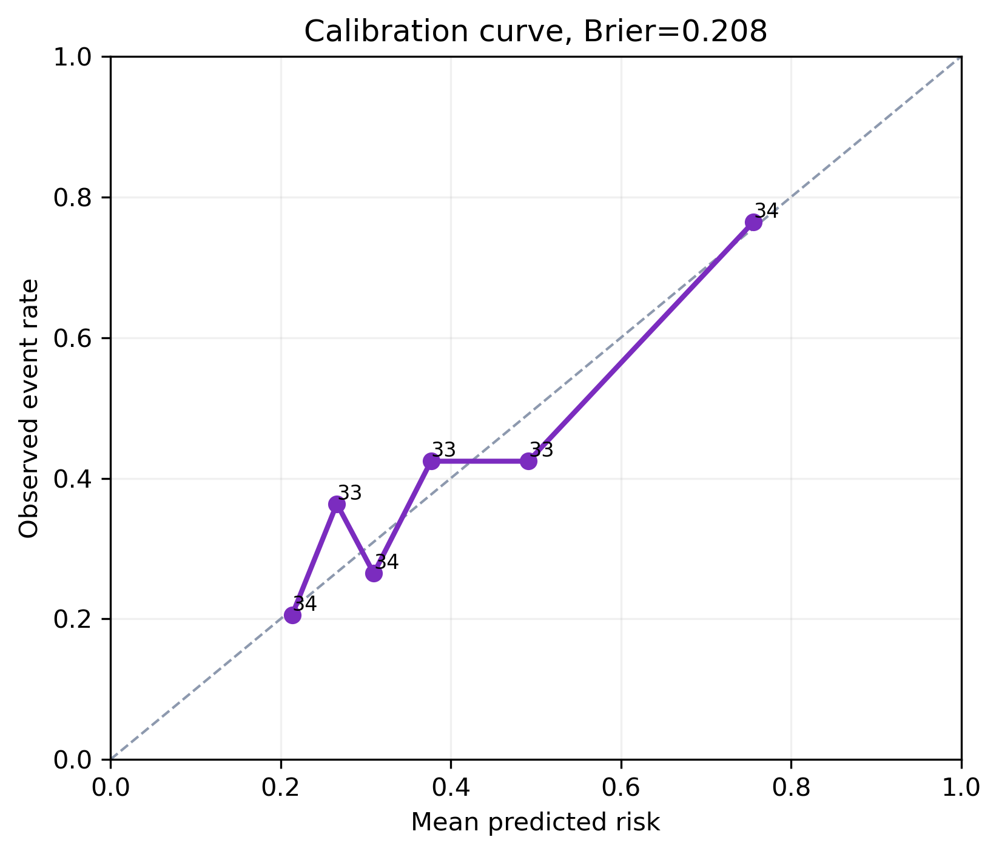

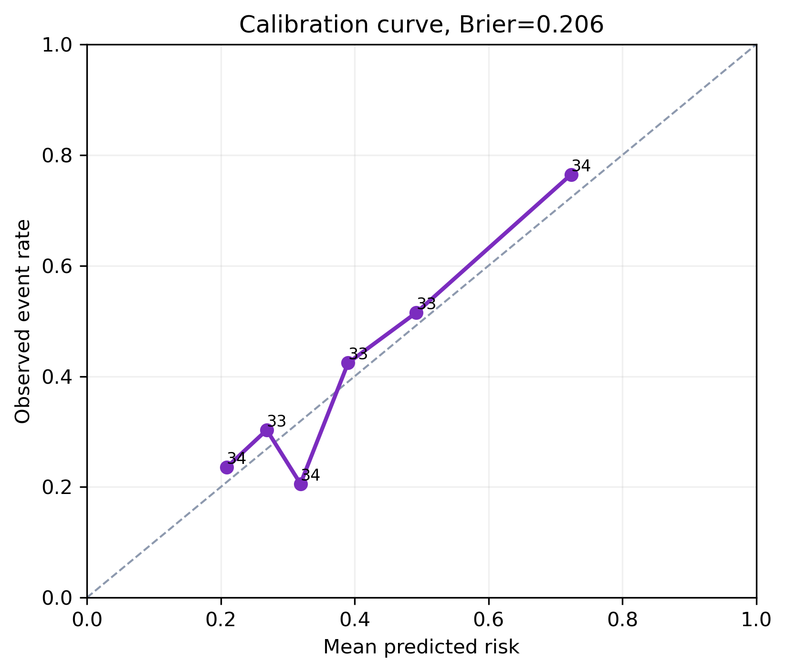

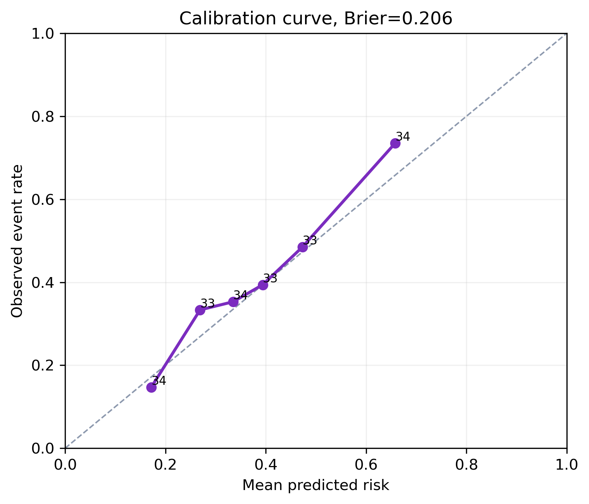

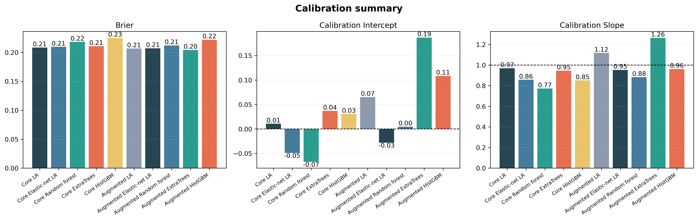

**图 4 解读。** 校准衡量"模型说的 30% 风险，是否真有约 30% 的人发生事件"——对一个用于患者沟通的治疗前工具，这比单纯的 AUC 更重要。图 4A／4B 显示 **Core LR 与 Augmented LR 的校准曲线紧贴对角线**，经 Platt 校准后斜率分别约 0.97 与 0.95、截距接近 0，属近乎理想校准；而图 4C 的 ExtraTrees 曲线明显偏离（斜率约 1.26，呈过／欠自信的 S 形）。图 4D 把十个模型横向汇总：LR 系列的校准斜率最贴近 1、Brier 最低，树模型与 boosting 的斜率离散、Brier 偏高。**这是保留 LR 为主模型的第二层、也是最有分量的证据**——在判别力相当时，LR 给出的概率本身可信，可直接用于"你大约有 X% 的风险"这种治疗前沟通；而树模型即使点估计 AUC 偶有领先，其概率需要额外校准且更不稳定。

---

## 6. 临床决策曲线（Decision Curve Analysis）

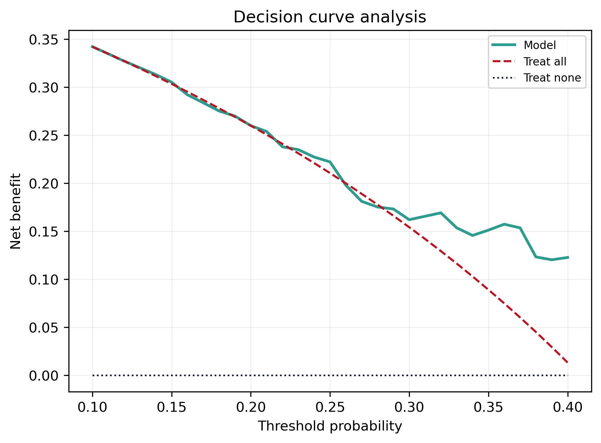

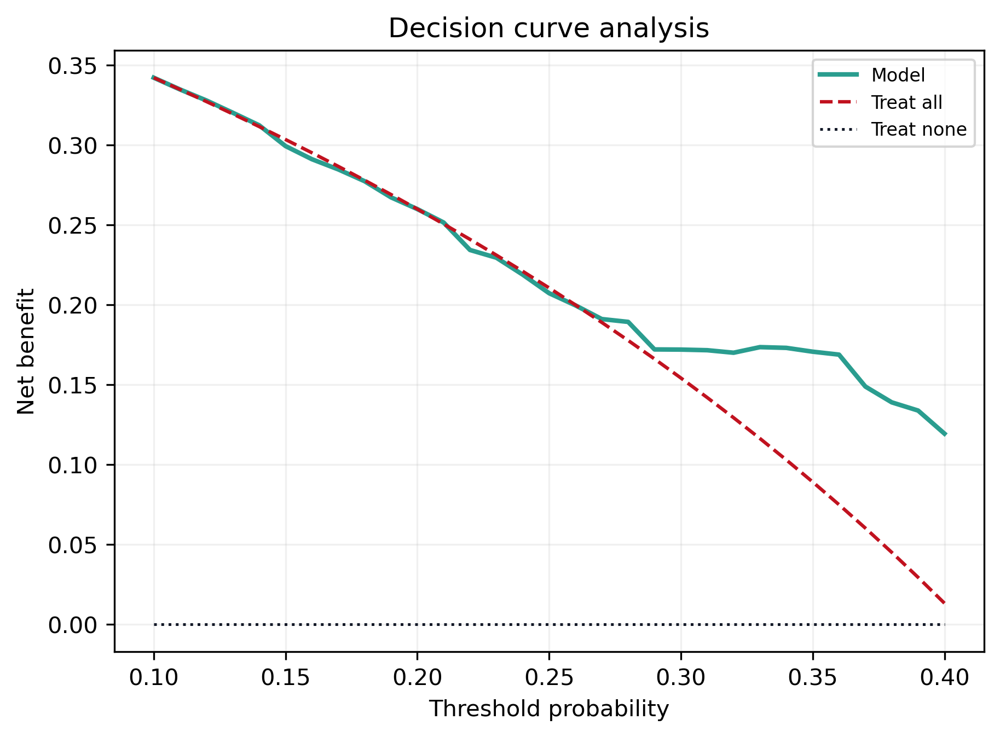

**图 5 解读。** DCA 回答"按模型分层去做临床决策，相比'全治／全不治'是否有净获益"。在 **10%–40% 的阈值区间**（即把"预测风险≥10%~40%"者视为需加强关注的高危），core 与 augmented LR 的净获益曲线都位于 treat-all 与 treat-none 两条参考线之上，说明在这一临床合理区间内，用模型做治疗前风险分层是有正向价值的。但获益幅度温和、且在高阈值端逐渐与 treat-none 收敛，再次印证 Module 1 的角色是**辅助分层而非决定性判决**。

---

## 7. Development 派生三档风险分层

风险三档阈值在 **development OOF 概率**上锁定（按三分位），再原样套用于 temporal test——这样避免用测试集反调阈值，是部署口径下更诚实的做法。

| 模型 | 档位 | N | 事件数 | 平均预测风险 | 观察事件率 | 档内 PPV | 档内 NPV |
|:---|:---|---:|---:|---:|---:|---:|---:|
| Core LR | Low | 62 | 18 | 0.237 | 0.290 | 0.290 | 0.710 |
| Core LR | Intermediate | 52 | 14 | 0.319 | 0.269 | 0.269 | 0.731 |
| Core LR | High | 87 | 50 | 0.572 | **0.575** | 0.575 | 0.425 |
| Augmented LR | Low | 59 | 15 | 0.239 | 0.254 | 0.254 | 0.746 |
| Augmented LR | Intermediate | 53 | 13 | 0.333 | 0.245 | 0.245 | 0.755 |
| Augmented LR | High | 89 | 54 | 0.557 | **0.607** | 0.607 | 0.393 |

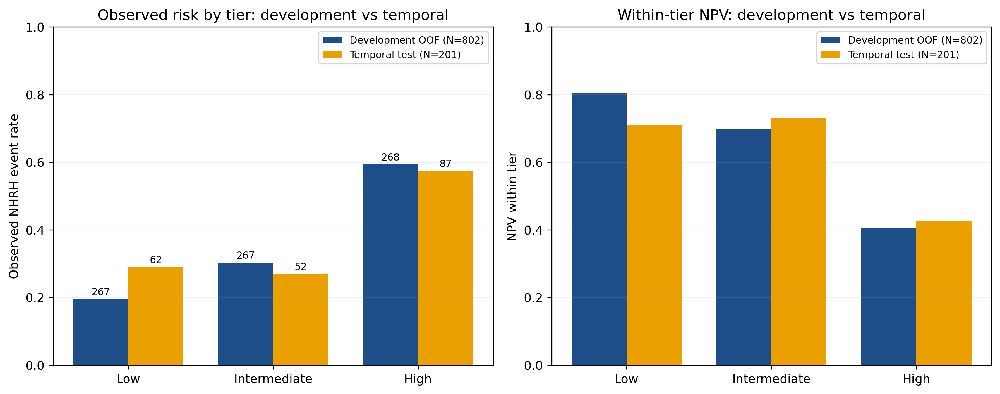

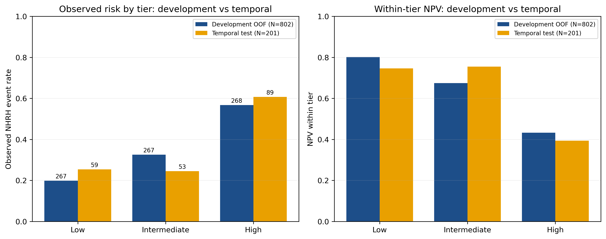

**图 6 解读。** 两张图都呈现同一个诚实的结论：**只有 High 档真正拉开**。Core LR 的 High 档观察事件率 57.5%（augmented 60.7%），明显高于全体 ~37% 的基线；但 **Low 与 Intermediate 两档的观察事件率几乎重叠**（core 0.290 vs 0.269，augmented 0.254 vs 0.245），说明低／中档之间没有有效区分度。更关键的是右图 NPV：Low 档 NPV 仅约 0.71（augmented 0.75），即被判"低危"的人里仍有约 1/4 最终发生 NHRH——**这不足以支撑"低危即可放心排除"的 rule-out 临床主张**。因此 Module 1 的可落地用途是"识别一个事件率明显升高的高危组以提前关注"，而非"安全地排除低危组"。

> 图中刻意把 **development OOF（N=802）** 与 **temporal test（N=201）** 并列：阈值在 dev OOF 上锁定，dev 高 N 视图给出更精确的分档梯度，temporal 是真正的留出验证（N 较小、CI 较宽）。二者同档梯度一致（Low/Intermediate 重叠、High 拉开），说明该结论不是 temporal 小样本的偶然。

---

## 8. 单变量基准与朴素基线

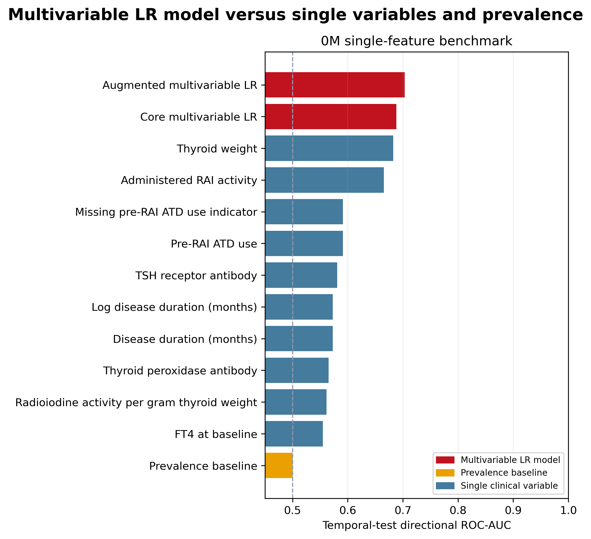

**图 7 解读。** 这张图把"多变量 LR"放在"每个单变量各自能做到多少"和"最朴素的患病率基线"之间做对照，回答"多变量建模到底比拍脑袋强多少"。结论：augmented／core 多变量 LR（红，约 0.70／0.69）确实位居榜首，明显高于任何单一变量（蓝，最强的甲状腺重量、给药活度约 0.66–0.68）和患病率基线（橙，约 0.50）。这说明**模型的增益来自多变量的联合，而非单一强预测因子**；同时，最强单变量与多变量之间的差距并不大，再次量化了"治疗前信息有限"这一上限。按设计要求纳入朴素基线（此处为患病率基线，因 0M 治疗前不存在可"沿用"的既往状态），让"学习到的增量"被明确量化。

---

## 9. 增量价值：ATD 与病程（可见但不稳定）

augmented 相对 core LR 的 temporal-test 增量（人次级 bootstrap）：

| 模型 | 指标 | Δ | CI 下限 | CI 上限 | 跨 0？ |
|:---|:---|---:|---:|---:|:---|
| LR | ΔROC-AUC | +0.016 | −0.010 | +0.044 | 是 |
| LR | ΔPR-AUC | +0.006 | −0.027 | +0.038 | 是 |
| LR | ΔBrier | −0.002 | −0.009 | +0.005 | 是 |

**解读。** 加入病程／ATD 等治疗前增强字段后，点估计方向一致向好（ROC、PR 升，Brier 降），但**三个增量的 95% 区间全部跨 0**。诚实表述应为"**可见但统计上不稳定的增量**"，不能写成确证的提升。临床含义：这些字段值得保留并在更大样本中重估，但目前不足以改变结论或主模型。

---

## 10. 高级非线性 ML Benchmark（XGBoost / LightGBM / CatBoost）

为检验"治疗前变量间的非线性与交互是否藏有额外预后信息"，在与主线**完全相同的 temporal 切分、OOF 折与 Platt 校准口径**下补跑了三种梯度提升模型。为保护主环境（numpy 1.21.5 / sklearn 1.0.2），boosting 在隔离 conda 环境 `rai_boost`（numpy 2.x）中运行，仅导出指标与解释，不污染既有结果。

| 特征集 | 模型 | Temporal ROC-AUC | Temporal PR-AUC | Temporal Brier |
|:---|:---|---:|---:|---:|
| Core | XGBoost | 0.658 | 0.584 | 0.224 |
| Core | LightGBM | 0.650 | 0.577 | 0.226 |
| Core | CatBoost | 0.674 | 0.619 | 0.218 |
| Augmented | XGBoost | 0.664 | 0.608 | 0.222 |
| Augmented | LightGBM | 0.661 | 0.606 | 0.223 |
| Augmented | CatBoost | 0.679 | 0.642 | 0.216 |
| — | （参考）Core LR | 0.688 | 0.666 | 0.208 |
| — | （参考）Augmented LR | 0.704 | 0.671 | 0.207 |

相对同特征集 LR 的增量（人次级 bootstrap，节选）：CatBoost 是最强 boosting，但 core ΔROC −0.014（跨 0）、augmented ΔROC −0.024（跨 0），且其 PR-AUC、Brier 多数显著变差；XGBoost／LightGBM 更弱。

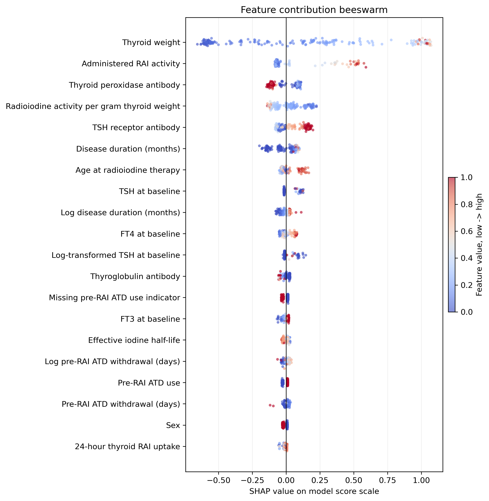

**解读。** **没有任何 boosting 模型达到预设的升主模型门槛**（temporal ROC-AUC 较 LR 提升 ≥0.03、PR 同步升、Brier 不变差、校准可接受）——事实上全部低于 LR 且 Brier 更差。这强力对应设计文档的"情况 C"：**baseline-only 预测的瓶颈在于治疗前信息本身有限，而非线性模型不够复杂**。图 9 的 boosting SHAP 与 LR 的解释结论一致（甲状腺重量、RAI 活度、病程等居前），未发现被线性模型遗漏的强非线性结构。结论明确：Module 1 保留**校准 LR 为主模型**，boosting 作为补充对照，证明"再堆治疗前变量／再加非线性"收益递减——真正的性能跃升要靠 Module 2／3 的治疗后早期反应信息。

---

## 11. 解释层 SHAP

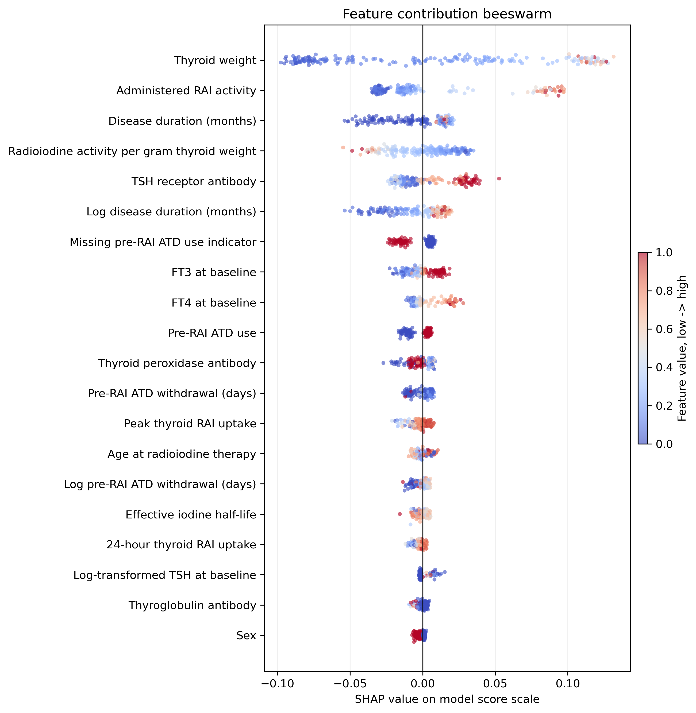

**图 8A 解读。** beeswarm 把每个人次对每个特征的 SHAP 贡献画成一行散点（颜色=特征取值高低）。排序靠前的是**甲状腺重量、给药 RAI 活度、病程、TSH 受体抗体、每克甲状腺剂量**——与 OR 层、临床机制高度一致，说明非线性模型"看重"的东西和可解释模型并无本质冲突。增强字段中 ATD 使用、ATD 停药、病程等也进入了中上游，确认它们携带（弱）信号。

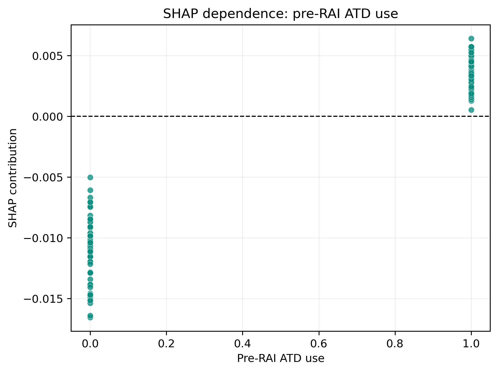

**图 8B 解读。** 清晰的二分模式：**ATD 使用=1 的人次 SHAP 贡献为正（推高风险）、=0 为负**。方向符合临床直觉——治疗前需要并使用过 ATD，往往代表病情更活跃／更难控制，因而 RAI 后失败风险偏高。但绝对贡献幅度很小（±0.005 量级），与第 9 节"增量不稳定"一致。

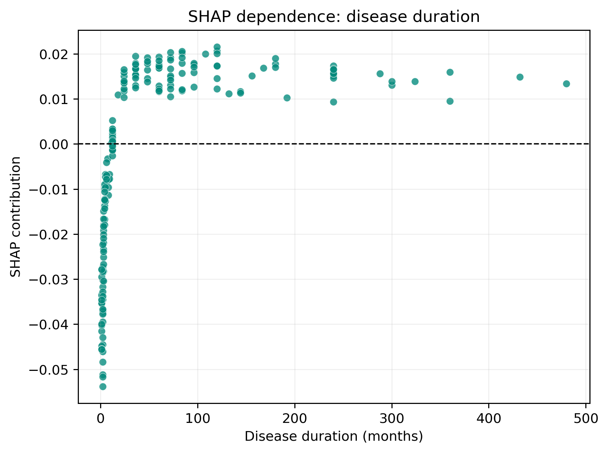

**图 8C 解读。** 随机森林视角下呈现**"病程很短→贡献为负、病程拉长后→贡献转正并趋于平台"**的形态，即更长病程倾向更高风险——与图 3B 的 log 病程 OR>1 方向一致。需要诚实并列说明的张力：LR 里"原始病程"项 OR 略<1，与此方向相反；这源于原始病程与 log 病程的**共线**使线性系数被分摊，并非可靠反向证据。因此本报告统一表述为"病程方向在解释层部分项不一致、整体偏向更长→更高、但未达稳定证据"，不下因果结论，可能受自由文本解析噪声、选择偏倚或混杂影响。

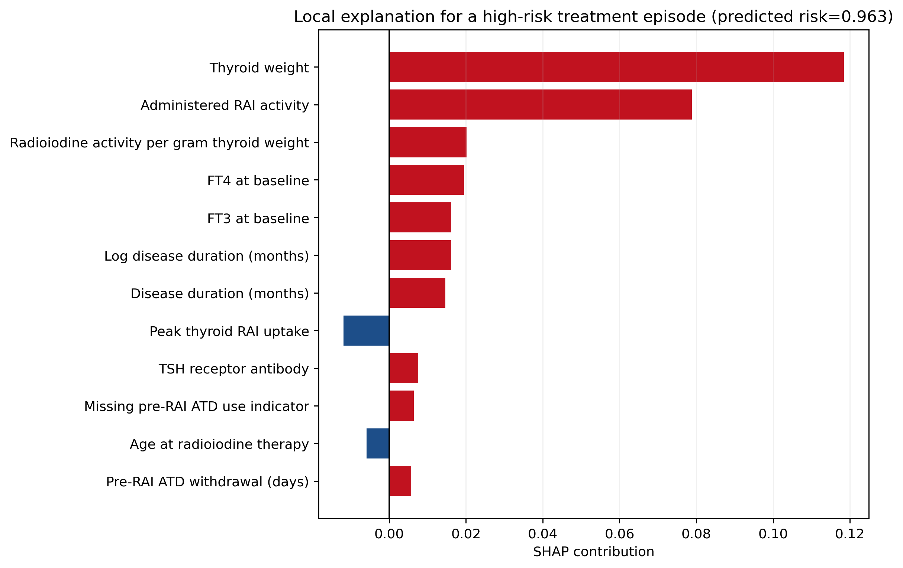

**图 8D 解读。** 个体解释示例：该高危人次的风险主要由**大甲状腺重量与高 RAI 活度**推高（红色长条），病程与 ATD 字段提供次级正贡献，少数变量（如峰值摄碘）轻微下拉。这类 waterfall 让"为什么这个人被判高危"对临床可读、可核对，是 Module 1 作为治疗前沟通工具的落地形态。

---

## 12. 结论与在全文中的定位

Module 1 给出一个克制而清晰的结论：**治疗前 baseline 信息能提供中等强度、校准良好的 24 个月 NHRH 预期风险分层，但存在明确的信息上限。** 三层证据共同支持保留**校准 LR 为主模型**：判别力上没有模型稳定超过它（图 1、图 2）；概率校准上 LR 最优、树／boosting 更差且需额外校准（图 4）；非线性 boosting 在相同口径下全面未达升级门槛（第 10 节）。新增 ATD／病程字段带来"可见但不稳定"的小幅增量（第 9 节），三档风险只有 High 档拉开、low-risk NPV 不足以 rule-out（图 6）。

因此，Module 1 的临床角色是**治疗前咨询入口与初始风险分层**——帮助识别一个 RAI 后失败风险明显偏高的人群以提前加强关注，而**不是**排除低危、也不是 RAI 净获益的因果判断。要把长期风险预测真正推上去，靠的不是继续堆治疗前变量或更复杂的算法，而是 **Module 2／3 纳入治疗后 1M／3M／6M 的早期甲功反应**——这正是全文"双时间尺度 landmark 框架"的逻辑起点。

---

## 可复现性

- 建模与图表生成器：`scripts/simple/module1_baseline_report.py`（base 环境 `PYTHONNOUSERSITE=1 /Users/ql/opt/anaconda3/bin/python`）。
- 复用绘图与标签引擎：`scripts/simple/stage1_plot_kit.py`（所有图内特征名经统一标签引擎转为干净英文临床名，图内一律英文以避免 matplotlib 中文字体缺失导致的乱码方块）。
- 高级 boosting：隔离环境 `rai_boost`（含 XGBoost / LightGBM / CatBoost），`scripts/simple/module1_boosting_benchmark.py`，与主线共享 `tables/split_assignment.csv` 的切分与折以保证可比；不影响 base 环境。
- 口径：分析单位 1003 治疗人次；交叉验证、bootstrap、阈值与校准均按人次、且仅在 development 内完成；temporal test 仅一次性评估。
