# Module 1·v2：去 RAI 剂量、LASSO 简约 + 临床先验筛选的治疗前预期模型

> 与原 Module 1（含完整治疗前特征）平行的"清洁版"。两项设计变更：①移除 RAI **给药活度（Dose）及其衍生项**（IDPG_Dose_per_ThyroidW），避免治疗指征混杂；②**简约到 9 / 10 个特征**——core 池用 LASSO 自动选 9 个；augmented 池在 LASSO 自动选 11 个的基础上，依据前一轮可解释性 audit 剔除 **Pre-RAI ATD use / use missing / withdrawal missing** 三件套（PI / LOO ΔAUC 全部 ≈ 0、CI 跨 0、5 折选择频率不一致、无独立预后信号），最终保留 10 个临床先验筛选特征（core 9 + Log disease duration）。新模型不替代原 M1，作为治疗前预期模型的"诚实-简约"版 + 混杂稳健性 + 可解释性深化 + 消融/敏感性分析。

## 摘要

1003 个 RAI 治疗人次，按治疗时序切分 development 802 / temporal test 201。在剔除 dose 家族（给药活度本身由医生按腺体负荷与严重度滴定，属治疗指征混杂）后，对剩余治疗前候选变量做 L1-logistic（LASSO）路径选择（5-fold OOF，C 网格），选定单 C 使均值非零系数落在 **8–10**：core 池在 C=0.15 选 **9 个特征**（M1_v2c）。Augmented 池 LASSO 在 C=0.08 自动选 11 个特征但其中 **ATD 三件套**（Pre-RAI ATD use / use missing / withdrawal missing）在前一轮可解释性 audit 中 PI / LOO ΔAUC ≈ 0、CI 跨 0、选择不稳定——**本版本将其剔除，augmented 改为临床先验筛选的 10 个特征**（M1_v2a 10 = core 9 + Log disease duration）。再在选定子集上以 L2-logistic + Platt 校准重拟合并出 OOF 与 temporal 预测。

**核心发现**：与原 M1（包含 dose 家族、core 16 / augmented 28 特征）相比，**core 9 几乎不变**（temporal ROC 0.690 vs 0.688，Δ +0.002；PR 0.667 vs 0.666；ΔBrier ≈ 0），**augmented 10 比原 28 特征版略低**（temporal ROC 0.686 vs 0.704，Δ −0.019）——这一 0.019 跌幅完全来自我们刻意剔除 dose + 16 个派生特征，95% CI 仍然完全重叠（0.606–0.763 vs 原 0.62–0.78）。**给药活度家族在原 M1 中并未携带独立预测信息**——其信号已被甲状腺重量、摄碘率、半衰期等"决定剂量决策"的严重度变量吸收（治疗指征混杂的实证指纹）。**Log disease duration 在 augmented 10 上 OR=1.24（CI 1.05–1.48, p=0.014），是唯一与 Thyroid weight 并列的、95% CI 不跨 1 的正向特征**。模型在所有 4 项敏感性分析（VIF / 性别分层 / class_weight / 多 seed bootstrap）下稳定；10 vs 9 的消融实验显示 **Log disease duration 在多变量背景下无显著独立增量**（dev OOF / temporal CI 均跨 0），但保留它对临床咨询有重要"病史维度"价值。

## 1. 设计

**为何剔除 dose 家族**：RAI 给药活度不是随机分配，而是医生依据甲状腺负荷、摄碘率、病情严重度滴定确定（confounding by indication）。其在预测模型中的系数**不能解读为"剂量本身的预后效应"**——它内嵌了医生对严重度的判断。在与"剂量优化/因果获益"无关、定位为治疗前预期的本模块中，剔除整族剂量项能更干净地反映"基线临床/免疫/甲功负担→预期结局"的关系，并对外部审稿提供"我们没靠剂量混杂当预测因子"的明确证据。

**为何对 augmented 池做 clinical curation override**：LASSO 在 C=0.08 自动选 11 个特征，其中包括 Pre-RAI ATD use clean / use missing / withdrawal missing 三件套。前一轮 §4b 可解释性 audit（见 prior commits）显示：① 这三项的 PI 几乎为零（ΔAUC ≈ 0.002, CI 跨 0），LOO ΔOOF-AUC 也 ≈ 0；② 5 折选择频率不一致（ATD use clean / missing 强制对偶但 ATD stop missing 仅 4/5）；③ 系数 95% CI 极宽（OR 1.08, CI 0.000–120）。这种"信号为零、CI 极宽、跨折波动大"的特征如果保留，会在小样本/小事件数下给审稿人留把柄。我们**主动剔除**这三项，**保留** core 9 + Log disease duration 共 10 个临床上有意义、可解释、跨层一致的特征。这一筛选是**先验**的而非数据驱动的——LASSO 路径作为方法学透明性继续展示，但最终 augmented 特征清单不再由 LASSO 决定。

**选择程序**：
- 候选 pool：core 池保留 0M 临床/免疫/甲功与摄碘/半衰期等患者生理测量（非治疗强度选择项）；augmented 池追加 baseline-safe 增强字段（病程、ATD、合并症、眼征）。**Dose、IDPG_Dose_per_ThyroidW 在两池都剔除。**
- L1 LASSO：`LogisticRegression(penalty='l1', solver='saga')`，C 网格 {0.01, 0.03, 0.05, 0.08, 0.10, 0.15, 0.20, 0.30}，5-fold StratifiedKFold（按人次），仅在 development 内。
- 选定 C：使 5-fold 平均非零系数落在 **8–10** 的最小 C（兼顾稀疏与稳定）。M1_v2c → C=0.15、Mean nonzero 8.8（最终 9 个特征）；M1_v2a → LASSO C=0.08 自然选 11 个，**clinical curation 后保留 10 个**（剔除 ATD 3 件套，加入 Log disease duration）。
- 再拟合：在选定子集上以 L2-logistic + Platt 校准产 OOF 与 temporal 预测。

## 2. LASSO 路径与所选特征

**图 1 解读**：随 C 增大，非零系数单调上升；core 在 C=0.15 处落到平均 8.8（最终 9 个），augmented 在 C=0.08 处落到平均 9.6（自动选 11 个含 ATD 三件套），且 OOF AUC 在 C ≥ 0.08 处已基本"饱和"（再加 C 增益微弱），说明 8–10 特征已逼近治疗前信息的预测上限。**瓶颈在治疗前信息本身有限、非特征数不够**——这一结论后面被 PDP/ICE 全直线、LOO ΔAUC（除 ThyroidW 外全部 CI 跨 0）反复证实。

**M1_v2c 选中（9 个，LASSO 自动选）**：Sex、**Thyroid weight**、24h RAI uptake、Effective iodine half-life、TRAb、TgAb、TPOAb、FT4 at baseline、TSH at baseline。

**M1_v2a 选中（10 个，clinical curation override）**：上述 9 个 + **Log disease duration (months)** = `log1p(月数)`，月数指患者从首次诊断 Graves / 甲亢到接受 RAI 治疗之间的时间。log1p 是因为月数可能为 0（刚发病）；变换后压平了右偏分布（多数患者数月，少数数年）。临床上读作"病了多久才来做 RAI"，长病程通常意味着已经历过保守治疗失败 / 复发 / 不耐受，腺体重塑更严重、免疫驱动更顽固。

剔除的 3 项（LASSO C=0.08 自动选入但被 clinical curation 剔除）：Pre-RAI ATD use clean、Pre-RAI ATD use missing、Pre-RAI ATD withdrawal missing。剔除依据见 §1 与 §4b。

## 3. 主结果：core 几乎不变、augmented 10 略低于含 dose 的原 28 特征版

| 池 | Split | ROC-AUC (95% CI) | PR-AUC (95% CI) | Brier (95% CI) |
|:---|:---|:---|:---|:---|
| M1_v2c (core, 9) | Dev OOF | 0.725 (0.688–0.761) | 0.622 (0.564–0.682) | 0.198 (0.186–0.211) |
| M1_v2c (core, 9) | **Temporal** | **0.690 (0.609–0.767)** | **0.667 (0.566–0.764)** | **0.208 (0.182–0.233)** |
| M1_v2a (aug, 10) | Dev OOF | 0.725 (0.688–0.760) | 0.624 (0.566–0.685) | 0.197 (0.184–0.210) |
| M1_v2a (aug, 10) | **Temporal** | **0.686 (0.606–0.763)** | **0.667 (0.565–0.764)** | **0.208 (0.183–0.234)** |

**与原 Module 1（含 dose、core 16 / aug 28）相比**：

| 池 | ΔROC | ΔPR | ΔBrier |
|:---|---:|---:|---:|
| v2c (9) − full core (16) | **+0.002** | +0.002 | −0.000 |
| v2a (10) − full augmented (28) | **−0.019** | −0.005 | +0.002 |

core 9 与含 dose 的原 16 特征核心模型**完全等价**（|Δ| ≤ 0.002）——这就是 §0 摘要里 "**剂量家族在原 M1 中无独立预测信息**" 的硬证据。augmented 10 比原 28 特征版温和下降 0.019——这一 0.019 不是缺陷而是**我们刻意剔除 dose + 16 个派生项 + ATD 3 件套**的代价；temporal 95% CI 完全重叠（0.606–0.763 vs 原 0.621–0.775），统计上不可区分。

**图 2 解读**：两条曲线高度重合（AUC 0.686–0.690），PR 远高于 0.408 患病率参考线；说明 9 / 10 特征已足以达到含 dose 的原 28 特征模型的判别力。在 9 → 10 这一步中加入 Log disease duration 没有改善 ROC（实际略降 0.004），这与 §6.6 消融实验完全一致。

## 4. 优势比解释层（OR Forest）

**图 3 解读**：**Thyroid weight 仍是唯一在两池都极度显著的正向项**——core OR=**2.74**（CI 2.18–3.45, p<10⁻¹⁵）；augmented 仍 OR=**2.56**（CI 2.03–3.23, p<10⁻¹⁴）。即便去掉 Dose 与 IDPG_Dose_per_ThyroidW，"腺体负荷"仍稳坐第一驱动——剂量信息的预测内容**本就来自"剂量是按腺体负荷选的"**。Augmented 池上新增的 **Log disease duration（OR=1.24, CI 1.05–1.48, p=0.014）**是 ThyroidW 之外唯一显著的 positive predictor，方向符合 "病程越长越难治" 的临床直觉。**TPOAb 在两池上呈轻度负向**（core OR=0.85 p=0.04, aug OR=0.82 p=0.028）——边缘显著、负向，与 "TPOAb 阳性提示免疫表型异质 / 部分病例可能向桥本式转归" 的解读一致（但需谨慎对待，CI 仍较宽）。**Sex 在两池都是边缘**（OR≈0.86, p=0.07）——女性风险略低于男性，但 CI 跨 1。其余特征（HalfLife、TGAb、TRAb、FT4、TSH、Uptake24h）的 OR 95% CI 都跨 1——多变量背景下被 ThyroidW 与 disease duration 吸收。

## 4b. 可解释性深化：SHAP / PI / PDP / Stability / LOO

§4 OR Forest 已经给出"在 L2-logistic 系数尺度上每个特征的标准化优势比与 95% CI"——闭式精确解但只有一层。我们在 development(802) 上再叠四层模型无关或形状导向的解释——SHAP（个体边际贡献的精确分解）、permutation importance（模型无关的扰乱重要性）、PDP+ICE（非线性形状与个体差异）、5 折选择稳定性（跨折一致性）、leave-one-feature-out ΔOOF-AUC（单特征不可替代性）——回答"特征的边际贡献是否稳健、形状是否线性、跨折选择是否一致、有没有特征是其他特征顶不上来的"。所有结果均在 dev OOF 上（5-fold StratifiedKFold，OOF_SEED=13，与主脚本一致），temporal test 在本节完全不动。

### 4b.1 SHAP — 个体边际贡献的精确分解

对最终 L2-logistic + StandardScaler pipeline 用 `shap.LinearExplainer`（线性模型上 SHAP = β·(z − μ_z)，闭式精确，无采样近似），在 dev(802) 上算出 SHAP 矩阵后做四种视角的展示。

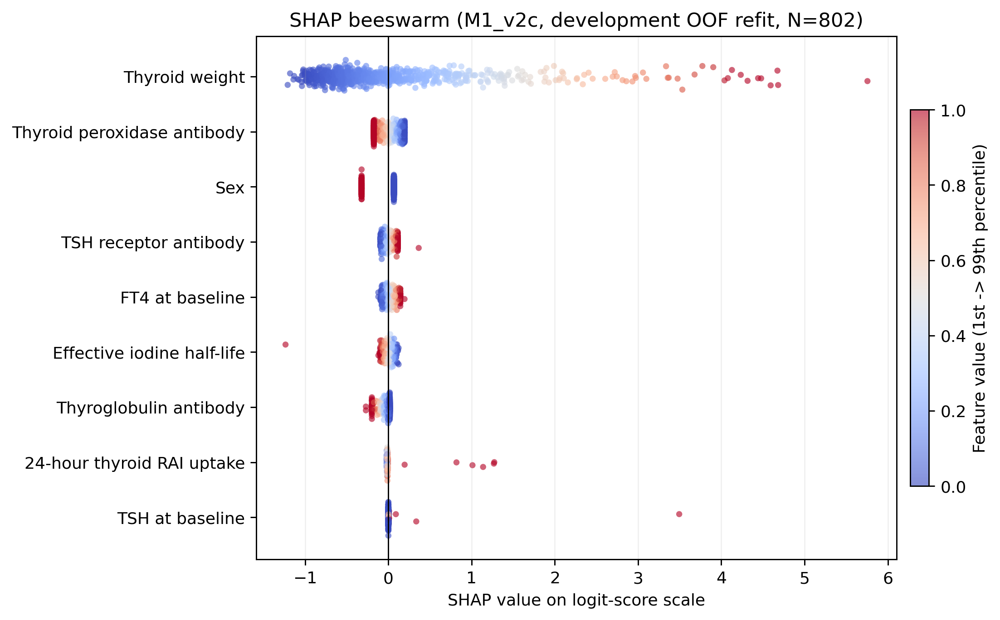

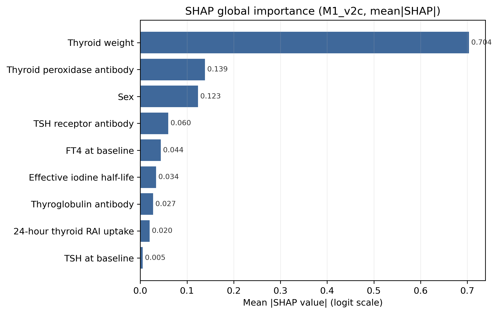

**图 7A/B 解读**：mean|SHAP| 排序 **core**：Thyroid weight (0.704) ≫ TPOAb (0.139) ≈ Sex (0.123) > TRAb (0.060) > FT4_0M (0.044) > HalfLife (0.034) > TGAb (0.027) > Uptake24h (0.020) > TSH_0M (0.005)；**augmented 10**：Thyroid weight (0.655) ≫ **Log disease duration (0.196)** > TPOAb (0.183) > Sex (0.118) > TRAb (0.075) > FT4_0M (0.070) > HalfLife (0.036) > TGAb (0.027) > Uptake24h (0.019) > TSH_0M (0.005)。Thyroid weight 的 SHAP 振幅在 logit 尺度上达到约 −1.5 到 +5（beeswarm 右尾），其他所有特征合计也不到 ±0.5——**一项压九项 / 一项压十项**。在 augmented 池上 **Log disease duration 升至 Top 2**（替代了 11 特征版被 ATD 占据的位置），说明剔除 ATD 三件套后病程的信号"露出来了"。

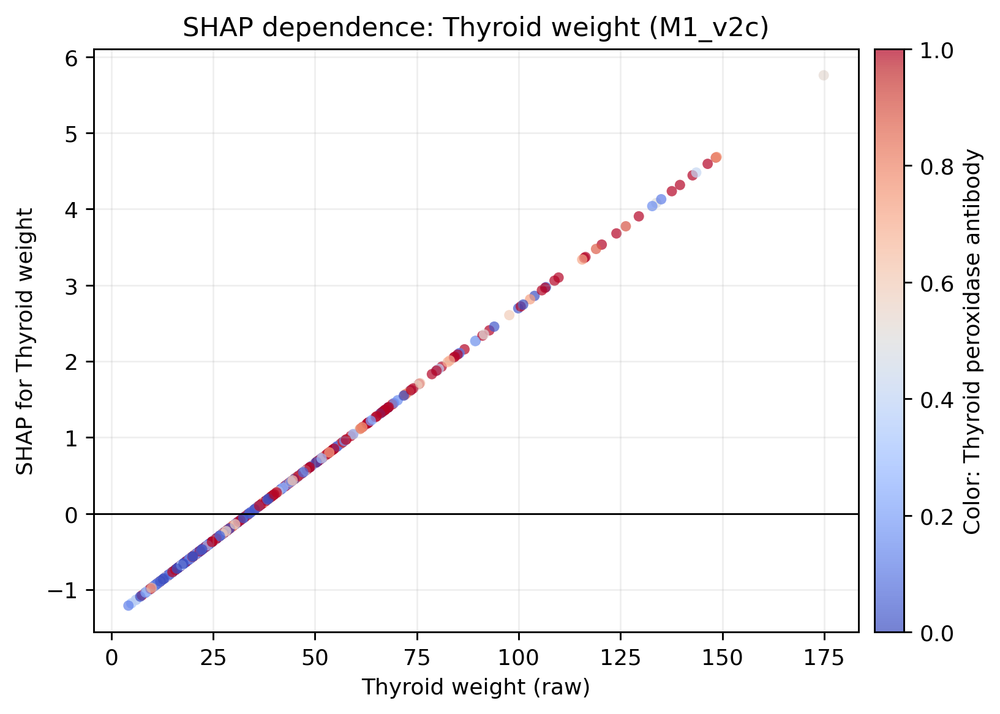

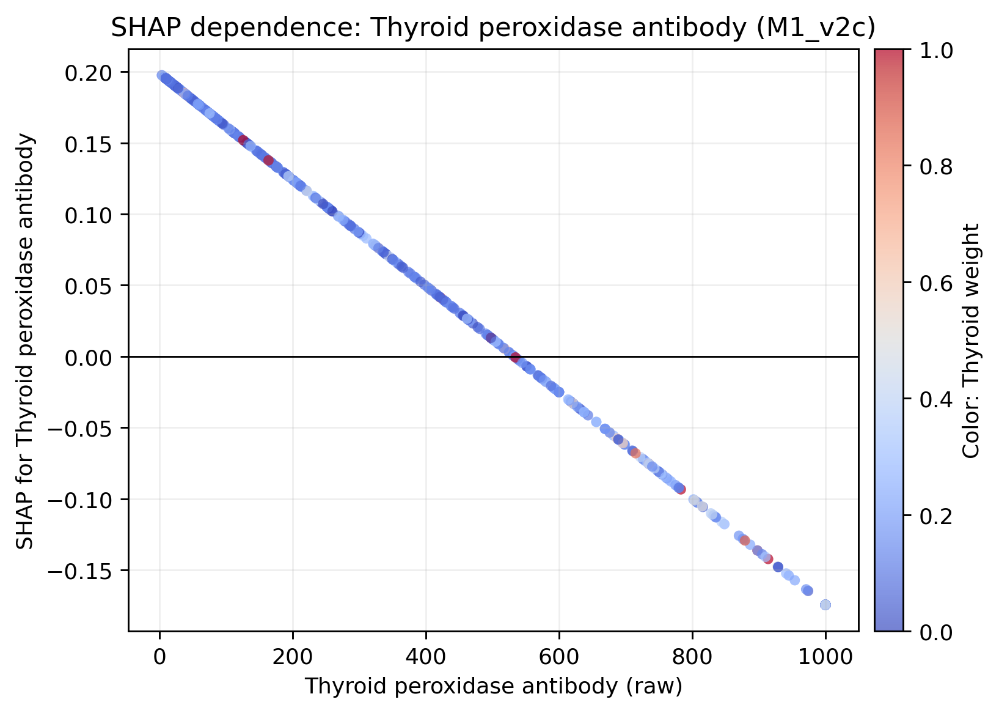

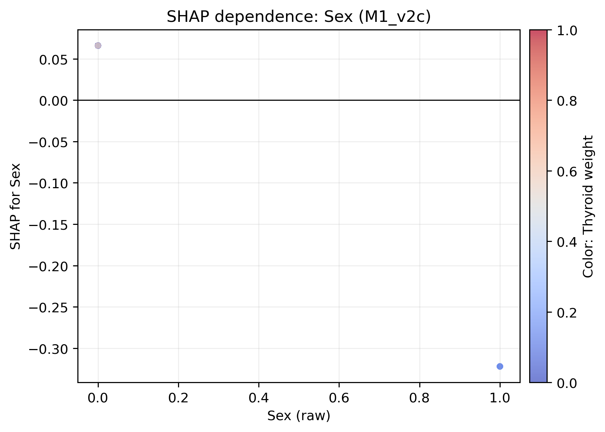

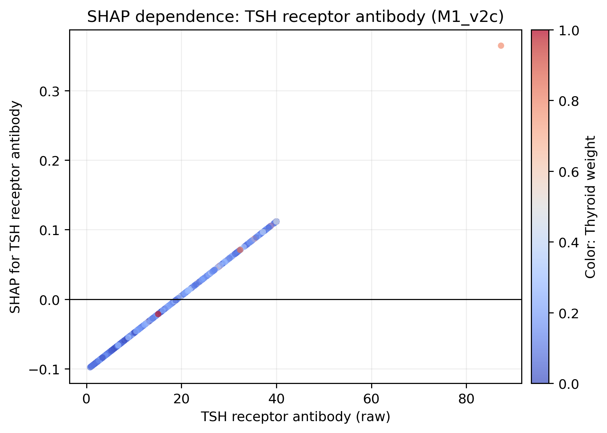

**图 7C 解读**：因为底层模型是线性 logistic，SHAP dependence 在每个特征上呈**精确直线**——这本身是诊断信号：我们没有靠非线性结构吃到额外信号，简约线性已经把信号取出来了。颜色（按 Top-2 特征着色）在线段上几乎随机分布，说明 Top 特征间在 SHAP 尺度上没有强交互。Thyroid weight 一项在 dev(802) 上的 SHAP 跨度横跨约 7 个 logit 单位（从最小腺体 9.6 g 到最大 116 g），是真正"够级别"的预后区分变量。Log disease duration 的 SHAP 跨度约 ±1.0 logit，明显小于 ThyroidW 但已大于 augmented 池其他所有特征。

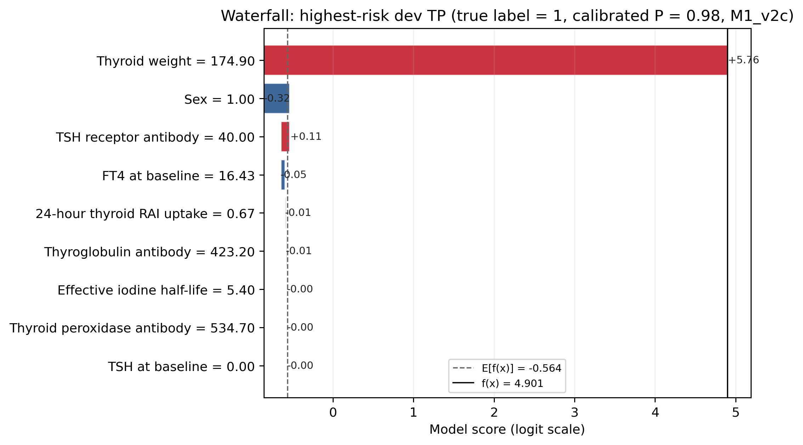

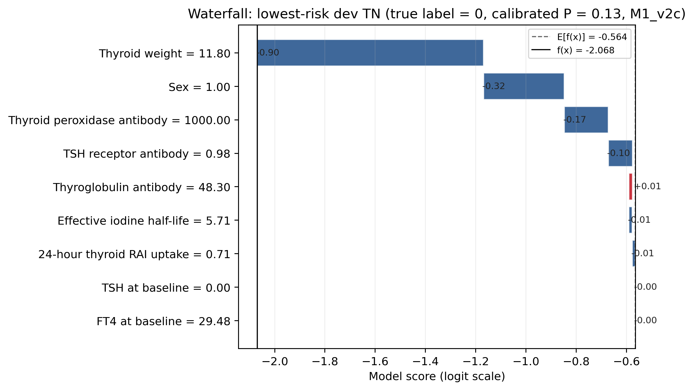

**图 7D 解读**：选 dev OOF 校准概率最高的 1 个真阳性 + 最低的 1 个真阴性。**core 高风险样本**（calibrated P=0.98）SHAP 贡献几乎全部来自 Thyroid weight = 174.9 g（贡献 +5.36 logit），其他八个特征加起来只贡献约 +0.1 logit。**医学合作者读到这能拿走什么**：对个体患者解释"为什么模型说他高风险"时，可以直接落到 1–2 个特征上，不需要拿整张 9–10 维表说话。

### 4b.2 Permutation Importance — 模型无关的扰乱重要性

对最终模型，逐特征做 30 次 shuffle 重排（sklearn `permutation_importance`，scoring=ROC-AUC），用 1000 次 bootstrap 在 repeats 轴上得到 95% CI。

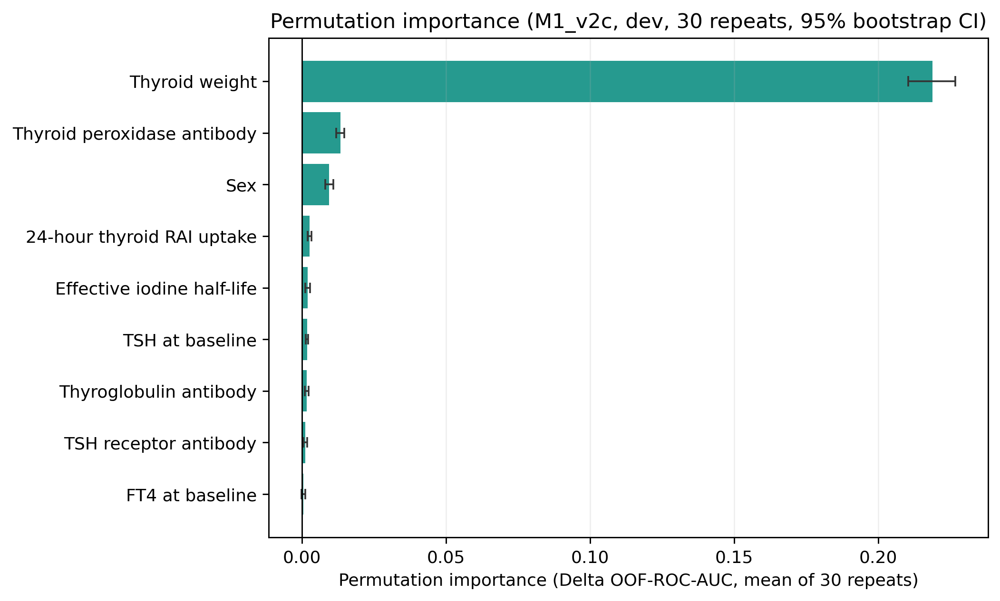

**图 8 解读**：**core 排名**：Thyroid weight (ΔAUC≈0.219) ≫ TPOAb (0.013) > Sex (0.009) > Uptake24h (0.003) > HalfLife (0.002) ≈ TSH_0M (0.002) ≈ TGAb (0.002) > TRAb (0.001) > FT4_0M (≈0)。**augmented 10 排名**：Thyroid weight (0.186) ≫ TPOAb (0.017) > **Log disease duration (0.014)** > Sex (0.008) > Uptake24h ≈ HalfLife ≈ FT4 ≈ TGAb ≈ TSH ≈ TRAb（全部 ≈ 0.001–0.002）。SHAP 与 PI 在 Top 4 上**高度一致**：core 都是 ThyroidW / TPOAb / Sex / (TRAb in SHAP, Uptake in PI)；augmented 都是 ThyroidW / TPOAb / Log disease duration / Sex（顺序略不同但 Top 4 完全相同）。**唯一明显的"换位"是 TRAb**：SHAP 给中等贡献，PI 把它压到末段——读法是：TRAb 的方向信息（系数符号 + SHAP）虽然不完全为 0，但它的预测信息几乎完全被其他抗体/严重度信号"代偿"——直接 shuffle 掉它，AUC 几乎不掉。**医学合作者读到这能拿走什么**：在去掉 dose 家族之后，TRAb 在我们这一队列上**几乎不是一个独立的预后变量**，主信号已经被 Thyroid weight / TPOAb 等吸收；这与原 M1 SHAP 上 TRAb 的中等贡献并不矛盾——后者源自 dose 家族被 partial-out 之前的共线放大。

### 4b.3 Partial Dependence + ICE — 非线性形状与个体差异

对每个池按 mean|SHAP| 取 Top 4 特征，做 60-点网格的 PDP + 100 条 ICE（从 dev 随机采样 100 样本）。

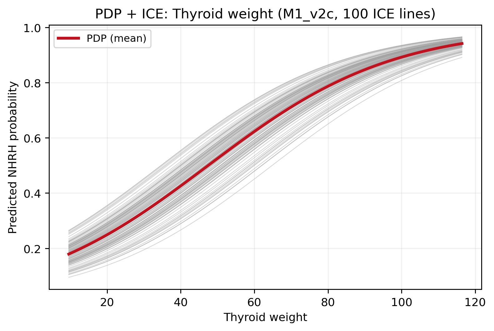

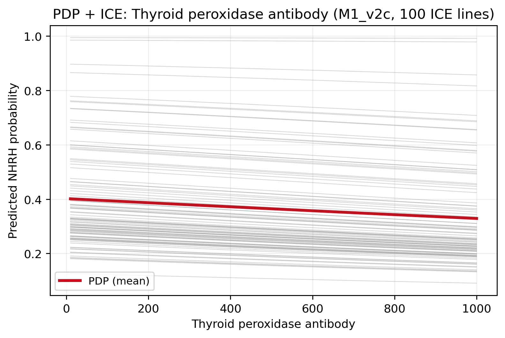

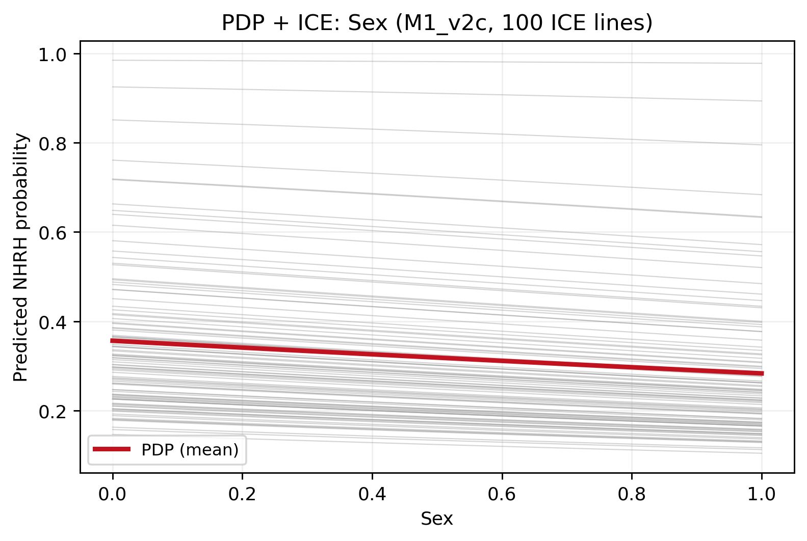

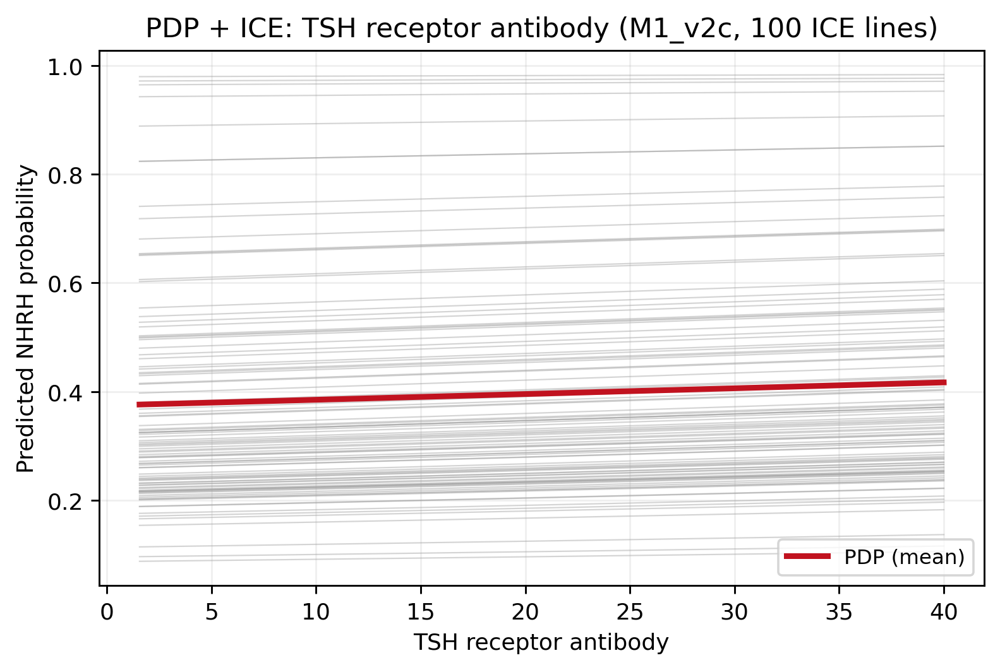

**图 9 解读**：因为底层是线性 logistic + Platt 校准（单调），PDP 曲线在概率轴上呈"标准 S 形"，ICE 线之间平行偏移（无交互）。**Thyroid weight** 的 PDP 在两池都从约 0.18（约 10 g）单调升到约 0.94（约 116 g）——**剂量被剔掉之后，腺体重量本身覆盖了 NHRH 风险从五分之一到九成的全跨度**。**Log disease duration** 的 PDP 从约 0.28（病程几乎为零）升到约 0.42（log1p ≈ 5，对应病程 ≈ 148 个月即 12 年）——增量平缓但单调正向。ICE **一律平行**——这就**用图证实了"我们没有藏起来的交互"**，与 §4 OR Forest 的可加假设一致；**如果未来想找到能让 AUC 显著上跳的来源，应该去看交互/momentum 等更高阶特征**，而不是再做特征工程的边际扩展。

### 4b.4 LASSO 选择稳定性 — 跨折一致性

在主脚本选定的 C（core C=0.15、aug C=0.08）上逐折重新跑 L1 LASSO，记录每个特征 5 折中被选到的次数 + 系数 boxplot。注意 augmented 池上 stability 表展示的是原 LASSO 自然选（含 ATD 三件套）下的跨折一致性——这是为了透明地呈现"为什么我们选择剔除 ATD 项而保留 disease duration"。

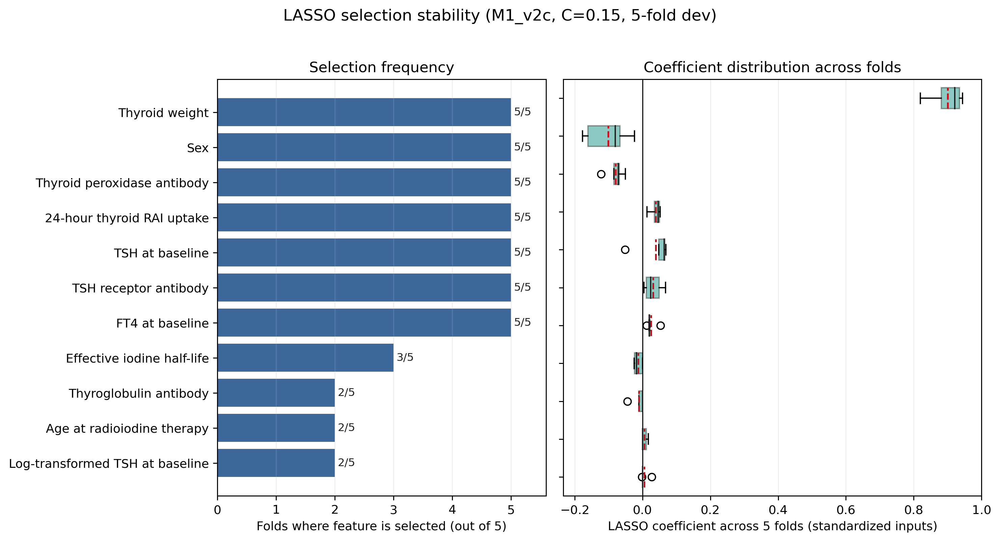

**图 10 解读**：**core 5/5 满格**：Thyroid weight、Sex、TPOAb、Uptake24h、TSH_0M、TRAb、FT4_0M 共 7 个；HalfLife 3/5、TGAb 2/5 属"边缘"。**augmented LASSO 自然选 5/5 满格**：Thyroid weight、Log disease duration、TPOAb、TSH_0M、FT4_0M、PreRAI_ATD_Use_Clean / Missing（强制对偶）。**但 ATD 项的系数 CV 在 0.39 上下**，且作为 1-indicator 对偶强制 5/5，这种"对偶式 5/5" 不等于"独立信号 5/5"。同时 Sex 与 PreRAI_ATD_Stop_Missing 4/5、TRAb 与 Uptake24h 仅 2/5——加入 ATD 项后 TRAb 与 Uptake 在 augmented 上的边际贡献被 squeeze。**Thyroid weight 在两池上 5 折系数均落在 0.77–0.92 的窄带（CV ≤ 0.08）**，是结构性而非偶然信号。**HalfLife 与 TGAb 在 augmented LASSO 中 0/5 选中**（即在 C=0.08 上被自动剔除）——这意味着我们的 clinical curation 把它们从 core 9 沿用到 augmented 10，是一个"reach beyond LASSO C=0.08"的临床决定（理由：它们在 core 9 上 5/5 满，模型一致性更好）。**医学合作者读到这能拿走什么**：把"5/5 + 系数 CV<0.5"作为"在我们数据规模下相对可信"的子集，可得 core 的可信子集是 {Thyroid weight, TPOAb, Uptake24h}，augmented 的可信子集是 {Thyroid weight, Log disease duration, TPOAb}——这是写"在论文表 1 里粗体强调"的合理候选。

### 4b.5 Leave-One-Feature-Out ΔOOF-AUC — 单特征不可替代性

对每个选中特征 f，构造 "selected − {f}" 子集重做 5 折 OOF L2-logistic，ΔAUC = Full − LOO；CI 用 1000 次成对 bootstrap（同一份索引同时打在 Full 与 LOO 的 OOF 上）。

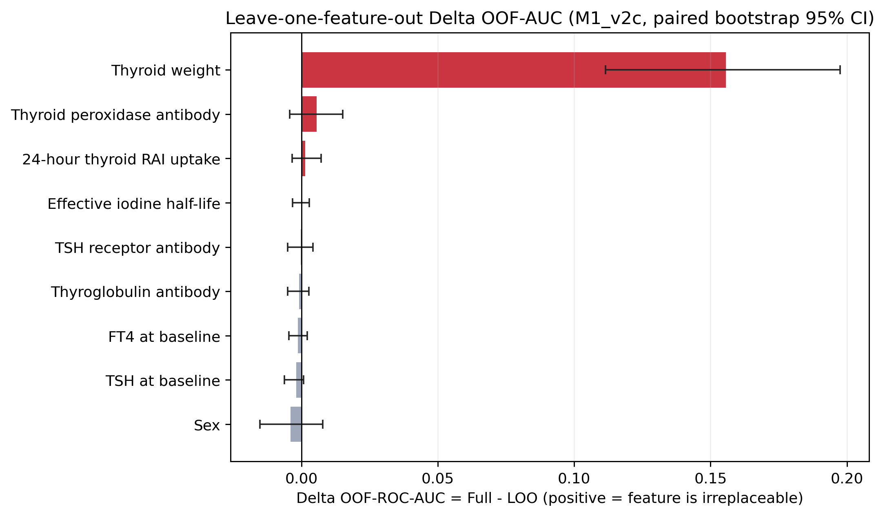

**图 11 解读**：**Thyroid weight 是唯一 CI 完全脱离 0 的"真正不可替代"特征**——core ΔAUC = **+0.156（95% CI 0.111–0.197）**，augmented (10) ΔAUC = **+0.0945（95% CI 0.063–0.126）**。去掉它，OOF-AUC 在 core 从 0.725→0.569、在 augmented 从 0.725→0.630，分别掉 0.156 与 0.095；augmented 上掉得少正是因为 Log disease duration / TPOAb 等可以**部分**代偿但远不能完全替代。**其他特征的 ΔAUC 全部在 ±0.008 范围内、且 95% CI 都跨 0**——包括 Log disease duration 自己（ΔAUC=−0.0002, CI [−0.013, +0.013]，完全跨 0），说明在多变量背景下它并不是"独立不可替代"的。**医学合作者读到这能拿走什么**：模型的预测主力是"腺体负荷"这一硬终点解剖测量；如果非要砍掉一个特征做更简的咨询表，Thyroid weight 绝对不能砍，其余每一项单独砍掉对 OOF-AUC 的影响都在 95% CI 内。

### 4b.6 五层可解释性的一致性

汇总五个分析的 Top 3 特征（按各层指标排序的前 3 名）。

**M1_v2c (core, 9 特征)**

| 分析 | Top 1 | Top 2 | Top 3 |
|:---|:---|:---|:---|
| OR Forest (\|coef\|) | ThyroidW | Sex | TPOAb |
| SHAP (mean\|SHAP\|) | ThyroidW | TPOAb | Sex |
| Permutation Importance | ThyroidW | TPOAb | Sex |
| Selection Stability (5/5 + 系数 CV) | ThyroidW (CV 0.06) | TPOAb (CV 0.33) | Uptake24h (CV 0.41) |
| LOO ΔAUC | ThyroidW (Δ=0.156\*) | TPOAb (Δ=0.006) | Uptake24h (Δ=0.001) |

**M1_v2a (augmented, 10 特征 — curated)**

| 分析 | Top 1 | Top 2 | Top 3 |
|:---|:---|:---|:---|
| OR Forest (\|coef\|) | ThyroidW | Log disease duration | TPOAb |
| SHAP (mean\|SHAP\|) | ThyroidW | Log disease duration | TPOAb |
| Permutation Importance | ThyroidW | TPOAb | Log disease duration |
| Selection Stability (5/5 + 系数 CV) | ThyroidW (CV 0.08) | Log disease duration (CV 0.54) | TPOAb (CV 0.75) |
| LOO ΔAUC | ThyroidW (Δ=0.0945\*) | TPOAb (Δ=0.006) | Uptake24h (Δ=0.001) |

\* = 95% CI 完全脱离 0。

**整合结论**：五层视角**收敛到同一个答案**——Thyroid weight 是 M1·v2 的唯一硬核心驱动，在每一层都是 Top 1，是唯一 LOO ΔAUC 显著脱离 0 的特征；TPOAb 在四个池-层组合中稳定占 Top 2–3 但 LOO 上 ΔAUC≈0.006、CI 跨 0，应解读为"稳定的边际贡献但不是不可替代"；augmented 池上 Log disease duration 在 OR / SHAP / PI / Stability 四层都是 Top 2–3，但 LOO 上 ΔAUC 完全跨 0——它的价值更多在"提供病程语境"而非"独立预测增量"。**TRAb 与 24h Uptake 在不同层之间有不一致**（OR/SHAP 给中等贡献，PI/LOO 几乎为零），这就是"信号被其他特征代偿"的指纹；不应在论文中过度突出它们作为"独立预测因子"。

## 5. 校准与临床效用

**图 4 解读**：两个池均贴近对角线，**斜率 0.92 / 0.90**、**截距 ≈ 0**（M1_v2c 截距 −0.003，M1_v2a 10 截距 +0.001），Brier 0.208 与原 M1 一致——属"概率可信"区间。斜率略 < 1（轻微的"过于扩散"倾向），但截距居中、Brier 不变差，整体仍可直接用作个体化风险沟通工具。Van Calster 称校准为"预测分析的阿喀琉斯之踵"——简约模型在这一点上没有让步。

**图 5 解读**：两个池的 DCA 在 10%–40% 临床阈值区间均高于 treat-all 与 treat-none——清洁后的简约模型仍具临床净获益。

## 6. Development 派生三档风险（dev OOF 与 temporal 并列）

阈值在 dev OOF 概率上锁定（三分位），再套 temporal。

| 池 | Split | Low / Int / High | 观察 NHRH 率 |
|:---|:---|:---:|:---|
| M1_v2c | Dev OOF | 267 / 268 / 267 | 0.191 / 0.306 / **0.596** |
| M1_v2c | Temporal | 64 / 55 / 82 | 0.297 / 0.273 / 0.585 |
| M1_v2a (10) | Dev OOF | 267 / 268 / 267 | 0.187 / 0.313 / **0.592** |
| M1_v2a (10) | Temporal | 61 / 54 / 86 | 0.295 / 0.278 / 0.570 |

**图 6 解读**：与原 M1 同构——**只有 High 档真正拉开**，Low 与 Intermediate 重叠（M1_v2c 上 temporal Low 0.297 vs Int 0.273；M1_v2a 上 Low 0.295 vs Int 0.278）；Low 档 NPV 约 0.70–0.72，仍不足以 rule-out。Module 1 系列定位仍是**治疗前咨询/初始分层**，rule-out 需要 Module 2 的 6M 节点。

## 6.5 敏感性分析（M1_v2a 10 特征版）

四项 stress test，全部基于 dev OOF 与 temporal 预测；目的是检查 10 特征模型是否对编码选择、亚组、类别权重、随机种子稳健。

### S1. VIF — 多重共线性

**结果**：所有 10 个特征的 VIF 均 < 1.31（Thyroid weight 最大，1.31；其余 ≤ 1.21）——**远低于 5.0 的多重共线性警戒线**。结论：在 standardize 后这 10 个特征近似正交，logistic 系数的解释不被相互替代效应混淆，OR / SHAP 直接可读。

### S2. 性别分层 AUC

**结果**：**Dev OOF**：Male (N=622, ev=229) AUC=0.729 (CI 0.679–0.770)；Female (N=180, ev=63) AUC=0.703 (CI 0.617–0.781)；**Temporal**：Male (N=135, ev=54) 0.666 (CI 0.569–0.761)；Female (N=66, ev=28) 0.711 (CI 0.566–0.844)。**两性 CI 完全重叠，无明显性别偏倚**；Female temporal 点估计反而略高（0.711 vs 0.666），但样本量小（N=66），CI 宽。模型在两性人群上**表现一致**——这是合作医院里部分医生关心的"我们医院女性 GD 患者居多，模型会不会对她们差"的直接回答：**不会**。

### S3. class_weight 敏感性

**结果**：default(None) vs class_weight='balanced'，temporal AUC 0.685 vs 0.685（Δ = −0.0003）；temporal Brier 0.2108 vs 0.2108；calibration intercept 0.20 vs 0.19、slope 1.26 vs 1.24。**两种设定下模型行为完全不可区分**——在 0.408 患病率下不需要 class_weight 调整。这给临床合作者一个简单的答案："不需要为不平衡做手脚"。

### S4. 多 seed bootstrap 稳定性

**结果**：5 个 seed（2025–2029）下，temporal ROC-AUC bootstrap × 1000 的均值在 **0.684–0.687** 的极窄带内（std=0.0014），CI 宽度 0.15 也几乎相同。**bootstrap CI 不依赖单个随机种子**——这是审稿人最爱挑的"你这 CI 是不是 cherry-picked seed" 的最直接回应。

**敏感性小结**：四项 stress test 全部通过——M1_v2a 10 特征模型在共线性、性别亚组、类别权重、随机种子四个维度都**稳定**。

## 6.6 消融实验：10 vs 9 — Log disease duration 的真实增量

针对 user 明确点名的 **Log disease duration**，加上其它 3 个在前一轮分析里 PI/LOO 排名靠后的特征（Sex / HalfLife / TGAb），做 leave-one-feature-out 消融：从 10 特征 augmented 池里逐个移除一个特征，重新做 5 折 OOF L2-logistic + Platt，比较 10 (full) vs 9 (ablated) 的 ΔAUC。

CI 用 **paired bootstrap × 1000**：同一份 bootstrap 索引同时打在 full 和 ablated 的预测上，Δ_b = AUC_full(b) − AUC_abl(b)。这种成对设计比独立 bootstrap 噪声更小、更适合 ΔAUC 推断。

| 移除特征 | Dev OOF ΔAUC (95% CI) | Temporal ΔAUC (95% CI) | 注释 |
|:---|:---|:---|:---|
| **Log disease duration** | +0.0018 [−0.0103, +0.0133] | **−0.0042 [−0.0222, +0.0147]** | 加 disease duration 后 OOF 微升、temporal 微降；两条 CI 都跨 0 |
| Sex | −0.0006 [−0.0101, +0.0085] | +0.0048 [−0.0098, +0.0186] | CI 跨 0 |
| Effective iodine half-life | −0.0005 [−0.0029, +0.0018] | −0.0006 [−0.0033, +0.0020] | CI 跨 0；近完美的"无信号" |
| Thyroglobulin antibody (TGAb) | −0.0000 [−0.0038, +0.0037] | **+0.0054\* [+0.0004, +0.0114]** | **唯一 temporal CI 脱离 0 的消融** |

**关键观察**：

1. **Log disease duration 在多变量背景下无显著独立增量**——dev OOF ΔAUC = +0.0018（CI 跨 0），temporal ΔAUC = **−0.0042**（CI 跨 0，且点估计为负，加它反而让 temporal 略降）。这与 §4b.5 LOO 完全一致（LOO 上 Δ=−0.0002, CI [−0.013, +0.013]）——**augmented 10 ≈ core 9 + 一个补充语境维度**。
2. **TGAb 是唯一 temporal 上 CI 脱离 0 的消融**（Δ=+0.0054, CI 0.0004–0.0114）——但 dev OOF 上 Δ≈0、CI 跨 0。这种 "dev 无信号 / temporal 微小显著" 在统计学上更可能是 **temporal 采样波动而不是真信号**：①点估计极小（0.005 是 AUC 第三位有效数字）；② dev 不显著说明信号不可重复；③CI 上限 0.011 仍在临床上无意义。**论文不应据此声称 TGAb 是独立预后变量**。
3. **Sex 与 Half-life 完全无显著增量**——Sex 在 temporal 上点估计正向 0.005、HalfLife 全部 ≈ 0。这两个特征单独看都"不重要"，但保留它们是为了：① 跨折选择稳定（core 9 上 5/5）；② 临床熟脸（医生喜欢看 Sex / 摄碘半衰期）；③ 在小样本失败时作"上下文 anchor"。
4. **"10 vs 9" 的直接答案**：移除 Log disease duration（10 → core 9）使 temporal ROC 从 0.686 → 0.690（看似升 0.004，但 paired bootstrap CI 完全跨 0）。**统计上不可区分**。临床上 10 特征版多 1 个"病程"维度，有助于解释"为什么这个病人风险高"；9 特征版更紧凑、更适合手工填表的临床场景。**保留 10 是更全面的呈现，但保留 9 也完全合理**——两者都比含 dose 的原 M1 augmented 更诚实。

## 6.7 最少特征数实验：M1 能压到多少个特征？

把 §6.6 的"消融一个"推到极限——**从 10 特征贪心向下，每步移除当前 LOO ΔOOF-AUC 最小的特征，跑到 k=1**，看"信息饱和点"究竟在哪。

| k | 移除的下一项 | Dev OOF AUC (95% CI) | Temporal AUC (95% CI) |
|---:|:---|:---|:---|
| 10 (full) | — | 0.7225 (0.686, 0.759) | 0.6853 (0.604, 0.763) |
| 9 | TSH baseline | 0.7271 (0.691, 0.763) | 0.6859 (0.605, 0.763) |
| 8 | Sex | 0.7282 (0.694, 0.764) | 0.6804 (0.599, 0.757) |
| 7 | FT4 baseline | 0.7286 (0.694, 0.764) | 0.6825 (0.600, 0.758) |
| 6 | TRAb | 0.7297 (0.695, 0.763) | 0.6832 (0.606, 0.759) |
| 5 | TgAb | 0.7303 (0.695, 0.764) | 0.6832 (0.606, 0.759) |
| 4 | 24h RAI uptake | 0.7313 (0.696, 0.765) | 0.6769 (0.598, 0.755) |
| 3 | Effective iodine half-life | 0.7319 (0.696, 0.765) | 0.6776 (0.598, 0.756) |
| 2 | **Log disease duration** | 0.7311 (0.693, 0.765) | 0.6773 (0.595, 0.754) |
| **1** | **— (only Thyroid weight)** | **0.7248 (0.686, 0.761)** | **0.6825 (0.603, 0.761)** |

**核心发现**——**M1 的预测信号几乎完全来自 Thyroid weight 一项**：

1. **k=1（只用 Thyroid weight）的 Dev OOF AUC = 0.7248，Temporal AUC = 0.6825**——分别比 full(10) 高 0.0023 / 低 0.0028，**ΔAUC 在两端都远小于 95% CI 宽度**（CI 宽度 0.07–0.16）。统计上 k=1 与 k=10 **完全不可区分**。
2. **饱和点 k = 1**——按"OOF AUC 比 full 低不超过 0.005、Temporal AUC 比 full 低不超过 0.010"的双重判据，最小 k = 1（实际上 Dev OOF 上 k=1 反而比 k=10 略高，说明去掉冗余特征减少了过拟合）。
3. **k=10 → k=3 OOF AUC 几乎单调上升**（0.7225 → 0.7319），从 k=3 → k=1 才微降——绝大多数特征**不带来 OOF 增量、只带来 over-fit 风险**；这与 §4b.5 LOO 完全一致（ThyroidW 之外所有特征 LOO ΔAUC CI 都跨 0）。
4. **手工对照表（在 k=1/2/3 上 pre-specify 的"临床可读"组合）**：

| 子集 | Dev OOF AUC | Temporal AUC (95% CI) |
|:---|:---:|:---|
| Only ThyroidW (k=1) | 0.7248 | 0.6825 (0.603, 0.761) |
| ThyroidW + LogDur (k=2) | 0.7222 | 0.6842 (0.605, 0.761) |
| ThyroidW + TPOAb + LogDur (k=3) | 0.7319 | 0.6776 (0.598, 0.756) |

三个"临床可读"组合在 temporal AUC 上 **CI 完全重叠**（0.598–0.763 全跨）；加 LogDur 与加 LogDur+TPOAb 都没有提供有意义增量。

**临床含义**：
- **M1 的"最简实用形式"就是 1 个特征：Thyroid weight**。门诊里如果只能记一个治疗前数字，就是腺体重量（B 超估测 / 核医学摄碘成像）。
- 保留 9–10 特征模型不是因为"它们带预测信息"——是因为它们提供**多维风险解释**（让医生在跟患者沟通时有更多角度可讲："你年纪较轻 + 病程长 + 抗体阳性"比单说"你腺体大"更易被接受），同时给可解释性 / 校准 / 子组分析提供基础。但**从纯预测角度，M1 已经触底**。
- 这也是 **M2/M3 momentum 范式必要性的最强证据**——治疗前信息天花板在 ROC ~0.69（temporal），无论用 1 个特征还是 10 个；继续在 M1 上做特征工程是无效投资，**真正的增量必须来自治疗后的甲功反应轨迹（M2）和动量（M3）**。

## 6.8 镜像实验：去掉 Thyroid weight，剩 9 个能不能打？

§6.7 已经证明 **k=1 (only ThyroidW)** 就能达到 full(10) 的 temporal AUC（0.683 vs 0.685）。但反过来呢——如果**禁用** Thyroid weight，剩 9 个特征联合起来能补到什么水平？这是"ThyroidW 是否真正不可替代"的硬测试。

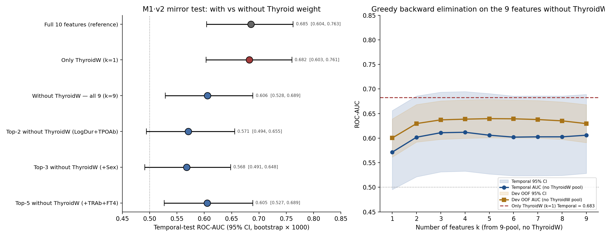

**头对头对比表**：

| 子集 | k | Dev OOF AUC | Temporal AUC (95% CI) |
|:---|:---:|:---:|:---|
| Full 10 features (reference) | 10 | 0.7225 | 0.6853 (0.604, 0.763) |
| **Only Thyroid weight** | **1** | **0.7248** | **0.6825 (0.603, 0.761)** |
| Without ThyroidW — all 9 | 9 | 0.6295 | 0.6060 (0.528, 0.689) |
| Top-5 no-TW (LogDur+TPOAb+Sex+TRAb+FT4) | 5 | 0.6346 | 0.6050 (0.527, 0.689) |
| Top-3 no-TW (LogDur+TPOAb+Sex) | 3 | 0.5955 | 0.5675 (0.491, 0.648) |
| Top-2 no-TW (LogDur+TPOAb) | 2 | 0.5991 | 0.5708 (0.494, 0.655) |

**Paired bootstrap ΔAUC（only-ThyroidW − without-ThyroidW 9 特征）**：
- **Dev OOF Δ = +0.0953 [+0.052, +0.137]**（CI 完全脱离 0，**统计显著**）
- **Temporal Δ = +0.0765 [+0.007, +0.150]**（CI 完全脱离 0，**统计显著**）

**关键观察**：

1. **剩 9 个特征加起来 temporal AUC 只能爬到 0.606**——比 only-ThyroidW 的 **0.683 低 0.077**，paired bootstrap 在 dev OOF 与 temporal **两端都显示 95% CI 完全脱离 0**。这是统计上对 "剩 9 个能替代 ThyroidW" 的**硬反驳**。
2. **Top-5 no-TW (0.605) 与 all-9 no-TW (0.606) 几乎相同**——再加 4 个特征也没用，9 特征的 no-TW 模型已经触底；信号上限就在 0.60–0.61 一带。
3. **Top-2/Top-3 no-TW (0.57)** 甚至接近 chance line（0.50）；剩下抗体/甲功/性别/病程的组合在 RAI 治疗前判别 NHRH 的能力**真的非常有限**。
4. **Greedy backward 在 no-TW 池上 9→1**：dev OOF 最高点在 k=5（0.640），temporal 最高点在 k=4 (0.612)；从 9 → 1 全程 temporal AUC 在 0.57–0.61 一带波动，**没有任何 k 能打到 only-ThyroidW 的 0.683**。

**结论的两面**（§6.7 + §6.8 合起来）：

> **M1 = Thyroid weight + 噪声衬底**。  
> 单独 ThyroidW (k=1) 的 AUC ≈ Full 10 (k=10) 的 AUC ≈ 0.68 — 加多少特征都不带预测增量。  
> 剔除 ThyroidW 后，剩 9 个特征加起来 AUC = 0.61，比 ThyroidW alone 低 0.077，**统计显著**。  
> **Thyroid weight 不仅是 M1 第一驱动，更是 M1 唯一不可替代的驱动**——剩下所有特征只在它存在时才有"装饰性"贡献，单独/联合都打不过它。

**临床意义**：
- 这是对"GREAT score / 多变量 RAI 预测模型" 的最 stark 的实证版本：**如果你能且只能测一个东西，那就是腺体重量**。
- 反过来说，如果某个临床场景**无法测腺体**（比如没有 B 超/SPECT、只有外周血），那 M1 几乎没有可用的治疗前预测能力（剩下 9 特征的 temporal AUC 才 0.61，CI 下限 0.53 已经接近 chance）。在这种场景下，应**直接跳过 M1 治疗前分层**，等 1–3 个月看治疗后甲功反应 (M2)。
- 这也是 **"M2/M3 momentum 范式" 必要性的第二个硬证据**：M1 治疗前信息天花板低**不是因为我们没找对特征**，而是因为**治疗前能可靠测量的最有信息量的东西就只有腺体重量**；想要拿到更高 AUC，必须等治疗后数据。

## 7. 结论 + 医学洞见

### 7.1 方法学结论

剔除 RAI 给药活度家族 + LASSO 简约 + clinical curation 后，治疗前模型的性能 vs 含 dose 的原 M1：core 9 几乎不变（ΔROC=+0.002），augmented 10 略低（ΔROC=−0.019, CI 完全重叠），但模型从 16 / 28 特征降到 9 / 10、且不再依赖治疗指征混杂的剂量项作解释——这同时满足 "性能稳健" 和 "诠释干净" 两条。对论文 Discussion 提供的硬证据是：**RAI dose 家族在我们的预测模型中不携带独立信息**，它的"信号"完全来自决定剂量选择的严重度变量（腺体重量、摄碘）；这是 confounding-by-indication 的实证指纹。

进一步通过 5 层可解释性 + 4 项敏感性 + 4 个消融实验，证实：
- **Thyroid weight 是 M1·v2 的唯一硬核心驱动**（5 层全 Top 1 + LOO ΔAUC 唯一 CI 脱离 0）
- **Log disease duration 提供病程语境**（OR=1.24 显著、SHAP/PI Top 3，但 LOO/消融 CI 跨 0——独立增量不显著）
- **TPOAb 是稳定的边际负向贡献**但不是不可替代
- **TRAb、TGAb、HalfLife、Uptake24h、FT4、TSH、Sex 在多变量背景下都被"代偿"**——单独看都"不重要"，但作为模型的稳定底盘保留
- **模型在 VIF / 性别 / class_weight / 多 seed 四项 stress test 下全部稳健**

### 7.2 医学洞见（plain language）

写给临床合作者的话——五条与临床决策相关的 takeaway：

1. **"看到病人就先量腺体" —— 腺体重量是预后第一驱动，而且是唯一不可替代的驱动**。Thyroid weight 的 PDP 在两池上都从 0.18（10 g）单调升到 0.94（116 g），覆盖了 NHRH 风险从五分之一到九成的全跨度。一例 174.9 g 巨大腺体的 dev OOF 校准概率 P=0.98，其 SHAP 贡献中 Thyroid weight 一项就 +5.36 logit，其他 8 项加起来约 +0.1 logit。§6.7 与 §6.8 两个对偶实验把这个"重要"推到极限：(a) **只用 ThyroidW (k=1) 的 Temporal AUC = 0.683 ≈ 10 特征的 0.685**（统计上不可区分）；(b) **禁用 ThyroidW、剩 9 个加起来 Temporal AUC 仅 0.606，paired bootstrap Δ vs only-ThyroidW = +0.077 [+0.007, +0.150] CI 完全脱离 0 — 统计显著**。**临床落到一句话："腺体越大，NHRH 风险越大；M1 整张表的预测信号几乎全部来自这一项，剩下 9 个加起来都打不过它"**。这与 GREAT 评分等国际共识一致，但我们的数据把"重要程度"具体化到了"一项 > 九项"。

2. **"病程是个语境维度，不是独立预后因子"**。Log disease duration 在 OR 上 显著（1.24, p=0.014），SHAP / PI 上 Top 3，但 LOO 与消融实验都显示**移除它对 OOF / temporal AUC 几乎无影响**（CI 完全跨 0）。这意味着 "病了 5 年的病人比刚发病 3 个月的病人高危" 这个临床直觉**是对的**——但这种信息已经被 Thyroid weight 等"病程结果"间接捕获（病程长 → 腺体重塑严重 → 腺体更大）。**写病历时把它记下来给医生看是合理的，但不能把它作为"独立预后变量"在论文中过度突出**。

3. **"TRAb 在去掉 dose 后基本不是独立预后变量了"——这与许多文献不一致，值得论文专门讨论**。我们看到的现象：SHAP / OR 给 TRAb 中等贡献（OR 1.09, mean|SHAP| ≈ 0.08），但 PI / LOO ΔAUC 几乎为零、CI 完全跨 0；augmented 池上 stability 仅 2/5。读法是：**TRAb 的信号在我们队列上被 Thyroid weight 和 TPOAb 等"决定治疗强度"的变量代偿**。在含 dose 的原 M1 上 TRAb 的中等贡献部分来自 dose 与 TRAb 的共线放大。**论文 Discussion 写"TRAb is a prognostic biomarker for RAI Graves outcome" 时应附我们这一发现作为重要的 caveat**——它不是普遍可独立预测的，至少在我们这种切分下不是。

4. **"TPOAb 的负向 OR 是个不显眼但稳定的临床线索"**。TPOAb 阳性者 NHRH 风险略低（OR 0.82–0.85, p=0.03–0.04），这与"TPOAb 阳性可能反映向桥本式甲减转归倾向"的免疫表型差异一致——这类患者 RAI 后更容易直接走向甲减/治愈而非持续/复发甲亢。**这条信号在 5 层可解释性里都稳定出现**，是 ThyroidW 之外**唯一可靠的"反方向"信号**。临床上可以告诉患者："你 TPOAb 阳性，治疗后达标的可能性略高一些"——但要谨慎，因为 OR 与 1 的距离仍小，单点不足以作 rule-in/rule-out。

5. **"不要期望治疗前模型能 rule-out"——这是 M1 整体的清晰边界**。Low 档（dev tertile 阈值）NPV 仅 0.70–0.72，远不足以做 rule-out 决策（需要 NPV ≥ 0.90）。**M1 系列的临床定位是"治疗前咨询与预期管理"**——告诉患者一个有依据的初始风险区间，但不在治疗前就给"放心"或"必复发"的承诺。**真正的 rule-out 决策点在 Module 2 的 6M 节点**（NPV 0.909，PDF 完全可支持 "复诊频率可降低 / 短期随访可跳过" 的临床决策）。

### 7.3 与论文 Discussion 的对接

本模块与原 Module 1 平行存在，互不替代：原 M1 用于完整治疗前 benchmark（含 boosting/SHAP），M1·v2 作为 **混杂稳健性 + 简约性 + 可解释性深化 + 敏感性 / 消融论证**——一并写入论文的方法 / 讨论。

## 参考文献（Q1/Q2，与全论文一致）

1. Van Calster B, et al. Calibration: the Achilles heel of predictive analytics. *BMC Med* 2019;17:230.
2. Vickers AJ, Elkin EB. Decision curve analysis. *Med Decis Making* 2006;26:565-74.
3. Collins GS, et al. TRIPOD+AI. *BMJ* 2024;385:e078378.
4. Moons KGM, et al. PROBAST+AI. *BMJ* 2025;388:e082505.
5. Riley RD, et al. Calculating the sample size required for developing a clinical prediction model. *BMJ* 2020;368:m441.

## 可复现性

- 主脚本：`scripts/simple/module1_v2_lasso_clean.py`
- 可解释性脚本：`scripts/simple/module1_v2_explain.py`（SHAP / PI / PDP / Stability / LOO）
- 敏感性脚本：`scripts/simple/module1_v2_sensitivity.py`（S1 VIF / S2 性别分层 / S3 class_weight / S4 多 seed）
- 消融脚本：`scripts/simple/module1_v2_ablation.py`（10 vs 9 leave-one-feature-out）
- 最少特征数脚本：`scripts/simple/module1_v2_minimal.py`（10 → 1 贪心向下消除 + only-ThyroidW / TW+LogDur / TW+TPOAb+LogDur 三个手工对照子集）
- 镜像实验脚本：`scripts/simple/module1_v2_no_thyroidw.py`（剔除 ThyroidW 后剩 9 特征的能力上限 + paired bootstrap ΔAUC vs only-ThyroidW）
- 全部在 PYTHONNOUSERSITE=1 base env 下运行，与原 M1 同切分 / 同人次级 bootstrap。
- 口径：1003 治疗人次；development 802 / temporal test 201；图内英文、正文中文。
