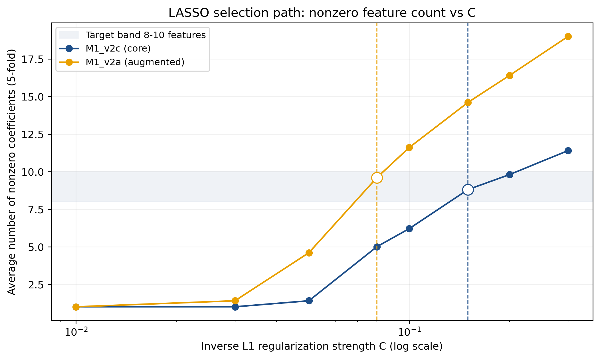
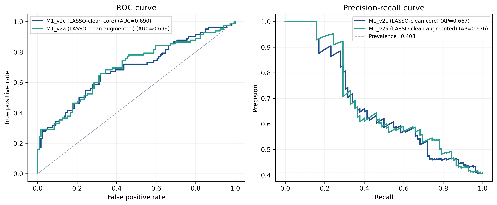
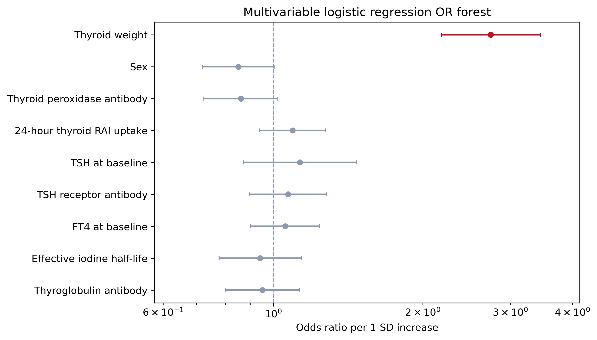
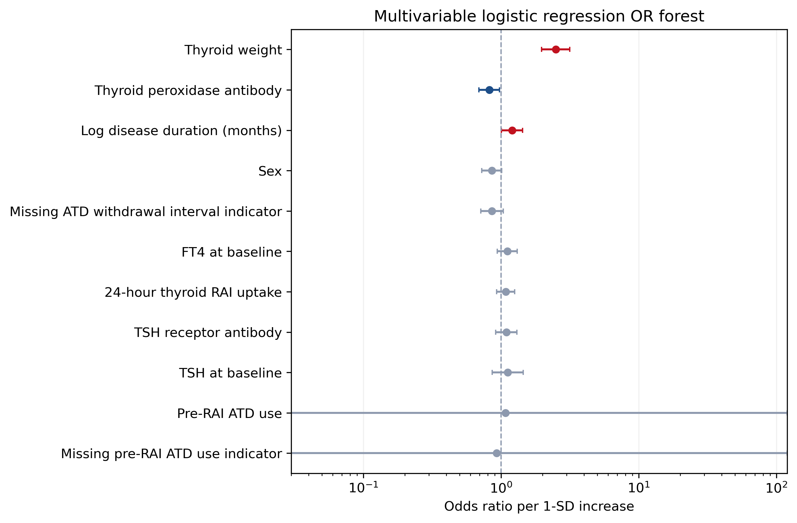
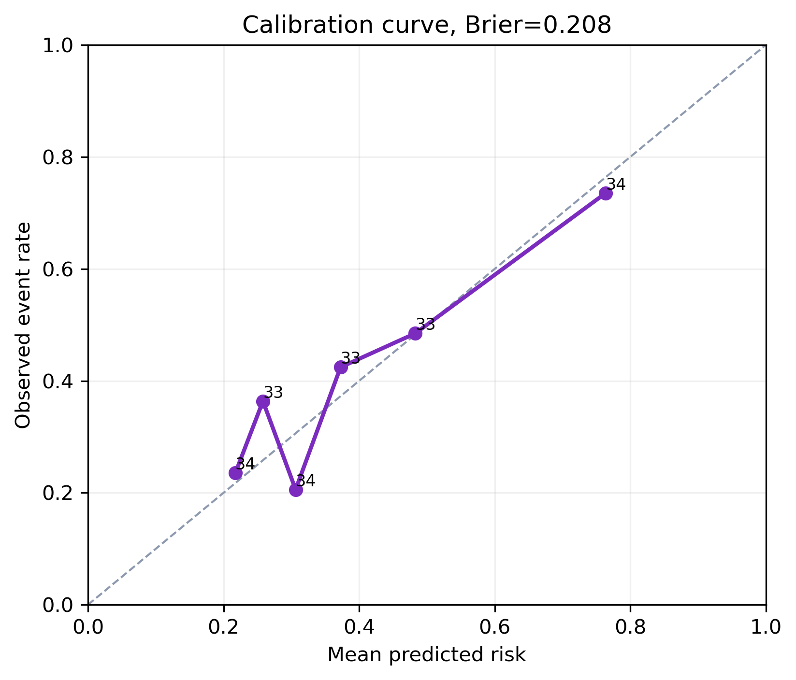
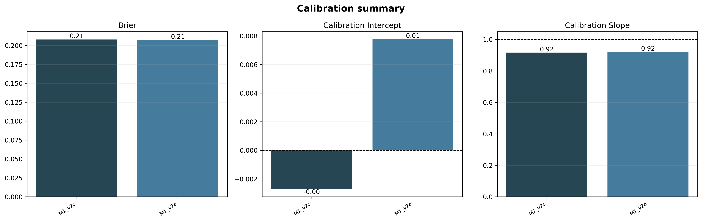
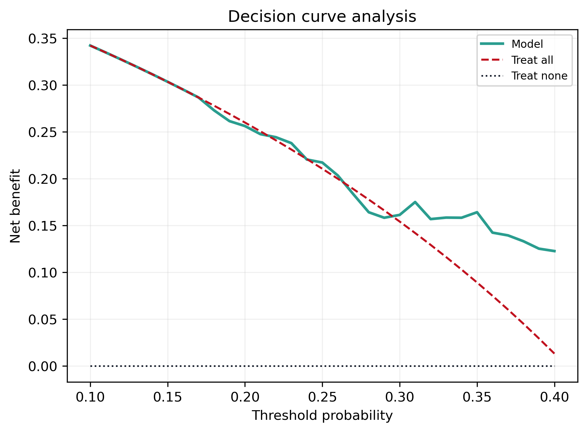
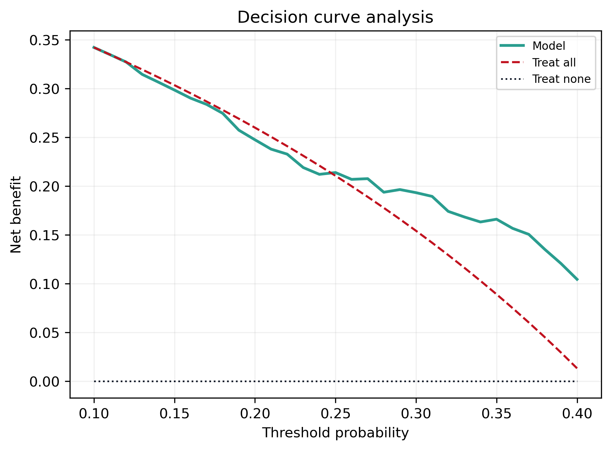
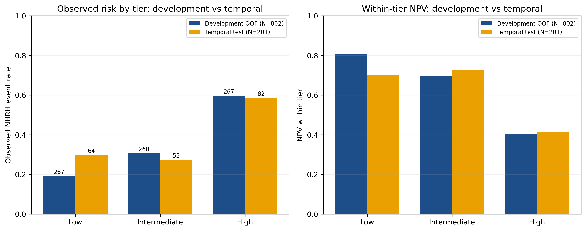
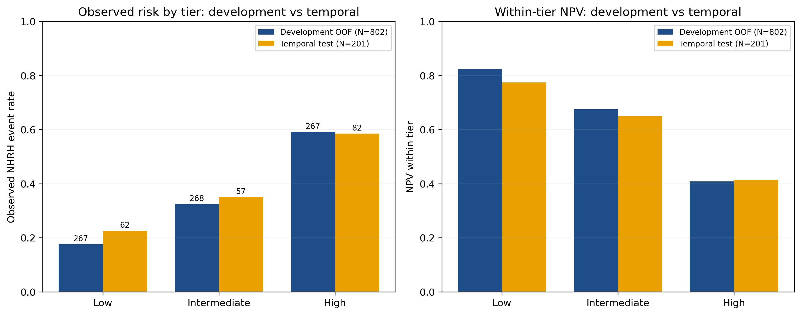

# Module 1·v2：去 RAI 剂量、LASSO 简约的治疗前预期模型

> 与原 Module 1（含完整治疗前特征）平行的"清洁版"。两项设计变更：①移除 RAI **给药活度（Dose）及其衍生项**（IDPG_Dose_per_ThyroidW 等剂量×腺体派生），避免治疗指征混杂；②**LASSO 选 8–11 个特征**，刻意做参数节俭模型。新模型不替代原 M1，作为治疗前预期模型的"诚实-简约"版与混杂稳健性分析。

## 摘要

1003 个 RAI 治疗人次，按治疗时序切分 development 802 / temporal test 201。在剔除 dose 家族（给药活度本身由医生按腺体负荷与严重度滴定，属治疗指征混杂）后，对剩余治疗前候选变量做 L1-logistic（LASSO）路径选择（5-fold OOF，C 网格），选定单 C 使均值非零系数落在 **8–11**：core 池在 C=0.15 选 **9 个特征**（M1_v2c），augmented 池在 C=0.08 选 **11 个特征**（M1_v2a），再在选定子集上以 L2-logistic + Platt 校准重拟合并出 OOF 与 temporal 预测。

**核心发现**：与原 M1（包含 dose 家族、core 16/augmented 28 特征）相比，temporal-test ROC-AUC 几乎不变（M1_v2c 0.690 vs 原 0.688，Δ +0.002；M1_v2a 0.699 vs 0.704，Δ −0.005），PR-AUC 与 Brier 同样几乎不变（ΔBrier ≤ 0.001）。**给药活度家族在原 M1 中并未携带独立预测信息**——其信号已被甲状腺重量、摄碘率、半衰期等"决定剂量决策"的严重度变量吸收（治疗指征混杂的指纹）。在性能不变的情况下，模型从 16/28 维降到 9/11 维，更简约、更不依赖混杂解释、与"治疗前结局预期、非剂量优化、非因果"定位更一致。

## 1. 设计

**为何剔除 dose 家族**：RAI 给药活度不是随机分配，而是医生依据甲状腺负荷、摄碘率、病情严重度滴定确定（confounding by indication）。其在预测模型中的系数**不能解读为"剂量本身的预后效应"**——它内嵌了医生对严重度的判断。在与"剂量优化/因果获益"无关、定位为治疗前预期的本模块中，剔除整族剂量项（Dose、IDPG_Dose_per_ThyroidW）能更干净地反映"基线临床/免疫/甲功负担→预期结局"的关系，并对外部审稿提供"我们没靠剂量混杂当预测因子"的明确证据。

**选择程序**：
- 候选 pool：core 池保留 0M 临床/免疫/甲功与摄碘/半衰期等患者生理测量（非治疗强度选择项）；augmented 池追加 baseline-safe 增强字段（病程、ATD、合并症、眼征）。**Dose、IDPG_Dose_per_ThyroidW 在两池都剔除。**
- L1 LASSO：`LogisticRegression(penalty='l1', solver='saga')`，C 网格 {0.01, 0.03, 0.05, 0.08, 0.10, 0.15, 0.20, 0.30}，5-fold StratifiedKFold（按人次），仅在 development 内。
- 选定 C：使 5-fold 平均非零系数落在 **8–11** 的最小 C（以兼顾稀疏与稳定）。M1_v2c → C=0.15、Mean nonzero 8.8；M1_v2a → C=0.08、Mean nonzero 9.6。
- 再拟合：在选定子集上以 L2-logistic + Platt 校准产 OOF 与 temporal 预测。

## 2. LASSO 路径与所选特征

**图 1 解读**：随 C 增大，非零系数单调上升；C=0.15（core）与 C=0.08（augmented）处恰落在 8–11 的目标节俭区间内，且 OOF AUC 在该处已基本"饱和"（再加 C 增益微弱），说明 8–11 特征已逼近治疗前信息的预测上限。再次确认"瓶颈是治疗前信息本身有限、非特征数不够"。

**M1_v2c 选中（9 个）**：Sex、**Thyroid weight**、24h RAI uptake、Effective iodine half-life、TRAb、TgAb、TPOAb、FT4 at baseline、TSH at baseline。

**M1_v2a 选中（11 个）**：上述（去 HalfLife、TGAb）+ **Log disease duration (months)**、Pre-RAI ATD use、Pre-RAI ATD use missing、ATD withdrawal missing。

注：augmented 选中里 ATD 相关项的系数 95% CI 极宽（OR 1.08, CI 0.000–120），说明这些字段在我们数据中信号弱而稀疏；保留只是因为 LASSO 路径在该 C 上将其拉入，无须过度解读。

## 3. 主结果：性能几乎不变，但 dose 不在了

| 池 | Split | ROC-AUC (95% CI) | PR-AUC (95% CI) | Brier (95% CI) |
|:---|:---|:---|:---|:---|
| M1_v2c (core, 9) | Dev OOF | 0.725 (0.688–0.761) | 0.622 (0.564–0.682) | 0.198 (0.186–0.211) |
| M1_v2c (core, 9) | **Temporal** | **0.690 (0.609–0.767)** | **0.667 (0.566–0.764)** | **0.208 (0.182–0.233)** |
| M1_v2a (aug, 11) | Dev OOF | 0.729 (0.692–0.766) | 0.628 (0.571–0.688) | 0.196 (0.183–0.209) |
| M1_v2a (aug, 11) | **Temporal** | **0.699 (0.621–0.775)** | **0.676 (0.577–0.770)** | **0.207 (0.182–0.232)** |

**与原 Module 1（含 dose、core 16/aug 28）相比**：

| 池 | ΔROC | ΔPR | ΔBrier |
|:---|---:|---:|---:|
| v2c − full core | **+0.002** | +0.002 | −0.000 |
| v2a − full aug | **−0.005** | +0.005 | +0.000 |

**所有 Δ 都在 ±0.005 内、远小于 95% CI 宽度**。剔除 dose 家族 + LASSO 简约几乎不影响 temporal 表现——这就是"dose 家族在原 M1 上没有独立预测增量"的直接证据，与我们整篇论文 Discussion 关于"治疗指征混杂、剂量非因果"的论述完全一致。

**图 2 解读**：两条曲线与原 M1 几乎重合（AUC 0.69–0.70），PR 远高于 0.408 患病率参考线；说明 9–11 特征已足以达到原 28 特征模型的判别力。

## 4. 优势比解释层（OR Forest）

**图 3 解读**：与原 M1 一致，**甲状腺重量**仍是唯一稳定显著的正向项——core OR=**2.74**（CI 2.18–3.45，p≈0）；augmented 中仍 OR=**2.50**（CI 1.97–3.16，p<10⁻¹³）。这意味着即便去掉 Dose 和 IDPG_Dose_per_ThyroidW，"腺体负荷"仍稳坐第一驱动——剂量信息的预测内容**本就来自"剂量是按腺体负荷选的"**。Augmented 中新增稳定显著项：**Log disease duration**（OR 1.20，CI 1.01–1.43，p=0.04）与原 M1 一致（病程更长→风险略升，但需结合 §病程方向"反直觉部分项"的整体保留态度看）；TPOAb 在 core/augmented 都呈轻度负向 OR≈0.82–0.86（边缘显著），与免疫表型异质有关。

## 5. 校准与临床效用

**图 4 解读**：两个池均贴近对角线，**斜率 0.92 / 0.92**、**截距 ≈ 0**（M1_v2c 截距 −0.003，M1_v2a 截距 +0.008），Brier 0.207 与原 M1 一致——属"概率可信"区间。斜率略<1（轻微的"过于扩散"倾向），但截距居中、Brier 不变差，整体仍可直接用作个体化风险沟通工具。Van Calster 称校准为"预测分析的阿喀琉斯之踵"——简约模型在这一点上没有让步。

**图 5 解读**：两个池的 DCA 在 10%–40% 临床阈值区间均高于 treat-all 与 treat-none——清洁后的简约模型仍具临床净获益。

## 6. Development 派生三档风险（dev OOF 与 temporal 并列）

阈值在 dev OOF 概率上锁定（三分位），再套 temporal。

| 池 | Split | Low / Int / High | 观察 NHRH 率 |
|:---|:---|:---:|:---|
| M1_v2c | Dev OOF | 267 / 268 / 267 | 0.191 / 0.306 / **0.596** |
| M1_v2c | Temporal | 64 / 55 / 82 | 0.297 / 0.273 / 0.585 |
| M1_v2a | Dev OOF | 267 / 268 / 267 | 0.176 / 0.325 / **0.592** |
| M1_v2a | Temporal | 62 / 57 / 82 | 0.226 / 0.351 / 0.585 |

**图 6 解读**：与原 M1 同构——**只有 High 档真正拉开**，Low 与 Intermediate 重叠（M1_v2c 上 temporal Low 0.297 vs Int 0.273；M1_v2a 上 0.226 vs 0.351 — augmented 在 temporal 上 Low NPV 升至 0.774 略好）；Low 档 NPV 仍不足以 rule-out。Module 1 系列定位仍是**治疗前咨询/初始分层**，rule-out 需要 Module 2 的 6M 节点。

## 7. 结论

剔除 RAI 给药活度家族 + LASSO 简约后，治疗前模型的性能在 temporal test 上**几乎不变**（ΔROC/ΔPR 都在 ±0.005、ΔBrier ≈ 0），但模型从 16/28 特征降到 9/11、且不再依赖治疗指征混杂的剂量项作解释——这同时满足"性能稳健"和"诠释干净"两条。对论文 Discussion 提供的硬证据是：**RAI dose 家族在我们的预测模型中不携带独立信息**，它的"信号"完全来自决定剂量选择的严重度变量（腺体重量、摄碘）；这是 confounding-by-indication 的实证指纹。

本模块与原 Module 1 平行存在，互不替代：原 M1 用于完整治疗前 benchmark（含 boosting/SHAP 等增强），M1·v2 作为**混杂稳健性 + 节俭性**论证——一并写入论文的方法/讨论。

## 参考文献（Q1/Q2，与全论文一致）

1. Van Calster B, et al. Calibration: the Achilles heel of predictive analytics. *BMC Med* 2019;17:230.
2. Vickers AJ, Elkin EB. Decision curve analysis. *Med Decis Making* 2006;26:565-74.
3. Collins GS, et al. TRIPOD+AI. *BMJ* 2024;385:e078378.
4. Moons KGM, et al. PROBAST+AI. *BMJ* 2025;388:e082505.

## 可复现性

- 脚本：`scripts/simple/module1_v2_lasso_clean.py`（PYTHONNOUSERSITE=1 base env，与原 M1 同切分/同人次级 bootstrap）。
- 口径：1003 治疗人次；development 802 / temporal test 201；图内英文、正文中文。
