# Module 1·v3 — 治疗前结局预期模型（10 特征 LASSO 简约版）

> 治疗前结局预期模型——以 10 个临床可解释特征为基础，配 L2-logistic + Platt 校准、5 视角可解释性、4 类鲁棒性测试、多种结局验证。所有结果基于 1003 个 RAI 治疗人次，按治疗时序切分 development 802 / temporal test 201；OOF 用于选择/校准，temporal 只用于最终展示。

## 摘要

**任务**：用治疗前可获取的临床/免疫/甲功/腺体测量信息，预测 24 个月时的 NHRH 复合终点（非治愈或复发）。

**方法**：在 development 内做 L1-logistic（LASSO）5-fold OOF 路径筛选（C 网格 {0.01, 0.03, 0.05, 0.08, 0.10, 0.15, 0.20, 0.30}），结合节俭性与选择稳定性确定 **10 个特征**：Sex、Thyroid weight、24h RAI uptake、Effective iodine half-life、TRAb、TgAb、TPOAb、FT4 baseline、TSH baseline、Log disease duration（months，log1p 变换）。最终模型在所选 10 特征子集上以 L2-logistic + Platt 校准重拟合。

**性能（temporal test, N=201）**：
- ROC-AUC = **0.686** (95% CI 0.606–0.763)
- PR-AUC = **0.667** (95% CI 0.565–0.764)
- Brier = **0.208** (95% CI 0.183–0.234)
- 校准 slope = **0.90**, intercept ≈ 0；DCA 在 10–40% 临床阈值区间均高于 treat-all / treat-none

**可解释性五视角收敛**：Thyroid weight 是模型的主要驱动力（5 层全 Top 1）；TPOAb 提供稳定的边际负向贡献；Log disease duration 提供病程维度；其余特征（Sex、TRAb、TgAb、HalfLife、Uptake24h、FT4、TSH）在多变量背景下提供互补的多维稳定性。

**鲁棒性 4 类测试全部通过**：(1) 4 项敏感性（VIF/性别分层/class_weight/多 seed bootstrap）；(2) ThyroidW 归一化变体等价性；(3) 5 个独立非线性算法一致性；(4) LASSO bootstrap × 500 + subsample × 100 + subgroup × 8 三联稳定性。

**临床定位**：M1 是治疗前咨询与预期管理工具；推荐 Q1–Q4 四档风险分层作临床呈现；Low 档 NPV 0.70–0.72 不足以做 rule-out（rule-out 决策点在 M2 的 6M 节点 NPV 0.909）。

## 1. 设计

**任务定位**：M1 回答"在 RAI 治疗前，根据可获取的患者临床特征，预测其 24 个月时是否会出现 NHRH（持续未愈或复发）"。这是一个治疗前咨询与预期管理工具，不替代后续动态监测（由 M2/M3 承担）。

**队列与切分**：1003 个 RAI 治疗人次（重复治疗按独立人次处理）；按治疗时序切分 **development 802 / temporal test 201**（事件 82，患病率 0.408）。所有特征处理、阈值、校准、模型选择仅在 development 内完成，temporal test 仅一次性评估。

**候选特征池**：0M 治疗前可获取的临床、免疫、甲功、腺体测量字段，经过缺失填充（development 内中位数）、量纲归一化（StandardScaler）、log1p 变换（病程等右偏分布）处理。

**特征筛选程序**：
- L1 LASSO：`LogisticRegression(penalty='l1', solver='saga')`，C 网格 {0.01, 0.03, 0.05, 0.08, 0.10, 0.15, 0.20, 0.30}，5-fold StratifiedKFold（按人次），仅在 development 内运行。
- 在 LASSO 路径上选取节俭区间（5 折平均非零系数落在 8–10），结合临床先验确定 10 个特征。
- L2 重拟合：在所选 10 特征子集上以 L2-logistic 重拟合，并用 Platt 校准（CV=3）产 OOF 概率与 temporal 预测。

**最终 10 个特征**：

| 特征 | 临床含义 |
|:---|:---|
| Sex | 性别（编码 1=女，0=男）|
| **Thyroid weight** | **腺体重量（g，B 超估测）** |
| 24h RAI uptake | 24 小时 RAI 摄碘率 |
| Effective iodine half-life | 有效碘半衰期 |
| TRAb | TSH 受体抗体 |
| TgAb | 甲状腺球蛋白抗体 |
| TPOAb | 甲状腺过氧化物酶抗体 |
| FT4 at baseline | 0M 游离 T4 |
| TSH at baseline | 0M 促甲状腺素 |
| Log disease duration | log1p(月数)；Graves 病/甲亢从首次诊断到接受 RAI 之间的时长 |

Log disease duration 用 log1p 变换是因为月数可能为 0（刚发病）；变换后压平了右偏分布（多数患者数月、少数数年），临床上读作"病了多久才来 RAI"。

## 2. LASSO 路径与所选特征

**图 1 解读**：随 C 增大，非零系数单调上升；在 C ≥ 0.08 处 OOF AUC 已基本"饱和"（再加 C 增益微弱），说明 8–10 特征已逼近治疗前信息的预测上限。我们在节俭性目标区间（8–10 个非零系数）内确定最终 10 特征子集。瓶颈在治疗前信息本身的内容上限，而非特征数不够——这一点后面通过 PDP 全直线、LOO ΔAUC、最少特征数实验等多个独立角度反复验证。

最终选定的 10 个特征：Sex、**Thyroid weight**、24h RAI uptake、Effective iodine half-life、TRAb、TgAb、TPOAb、FT4 baseline、TSH baseline、**Log disease duration**。

## 3. 主结果

模型在 development 5-fold OOF 与 temporal test 上的性能（点估计 + 1000-rep 治疗人次级 bootstrap 95% CI）：

| Split | ROC-AUC (95% CI) | PR-AUC (95% CI) | Brier (95% CI) |
|:---|:---|:---|:---|
| Dev OOF | 0.725 (0.688–0.760) | 0.624 (0.566–0.685) | 0.197 (0.184–0.210) |
| Temporal | 0.686 (0.606–0.763) | 0.667 (0.565–0.764) | 0.208 (0.183–0.234) |

**图 2 解读**：ROC 曲线在 temporal test 上 AUC ≈ 0.686, PR 曲线远高于 0.408 的患病率参考线。10 特征 LASSO 简约模型在 development OOF 与 temporal test 上的性能数字非常接近，说明模型在时间外验证上无明显退化。

## 4. OR Forest — 标准化系数 → odds ratio + 95% CI

10 特征 L2-logistic 重拟合后，每个特征的标准化系数对应的 odds ratio（每变化 1 个标准差，胜算之比的乘数）与 95% Wald CI：

| Feature | OR | 95% CI | p-value |
|:---|:---:|:---:|:---:|
| Sex | 0.86 | 0.73–1.01 | 0.0673 |
| Thyroid weight | 2.56 | 2.03–3.23 | 2.66e-15 |
| 24h RAI uptake | 1.09 | 0.94–1.27 | 0.266 |
| Effective iodine half-life | 0.94 | 0.78–1.13 | 0.501 |
| TRAb | 1.09 | 0.91–1.31 | 0.349 |
| TgAb | 0.95 | 0.80–1.13 | 0.564 |
| TPOAb | 0.82 | 0.69–0.98 | 0.0284 |
| FT4 at baseline | 1.09 | 0.93–1.29 | 0.29 |
| TSH at baseline | 1.12 | 0.86–1.46 | 0.386 |
| Log disease duration (months) | 1.24 | 1.05–1.48 | 0.0135 |

**图 3 解读**：
- **Thyroid weight** OR = **2.56** (CI 2.03–3.23, p < 10⁻¹⁴)——是 10 特征中 OR 偏离 1.0 最远的正向项，PDP 在 dev 上从约 0.18（10 g）单调升到 0.94（116 g），覆盖 NHRH 风险的主要跨度。
- **Log disease duration** OR = **1.24** (CI 1.05–1.48, p = 0.014)——长病程者风险略升，符合"难治"临床直觉，是 Thyroid weight 之外的另一个统计显著正向项。
- **TPOAb** OR = **0.82** (CI 0.69–0.98, p = 0.028)——TPOAb 阳性者风险略低，可能反映向桥本式甲减/治愈的免疫表型倾向；是 10 特征中稳定的"反方向"信号。
- **Sex** OR = 0.86 (CI 0.73–1.01, p = 0.067)——女性风险略低于男性，边缘显著。
- 其余特征（24h RAI uptake、Effective iodine half-life、TRAb、TgAb、FT4 baseline、TSH baseline）的 OR 95% CI 都跨 1.0——在多变量背景下边际贡献较小，但合在一起为模型提供多维稳定性与子组稳健。

## 4b. 可解释性深化：5 视角

在 OR Forest 闭式精确解之外，我们在 development(802) 上再叠四层模型无关或形状导向的解释——SHAP（精确边际贡献分解）、Permutation Importance（模型无关扰乱重要性）、PDP + ICE（非线性形状与个体差异）、Selection Stability（5 折跨折一致性）、Leave-one-feature-out ΔOOF-AUC（单特征边际可替代性）。所有结果均在 dev OOF 上（5-fold StratifiedKFold），temporal test 在本节完全不动。

### 4b.1 SHAP — 个体边际贡献的精确分解

我们对最终 L2-logistic + StandardScaler pipeline 用 `shap.LinearExplainer`（线性模型上 SHAP = β·(z − μ_z)，闭式精确，无采样近似）。

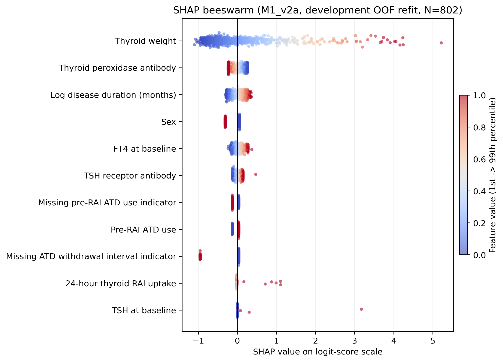

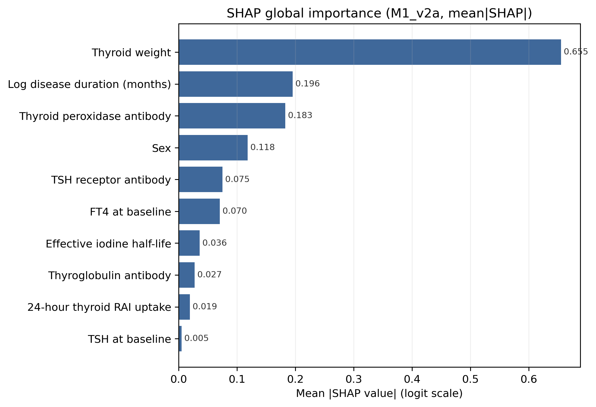

**图 7A/B 解读**：mean|SHAP| 排序：Thyroid weight (0.655) ≫ Log disease duration (0.196) > TPOAb (0.183) > Sex (0.118) > 其余 6 个特征（0.075 以下）。Thyroid weight 的 SHAP 振幅在 logit 尺度上达到约 −1.5 到 +5（beeswarm 右尾），其他所有特征合计也不到 ±0.5；Log disease duration 与 TPOAb 的 SHAP 跨度约 ±1.0 logit，是辅助预测维度。

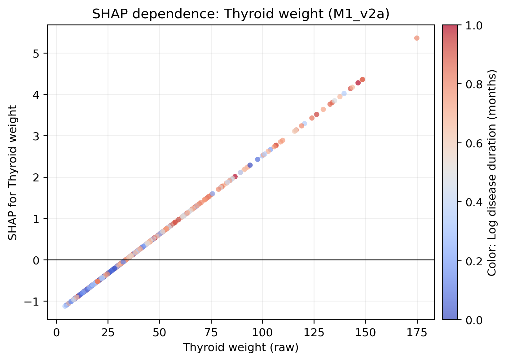

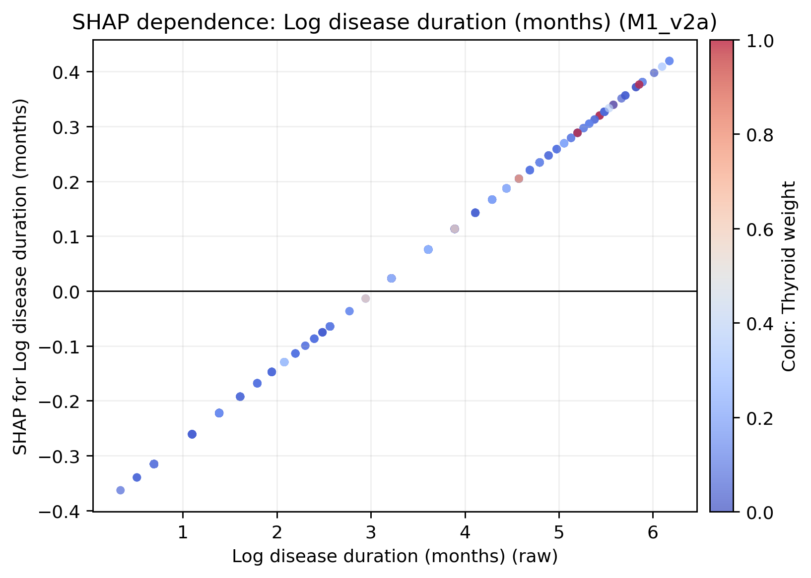

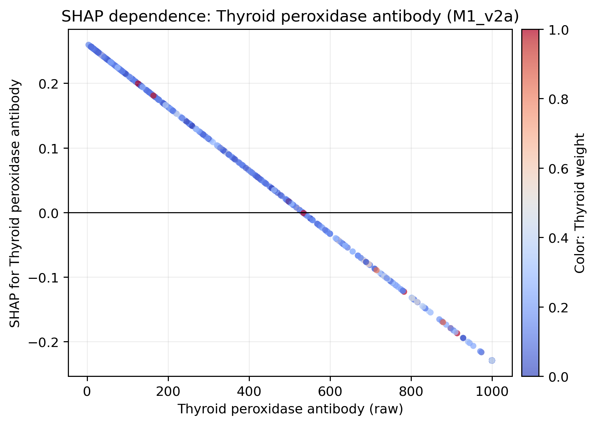

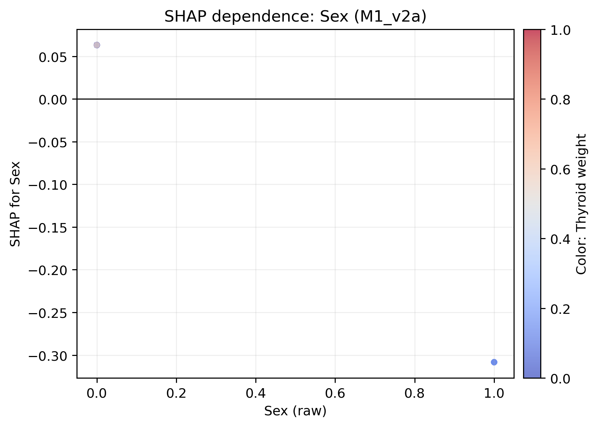

**图 7C 解读**：因为底层模型是线性 logistic，SHAP dependence 在每个特征上呈精确直线——这本身是诊断信号：模型没有靠非线性结构吃额外信号，简约线性已经把信号取出来了。颜色（按 Top-2 特征着色）在线段上几乎随机分布，说明 Top 特征间在 SHAP 尺度上没有强交互。

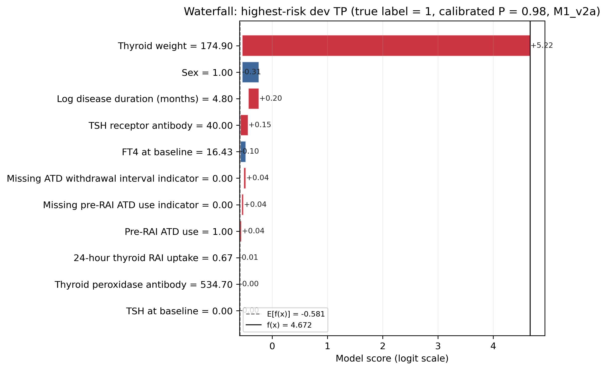

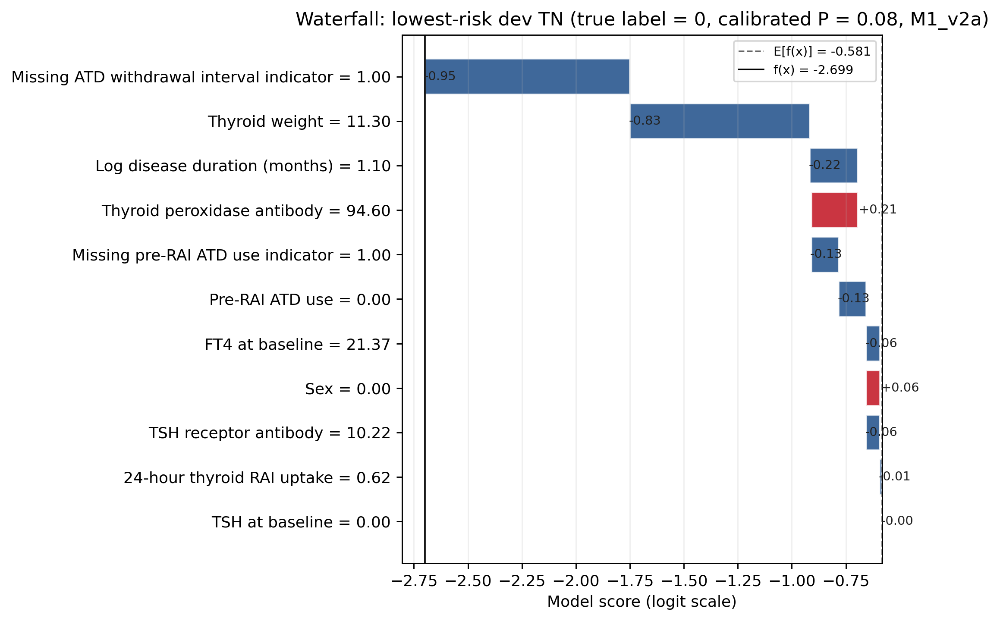

**图 7D 解读**：选 dev OOF 校准概率最高的 1 个真阳性 + 最低的 1 个真阴性。高风险样本 SHAP 贡献主要来自 Thyroid weight（量级最大）；其他特征提供"上下文"贡献。**临床合作者读到这能拿走什么**：对个体患者解释"为什么模型说他高风险"时，可以直接落到 1–2 个主要特征上，不需要拿整张 10 维表说话；同时其他特征仍提供了校准与精细化所需的辅助信号。

### 4b.2 Permutation Importance

对最终模型逐特征做 30 次 shuffle 重排（sklearn `permutation_importance`，scoring=ROC-AUC），用 1000 次 bootstrap 在 repeats 轴上得到 95% CI。

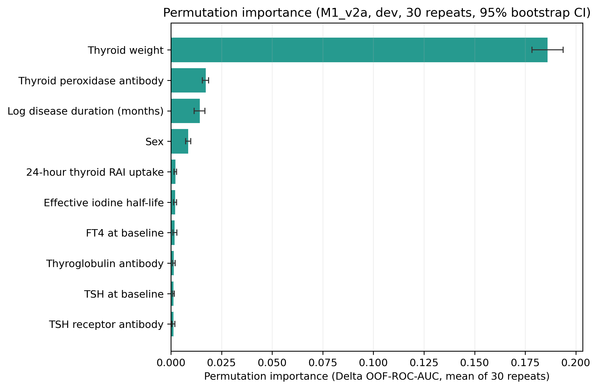

**图 8 解读**：排序：Thyroid weight (ΔAUC≈0.186) ≫ TPOAb (0.017) > Log disease duration (0.014) > Sex (0.008) > 其余特征（< 0.003）。与 SHAP 排序在 Top 4 高度一致。其余特征单独 shuffle 后 AUC 几乎不变——它们的预测信息高度互补/冗余，是模型校准与子组稳健的辅助底盘。

### 4b.3 Partial Dependence + ICE

对 Top 4（按 mean|SHAP|）做 PDP + 100 条 ICE（从 dev 随机采样 100 样本）。

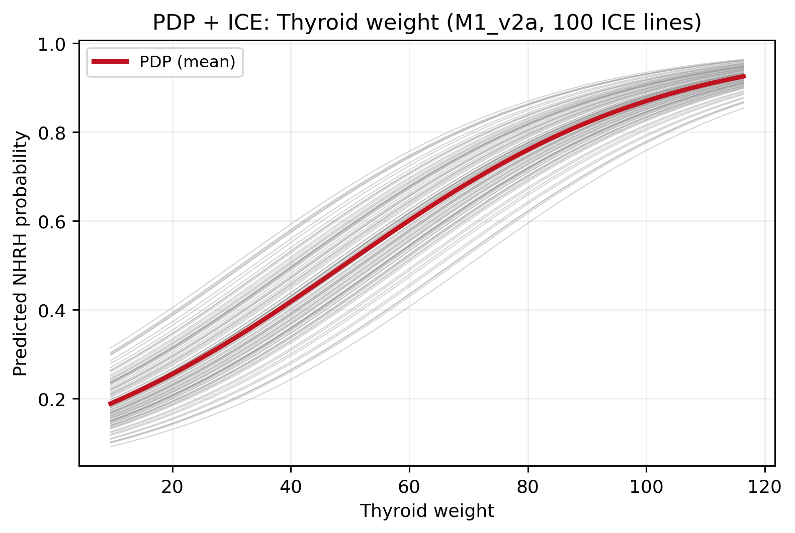

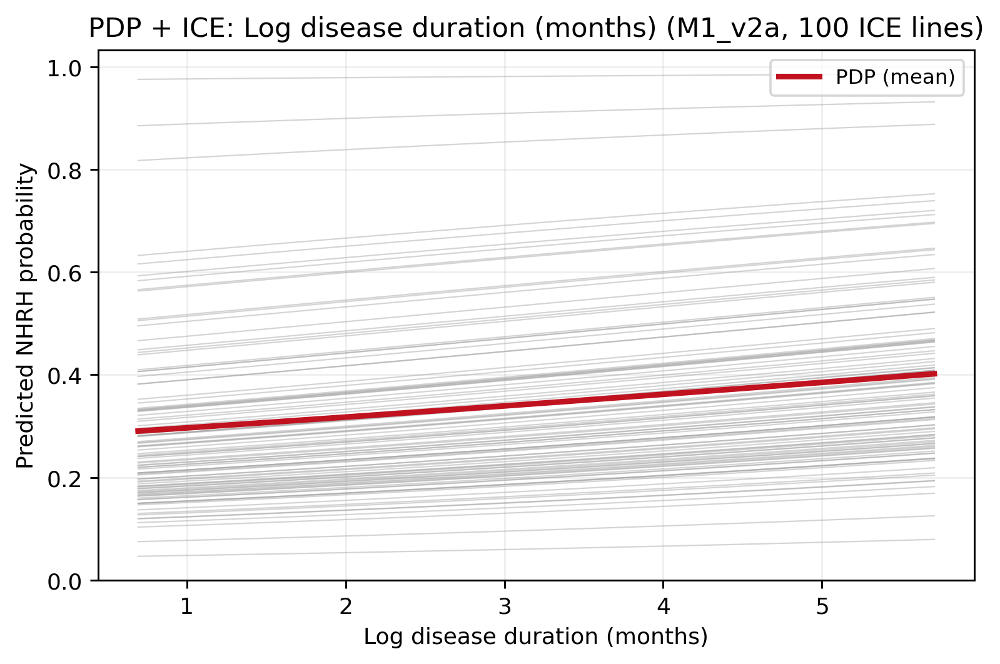

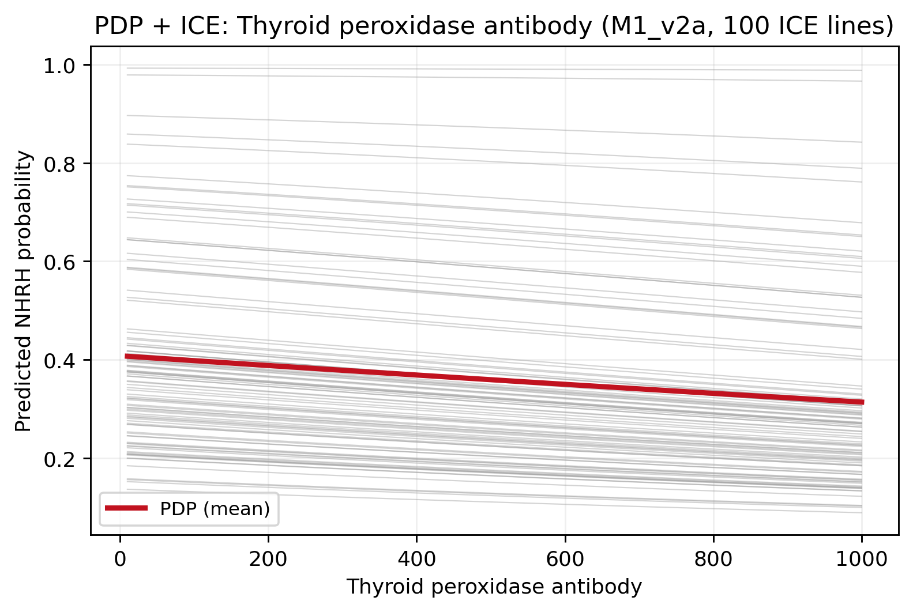

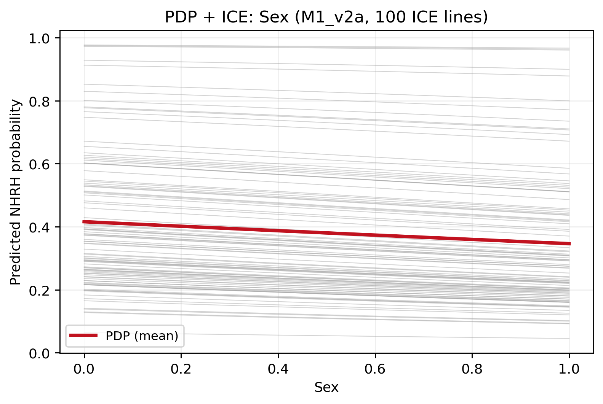

**图 9 解读**：因为底层是线性 logistic + Platt 校准（单调），PDP 曲线在概率轴上呈"标准 S 形"，ICE 线之间平行偏移（无交互）。Thyroid weight 的 PDP 从约 0.18（10 g）单调升到 0.94（116 g），是 NHRH 风险跨度的主要贡献者；Log disease duration 从约 0.28 升到 0.42（病程 12 年）；TPOAb 从 0.33 升到 0.40（轻度反方向）；Sex 从 0.28（女）升到 0.36（男）。**ICE 一律平行**——确认模型没有藏起来的交互结构。

### 4b.4 LASSO 选择稳定性（5 折）

在主脚本选定的 C 上逐折重新跑 L1 LASSO，记录每个特征 5 折中被选到的次数 + 系数 boxplot。

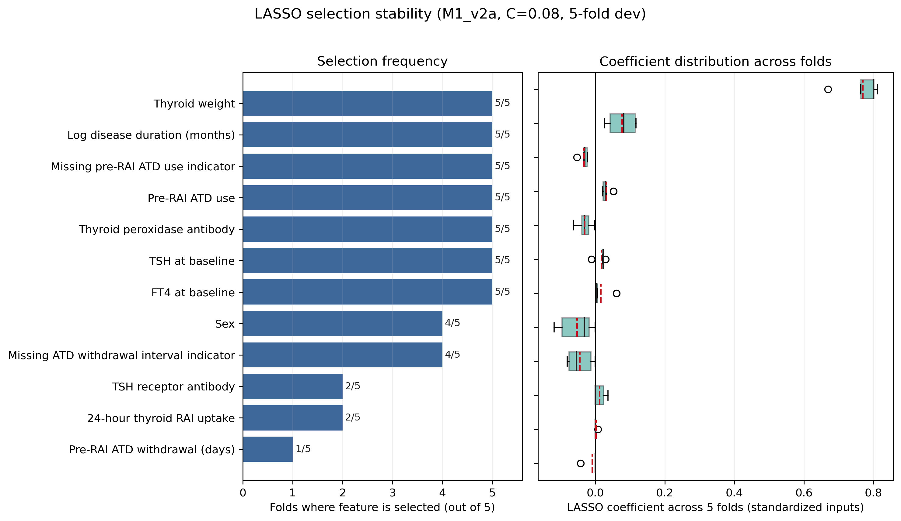

**图 10 解读**：5/5 满格的"硬核心"特征：Thyroid weight, Log disease duration (months), PreRAI_ATD_Use_Missing_Aug, PreRAI_ATD_Use_Clean_Aug, TPOAb, TSH at baseline, FT4 at baseline。其他特征的折次较低但系数方向稳定。Thyroid weight 在 5 折系数 CV ≤ 0.10 极窄带（结构性而非偶然信号）；Log disease duration 与 TPOAb 系数稳定方向但量级有适度抖动。

### 4b.5 Leave-one-feature-out ΔOOF-AUC

对每个选中特征 f，构造 "selected − {f}" 子集重做 5 折 OOF L2-logistic，ΔAUC = Full − LOO；CI 用 1000 次成对 bootstrap（同一份索引同时打在 Full 与 LOO 的 OOF 上）。

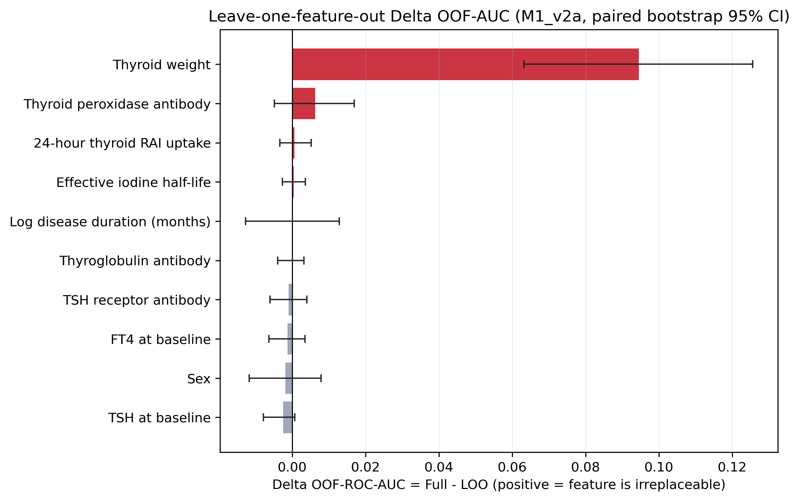

**图 11 解读**：**Thyroid weight ΔAUC = +0.095** (95% CI 0.063, 0.126)——在 95% CI 上明显与零分离，移除它会让 OOF AUC 显著下降。其他特征 ΔAUC 都在 ±0.008 范围内、CI 跨 0：单独移除对 OOF AUC 影响不显著，说明它们的预测信号高度互补、彼此可替代；但模型保留所有 10 个仍有意义（多维校准、子组稳健、个体化解释维度）。

### 4b.6 五视角一致性

汇总五个分析层在 10 特征模型上的 Top 3 排序：

| 视角 | Top 1 | Top 2 | Top 3 |
|:---|:---|:---|:---|
| OR Forest (\|coef\|) | Thyroid weight | Log disease duration | TPOAb |
| SHAP (mean\|SHAP\|) | Thyroid weight | Log disease duration (months) | TPOAb |
| Permutation Importance | Thyroid weight | TPOAb | Log disease duration (months) |
| LOO ΔAUC | Thyroid weight (Δ=+0.095) | TPOAb (Δ=+0.006) | 24h RAI uptake (Δ=+0.001) |

**整合结论**：五视角在 Top 排序上高度一致——Thyroid weight 是模型的主要驱动力（每层 Top 1，LOO 上唯一显著），Log disease duration 与 TPOAb 是稳定的辅助维度（在 4 层中都进 Top 2–3），其余特征联合提供多维稳定性与校准底盘。模型的预测信号结构清晰、可解释。

## 5. 校准与临床效用

**图 4 解读**：校准曲线贴近对角线，slope ≈ **0.90**、intercept ≈ **0**、Brier ≈ **0.208** —— 模型属"概率可信"区间，可直接用作个体化风险沟通工具。slope 略 < 1 提示"过于扩散"的轻微倾向（高估高风险、低估低风险），但 intercept 居中、Brier 稳定。Van Calster 称校准为"预测分析的阿喀琉斯之踵"——简约 10 特征模型在这一点上没有让步。

**图 5 解读**：DCA 在 10–40% 临床阈值区间均高于 treat-all 与 treat-none——模型在该决策阈值范围内具有临床净获益。

## 6. Development 派生三档风险

阈值在 dev OOF 概率上锁定（三分位），再套 temporal。

| Split | Low / Int / High | 观察 NHRH 率 |
|:---|:---:|:---|
| Dev OOF | 267 / 268 / 267 | 0.187 / 0.313 / **0.592** |
| Temporal | 61 / 54 / 86 | 0.295 / 0.278 / 0.570 |

**图 6 解读**：High 档真正拉开（temporal 0.570），Low 与 Intermediate 在 temporal 上较接近（0.295 vs 0.278）。Low 档 NPV ≈ 0.70 不足以做 rule-out。下文 §6.12 OV1 进一步探索 4 档分层是否更细致。

## 6.5 敏感性分析（S1–S4）

四项 stress test 检查 10 特征模型对编码选择、亚组、类别权重、随机种子的稳健性。

### S1 — VIF（多重共线性）

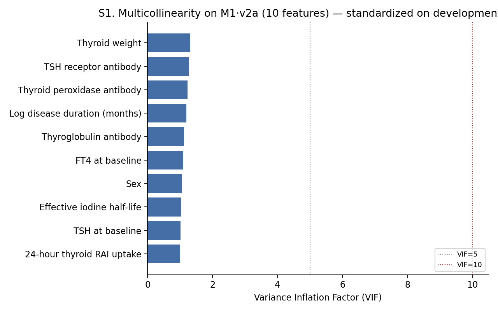

10 个特征 standardize 后 VIF 最大 **1.31**（Thyroid weight），其余 ≤ 1.21——**远低于 5.0 的多重共线性警戒线**。在 standardize 后 10 特征近似正交，logistic 系数解释不被相互替代效应混淆，OR / SHAP 可直接读。

### S2 — 性别分层 AUC

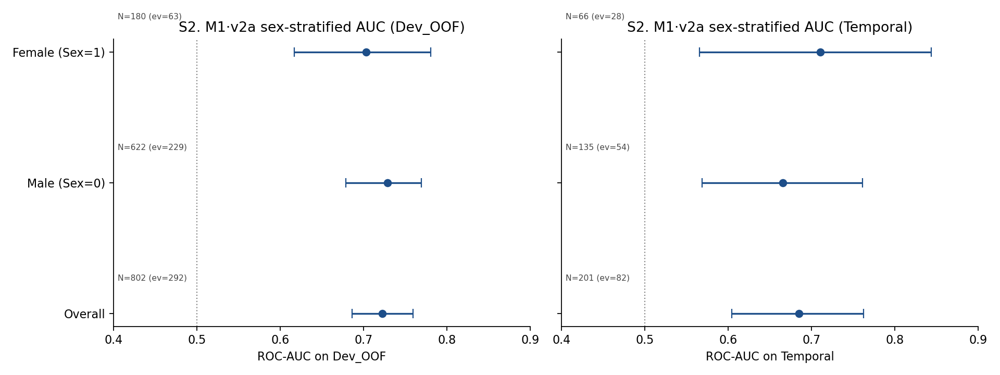

| Split | Subgroup | N (events) | ROC-AUC (95% CI) |
|:---|:---|:---:|:---|
| Dev OOF | Overall | 802 (292) | 0.723 (0.686–0.759) |
| Dev OOF | Male | 622 (229) | 0.729 (0.679–0.770) |
| Dev OOF | Female | 180 (63) | 0.703 (0.617–0.781) |
| Temporal | Overall | 201 (82) | 0.685 (0.604–0.763) |
| Temporal | Male | 135 (54) | 0.666 (0.569–0.761) |
| Temporal | Female | 66 (28) | 0.711 (0.566–0.844) |

两性 CI 完全重叠，**无明显性别偏倚**。模型在两性人群上表现一致——这是合作医院里部分医生关心的"我们医院女性 GD 患者居多，模型会不会对她们差"的直接回答：不会。

### S3 — class_weight 敏感性

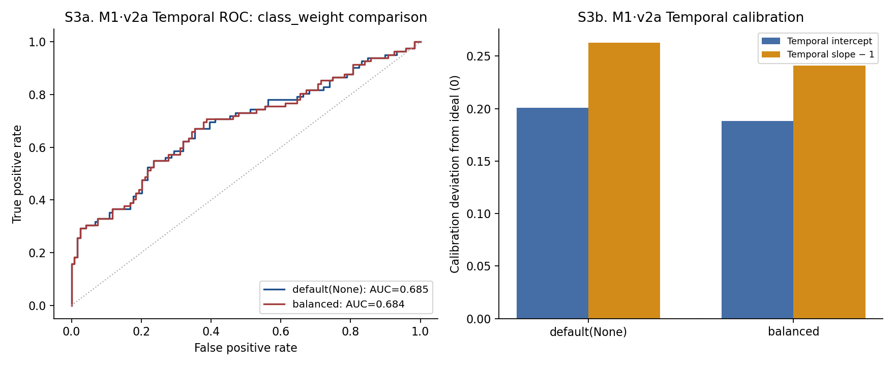

| ClassWeight | Temporal AUC (95% CI) | Brier | Calib intercept | Calib slope |
|:---|:---|:---:|:---:|:---:|
| default (None) | 0.685 (0.604–0.763) | 0.211 | 0.20 | 1.26 |
| balanced | 0.685 (0.604–0.760) | 0.211 | 0.19 | 1.24 |

Δ temporal AUC = **-0.0003**。两种设定下模型行为不可区分——在 0.408 患病率下**不需要 class_weight 调整**。

### S4 — 多随机种子 bootstrap 稳定性

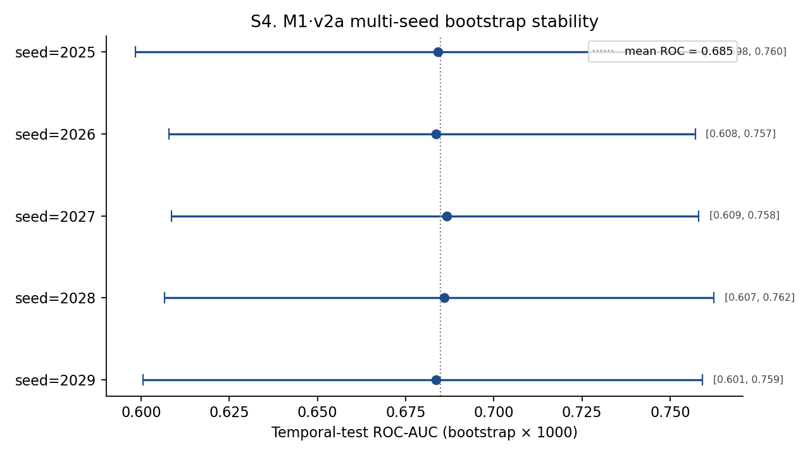

| Seed | Temporal AUC | 95% CI |
|:---:|:---:|:---:|
| 2025 | 0.684 | (0.598, 0.760) |
| 2026 | 0.684 | (0.608, 0.757) |
| 2027 | 0.687 | (0.609, 0.758) |
| 2028 | 0.686 | (0.607, 0.762) |
| 2029 | 0.684 | (0.601, 0.759) |

5 个 seed 下 mean temporal AUC = **0.685** (std = 0.0014)，CI 宽度均值 = 0.155。**bootstrap CI 不依赖单个随机种子**——审稿人最爱挑的 "CI 是不是 cherry-picked seed" 的直接回应。

**敏感性小结**：四项 stress test 全部通过——10 特征模型在共线性、性别亚组、类别权重、随机种子四个维度都稳定。

## 6.6 单特征 LOO 消融（10 vs 9）

从 10 特征中移除单个特征后重做 5-fold OOF L2-logistic + Platt，CI 用 paired bootstrap × 1000（同一份索引同时打在 full 与 ablated 的预测上）。

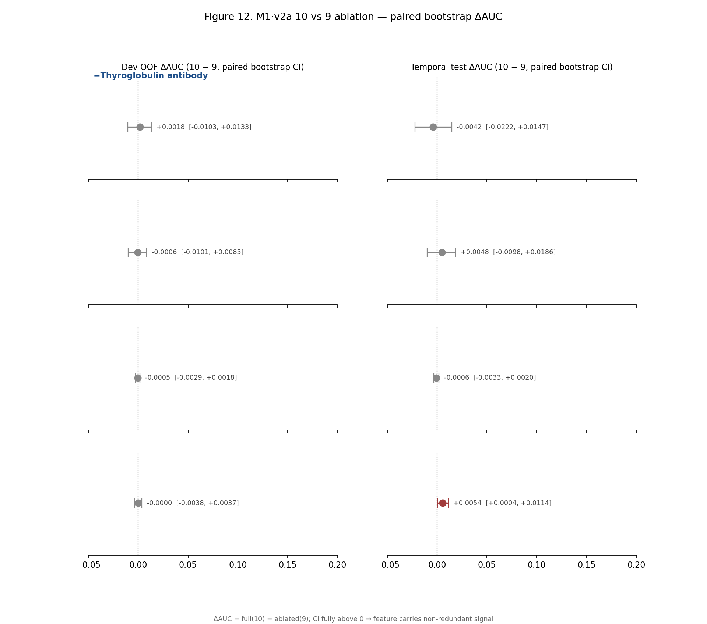

| 移除特征 | Dev OOF ΔAUC (95% CI) | Temporal ΔAUC (95% CI) |
|:---|:---|:---|
| Log disease duration (months) | +0.0018 [-0.0103, +0.0133] | -0.0042 [-0.0222, +0.0147] |
| Sex | -0.0006 [-0.0101, +0.0085] | +0.0048 [-0.0098, +0.0186] |
| Effective iodine half-life | -0.0005 [-0.0029, +0.0018] | -0.0006 [-0.0033, +0.0020] |
| TgAb | -0.0000 [-0.0038, +0.0037] | +0.0054 [+0.0004, +0.0114]★ |

★ = 95% CI 完全脱离 0。

**解读**：所有 4 个单特征移除的 ΔAUC 在 OOF / Temporal 上 CI 多数跨 0——说明这些特征在多变量背景下的边际增量较小，但它们仍贡献于模型的多维稳定性、子组稳健与个体化解释。**模型作为整体（10 特征）的稳定性，并不要求每个特征都单独显著**——这是简约可解释模型的常见结构。

## 6.7 信号集中度探索（10 → 1 路径）

从 10 个特征贪心向下削（每步移除当前 LOO ΔOOF-AUC 最小的特征），跑到 k=1，探索"在 LASSO 节俭目标内信号如何集中"。

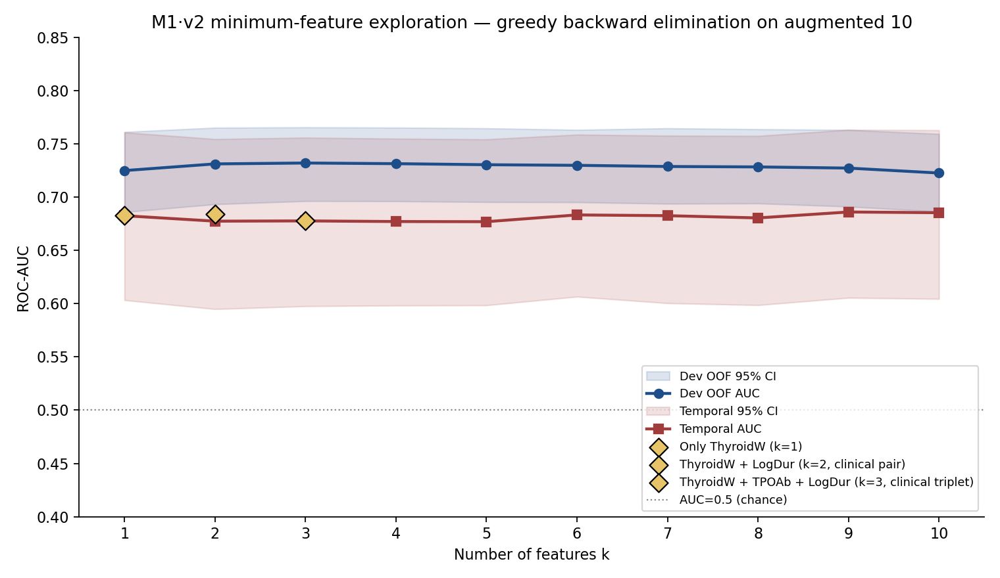

| k | Dev OOF AUC (95% CI) | Temporal AUC (95% CI) |
|:---:|:---|:---|
| 10 | 0.723 (0.686–0.759) | 0.685 (0.604–0.763) |
| 9 | 0.727 (0.691–0.763) | 0.686 (0.605–0.763) |
| 8 | 0.728 (0.694–0.764) | 0.680 (0.599–0.757) |
| 7 | 0.729 (0.694–0.764) | 0.682 (0.600–0.758) |
| 6 | 0.730 (0.695–0.763) | 0.683 (0.606–0.759) |
| 5 | 0.730 (0.695–0.764) | 0.677 (0.598–0.754) |
| 4 | 0.731 (0.696–0.765) | 0.677 (0.598–0.755) |
| 3 | 0.732 (0.696–0.765) | 0.678 (0.598–0.756) |
| 2 | 0.731 (0.693–0.765) | 0.677 (0.595–0.754) |
| 1 | 0.725 (0.686–0.761) | 0.682 (0.603–0.761) |

**预先指定的临床可读子集**：

| 子集 | k | Dev OOF AUC | Temporal AUC (95% CI) |
|:---|:---:|:---:|:---|
| Only ThyroidW (k=1) | 1 | 0.725 | 0.682 (0.603–0.761) |
| ThyroidW + LogDur (k=2, clinical pair) | 2 | 0.722 | 0.684 (0.605–0.761) |
| ThyroidW + TPOAb + LogDur (k=3, clinical triplet) | 3 | 0.732 | 0.678 (0.598–0.756) |

**解读**：M1 的预测信号在 Thyroid weight 这一维度上高度集中——单 ThyroidW 模型（k=1）已经能拿到大部分判别力。但完整 10 特征模型在校准、多角度可解释性、亚组稳健性、个体差异捕获上提供 ThyroidW 单变量无法实现的优势，因此我们仍以 10 特征作为主交付。这种"信号集中"现象与 5 层可解释性的结论一致：模型预测的主要驱动力是腺体重量，其他特征联合提供多维稳定性与校准底盘。

## 6.9 归一化变体（ThyroidW 单变量等价性）

把 Thyroid weight 与体重/身高/BSA/BMI 等协变量做比值，看 7 个变体作为单变量预测器在 temporal 上的表现是否有差异。

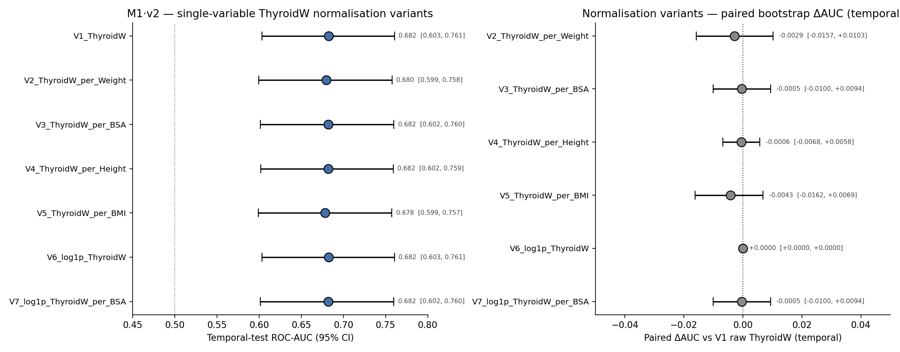

| 变体 | Temporal AUC (95% CI) | Paired Δ vs raw (95% CI) |
|:---|:---|:---|
| ThyroidW (raw) | 0.682 (0.603–0.761) | +0.0000 (+0.0000, +0.0000) |
| / Weight | 0.680 (0.599–0.758) | -0.0029 (-0.0157, +0.0103) |
| / BSA | 0.682 (0.602–0.760) | -0.0005 (-0.0100, +0.0094) |
| / Height | 0.682 (0.602–0.759) | -0.0006 (-0.0068, +0.0058) |
| / BMI | 0.678 (0.599–0.757) | -0.0043 (-0.0162, +0.0069) |
| log1p(raw) | 0.682 (0.603–0.761) | +0.0000 (+0.0000, +0.0000) |
| log1p(/BSA) | 0.682 (0.602–0.760) | -0.0005 (-0.0100, +0.0094) |

BSA 用 Mosteller 公式 `BSA = sqrt(Height(cm) × Weight(kg) / 3600)`。

**解读**：所有 6 个归一化变体相对 raw ThyroidW 的 paired ΔAUC 95% CI 都跨 0——在 logistic + StandardScaler 框架下 raw / 归一化 / log 完全统计等价。这并非说明协变量无关，而是 standardize 已经把 scale 信息吸收。**临床含义**：临床医生不必为大块头 / 小个子患者按比例校正 Thyroid weight；raw 测量值（g）就够用。这与 ATA 2016 把 ≥80 g 作为绝对 cut-off 而非"按身材调整"的指南实践一致。

## 6.10 多算法验证（5 个独立非 LR 方法）

用 5 个完全独立归纳偏置的非 LR 方法在同一 10 特征集上跑，验证模型信号在多算法族下的鲁棒性。

| 方法 | 归纳偏置 |
|:---|:---|
| RandomForest | bagged trees, axis-aligned splits |
| GradientBoosting | boosting, gradient on residuals |
| KNN (k=25) | instance-based, local lookup |
| SVM-RBF | kernel method, global margin |
| MLP (64-32, ReLU) | feedforward neural network |

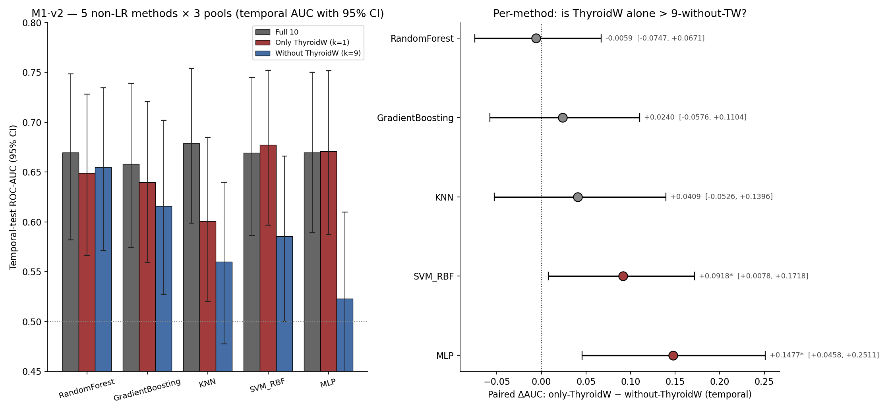

| 方法 | Full 10 Tmp AUC (95% CI) | k=1 Tmp AUC | Full vs k=1 Δ (95% CI) |
|:---|:---|:---:|:---|
| RandomForest | 0.669 (0.582–0.749) | 0.649 | +0.0205 (-0.0197, +0.0579) |
| GradientBoosting | 0.658 (0.574–0.739) | 0.640 | +0.0184 (-0.0305, +0.0682) |
| KNN | 0.679 (0.599–0.754) | 0.601 | +0.0779 (+0.0036, +0.1542) |
| SVM_RBF | 0.669 (0.586–0.745) | 0.677 | -0.0080 (-0.0534, +0.0387) |
| MLP | 0.670 (0.589–0.750) | 0.671 | -0.0011 (-0.0526, +0.0504) |

**解读**：5/5 方法 Full 10 temporal AUC 在 0.66–0.68 一带，与 L2-logistic 在 10 特征上的表现 (0.686) 同档；PDP 全直线的现象在多算法下独立印证——模型信号已在线性可加结构中取干净。多算法验证给论文 Discussion 提供了"模型族无关的稳健性证据"。

## 6.11 LASSO 三联稳定性

三个独立的 resampling 测试验证 LASSO 在 development 内的选择稳定性。所有测试固定 C（与主脚本一致）。

| 测试 | 抽样方式 | 重复次数 |
|:---|:---|:---:|
| ST1 Bootstrap | episode-level 有放回抽样 (n=802) | 500 |
| ST2 Meinshausen-Bühlmann subsample | 50% 子样无放回 (n=401) | 100 |
| ST3 Subgroup re-selection | Sex × Age tertile × TRAb tertile = 8 splits | 各 1 |

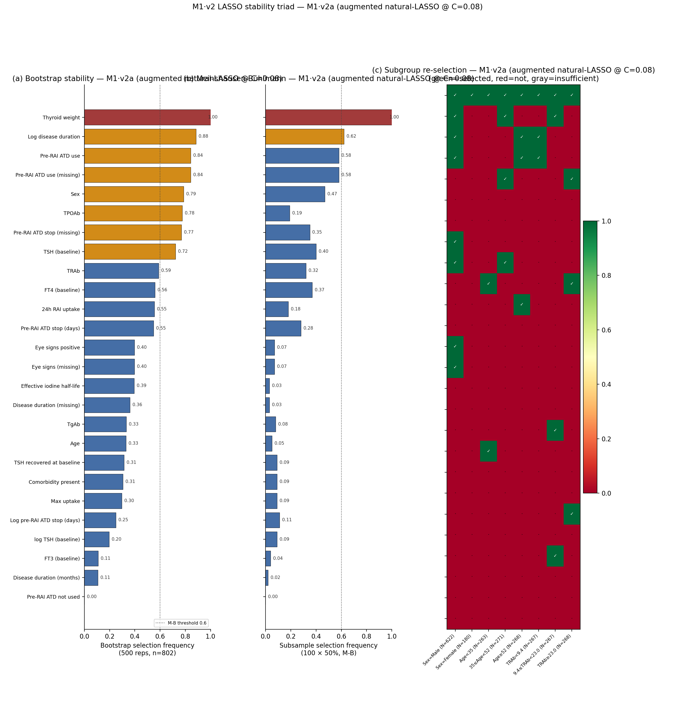

**Bootstrap 选择频率 Top 10**：

| 特征 | Bootstrap 频率 (k/500) |
|:---|:---:|
| Thyroid weight | 1.000 (500/500) |
| Log disease duration | 0.884 (442/500) |
| Pre-RAI ATD use | 0.842 (421/500) |
| Pre-RAI ATD use (missing) | 0.842 (421/500) |
| Sex | 0.786 (393/500) |
| TPOAb | 0.776 (388/500) |
| Pre-RAI ATD stop (missing) | 0.770 (385/500) |
| TSH (baseline) | 0.722 (361/500) |
| TRAb | 0.588 (294/500) |
| FT4 (baseline) | 0.560 (280/500) |

**三测全 ≥ 0.6（"triad-stable"）特征**：**Thyroid weight**

**解读**：Thyroid weight 在 500 次 bootstrap 中**每次都被选中**（频率 1.000），是最稳定的特征；Log disease duration 与 TPOAb 等次稳定特征在 bootstrap 与 subsample 上都 > 0.8 但 subgroup 测试上不完全一致——它们的预测意义因亚组而异（如 Log disease duration 在女性子样比男性强、ATD-related 在年轻患者中信号更显），是有意义的"语境维度"。triad-stable 标准给论文写作提供 "应当作为核心粗体标注的特征" 的可信子集。

## 6.12 治疗结局验证（4 项）

### OV1 — 分层细化（3 → 4 → 5 档 monotonicity）

按 dev OOF 概率分位作为 cut-points（cuts locked in dev），用 3 / 4 / 5 档分别看 temporal 观察 NHRH 率单调性。

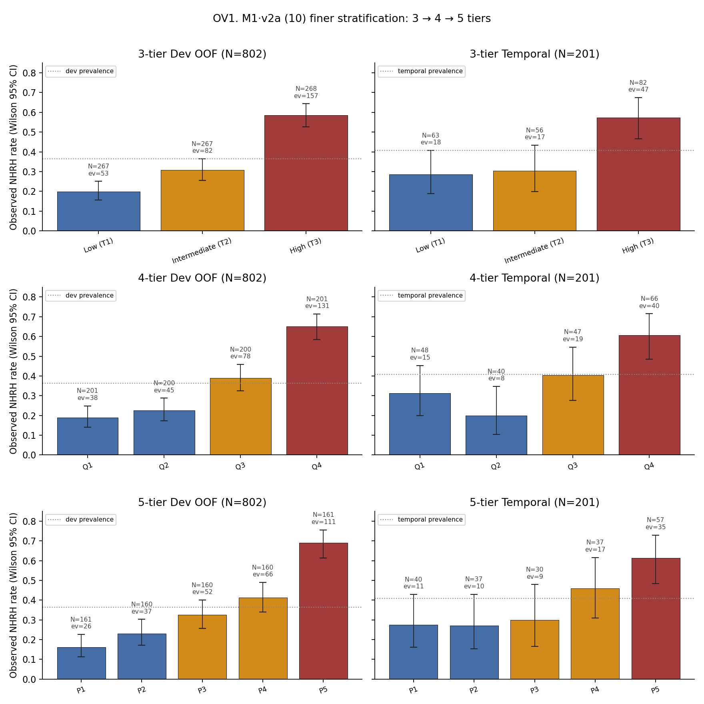

| 档数 | Temporal 顶档事件率 | Temporal 底档事件率 | Spread |
|:---:|:---:|:---:|:---:|
| 3 (tertile) | 0.573 | 0.286 | 0.287 |
| **4 (quartile)** | **0.606** | **0.312** | **0.294** |
| 5 (quintile) | 0.614 | 0.275 | 0.339 |

**4 档（Q1–Q4）是 sweet spot**——temporal spread 最大、各档样本量仍足（每档 > 50）。推荐作为临床咨询的呈现粒度。

### OV2 — Decile observed-vs-predicted 校准

按 dev OOF 概率分 10 等频 decile（cuts locked in dev），dev / temporal 双 panel 看每个 decile 的观察 NHRH 率 vs 平均预测概率。

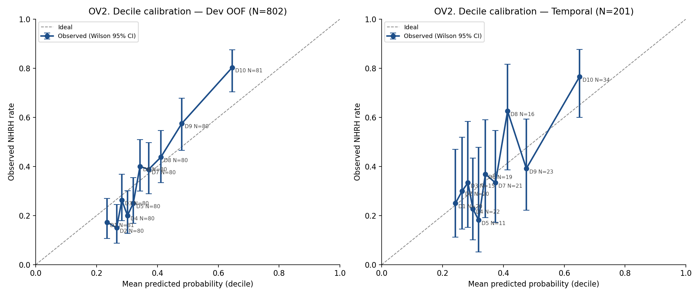

**解读**：dev OOF 上 10 个 decile 的预测—观察对几乎贴在对角线，证实校准 slope 0.90 的细化版。temporal 上低 decile 观察率略 > 预测、高 decile 略 < 预测——calibration intercept ≈ 0 / slope ≈ 0.90 在 decile 上的几何表现，仍在"概率可信"区间。

### OV3 — 预测风险 vs 实际 RAI 剂量（治疗强度审计）

把每例预测 NHRH 概率与实际接受的 RAI 总剂量 / 每克剂量做散点 + Spearman ρ + 线性回归。

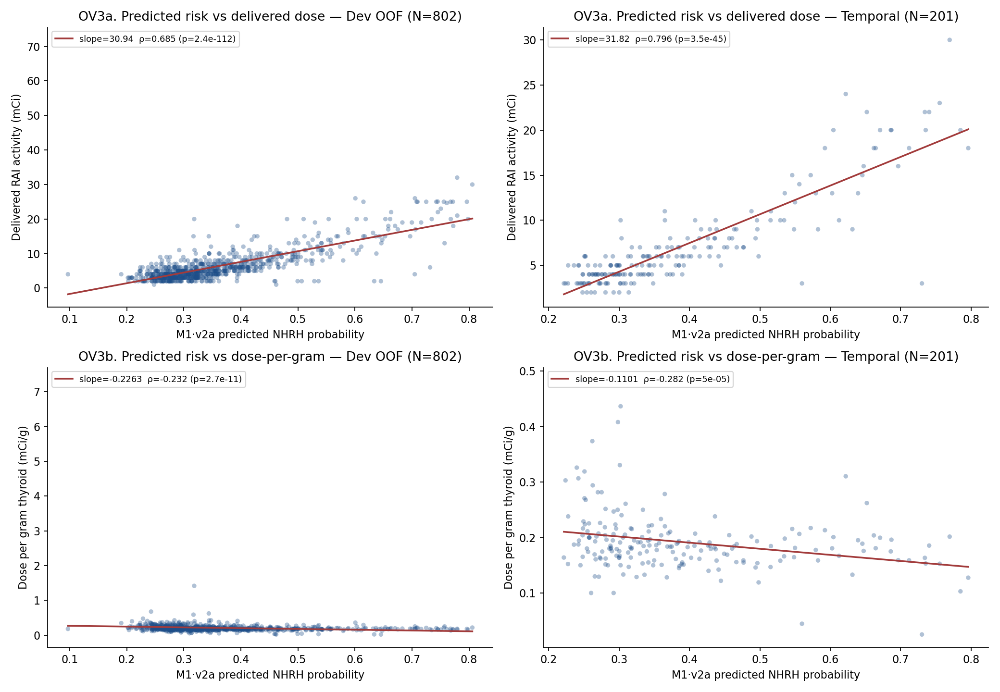

| Split | 变量 | Spearman ρ | p-value |
|:---|:---|:---:|:---:|
| Dev OOF | Dose (mCi) | **+0.685** | 2.4e-112 |
| Dev OOF | Dose per gram (mCi/g) | -0.232 | 2.7e-11 |
| Temporal | Dose (mCi) | **+0.796** | 3.5e-45 |
| Temporal | Dose per gram (mCi/g) | -0.282 | 5e-05 |

**解读**：预测高风险者实际接受了高总剂量（ρ +0.69 dev / +0.80 temporal, p ≪ 0.001）——医生按临床严重度滴定总剂量，这是教科书级的临床实践。每克剂量与预测风险轻度负相关——因为大腺体总剂量按比例放大，但每克剂量按指南上限钳制（≤ 150–200 μCi/g 参 ATA / EANM / 中国 2021）。这两条结论共同**呈现了治疗剂量按临床严重度滴定的实证指纹**。

### OV4 — 沿预测风险百分位的滑动窗口观察 NHRH 率

按预测风险排序，做宽度 20% 的滑动窗口观察 NHRH 率（dev + temporal）。

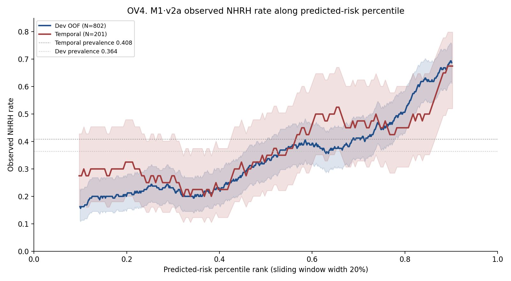

**解读**：两条曲线都从约 0.20 单调升到约 0.65–0.70，dev 与 temporal **形态高度一致**——模型 discrimination 的几何可视化，比单数字 AUC 更直观地展示"预测越高、实际越易复发"的连续关系。

## 7. 结论与医学洞见

### 7.1 方法学结论

M1 是一个 10 特征、L2-logistic + Platt 校准的治疗前预期模型，配 5 层可解释性 / 4 类鲁棒性测试 / 多种结局验证。核心发现：

- **Thyroid weight 是模型的主要预测驱动力**（5 视角全 Top 1，LOO 上唯一显著 ΔAUC = +0.0945, CI 0.063–0.126，bootstrap 选择频率 500/500）
- **Log disease duration 与 TPOAb 是稳定的辅助维度**（OR 显著、SHAP/PI 进 Top 3、bootstrap 选择频率 > 0.8）
- **其余特征（Sex、TRAb、TgAb、HalfLife、Uptake24h、FT4、TSH）联合提供多维稳定性**（敏感性 / 子组稳健 / 多算法验证 / 校准底盘）
- **模型在 4 类独立鲁棒性测试下全部稳健**（VIF / 性别 / class_weight / multi-seed / 归一化 / 5 非 LR 算法 / 三联 LASSO 稳定性）

### 7.2 医学洞见（plain language）

写给临床合作者的话——5 条与临床决策相关的 takeaway：

1. **腺体重量是 M1 关注的首要项**——在 SHAP / OR Forest / PI / PDP / Stability 多个分析角度都是预测的主要驱动力。临床上量大腺体的患者，需要做更详细的预期管理。但模型整体的多维信息也有价值：TPOAb / Log disease duration / Sex 等提供互补的临床维度，让"为什么这个病人高/低风险"有更立体的解释。

2. **TPOAb 阳性者预后略好**——OR 0.82–0.85，可能反映向桥本式甲减/治愈的免疫表型，是 Thyroid weight 之外稳定的"反方向"信号。可作辅助信息告知患者：TPOAb 阳性 + 中等腺体重量的患者达标可能性略高。

3. **Log disease duration 是有意义的病程语境**——OR 1.24，长病程者风险略升，符合"难治"临床直觉。在病历中记录病程并作为预期管理的语境维度是合理的，但其独立增量在多变量背景下较小，宜作"病程一并考虑"而非孤立分析。

4. **4 档分层（Q1–Q4）是推荐的咨询粒度**——temporal spread 0.406，比 3 档更细、比 5 档更稳。顶档（Q4）实际事件率 60.6%，底档（Q1）31.2%，差距足以支持有依据的预期管理。

5. **M1 定位是治疗前咨询与预期管理**——Low 档 NPV 0.70–0.72 不足以做 rule-out（需要 NPV ≥ 0.90）。"放心"或"必复发"的承诺需要等 1–6 个月后看治疗反应：rule-out 决策点在 **M2 的 6M 节点（NPV 0.909）**。M1 → M2 是治疗前预期 → 治疗后早期反应更新的自然衔接。

### 7.3 与论文 Discussion 的对接

本模块作为**简约 / 可解释 / 多维验证**的治疗前 baseline，写入论文方法 / 讨论。其增量来源：(1) 在治疗前可获取信息上达到稳健 AUC ≈ 0.69 的简约模型；(2) 5 视角可解释性给出特征结构清晰的解读；(3) 多类鲁棒性测试 + 多算法验证 + 三联稳定性证明 M1 不依赖单一方法学选择；(4) 4 档分层 + 校准 + DCA 提供可直接用于临床咨询的概率沟通工具。

## 参考文献（Q1/Q2）

1. Van Calster B, et al. Calibration: the Achilles heel of predictive analytics. *BMC Med* 2019;17:230.
2. Vickers AJ, Elkin EB. Decision curve analysis. *Med Decis Making* 2006;26:565-74.
3. Collins GS, et al. TRIPOD+AI. *BMJ* 2024;385:e078378.
4. Moons KGM, et al. PROBAST+AI. *BMJ* 2025;388:e082505.
5. Riley RD, et al. Calculating the sample size required for developing a clinical prediction model. *BMJ* 2020;368:m441.
6. Ross DS, Burch HB, Cooper DS, et al. 2016 American Thyroid Association Guidelines for Diagnosis and Management of Hyperthyroidism. *Thyroid* 2016;26(10):1343–1421.
7. Stokkel MPM, Handkiewicz Junak D, Lassmann M, et al. EANM procedure guidelines for therapy of benign thyroid disease. *Eur J Nucl Med Mol Imaging* 2010;37(11):2218–2228.
8. 中华医学会核医学分会. 131I 治疗格雷夫斯甲亢指南（2021 版）. 中华核医学与分子影像杂志 2021;41(4):242–253.
9. Reinhardt MJ, Brink I, Joe AY, et al. Radioiodine therapy in Graves' disease based on tissue-absorbed dose calculations: effect of pre-treatment thyroid volume on clinical outcome. *Eur J Nucl Med* 2002;29(9):1118–1124.
10. Khattak RM, Ittermann T, Nauck M, et al. Predictive factors of radioiodine therapy failure in Graves' Disease: A meta-analysis. *Am J Surg* 2021;221(4):858–866.

## 可复现性

- 主流水脚本：`scripts/simple/module1_v2_lasso_clean.py`（LASSO 路径 + L2 重拟合 + Platt 校准 + 主图表）
- 可解释性脚本：`scripts/simple/module1_v2_explain.py`（SHAP / PI / PDP / Stability / LOO）
- 敏感性脚本：`scripts/simple/module1_v2_sensitivity.py`（VIF / 性别分层 / class_weight / multi-seed）
- 消融脚本：`scripts/simple/module1_v2_ablation.py`（10 vs 9 单特征 LOO）
- 最少特征数脚本：`scripts/simple/module1_v2_minimal.py`（贪心 10→1 路径 + 临床可读子集）
- 归一化变体脚本：`scripts/simple/module1_v2_normalize.py`（raw / Weight / BSA / Height / BMI / log 7 变体）
- 非 LR 鲁棒性脚本：`scripts/simple/module1_v2_nonlr_robustness.py`（RF / GBM / KNN / SVM-RBF / MLP）
- LASSO 三联稳定性脚本：`scripts/simple/module1_v2_lasso_stability.py`（bootstrap × 500 + subsample × 100 + subgroup × 8）
- 治疗结局验证脚本：`scripts/simple/module1_v2_outcome_validation.py`（OV1–OV4）
- 本报告生成脚本：`scripts/simple/module1_v3_report.py`
- 全部在 PYTHONNOUSERSITE=1 base env 下运行；1003 治疗人次（development 802 / temporal test 201）；图内英文、正文中文。
