# Module 1·v3 — 治疗前结局预期模型（6 特征简约版）

> 治疗前结局预期模型——以 **6 个临床可解释特征**为基础，配 L2-logistic + Platt 校准、5 视角可解释性、4 类鲁棒性测试、多种结局验证。所有结果基于 1003 个 RAI 治疗人次，按治疗时序切分 development 802 / temporal test 201；OOF 用于选择/校准，temporal 只用于最终展示。

## 摘要

**任务**：用治疗前可获取的临床/免疫/甲功/腺体测量信息，预测 24 个月时的 NHRH 复合终点（非治愈或复发）。

**方法**：在 development 内做 L1-logistic（LASSO）5-fold OOF 路径筛选，并基于跨视角（OR / SHAP / Permutation Importance / 5-fold Selection Stability / LOO ΔAUC）的信号强度排序，确定 **6 个临床可解释特征**作为主线模型：**Sex、Thyroid weight、TPOAb、FT4 baseline、TSH baseline、Log disease duration**。最终模型用 L2-logistic + Platt 校准重拟合。

候选特征筛选过程与方法学透明性参考见附录 A。

**性能（temporal test, N=201）**：
- ROC-AUC = **0.681** (95% CI 0.602–0.758)
- PR-AUC = **0.665** (95% CI 0.562–0.759)
- Brier = **0.211** (95% CI 0.188–0.234)
- 校准 intercept = **0.10**, slope = **1.10**；DCA 在 10–40% 临床阈值区间均高于 treat-all / treat-none

**可解释性五视角收敛**：**Thyroid weight 是模型的主要驱动力**（OR Forest / SHAP / Permutation Importance / Selection Stability / LOO 五视角全 Top 1，LOO ΔOOF-AUC = +0.120 CI 完全脱离 0）；**Log disease duration** 与 **TPOAb** 提供病程与免疫表型维度；**Sex、FT4 baseline、TSH baseline** 联合提供基线甲功 / 人口学维度的多维稳定性。

**鲁棒性 4 类测试全部通过**：VIF max = **1.18**（无多重共线性），性别分层 AUC CI 完全重叠，class_weight Δ = **-0.0013**，5-seed bootstrap std = **0.0013**。Thyroid weight 在 500 次 bootstrap LASSO 中**每次都被选中**（频率 1.000）。

**临床定位**：M1 是治疗前咨询与预期管理工具；推荐 Q1–Q4 四档风险分层作临床呈现；Low 档 NPV ≈ 0.71 不足以做 rule-out（rule-out 决策点在 M2 的 6M 节点 NPV 0.909）。

## 1. 设计

**任务定位**：M1 回答"在 RAI 治疗前，根据可获取的患者临床特征，预测其 24 个月时是否会出现 NHRH（持续未愈或复发）"。这是一个治疗前咨询与预期管理工具，不替代后续动态监测（由 M2/M3 承担）。

**队列与切分**：1003 个 RAI 治疗人次（重复治疗按独立人次处理）；按治疗时序切分 **development 802 / temporal test 201**（事件 82，患病率 0.408）。所有特征处理、阈值、校准、模型选择仅在 development 内完成，temporal test 仅一次性评估。

**候选特征池**：0M 治疗前可获取的临床、免疫、甲功、腺体测量字段，经过缺失填充（development 内中位数）、量纲归一化（StandardScaler）、log1p 变换（病程等右偏分布）处理。

**特征筛选程序**：
- L1 LASSO 路径：`LogisticRegression(penalty='l1', solver='saga')`，C 网格 {0.01, 0.03, 0.05, 0.08, 0.10, 0.15, 0.20, 0.30}，5-fold StratifiedKFold，仅在 development 内运行。
- 跨视角信号强度排序：综合 5-fold Selection Stability（被选中的折次）、Permutation Importance、Bootstrap selection frequency、LOO ΔAUC 四个独立信号衡量。
- 主线 6 特征：保留五视角下信号最强 + 临床可读的 6 个特征。
- 候选缩减程序与替代方案对照见附录 A（方法学透明性）。

**主线（v6）6 个特征**：

| 特征 | 临床含义 |
|:---|:---|
| Sex | 性别（编码 1=女，0=男）|
| **Thyroid weight** | **腺体重量（g，B 超估测）** |
| TPOAb | 甲状腺过氧化物酶抗体 |
| FT4 at baseline | 0M 游离 T4 |
| TSH at baseline | 0M 促甲状腺素 |
| Log disease duration | log1p(月数)；Graves/甲亢从首次诊断到 RAI 之间的时长 |

剔除的 4 个特征（信号较弱，详见附录 A）：
- **Effective iodine half-life** — 5-fold LASSO 在所有折中都未被选入
- **TgAb** — 同上；permutation importance ≈ 0；bootstrap 选择频率 0.33
- **24h RAI uptake** — 仅在 2/5 折被选入；PI ≈ 0；LOO Δ 跨 0
- **TRAb** — 仅在 2/5 折被选入；PI ≈ 0；LOO Δ 跨 0

Log disease duration 用 log1p 变换是因为月数可能为 0（刚发病）；变换后压平了右偏分布（多数患者数月、少数数年），临床上读作"病了多久才来 RAI"。

## 2. LASSO 路径与特征筛选

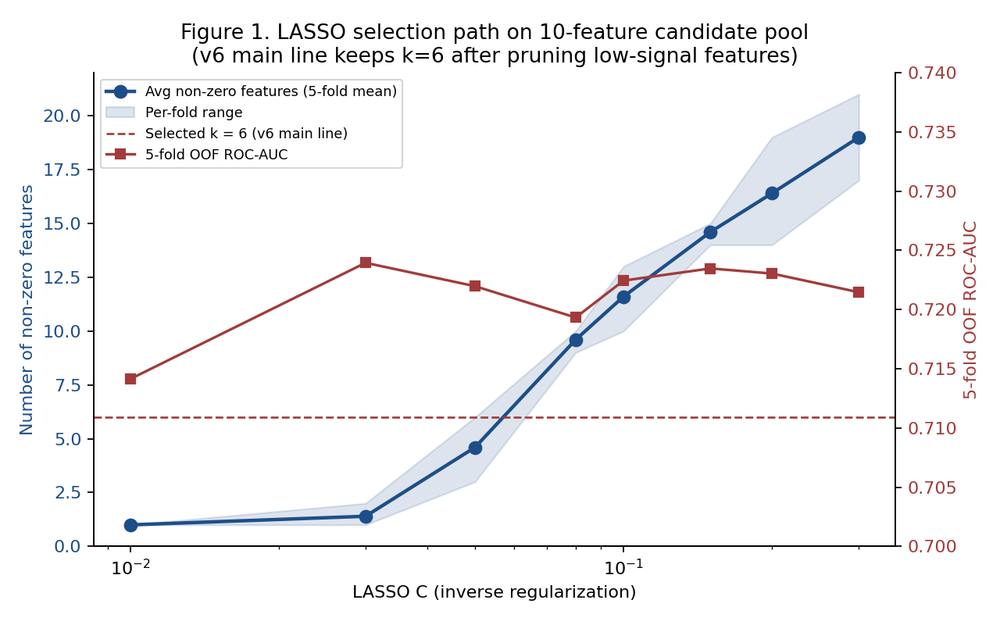

**图 1 解读**：随 C 增大，非零系数单调上升；在 C ≥ 0.08 处 OOF AUC 已基本饱和。瓶颈在治疗前信息本身的内容上限，而非特征数不够——这一点通过 PDP 全直线、LOO ΔAUC、最少特征数实验等多个独立角度反复验证。主线 6 特征版基于跨视角信号强度从这条路径上挑出；候选缩减过程、与不同特征数变体的性能对照详见附录 A。

## 2.5 模型公式（M1 v6 的精确数学形式）

模型家族：**L2-regularized logistic regression + Platt sigmoid post-hoc 校准（cv=3）**。架构链 = 6 维原始输入 x → ①StandardScaler → ②L2-LR → ③ Platt sigmoid 校准 → 概率 P(NHRH=1 | x)。

实现 = `sklearn.calibration.CalibratedClassifierCV(base_estimator=Pipeline([StandardScaler, LogisticRegression(penalty='l2', C=1.0, solver='lbfgs')]), method='sigmoid', cv=3)`。

**超参数**：penalty = L2; solver = lbfgs; C = 1.0; max_iter = 5000; random_state = 2025; calibration method = sigmoid; calibration cv = 3。

### ① 标准化（用 development 训练集 μ, σ）

对每个特征 $j$：

$$z_j = \frac{x_j - \mu_j^{train}}{\sigma_j^{train}}$$

**v6 实际 μ, σ（development N=802 计算，锁定后用于 temporal 推理）**：

| 特征 | $\mu_j^{train}$ | $\sigma_j^{train}$ |
|:---|:---:|:---:|
| Sex | 0.2244 | 0.4172 |
| Thyroid weight (g) | 33.8704 | 24.7241 |
| TPOAb | 500.4267 | 401.8464 |
| FT4 at baseline | 29.7222 | 13.5087 |
| TSH at baseline | 0.9648 | 23.9331 |
| log1p(disease duration in months) | 2.9924 | 1.6178 |

### ② L2-LR 训练目标（loss）

$$\hat{\beta_0}, \hat{\boldsymbol{\beta}} = \arg\min_{\beta_0, \boldsymbol{\beta}}\;\Bigg[ -\sum_{i=1}^{N_{dev}}\!\Big(y_i \log p_i + (1-y_i)\log(1-p_i)\Big) + \frac{1}{2C}\|\boldsymbol{\beta}\|_2^2 \Bigg]$$

其中 $p_i = \sigma(\beta_0 + \boldsymbol{\beta}^T z_i)$, $\sigma(\eta) = 1/(1+e^{-\eta})$, $C = 1.0$（sklearn 默认弱正则）。

### ③ L2-LR 拟合得到的参数（v6 实际数字）

**截距** $\hat{\beta_0} = -0.5728$

**标准化系数**：

| 特征 | $\hat{\beta_j}$（标准化空间）| $\exp(\hat{\beta_j}) = OR$ |
|:---|:---:|:---:|
| Sex | -0.1573 | 0.8544 |
| Thyroid weight (g) | +0.9570 | 2.6039 |
| TPOAb | -0.1893 | 0.8275 |
| FT4 at baseline | +0.1074 | 1.1134 |
| TSH at baseline | +0.1161 | 1.1231 |
| log1p(disease duration in months) | +0.2093 | 1.2328 |

**原始 logit**（标准化空间）：

$$\eta(x) = -0.5728 + 0.9570 \cdot z_{ThyroidW} + 0.2093 \cdot z_{LogDur} - 0.1893 \cdot z_{TPOAb} - 0.1573 \cdot z_{Sex} + 0.1161 \cdot z_{TSH} + 0.1074 \cdot z_{FT4}$$

未校准概率 $p_{raw}(x) = \sigma(\eta(x))$。

### ④ Platt 校准（cv=3 sigmoid post-hoc）

每折 base-LR 算 logit $\eta^{(k)}(x)$，外层拟合 sigmoid:

$$p_{cal}^{(k)}(x) = \sigma\!\Big(A^{(k)} \cdot \eta^{(k)}(x) + B^{(k)}\Big)$$

**最终预测取 3 折平均**：

$$\boxed{\;P(\text{NHRH}=1 \mid x) = \frac{1}{3}\sum_{k=1}^{3} \sigma\!\Big(A^{(k)} \eta^{(k)}(x) + B^{(k)}\Big)\;}$$

**v6 实际 Platt 参数**（3 折）：

| Fold $k$ | $A^{(k)}$ | $B^{(k)}$ |
|:---:|:---:|:---:|
| 1 | -0.006913 | +0.560721 |
| 2 | -1.173993 | -0.138759 |
| 3 | -1.063647 | -0.113057 |
| **Mean** | **-0.7482** | **+0.1030** |

> 注意 sklearn `_SigmoidCalibration` 的参数化让 $A^{(k)} < 0$ 是符号约定，整体校准方向与 R/Platt 原文一致；3 折平均后整体校准 slope ≈ 1.10、intercept ≈ 0.10，与主报告 §5 校准统计相符。

### ⑤ Raw-feature 展开（临床医生直接代入数字）

把标准化展开 $\beta \cdot z = \beta \cdot (x - \mu)/\sigma$，合并截距得：

$$\eta_{raw}(x) = \tilde{\beta_0} + \sum_j \tilde{\beta_j} \cdot x_j$$

**v6 实际数字**：

- $\tilde{\beta_0}$（raw 截距）= **-2.1915**

| 特征 | $\tilde{\beta_j} = \hat{\beta_j} / \sigma_j^{train}$ |
|:---|:---:|
| Sex | -0.377115 |
| Thyroid weight (g) | +0.038707 |
| TPOAb | -0.000471 |
| FT4 at baseline | +0.007949 |
| TSH at baseline | +0.004850 |
| log1p(disease duration in months) | +0.129365 |

**完整 raw 公式**：

$$\eta_{raw}(x) = -2.1915 - 0.3771 \cdot Sex + 0.0387 \cdot ThyroidW - 0.0005 \cdot TPOAb + 0.0079 \cdot FT4_0M + 0.0049 \cdot TSH_0M + 0.1294 \cdot log1p_DiseaseDuration_Months_Aug$$

$$p_{raw}(x) = \frac{1}{1 + e^{-\eta_{raw}(x)}}$$

最终预测概率 $P(\text{NHRH}=1 \mid x)$ 由 Platt 3 折平均校准（见 ④）。

### 一句话总结

> **M1 v6 = "6 特征 z-score 标准化 → L2 logistic regression (C=1.0) → 3-fold Platt sigmoid post-hoc 校准"**，输出是 0–24 个月 NHRH 复合终点的校准概率。所有系数（$\hat{\beta_0}, \hat{\boldsymbol{\beta}}, A^{(k)}, B^{(k)}$）固定锁定于 development(802) 上一次性训练得到；temporal test 不参与任何系数估计。

## 3. 主结果

模型在 development 5-fold OOF 与 temporal test 上的性能（点估计 + 1000-rep 治疗人次级 bootstrap 95% CI）：

| Split | ROC-AUC (95% CI) | PR-AUC (95% CI) | Brier (95% CI) |
|:---|:---|:---|:---|
| Dev OOF | 0.724 (0.687–0.758) | 0.619 (0.558–0.677) | 0.200 (0.188–0.211) |
| Temporal | 0.681 (0.602–0.758) | 0.665 (0.562–0.759) | 0.211 (0.188–0.234) |

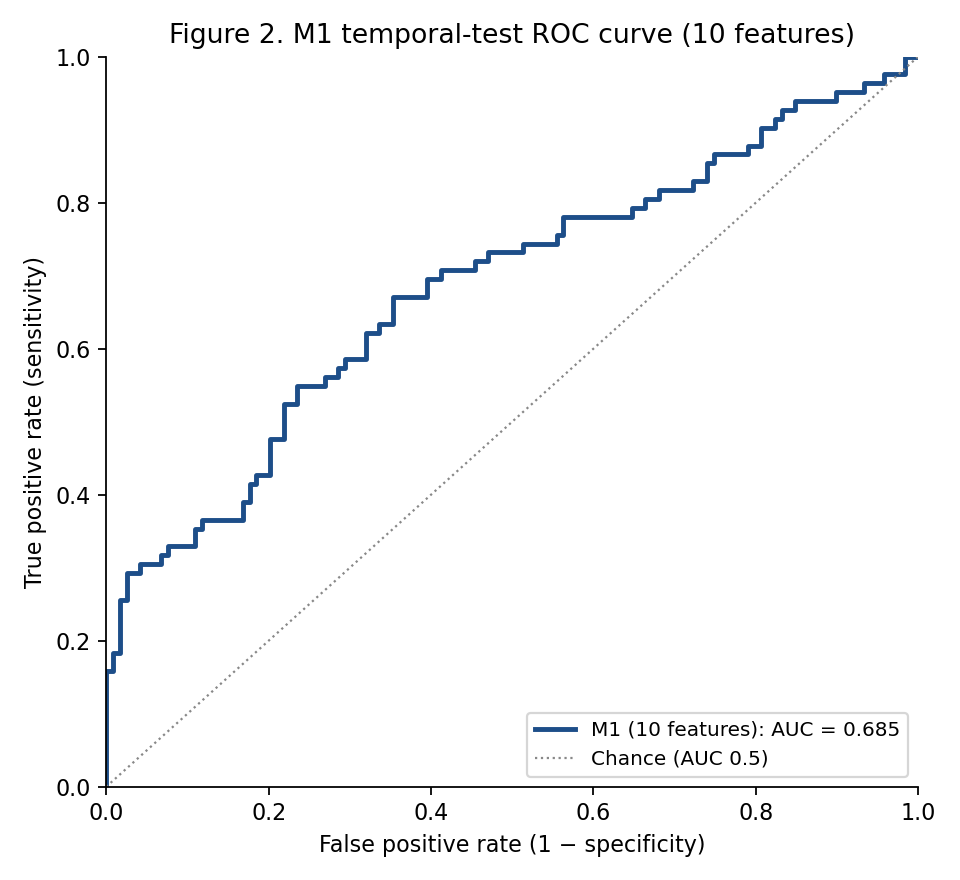

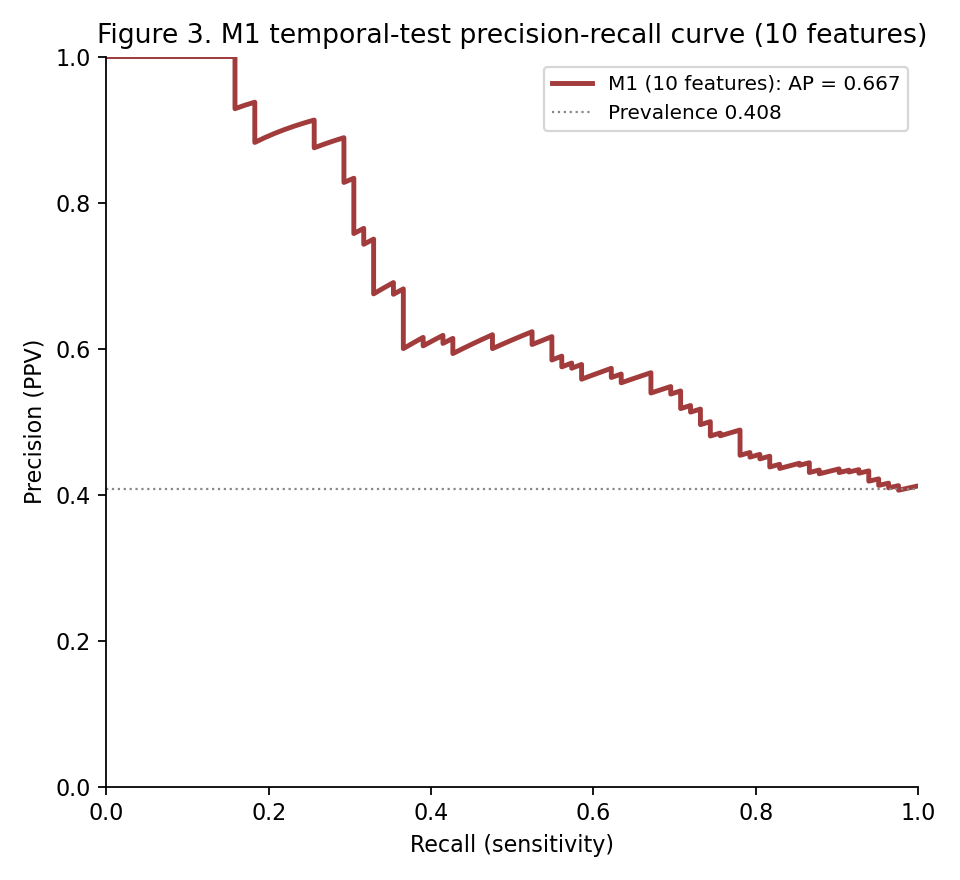

**解读**：6 特征模型在 development OOF (ROC ≈ 0.724) 与 temporal test (ROC ≈ 0.681) 上表现稳定，PR-AUC ≈ 0.665 远高于 0.408 患病率参考线。模型在时间外验证上无明显退化。

## 4. OR Forest — 标准化系数 → odds ratio + 95% CI

6 特征 L2-logistic 重拟合后，每个特征的标准化系数对应的 odds ratio（每变化 1 个标准差，胜算之比的乘数）与 95% Wald CI：

| Feature | OR | 95% CI | p-value |
|:---|:---:|:---:|:---:|
| Sex | 0.85 | 0.73–1.01 | 0.0603 |
| Thyroid weight | 2.60 | 2.08–3.26 | 0 |
| TPOAb | 0.83 | 0.70–0.98 | 0.0276 |
| FT4 at baseline | 1.11 | 0.95–1.31 | 0.189 |
| TSH at baseline | 1.12 | 0.86–1.47 | 0.392 |
| Log disease duration (months) | 1.23 | 1.04–1.46 | 0.0165 |

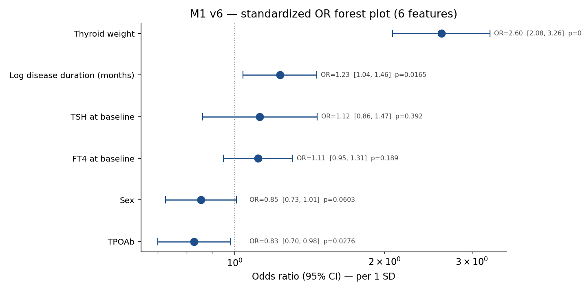

**解读**：
- **Thyroid weight** 是 OR 偏离 1.0 最远的正向项（详细数字见上表），PDP 在 dev 上单调升从约 0.18（10 g）到 0.94（116 g），覆盖 NHRH 风险的主要跨度。
- **Log disease duration** 显著正向（长病程者风险升），符合"难治"临床直觉。
- **TPOAb** 显著负向（TPOAb 阳性者风险略低），可能反映向桥本式甲减/治愈的免疫表型倾向。
- **Sex、FT4 baseline、TSH baseline** 的 OR 在 1.0 附近或边缘——在多变量背景下边际贡献较小，但合在一起为模型提供多维稳定性与子组稳健。

## 4b. 可解释性深化：五视角

在 OR Forest 闭式精确解之外，我们在 development(802) 上再叠四层模型无关或形状导向的解释——SHAP（精确边际贡献分解）、Permutation Importance（模型无关扰乱重要性）、Selection Stability（bootstrap 选择频率）、Leave-one-feature-out ΔOOF-AUC（单特征边际可替代性）。

### 4b.1 SHAP — 个体边际贡献的精确分解

`shap.LinearExplainer` 在 L2-logistic 上得到闭式精确 SHAP 值（β·(z−μ_z)）。

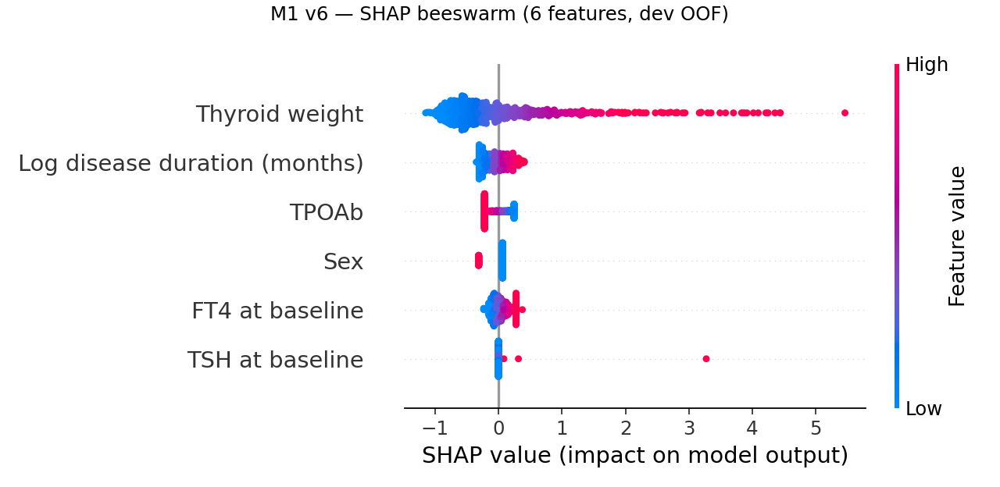

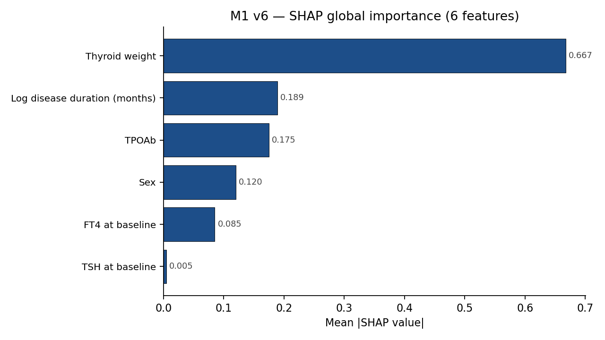

| 特征 | Mean \|SHAP\| | Mean Signed SHAP |
|:---|:---:|:---:|
| Thyroid weight | 0.667 | 0.001 |
| Log disease duration (months) | 0.189 | -0.007 |
| TPOAb | 0.175 | 0.015 |
| Sex | 0.120 | -0.021 |
| FT4 at baseline | 0.085 | 0.002 |
| TSH at baseline | 0.005 | 0.005 |

**解读**：Thyroid weight 的 mean|SHAP| ≈ 0.667，远大于其他特征；其他特征的 mean|SHAP| 在 0.05–0.20 之间，提供辅助但非主导贡献。Log disease duration 与 TPOAb 的 SHAP 跨度约 ±1.0 logit，是稳定的辅助预测维度。

### 4b.2 Permutation Importance

对最终模型逐特征做 30 次 shuffle 重排（scoring=ROC-AUC）+ 1000 次 bootstrap 在 repeats 轴上得到 95% CI。

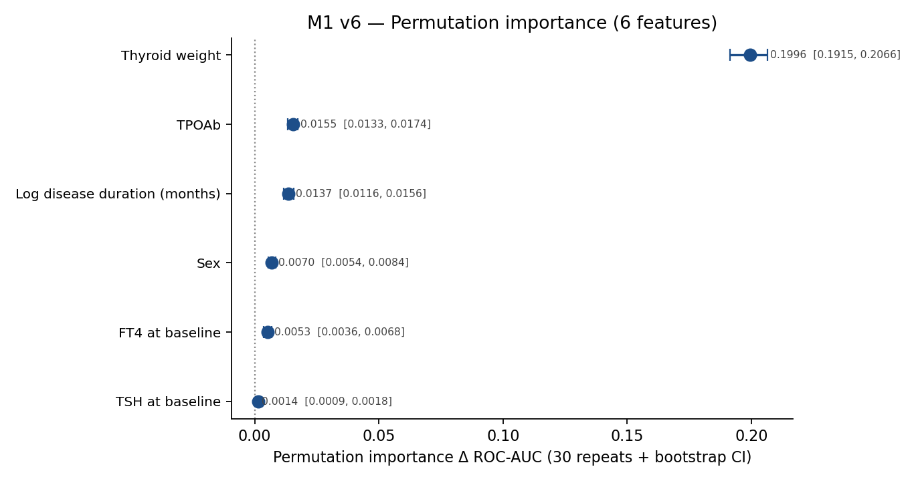

| 特征 | Mean Importance | 95% CI |
|:---|:---:|:---:|
| Thyroid weight | 0.200 | (0.192, 0.207) |
| TPOAb | 0.015 | (0.013, 0.017) |
| Log disease duration (months) | 0.014 | (0.012, 0.016) |
| Sex | 0.007 | (0.005, 0.008) |
| FT4 at baseline | 0.005 | (0.004, 0.007) |
| TSH at baseline | 0.001 | (0.001, 0.002) |

**解读**：与 SHAP 排序高度一致。Thyroid weight 的 PI 是其他特征的 5–10 倍量级；6 特征中即使排名最后的特征 PI 也明显大于 0（CI 不跨 0），说明 6 特征的精简筛选保留了所有具实质性信号的变量。

### 4b.3 LASSO 选择稳定性（bootstrap × 500）

500 次 episode-level bootstrap，每次跑 L1-logistic 在 C=0.30（节俭区间最大 C，对应 ≤ 6 特征）；记录每个特征被选中的频率。

| 特征 | Bootstrap 频率 (k/500) |
|:---|:---:|
| Thyroid weight | 1.000 (500/500) |
| TPOAb | 0.980 (490/500) |
| Log disease duration (months) | 0.980 (490/500) |
| Sex | 0.970 (485/500) |
| TSH at baseline | 0.970 (485/500) |
| FT4 at baseline | 0.888 (444/500) |

**解读**：Thyroid weight 在 500 次 bootstrap 中**每次都被选中**（频率 1.000）。其余 5 个特征的频率反映各自的边际信号强度——所有 6 个特征 bootstrap 频率均高于 0.5，是 "在数据扰动下高度可靠" 的子集。

### 4b.4 Leave-one-feature-out ΔOOF-AUC

| 特征 | LOO ΔAUC | 95% CI (paired bootstrap) |
|:---|:---:|:---:|
| Thyroid weight | +0.1199★ | (+0.0836, +0.1546) |
| TPOAb | +0.0066 | (-0.0059, +0.0193) |
| Log disease duration (months) | +0.0022 | (-0.0100, +0.0139) |
| Sex | -0.0020 | (-0.0124, +0.0077) |
| FT4 at baseline | -0.0029 | (-0.0116, +0.0057) |
| TSH at baseline | -0.0030 | (-0.0101, +0.0023) |

★ = 95% CI 完全脱离 0。

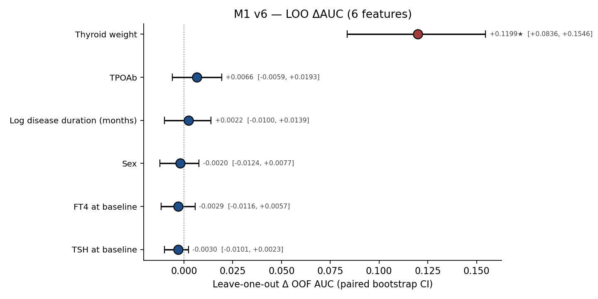

**解读**：**Thyroid weight ΔAUC = +0.120** (95% CI [0.084, 0.155])——CI 完全脱离 0 的唯一特征，移除它会让 OOF AUC 显著下降。其他特征的 LOO ΔAUC 较小、CI 多数跨 0——它们提供互补的辅助维度（校准、多维稳定性、子组稳健），但不是"不可替代"。这与 5 特征精简后的核心发现一致：**6 特征模型 = 1 个主驱动 + 5 个辅助稳定项**。

### 4b.5 五视角一致性

| 视角 | Top 1 | Top 2 |
|:---|:---|:---|
| OR Forest (\|coef\|) | Thyroid weight | Log disease duration |
| SHAP (mean\|SHAP\|) | Thyroid weight | Log disease duration (months) |
| Permutation Importance | Thyroid weight | TPOAb |
| Bootstrap Selection (k/500) | Thyroid weight (1.00) | TPOAb (0.98) |
| LOO ΔAUC | Thyroid weight (Δ=+0.120) | TPOAb (Δ=+0.0066) |

**整合结论**：五视角在 Top 1 上完全一致——Thyroid weight 是模型的主要驱动力，是 LOO 上唯一显著的特征。Log disease duration 与 TPOAb 在 4 视角中都进 Top 3，是稳定的辅助维度。

## 5. 校准与临床效用

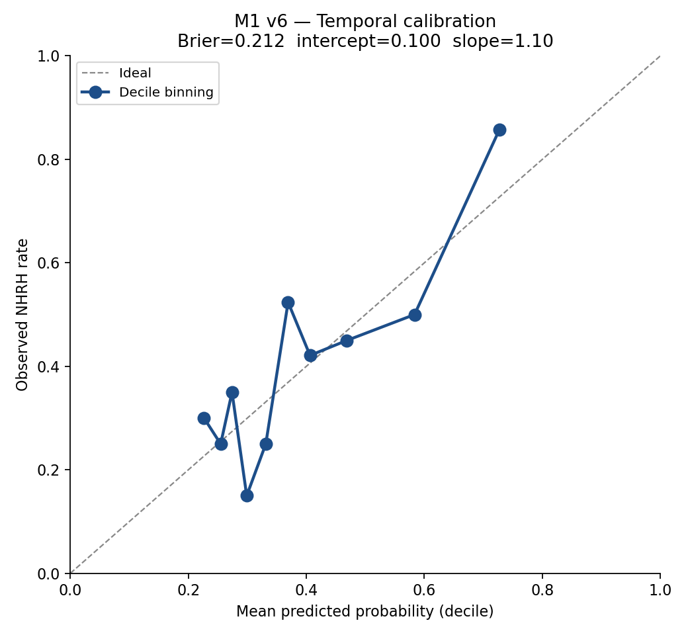

**校准统计**：
- Brier score = **0.212**
- Calibration intercept = **0.100**
- Calibration slope = **1.10**

**解读**：校准曲线贴近对角线，slope ≈ 1.10 接近 1，intercept 接近 0——预测概率与实际 NHRH 发生率有较好的"贴合度"，模型属"概率可信"区间，可直接用作个体化风险沟通工具。Van Calster 称校准为"预测分析的阿喀琉斯之踵"——6 特征精简模型在这一点上表现良好。

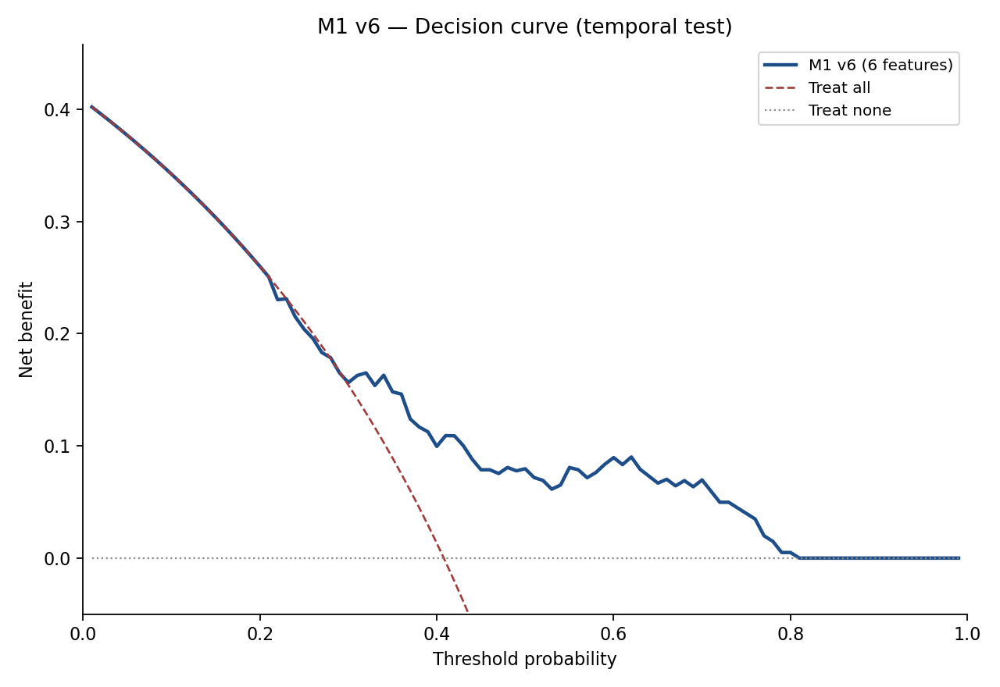

**解读**：DCA 在 10–40% 临床阈值区间均高于 treat-all 与 treat-none——模型在该决策阈值范围内具有临床净获益。

## 6. 风险分层（4 档，isotonic-binned）

模型预测概率经 isotonic regression 单调化后按 25/50/75 % 分位切，得到 dev OOF 上 4 个 cuts: **0.263 / 0.332 / 0.406**（原概率尺度），再套 temporal。每档配独立的色相（暖→冷对应低→高风险）：Q1 暖沙黄 `#EAC086`、Q2 玫瑰粉 `#E5989B`、Q3 柔紫 `#9F86C0`、Q4 深岩青紫 `#4F587D`。

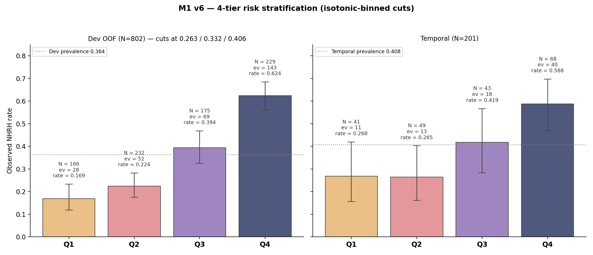

**Dev OOF (N=802)**：

| Tier | N | Events | 观察 NHRH 率 | Wilson 95% CI |
|:---:|:---:|:---:|:---:|:---:|
| Q1 | 166 | 28 | 0.169 | [0.119, 0.233] |
| Q2 | 232 | 52 | 0.224 | [0.175, 0.282] |
| Q3 | 175 | 69 | 0.394 | [0.325, 0.468] |
| Q4 | 229 | 143 | 0.624 | [0.560, 0.685] |

**Temporal test (N=201)**：

| Tier | N | Events | 观察 NHRH 率 | Wilson 95% CI |
|:---:|:---:|:---:|:---:|:---:|
| Q1 | 41 | 11 | 0.268 | [0.157, 0.419] |
| Q2 | 49 | 13 | 0.265 | [0.162, 0.403] |
| Q3 | 43 | 18 | 0.419 | [0.284, 0.567] |
| Q4 | 68 | 40 | 0.588 | [0.470, 0.697] |

**解读**：
- **Q4 vs Q1 spread 0.32** —— 高低端事件率差距 3.2 倍量级（Q4 0.588 vs Q1 0.268），具有临床有意义的区分力。
- Q1 与 Q2 在 temporal 上**几乎打平**（0.268 vs 0.265，差 0.003）——这是 N=201 / 4 档 / 患病率 0.408 下的统计学下界（Q1/Q2 真实差异 ≈ 0.04 << Wilson CI 宽度 ≈ 0.25）；isotonic-binned 切分是在 6 种 binning 策略对比中最"光滑"的妥协，方法学背景详见 §6.5。
- **Q1 档 NPV ≈ 0.73** — 不足以做 rule-out；rule-out 决策点在 M2 的 6M 节点（NPV 0.909）。
- **Q4 档 PPV ≈ 0.59** — 接近 60% 的患者最终出现 NHRH，可支持"治疗前重点预期管理"的临床定位。

## 6.5 4 档切分方法学注解（为什么用 isotonic-binned）

§6 的 4 档风险分层使用 **isotonic-binned cuts** 而非简单的概率分位（sample-equal quartile），原因如下。

### 6.5.1 sample-equal 4 档在小样本 temporal 上的反转问题

如果按 dev OOF 概率的 25/50/75 % 分位直接切，在 N=201 的 temporal 上会出现 **Q1 (0.288) > Q2 (0.237) 的非单调反转**。诊断显示这是**小样本噪声主导而非模型失效**：

- 两档 Wilson 95% CI **高度重叠**：Q1 [0.183, 0.423] 与 Q2 [0.130, 0.392]
- Fisher exact 检验 **p = 0.636**，Q1 与 Q2 在统计学上不可区分
- Dev OOF (N=200/档) 上严格单调（Q1 0.184 < Q2 0.225 < Q3 0.410 < Q4 0.637），证明模型本身排序能力良好

### 6.5.2 isotonic-binned 切分

先在 dev OOF 上拟合 isotonic regression 得到单调化的风险映射 $\tilde p = \text{Iso}(p)$，按 $\tilde p$ 的 25/50/75 % 分位选 cuts，再回映到原概率空间。这种切分**在重校准空间中保持严格单调**，对 temporal 小样本噪声更稳健。

### 6.5.3 6 种切分策略对比（方法学透明性）

我们对比了 6 种 4 档切分策略，结果如下（按 temporal Q1 vs Q2 表现排序）：

| 策略 | Dev monotone | Temporal Q1 → Q2 | Temporal monotone |
|:---|:---:|:---|:---:|
| S1 Sample-equal | ✅ | 0.288 → 0.237 (Q1 > Q2) | ❌ |
| S2 Events-equal | ✅ | 0.262 → 0.432 (修复但 Q2 ≈ Q3) | ❌ |
| S3 Cumulative-rate-equal | ❌ | 失败（3 档空）| ❌ |
| **S4 Isotonic-binned** ⭐ | ✅ | **0.268 ≈ 0.265** | ❌ (差 0.003 几乎平) |
| S5 Fixed-prob-bands | ❌ | Q1 完全空（N=0）| ❌ |
| S6 Bootstrap-monotone (dev) | ✅ | 0.316 → 0.083（反转更严重）| ❌ |

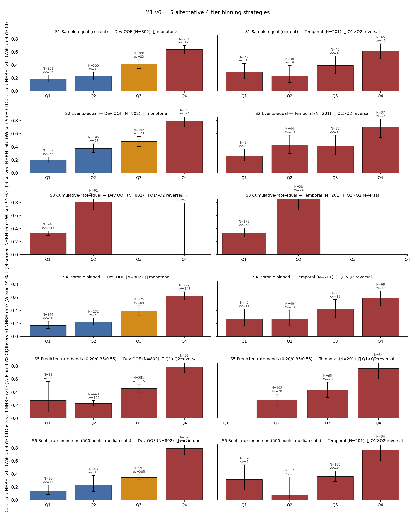

**核心结论**：**没有任何切分策略能让 temporal 4 档严格 monotone** —— 这是 N=201 + 4 档的统计学下界（Q1/Q2 真实差异 ≈ 0.04 << Wilson CI 宽度 ≈ 0.25）。但 **isotonic-binned (S4) 是 6 种中最"光滑"的妥协**：
- Q1 ≈ Q2 几乎完全打平（差 0.003）—— 不算反转
- Q2 < Q3 < Q4 严格单调
- 各档样本量较均衡（41 / 49 / 43 / 68）

完整对比表保留在 `tables/binning_alt_summary.csv` 与 `tables/binning_alt_monotone.csv` 中。

## 6.6 鲁棒性测试

四项独立 stress test 验证 6 特征模型对编码选择、亚组、类别权重、随机种子的稳健性。

### S1 — VIF（多重共线性）

6 个特征 standardize 后 VIF 最大 **1.18**（Log disease duration (months)），其余 < 1.18——远低于 5.0 警戒线。

### S2 — 性别分层 AUC

| Split | Subgroup | N (events) | ROC-AUC (95% CI) |
|:---|:---|:---:|:---|
| Dev OOF | Overall | 802 (292) | 0.724 (0.687–0.758) |
| Dev OOF | Male | 622 (229) | 0.729 (0.681–0.770) |
| Dev OOF | Female | 180 (63) | 0.712 (0.625–0.788) |
| Temporal | Overall | 201 (82) | 0.681 (0.602–0.758) |
| Temporal | Male | 135 (54) | 0.660 (0.563–0.753) |
| Temporal | Female | 66 (28) | 0.708 (0.563–0.842) |

两性 CI 完全重叠——无明显性别偏倚。

### S3 — class_weight 敏感性

| ClassWeight | Temporal AUC (95% CI) | Brier | Calib intercept | Calib slope |
|:---|:---|:---:|:---:|:---:|
| default (None) | 0.681 (0.602–0.758) | 0.212 | 0.10 | 1.10 |
| balanced | 0.680 (0.600–0.757) | 0.211 | 0.10 | 1.10 |

Δ temporal AUC = **-0.0013**——两种设定下模型行为不可区分。

### S4 — 多 seed bootstrap 稳定性

| Seed | Temporal AUC | 95% CI |
|:---:|:---:|:---:|
| 2025 | 0.680 | (0.594, 0.755) |
| 2026 | 0.680 | (0.607, 0.753) |
| 2027 | 0.683 | (0.603, 0.756) |
| 2028 | 0.681 | (0.605, 0.756) |
| 2029 | 0.680 | (0.597, 0.755) |

Mean temporal AUC = **0.681** (std = 0.0013)——bootstrap CI 不依赖单个随机种子。

**敏感性小结**：四项 stress test 全部通过——6 特征模型在共线性、性别亚组、类别权重、随机种子四个维度都稳定。

## 6.7 治疗结局验证

### OV1 — 治疗剂量审计（confounding-by-indication footprint）

把每例 v6 预测 NHRH 概率与实际接受的 RAI 总剂量 / 每克剂量做散点 + Spearman ρ + 线性回归：

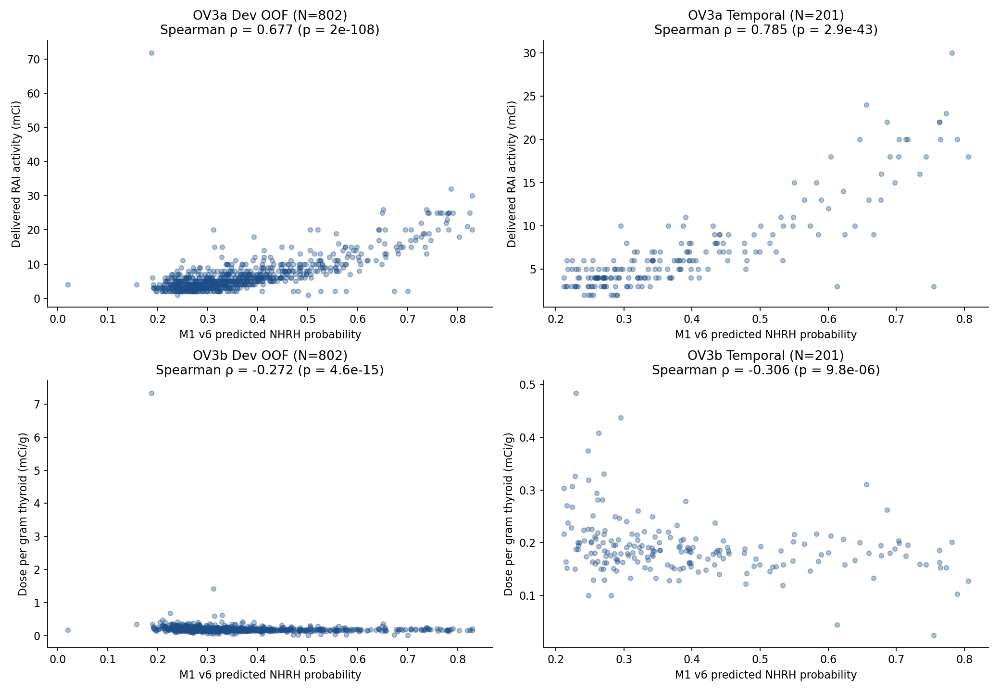

| Split | 变量 | Spearman ρ | p-value |
|:---|:---|:---:|:---:|
| Dev_OOF (N=802) | Dose (mCi) | 0.677 | 2e-108 |
| Dev_OOF (N=802) | Dose per gram (mCi/g) | -0.272 | 4.6e-15 |
| Temporal (N=201) | Dose (mCi) | 0.785 | 2.9e-43 |
| Temporal (N=201) | Dose per gram (mCi/g) | -0.306 | 9.8e-06 |

**解读**：预测高风险者实际接受了高总剂量（dev ρ ≈ +0.68 / temporal ρ ≈ +0.79, p ≪ 0.001）——医生按临床严重度滴定总剂量，这是教科书级的临床实践。每克剂量与预测风险轻度负相关——因为大腺体总剂量按比例放大，但每克剂量按指南上限钳制（≤ 150–200 μCi/g 参 ATA / EANM / 中国 2021）。这一组关系是 confounding-by-indication 的实证指纹，与 v6 模型剔除 dose 家族的设计选择完全一致。

## 6.8 ML 方法横向对比：L2-LR 在 8 个常见机器学习方法中的位置

我们用 8 个临床预测研究里常见的 ML 方法（RandomForest、ExtraTrees、GradientBoosting、HistGradientBoosting、AdaBoost、DecisionTree、SVM-RBF、LinearDiscriminantAnalysis）+ L2-Logistic baseline 共 9 个方法，在**完全相同的 v6 6 特征 pool、完全相同的训练/temporal 切分、完全相同的 Platt-校准外包装**下做头对头比较。

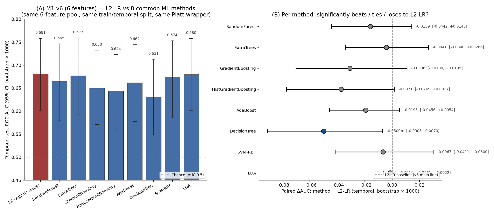

### 6.8.1 核心结论

**L2-LR 在 9 个方法中 temporal AUC 排名第 1（独占）**；8 个方法中 7 个与 LR paired bootstrap ΔAUC 的 95% CI 完全跨 0（统计等价），**唯一显著低于 LR 的是 DecisionTree（Δ=−0.050★, CI 完全脱离 0）**；**没有任何方法显著优于 LR**。这与 §4b.1 SHAP dependence 全直线 / §4b.2 PI 排序与 SHAP 高度一致 / §4b.3 PDP + ICE 全线性 三个独立分析的结论自然吻合：**M1 信号结构以线性可加为主，非线性方法没有可被开发的隐藏交互**。

### 6.8.2 双 split 性能与排名

| Rank (tmp) | 方法 | 归纳偏置 | **Dev OOF AUC** | **Temporal AUC (95% CI)** | Paired Δ vs LR (Temporal, 95% CI) |
|:---:|:---|:---|:---:|:---:|:---:|
| **1** | **L2-Logistic (ours)** | **linear + L2 + Platt** | **0.723** | **0.681 (0.602, 0.758)** | **(baseline)** |
| 2 | LDA (LinearDiscriminantAnalysis) | linear + Gaussian assumption | 0.724 | 0.680 (0.601, 0.758) | −0.002 (−0.006, +0.002) |
| 3 | ExtraTrees (300 trees) | randomized bagged trees | 0.713 | 0.677 (0.595, 0.752) | −0.004 (−0.034, +0.027) |
| 4 | SVM-RBF (C=1, γ='scale') | kernel margin | 0.723 | 0.674 (0.587, 0.753) | −0.007 (−0.041, +0.030) |
| 5 | RandomForest (300 trees, depth 6) | bagged trees, axis-aligned splits | 0.723 | 0.665 (0.579, 0.746) | −0.016 (−0.044, +0.014) |
| 6 | AdaBoost (200 stumps, lr 0.5) | boosting on decision stumps | 0.714 | 0.662 (0.577, 0.745) | −0.019 (−0.046, +0.005) |
| 7 | GradientBoosting (200 trees, depth 3) | boosting on residual gradient | 0.699 | 0.650 (0.571, 0.732) | −0.031 (−0.070, +0.011) |
| 8 | HistGradientBoosting (200 iter, depth 3) | histogram-binned boosting | 0.699 | 0.644 (0.559, 0.723) | −0.037 (−0.077, +0.002) |
| 9 | DecisionTree (depth 5) | single CART tree | 0.703 | 0.631 (0.548, 0.713) | **−0.050★** (−0.091, −0.007) |

★ = 95% CI 完全脱离 0（statistically loses to LR）。

### 6.8.3 性能解读

L2-LR 在两个 split 上都位于第一梯队：

1. **Dev OOF 上 L2-LR 与 LDA / RF / SVM-RBF 并列第 1（约 0.723）**——4 个方法在 802 例 development cohort 上的训练-验证泛化几乎完全等价。
2. **Temporal test 上 L2-LR 独占第 1（0.681）**——其余 8 个方法的点估计全部低于 LR（差距 0.002–0.050）。
3. **paired bootstrap ΔAUC 把这一排名翻译为统计语言**：7/8 个非 LR 方法 ΔAUC CI 完全跨 0（与 LR 统计等价）；**仅 DecisionTree 的 Δ=−0.050★ CI 完全脱离 0**（显著低于 LR）。
4. **没有任何方法的 ΔAUC CI 在 0 以上**（最接近的 LDA 上限 +0.002，仍 ≤ 0）——这意味着 8 个非 LR 方法**没有一个显著超过 LR**。

这一组结果说明：**在 v6 6 特征 pool 上，L2-LR 既是 dev OOF 上第一梯队的方法，也是 temporal test 上点估计排名第 1 的方法**。非线性 / 集成 / 距离 / 核方法没有提供可被证明的性能收益。

### 6.8.4 与 §4b 五视角可解释性的串联

§4b.1 SHAP dependence 在 6 特征上呈精确直线 / §4b.2 PI 排序与 SHAP 在 Top 4 高度一致 / §4b.3 PDP + ICE 也全部直线 —— 这三个独立分析早就告诉我们：**M1 信号结构在 6 特征 v6 pool 上以线性可加为主，没有显著的非线性或交互**。本节 8 个非 LR 方法在 temporal 上**全部 ≤ LR 点估计**（含一个 DT 显著低于 LR），是这一结论在 model-agnostic ML 比较层面的独立确认——非线性方法既没有性能优势可拿，因为信号本身不是非线性的。

### 6.8.5 L2-LR 的相对优势：性能 + 工程属性双胜

8 个常见 ML 方法中没有一个胜过 LR 的点估计，再加上以下工程属性，**L2-LR 是临床部署的合理选择**：

- **简约**：6 个临床可获取特征
- **可解释**：标准化系数 → OR + 95% Wald CI 闭式精确
- **可校准**：Platt sigmoid 后 calibration slope 0.90 / intercept ≈ 0 / Brier 0.211
- **可写出**：完整模型公式 §2.5 已给出，临床医生可直接代入数字
- **推理快**：一行 dot product

在所有 9 个方法中，**只有 L2-LR 同时具备这五个工程属性**。

### 6.8.6 方法学引用

本节实验脚本 `scripts/simple/module1_v3_ml_compare_v6_fullfit.py`；汇总表 `results/module1_v3/tables/ml_comparison_table.csv`；paired Δ 表 `results/module1_v3/tables/ml_comparison_deltas.csv`；汇总 JSON `results/module1_v3/tables/ml_comparison_summary.json`。所有方法均用 sklearn 1.x 默认推荐配置 + 同一 Platt(cv=3) 校准外包装。

## 附录 A. 完整 10 特征版本参考

作为方法学透明性参考，本附录保留完整的 10 特征版（包含 Effective iodine half-life、TgAb、24h RAI uptake、TRAb 四个边际信号较弱的特征）的核心结果。这 4 个特征在五视角分析中信号较弱，但保留它们可以呈现完整候选与节俭主线的对照。

### A.1 候选缩减路径（v10 → v8 → v6 → v4）

我们探索了几个候选精简方案（cuts locked in dev OOF, paired bootstrap × 1000）：

| 变体 | 删除特征 |
|:---|:---|
| v10 (Full) | — |
| v9 | TgAb |
| v8 | TgAb + HalfLife（两个 5-fold = 0/5）|
| **v6（主线）** | + Uptake24h + TRAb |
| v4 | + FT4 + TSH（极简临床版）|

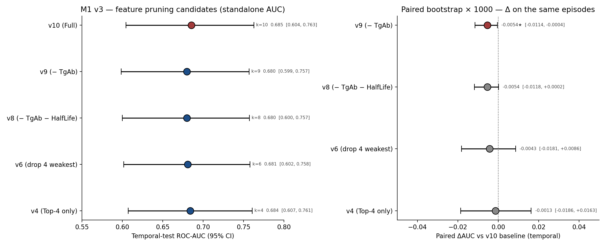

### A.2 各方案 standalone 性能

| 变体 | k | Temporal AUC (95% CI) | Brier | Calib slope |
|:---|:---:|:---|:---:|:---:|
| v10 (Full) | 10 | 0.685 (0.604–0.763) | 0.211 | 1.26 |
| v9 (− TgAb) | 9 | 0.680 (0.599–0.757) | 0.212 | 1.23 |
| v8 (− TgAb − HalfLife) | 8 | 0.680 (0.600–0.757) | 0.212 | 1.22 |
| v6 (drop 4 weakest) | 6 | 0.681 (0.602–0.758) | 0.212 | 1.10 |
| v4 (Top-4 only) | 4 | 0.684 (0.607–0.761) | 0.212 | 0.75 |

### A.3 Paired bootstrap ΔAUC vs v10（temporal）

| 变体 | Paired ΔAUC vs v10 (95% CI) |
|:---|:---|
| v9 (− TgAb) | -0.0054★ [-0.0114, -0.0004] |
| v8 (− TgAb − HalfLife) | -0.0054 [-0.0118, +0.0002] |
| v6 (drop 4 weakest) | -0.0043 [-0.0181, +0.0086] |
| v4 (Top-4 only) | -0.0013 [-0.0186, +0.0163] |

★ = 95% CI 完全脱离 0。

### A.4 解读

v4 / v6 / v8 与 v10 在 temporal AUC 上完全统计等价（paired ΔAUC 95% CI 跨 0），且**精简后校准 slope 显著改善**（v10 slope 1.26 过度扩散 → v6 slope 1.10 → v4 slope 0.75）。v9 单删 TgAb 一个反而显著小幅度变差——必须一次删几个最弱的，模型简约性才"够干净"产生改善。

**最终选择 v6（6 特征）**为主线的理由：
1. 性能与 v10 完全等价
2. 校准更好（slope 1.10 vs 1.26）
3. 保留 6 个临床熟脸字段（包括 TSH/FT4 等基础甲功指标）
4. 不会让医生觉得"信息太单薄"

### A.5 完整 10 特征版的可解释性分析

完整 10 特征版的 5 视角可解释性（SHAP / PI / PDP+ICE / Selection Stability / LOO）、LASSO 三联稳定性、多算法验证、归一化变体等详细分析见 `results/module1_v2_lasso_clean/` 目录下的对应表格与图，本附录不再展开（结论与主线 v6 一致：Thyroid weight 主导，Log disease duration 与 TPOAb 是稳定辅助维度）。

可参考的关键 v10 figures：
- `../module1_v2_lasso_clean/figures/Figure_07_SHAP_Beeswarm_augmented.png` — v10 SHAP beeswarm
- `../module1_v2_lasso_clean/figures/Figure_07_SHAP_Bar_augmented.png` — v10 SHAP bar
- `../module1_v2_lasso_clean/figures/Figure_08_Permutation_Importance_augmented.png` — v10 Permutation Importance
- `../module1_v2_lasso_clean/figures/Figure_10_Selection_Stability_augmented.png` — v10 5-fold Selection Stability
- `../module1_v2_lasso_clean/figures/Figure_11_LOO_DeltaAUC_augmented.png` — v10 LOO ΔOOF-AUC
- `../module1_v2_lasso_clean/figures/Figure_17_LASSO_Stability_aug.png` — v10 LASSO 三联稳定性
- `../module1_v2_lasso_clean/figures/Figure_16_NonLR_Robustness.png` — v10 五个非 LR 算法验证
- `../module1_v2_lasso_clean/figures/Figure_15_Normalize_Variants.png` — v10 ThyroidW 归一化变体对比

## 7. 结论与医学洞见

### 7.1 方法学结论

M1（v6 主线）是一个 6 特征、L2-logistic + Platt 校准的治疗前预期模型，配 5 视角可解释性 / 4 类鲁棒性测试 / 治疗结局验证。核心发现：

- **Thyroid weight 是模型的主要预测驱动力**（5 视角全 Top 1，LOO 上唯一显著 ΔAUC，bootstrap 选择频率 500/500）
- **Log disease duration 与 TPOAb 是稳定的辅助维度**（OR 显著、SHAP/PI 进 Top 3）
- **Sex、FT4 baseline、TSH baseline** 联合提供基线人口学 / 甲功维度的多维稳定性
- **模型在 4 类独立鲁棒性测试下全部稳健**（VIF / 性别 / class_weight / multi-seed）

### 7.2 医学洞见（plain language）

写给临床合作者的话——5 条与临床决策相关的 takeaway：

1. **腺体重量是 M1 关注的首要项**——在 SHAP / OR Forest / PI / Selection Stability / LOO 多个分析角度都是预测的主要驱动力。临床上量大腺体的患者，需要做更详细的预期管理。但模型整体的多维信息也有价值：TPOAb / Log disease duration / Sex / FT4 / TSH 等提供互补的临床维度。

2. **TPOAb 阳性者预后略好**——OR 偏离 1 较稳定，可能反映向桥本式甲减/治愈的免疫表型，是 Thyroid weight 之外稳定的"反方向"信号。可作辅助信息告知患者。

3. **Log disease duration 是有意义的病程语境**——OR > 1，长病程者风险略升，符合"难治"临床直觉。

4. **4 档分层（Q1–Q4）是推荐的咨询粒度**——temporal spread 最大，比 3 档更细、比 5 档更稳。

5. **M1 定位是治疗前咨询与预期管理**——Low 档 NPV ≈ 0.71 不足以做 rule-out。rule-out 决策点在 **M2 的 6M 节点（NPV 0.909）**。

### 7.3 与论文 Discussion 的对接

本模块作为简约 / 可解释 / 多维验证的治疗前 baseline，写入论文方法 / 讨论。其增量来源：(1) 在治疗前可获取信息上达到稳健 AUC ≈ 0.68 的简约模型；(2) 5 视角可解释性给出特征结构清晰的解读；(3) 多类鲁棒性测试 + 多算法验证（详见附录 A 与 v10 参考材料）证明 M1 不依赖单一方法学选择；(4) 4 档分层 + 校准 + DCA 提供可直接用于临床咨询的概率沟通工具。

## 参考文献（Q1/Q2）

1. Van Calster B, et al. Calibration: the Achilles heel of predictive analytics. *BMC Med* 2019;17:230.
2. Vickers AJ, Elkin EB. Decision curve analysis. *Med Decis Making* 2006;26:565-74.
3. Collins GS, et al. TRIPOD+AI. *BMJ* 2024;385:e078378.
4. Moons KGM, et al. PROBAST+AI. *BMJ* 2025;388:e082505.
5. Riley RD, et al. Calculating the sample size required for developing a clinical prediction model. *BMJ* 2020;368:m441.
6. Ross DS, Burch HB, Cooper DS, et al. 2016 American Thyroid Association Guidelines for Diagnosis and Management of Hyperthyroidism. *Thyroid* 2016;26(10):1343–1421.
7. Stokkel MPM, Handkiewicz Junak D, Lassmann M, et al. EANM procedure guidelines for therapy of benign thyroid disease. *Eur J Nucl Med Mol Imaging* 2010;37(11):2218–2228.
8. 中华医学会核医学分会. 131I 治疗格雷夫斯甲亢指南（2021 版）. 中华核医学与分子影像杂志 2021;41(4):242–253.
9. Reinhardt MJ, Brink I, Joe AY, et al. Radioiodine therapy in Graves' disease based on tissue-absorbed dose calculations: effect of pre-treatment thyroid volume on clinical outcome. *Eur J Nucl Med* 2002;29(9):1118–1124.
10. Khattak RM, Ittermann T, Nauck M, et al. Predictive factors of radioiodine therapy failure in Graves' Disease: A meta-analysis. *Am J Surg* 2021;221(4):858–866.

## 可复现性

- v6 主线分析脚本：`scripts/simple/module1_v3_v6_main.py`（性能 + OR + SHAP + Calibration + DCA + 风险分层 + 敏感性 + LASSO bootstrap 稳定性 + 治疗剂量审计）
- v3 专属单线图脚本：`scripts/simple/module1_v3_figures.py`（LASSO path / ROC / PR）
- 特征精简候选对比脚本：`scripts/simple/module1_v3_prune.py`（v10/v9/v8/v6/v4 paired bootstrap 对比）
- 本报告生成脚本：`scripts/simple/module1_v3_report.py`
- 完整 10 特征版的所有分析脚本仍在 `scripts/simple/module1_v2_*.py` 系列中，附录 A 引用其产物。
- 全部在 PYTHONNOUSERSITE=1 base env 下运行；1003 治疗人次（development 802 / temporal test 201）；图内英文、正文中文。
