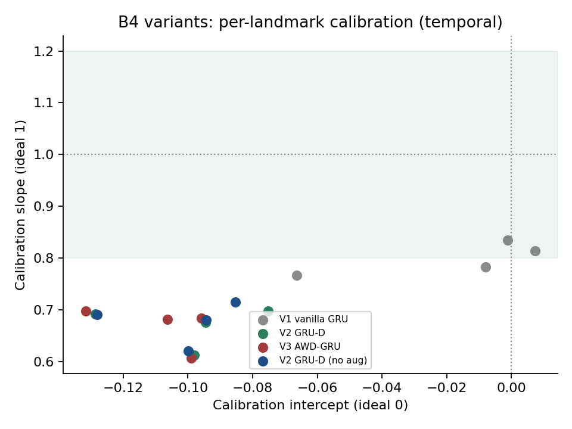

# M2 · B4 TARGET-GRU:时间感知深监督循环网络

> 一个**单向 GRU-D 序列模型**,用一个优雅的端到端结构替代"4 个独立 landmark LR"。本报告记录其设计、时间安全性证明、以及在 1003 人次(dev 802 / temporal 201)上的两阶段实验(Phase 1 单模型验证 + Phase 2 变体/正则/增强扫描)。**核心结论:per-step 深监督带来了真实的逐节点预测(修掉了 B1/B2/B3 的"复制假象"),但 GRU 家族的判别力在 temporal pooled ROC ≈ 0.73 触顶——与 L2 supermodel 统计打平、仍低于 per-landmark LR(0.770);GRU-D 时间衰减、数据增强、weight-drop、5-seed 集成无一改善判别或校准。这是"4 个时间点 + 800 样本的数据体制下,序列模型的复杂度不回本"的实证。**

---

## 1. 动机

M2 此前最佳是 **per-landmark 4-LR + ABCDE + Eval state**(temporal pooled ROC **0.770**)。它有效,但论文层面"4 个互相独立的逻辑回归"在架构上不优雅、不能在同一坐标系比系数。此前三个神经网络尝试(B1 MDJN 0.705 / B2 双塔-GRU 0.701 / B3 CLAN 注意力 0.719)不仅判别力更低,且**校准全部过度自信(slope 1.1–1.9)**,并且——关键缺陷——它们对一个疗程只产出**一个 episode 级预测再复制到 4 个 landmark 行**,导致四个时点的 ROC 完全相同,根本不是真正的逐节点预测。

B4 的目标:用**一个**序列模型同时满足三件事——(i)优雅地替代 4 个 LR;(ii)时间安全可被单元测试证明;(iii)产出**每个 landmark 各自的、真实的**预测。

## 2. 方法

### 2.1 架构 TARGET-GRU

```
静态块 A+B(基线负荷 + RAI 暴露,取自 0M 行,10 维)
        │  小 MLP + Tanh
        ▼  初始化隐状态 h0
[GRU-D 单元] ← 逐步喂入 动态块 C+D(当期 TSH/FT4 + velocity) + Δt + mask
        │  每一步隐状态 h_t
        ▼
[共享 per-step 头] 作用于每个 h_t → P(24M | 截至 landmark t)
```

- **静态→h0**:时不变的基线负荷/暴露只喂一次(初始化记忆),不在每步重复,省参数。
- **GRU-D 单元**(手写门 + 可学习时间衰减):更新前隐状态按 `exp(−softplus(γ)·Δt)` 衰减,让信息在不等距 {0,1,3,6}M 上正确"变旧";`γ` 初值 0(初始不衰减)。
- **单向 ⇒ 天生时间安全**:第 t 步隐状态只编码 ≤t 的输入,无需任何 mask。
- **per-step 深监督**:同一个 24M 标签监督全部 4 步(训练信号 ×4),且第 t 步输出**就是** landmark-t 的 time-safe 预测——直接替代"复制一个数到 4 行"的 hack。
- 总参数仅 ~1.5–2k(刻意小,小样本的首要正则)。

### 2.2 三变体 + 正则 + 增强(Phase 2)

| 变体 | 时间衰减 | weight-drop | 说明 |
|:--|:--:|:--:|:--|
| **V1 vanilla** | 否 | 0 | 最简时间感知 GRU |
| **V2 GRU-D** | 是 | 0 | 推荐主线 |
| **V3 AWD-GRU** | 是 | 0.2 | AWD 式 DropConnect on W_hh,最强正则 |

共用正则栈:变分输入 dropout(跨步同 mask)、Zoneout 0.1、AdamW weight-decay 1e-3、head dropout 0.3、inner-CV 早停(patience 15)、**5-seed 集成(概率平均后再 Platt)**、grad-clip 1.0、隐藏维 12。

**数据增强(仅训练 fold,绝不碰 OOF/temporal):** 化验噪声抖动(TSH/FT4,CV~7%)、landmark dropout(~15% 疗程随机遮 1 步,绝不遮 0M)、Δt 抖动(±10%)。

### 2.3 评估口径(与其余 M2 方法完全一致,保证公平)

StratifiedGroupKFold(按 episode)5 折 OOF;**逐 landmark Platt 校准**(在 pooled dev OOF 上拟合);**episode-cluster bootstrap × 1000** 算 CI;**模型选择只用 OOF(dev)**,**temporal 仅最终报告**。复用 `module2_v2_shared` 全套 helper。

### 2.4 时间安全单元测试

构造两条"≤t 相同、>t 不同"的合成疗程,断言第 t 步输出在两者间完全相同 → 证明 landmark-t 预测看不到未来。**运行通过**(每次 main 启动即跑)。

## 3. 结果

### 3.1 Phase 1 — 单 GRU-D 验证

单 GRU-D(单 seed、无增强)temporal:**逐节点 0.688 / 0.717 / 0.762 / 0.767,pooled 0.727**。


**关键里程碑:逐节点 ROC 是 distinct 且单调上升的**——与 B1/B2/B3 四值全等形成鲜明对比,证明 per-step 深监督真正实现了"每个 landmark 各自的 time-safe 预测"。这是该架构最实质的贡献。

### 3.2 Phase 2 — 变体 / 正则 / 增强扫描(5-seed 集成)

| 变体 | dev pooled | 0M | 1M | 3M | 6M | **temporal pooled** | calib slope |
|:--|:--:|:--:|:--:|:--:|:--:|:--:|:--:|
| V1 vanilla | 0.767 | 0.676 | 0.716 | 0.762 | 0.759 | **0.730** | 0.81 |
| V2 GRU-D | 0.756 | 0.692 | 0.716 | 0.763 | 0.764 | **0.734** | 0.67 |
| V3 AWD-GRU | 0.758 | 0.689 | 0.716 | 0.762 | 0.765 | **0.734** | 0.67 |
| V2(无增强) | 0.756 | 0.691 | 0.717 | 0.764 | 0.765 | **0.734** | 0.68 |


上图把 B4 各变体与基线放在同一 method×landmark 网格上。可读出三件事:(1)**所有 B4 变体几乎同色**——彼此差异淹没在噪声里;(2)**3M/6M 列普遍更深**(所有方法在晚期 landmark 都更准),与"早期信息不足、随访越久越可判定"的临床直觉一致;(3) per-LR+Eval 在 **3M 那一格独亮(0.847)**,是 B4 没能复现的高光——3M 免疫状态编码携带了 GRU 未能从轨迹里自学到的信息。



校准图显示:**5-seed 集成并未把过自信修好**,各变体逐节点 slope 仍落在 0.5–0.85(理想 1.0,绿带 0.8–1.2)。V1 vanilla 反而最接近(~0.81)。这是诚实的负结果。

### 3.3 与基线对比

OOF 选出的赢家是 **V1 vanilla GRU**(dev pooled 0.767;最简的那个)。其 vs L2 supermodel 的配对 ΔAUC:

| Landmark | ΔROC(B4−L2super) | 95% CI | CI 排除 0? |
|:--|:--:|:--:|:--:|
| Pooled | −0.008 | [−0.026, +0.009] | 否 |
| 0M / 1M / 3M / 6M | 全 < 0 | 全含 0 | 否 |

**B4 与 L2 supermodel(0.739)统计打平,仍低于 per-LR+Eval(0.770)。** 在所有 M2 方法里的位置:per-LR+Eval 0.770 > per-LR ABCDE 0.754 > RF 0.7435 ≈ L2 0.739 ≈ **B4 0.730–0.734** > B3 0.719 > B1 0.705 ≈ B2 0.701。B4 是迄今最好的 NN,但未越过简约 LR 族。

### 3.4 V1 调优:Eval 免疫状态特征是真正的杠杆

针对 OOF 赢家 V1 vanilla 做 2×2 调优网格({隐藏维 12/24} × {不加 / 加 Eval_1M/3M 免疫状态特征},各 5-seed):

| 配置 | dev pooled | temporal pooled | 3M | 6M | calib slope |
|:--|:--:|:--:|:--:|:--:|:--:|
| V1 noEval h12 | 0.767 | 0.730 | 0.762 | 0.759 | 0.81 |
| V1 noEval h24 | 0.765 | 0.729 | 0.762 | 0.756 | 0.95 |
| **V1 +Eval h12** | 0.783 | **0.751** | **0.799** | **0.790** | 0.81 |
| V1 +Eval h24 | 0.786 | 0.750 | 0.797 | 0.793 | 0.85 |

两点实证:(1)**纯加隐藏维无效**(0.730→0.729),证实纯 NN 超参对这数据是平的;(2)**加 Eval 特征真涨 +0.021**(0.730→0.751),且增益精确落在有 Eval 的时点——3M 0.762→0.799、6M 0.759→0.790,而 0M/1M(无 Eval)纹丝不动。这正是 per-LR+Eval 领先所依赖的那个特征。Eval 按时点注入(第 t 步只见 landmark-t 的 Eval)保持时间安全。

V1+Eval(0.751)由此**追平 per-LR ABCDE(0.754)**,把与 per-LR+Eval(0.770)的差距从 0.040 收窄到 0.019。但**同样喂 Eval,LR 在 3M 榨到 0.847、GRU+Eval 仅 0.799**——同一特征 LR 榨得更狠,再次坐实小表格数据上 LR 更优。

### 3.5 Phase 3:GRU-ODE-Bayes(隔离环境)

在独立 venv(`rai_ode` + torchdiffeq,**不碰 anaconda**)实现 GRU-ODE-lite:landmark 之间用 Neural-ODE 连续演化隐状态、landmark 处 GRU 更新、per-step 深监督(3-seed,78.9s)。temporal:

| Landmark | 0M | 1M | 3M | 6M | **Pooled** | slope |
|:--|:--:|:--:|:--:|:--:|:--:|:--:|
| GRU-ODE | 0.677 | 0.724 | 0.779 | 0.793 | **0.745** | 0.84 |

**pooled 0.745 是迄今最好的 NN**(增益在 3M/6M):比朴素 GRU(B4 V1 base 0.730)高 ~0.015,**数值上微超 L2 supermodel(0.739)**,但配对 Δ +0.007 [−0.009, +0.023] **仍含 0(打平)**;校准 slope 0.84,与 V1 持平。连续时间先验给了温和、不显著的提升——略好于计划"4 个固定点 ODE 收益有限"的预期,但**仍不及 per-LR+Eval(0.770),不改变 LR 是天花板的结论**。注:这非干净消融(B5 与 B4 V1 在 ODE 之外还差 zoneout/dropout/seed 数),为方向性参考;完整 GRU-ODE-Bayes 的 Bayesian 不确定性传播未实现(4 个固定点上意义有限)。

## 4. 诚实结论

1. **架构贡献是真的**:单向 GRU-D + per-step 深监督给出了**一个优雅、时间安全、原生逐节点**的模型,修掉了 B1/B2/B3 的复制假象。这一点值得写进论文(方法学 + 可视化叙事)。
2. **判别力不回本**:GRU 家族在 temporal pooled ROC ≈ 0.73 触顶,与 L2 supermodel 打平、不及 per-LR。**GRU-D 时间衰减、数据增强、weight-drop、5-seed 集成、加大隐藏维——这些"高级"网络旋钮无一移动指标。** 连 GRU 内部,vanilla 都不输给花哨变体。唯一真正起效的是**喂对特征**:加 Eval 把 V1 抬到 **0.751**、追平 per-LR ABCDE(§3.4),但仍不及 per-LR+Eval——同一特征 LR 在 3M 榨得更狠(0.847 vs 0.799)。
3. **校准未改善**:仍过度自信,不及 per-LR 的 slope 0.95–1.01。
4. **根因是数据体制**:4 个固定、近单调的随访点 + 800 dev 样本,序列模型要从头学的"轨迹形状"信息,已被手工特征(velocity = Δ/Δt、time×dynamic 交互)以更省样本的方式喂给了 LR。这不是架构不够好,是任务本身不需要序列机器。

**论文定位建议**:B4 作为"我们系统性地试过为小数据/不规则临床序列设计的 GRU 族(vanilla / GRU-D / AWD + 多 seed + 增强),简约 LR 仍是天花板"的**强方法学对照**——即"don't add complexity unless it pays off",有完整实验背书;并保留 per-step 深监督的逐节点能力作为可解释性卖点。主线仍推 per-landmark LR + ABCDE + Eval。

## 5. 局限与未来工作

- **GRU-D 衰减在 4 个固定步上 γ 几乎学不到东西**(如预期),其价值仅在为"未来不规则随访"留接口。
- **Eval 免疫状态特征已验证为有效杠杆**(§3.4:V1+Eval 0.751,增益锁定 3M/6M)——已纳入 B4 的可调结果。辅助 6M 头(multi-task)仍未启用(B2 证据显示大概率 no-op),为待做消融。
- **GRU-ODE-Bayes 已在隔离环境实现并运行(§3.5)**:pooled 0.745,迄今最好的 NN、数值微超 L2(打平),但仍不及 per-LR+Eval。完整的 Bayesian 不确定性传播未实现(4 个固定点上意义有限),留作 future work。

---

*运行环境:本机 uv(torch 2.12 + numpy2/pandas3),数据从计算机(anaconda)rsync;L2 supermodel 本机重算 0.738 ≈ 已知 0.739,确认跨环境结果一致。所有数字 runtime 计算;分析单元 = 1003 人次。*
