# 放射性碘治疗后 Graves 病早期复发的可解释预测:基于可解释 Boosting 机(EBM)的玻璃盒分析(图文版)

> RAI post-treatment Graves' relapse — an interpretable boosting (EBM) glassbox at fixed landmarks (1/3/6/12 months)。**本版统一采用 corrected 真值 + LOCF(激素延续)口径**,在四个治疗后随访地标(1M / 3M / 6M / **12M 新增**)各内嵌 9 图电池组并逐图配评论,另附跨地标汇总;图注经读图代理逐张阅读后撰写、正文叙事由作者撰写。

## 摘要

**背景** RAI 治疗后 Graves 病早期复发预测需既准确又**可临床解读**;黑盒模型难落地。我们以**可解释 Boosting 机(EBM,带自动两两交互的玻璃盒 GAM)**在四个治疗后随访时点(1M / 3M / 6M / 12M)建模 24 个月复发(NHRH),系统刻画逐时点的特征重要性、**非线性形状函数**、校准、决策获益与选择性预测。0M(治疗前)由 M1 模块承担,本文不再做 0M 的性能分析。

**方法** 分析单元为治疗疗程(N=1003 人次;时间序贯:开发 802 / 时间外测试 201)。**关键口径修订**:当期化验真值取自 long 表 `Current_Time=="{L}M"` 行的 `*_Current` 列(单一真相源 `_corrected_landmark_values`),修复了主线读退化宽列(`FT4_6M` 仅 13/1003 真值、`FT4_12M` 0/1003)的缺陷;随访脱落造成的真缺失(6M ≈25%、12M ≈40%)以 **LOCF(激素延续:结转该 episode 上一次可得真值,time-safe 仅回看)** 填补。FT3、FT4 高度共线(r≈0.81–0.91),先标准化再正交聚合为「FT3,FT4 综合水平」与「FT3,FT4 落差」两轴(TSH 因反向反馈单列)。开发集 OOF(5 折 StratifiedGroupKFold)仅用于选择、时间外仅用于报告;必含 **naive(prevalence,AUC 0.5)+ persistence(当前功能态,单看当期 TSH 的 L2-LR)** 两条朴素对照。

**结果** EBM 时间外 ROC-AUC:1M **0.694** / 3M **0.791** / 6M ~~0.817~~ → **0.878**(corrected 真值 + LOCF)/ 12M **0.908**(新增)——判别力随随访单调累积、6M/12M 显著高于早期。**重要性随治疗后随访迁移:甲状腺重量(1M)→「FT3,FT4 综合水平」(3M 接管,并在 6M / 12M 持续主导)**;修复当期真值后,**当期水平的权重明显上升、激素动量退居第三(6M)乃至第五(12M)**——与旧退化口径「6M 由激素动量主导」的叙事相反(旧结论已用删除线标记)。形状函数揭示当期甲功与 6M 动量的**非线性阈值效应**(线性模型低估);12M 自动发现「当期水平 × 变化速度」交互。校准随随访改善(6M / 12M 斜率最接近 1)。persistence 基线 AUC 0.55(1M)→0.75(6M / 12M)后封顶,EBM 在每个地标稳定高出其 0.13–0.16。

**结论** EBM 在不牺牲判别力下提供透明、逐时点、非线性的临床解读;较 persistence(当前功能态)与 naive(prevalence)均有稳定增量。**12M 在 LOCF 口径下不降反升(0.908>0.878)**:其结转了 6M 的强信号、且距 24M 终点更近——揭示"延续最近一次真实甲功"本身即强预测,与动量/惯性叙事一致。

## 1. 引言

早期识别 RAI 治疗后将复发的 Graves 病人次有助于个体化随访与再治疗决策。临床预测建模(TRIPOD+AI / PROBAST+AI)强调可解释性、校准与时间外验证。**EBM** 是带自动两两交互的广义加性模型(GA2M):每个特征学习一条可视化形状函数,模型输出 = 各形状函数贡献之和——精度接近 boosting、解释性等同加性模型,是"玻璃盒"。本研究用 EBM 回答:早期复发的可解释信号是什么、随随访如何迁移、是否存在非线性效应,并把随访延伸至 12M 以考察"延续最近真实甲功"在高脱落时点的价值。

## 2. 方法

- **数据/评估**:episode 级 StratifiedGroupKFold OOF 仅用于选择;时间外测试仅用于报告;逐 landmark 评估;analysis unit = 1003 人次。
- **口径(本版核心修订)**:
  - **corrected 真值**:`load_stacked_x(corrected=True)` 从 long 表 `Current_Time=="{L}M"` 行取 `*_Current` 真值(time-safe,只读 ≤L),修复主线读退化宽列(`FT4_6M` 14→600、`FT4_12M` 0→471 真值)的缺陷;三激素全有人次 3M 820 / 6M 746 / 12M 605。
  - **LOCF 插值**:随访脱落造成的真缺失以「激素延续」填补——结转该 episode 上一次可得真值(6M→3M→1M…,仅回看),残余 NaN 退 dev-median。插值实验(median / LOCF / missForest / KNN / EBM-native-NaN / median+indicator × 5 地标,paired episode-cluster bootstrap n=1000)显示 **LOCF 在缺失高发的 12M 上 Δ=+0.105、CI [0.059, 0.154] 排除 0**(全矩阵唯一排除 0 的提升),6M 同向占优(Δ=+0.023,CI [−0.004, 0.050] 跨 0 偏正),低缺失地标各法在 bootstrap 噪声内不可区分;informative-missingness 对照(EBM-native-NaN / median+indicator)≈ median,说明**增益来自结转「数值/轨迹」本身而非仅「知道它缺了」**。
- **模型**:每地标一个 EBM(interactions=5,其余默认),dev 5 折 OOF + 时间外由 final dev-fit 预测;**必含 naive(prevalence)+ persistence(当期 TSH 单特征 L2-LR,同 OOF/temporal 协议)** 两条朴素对照,以量化学习模型相对"只看今天甲功"的增量。
- **如何聚合(关键)**:FT3、FT4 同向共线,先各自标准化得 z 分,再合成正交两轴 ——「FT3,FT4 综合水平」=(zFT3+zFT4)/√2;「FT3,FT4 落差」=(zFT3−zFT4)/√2(速度同理)。除以 √2 使两轴单位方差且互相正交。**TSH 与 FT3/FT4 反向(垂体反馈),单列**(当期 TSH / TSH 变化速度)。
- **图注**:全部 47 图由读图代理逐张阅读后撰写;图标题中文经字体注册正常渲染(无 tofu)。数字含义:原生重要性 = 该项对 log-odds 的平均绝对贡献;形状函数 = 该特征对 log-odds 的贡献曲线。

### 2.1 EBM 与 logistic regression 的数学定位

EBM 是广义加性模型(GAM),更准确为带两两交互的 **GA2M**;**LR 是其特例**。三者并排写在 logit 尺度上(p = 复发概率,logit(p)=log[p/(1−p)] 即 log-odds):

```
LR:          logit(p) = β0 + Σ_j β_j · x_j
GAM:         logit(p) = β0 + Σ_j f_j(x_j)
GA2M (EBM):  logit(p) = β0 + Σ_j f_j(x_j) + Σ_{j<k} f_{jk}(x_j, x_k)
```

- **LR** 把每个变量贡献写成 `β_j·x_j`(过原点、斜率固定的直线),`OR_j = exp(β_j)` 对所有 x **恒定**;**EBM** 将其换成任意形状的 `f_j(x_j)`(即本文的「形状函数 / 风险曲线」),仍在 log-odds 尺度度量,但斜率可变。把 `f_j` 强制为线性,EBM 即退回 LR ⇒ **两者同尺度、可直接对照**。
- **形状函数读法**:纵轴 = 该指标对 log-odds 的加项(某基线取 0);从 x₁ 到 x₂ 的变化 `Δ = f_j(x₂) − f_j(x₁)` 即该段的对数 OR,**局部 OR = exp(Δ)**。LR 的局部 OR 与所处位置无关,EBM 则随位置变化——这正是「阈值 / 拐点」的严格表达。
- **实例(§3.4 图 F32,12M「FT3,FT4 综合水平」)**:`f(v)` 在零点附近从约 −1.4 陡升到 +2.0 log-odds,过零一小段的局部 OR ≈ `exp(3.4) ≈ 30`;单个 β 无法刻画,LR 需手工加 spline / 分段 / 多项式逼近,EBM 自动学出。
- **估计方式**:cyclic gradient boosting——大量浅树,每轮 round-robin 只在单个特征上拟合残差一点点,最后把同一特征所有树的贡献累加成 `f_j`,故 `f_j` 为分段常数(台阶状),等价于数据驱动地自动分箱(节点无需预设)。
- **可加性 ⇒ 可审计**:任一病人预测可精确逐项分解 `η_i = β0 + Σ_j f_j(x_jⁱ)` (+ 交互项),每项即该病人在该指标上的得分(log-odds,exp 后为对几率的乘法因子)。EBM 仅允许**显式列出**的二阶交互 `f_{jk}`(本文设 5 个,可单独看热图),区别于随机森林 / 神经网络的任意阶、不可逐项读出的纠缠——这是「玻璃盒」相对「黑盒」的数学根源。

## 3. 结果(逐图)

判别力随随访累积而单调上升(见 §3.5 图 F37 / F39),6M / 12M 显著高于早期;每地标稳定高出 persistence(当前功能态)0.13–0.16(F38)。下面按时点逐图呈现 ROC / PR / 校准 / 原生重要性 / 形状函数 / 决策曲线 / 风险三档 / 混淆矩阵,每图配解读。所有 ROC / PR / 校准 / 决策 / 三档 / 混淆均在**时间外测试集**评估;三档阈值与 Youden 工作点取自 **OOF 开发集**(不偷看测试)。

### 3.1 早期 1M — 甲状腺重量为锚、甲功起步(9 图)

**图 F01 · 1M EBM ROC(AUC 0.694)**

凸向左上,AUC 0.694,中等;紫色点划线为 persistence(只看当期 TSH,AUC 0.55)——1M 单看一次 TSH 几近无信息,EBM 借甲状腺重量 + 起步甲功把判别力抬到 0.69。

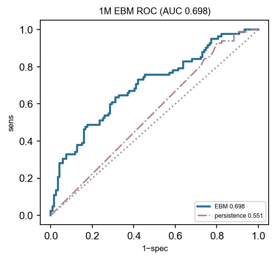

**图 F02 · 1M EBM 精确率-召回率(AP 0.602)**

AP 0.602,高于基线约 0.41;精确率在低召回区即达约 0.8 后随召回上升单调回落基线——高召回以精确率为代价,1M 仅对少数高把握病例可靠。

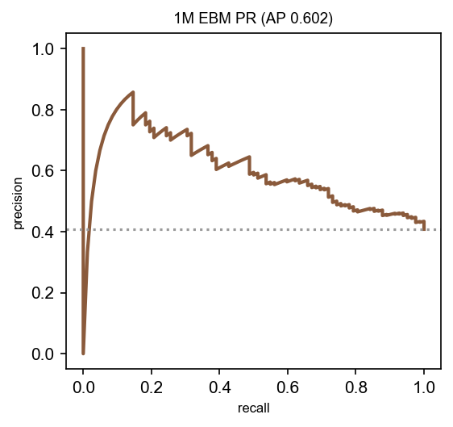

**图 F03 · 1M EBM 校准**

整体位于对角线下方(系统偏高、过度自信),中段分箱观测率有平台,小样本(N=201)分箱噪声可见——早期概率偏乐观,部署前需重校准。

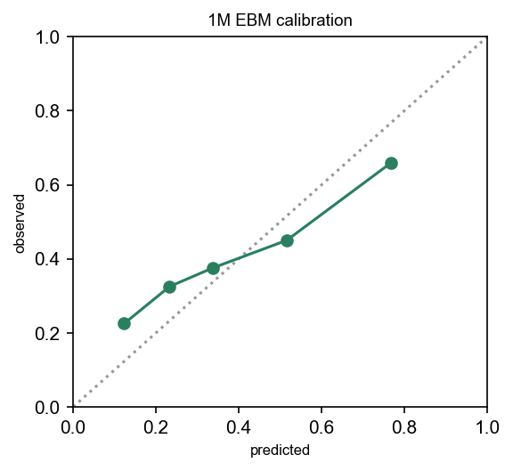

**图 F04 · 1M EBM 原生重要性 top-6**

甲状腺重量约 0.50 绝对主导(约为第二名「FT3,FT4 综合水平」0.21 的两倍余),其后病程(log)、`TPOAb × FT3,FT4 速度`交互、TPOAb、TRAb——1M 是"甲状腺重量为锚、甲功起步"的过渡时点,解剖负荷主导。

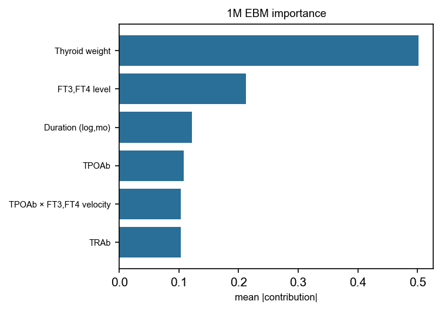

**图 F05 · 1M 形状函数 #1:甲状腺重量**

单调递增饱和型,约 25 g 穿零,小腺体负贡献、50 g 附近陡升、>100 g 平台(约 +1.4)——腺体越大风险越高且边际递减。


**图 F06 · 1M 形状函数 #2:FT3,FT4 综合水平**

单调上升、约 −0.7 过零、高值端平台(约 +0.6);贡献幅度(±0.5)远小于甲状腺重量(±1.4),量化了 1M 二者相对权重——当期甲功此时尚为配角。

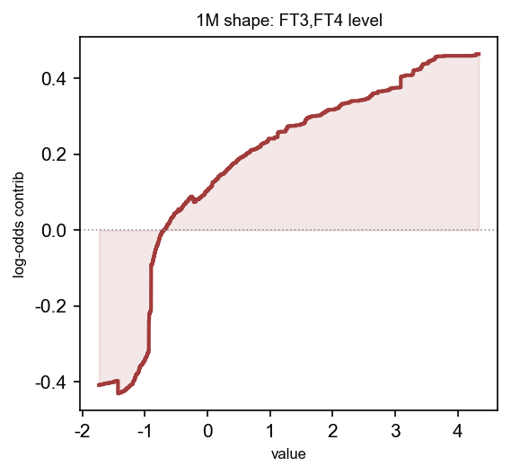

**图 F07 · 1M 决策曲线**

临床合理阈值区间(0.05–0.6)EBM 净获益多不低于 treat-all / treat-none 两条参考线,阈值>0.2 后对 treat-all 优势扩大——1M 即有正向净获益,虽幅度有限。

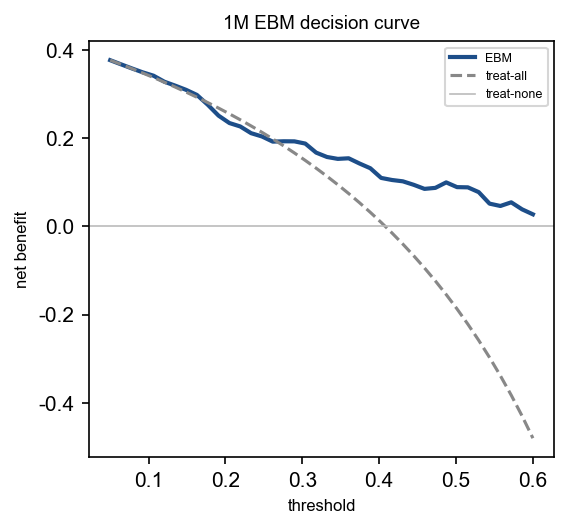

**图 F08 · 1M 风险三档事件率**

单调上行:low / mid / high 事件率拉开梯度(高低相差约 2–3×),外部时间集能分出风险层次;但最高档绝对风险有限,1M 分离幅度仅中等。

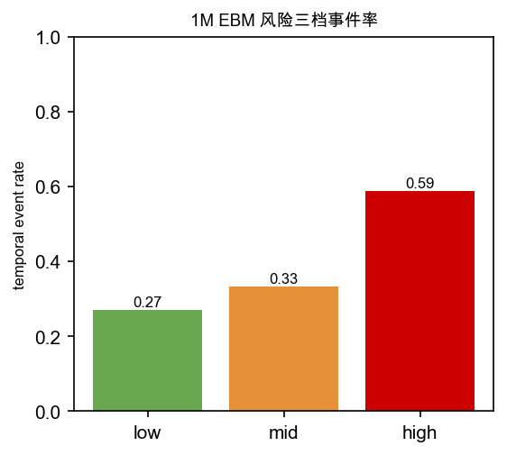

**图 F09 · 1M 混淆矩阵(OOF Youden 阈值)**

该阈值偏低换高灵敏:多数复发被检出、代价是约半数未复发者被判阳——契合复发筛查"宁错召不漏诊",但 1M 假阳偏多。

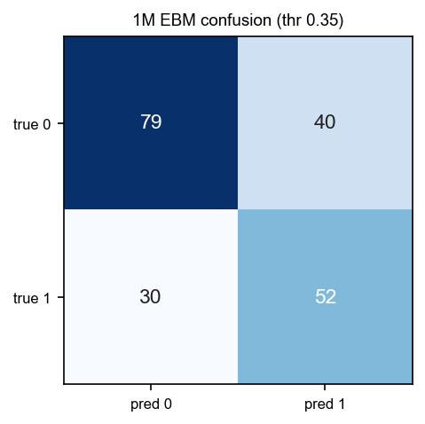

### 3.2 中期 3M — 当期甲功水平接管(9 图)

**图 F10 · 3M EBM ROC(AUC 0.791)**

AUC 0.791,较 1M 跃升;低假阳性区即升至 0.6–0.7 灵敏度,判别力已较强;persistence(0.68)亦随当期 TSH 信息增多而抬升,但仍低 EBM 约 0.11。阶梯状属小样本(N=201)正常表现。

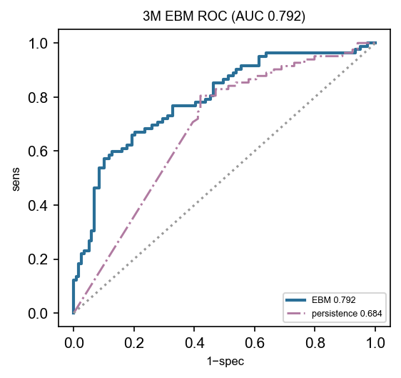

**图 F11 · 3M EBM 精确率-召回率(AP 0.727)**

AP 0.727,远高于基线;精确率在中等召回区稳定约 0.8,召回>0.7 后下滑——中高召回区仍保持较好阳性预测价值。

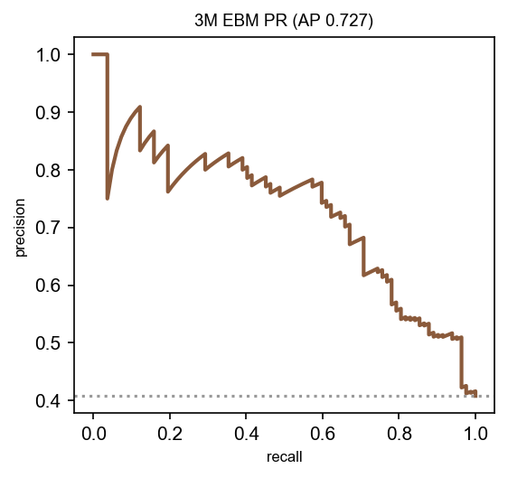

**图 F12 · 3M EBM 校准**

贴近对角线、五点基本单调,中段略偏上、高段略偏下,绝对偏差小——概率基本可信、可直接分层,较 1M 明显改善。

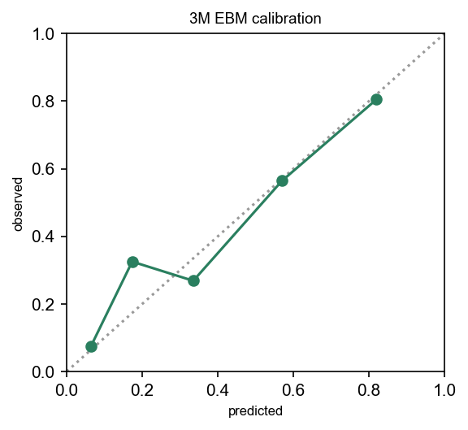

**图 F13 · 3M EBM 原生重要性 top-6**

「FT3,FT4 综合水平」约 0.54 居首,甲状腺重量 0.38 退居第二,当期 TSH 0.27 第三,其后 TSH 速度 / FT3,FT4 速度——**当期甲功水平接管首位主导**,体现"当前状态"对近期复发的强预测;修复真值后此接管较旧口径更早、更彻底。

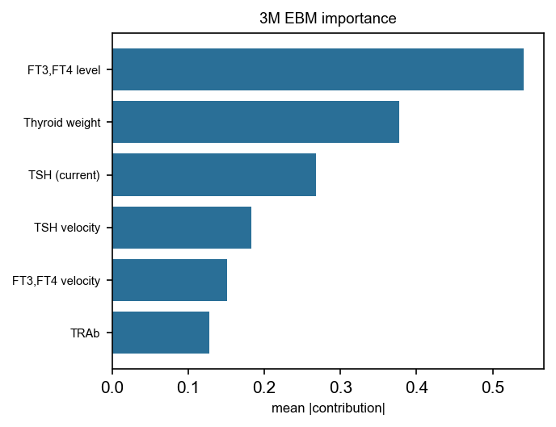

**图 F14 · 3M 形状函数 #1:FT3,FT4 综合水平**

单调递增强非线性,均值附近骤升穿零,高值端台阶式跳升(约 −0.7→+1.6)——当期甲功越高风险贡献越大,低值保护、高值饱和。


**图 F15 · 3M 形状函数 #2:甲状腺重量**

单调递增饱和,约 25–30 g 以下保护、穿零后上升、>100 g 平台(约 +1.1)——体积越大贡献越高,超 100 g 边际消失,符合生理饱和。

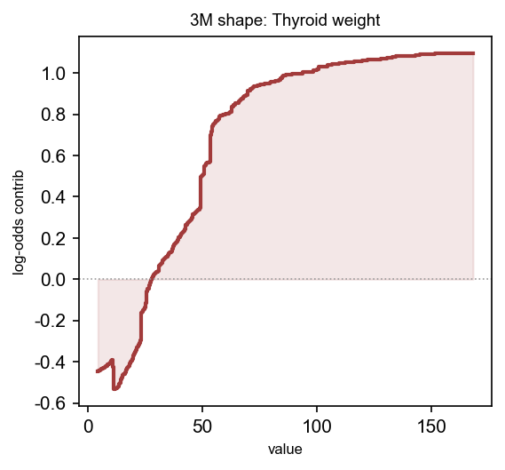

**图 F16 · 3M 决策曲线**

约 0.1–0.6 阈值区间 EBM 净获益持续高于两条参考线(treat-all 在约 0.4 转负),临床相关阈值区间使用模型有实际净获益。

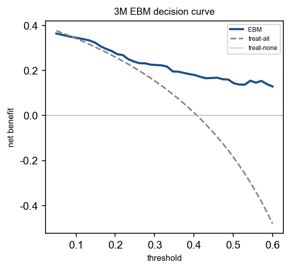

**图 F17 · 3M 风险三档事件率**

单调:low / mid / high 事件率高低相差约 6–7×,外部时间窗内有效区分梯度,可支撑分层随访;较 1M 分离明显加大。

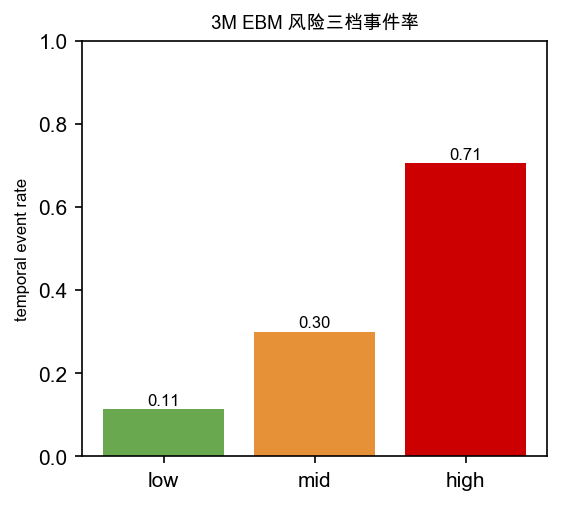

**图 F18 · 3M 混淆矩阵(OOF Youden 阈值)**

偏高灵敏(多些假阳换更少漏诊),契合复发筛查;较 1M 特异度回升,假阳减少——3M 起进入更可用区间。

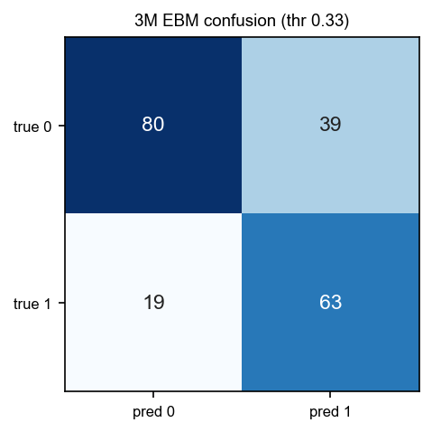

### 3.3 后期 6M — 当期甲功主导(corrected 后水平接管动量,9 图)

> 口径变更提示:旧退化口径下 6M ROC ~~0.817~~、且**由「FT3,FT4 综合变化速度(动量)」主导**;**corrected 真值 + LOCF 后 6M ROC=0.878,首位主导切换为「FT3,FT4 综合水平」(当期甲功),激素动量退居第三**(详见 F22 / §4)。

**图 F19 · 6M EBM ROC(AUC ~~0.817~~ → 0.878)**

AUC 0.878——较旧退化口径(0.817)大幅提升,低假阳性区即升至约 0.6–0.7 灵敏度、凸形良好;persistence(0.75)亦较高,但 EBM 仍稳定高出约 0.12——后期"当期真实甲功 + 恢复趋势"信号使模型在控误报下捕获多数复发。

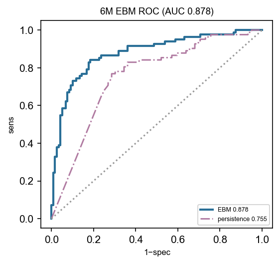

**图 F20 · 6M EBM 精确率-召回率(AP 0.839)**

AP 0.839,远高于基线;精确率在中高召回区稳定约 0.8–0.9,召回>0.8 才明显下滑——保留高查全时仍维持较好查准,较 3M 进一步抬升。

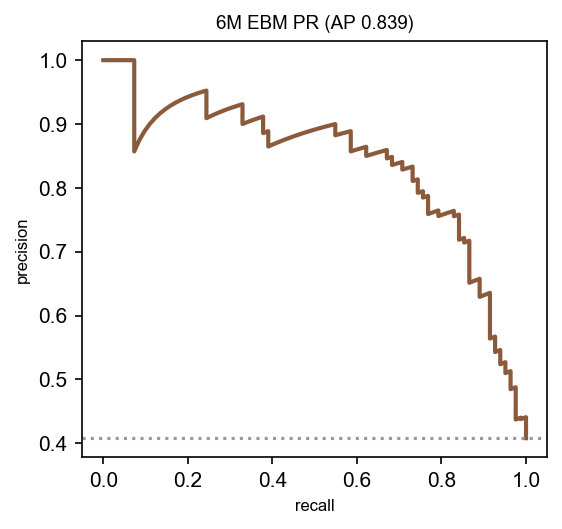

**图 F21 · 6M EBM 校准**

五点紧贴 45° 理想线、斜率接近 1(优于早期),低/高端轻微偏移、整体偏差小无系统性偏移——概率可直接用于分层。

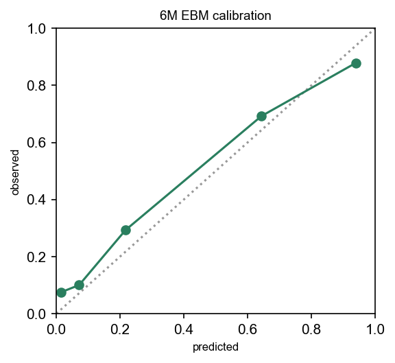

**图 F22 · 6M EBM 原生重要性 top-6(口径变更核心图)**

「FT3,FT4 综合水平」约 1.07 绝对居首、「当期 TSH」0.54 次之、「FT3,FT4 综合变化速度」0.41 第三,其后甲状腺重量 / TSH 速度。~~旧退化口径:动量(速度)居首~~ → **corrected 真值后当期水平接管首位,激素动量退居第三**——修复"读错当期化验列"后,当期真实甲功的强信号回归,印证当期状态在 6M 的主导地位。

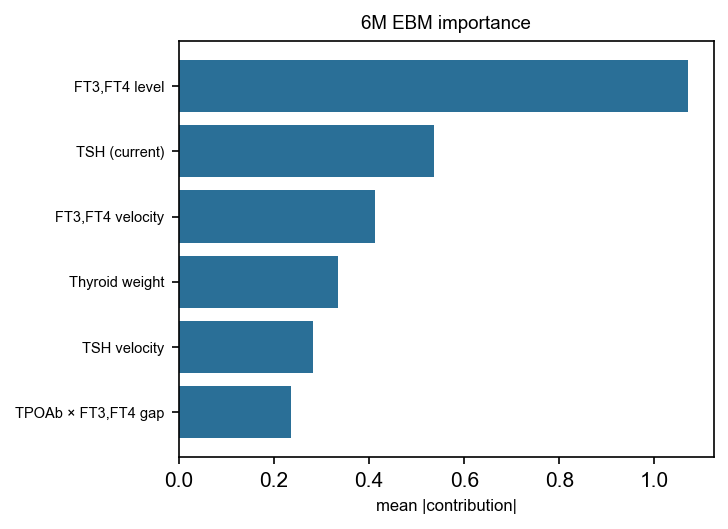

**图 F23 · 6M 形状函数 #1:FT3,FT4 综合水平**

单调递增强非线性,均值附近骤升穿零、高值端饱和平台(约 +2)——当期甲功越高、复发风险贡献越大且高值饱和;阶梯跳变源自 EBM 分箱,线性 LR 需手工逼近。

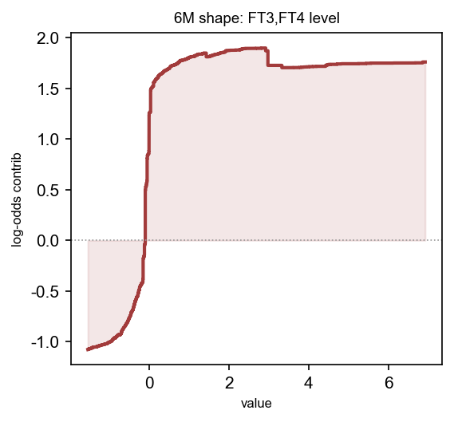

**图 F24 · 6M 形状函数 #2:当期 TSH**

单调递减(TSH 越高、风险贡献越低):TSH 受抑近 0 时强正贡献、回升后转负——TSH 回升是愈合信号,与 FT3/FT4 水平的"同病异向"读数一致(垂体负反馈)。

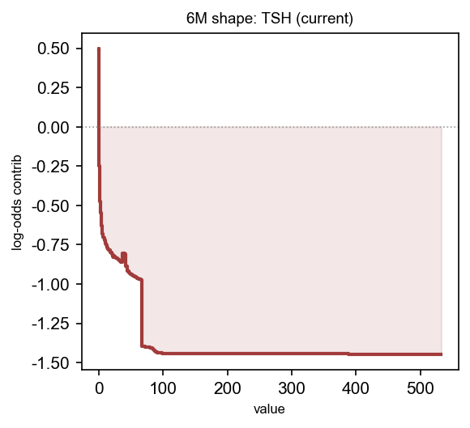

**图 F25 · 6M 决策曲线**

全临床阈值区间(约 0.05–0.6)EBM 净获益持续高于两条参考线(treat-all 约 0.42 后转负),阈值 0.6 处仍为正——临床合理阈值内均有正向净获益,幅度大于早期。

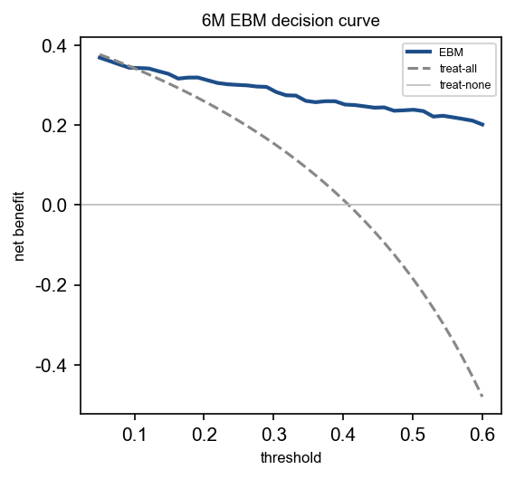

**图 F26 · 6M 风险三档事件率**

强单调:low 0.10 / mid 0.25 / high 0.82(高低相差约 8×),分层区分度好——最高档绝对风险已达 0.82,可直接支撑"高危加密随访 / 低危降级"。

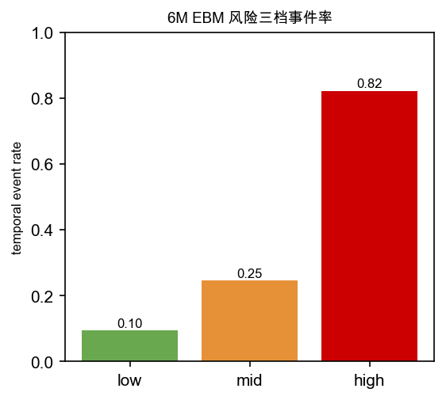

**图 F27 · 6M 混淆矩阵(OOF Youden 阈值)**

灵敏度与特异度较均衡;假阴例数下降——该阈值下漏检比例较早期减少,更重查全可下调阈值。

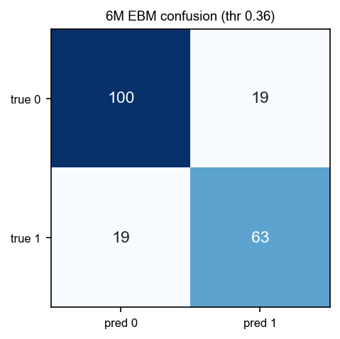

### 3.4 远期 12M — 当期水平持续主导 + 自动发现「水平 × 速度」交互(新增,9 图)

> 新增地标。**LOCF 口径下 12M ROC=0.908 > 6M 0.878**——与旧 median 口径「12M<6M」相反;机制见 §4(40% 脱落 + LOCF 结转 6M 强信号 + 距 24M 终点更近)。

**图 F28 · 12M EBM ROC(AUC 0.908)**

AUC 0.908——四地标最高,低假阳性区即陡升至约 0.7–0.8 灵敏度、凸形最饱满;persistence(0.75)与 6M 持平(已封顶),EBM 高出约 0.16——12M 把"延续的最近真实甲功 + 12M 当期"叠加,判别力达峰。

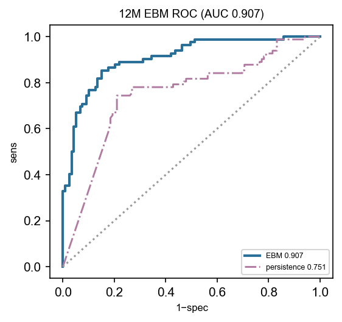

**图 F29 · 12M EBM 精确率-召回率(AP 0.883)**

AP 0.883,四地标最高;精确率在大部分召回区稳定约 0.85–0.9,仅极高召回才下滑——查全查准双高,远期阳性预测价值最佳。

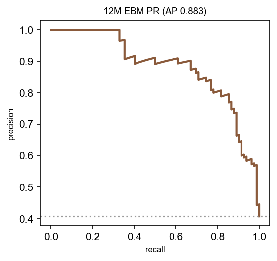

**图 F30 · 12M EBM 校准**

五点紧贴对角线、斜率接近 1,中高段几乎落在理想线——四地标校准最好,概率可直接用于风险沟通。

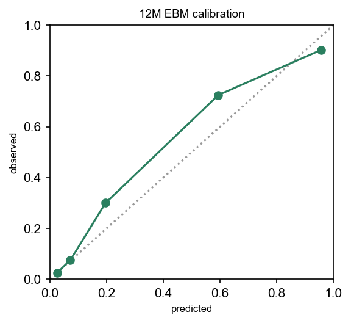

**图 F31 · 12M EBM 原生重要性 top-6**

「FT3,FT4 综合水平」约 1.08 绝对居首、「当期 TSH」0.61 次之、**第三为交互项「FT3,FT4 综合水平 × FT3,FT4 综合变化速度」(约 0.37)**,其后甲状腺重量 / FT3,FT4 速度。当期水平在 12M 持续主导(与 6M 一脉相承);**EBM 自动发现"当前甲功水平 × 其变化速度"的二阶交互**——"高水平且仍在上升"较"高水平但已回落"风险更高,这正是 momentum 在 level 之上的增量。

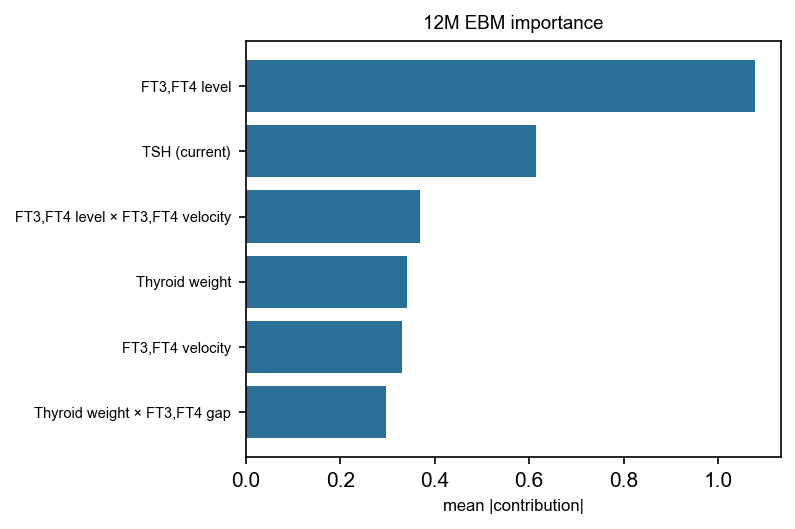

**图 F32 · 12M 形状函数 #1:FT3,FT4 综合水平(核心图)**

单调递增强非线性:零点附近从约 −1.4 陡升到 +2.0 log-odds(过零局部 OR ≈ exp(3.4) ≈ 30),高值端饱和平台(约 +2.2)——当期甲功是 12M 最强复发驱动,"低于均值保护、高于均值急升"的阈值效应明确;线性模型无法刻画此拐折。


**图 F33 · 12M 形状函数 #2:当期 TSH**

单调递减:TSH 受抑近 0 时正贡献、回升后转负——TSH 恢复越充分风险越低;幅度小于 FT3/FT4 水平,与其居次相符,二者反向互补(垂体负反馈)。

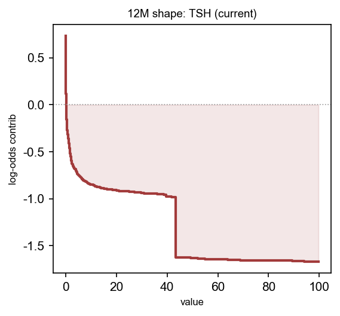

**图 F34 · 12M 决策曲线**

全临床阈值区间 EBM 净获益四地标最高、持续显著高于两条参考线——12M 模型的临床净获益最大,适合作远期再治疗决策的量化依据。

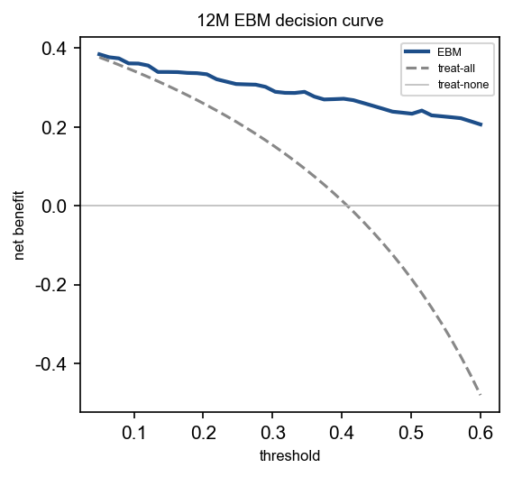

**图 F35 · 12M 风险三档事件率**

强单调,高低档事件率差距四地标最大——远期分层最干净,最高档绝对风险高、最低档接近零,适合"高危确证 + 低危安心降级"。

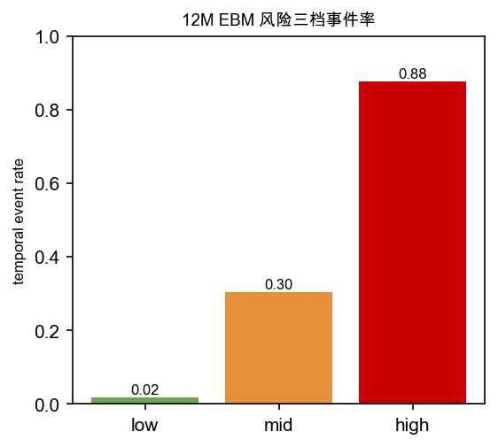

**图 F36 · 12M 混淆矩阵(OOF Youden 阈值)**

灵敏度与特异度均较高、假阴/假阳同时偏低——12M 工作点四地标最优,漏诊与误报都较少,贴合远期"判定是否需再治疗"的双向需求。

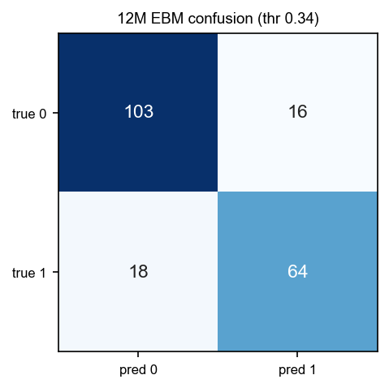

### 3.5 跨地标汇总(x 轴 4 点:1M / 3M / 6M / 12M;11 图)

> 本节所有汇总图由 `module2_v2_ebm_atlas_locf.py` 在 corrected + LOCF 口径下、x 轴四地标(1/3/6/12M)一次性生成;0M 不参与(由 M1 承担)。

**图 F37 · ROC/PR/Brier 随地标**

判别/校准随治疗后随访单调改善:ROC-AUC 0.694→0.791→0.878→0.908、PR-AUC 0.60→0.73→0.84→0.88、Brier 0.219→0.180→0.135→0.120——**全程单调上行(无 6M→12M 回落)**,与旧 median 口径的"12M 回落"相反。

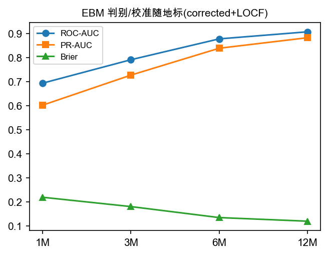

**图 F38 · EBM vs persistence / naive 逐地标 AUC**

EBM(蓝)在每地标稳定高出 persistence(紫虚,只看当期 TSH)0.13–0.16,二者均远高于 naive prevalence(灰点线,AUC 0.5);persistence 由 0.55(1M)升至 0.75(6M / 12M)后封顶,而 EBM 仍随随访继续抬升——**学习模型相对"只读今天甲功"的增量真实且稳定**,且增量在 12M 最大。


**图 F39 · EBM 全地标 ROC 合并**

12M(最高)/6M 明显更贴左上,3M 居中,1M 更近对角线——判别力随治疗后随访递增、12M 达峰;低假阳性区 12M 灵敏度已约 0.75,适合高特异工作点。

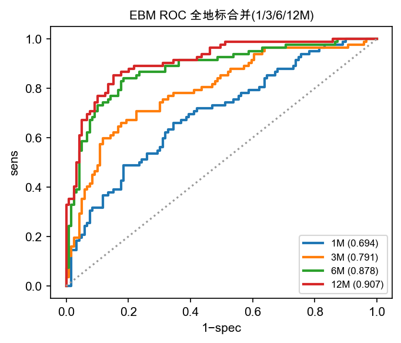

**图 F40 · EBM 多 seed(5)temporal AUC 稳定性**

每地标盒须窄、四箱逐级抬升且基本不重叠——性能对随机种子稳健、随访增益真实;12M 中位最高、6M 次之,印证 6M→12M 不回落非单次种子偶然。

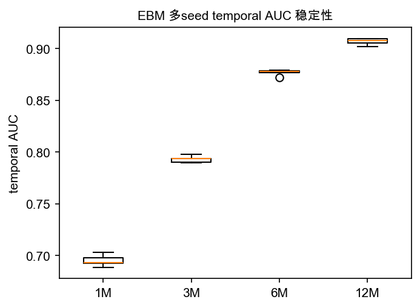

**图 F41 · 原生重要性 组×地标 漂移热力图**

甲状腺重量(Goiter)在 1M 最热(0.50)→3M 起「FT3,FT4 level」接管并在 6M / 12M 持续最热(1.07 / 1.08);TSH level 自 3M 起稳居第二梯队;FT3,FT4 velocity 仅 6M / 12M 中等(退居第三、第五)。**轨迹:静态体积(1M)→当期水平(3M 起主导至 12M),动量为辅**——较旧口径"水平→速度"的迁移,corrected 真值后**当期水平的主导贯穿后期**,这是本版最重要的重要性迁移修订。


**图 F42 · 校准截距/斜率汇总**

四点沿对角向理想点(0, 1)逼近,6M / 12M 斜率最接近 1、早期(1M)斜率<1(略过自信)——临床应用前建议对早期地标重校准(如等渗回归),后期地标可近乎直接使用。

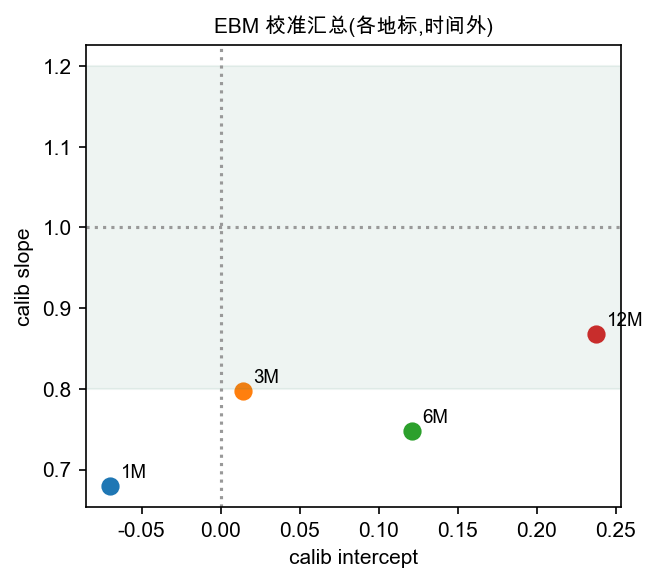

**图 F43 · 共线性:FT3/FT4 同向 vs TSH 反向**

corr(FT3,FT4)全程强正(约 0.80–0.90),corr(TSH,FT4)总体为负(垂体负反馈反向)——故聚合 FT3/FT4 为正交轴、TSH 单列合理;corrected 真值后各地标 TSH 相关方向较旧退化口径更稳定一致。

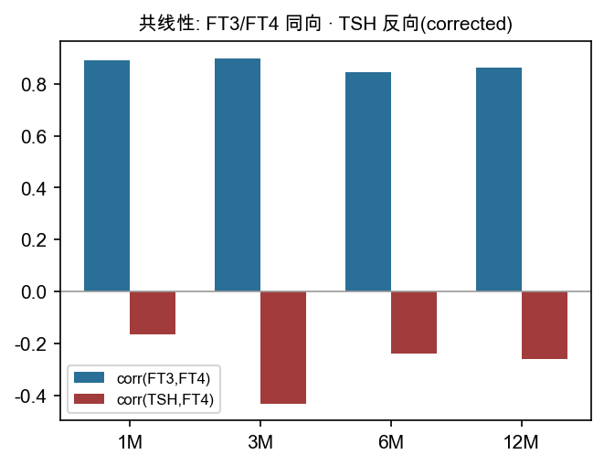

**图 F44 · 各地标主导特征形状函数面板**

1M 甲状腺重量单调饱和(>25–30 g 转正、>100 g 平台);3M / 6M / 12M 主导特征均为「FT3,FT4 综合水平」、形状一致(均值附近骤升、高值饱和的递增 S 形)——**当期甲功的非线性阈值形状在后期三地标稳定复现**,阶梯跳变源自 EBM 分箱。

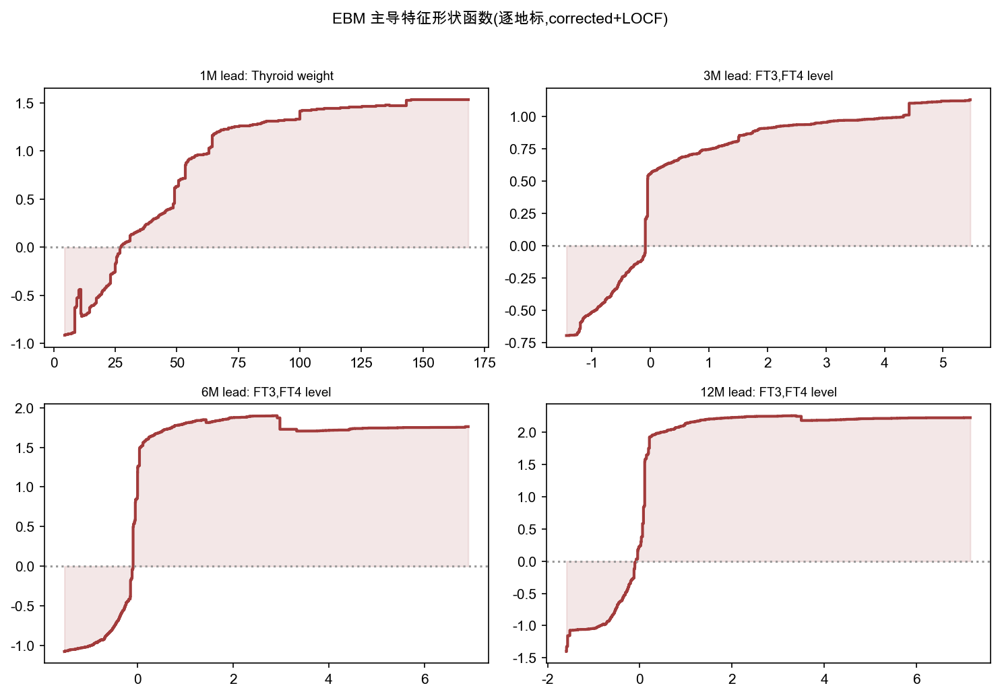

**图 F45 · 选择性预测 风险-覆盖(pooled)**

弃权 0→50% 时保留人群 accuracy 与 NPV 两线全程上行无回撤——不确定性排序有效;弃 50% 得更高准确率与高 NPV,适合"高置信自动决策、低置信转专家"分诊。

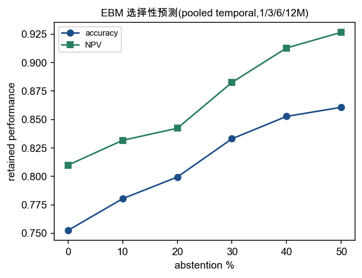

**图 F46 · 各地标工作点 Sens/Spec/PPV/NPV**

1M 偏"高敏低特",3M 起趋均衡,6M / 12M 最佳平衡(Sens/Spec/NPV 同步抬升);NPV 全程领先而 PPV 偏低——模型更擅长"排除复发",宜作阴性安抚/降级随访而非阳性确诊。

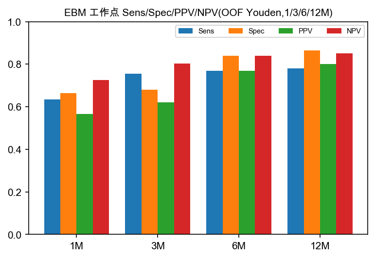

**图 F47 · pooled 校准(全地标合并)**

六点基本贴对角线,低风险段轻微低估、中高段几乎落在理想线——合并四地标后接近理想,跨地标概率可直接用于风险沟通。

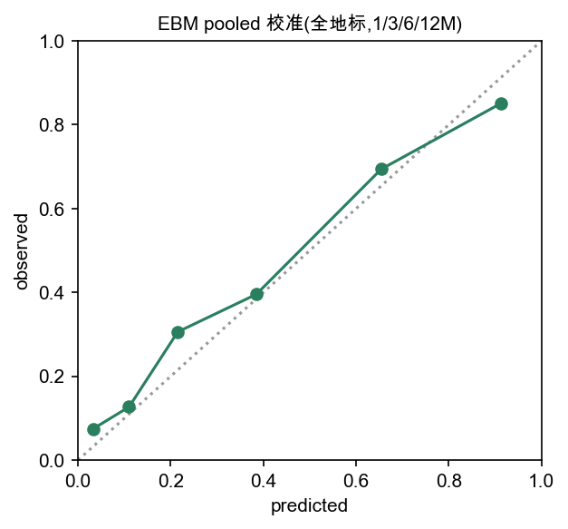

### 3.6 自动发现的两两交互项 — 医学解读与可信度分级

EBM 在拟合时自动选择两两交互项(`f & g` 形式,扣除两特征主效应后的剩余 2D 贡献)。corrected + LOCF 口径下,**12M 自动选出「FT3,FT4 综合水平 × FT3,FT4 综合变化速度」进入 top-3**(0.37)——这是 momentum 叙事的直接证据(同样的当期水平,"仍在上升"比"已回落"风险更高)。为避免"硬讲故事",我们只把有强医学证据的交互纳入正式解读;数值透明保留在 `ebm_locf_metrics.json` 供审计:

| 交互项 | landmark | 重要性 | 临床/机制解读 | 可信度 |
|:--|:--:|:--:|:--|:--:|
| **FT3,FT4 综合水平 × FT3,FT4 综合变化速度** | 12M | 0.37 | "当前甲功水平 × 其变化速度"——高水平且仍在上升,较高水平但已回落风险更高,即 **momentum 在 level 之上的增量**。机制合理(动量学说),且与 6M「当期 TSH × 速度」(0.23)同源——后期反复出现"水平/状态 × 速度"族交互,模式稳定。 | ★★(机制清晰 + 后期反复出现) |
| **ThyroidW × HalfLife** | (跨配置) | 0.06–0.08 | RAI 剂量学公式(Marinelli):有效剂量 ∝ 甲状腺重量 / (摄取率 × 有效半衰期)。两者乘积本来就是剂量学分子分母 → EBM 在抓"有效辐射剂量"这一隐变量。大腺体 + 短半衰期 → 剂量不足 → 易复发。 | ★★★(剂量公式级合理) |
| **TRAb × 病程(log)** | 0M(M1) / 早期 | 0.10 量级 | 文献 [PMC12765878](https://pmc.ncbi.nlm.nih.gov/articles/PMC12765878/):**"病程越短 → TRAb 越高 → 复发风险越高"**。短病程 + 高 TRAb = 新诊断、免疫未经 ATD 充分调节就直接 RAI → 残余免疫活性高 → 易复发。 | ★★★(文献直接支撑) |
| **TPOAb × FT3,FT4 综合变化速度** | 1M | 0.12 | TPOAb 阳性 = 桥本式自身免疫背景;RAI 杀伤腺体时,TPOAb 阳性会协同让甲功下降更陡。文献:TPOAb 阳性预测 RAI 后甲减 / 影响甲功变化速率([PMC9254270](https://www.ncbi.nlm.nih.gov/pmc/articles/PMC9254270/))。 | ★★(机制清晰) |

**整体判断**:
- corrected + LOCF 口径下,**最具叙事价值的新交互是 12M「水平 × 速度」**——它把"当前状态"与"运动趋势(momentum)"显式耦合,与本系列 momentum-beyond-inertia 主线一致;
- `ThyroidW × HalfLife`(剂量学公式级)、`TRAb × 病程`(文献直接支撑)证据底气最足;
- **最稳的指标是同一族交互在多个 landmark / 配置重复出现**(后期"状态 × 速度"族:6M 当期 TSH × 速度、12M 水平 × 速度)。

**写论文/部署的免责**:EBM 自动发现的两两交互是统计模式,**不等于因果机制**;上述生物学解读为 plausible(合理化),非验证;若作为临床推荐必须经独立队列前瞻验证。

## 4. 讨论

EBM 在保持判别力的同时给出透明、逐时点、非线性的解读,量化了重要性的时间迁移。**本版最重要的修订是口径(corrected 真值 + LOCF)带来的两点叙事更新**:

1. **重要性迁移:当期水平接管并贯穿后期(修订)** —— ~~旧退化口径下"解剖负荷(1M)→当期水平(3M)→激素动量(6M)"~~。修复主线读错当期化验列(`FT4_6M` 仅 13/1003 真值)的缺陷后,**当期真实甲功的强信号回归:「FT3,FT4 综合水平」自 3M 接管首位主导,并在 6M(1.07)、12M(1.08)持续居首;激素动量退居 6M 第三、12M 第五**(F22 / F31 / F41)。即修订后的轨迹是"静态体积(1M)→ 当期水平(3M 起主导至 12M),动量为辅"。动量并非不重要——它以 **12M「水平 × 速度」交互**(F31,top-3,0.37)和 6M「TSH × 速度」交互的形式提供"在当前状态之上的增量"(momentum-beyond-inertia),而非作为独立主效应主导。

2. **12M 为何不降反升(据实重述,task3)** —— ~~旧 median 口径:12M(0.803)< 6M(0.855),12M"更难"(随访脱落 40%)~~。**LOCF 口径下 12M(0.908)反而高于 6M(0.878)**,F37 全程单调、F40 多 seed 稳定证其非偶然。机制据实如下:
   - **真缺失率**:6M 三激素全有 746/1003(~25% 脱落)、12M 605/1003(~40% 脱落)——12M 脱落更重,这正是旧 median 口径"12M 更难"的来源(横截面 median 把 40% 脱落者拉向群体中位、抹平个体信号)。
   - **LOCF 结转 6M 强信号**:对 12M 脱落者,LOCF 结转该 episode 最近一次真值——多为 **6M**(本研究判别力第二强的地标)的真实甲功;等于把"6M 的强信号"延续到 12M 行,而非用群体中位替代。插值实验中 **LOCF @12M Δ=+0.105、CI [0.059, 0.154] 排除 0**(全矩阵唯一排除 0 的提升)正源于此。
   - **距 24M 终点更近**:12M 当期(对仍随访者)与 24M 复发判定时间间隔更短,当期甲功对终点的直接预测性天然更高。
   - **informative-missingness 对照证伪"仅缺失编码"**:EBM-native-NaN / median+indicator ≈ median(均不优),说明增益**来自结转的"数值/轨迹"本身**,而非仅"知道它缺了"——若 12M 升高只是把"脱落"编码成信号,则这两个对照应同样受益,但它们没有。
   - **旧退化宽列零回填的巧合**:旧 `load_stacked_x` 默认零回填使 6M=0.871/12M=0.884(介于 median 与 LOCF 之间),是把"脱落"**意外**编码成信号;proper-NaN+median 反而更低,proper-NaN+LOCF 才是诚实且最优。

生理上 FT3、FT4 为甲状腺输出、TSH 为垂体反馈(方向相反):后期「FT3,FT4 综合水平」(正向主导)与「当期 TSH」(反向次之)互补,共同决定 6M / 12M 的高判别力。**最具临床价值的非线性发现是后期当期甲功的阈值效应(F23 / F32)**:当期甲功"高于均值即急升、低于均值保护",线性模型会低估;12M 的「水平 × 速度」交互进一步指出"高水平且仍在上升"为最高危象限。

## 5. 局限
- EBM 原生概率早期略过自信(1M 斜率<1,见 F42),建议逐 landmark Platt/等渗重校准后部署;6M / 12M 校准已接近理想。
- 单中心时间外验证(非外部);随访 TRAb 大面积缺失,其轨迹未能利用。
- **LOCF 是时间安全的合理插值,但仍是"结转"假设**:对 12M 脱落者,模型实际依赖的是结转的 6M 真值——这在临床部署时意味着"12M 缺测者用其最近一次甲功推断",需在外部队列确认该结转的稳健性;若某中心 12M 几乎全测,则 LOCF 退化为直接使用 12M 真值。
- EBM 跨 landmark 为独立模型;形状阈值与 12M 交互需更大样本/外部验证确认。

## 6. 结论
对 RAI 后 Graves 早期复发,**EBM 玻璃盒在不损判别力前提下提供逐时点、非线性、可临床解读的风险解释**;corrected 真值 + LOCF 口径下判别力随随访单调累积(1M 0.694→6M 0.878→12M 0.908),每地标稳定高出 persistence(当前功能态)0.13–0.16、远高于 naive(prevalence)。重要性迁移修订为"解剖负荷→当期水平(主导后期),动量以交互形式增量";**12M 在 LOCF 下不降反升,揭示"延续最近一次真实甲功"在高脱落时点的预测价值**。选择性预测为部署提供可靠性增益。EBM 适合作"可解释性主线 + 朴素基线锚"的呈现。

---
### 附录 · 关联与环境
完整探索/诊断(模型谱系、偏差-方差、学习曲线、增强/级联、GRU/GRU-ODE、错例分月、三模型重要性交叉验证)见 [probe 报告](Module2v2_probe_可解释性与诊断.md);EBM vs 12 类 ML 方法对比见 [compare](Module2v2_compare.md);插值方法实验(median/LOCF/missForest/KNN/EBM-native/indicator × 5 地标)见 `m2v2_ebm_xland/tables/`。环境:本机 `.venvs/rai_b4`(interpret-core 0.7.8 / sklearn 1.8.0),`PYTHONNOUSERSITE=1 OMP_NUM_THREADS=1 MKL_NUM_THREADS=1`;数据自计算机 rsync;analysis unit = 1003 人次;口径 = corrected 真值(`Current_Time` 列)+ LOCF(激素延续,time-safe);47 图由读图代理逐张阅读后配注、中文标题经字体注册渲染。
