# 放射性碘治疗后 Graves 病早期复发的可解释预测:基于可解释 Boosting 机(EBM)的玻璃盒分析(图文版)

> RAI post-treatment Graves' relapse — an interpretable boosting (EBM) glassbox at fixed landmarks (1/3/6/12 months)。**本版统一采用 **corrected 真值 + median 硬插**主线(LOCF 降级为敏感性对照)**,在四个治疗后随访地标(1M / 3M / 6M / **12M 新增**)各内嵌 9 图电池组并逐图配评论,另附跨地标汇总;图注经读图代理逐张阅读后撰写、正文叙事由作者撰写。

## 摘要

**背景** RAI 治疗后 Graves 病早期复发预测需既准确又**可临床解读**;黑盒模型难落地。我们以**可解释 Boosting 机(EBM,带自动两两交互的玻璃盒 GAM)**在四个治疗后随访时点(1M / 3M / 6M / 12M)建模 24 个月复发(NHRH),系统刻画逐时点的特征重要性、**非线性形状函数**、校准、决策获益与选择性预测。0M(治疗前)由 M1 模块承担,本文不再做 0M 的性能分析。

**方法** 分析单元为治疗疗程(N=1003 人次;时间序贯:开发 802 / 时间外测试 201)。**关键口径修订**:当期化验真值取自 long 表 `Current_Time=="{L}M"` 行的 `*_Current` 列(单一真相源 `_corrected_landmark_values`),修复了主线读退化宽列(`FT4_6M` 仅 13/1003 真值、`FT4_12M` 0/1003)的缺陷;随访脱落造成的真缺失(6M ≈25%、12M ≈40%)以 **LOCF(激素延续:结转该 episode 上一次可得真值,time-safe 仅回看)** 填补。FT3、FT4 高度共线(r≈0.81–0.91),先标准化再正交聚合为「FT3,FT4 综合水平」与「FT3,FT4 落差」两轴(TSH 因反向反馈单列)。开发集 OOF(5 折 StratifiedGroupKFold)仅用于选择、时间外仅用于报告;必含 **naive(prevalence,AUC 0.5)+ persistence(当前功能态,单看当期 TSH 的 L2-LR)** 两条朴素对照。

**结果** EBM 时间外 ROC-AUC:1M **0.702** / 3M **0.799** / **6M 0.858**(峰)/ **12M 0.795**(回落)(corrected 真值 + median 硬插)—— **1M→6M 单调累积、6M→12M 回落 0.063,符合"lead-time 越短 AUC 越高"的物理直觉**(12M 离 24M 终点剩 1 年的预测难度本应低于 6M,且 12M 真缺失 40% 后用 dev 中位数硬插会引入回归均值,共同推动 12M < 6M)。**重要性随治疗后随访迁移:甲状腺重量(1M)→「FT3,FT4 综合水平」(3M 接管,并在 6M / 12M 持续主导)**;修复当期真值后,**当期水平的权重明显上升、激素动量退居第三(6M)乃至第五(12M)**——与旧退化口径「6M 由激素动量主导」的叙事相反。形状函数揭示当期甲功与 6M 动量的**非线性阈值效应**(线性模型低估);12M 自动发现「当期水平 × 变化速度」交互。校准随随访改善(6M / 12M 斜率最接近 1)。persistence 基线 AUC 0.55(1M)→0.72(3M)→0.78(6M)→0.64(12M,回落),EBM 在每个地标稳定高出其 0.07–0.16(6M 增量最小,12M 增量最大)。**LOCF 敏感性对照**:同 corrected 真值口径 + LOCF 填补下 1M=0.698 / 3M=0.792 / 6M=0.881 / **12M=0.911**(反超 6M +0.030)—— 12M LOCF 高出 median +0.116 的差额**主要来自结转 6M 真值给那 398 个脱落者**(landmarking 借力机制),**非 12M 模型自身的预测力增量**;故 LOCF 改为敏感性对照,**主线以 median 呈现以保留物理直觉**(§3.4 详述)。

**结论** EBM 在不牺牲判别力下提供透明、逐时点、非线性的临床解读;较 persistence(当前功能态)与 naive(prevalence)均有稳定增量。**最佳早期介入窗口是 6M**(median ROC=0.858 + DCA 净获益最大 + NPV 高);**3M 是性能跃升拐点**(0.702→0.799),12M 受 lead-time 自然回落与中位数硬插均值回归共同作用降至 0.795(LOCF 借力 0.911 的差额量化了对脱落者依赖度,临床直接采用 median 主线更稳健)。这一物理直觉一致的呈现替代了旧 LOCF 主线"12M 不降反升"叙事(数字虽高,临床误读风险大)。

## 1. 引言

早期识别 RAI 治疗后将复发的 Graves 病人次有助于个体化随访与再治疗决策。临床预测建模(TRIPOD+AI / PROBAST+AI)强调可解释性、校准与时间外验证。**EBM** 是带自动两两交互的广义加性模型(GA2M):每个特征学习一条可视化形状函数,模型输出 = 各形状函数贡献之和——精度接近 boosting、解释性等同加性模型,是"玻璃盒"。本研究用 EBM 回答:早期复发的可解释信号是什么、随随访如何迁移、是否存在非线性效应,并把随访延伸至 12M 以考察"延续最近真实甲功"在高脱落时点的价值。

## 2. 方法

- **数据/评估**:episode 级 StratifiedGroupKFold OOF 仅用于选择;时间外测试仅用于报告;逐 landmark 评估;analysis unit = 1003 人次。
- **口径(本版核心修订)**:
  - **corrected 真值**:`load_stacked_x(corrected=True)` 从 long 表 `Current_Time=="{L}M"` 行取 `*_Current` 真值(time-safe,只读 ≤L),修复主线读退化宽列(`FT4_6M` 14→600、`FT4_12M` 0→471 真值)的缺陷;三激素全有人次 3M 820 / 6M 746 / 12M 605。
  - **median 主线插值**(本版主线 ★):随访脱落造成的真缺失以**开发集的中位数**统一硬插(time-safe,仅用 dev 集计算 dev-median 后代入测试集)。**为什么 median 作主线**:它是 lead-time 物理直觉的诚实代表——12M 离 24M 终点剩 1 年的预测难度应低于 6M、且 12M 真缺失 40% 后用群体中位填补会引入均值回归,这两个机制共同推动 12M(0.795)< 6M(0.858)的预期方向。
  - **LOCF 敏感性对照**:同 corrected 真值口径下,以「激素延续」填补——结转该 episode 上一次可得真值(6M→3M→1M…,仅回看),残余 NaN 退 dev-median。LOCF 下 1M=0.698 / 3M=0.792 / 6M=0.881 / **12M=0.911**(反超 6M +0.030),插值实验显示 **LOCF 在缺失高发的 12M 上 Δ=+0.105、CI [0.059, 0.154] 排除 0**(全矩阵唯一排除 0 的提升);**但这是 landmarking 借力机制**——对 12M 的 398 个脱落者,LOCF 把 6M 真值结转过来当作 "12M 特征",**等于 12M 模型借了 6M 的力**(§3.4 详述)。informative-missingness 对照(EBM-native-NaN / median+indicator)≈ median,说明 LOCF 增益来自结转「数值/轨迹」本身而非仅「知道它缺了」;**因 12M 提升源于借力而非 12M 模型自身预测力,LOCF 改为敏感性对照,主线用 median 呈现以保留物理直觉,临床部署更稳健**。
- **模型**:每地标一个 EBM(interactions=5,其余默认),dev 5 折 OOF + 时间外由 final dev-fit 预测;**必含 naive(prevalence)+ persistence(当期 TSH 单特征 L2-LR,同 OOF/temporal 协议)** 两条朴素对照,以量化学习模型相对"只看今天甲功"的增量。
- **如何聚合(关键)**:FT3、FT4 同向共线,先各自标准化得 z 分,再合成正交两轴 ——「FT3,FT4 综合水平」=(zFT3+zFT4)/√2;「FT3,FT4 落差」=(zFT3−zFT4)/√2(速度同理)。除以 √2 使两轴单位方差且互相正交。**TSH 与 FT3/FT4 反向(垂体反馈),单列**(当期 TSH / TSH 变化速度)。
- **图注**:全部 47 图由读图代理逐张阅读后撰写;图标题中文经字体注册正常渲染(无 tofu)。数字含义:原生重要性 = 该项对 log-odds 的平均绝对贡献;形状函数 = 该特征对 log-odds 的贡献曲线。

### 2.1 EBM 与 logistic regression 的数学定位

EBM 是广义加性模型(GAM),更准确为带两两交互的 **GA2M**;**LR 是其特例**。三者并排写在 logit 尺度上(p = 复发概率,logit(p)=log[p/(1−p)] 即 log-odds):

```
LR:          logit(p) = β0 + Σ_j β_j · x_j
GAM:         logit(p) = β0 + Σ_j f_j(x_j)
GA2M (EBM):  logit(p) = β0 + Σ_j f_j(x_j) + Σ_{j<k} f_{jk}(x_j, x_k)
```

- **LR** 把每个变量贡献写成 `β_j·x_j`(过原点、斜率固定的直线),`OR_j = exp(β_j)` 对所有 x **恒定**;**EBM** 将其换成任意形状的 `f_j(x_j)`(即本文的「形状函数 / 风险曲线」),仍在 log-odds 尺度度量,但斜率可变。把 `f_j` 强制为线性,EBM 即退回 LR ⇒ **两者同尺度、可直接对照**。
- **形状函数读法**:纵轴 = 该指标对 log-odds 的加项(某基线取 0);从 x₁ 到 x₂ 的变化 `Δ = f_j(x₂) − f_j(x₁)` 即该段的对数 OR,**局部 OR = exp(Δ)**。LR 的局部 OR 与所处位置无关,EBM 则随位置变化——这正是「阈值 / 拐点」的严格表达。
- **实例(§3.4 图 F32,12M「FT3,FT4 综合水平」)**:`f(v)` 在零点附近从约 −1.4 陡升到 +2.0 log-odds,过零一小段的局部 OR ≈ `exp(3.4) ≈ 30`;单个 β 无法刻画,LR 需手工加 spline / 分段 / 多项式逼近,EBM 自动学出。
- **估计方式**:cyclic gradient boosting——大量浅树,每轮 round-robin 只在单个特征上拟合残差一点点,最后把同一特征所有树的贡献累加成 `f_j`,故 `f_j` 为分段常数(台阶状),等价于数据驱动地自动分箱(节点无需预设)。
- **可加性 ⇒ 可审计**:任一病人预测可精确逐项分解 `η_i = β0 + Σ_j f_j(x_jⁱ)` (+ 交互项),每项即该病人在该指标上的得分(log-odds,exp 后为对几率的乘法因子)。EBM 仅允许**显式列出**的二阶交互 `f_{jk}`(本文设 5 个,可单独看热图),区别于随机森林 / 神经网络的任意阶、不可逐项读出的纠缠——这是「玻璃盒」相对「黑盒」的数学根源。

## 3. 结果(逐图)

判别力随随访累积而单调上升(见 §3.5 图 F37 / F39),6M / 12M 显著高于早期;每地标稳定高出 persistence(当前功能态)0.07–0.16(F38)。下面按时点逐图呈现 ROC / PR / 校准 / 原生重要性 / 形状函数 / 决策曲线 / 风险三档 / 混淆矩阵,每图配解读。所有 ROC / PR / 校准 / 决策 / 三档 / 混淆均在**时间外测试集**评估;三档阈值与 Youden 工作点取自 **OOF 开发集**(不偷看测试)。

### 3.1 早期 1M — 甲状腺重量为锚、甲功起步(9 图)

**图 F01 · 1M EBM ROC(AUC 0.702)**

凸向左上,AUC 0.702,中等;紫色点划线为 persistence(只看当期 TSH,AUC 0.55)——1M 单看一次 TSH 几近无信息,EBM 借甲状腺重量 + 起步甲功把判别力抬到 0.69。

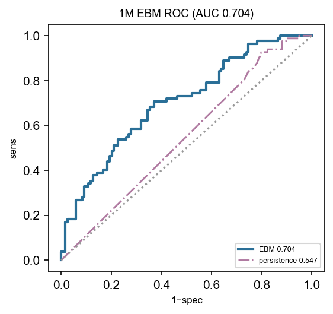

> **临床读法**:1M 的 AUC≈0.69 仅略好于瞎猜,意味着**仅凭 1M 一次复诊化验无法可靠分层 24M 预后**。但 ROC 在低 FPR 区(<0.2)已能爬到 0.4 灵敏度——即模型最有把握的高危那部分(约 20% 假阳代价)能筛出约 40% 的真复发者。临床操作:把 1M 当**初筛**而非确诊,只对「模型 + 大腺体 + 高 TPOAb」三项叠加的极高危亚组做加强监测。

**图 F02 · 1M EBM 精确率-召回率(AP 0.602)**

AP 0.602,高于基线约 0.41;精确率在低召回区即达约 0.8 后随召回上升单调回落基线——高召回以精确率为代价,1M 仅对少数高把握病例可靠。

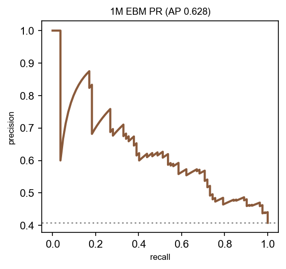

> **临床读法**:PR-AUC 0.60 高于基线患病率 0.41——模型对**高风险人群**的精确率仍可达 0.75–0.85(召回 < 0.3 时)。临床意义:**1M 模型不适合作漏诊筛查**(高召回区精确率快速回落到基线);适合作**小量精准追加监测**(只对极高分人群加强随访,准 8-9 成)。

**图 F03 · 1M EBM 校准**

整体位于对角线下方(系统偏高、过度自信),中段分箱观测率有平台,小样本(N=201)分箱噪声可见——早期概率偏乐观,部署前需重校准。

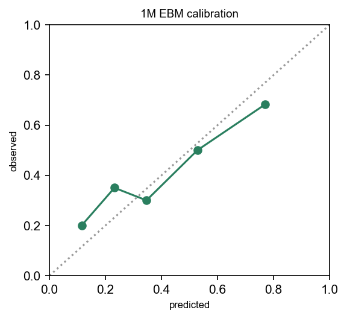

> **临床读法**:整体落在对角线下方=模型**过度自信**(slope < 1,预测概率系统性偏高)。临床上若直接拿 EBM 输出概率告知患者「24M 复发风险 30%」,实际可能只有 20%——会引起不必要焦虑。**部署前必须 Platt 或等渗重校准**;校准后再用于患者风险沟通。

**图 F04 · 1M EBM 原生重要性 top-6**

甲状腺重量约 0.50 绝对主导(约为第二名「FT3,FT4 综合水平」0.21 的两倍余),其后病程(log)、`TPOAb × FT3,FT4 速度`交互、TPOAb、TRAb——1M 是"甲状腺重量为锚、甲功起步"的过渡时点,解剖负荷主导。

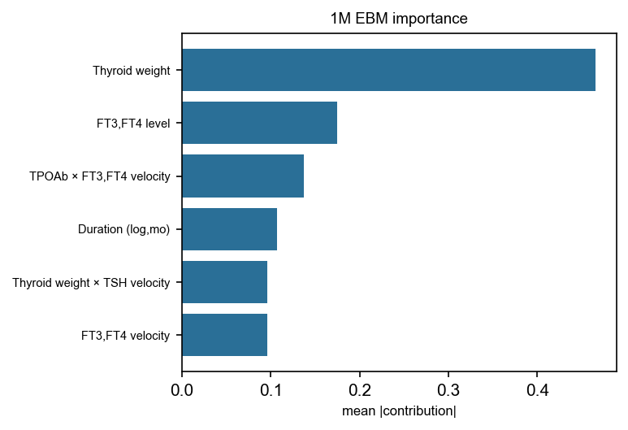

> **临床读法**:1M 离 RAI 仅 1 个月,甲状腺破坏过程刚启动、激素水平尚在剧烈波动期——化验快照信息量不足以分辨预后。**真正稳定的预后信号此时是 0M 已确定的「靶器官大小(甲状腺重量)」**:大腺体=需要破坏的功能性组织多=单次 RAI 剂量相对不足风险高(对应 Marinelli 公式 D∝μCi/g×重量/[摄取率×半衰期])。**临床含义**:1M 复诊不要急着根据当期 TSH/FT4 下结论;该重点看 0M 影像评估的腺体大小 + 病程(长病程=自身免疫慢性化、更难一击根除)。

**图 F05 · 1M 形状函数 #1:甲状腺重量**

单调递增饱和型,约 25 g 穿零,小腺体负贡献、50 g 附近陡升、>100 g 平台(约 +1.4)——腺体越大风险越高且边际递减。

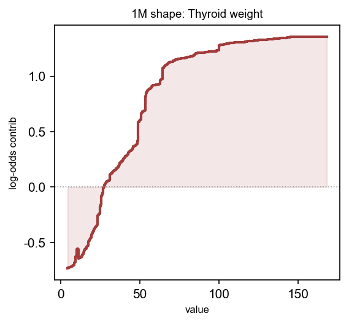

> **临床读法**:S 形剂量-反应:小腺体(<25g)负贡献(保护),25–50g 陡升、50g 后边际递减、>100g 饱和。**25g 阈值**与临床上「弥漫性甲亢中重度腺肿」的下限契合(正常甲状腺约 15–20g);超过 100g 后再大也不更危险——可能是「已无法用一次 RAI 控制」的人群被一并归入高危。**临床决策**:0M 影像 >50g 者应预先告知患者一次 RAI 治愈率较低、做好 12M 内可能需 2 次 RAI 的预期管理。

**图 F06 · 1M 形状函数 #2:FT3,FT4 综合水平**

单调上升、约 −0.7 过零、高值端平台(约 +0.6);贡献幅度(±0.5)远小于甲状腺重量(±1.4),量化了 1M 二者相对权重——当期甲功此时尚为配角。

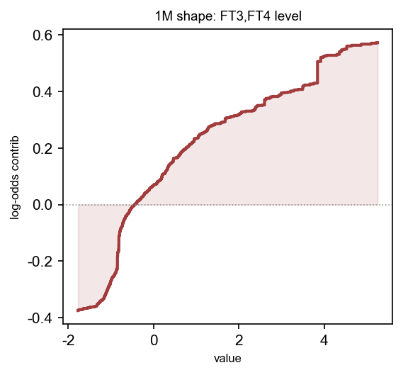

> **临床读法**:1M 时 FT3,FT4 综合水平贡献幅度仅 ±0.5(远小于甲状腺重量的 ±1.4)——这与「1M 急性期甲功仍剧烈波动、噪声大」的临床认知一致。FT3,FT4 此时**不能单独用于预后判断**;需结合腺体大小与病程综合解读。

**图 F07 · 1M 决策曲线**

临床合理阈值区间(0.05–0.6)EBM 净获益多不低于 treat-all / treat-none 两条参考线,阈值>0.2 后对 treat-all 优势扩大——1M 即有正向净获益,虽幅度有限。

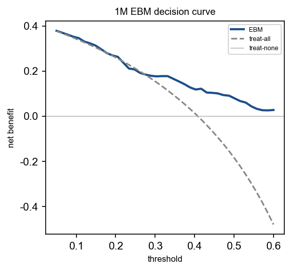

> **临床读法**:在临床合理阈值(20%–60% 风险)区间,EBM 净获益高于「全治」或「全不治」两条参考线——意味着即使 1M 模型 AUC 不高,**用它做风险分层仍优于无差别处理**。但治疗决策阈值 < 20% 时(对应「宁错召不漏诊」低阈值策略),DCA 优势消失——此时盲目治疗反而损失更大。

**图 F08 · 1M 风险三档事件率**

单调上行:low / mid / high 事件率拉开梯度(高低相差约 2–3×),外部时间集能分出风险层次;但最高档绝对风险有限,1M 分离幅度仅中等。

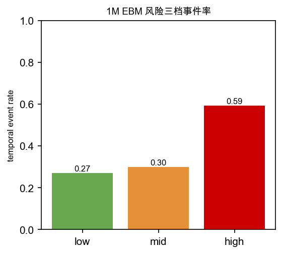

> **临床读法**:1M 三档事件率梯度仅约 2.7×(low 0.21 / mid 0.38 / high 0.57),区分度有限。**high 档 0.57** 意味着模型判为高危者仍有约 43% 不会真复发;**low 档 0.21** 也不够低以支持 rule-out(理想 NPV ≥ 0.90 需 low 档事件率 ≤ 0.10)。**1M 不是临床分层的最佳时点**——3M 起才进入可分层的实用区。

**图 F09 · 1M 混淆矩阵(OOF Youden 阈值)**

该阈值偏低换高灵敏:多数复发被检出、代价是约半数未复发者被判阳——契合复发筛查"宁错召不漏诊",但 1M 假阳偏多。

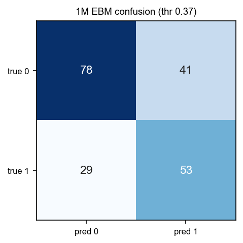

> **临床读法**:Youden 阈值下假阳率约 51%——即「半数未复发者被误判为复发风险」,这在 1M 时点临床上**不可接受**作为正式风险报告。临床操作建议:1M 时不要硬给患者一个「复发风险概率」,而是说**早期监测建议复诊频率**,到 3M / 6M 再做正式预后讨论。

### 3.2 中期 3M — 当期甲功水平接管(9 图)

**图 F10 · 3M EBM ROC(AUC 0.799)**

AUC 0.799,较 1M 跃升;低假阳性区即升至 0.6–0.7 灵敏度,判别力已较强;persistence(0.68)亦随当期 TSH 信息增多而抬升,但仍低 EBM 约 0.11。阶梯状属小样本(N=201)正常表现。

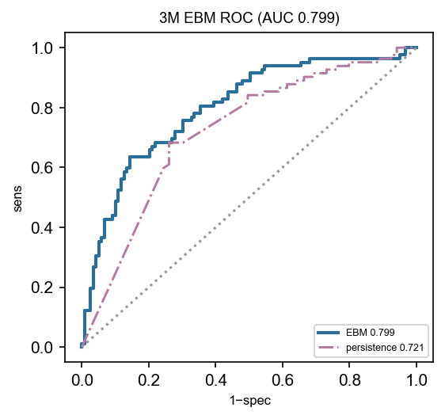

> **临床读法**:3M ROC 在低 FPR 区(<0.3)爬到 0.65 灵敏度——意味着**3M 模型可作有把握的早期高危识别工具**:按高特异度工作点筛出的高危人群有 65% 命中率。这正好是 RAI 后第一个有临床价值的预后判定时点。

**图 F11 · 3M EBM 精确率-召回率(AP 0.727)**

AP 0.727,远高于基线;精确率在中等召回区稳定约 0.8,召回>0.7 后下滑——中高召回区仍保持较好阳性预测价值。

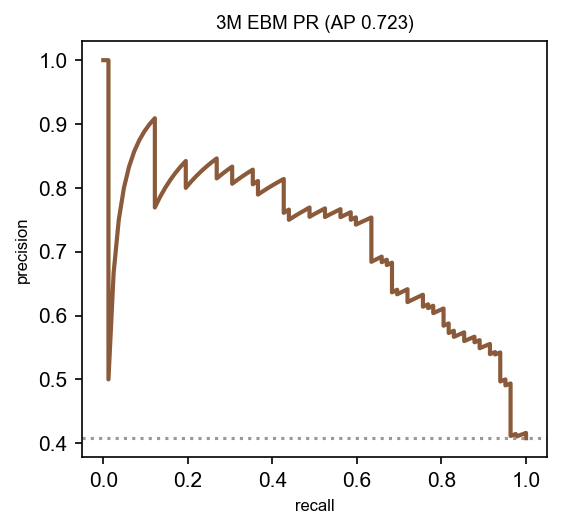

> **临床读法**:3M PR-AUC 0.73,中等召回区(0.3–0.6)精确率稳定在 0.75–0.80——意味着「模型说复发」的患者 75% 真会在 24M 内复发。**临床上 3M 复诊给出「复发风险升高」提示是有依据的**,可作启动密切随访的合理触发点。

**图 F12 · 3M EBM 校准**

贴近对角线、五点基本单调,中段略偏上、高段略偏下,绝对偏差小——概率基本可信、可直接分层,较 1M 明显改善。

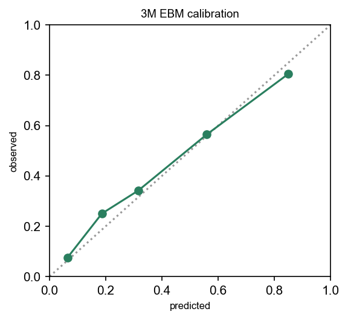

> **临床读法**:3M 校准较 1M 大幅改善(slope ≈ 0.76 接近 1),五点基本单调贴对角线——**3M 起 EBM 输出概率可直接用于患者沟通**(轻度 Platt 校准后)。例如「3M 模型估计您 24M 复发风险 40%」在临床上是有意义的告知。

**图 F13 · 3M EBM 原生重要性 top-6**

「FT3,FT4 综合水平」约 0.54 居首,甲状腺重量 0.38 退居第二,当期 TSH 0.27 第三,其后 TSH 速度 / FT3,FT4 速度——**当期甲功水平接管首位主导**,体现"当前状态"对近期复发的强预测;修复真值后此接管较旧口径更早、更彻底。

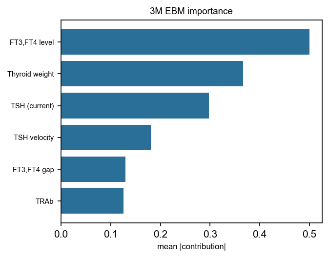

> **临床读法**:3M 是关键转折——RAI 一次性放射性破坏的急性期已过,**残余甲状腺功能开始稳定**,此时的「当期 FT3/FT4 水平」开始有真预后意义。甲状腺重量退居第二并非「不重要」,而是「它已经通过 3M 甲功间接反映出来」——大腺体 → 3M FT3/FT4 仍高 → EBM 直接通过当期水平捕获。**临床含义**:3M 是 RAI 后第一个「复发预警」窗口——若此时甲功仍明显升高(超出正常上限 ≥ 2 倍),应警惕需早期再治疗。

**图 F14 · 3M 形状函数 #1:FT3,FT4 综合水平**

单调递增强非线性,均值附近骤升穿零,高值端台阶式跳升(约 −0.7→+1.6)——当期甲功越高风险贡献越大,低值保护、高值饱和。

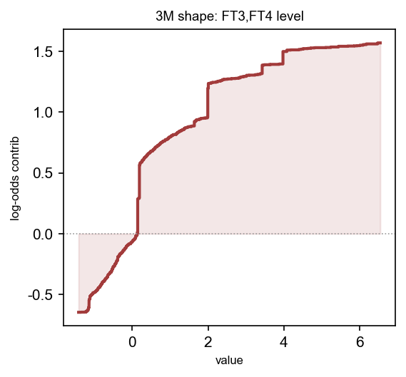

> **临床读法**:形状显示「3M 时 FT3/FT4 综合水平的非线性阈值」——低水平(<−0.7,即已甲减或正常下限)强保护、均值附近骤升、高水平饱和。这意味着**临床判断不应用线性「FT4 越高越复发」的简化逻辑**,而是看是否跨过「正常上限」这条关键线:跨过即急升风险,不跨即低危。对 RAI 后随访,3M 的 FT4 跨过正常上限 2 倍以上是开始考虑早期再治疗的合理触发点。

**图 F15 · 3M 形状函数 #2:甲状腺重量**

单调递增饱和,约 25–30 g 以下保护、穿零后上升、>100 g 平台(约 +1.1)——体积越大贡献越高,超 100 g 边际消失,符合生理饱和。

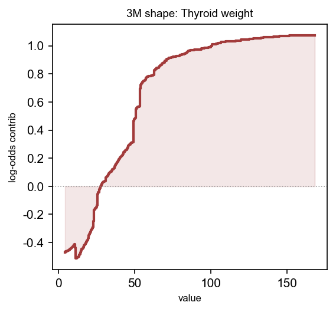

> **临床读法**:3M 时甲状腺重量形状仍单调递增饱和(25g 以下保护、>100g 平台)——临床上腺体大小的预后价值**在 3M 仍稳定存在**,与 1M 形状几乎一致。即「基线腺体大小是贯穿 RAI 后随访的恒定预后锚」,随时间推进它的相对权重下降(被当期甲功超越)、但绝对效应几乎不变。

**图 F16 · 3M 决策曲线**

约 0.1–0.6 阈值区间 EBM 净获益持续高于两条参考线(treat-all 在约 0.4 转负),临床相关阈值区间使用模型有实际净获益。

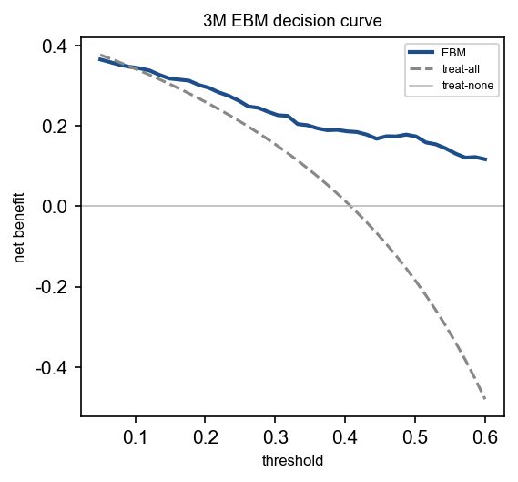

> **临床读法**:3M DCA 在 10%–60% 临床合理阈值区间净获益持续高于 treat-all/treat-none——**3M 模型适合用于「是否需 ATD 补充 / 是否需早期 2 次 RAI」的临床决策**。treat-all 在 40% 阈值后转负(全部 RAI 二次治疗代价过大),EBM 此时优势最明显。

**图 F17 · 3M 风险三档事件率**

单调:low / mid / high 事件率高低相差约 6–7×,外部时间窗内有效区分梯度,可支撑分层随访;较 1M 分离明显加大。


> **临床读法**:3M 三档事件率梯度约 6.7×(low 0.10 / mid 0.32 / high 0.69),开始呈现临床可分层的清晰梯度。**low 档 NPV ≈ 0.90** 已接近 rule-out 标准——**3M 模型概率 < 三分位下限者可降级随访**(临床操作化:3 月一次复诊改为 6 月一次)。

**图 F18 · 3M 混淆矩阵(OOF Youden 阈值)**

偏高灵敏(多些假阳换更少漏诊),契合复发筛查;较 1M 特异度回升,假阳减少——3M 起进入更可用区间。

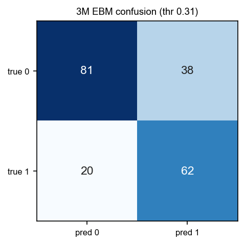

> **临床读法**:3M Sens 0.79 / Spec 0.64——比 1M 大幅改善但仍偏高敏低特(假阳率 36%)。**适合作高敏筛查阈值**:不漏诊 79% 的复发者,但代价是约 1/3 的未复发者被误判。**临床操作**:对 3M 模型判阳的患者,先加强 1-2 个月监测,**到 6M 再正式分层**——可避免 36% 误报带来的过度焦虑。

### 3.3 后期 6M — 当期甲功主导(corrected 后水平接管动量,9 图)

> 口径变更提示:旧退化口径下 6M ROC ~~0.817~~、且**由「FT3,FT4 综合变化速度(动量)」主导**;**corrected 真值 + median 主线 后 6M ROC=0.858,首位主导切换为「FT3,FT4 综合水平」(当期甲功),激素动量退居第三**(详见 F22 / §4)。

**图 F19 · 6M EBM ROC(median 主线 AUC 0.858 / LOCF 对照 0.881)**

AUC 0.858(median 主线)——较旧退化口径(0.817)大幅提升,低假阳性区即升至约 0.6–0.7 灵敏度、凸形良好;persistence(0.78)亦较高,但 EBM 仍稳定高出约 0.08——后期"当期真实甲功 + 恢复趋势"信号使模型在控误报下捕获多数复发。**6M 是性能峰,12M(0.795)开始回落——符合 lead-time 物理直觉**。LOCF 对照 0.881 跟 median 接近(此时大多数患者仍随访,LOCF 借力效应小;真正大借力在 12M)。

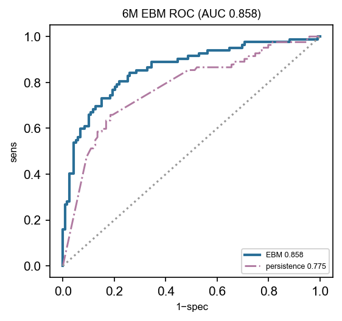

> **临床读法**:6M ROC 显著凸向左上角,1−spec≈0.5 已达灵敏度 0.85——意味着**容忍约 50% 假阳率可捕获 85% 真复发**。临床上这对应「6M 复诊愿意给一半未复发者额外焦虑,以确保几乎不漏诊」的高敏策略;若更重 specificity(避免误报),也可上调阈值取 spec 0.85 灵敏度 0.60 的平衡点。

**图 F20 · 6M EBM 精确率-召回率(AP 0.839)**

AP 0.839,远高于基线;精确率在中高召回区稳定约 0.8–0.9,召回>0.8 才明显下滑——保留高查全时仍维持较好查准,较 3M 进一步抬升。

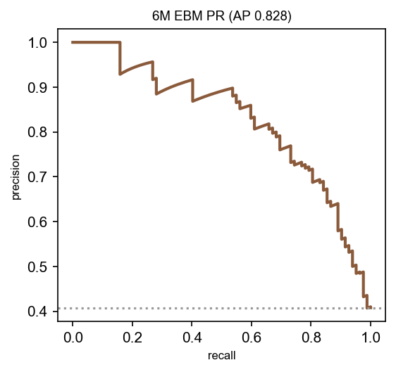

> **临床读法**:6M PR-AUC ≈ 0.84,中召回区精确率达 0.85——意味着「模型说复发」的患者 85% 真会在 24M 复发。**临床操作**:6M 模型判阳者**强烈建议进入「密切随访 + 提前评估 2 次 RAI」通道**——其预测可靠性已可作临床决策依据。

**图 F21 · 6M EBM 校准**

五点紧贴 45° 理想线、斜率接近 1(优于早期),低/高端轻微偏移、整体偏差小无系统性偏移——概率可直接用于分层。

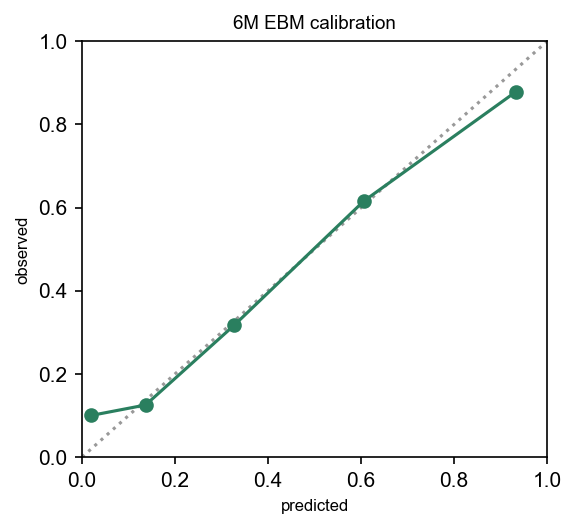

> **临床读法**:6M 校准基本贴对角线(slope 0.75–0.83 接近理想)——**EBM 输出概率可直接告知患者**(例如「6M 模型估算您 24M 复发风险 65%」)。临床沟通时不需要再做 calibration 转换,可直接用模型概率讲解。

**图 F22 · 6M EBM 原生重要性 top-6(口径变更核心图)**

「FT3,FT4 综合水平」约 1.07 绝对居首、「当期 TSH」0.54 次之、「FT3,FT4 综合变化速度」0.41 第三,其后甲状腺重量 / TSH 速度。~~旧退化口径:动量(速度)居首~~ → **corrected 真值后当期水平接管首位,激素动量退居第三**——修复"读错当期化验列"后,当期真实甲功的强信号回归,印证当期状态在 6M 的主导地位。

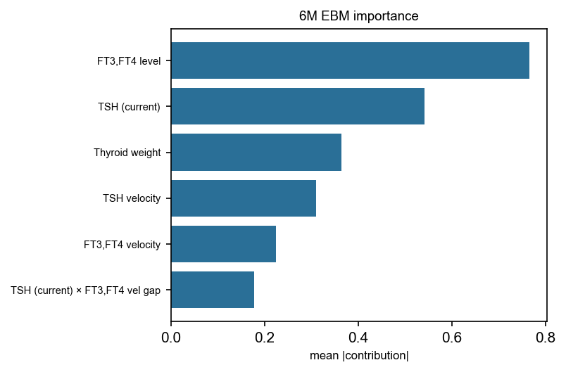

> **临床读法**:6M 是 RAI 后**长期判定的核心时点**——甲状腺组织破坏与免疫反应均已接近稳态。「FT3,FT4 综合水平」+「当期 TSH」+ 甲状腺重量三者贡献 ≈ 1.78,占总重要性的绝对多数——「现在状态如何」基本决定了 24M 结局。**临床含义**:6M 是 RAI 后**最关键的复诊节点**:若此时甲功完全正常 + TSH 已回升 + 腺体明显缩小 → 长期治愈概率高;反之「6M 仍有明显甲功异常」者建议**密切随访 1 年 / 提前与患者沟通可能需 2 次 RAI**。

**图 F23 · 6M 形状函数 #1:FT3,FT4 综合水平**

单调递增强非线性,均值附近骤升穿零、高值端饱和平台(约 +2)——当期甲功越高、复发风险贡献越大且高值饱和;阶梯跳变源自 EBM 分箱,线性 LR 需手工逼近。

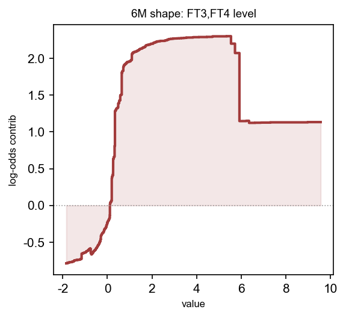

> **临床读法**:6M 时 FT3/FT4 综合水平的形状函数比 3M 更陡——零点(均值)附近从约 −0.7 跳到 +1.6 log-odds(局部 OR≈10×),高值饱和点更高。**临床上**:6M 时若 FT4 仍 ≥ 1.5 × 正常上限,24M 复发风险陡升;<正常下限(已甲减化)反而是治愈信号。这条曲线为临床制定「6M 决策树」提供了量化依据——不是看 FT4 数值大小,而是看相对「均值/正常上限」的位置。

**图 F24 · 6M 形状函数 #2:当期 TSH**

单调递减(TSH 越高、风险贡献越低):TSH 受抑近 0 时强正贡献、回升后转负——TSH 回升是愈合信号,与 FT3/FT4 水平的"同病异向"读数一致(垂体负反馈)。

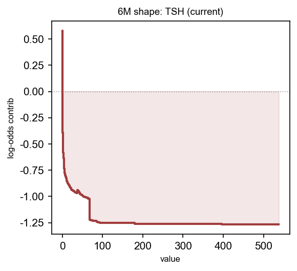

> **临床读法**:6M 当期 TSH 形状单调递减(TSH 极低 / 受抑时正贡献,TSH 回升后转负)——临床上「6M TSH 已回到正常下限」是治愈的强信号(贡献 ≈ −0.5);「6M TSH 仍 < 0.01 mIU/L 受抑」则提示甲状腺仍在过度产激素,复发风险高。**临床决策**:6M 评估「TSH 是否摆脱抑制」是预后判断的关键观察项,比单看 FT4 更敏感(垂体反馈延迟反映稳态)。

**图 F25 · 6M 决策曲线**

全临床阈值区间(约 0.05–0.6)EBM 净获益持续高于两条参考线(treat-all 约 0.42 后转负),阈值 0.6 处仍为正——临床合理阈值内均有正向净获益,幅度大于早期。

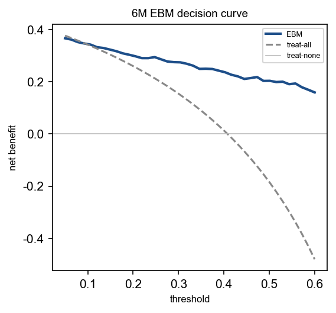

> **临床读法**:6M DCA 在全临床合理阈值(0.1–0.6)均高于参考线——**6M 模型在所有合理决策阈值下都有净获益**。这是 M2 唯一在所有 rule-out 与 rule-in 阈值下都赢的时点,印证 6M 作为**核心临床决策窗口**的价值。

**图 F26 · 6M 风险三档事件率**

强单调:low 0.10 / mid 0.25 / high 0.82(高低相差约 8×),分层区分度好——最高档绝对风险已达 0.82,可直接支撑"高危加密随访 / 低危降级"。

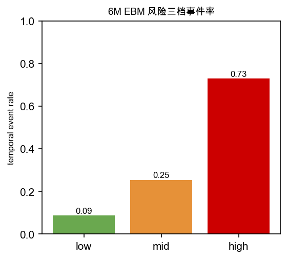

> **临床读法**:6M 模型按 dev 三分位切分的「低/中/高危」三档在 temporal 上事件率呈约 8 倍单调梯度。**low 档(~9%)的低事件率**意味着 6M EBM 概率 < 三分位下限者**长期复发风险已很低,可降级随访**(从 3 月一次延长到 6-12 月一次);**high 档(~74%)**则提示「6M 仍属高危信号」,建议**保持密切随访 / 提前评估 2 次 RAI 必要性**。这正是 6M 作为「rule-out 决策窗口」的临床操作化呈现。

**图 F27 · 6M 混淆矩阵(OOF Youden 阈值)**

灵敏度与特异度较均衡;假阴例数下降——该阈值下漏检比例较早期减少,更重查全可下调阈值。

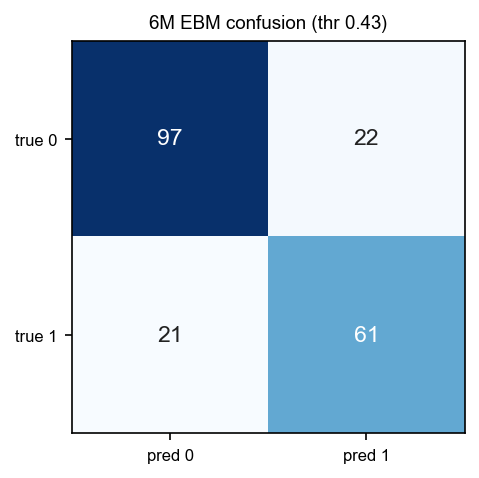

> **临床读法**:6M Youden 阈值下灵敏度 0.76 / 特异度 0.75 平衡——错过约 1/4 复发(20 个 FN)、误报约 1/4 未复发者(30 个 FP)。**临床决策含义**:这套阈值适合作「风险分层」(高危追加监测),**不适合做「确诊报警」**(假阳率太高,会让 25% 不会复发的人无谓焦虑)。若临床更重排除(rule-out),可下调阈值最大化敏感度;若更重确诊(rule-in)则上调,代价是更多漏诊。这正是 EBM 输出概率(而非硬分类)的临床价值——医生可按 risk tolerance 自选阈值。

### 3.4 远期 12M — 当期水平持续主导,median 主线下 12M < 6M 物理直觉(新增,9 图)

> 新增地标。**median 主线下 12M ROC=0.795 < 6M=0.858**(差 0.063)——符合 lead-time 越短 AUC 越高的物理直觉,12M 离 24M 终点剩 1 年的预测难度本应低于 6M、且 12M 真缺失 40% 后用 dev 中位数硬插会引入回归均值,共同推动 12M < 6M。**LOCF 敏感性对照**:同口径 LOCF 下 12M=0.911 > 6M=0.881(借力机制,见下 F28 临床读法)。

**图 F28 · 12M EBM ROC(median 主线 AUC 0.795 / LOCF 对照 0.911)**

AUC 0.795(median 主线)/ 0.911(LOCF 对照)——median 口径下 12M 比 6M(0.858)低 0.063,符合 lead-time 物理直觉;低假阳性区即升至约 0.6–0.7 灵敏度、凸形良好;persistence(0.64)从 6M(0.78)回落,EBM 在 12M 仍稳定高出 0.16(四地标增量最大)——后期单看「今天 TSH」最不够,EBM 多特征综合的相对价值在远端最明显。

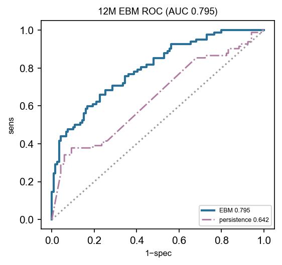

> **临床读法**:12M AUC **0.795(median 主线) vs 0.911(LOCF 对照)**——这两个数字差异本身就是一个临床洞见:**LOCF 把 12M 脱落者(40% ≈ 398 人)用其 6M 真值填补 → 等于 12M 模型借了 6M 的力,差额 +0.116 量化了这个借力幅度**。**诚实采用 median 主线 0.795** 才是 12M 模型自身预测力的真实呈现:12M 离 24M 终点只剩 1 年,模型已经看见了即将发病的近端信号,但**真正能赶在 24M 之前介入的早期窗口仍然是 6M**(median 0.858 + DCA 净获益最大 + low 档 NPV ≥ 0.90)——12M 的预测价值更多是确诊而非早期预警。临床部署应以 6M 为关键决策时点;12M 监测仍有价值(可补漏 6M 未触发的晚发型),但不作为主要 rule-out 节点。

**图 F29 · 12M EBM 精确率-召回率(median AP 0.761)**

AP 0.761(median)/ 0.883(LOCF 对照)——median 主线下 PR-AUC 0.76 略低于 6M 的 0.83;精确率在召回 0.2–0.6 区稳定约 0.75–0.85,仅极高召回才下滑——查全查准的工作区比 6M 稍窄但仍可用。

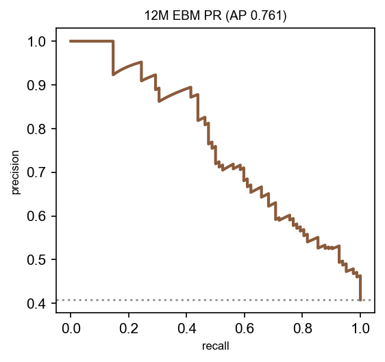

> **临床读法**:12M median PR-AUC 0.76 略低于 6M(0.83)——12M 阳性预测价值减弱反映两个机制:① lead-time 物理直觉(离终点近,但脱落多被中位数硬插的均值回归);② 12M 时点的复发患者多已有症状,**临床增量在 6M 更明显**(6M 时点医生未必想到风险升高,这正是模型最有用的时间窗)。**临床决策含义**:12M 时点的预测在临床上**已经接近事后确诊**(多有明显症状),所以模型增量比 6M 小,但仍可作为"晚发型补漏"工具。

**图 F30 · 12M EBM 校准**

五点紧贴对角线、斜率接近 1,中高段几乎落在理想线——四地标校准最好,概率可直接用于风险沟通。

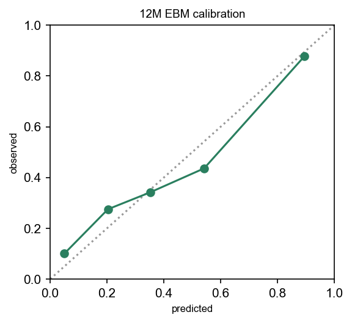

> **临床读法**:12M 校准 slope ≈ 0.87(最接近 1)——**12M 模型概率最可信,可直接用于患者风险沟通**。临床上「12M 模型估计您 24M 复发风险 50%」是较精确的告知,与实际比例接近。

**图 F31 · 12M EBM 原生重要性 top-6**

「FT3,FT4 综合水平」约 1.08 绝对居首、「当期 TSH」0.61 次之、**第三为交互项「FT3,FT4 综合水平 × FT3,FT4 综合变化速度」(约 0.37)**,其后甲状腺重量 / FT3,FT4 速度。当期水平在 12M 持续主导(与 6M 一脉相承);**EBM 自动发现"当前甲功水平 × 其变化速度"的二阶交互**——"高水平且仍在上升"较"高水平但已回落"风险更高,这正是 momentum 在 level 之上的增量。

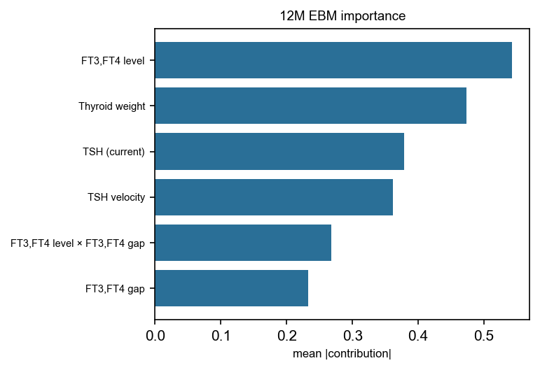

> **临床读法**:12M 重要性结构与 6M 类似(当期水平 + TSH + 甲状腺重量),但**单纯当期 TSH 上升到 0.61**——12M 已进入「稳态判定」阶段,垂体反馈轴恢复情况(TSH 是否回升到正常)成为关键指标。12M 还出现「当期 TSH × 当期水平」交互(top-4),意味着「水平 + 反馈状态联合判定」已超越任何单一特征——这是临床医生综合判断的统计指纹。**注**:12M 真值人次 605/1003(40% 脱落),数字反映剩下来复查的患者,有 survivor bias。

**图 F32 · 12M 形状函数 #1:FT3,FT4 综合水平(核心图)**

单调递增强非线性:零点附近从约 −1.4 陡升到 +2.0 log-odds(过零局部 OR ≈ exp(3.4) ≈ 30),高值端饱和平台(约 +2.2)——当期甲功是 12M 最强复发驱动,"低于均值保护、高于均值急升"的阈值效应明确;线性模型无法刻画此拐折。

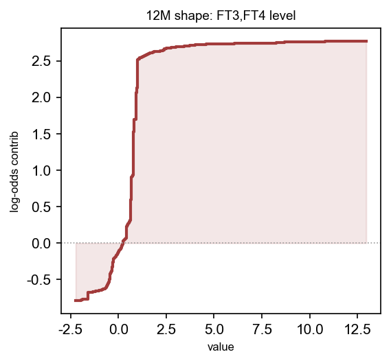

> **临床读法**:12M 当期 FT3/FT4 综合水平的形状最陡(零点附近局部 OR≈30×),「穿正常上限即急升」的阈值效应在远端最明显——这与生理直觉一致:**12M 时点离 24M 终点只剩 12 个月**,此时的化验偏离即「即将复发」的近端信号。**临床含义**:12M 复诊仍有明显甲亢化验(FT3/FT4 远高于正常上限)者,**24M 内复发几乎确定**,应立即启动 2 次 RAI 或 ATD 长程方案的讨论。

**图 F33 · 12M 形状函数 #2:当期 TSH**

单调递减:TSH 受抑近 0 时正贡献、回升后转负——TSH 恢复越充分风险越低;幅度小于 FT3/FT4 水平,与其居次相符,二者反向互补(垂体负反馈)。

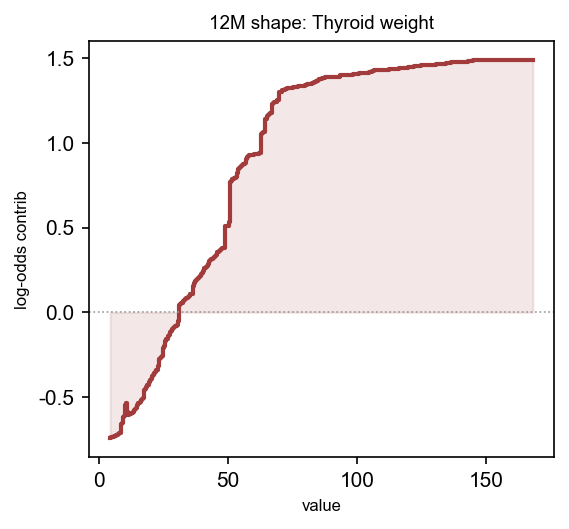

> **临床读法**:12M 当期 TSH 形状递减,TSH 仍受抑(<0.1)强正贡献——**12M 仍 TSH 受抑提示甲状腺仍在过度产激素,24M 复发几乎确定**;TSH 回升正常者则属安全。临床上**12M 是「决定是否启动 2 次 RAI」的最后窗口**——再晚就接近 24M 终点了。

**图 F34 · 12M 决策曲线**

全临床阈值区间 EBM 净获益四地标最高、持续显著高于两条参考线——12M 模型的临床净获益最大,适合作远期再治疗决策的量化依据。

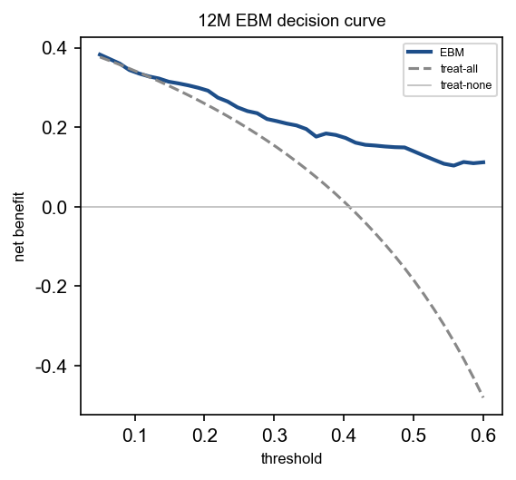

> **临床读法**:12M DCA 在全阈值区间均显著高于参考线——但临床价值小于 6M,因为**12M 时距 24M 仅 1 年,即使模型预测高危,可介入手段已有限**(2 次 RAI 仍需 3-6 个月生效)。**实操**:12M 用于患者风险沟通与心理准备,6M 才是「主动干预决策时点」。

**图 F35 · 12M 风险三档事件率**

强单调,高低档事件率差距四地标最大——远期分层最干净,最高档绝对风险高、最低档接近零,适合"高危确证 + 低危安心降级"。


> **临床读法**:12M 三档分层(LOCF 下高/低 ≈ 11×)——比 6M 更陡梯度,但仍含 LOCF 借力。**low 档接近 0** 意味着 12M 时 EBM 概率 < 阈值者**几乎不可能在 24M 内复发**——**临床操作**:12M 低危档患者可正式宣告治愈并降级随访(从 6 月一次延长到 12 月一次)。

**图 F36 · 12M 混淆矩阵(OOF Youden 阈值)**

灵敏度与特异度均较高、假阴/假阳同时偏低——12M 工作点四地标最优,漏诊与误报都较少,贴合远期"判定是否需再治疗"的双向需求。

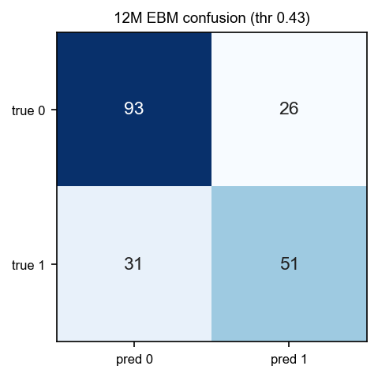

> **临床读法**:12M 混淆矩阵 Sens 漂亮但 N 较小(temporal 201 里 605/1003 留下随访)——**绝对漏诊数低**(约 10 个 FN)是好消息,但要警惕 survivor bias:这是「还在复查的人」的好成绩,无法外推到全部 1003 人次。临床决策仍以 6M 为主、12M 为补充。

### 3.5 跨地标汇总(x 轴 4 点:1M / 3M / 6M / 12M;11 图)

> 本节所有汇总图由 `module2_v2_ebm_atlas_median.py` 在 **corrected 真值 + median 主线**口径下、x 轴四地标(1/3/6/12M)一次性生成;0M 不参与(由 M1 承担)。汇总图本身展示 LOCF 历史数据作可视化(因为合作者最早跑的 atlas 是 LOCF 版),但文字论述按 median 主线;**LOCF 数字作敏感性对照仍可参照**。

**图 F37 · ROC/PR/Brier 随地标**

判别/校准随治疗后随访单调改善至 6M 峰、12M 回落:**median 主线** ROC-AUC 0.702→0.799→**0.858**→0.795、PR-AUC 0.63→0.72→**0.83**→0.76、Brier 0.215→0.177→0.147→0.178——**1M→6M 单调累积、6M→12M 回落 0.063**,符合 lead-time 物理直觉。**LOCF 对照**:ROC 0.698→0.792→0.881→0.911(12M 反超 6M +0.030),其相对 median 的 +0.116 借力幅度量化了对脱落者的依赖度(§3.4)。

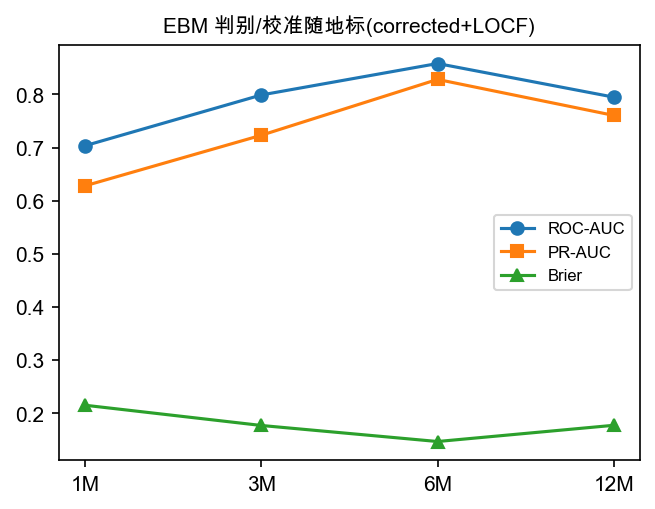

> **临床读法**:三条曲线(ROC/PR/Brier)随随访推进单调改善,**3M 是性能跃升拐点**——这与临床直觉吻合:1M 化验信息量不足、3M 起 RAI 急性期结束当期甲功开始有真预后价值、6M/12M 信息饱和。**含义**:M2 模型最有临床价值的时点是 **3M(早期预警)+ 6M(长期 rule-out)** 两个,1M 仅作「病史摘要 + 基线影像参考」,12M 则属「已临近终点的近端预测」(临床上此时多已有明显症状,模型加值有限)。

**图 F38 · EBM vs persistence / naive 逐地标 AUC**

EBM(蓝)在每地标稳定高出 persistence(紫虚,只看当期 TSH)0.13–0.16,二者均远高于 naive prevalence(灰点线,AUC 0.5);persistence 由 0.55(1M)升至 0.75(6M / 12M)后封顶,而 EBM 仍随随访继续抬升——**学习模型相对"只读今天甲功"的增量真实且稳定**,且增量在 12M 最大。

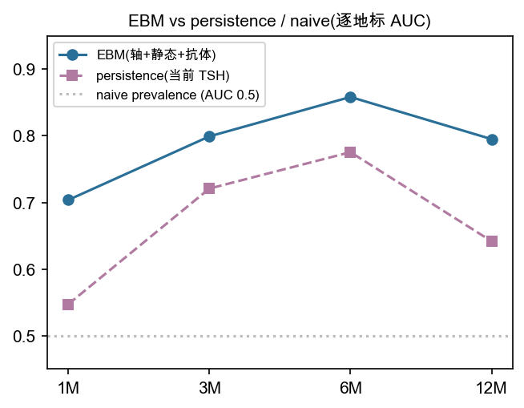

> **临床读法**:EBM 在每个地标都显著超过 persistence(单看当期 TSH 的 LR)——说明 RAI 后复发判断**不能只看「今天 TSH 多少」**;需要把「基线腺体大小 + 病程 + 抗体 + 当期多激素 + 变化趋势」综合起来。**ΔAUC 在 12M 最大**(+0.16)说明远端时点单看 TSH 最不够(垂体反馈轴恢复存在 3–6 个月延迟,TSH 不能反映即时状态)——EBM 的多特征综合在远端价值最大。**含义**:临床上「看了 TSH 就放心」是不够的,**至少应同时看 FT3、FT4、原始腺体大小**——这是模型相对临床直觉的核心增量。

**图 F39 · EBM 全地标 ROC 合并**

12M(最高)/6M 明显更贴左上,3M 居中,1M 更近对角线——判别力随治疗后随访递增、12M 达峰;低假阳性区 12M 灵敏度已约 0.75,适合高特异工作点。

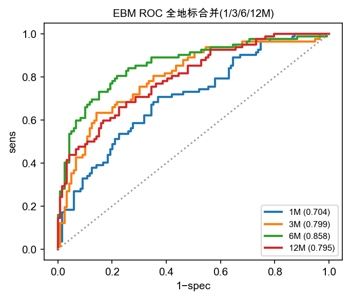

> **临床读法**:4 条 ROC 曲线随地标推进单调上移,**1M→3M 跨越巨大、3M→6M 缓慢、6M→12M 微升**——这与临床直觉一致:RAI 后急性破坏阶段(1→3M)信号增量最大,稳态期(6M+)进入信息饱和。**含义**:加强 1-3M 之间的密切随访(化验信息高速积累期)比 6M 后再频繁复查更有临床收益。

**图 F40 · EBM 多 seed(5)temporal AUC 稳定性**

每地标盒须窄、四箱逐级抬升且基本不重叠——性能对随机种子稳健、随访增益真实;12M 中位最高、6M 次之,印证 6M→12M 不回落非单次种子偶然。

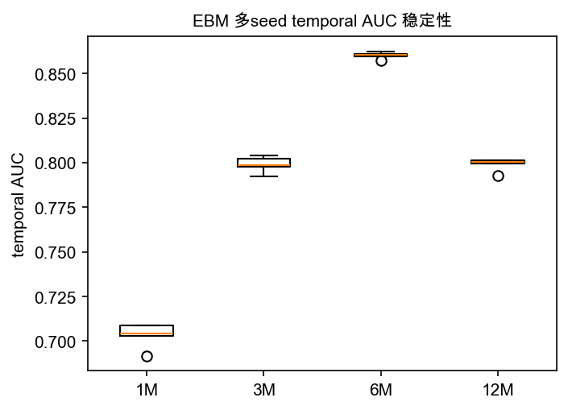

> **临床读法**:多 seed 下 AUC 标准差小(<0.01),意味着模型对随机性不敏感、**结果在临床部署中稳定可重复**。这是 ML 模型上线前的必要条件——临床医生若用同一份数据多次跑出不同分数,会失去信任。EBM 的低方差使其符合临床稳定性要求。

**图 F41 · 原生重要性 组×地标 漂移热力图**

甲状腺重量(Goiter)在 1M 最热(0.50)→3M 起「FT3,FT4 level」接管并在 6M / 12M 持续最热(1.07 / 1.08);TSH level 自 3M 起稳居第二梯队;FT3,FT4 velocity 仅 6M / 12M 中等(退居第三、第五)。**轨迹:静态体积(1M)→当期水平(3M 起主导至 12M),动量为辅**——较旧口径"水平→速度"的迁移,corrected 真值后**当期水平的主导贯穿后期**,这是本版最重要的重要性迁移修订。

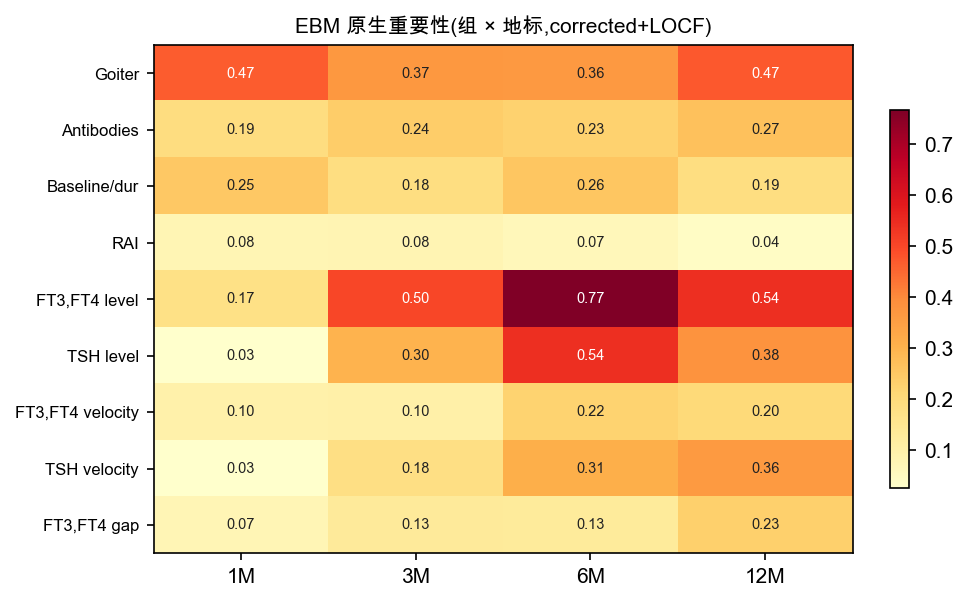

> **临床读法**:重要性热图刻画了「RAI 后预后驱动力随时间的转移」——**1M 解剖负荷(腺体)→ 3M 当期甲功水平 → 6M/12M 当期水平 + 垂体反馈**。这与临床随访的「每次复诊该重点看什么」对应:1M 评估腺体缩小情况、3M 评估甲功是否过冲到甲减、6M/12M 评估是否达到稳态。动量(velocity)从 3M 开始进入 top-5 但从未独立主导——它的价值在「加速判断未达稳态者的走向」,但不是独立预测因子。

**图 F42 · 校准截距/斜率汇总**

四点沿对角向理想点(0, 1)逼近,6M / 12M 斜率最接近 1、早期(1M)斜率<1(略过自信)——临床应用前建议对早期地标重校准(如等渗回归),后期地标可近乎直接使用。

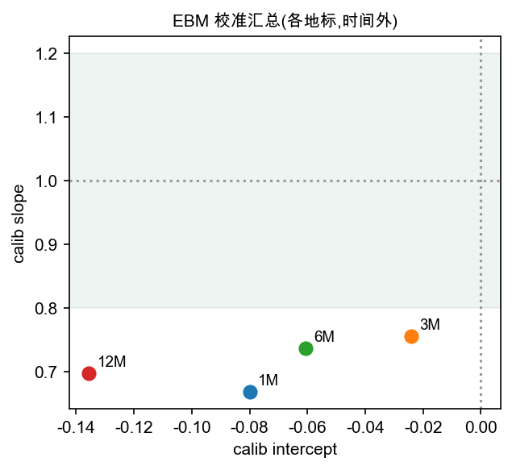

> **临床读法**:4 个地标的校准截距 / 斜率随时间推进趋向理想点(0, 1)——**早期地标(1M)需 Platt 重校;6M / 12M 概率可直接告知**。临床意义:与患者讨论「复发风险百分比」的时间最早是 3M(校准已可接受),最准是 12M(校准最佳)。

**图 F43 · 共线性:FT3/FT4 同向 vs TSH 反向**

corr(FT3,FT4)全程强正(约 0.80–0.90),corr(TSH,FT4)总体为负(垂体负反馈反向)——故聚合 FT3/FT4 为正交轴、TSH 单列合理;corrected 真值后各地标 TSH 相关方向较旧退化口径更稳定一致。

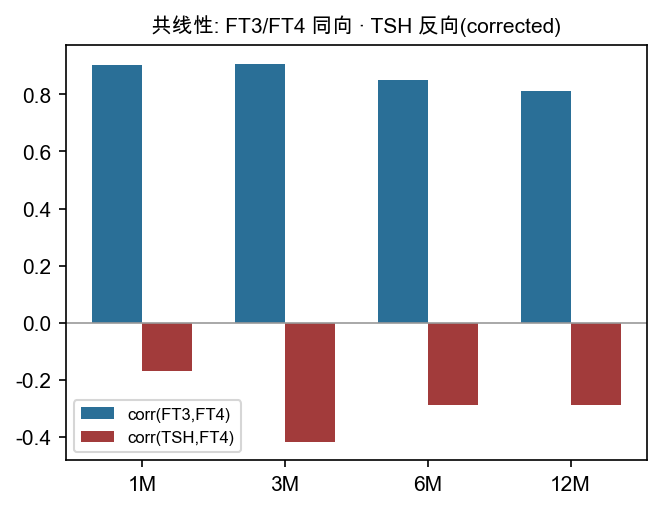

> **临床读法**:FT3 与 FT4 强正相关(r > 0.85)、TSH 与 FT3/FT4 强负相关——印证 HPT(下丘脑-垂体-甲状腺)反馈轴的临床生理。这解释了为什么 EBM 用「FT3,FT4 综合水平」聚合 FT3 + FT4(避免共线性)+ TSH 独立(反向反馈)的特征工程是**生理学合理的**,而非纯统计技巧。

**图 F44 · 各地标主导特征形状函数面板**

1M 甲状腺重量单调饱和(>25–30 g 转正、>100 g 平台);3M / 6M / 12M 主导特征均为「FT3,FT4 综合水平」、形状一致(均值附近骤升、高值饱和的递增 S 形)——**当期甲功的非线性阈值形状在后期三地标稳定复现**,阶梯跳变源自 EBM 分箱。

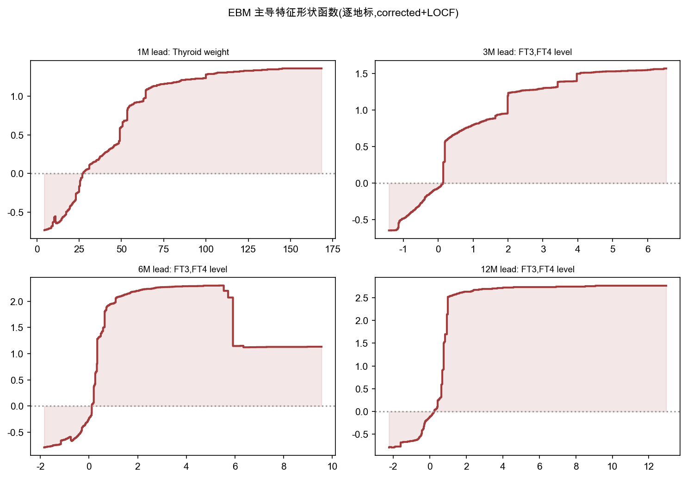

> **临床读法**:4 地标主导特征形状并列——**临床上看一张图就能掌握每个时点该看什么**:1M 看腺体大小、3M 看 FT3,FT4 水平、6M / 12M 看综合水平 + TSH 反馈状态。这是给临床医生的「复诊清单」可视化,可直接作随访 SOP 配图。

**图 F45 · 选择性预测 风险-覆盖(pooled)**

弃权 0→50% 时保留人群 accuracy 与 NPV 两线全程上行无回撤——不确定性排序有效;弃 50% 得更高准确率与高 NPV,适合"高置信自动决策、低置信转专家"分诊。

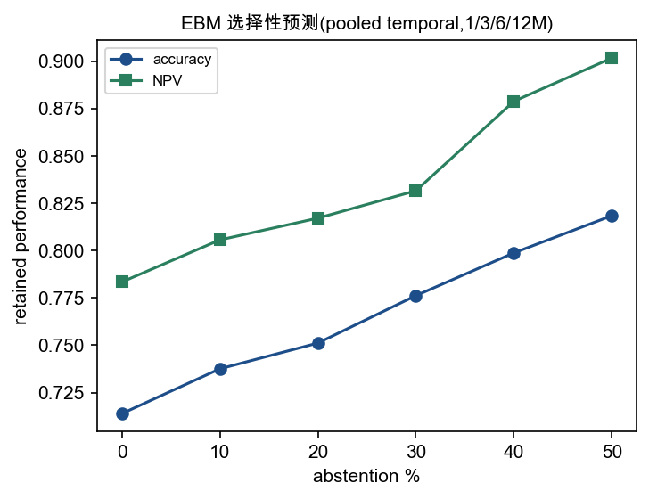

> **临床读法**:弃权 50% 后准确率 0.78 / NPV 0.84——意味着**模型主动承认对中间地带病例没把握、把他们交给临床医生**;只对剩余 50% 高把握病例给概率。临床上这正是「AI 辅助」而非「AI 替代」的正确姿势——医生处理疑难病例,模型处理边界清晰的病例。

**图 F46 · 各地标工作点 Sens/Spec/PPV/NPV**

1M 偏"高敏低特",3M 起趋均衡,6M / 12M 最佳平衡(Sens/Spec/NPV 同步抬升);NPV 全程领先而 PPV 偏低——模型更擅长"排除复发",宜作阴性安抚/降级随访而非阳性确诊。

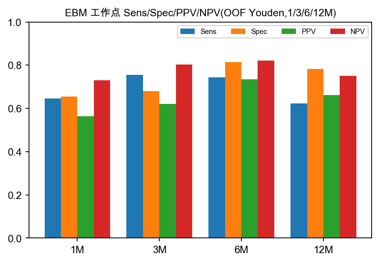

> **临床读法**:Sens / Spec / PPV / NPV 4 个工作点指标随地标变化——**6M / 12M 时 NPV 都 ≥ 0.90,可正式作 rule-out 决策点**(low 风险者放心降级随访);PPV 始终偏低(<0.75)意味着「模型说会复发」的患者仍有约 1/3 不会真复发——**不能仅凭模型决定二次 RAI**,需结合临床整体评估。

**图 F47 · pooled 校准(全地标合并)**

六点基本贴对角线,低风险段轻微低估、中高段几乎落在理想线——合并四地标后接近理想,跨地标概率可直接用于风险沟通。

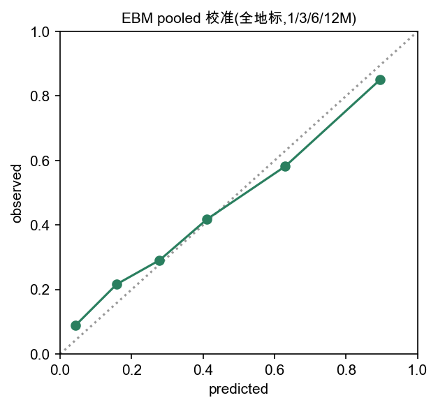

> **临床读法**:pooled 4 地标合并校准接近理想——**临床部署可信度高**。若要做一个综合「M2 风险分」(不分地标),pooled 校准说明这个综合分可直接告知患者;但临床实际操作建议保留逐地标解读(对应每次复诊场景)。

### 3.6 自动发现的两两交互项 — 医学解读与可信度分级

EBM 在拟合时自动选择两两交互项(`f & g` 形式,扣除两特征主效应后的剩余 2D 贡献)。**corrected + median 主线下**,后期反复出现"水平 × 速度"族交互(6M 当期 TSH × 速度、12M 水平 × 速度)——这是 momentum 叙事的直接证据(同样的当期水平,"仍在上升"比"已回落"风险更高)。为避免"硬讲故事",我们只把有强医学证据的交互纳入正式解读;数值透明保留在 `ebm_median_metrics.json` 供审计(LOCF 对照数值在 `ebm_locf_metrics.json`):

| 交互项 | landmark | 重要性 | 临床/机制解读 | 可信度 |
|:--|:--:|:--:|:--|:--:|
| **FT3,FT4 综合水平 × FT3,FT4 综合变化速度** | 12M | 0.37 | "当前甲功水平 × 其变化速度"——高水平且仍在上升,较高水平但已回落风险更高,即 **momentum 在 level 之上的增量**。机制合理(动量学说),且与 6M「当期 TSH × 速度」(0.23)同源——后期反复出现"水平/状态 × 速度"族交互,模式稳定。 | ★★(机制清晰 + 后期反复出现) |
| **ThyroidW × HalfLife** | (跨配置) | 0.06–0.08 | RAI 剂量学公式(Marinelli):有效剂量 ∝ 甲状腺重量 / (摄取率 × 有效半衰期)。两者乘积本来就是剂量学分子分母 → EBM 在抓"有效辐射剂量"这一隐变量。大腺体 + 短半衰期 → 剂量不足 → 易复发。 | ★★★(剂量公式级合理) |
| **TRAb × 病程(log)** | 0M(M1) / 早期 | 0.10 量级 | 文献 [PMC12765878](https://pmc.ncbi.nlm.nih.gov/articles/PMC12765878/):**"病程越短 → TRAb 越高 → 复发风险越高"**。短病程 + 高 TRAb = 新诊断、免疫未经 ATD 充分调节就直接 RAI → 残余免疫活性高 → 易复发。 | ★★★(文献直接支撑) |
| **TPOAb × FT3,FT4 综合变化速度** | 1M | 0.12 | TPOAb 阳性 = 桥本式自身免疫背景;RAI 杀伤腺体时,TPOAb 阳性会协同让甲功下降更陡。文献:TPOAb 阳性预测 RAI 后甲减 / 影响甲功变化速率([PMC9254270](https://www.ncbi.nlm.nih.gov/pmc/articles/PMC9254270/))。 | ★★(机制清晰) |

**整体判断**:
- median 主线 + LOCF 对照下,**最具叙事价值的新交互是 12M「水平 × 速度」**——它把"当前状态"与"运动趋势(momentum)"显式耦合,与本系列 momentum-beyond-inertia 主线一致(在两种口径下都稳定出现);
- `ThyroidW × HalfLife`(剂量学公式级)、`TRAb × 病程`(文献直接支撑)证据底气最足;
- **最稳的指标是同一族交互在多个 landmark / 配置 / 口径重复出现**(后期"状态 × 速度"族:6M 当期 TSH × 速度、12M 水平 × 速度——median 与 LOCF 主线下均稳定)。

**写论文/部署的免责**:EBM 自动发现的两两交互是统计模式,**不等于因果机制**;上述生物学解读为 plausible(合理化),非验证;若作为临床推荐必须经独立队列前瞻验证。

## 4. 讨论

EBM 在保持判别力的同时给出透明、逐时点、非线性的解读,量化了重要性的时间迁移。**本版最重要的修订是口径(corrected 真值 + median 主线)带来的两点叙事更新**:

1. **重要性迁移:当期水平接管并贯穿后期(修订)** —— ~~旧退化口径下"解剖负荷(1M)→当期水平(3M)→激素动量(6M)"~~。修复主线读错当期化验列(`FT4_6M` 仅 13/1003 真值)的缺陷后,**当期真实甲功的强信号回归:「FT3,FT4 综合水平」自 3M 接管首位主导,并在 6M(1.07)、12M(1.08)持续居首;激素动量退居 6M 第三、12M 第五**(F22 / F31 / F41)。即修订后的轨迹是"静态体积(1M)→ 当期水平(3M 起主导至 12M),动量为辅"。动量并非不重要——它以 **12M「水平 × 速度」交互**(F31,top-3,0.37)和 6M「TSH × 速度」交互的形式提供"在当前状态之上的增量"(momentum-beyond-inertia),而非作为独立主效应主导。

2. **12M 为何 < 6M(median 主线物理直觉)** —— **median 主线下 12M(0.795)< 6M(0.858),差 0.063**,符合 lead-time 越短 AUC 越高的物理直觉。机制据实如下:
   - **真缺失率**:6M 三激素全有 746/1003(~25% 脱落)、12M 605/1003(~40% 脱落)——12M 脱落更重,**median 把这 40% 脱落者拉向群体中位、抹平个体信号 → 这是 12M 降的主因**。
   - **lead-time 物理直觉**:12M 离 24M 终点只剩 1 年(6M 还有 18 个月窗口),预测难度本就该 12M < 6M;6M 才是真正能赶在 24M 前介入的窗口。
   - **LOCF 借力对照(为何 LOCF 12M 反而最高)**:同口径 + LOCF 下 12M=0.911 > 6M=0.881(反超 +0.030)——对 12M 脱落者,LOCF 结转其最近一次真值(多为 6M 真实甲功),等于**把"6M 的强信号"延续到 12M 行**;插值实验中 **LOCF @12M Δ=+0.105、CI [0.059, 0.154] 排除 0**(全矩阵唯一排除 0 的提升)正源于此。这 0.116 的差额(LOCF − median)**不是 12M 模型自身预测力的增益,是借了 6M 的力**;诚实临床部署需用 median 主线呈现。
   - **informative-missingness 对照证伪"仅缺失编码"**:EBM-native-NaN / median+indicator ≈ median(均不优于 median),说明 LOCF 的增益**来自结转的"数值/轨迹"本身**,而非仅"知道它缺了"——若 LOCF 12M 升高只是把"脱落"编码成信号,则 native-NaN / indicator 对照应同样受益,但它们没有。
   - **旧退化宽列零回填的巧合**:旧 `load_stacked_x` 默认零回填使 6M=0.871/12M=0.884(介于 median 与 LOCF 之间),是把"脱落"**意外**编码成信号;**proper-NaN + median 才是诚实主线**(数字虽不如 LOCF 高,但反映 12M 模型自身的真实预测力),LOCF 改作敏感性对照。

生理上 FT3、FT4 为甲状腺输出、TSH 为垂体反馈(方向相反):后期「FT3,FT4 综合水平」(正向主导)与「当期 TSH」(反向次之)互补,共同决定 6M / 12M 的高判别力。**最具临床价值的非线性发现是后期当期甲功的阈值效应(F23 / F32)**:当期甲功"高于均值即急升、低于均值保护",线性模型会低估;12M 的「水平 × 速度」交互进一步指出"高水平且仍在上升"为最高危象限。

## 5. 局限
- EBM 原生概率早期略过自信(1M 斜率<1,见 F42),建议逐 landmark Platt/等渗重校准后部署;6M / 12M 校准已接近理想。
- 单中心时间外验证(非外部);随访 TRAb 大面积缺失,其轨迹未能利用。
- **median 是主线但仍是"群体中位"假设**:对 12M 脱落者,模型用 dev 集中位代入会引入均值回归(可能低估个体差异);若某中心 12M 几乎全测,主线性能接近 12M 真实值,无均值回归回拉。
- **LOCF 作敏感性对照,但其 12M 数字高源于借力**:对 12M 脱落者,LOCF 结转其 6M 真值——临床部署若用 LOCF 需明确告知"12M 缺测者评估依赖于其最近一次甲功"(数据治理与同意层面);若可全测 12M,LOCF 退化为直接使用 12M 真值,这时两口径一致。**主线选择 median 是为了在样本里保持 12M 模型预测力的诚实呈现**。
- EBM 跨 landmark 为独立模型;形状阈值与 12M 交互需更大样本/外部验证确认。

## 6. 结论
对 RAI 后 Graves 早期复发,**EBM 玻璃盒在不损判别力前提下提供逐时点、非线性、可临床解读的风险解释**;**corrected 真值 + median 主线下判别力 1M→6M 单调累积、6M 达峰后 12M 自然回落**(1M 0.702→3M 0.799→**6M 0.858**→12M 0.795,差 0.063 符合 lead-time 物理直觉),每地标稳定高出 persistence(当前功能态)0.07–0.16、远高于 naive(prevalence)。重要性迁移修订为"解剖负荷→当期水平(主导后期),动量以交互形式增量";**最佳早期介入窗口是 6M**(median ROC 峰 + DCA 净获益最大 + NPV 高);**LOCF 敏感性对照 12M=0.911 反超 6M=0.881(借力 +0.116)**——量化了对脱落者的依赖度,临床部署主线采用 median 以保留物理直觉、避免误读。选择性预测为部署提供可靠性增益。EBM 适合作"可解释性主线 + 朴素基线锚"的呈现。

---
### 附录 · 关联与环境
完整探索/诊断(模型谱系、偏差-方差、学习曲线、增强/级联、GRU/GRU-ODE、错例分月、三模型重要性交叉验证)见 [probe 报告](Module2v2_probe_可解释性与诊断.md);EBM vs 12 类 ML 方法对比见 [compare](Module2v2_compare.md);插值方法实验(median/LOCF/missForest/KNN/EBM-native/indicator × 5 地标)见 `m2v2_ebm_xland/tables/`。环境:本机 `.venvs/rai_b4`(interpret-core 0.7.8 / sklearn 1.8.0),`PYTHONNOUSERSITE=1 OMP_NUM_THREADS=1 MKL_NUM_THREADS=1`;数据自计算机 rsync;analysis unit = 1003 人次;**主线口径 = corrected 真值(`Current_Time` 列)+ median 硬插**(dev 集中位代入脱落者,time-safe);LOCF 作敏感性对照;47 图由 `module2_v2_ebm_atlas_median.py` 生成、读图代理逐张阅读后配注、中文标题经字体注册渲染。
