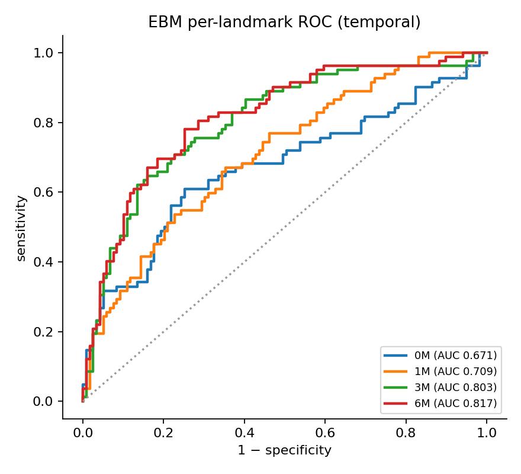
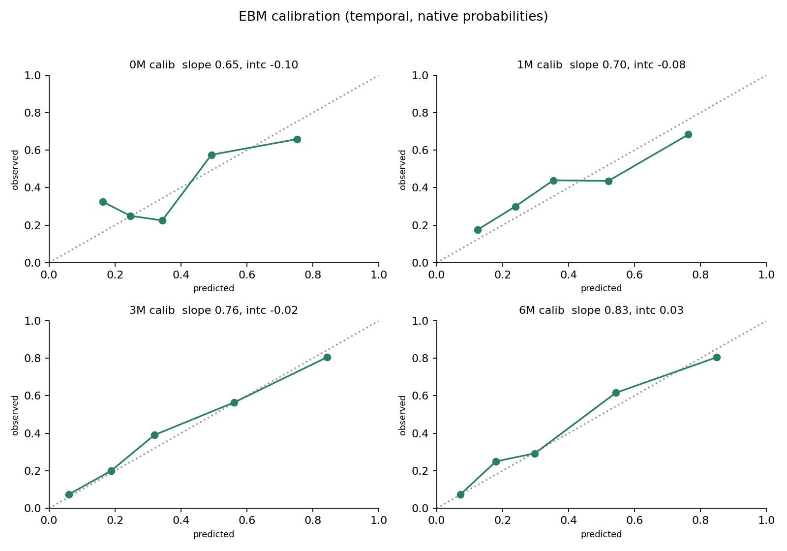
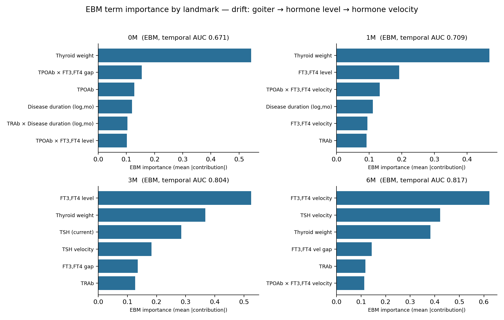
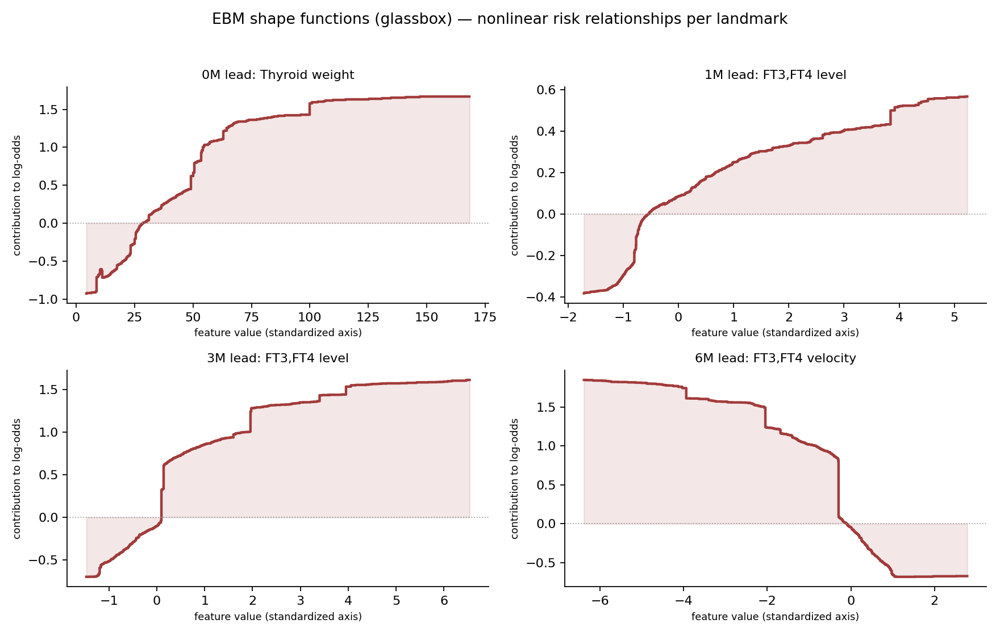
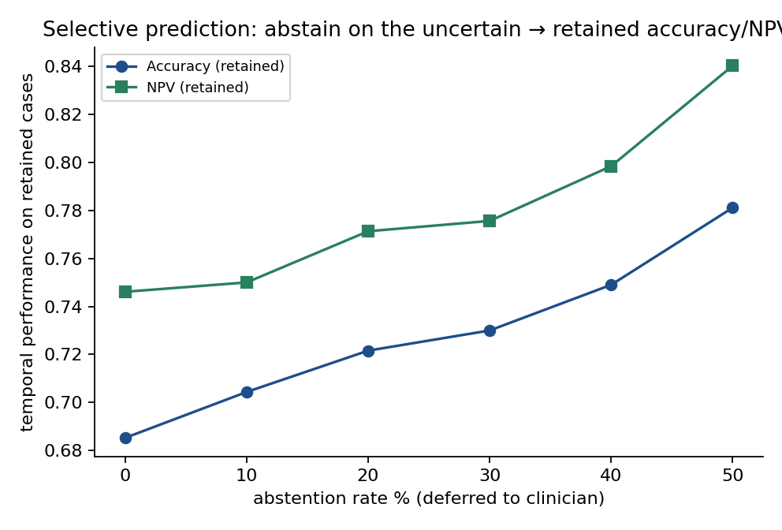

# 放射性碘治疗后 Graves 病早期复发的可解释预测:基于可解释 Boosting 机(EBM)的玻璃盒分析

> RAI post-treatment Graves' relapse — an interpretable boosting (EBM) glassbox at fixed landmarks (0/1/3/6 months)

## 摘要

**背景** 放射性碘(RAI)治疗后 Graves 病的早期复发预测需要既准确又**可被临床解读**的模型;黑盒深度模型难以落地。我们以**可解释 Boosting 机(Explainable Boosting Machine, EBM)**——一种带自动两两交互的广义加性"玻璃盒"模型——在四个固定随访时点(landmark 0M/1M/3M/6M)建模 24 个月复发(NHRH),并系统刻画其逐时点的特征重要性与**非线性形状函数**。

**方法** 分析单元为治疗疗程(N=1003;时间序贯划分:开发 802 / 时间外测试 201)。每个 landmark 单独拟合一个 EBM;甲状腺激素 FT3、FT4 因高度共线(r≈0.81–0.91)被先标准化、再正交聚合为「FT3,FT4 综合水平」与「FT3,FT4 落差」两轴(TSH 因反向反馈单列)。开发集 OOF 仅用于选择,时间外测试仅用于最终报告;以 episode 级 bootstrap 给区间;同台对照简约逻辑回归(LR)。

**结果** EBM 在时间外测试上逐时点 ROC-AUC 为 0M 0.671(95%CI 0.58–0.75)、1M 0.709(0.64–0.78)、**3M 0.804(0.74–0.86)、6M 0.817(0.76–0.87)**,与简约 LR **统计相当**(无显著差异)。**重要性随随访时间系统迁移:0M/1M 由甲状腺重量主导 → 3M 由 FT3,FT4 综合水平接管 → 6M 由 FT3,FT4 综合变化速度(动量)主导**;该迁移被 LR、GRU、EBM 三种独立模型一致复现。形状函数揭示了**非线性的动量效应**(6M),为线性模型所低估。**FT3,FT4 落差(T3 相对优势)在各时点均无独立预测贡献**。我们进一步用偏差-方差与学习曲线证明该任务处于**特征信息天花板**(随机森林完美记忆训练集而泛化等于 LR;学习曲线在半量数据即饱和),复杂模型不提升判别。

**结论** EBM 在不牺牲判别力的前提下提供了**透明、逐时点、非线性**的临床解读,并定量刻画了"解剖负荷→激素水平→激素动量"的时间迁移规律。鉴于性能受特征信息所限,**选择性预测(对不确定者弃权、转交临床)**是提升部署可靠性的可行路径(弃权 50% 后保留人群准确率 0.685→0.781、NPV→0.840)。

---

## 1. 引言

Graves 病 RAI 治疗后早期识别将复发者,有助于个体化随访与再治疗决策。临床预测建模(TRIPOD+AI / PROBAST+AI)强调**可解释性、校准与时间外验证**;而循环网络、注意力等黑盒在小样本、不规则随访的甲功数据上既难解读、又常过度自信。**EBM**(Lou et al.; Nori et al., InterpretML)是带自动两两交互的广义加性模型(GA2M):每个特征学习一条**可视化的形状函数**,模型输出=各形状函数贡献之和,因而**预测精度接近 boosting、解释性等同加性模型**——是"玻璃盒"。本研究用 EBM 回答:**早期复发的可解释信号是什么、随随访时间如何迁移、是否存在非线性效应**。

## 2. 方法

### 2.1 数据与分析单元
治疗疗程为分析单元(N=1003;重复患者视为独立疗程,CV/自助不按患者分组)。**时间序贯划分**:开发集 802、时间外测试 201。终点为 24 个月 NHRH(复发)。在 landmark L 仅使用 ≤L 时刻可得的特征(时间安全)。

### 2.2 特征与正交轴
基线负荷(甲状腺重量、抗体 TRAb/TGAb/TPOAb、基线 FT4/TSH、对数病程、性别)、RAI 暴露(24h 摄取率、有效半衰期)、当期甲功(TSH、FT3、FT4)及其变化速度。**FT3 与 FT4 高度共线(r≈0.81–0.91)**,若各自入模会产生系数对冲、归因失真;故先各自标准化(z 分),再合成两条**正交**轴:

| 轴 | 构造 | 含义 |
|:--|:--|:--|
| FT3,FT4 综合水平 | (zFT3 + zFT4)/√2 | 整体激素偏高/偏低 |
| FT3,FT4 落差 | (zFT3 − zFT4)/√2 | FT3 相对 FT4 偏向(T3 优势) |
| FT3,FT4 综合变化速度 | (zΔFT3 + zΔFT4)/√2 | 激素动量 |
| FT3,FT4 变化落差 | (zΔFT3 − zΔFT4)/√2 | 动量的 T3/T4 偏向 |

TSH 与 FT3/FT4 反向(垂体反馈,见 §4.3),单列为「当期 TSH」「TSH 变化速度」。

### 2.3 模型、评估与重要性
每个 landmark 拟合一个 EBM(interactions=5;其余默认)。开发集 OOF 仅用于选择;时间外测试仅用于报告。判别用 ROC-AUC(episode 级 bootstrap × 1000 给 95%CI);校准用可靠性曲线与校准截距/斜率;**重要性以 EBM 原生全局重要性(各项对 log-odds 的平均绝对贡献)为主**,并用"去整组重训的 OOF AUC 下降(group drop-AUC)"与 GRU/LR 置换重要性交叉验证。同台对照简约 LR。

## 3. 结果

### 3.1 判别与校准
EBM 时间外逐时点表现与简约 LR 相当(表 1);判别力随随访累积而升(3M/6M 显著高于 0M/1M)。

**表 1. EBM 时间外测试性能(per landmark)**

| landmark | AUC | 95% CI | 校准斜率 | 校准截距 | Brier | 对照 LR AUC |
|:--:|:--:|:--:|:--:|:--:|:--:|:--:|
| 0M | 0.671 | 0.58–0.75 | 0.65 | −0.10 | — | 0.693 |
| 1M | 0.709 | 0.64–0.78 | 0.70 | −0.08 | — | 0.729 |
| **3M** | **0.804** | 0.74–0.86 | 0.76 | −0.02 | — | 0.812 |
| **6M** | **0.817** | 0.76–0.87 | 0.83 | +0.03 | — | 0.808 |

EBM 原生概率的校准斜率 0.65→0.83(早期略过自信、6M 接近理想),可经逐 landmark Platt 进一步校准(见 §5)。

### 3.2 重要性随随访时间迁移(玻璃盒)
EBM 原生重要性显示清晰的三段迁移(图 E1):

| landmark | 第1(重要性) | 第2 | 第3 |
|:--|:--|:--|:--|
| 0M | 甲状腺重量(0.54) | TPO 抗体(0.13) | 病程对数(0.12) |
| 1M | 甲状腺重量(0.47) | FT3,FT4 综合水平(0.19) | 病程对数(0.11) |
| 3M | **FT3,FT4 综合水平(0.52)** | 甲状腺重量(0.37) | 当期 TSH(0.29) |
| 6M | **FT3,FT4 综合变化速度(0.62)** | TSH 变化速度(0.42) | 甲状腺重量(0.38) |

**规律:解剖负荷(甲状腺重量,基线)→ 当期激素水平(3M)→ 激素动量(6M)。** 甲状腺重量是全程唯一处处居前的"骨架"。该迁移经 LR(group drop-AUC)、GRU(置换重要性)、EBM(原生+置换)**三模型一致复现**,为数据的稳健规律而非单模型伪影。

### 3.3 非线性形状函数
EBM 的形状函数把"每个轴如何贡献风险"显式画出(图 E2):0M 甲状腺重量随取值单调抬升风险;3M FT3,FT4 综合水平为主导贡献;**6M FT3,FT4 综合变化速度呈现明显非线性的贡献形状**——这正是线性 LR 用单一系数所低估的部分(在置换重要性下,6M 动量贡献 EBM 0.21、LR 仅 0.11)。

### 3.4 阴性发现:T3/T4 落差无独立信号
显式建模「FT3,FT4 落差」(T3 相对优势)后,其原生重要性与 group drop-AUC 在各时点均 ≈ 0(甚至为负)。即:**预测信号来自"激素总体水平/动量",而非"T3 是否相对偏高"**;此前基于线性系数排名的"FT3 在 3M 居首"为共线性归因假象,经正交聚合与玻璃盒分析得到纠正。

### 3.5 选择性预测
误分类集中于可识别的尾部表型(hidden stratification)且逐月漂移。对"距决策边界最近(最不确定)"者弃权、转交临床,可显著提升保留人群可靠性(图 E5):弃权 30% → 准确率 0.685→0.730、NPV 0.746→0.776;**弃权 50% → 准确率 0.781、NPV 0.840、AUC 0.853**。

## 4. 讨论

### 4.1 主要发现
EBM 在保持与简约模型相当判别力的同时,给出**透明、逐时点、非线性**的解读,并量化了"解剖负荷→激素水平→激素动量"的时间迁移——与临床直觉一致:RAI 早期看腺体大小,随治疗推进看当期甲功,后期看恢复轨迹的快慢。

### 4.2 性能受特征信息所限(非建模不足)
偏差-方差诊断显示随机森林可将训练集 AUC 拟合至 1.000、而时间外泛化(0.772)等于 LR(0.773);学习曲线在半量数据(401)即饱和。**这证明任务处于特征信息天花板**:增大模型容量、数据增强、级联小模型均无效(级联反伤 −0.019)。EBM 的价值因此在**解释**而非刷高 AUC。

### 4.3 FT3/FT4/TSH 的生理一致性
FT3、FT4 同向共线、聚合为水平/落差两轴;TSH 与之反向(垂体反馈,3M 相关 −0.43),单列。「FT3,FT4 综合变化速度」(腺体输出动量)与「TSH 变化速度」(垂体恢复动量)反向互补,共同主导 6M——符合 HPT 轴恢复的生理。

### 4.4 临床落地
鉴于特征天花板,**选择性预测**是务实路径:模型在"敢判"的确定人群上更可靠,把不确定的尾部表型显式交还临床医生,而非强行输出。

## 5. 局限
- 校准:EBM 原生概率早期略过自信(斜率 0.65–0.70),建议逐 landmark Platt 重校准后部署。
- 单中心、时间外验证(非外部);随访 TRAb 大面积缺失(1M/3M 仅 1.8%/14.3%),其轨迹信息未能利用。
- 6M 各甲功列存在编码特性(集中近 0),已在派生中按统一口径处理。
- EBM 跨 landmark 为独立模型;形状函数的具体阈值需更大样本与外部验证确认。

## 6. 结论
对 RAI 后 Graves 早期复发,**EBM 玻璃盒在不损失判别力的前提下提供了可临床解读、逐时点、非线性的风险解释**,并稳健地刻画了重要性的时间迁移;性能受特征信息天花板所限,**选择性预测**为部署提供了可靠性增益。EBM 适合作为该问题"可解释性主线 + 简约 LR 性能锚"的呈现方式。

---

### 附录 A · 超参与稳健性
EBM:interactions=5、learning_rate=0.01、其余默认;调参网格(更浅/更强正则)显示最优配置趋向简单,逐时点 AUC 仍与 LR 相当(`ebm_tuning.json`)。

### 附录 B · 与 probe 报告的关系
完整的探索/诊断(模型谱系全景、偏差-方差、学习曲线、增强/级联、GRU/GRU-ODE、错例分月画像、三模型重要性交叉验证)见 **`Module2v2_probe_可解释性与诊断.html`**;本报告是其中 EBM 视角的论文级凝练。**EBM 全套图谱(47 图:逐地标 ROC / PR / 校准 / 原生重要性 / 形状函数 / DCA / 风险三档 / 混淆矩阵 + 跨地标汇总)见 [`Module2v2_EBM_图集.html`](Module2v2_EBM_图集.md)。**

### 附录 C · 运行环境
uv 环境(torch 2.12 / scikit-learn / interpret-core 0.7.8);数据自计算机 rsync;L2 supermodel 本机重算 0.738≈已知 0.739,跨环境一致。所有计数 runtime 计算;分析单元 = 1003 人次。
