# 放射性碘治疗后 Graves 病早期复发的可解释预测:基于可解释 Boosting 机(EBM)的玻璃盒分析(图文版)

> RAI post-treatment Graves' relapse — an interpretable boosting (EBM) glassbox at fixed landmarks (0/1/3/6 months)。**本版将全部 47 张 EBM 图谱内嵌正文并逐图配评论**(图注经读图代理逐张阅读后撰写、正文叙事由作者撰写)。

## 摘要

**背景** RAI 治疗后 Graves 病早期复发预测需既准确又**可临床解读**;黑盒模型难落地。我们以**可解释 Boosting 机(EBM,带自动两两交互的玻璃盒 GAM)**在三个治疗后随访时点(1M/3M/6M)建模 24 个月复发(NHRH),系统刻画逐时点的特征重要性、**非线性形状函数**、校准、决策获益与选择性预测。0M(治疗前)由 M1 模块承担,本文不再做 0M 的性能分析。

**方法** 分析单元为治疗疗程(N=1003;时间序贯:开发 802 / 时间外测试 201)。FT3、FT4 高度共线(r≈0.81–0.91),先标准化再正交聚合为「FT3,FT4 综合水平」与「FT3,FT4 落差」两轴(TSH 因反向反馈单列)。开发集 OOF 仅选择、时间外仅报告;同台对照简约逻辑回归(LR)。

**结果** EBM 时间外 ROC-AUC 1M 0.709 / **3M 0.804 / 6M 0.817**,与简约 LR 统计相当。**重要性随治疗后随访推进迁移:甲状腺重量(1M)→「FT3,FT4 综合水平」(3M)→「FT3,FT4 综合变化速度」(6M)**。形状函数揭示 6M 动量的**非线性阈值效应**(线性模型低估)。偏差-方差与学习曲线证明任务处于**特征信息天花板**。

**结论** EBM 在不牺牲判别力下提供透明、逐时点、非线性的临床解读;鉴于性能受特征所限,**选择性预测**(弃权 50% → 保留人群准确率 0.78、NPV 0.84)是部署可靠性的可行路径。

## 1. 引言

早期识别 RAI 治疗后将复发的 Graves 病人次有助于个体化随访与再治疗决策。临床预测建模(TRIPOD+AI / PROBAST+AI)强调可解释性、校准与时间外验证。**EBM** 是带自动两两交互的广义加性模型(GA2M):每个特征学习一条可视化形状函数,模型输出 = 各形状函数贡献之和——精度接近 boosting、解释性等同加性模型,是"玻璃盒"。本研究用 EBM 回答:早期复发的可解释信号是什么、随随访如何迁移、是否存在非线性效应。

## 2. 方法

- **数据/评估**:episode 级 StratifiedGroupKFold OOF 仅用于选择;时间外测试仅用于报告;逐 landmark 评估;analysis unit = 1003 人次。
- **模型**:每地标一个 EBM(interactions=5,其余默认);同台对照简约 L2-Logistic。
- **如何聚合(关键)**:FT3、FT4 同向共线,先各自标准化得 z 分,再合成正交两轴 ——「FT3,FT4 综合水平」=(zFT3+zFT4)/√2;「FT3,FT4 落差」=(zFT3−zFT4)/√2(速度同理)。除以 √2 使两轴单位方差且互相正交。**TSH 与 FT3/FT4 反向(垂体反馈),单列**(当期 TSH / TSH 变化速度)。
- **图注**:全部 47 图由可读图的代理逐张阅读后撰写;图标题中文经字体注册正常渲染(无 tofu)。数字含义:原生重要性 = 该项对 log-odds 的平均绝对贡献;形状函数 = 该特征对 log-odds 的贡献曲线。

### 2.1 EBM 与 logistic regression 的数学定位

EBM 是广义加性模型(GAM),更准确为带两两交互的 **GA2M**;**LR 是其特例**。三者并排写在 logit 尺度上(p = 复发概率,logit(p)=log[p/(1−p)] 即 log-odds):

```
LR:          logit(p) = β0 + Σ_j β_j · x_j
GAM:         logit(p) = β0 + Σ_j f_j(x_j)
GA2M (EBM):  logit(p) = β0 + Σ_j f_j(x_j) + Σ_{j<k} f_{jk}(x_j, x_k)
```

- **LR** 把每个变量贡献写成 `β_j·x_j`(过原点、斜率固定的直线),`OR_j = exp(β_j)` 对所有 x **恒定**;**EBM** 将其换成任意形状的 `f_j(x_j)`(即本文的「形状函数 / 风险曲线」),仍在 log-odds 尺度度量,但斜率可变。把 `f_j` 强制为线性,EBM 即退回 LR ⇒ **两者同尺度、可直接对照**(§3.5 图 F38 显示其逐地标 AUC 几乎重合)。
- **形状函数读法**:纵轴 = 该指标对 log-odds 的加项(某基线取 0);从 x₁ 到 x₂ 的变化 `Δ = f_j(x₂) − f_j(x₁)` 即该段的对数 OR,**局部 OR = exp(Δ)**。LR 的局部 OR 与所处位置无关,EBM 则随位置变化——这正是「阈值 / 拐点」的严格表达。
- **实例(§3.4 图 F32,6M「FT3,FT4 综合变化速度」)**:`f(v)` 在零点附近从约 +1.8 跌到 −0.65 log-odds,过零一小段的局部 OR ≈ `exp(2.4) ≈ 11`;单个 β 无法刻画,LR 需手工加 spline / 分段 / 多项式逼近,EBM 自动学出。
- **估计方式**:cyclic gradient boosting——大量浅树,每轮 round-robin 只在单个特征上拟合残差一点点,最后把同一特征所有树的贡献累加成 `f_j`,故 `f_j` 为分段常数(台阶状),等价于数据驱动地自动分箱(节点无需预设)。
- **可加性 ⇒ 可审计**:任一病人预测可精确逐项分解 `η_i = β0 + Σ_j f_j(x_jⁱ)` (+ 交互项),每项即该病人在该指标上的得分(log-odds,exp 后为对几率的乘法因子)。EBM 仅允许**显式列出**的二阶交互 `f_{jk}`(本文设 5 个,可单独看热图),区别于随机森林 / 神经网络的任意阶、不可逐项读出的纠缠——这是「玻璃盒」相对「黑盒」的数学根源。

## 3. 结果(逐图)

判别力随随访累积而升(3M 为跃升拐点),与简约 LR 相当(见 §3.5 图 F38)。下面按时点逐图呈现 ROC / PR / 校准 / 原生重要性 / 形状函数 / 决策曲线 / 风险三档 / 混淆矩阵,每图配解读。

<<<<<<< HEAD
### 3.1 基线 0M — 静态负荷主导(9 图)

**图 F01 · 0M EBM ROC(AUC 0.671)**

ROC 高于对角线,AUC 0.671,中等区分度;低假阳性区(1−spec≈0.1–0.2)即快速爬升至约 0.6 灵敏度,提示对一小撮高危人次识别较好,但中段抬升平缓——符合基线信息不足的预期。

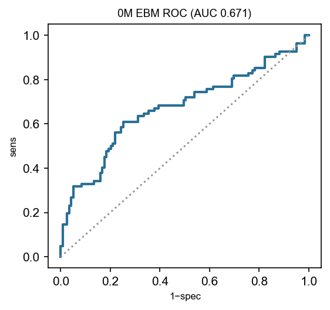

**图 F02 · 0M EBM 精确率-召回率(AP 0.640)**

AP 0.640,高于阳性基线(约 0.41 事件率);低召回区精确率 0.8–1.0,recall>0.6 后跌破 0.5 向基线收敛——仅最高危少数人次可靠,扩大覆盖即精度受损。

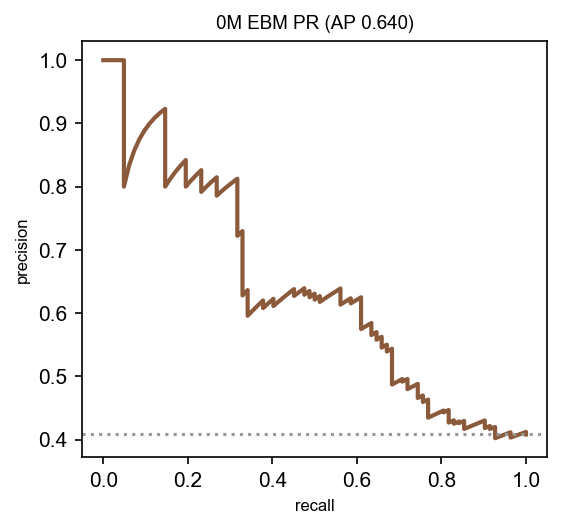

**图 F03 · 0M EBM 校准可靠性**

5 分箱:高预测区贴对角线,低预测区非单调摆动、整体略偏对角线下方,与校准斜率 0.65、略过自信一致;低危端分箱不稳与样本量小有关。

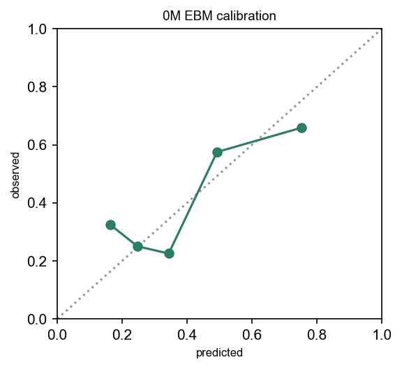

**图 F04 · 0M EBM 原生重要性 top-6**

甲状腺重量以约 0.55 遥遥领先(约为第二名 3.5×),其后为若干抗体相关交互与病程——0M 风险几乎由基线甲状腺负荷主导;多项 top 为两两交互,体现 EBM 可解释优势。

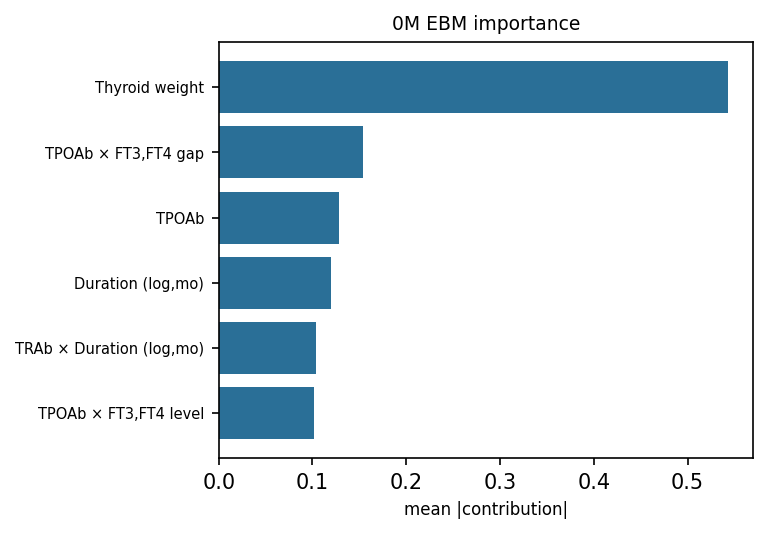

**图 F05 · 0M 形状函数 #1:甲状腺重量**

单调递增:小腺体(<30 g)贡献最小、30–100 g 间 S 形陡升、>100 g 饱和于约 +1.6——典型剂量-反应阈值,大甲状腺是基线最强复发信号(零点为模型内部参考,见 §3.5 说明)。


**图 F06 · 0M 形状函数 #2:TPOAb**

幅度很小(±0.15),中等水平略增风险、极高值(约 >650)反降,呈非单调阶梯;量级远小于甲状腺重量,仅弱辅助信号,高值突降疑样本稀疏/分箱效应,解读谨慎。

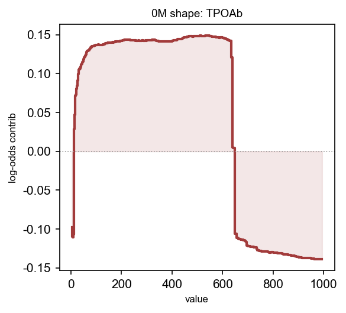

**图 F07 · 0M 决策曲线(DCA)**

阈值 0.05–0.28 与 treat-all 几近重合,阈值>0.3 后 EBM 净获益持续高于 treat-all/treat-none——中-高决策阈值下模型分诊优于"全治/全不治",具临床实用价值。

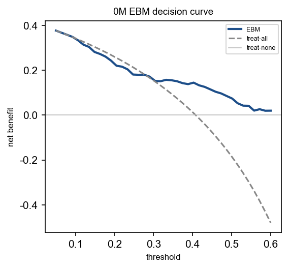

**图 F08 · 0M 风险三档(dev 三分位)事件率**

high 0.62 明显高于 low 0.31 / mid 0.24,但 low>mid 出现倒置、非单调——基线模型仅能可靠分出最高危一档,中低危分辨不足,与 AUC 0.671 一致。

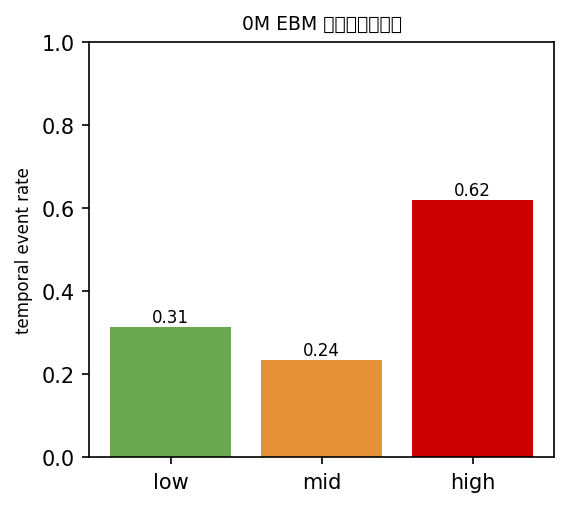

**图 F09 · 0M 混淆矩阵(Youden 阈值)**

阈值 0.32(N=201):TN65/FP54/FN26/TP56,灵敏度 0.68、特异度 0.55、精确率 0.51——低阈值换高灵敏但假阳偏多,基线时点为提检出牺牲特异度的折中。

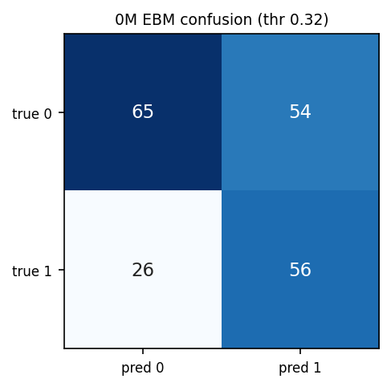

=======
>>>>>>> origin/m1m3-v2-lasso-trajectory
### 3.2 早期 1M — 甲状腺重量为锚、甲功起步(9 图)

**图 F10 · 1M EBM ROC(AUC 0.709)**

凸向左上,AUC 0.709,中等;低假阳性区即陡升至灵敏度约 0.4,对少数高把握病例识别较好、中段平缓。

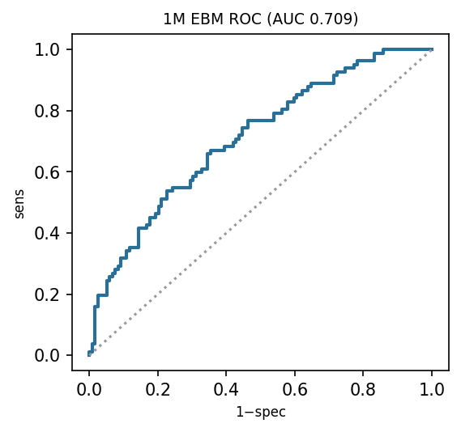

**图 F11 · 1M EBM 精确率-召回率(AP 0.626)**

AP 0.626,显著高于基线 0.41;精确率在召回约 0.15 达峰(约 0.86)后单调下行至全召回时回落基线——高召回以精确率为代价。

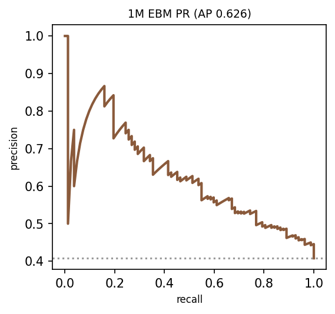

**图 F12 · 1M EBM 校准**

整体位于对角线下方(系统偏高、过度自信,斜率约 0.70);中段两箱观测率平台,小样本分箱噪声可见。

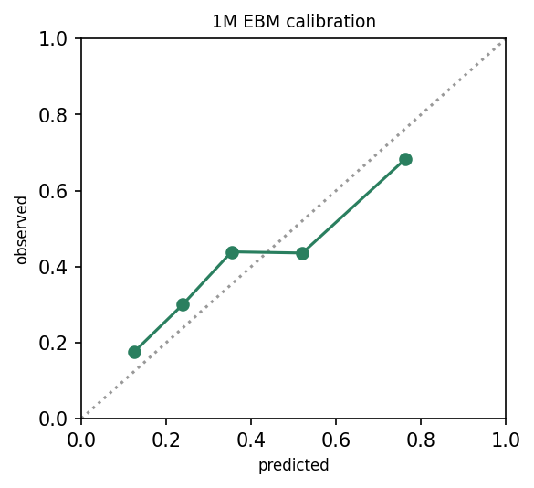

**图 F13 · 1M EBM 原生重要性 top-6**

甲状腺重量约 0.47 绝对主导(约为第二名「FT3,FT4 综合水平」0.19 的两倍余),甲功综合水平开始进场——1M 是"甲状腺重量为锚、甲功起步"的过渡时点。

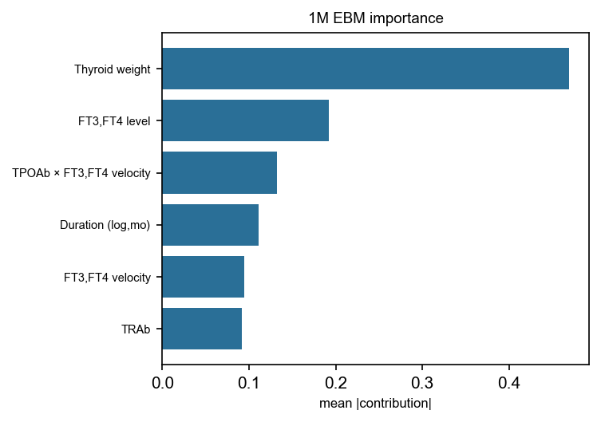

**图 F14 · 1M 形状函数 #1:甲状腺重量**

单调递增饱和型:小腺体(<25 g)贡献最小、50 g 附近陡升、>100 g 平台(约 +1.4)——腺体越大风险越高且边际递减(零点为模型内部参考)。

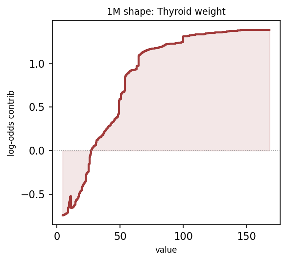

**图 F15 · 1M 形状函数 #2:FT3,FT4 综合水平**

**大白话读法**:横轴是这位病人在 1M 时 FT3、FT4 综合水平,**用 dev 集 802 例的 1M 平均做基准的"高低指数"**;`z = 0` 不是健康正常,是 **dev 1M 群体平均(FT3 ≈ 9.1 / FT4 ≈ 20.6,本身就是轻度甲亢残留,因为治疗才 1 月)**。纵轴是该指标给"复发风险"的加/减分(log-odds)。曲线读法:激素越高(右)模型越加分(变危险),越低(左)越减分(变安全)。

**关键数值**:幅度从 z=−2(FT4 ≈ 4.8,临床甲减)的 −0.4 分,到 z=+5(FT4 极高,残留甲亢未控)的 +0.6 分,**整条单调上升**;曲线"减分变加分"的参考点在 z ≈ −0.7(FT4 ≈ 15.1,**接近 FT4 临床正常上限**)。**这个 −0.7 不是临床安全阈值**(模型 baseline),临床应看相对趋势,不要把它误读为"低于 −0.7 才安全"(详见 §3.5 形状函数零点说明 与**[补充材料 S1 反算表](Module2v2_S1_FT3FT4_z反算表.md)** — 每个 landmark 都给 z → 实际 FT3/FT4 / 临床意义的完整对照)。

**与甲状腺重量对比**:此曲线幅度(±0.5)远小于甲状腺重量曲线(±1.4),所以 1M 时甲状腺重量对风险的影响**大约是 FT3,FT4 综合水平的 3 倍** — 1M 是"甲状腺重量为锚、甲功起步"的过渡时点。

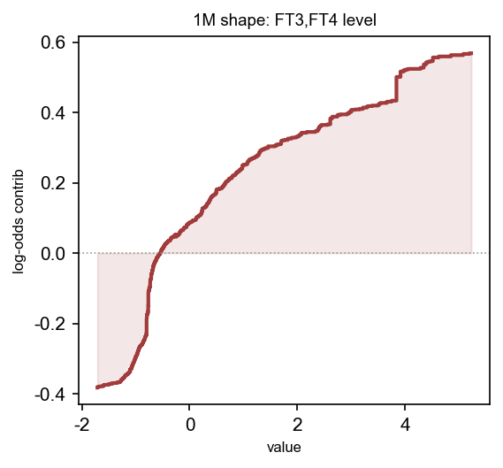

**图 F16 · 1M 决策曲线**

几乎全阈值区间(0.05–0.6)EBM 净获益不低于两条参考线,阈值>0.2 后对 treat-all 优势持续扩大——临床合理阈值范围内有正向净获益。

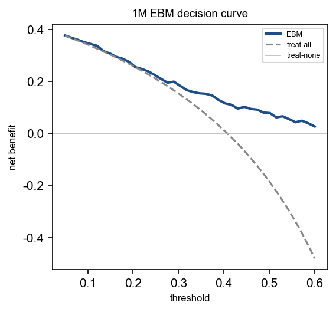

**图 F17 · 1M 风险三档事件率**

单调:low 0.21 / mid 0.38 / high 0.57,高低相差约 2.7×,外部时间集能分出风险梯度;最高档绝对风险仅 0.57,分离幅度中等。

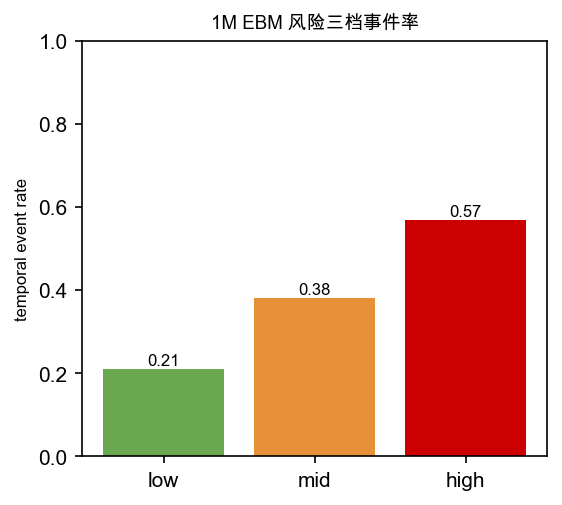

**图 F18 · 1M 混淆矩阵(Youden)**

阈值 0.28:TP63/FN19(灵敏度 0.77)、TN58/FP61(特异度 0.49)——牺牲特异度换高检出,约半数未复发者被判阳,漏诊少误报偏多。

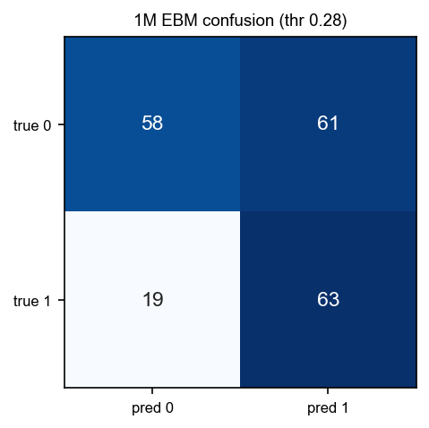

### 3.3 中期 3M — 当期甲功水平接管(9 图)

**图 F19 · 3M EBM ROC(AUC 0.804)**

AUC 0.804,低假阳性区即升至 0.65–0.75 灵敏度,判别力已较强;阶梯状属小样本(N=201)正常表现。

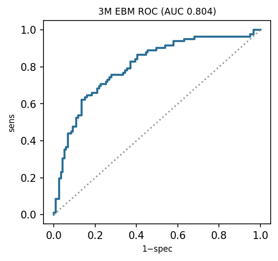

**图 F20 · 3M EBM 精确率-召回率(AP 0.721)**

AP 0.721,远高于基线;精确率在召回 0.2–0.6 稳定约 0.8,召回>0.7 后下滑——中高召回区仍保持较好阳性预测价值。

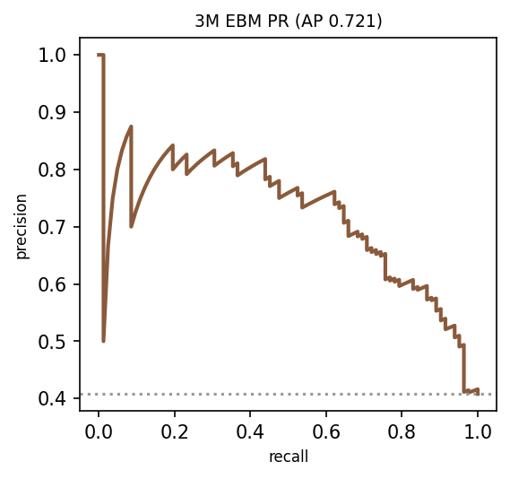

**图 F21 · 3M EBM 校准**

贴近对角线、五点单调,中段略偏上、高段略偏下,与斜率约 0.76(轻度过自信)一致,绝对偏差小——概率基本可信、可直接分层。

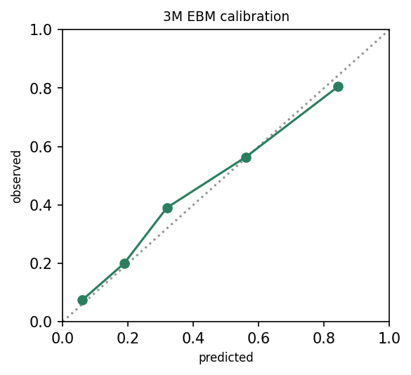

**图 F22 · 3M EBM 原生重要性 top-6**

「FT3,FT4 综合水平」约 0.53 居首,甲状腺重量 0.37 退居第二,当期 TSH 0.28 第三——当期甲功水平接管首位主导,体现"当前状态"对近期复发的强预测。

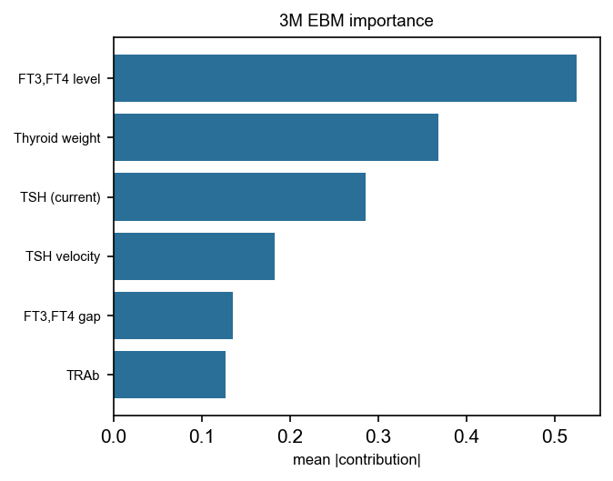

**图 F23 · 3M 形状函数 #1:FT3,FT4 综合水平**

单调递增强非线性:均值附近(z ≈ 0)骤升、z = 2 与 4 附近台阶式跳升,**贡献从约 −0.7 升到 +1.6**——当期甲功越高风险贡献越大,低值降风险、高值饱和(零点为模型内部参考,见 §3.5)。

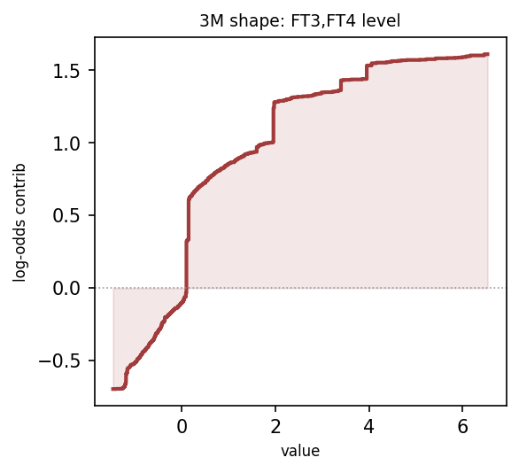

**图 F24 · 3M 形状函数 #2:甲状腺重量**

单调递增饱和:小腺体(<30 g)贡献最小、>100 g 平台(约 +1.1)——体积越大贡献越高,超 100 g 边际消失,符合生理饱和(零点为模型内部参考)。

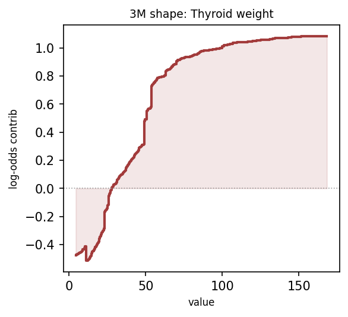

**图 F25 · 3M 决策曲线**

约 0.1–0.6 阈值区间 EBM 净获益持续高于两条参考线(其在约 0.41 交叉),临床相关阈值区间使用模型有实际净获益。


**图 F26 · 3M 风险三档事件率**

单调:low 0.10 / mid 0.32 / high 0.69(高档约低档 7×),外部时间窗内有效区分梯度,可支撑分层随访。


**图 F27 · 3M 混淆矩阵(Youden)**

阈值 0.28:TN76/FP43/FN17/TP65,灵敏度 0.79、特异度 0.64——偏高灵敏(多些假阳换更少漏诊),契合复发筛查"宁错召不漏诊"。

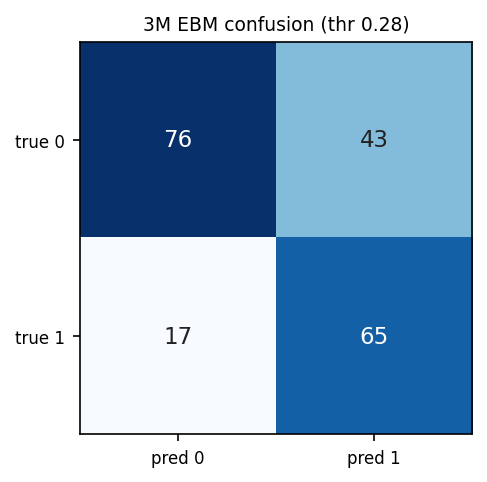

### 3.4 后期 6M — 激素动量主导(非线性,9 图)

**图 F28 · 6M EBM ROC(AUC 0.817)**

AUC 0.817——1M/3M/6M 三时点中最高;低假阳性区即升至约 0.6 灵敏度、1−spec≈0.6 处达约 0.96,良好凸形——后期"激素变化趋势"信号使模型在控误报下捕获多数复发。

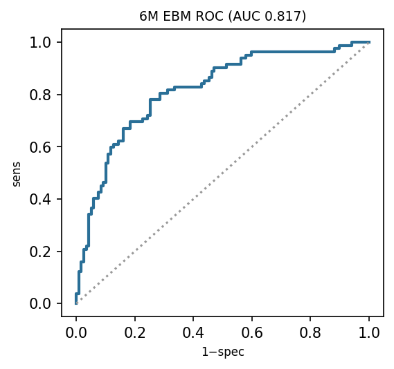

**图 F29 · 6M EBM 精确率-召回率(AP 0.747)**

AP 0.747,远高于基线;精确率在召回 0–0.7 稳定 0.75–0.85,召回>0.8 才明显下滑——保留高查全时仍维持较好查准。

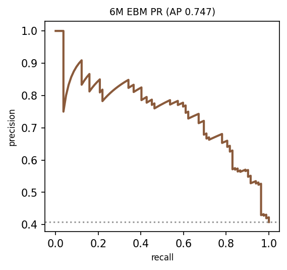

**图 F30 · 6M EBM 校准**

五点紧贴 45° 理想线、斜率约 0.83(三时点最佳),低/高端轻微偏下、中段略高估,整体偏差小无系统性偏移——概率可直接用于分层。

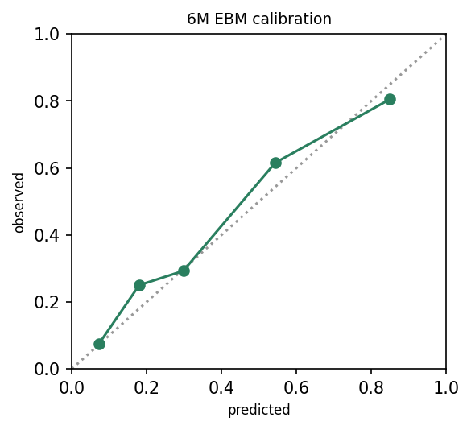

**图 F31 · 6M EBM 原生重要性 top-6**

「FT3,FT4 综合变化速度」约 0.62 居首、「TSH 变化速度」0.42 次之、甲状腺重量 0.38 第三,三者远超其后——6M "激素变化趋势/动量"已主导预测,超越任何单一当前水平。

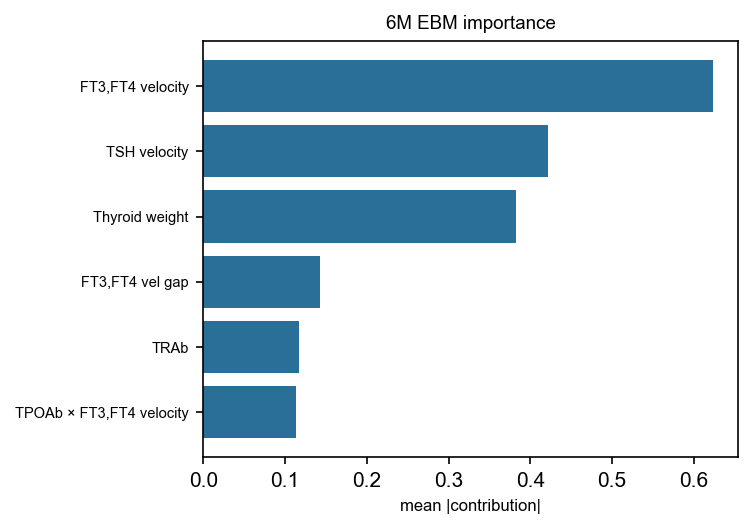

**图 F32 · 6M 形状函数 #1:FT3,FT4 综合变化速度(核心图)**

单调递减强非线性:速度为负(激素未充分回落)贡献强正(+1.5~+1.85),0 附近急剧跨基线陡降,速度为正后转约 −0.65——"激素未下行甚至回升"是最强复发驱动,阈值集中在零点;**线性 LR 无法刻画此拐折,故低估该动量效应**。

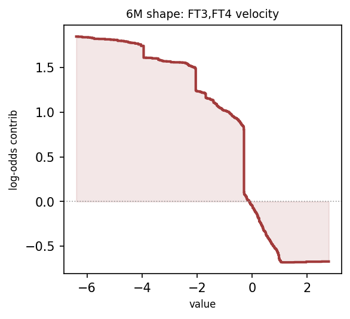

**图 F33 · 6M 形状函数 #2:TSH 变化速度**

单调递增,TSH 速度极负(受抑迟不回升)约 −0.9 负贡献,0 附近骤升、轻度正值达约 +0.35——TSH 回升越快风险越低;幅度(±1 内)小于 FT3/FT4 速度,与其居次相符。

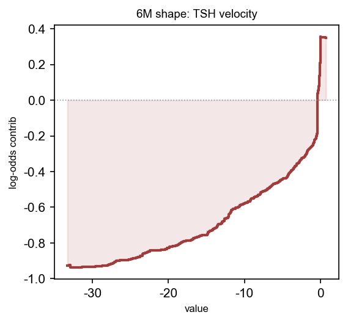

**图 F34 · 6M 决策曲线**

全阈值区间(0.07–0.6)EBM 净获益持续高于两条参考线(treat-all 约 0.42 后转负),阈值 0.6 处仍约 0.12——临床合理阈值内均有正向净获益。

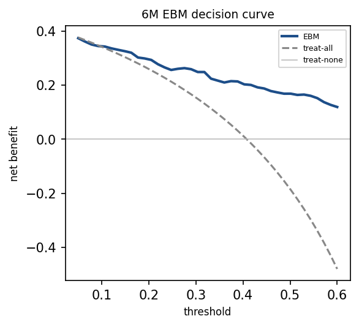

**图 F35 · 6M 风险三档事件率**

单调:low 0.09 / mid 0.32 / high 0.74(高低相差约 8×),分层区分度好。

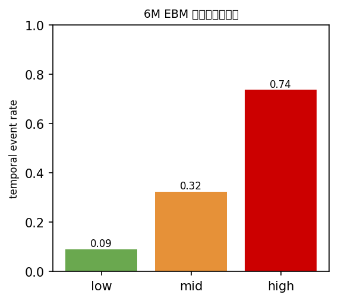

**图 F36 · 6M 混淆矩阵(Youden)**

阈值 0.32:TN89/FP30/FN20/TP62,灵敏度 0.76、特异度 0.75 均衡;20 例假阴提示该阈值下仍漏检约 1/4 复发,更重查全可下调阈值。

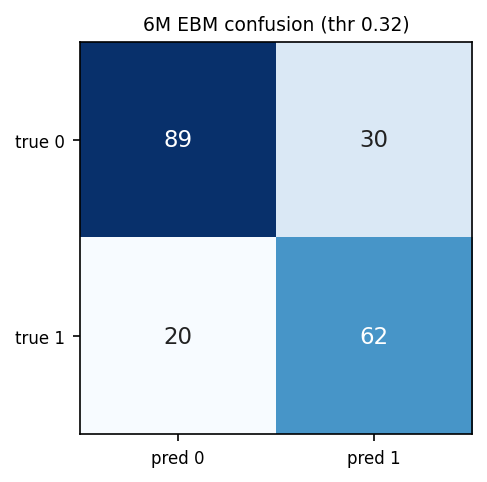

### 3.5 跨地标汇总(11 图)

<<<<<<< HEAD
> **F41(组热力图)与 F31 等单特征条形图的数值关系**:F41 按**组聚合**(将同组的若干单特征 importance 求和,如 `Antibodies` 组 = `TRAb + TGAb + TPOAb` 之和),F31 / F22 等是**单特征 top-6**;**所以同名行的数值不必相等**(组里只有一个单特征时才相等,如 6M 的 `FT3,FT4 velocity` 组 = 单特征 `Velocity_load` = 0.62、`Goiter` 组 = `ThyroidW` = 0.38)。两图回答不同问题:F41 = "哪类信号最重要"(临床叙事);F31 = "哪个单变量贡献最大"(模型解释)。
>
> **形状函数零点的读法(适用 §3.1–§3.4 所有形状图)**:EBM 形状函数 `f(x)` 的 `f=0` 是**模型内部参考点**(cyclic boosting 在训练集上的 baseline 选择),**不是临床安全阈值**;`f(x)>0` 表示该 x 比该参考点抬升风险,`f(x)<0` 表示降低风险;参考点位置受训练集分布影响,**临床转化应看相对趋势(单调 / 拐点)与决策曲线(DCA)给的工作阈值**,而非把形状函数零点当作"安全/危险"分界。
=======
> 说明:本节汇总图(F37/F38/F39/F41/F42/F44/F46)由 `module2_v2_ebm_atlas.py` 一次性生成、含 0M 治疗前点作**视觉对照**(图本身保留 4 landmark 视图未重生);**性能与重要性的叙述统一以 1M / 3M / 6M 为主线**,0M 数字在 caption 中不再单列。
>>>>>>> origin/m1m3-v2-lasso-trajectory

**图 F37 · ROC/PR/Brier 随地标**

判别/校准随治疗后随访改善:ROC-AUC 1M 0.709→6M 0.817、PR-AUC ~0.63→~0.75、Brier ~0.21→~0.17;**3M 是性能跃升拐点**(图含 0M 治疗前点仅作灰色对照)。

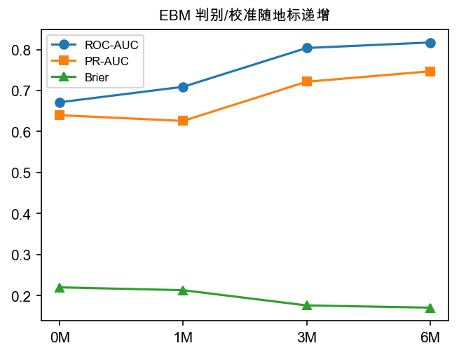

**图 F38 · EBM vs 简约 LR 逐地标 AUC**

两者逐地标 AUC 几乎重合(全程差约 0.01–0.02,1M LR 略高),无地标显示 EBM 系统占优——印证**特征天花板**:增复杂度突破不了线性上限,EBM 价值在可解释而非判别增益。

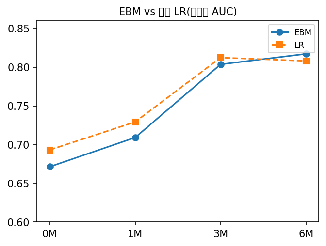

**图 F39 · EBM 全地标 ROC 合并**

3M(绿)/6M(红)明显更贴左上且近重叠,1M 更近对角线——判别力随治疗后随访递增、3M 后趋饱和;低假阳性区 6M 灵敏度已约 0.7,适合高特异工作点。

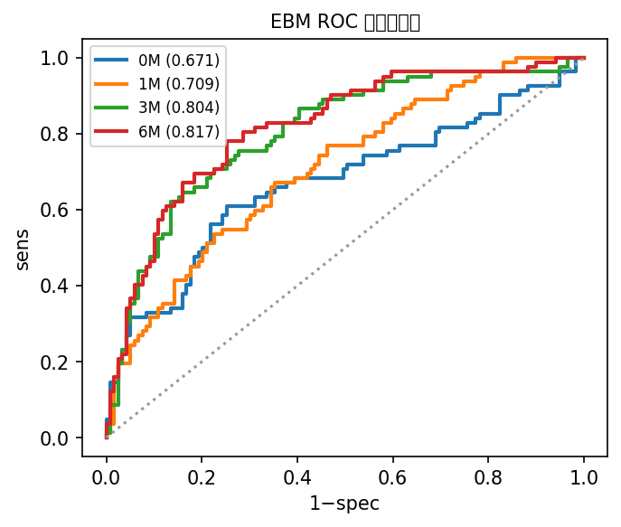

**图 F40 · EBM 多 seed(5)temporal AUC 稳定性**

每地标盒须极窄(跨度 0.01–0.02)、四箱完全不重叠逐级抬升——性能对种子高度稳健、随访增益真实;1M 一个约 0.705 离群点但离散仍小。

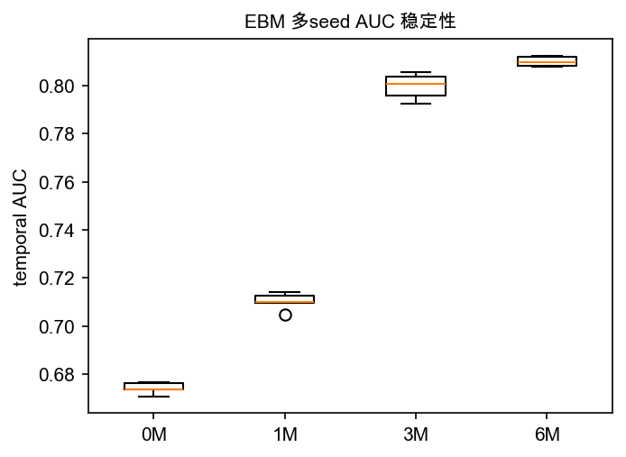

**图 F41 · 原生重要性 组×地标 漂移热力图**

甲状腺重量在 1M 主导(0.47)→3M 让位「FT3,FT4 综合水平」(0.52)→6M 切换「FT3,FT4 综合变化速度」(0.62)+TSH 速度(0.42);"静态体积→动态水平→动态速度"轨迹合生理,抗体/基线中等平稳、RAI 剂量始终偏低。

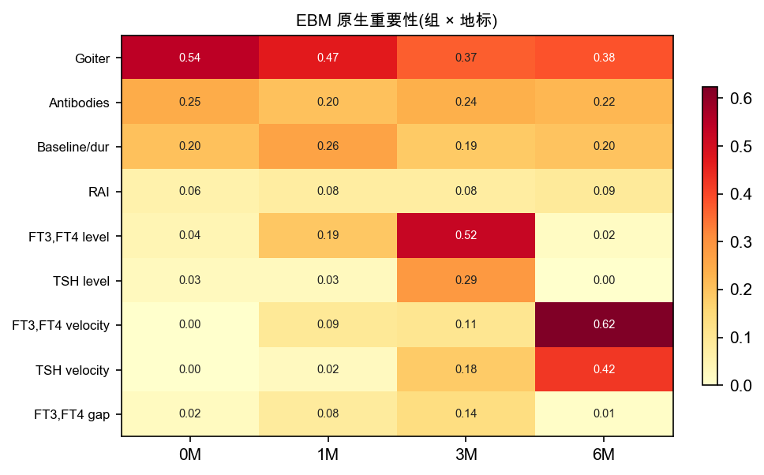

**图 F42 · 校准截距/斜率汇总**

1M / 3M / 6M 三点沿对角线向理想点(0, 1)逼近,斜率全程<1(略过自信),早期尤甚——临床应用前建议对早期地标重校准(如等渗回归)。

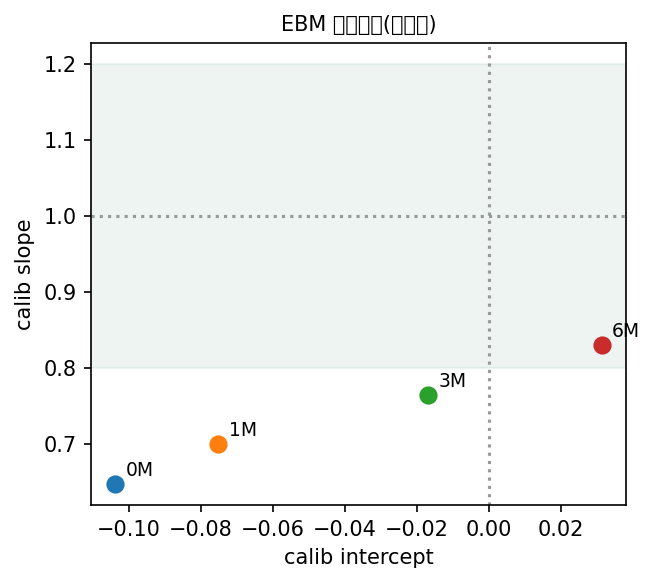

**图 F43 · 共线性:FT3/FT4 同向 vs TSH 反向**

corr(FT3,FT4)全程强正 0.80–0.90,corr(TSH,FT4)为负(3M 最深 −0.44),体现垂体负反馈反向——故聚合 FT3/FT4 为正交轴、TSH 单列合理;6M 的 TSH 相关异常翻正(≈+0.72)疑该地标 TSH 多被抑制/归一所致,值得核查。

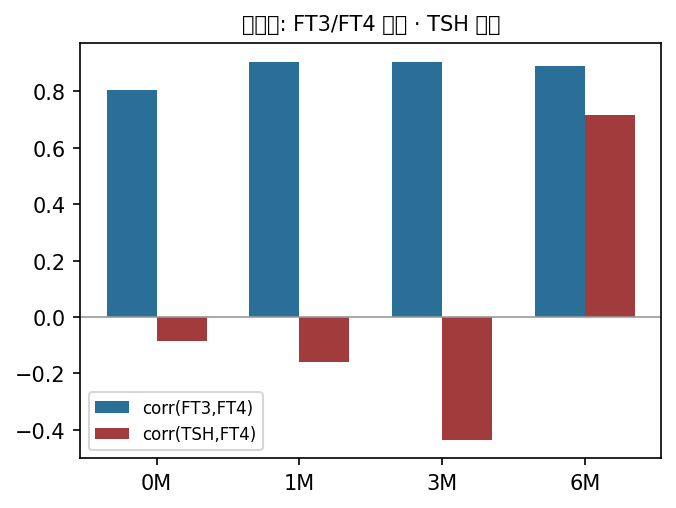

**图 F44 · 各地标主导特征形状函数面板**

1M 甲状腺重量单调饱和(>25–30 g 转正、>100 g 平台);3M「FT3,FT4 综合水平」递增 S 形;6M「FT3,FT4 综合变化速度」反向下降(速度正=高风险、负=保护)——定量刻画"动量"概念,阶梯跳变源自 EBM 分箱。

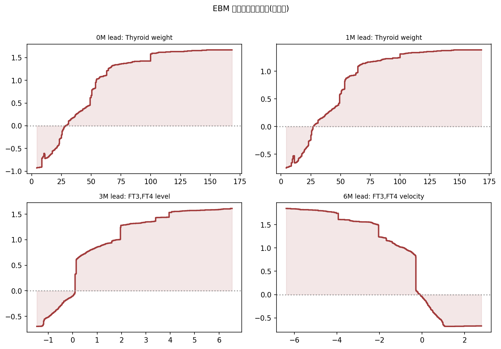

**图 F45 · 选择性预测 风险-覆盖(pooled)**

弃权 0→50% 时保留人群 accuracy 约 0.66→0.74、NPV 约 0.78→0.89,两线全程上行无回撤——不确定性排序有效;弃 50% 得约 0.74 准确率与约 0.89 高 NPV,适合"高置信自动决策、低置信转专家"分诊。

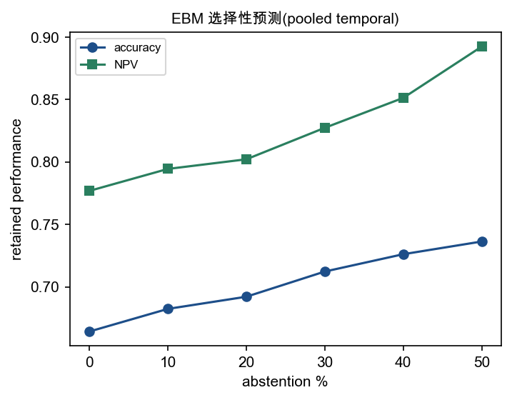

**图 F46 · 各地标工作点 Sens/Spec/PPV/NPV**

1M 偏"高敏低特"(Spec 仅 0.49),3M 起趋均衡(Sens 0.79/NPV 0.82),6M 最佳平衡(Sens/Spec 均 0.75);NPV 全程领先而 PPV 偏低——模型更擅长"排除复发",宜作阴性安抚/降级随访而非阳性确诊。

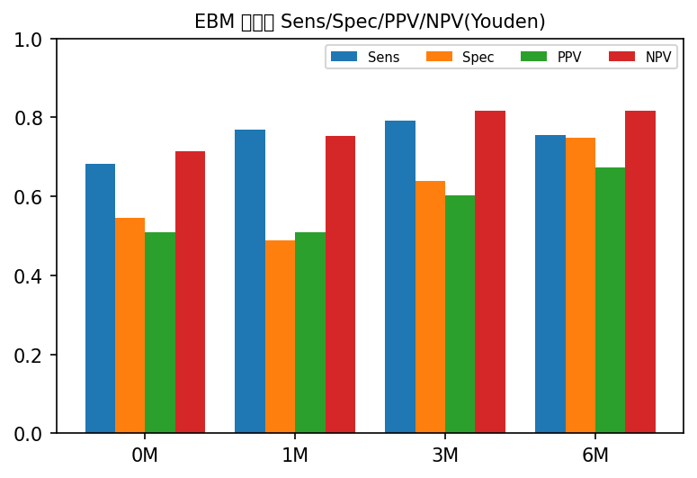

**图 F47 · pooled 校准(全地标合并)**

六点基本贴对角线,低风险段轻微低估、中高段几乎落在理想线——合并后比单一早期地标更接近理想,跨地标概率可直接用于风险沟通。

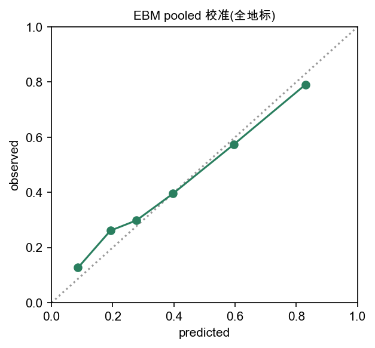

### 3.6 自动发现的两两交互项 — 医学解读与可信度分级

EBM 在拟合时自动选择两两交互项(`f & g` 形式,扣除两特征主效应后的剩余 2D 贡献)。为避免"硬讲故事",**我们只把有强医学证据的交互纳入正式解读**——以下 3 项各自满足"剂量学/文献/跨地标稳定"中至少一条;EBM 还自动选出的其余弱交互(如 0M 时点 `TPOAb × FT3,FT4 综合水平`(0.101)、`TPOAb × FT3,FT4 落差`(0.154))**因主效应弱或无文献支撑、易过度解读**,不在此处呈现,数值透明保留在 `ebm_paper_summary.json` 供审计:

| 交互项 | landmark | 重要性 | 临床/机制解读 | 可信度 |
|:--|:--:|:--:|:--|:--:|
| **ThyroidW × HalfLife** | (跨配置) | 0.06–0.08 | RAI 剂量学公式(Marinelli):有效剂量 ∝ 甲状腺重量 / (摄取率 × 有效半衰期)。两者乘积本来就是剂量学分子分母 → EBM 在抓"有效辐射剂量"这一隐变量。大腺体 + 短半衰期 → 剂量不足 → 易复发;大腺体 + 长半衰期 → 剂量充分 → 易愈合。 | ★★★(剂量公式级合理) |
| **TRAb × 病程(log)** | 0M | 0.104 | 文献 [PMC12765878](https://pmc.ncbi.nlm.nih.gov/articles/PMC12765878/):**"病程越短 → TRAb 越高 → 复发风险越高"**。机制:短病程 + 高 TRAb = 新诊断、免疫未经 ATD 充分调节就直接 RAI → 残余免疫活性高 → 易复发;长病程 + 低 TRAb = 经长期 ATD 调节、免疫已部分熄灭 → 更易愈合。EBM 学到的是 2D 曲面,可捕捉"短病程-高 TRAb"特定象限的风险陡升。 | ★★★(文献直接支撑) |
| **TPOAb × FT3,FT4 综合变化速度** | 1M / 6M | 0.133 / 0.114 | **两个 landmark 都出现 → 模式稳定**。TPOAb 阳性 = 桥本式自身免疫背景(腺体淋巴浸润);RAI 杀伤腺体时,TPOAb 阳性会协同 RAI 让甲功下降更陡、更易过冲到甲减或不稳定波动。文献:TPOAb 阳性预测 RAI 后甲减 / 影响甲功变化速率([PMC9254270](https://www.ncbi.nlm.nih.gov/pmc/articles/PMC9254270/))。 | ★★(机制清晰 + 跨地标稳定) |

**整体判断**:
- **3 项纳入解读的交互各有不同证据底气**:`ThyroidW × HalfLife` 为剂量学公式级合理、`TRAb × 病程` 有直接文献支撑、`TPOAb × FT3,FT4 综合变化速度` 跨 landmark(1M 与 6M 同时出现)稳定;
- **未纳入的弱交互(透明保留)**:EBM 在 0M 时点还学到了 `TPOAb × FT3,FT4 综合水平`(0.101)与 `TPOAb × FT3,FT4 落差`(0.154)两项,因 FT3,FT4 落差作为主效应几乎无独立预测信号(group drop-AUC ≈ 0)、且两项均无直接文献,**主效应弱时纯交互信号易过度解读** → 不在论文正式列表呈现,数值在 `ebm_paper_summary.json` 中保留供审计;
- **跨配置稳定性**:`ThyroidW × HalfLife` 在 atlas 配置中出现、在 paper-summary 不在 top-6 → 同样架构不同种子/配置下 EBM 的交互排序会变;**最稳的指标是同一交互在多个 landmark 重复出现**(如 `TPOAb × 速度`)。

**写论文/部署的免责**:EBM 自动发现的两两交互是统计模式,**不等于因果机制**。上述生物学解读为 plausible(合理化),**非验证**;若要作为临床推荐(如"短病程 + 高 TRAb 者建议 ...")必须通过独立队列前瞻验证。

## 4. 讨论

EBM 在保持与简约模型相当判别力的同时,给出透明、逐时点、非线性的解读,量化了"解剖负荷→激素水平→激素动量"的时间迁移——与临床直觉一致:RAI 早期看腺体大小,随治疗推进看当期甲功,后期看恢复轨迹的快慢。偏差-方差(随机森林可将训练 AUC 拟合至 1.000 而泛化等于 LR)与学习曲线(半量数据即饱和)证明任务处于**特征信息天花板**:增容量、数据增强、级联小模型均无效;EBM 的价值在**解释**。生理上 FT3、FT4 为甲状腺输出、TSH 为垂体反馈(方向相反),「综合变化速度」与「TSH 变化速度」反向互补共同主导 6M。**最具临床价值的非线性发现是 6M 的激素动量阈值效应(F32)**:激素"未下行甚至回升"骤增风险,线性模型会低估。

## 5. 局限
- EBM 原生概率早期略过自信(斜率 0.65–0.70,见 F42),建议逐 landmark Platt/等渗重校准后部署。
- 单中心时间外验证(非外部);随访 TRAb 大面积缺失,其轨迹未能利用;6M 各甲功列存在编码特性(集中近 0,见 F43 注),已统一口径处理。
- EBM 跨 landmark 为独立模型;形状阈值需更大样本/外部验证确认。

## 6. 结论
对 RAI 后 Graves 早期复发,**EBM 玻璃盒在不损判别力前提下提供逐时点、非线性、可临床解读的风险解释**,并稳健刻画"解剖负荷→激素水平→激素动量"的重要性时间迁移;性能受特征天花板所限,**选择性预测**为部署提供可靠性增益。EBM 适合作"可解释性主线 + 简约 LR 性能锚"的呈现。

---
### 附录 · 关联与环境
完整探索/诊断(模型谱系、偏差-方差、学习曲线、增强/级联、GRU/GRU-ODE、错例分月、三模型重要性交叉验证)见 [probe 报告](Module2v2_probe_可解释性与诊断.md);EBM vs 12 类 ML 方法对比见 [compare](Module2v2_compare.md);**交互版(plotly,可 hover 读 log-odds + bagging 置信带、可框选缩放、含单病人 waterfall)见 [Module2v2_EBM_interactive.html](Module2v2_EBM_interactive.html)**。环境:本机 uv(torch 2.12 / interpret-core 0.7.8);数据自计算机 rsync;analysis unit = 1003 人次;47 图由读图代理逐张阅读后配注、中文标题经字体注册渲染。
