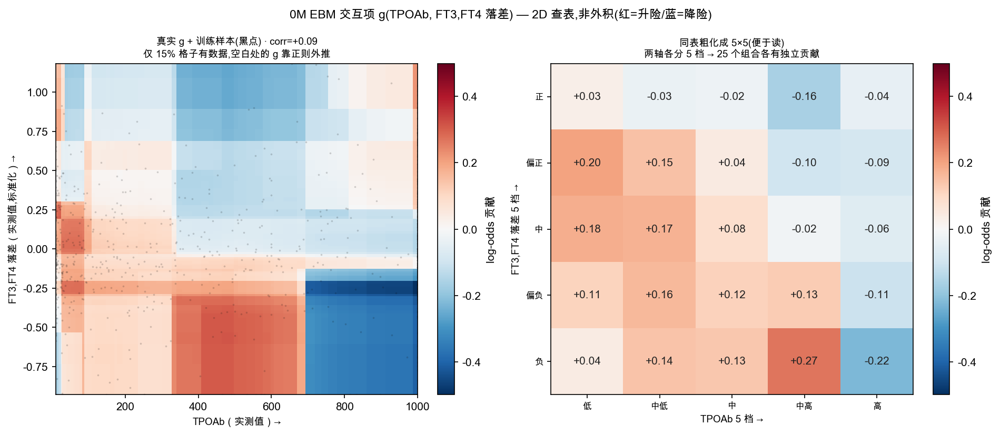

# EBM 玻璃盒:原理 + 在本项目中的应用(图解教程)

> 给临床 / 统计合作者的一份自洽讲义。整合近期讨论,按 **人话 → 数学 → 1D 形状 → 2D 交互 → 正交与共线 → 项目应用 → 自己上手玩** 串起来;图均为本项目 RAI 数据(N=1003 人次)真实训练出的 EBM。
>
> **口径(本版统一)**:corrected 真值(`Current_Time` 列)+ LOCF(激素延续),地标 **1/3/6/12**(0M 由 M1 承担)。时间外 ROC-AUC:1M 0.694 / 3M 0.791 / 6M **0.878** / 12M **0.908**。**重要性叙事修订**:当期甲功水平(「FT3,FT4 综合水平」)自 3M 接管首位并主导 6M / 12M;**激素动量退居 6M 第三、12M 第五,以「水平 × 速度」交互形式提供增量**。~~旧退化口径下「6M 由激素动量(速度)主导」~~ 系主线读退化宽列(`FT4_6M` 仅 13/1003 真值)所致,已更正(详见 §6.2)。

## 0. 一句话

**EBM = 把 logistic regression 的每个 `β·x` 升级成一条可弯的 log-odds 曲线 `f(x)`,再加几个"明示的"二维交互 `g`。** 判别力与 LR 相当,但能读出非线性阈值,且每个病人的预测可逐项审计——这就是"玻璃盒"。

---

## 1. 人话:一张看得懂的账单

多数机器学习模型是黑盒:给个复发概率,说不清为什么。EBM 不同——它为**每个指标单独画一条风险曲线**:这个指标取不同数值时,把复发风险往上推还是往下拉、推多少。最终预测就是各指标贡献的**明账相加**,所以每位病人的风险都能逐项拆开,像一张看得懂的账单。

---

## 2. 数学:LR 是 EBM 的特例

在 logit 尺度上(`p` = 复发概率,`logit(p)=log[p/(1−p)]` 即 log-odds):

```
LR:          logit(p) = β0 + Σ_j β_j · x_j
GAM:         logit(p) = β0 + Σ_j f_j(x_j)
GA2M (EBM):  logit(p) = β0 + Σ_j f_j(x_j) + Σ_{j<k} g_jk(x_j, x_k)
```

- **LR** 把每个变量贡献写成 `β_j·x_j`(过原点、斜率固定的直线),`OR_j = exp(β_j)` 对所有 x **恒定**。
- **EBM** 把它换成任意形状的 `f_j(x_j)`(形状函数),仍在 log-odds 尺度,但斜率可变。把 `f_j` 强制为线性,EBM 立刻退回 LR ⇒ **LR 是 EBM 的特例,两者同尺度可直接对照**。
- **读法**:`f` 从 x₁ 到 x₂ 的高度差 `Δ = f(x₂)−f(x₁)` 就是这段的对数 OR,**局部 OR = exp(Δ)**。斜率随位置变化处即"阈值/拐点"——LR 画不出。
- **怎么学的**:cyclic gradient boosting——成百上千棵浅树,每轮 round-robin 只在单个特征上拟合残差一点点,再累加成 `f_j`,故 `f_j` 是分段常数(台阶),等价于数据驱动地自动分箱。
- **可加 ⇒ 可审计**:任一病人 `η_i = β0 + Σ f_j(x_jⁱ) + Σ g`,每一项就是该指标对这位病人的得分(log-odds,exp 后是对几率的乘法因子)。

---

## 3. 1D 形状函数 `f`:是曲线,不是直线

`f(x)` 是一张 **"x → 贡献" 的查表**,可单调 / 非单调 / 阈值 / 钟形。报告里所有标「shape / 形状」的图都是 `f`。两个最有代表性的:

**(a) `f(甲状腺重量)` @1M —— S 形阈值**:小腺体降风险、约 25–30 g 穿零、>100 g 饱和于约 +1.4。LR 只能给一条斜直线,给不出"先平、再陡、后饱和"。1M 时甲状腺重量是首位锚特征(解剖负荷主导过渡期)。


**(b) `f(FT3,FT4 综合水平)` @12M —— 过均值急升(当期甲功阈值)**:零点附近从约 −1.4 陡升到 +2.0 log-odds(过零一小段的局部 OR ≈ exp(3.4) ≈ 30),高值端饱和平台约 +2.2——"低于均值保护、高于均值急升"的拐折,LR 的单一斜率根本无法表达。**这是 corrected 真值后本项目最有临床价值的非线性发现**:当期甲功水平自 3M 接管首位主导、在 6M / 12M 持续居首,其阈值形状在后期三地标稳定复现。


> **口径变更提示**:~~旧退化口径下,6M 最具代表性的非线性是 `f(FT3,FT4 综合变化速度)` 的「过零陡降(动量拐折)」、且动量居 6M 首位~~。corrected 真值后,**当期甲功水平的阈值形状(上图 b)接管为后期最强、最稳的非线性**;激素动量退居次要,改以「水平 × 速度」交互形式出现(§4 / §6.2)。
>
> 对应图谱(corrected+LOCF):`f(甲状腺重量)` = F05(1M lead);`f(FT3,FT4 综合水平)` = F14(3M)/F23(6M)/F32(12M,后期主导);`f(当期 TSH)` = F24(6M)/F33(12M,反向次之);各地标主导特征并排面板 = F44。交互版里每地标可 hover 的多条曲线全是 `f`。

---

## 4. 2D 交互 `g`:二维查表,不是外积

很多人以为"两个特征的交互"是把两条曲线乘起来(外积 `u(x)·v(y)`,数学上是**秩 1** 平面)。**EBM 的 `g` 不是这个,要灵活得多。**

下图是 0M EBM **真实学到的** `g(TPOAb, FT3,FT4 落差)`:左 = 原始 62×62 网格(每像素一个独立 log-odds 值)+ 训练样本黑点;右 = 同表粗化成 5×5 便于读数。



**`x` 是个什么 x 法?**
- 两个"维度"**不是同一个 x 出现两次**,而是**两个不同指标**各占一根轴(横 = TPOAb 实测值,纵 = 落差标准化值)。
- 每根轴的 `x` = 该指标的**真实测量值**;EBM 把每根轴切成 62 个 bin,两轴交叉 = 62×62 = 3844 个格子。
- 一个病人有 `(TPOAb, 落差)` 两个值 → 各自落进一个 bin → **定位到唯一格子 → 查表读出 g**。就是二维查表,跟查二维直方图一样。EBM **不**做乘积 `x_i·x_j`、不做多项式。

**"耦合"是什么?** 看右图 5×5:"落差为负"这一行,TPOAb 从中高→高,贡献从 **+0.27 翻成 −0.22**(升险→降险)。**一个指标的效应方向,取决于另一个指标当下的取值**——这正是可加模型 `f_i+f_j` 永远做不到的。

**为什么不是外积?** 外积是秩 1,所有列必为同一曲线的等比缩放;真实图那种块状、方向翻转的结构秩 > 1,外积表达不了。EBM 每格自由学,**外积只是它的特例**。

**为什么这样仍叫加性?** `g` 学的是**扣掉两个主效应后剩下的纯交互**(EBM 约束 `g` 每行/列均值≈0,与主效应正交),所以加进总分不重复计 —— 各项仍是相加,玻璃盒成立。

---

## 5. 三种"正交"与共线性(这里最容易混)

把两特征画成网格,**是否假设两维正交?** 不——但这里有三种"正交"在打架:

| 哪种正交 | 含义 | EBM 这里 |
|:--|:--|:--|
| (a) 坐标轴正交 | 把两特征当两根轴张成网格 | ✅ 只是**画法**,对任意两变量都能做,**不假设数据独立** |
| (b) 两特征统计独立 `x_i ⊥ x_j` | 两指标在数据里不相关 | ❌ **不假设、不要求**;相关也照跑,只是有代价 |
| (c) 交互 ⊥ 主效应 `g ⊥ f` | g 扣掉纯 x_i、纯 x_j 成分 | ✅ EBM **真做的正交化**,针对效应分解,**不是** (b) |

**"不假设正交"不等于"相关没后果":** 上图 TPOAb 与落差 `corr=+0.09`(几乎不相关),可 62×62 网格**只有 14.9% 的格子真有样本**(黑点),其余 85% 的 `g` 是正则化外推的、不可信(置信带宽)。后果有二:
1. **稀疏/外推**:两维越相关,样本越挤成一条对角带,空格越多 → 角落 g 纯属脑补。故交互项要**限量**(本项目只放 5 个)、要正则化、读图看置信带。
2. **归因不唯一**:相关时"某段风险算 f 还是 g"有任意性;EBM 给一个确定但非唯一的分解。

**我们的应对——主动把相关特征做成正交轴:** 原始 FT3、FT4 在数据里 `r≈0.8–0.9`(图 F43),直接当两维会严重共线。于是聚合:

```
综合水平 =(zFT3+zFT4)/√2     落差 =(zFT3−zFT4)/√2
实测 corr(综合水平, 落差) = 0.000     corr(综合变化速度, 速度落差) = 0.000  （数学正交）
```

**所以正交不是前提,而是我们为了让查表/归因可信而争取来的性质。**

---

## 6. 在本项目中的应用

### 6.1 定位与继承
M2 = "治疗后早期长期风险更新":在 0/1/3/6M 四个固定地标各训一个 EBM,回答"3 个月 / 6 个月时还要不要担心 24 个月以后"。它**继承 M1** 的基线标量风险作为一个特征,并为 **M3 滚动地标**提供"当前状态 + 动量"的特征模板。

### 6.2 重要性随时间迁移(EBM 的招牌发现)
原生重要性(组×地标)清楚显示主导特征**换人**:甲状腺重量(0M/1M)→ FT3,FT4 综合水平(3M)→ FT3,FT4 综合变化速度 + TSH 变化速度(6M)。即"静态解剖负荷 → 当期激素水平 → 激素动量",与临床直觉吻合。


### 6.3 与简约 LR 同台 = 特征天花板
逐地标 AUC,EBM 与简约 L2-LR 几乎重合(差 0.01–0.02),无地标显示 EBM 系统占优。结合"随机森林可把训练 AUC 拟合到 1.000 而泛化等于 LR、学习曲线半量即饱和",证明任务处于**特征信息天花板**:堆复杂度突破不了上限,**EBM 的价值在解释而非判别增益**。


### 6.4 选择性预测(部署可靠性)
既然性能受特征所限,就让模型对没把握的病例"不下结论、转交医生":按不确定性弃权 0→50% 时,保留人群的准确率 0.66→0.74、NPV 0.78→0.89 全程上行。适合"高置信自动、低置信转人工"的分诊。


### 6.5 交互式可视化
[Module2v2_EBM_interactive.html](Module2v2_EBM_interactive.html) —— plotly 自包含单页:四地标的形状函数(hover 读 log-odds + bagging 置信带、可缩放)+ 重要性条形 + 单病人 waterfall。浏览器直接打开即可拨弄。

---

## 7. 自己上手玩(动态可视化)

> 目前**没有**"网页点开即玩 EBM"的公开 hosted demo;官方动态可视化是本地 `show()` dashboard(基于 plotly)。三条可玩路径:

1. **最直接 —— 本项目交互页**:打开 [Module2v2_EBM_interactive.html](Module2v2_EBM_interactive.html),hover/缩放/看 waterfall,无需装任何东西。
2. **官方 InterpretML dashboard(含 what-if 扰动分析)**:Python 里
   ```python
   pip install interpret
   from interpret import show
   from interpret.glassbox import ExplainableBoostingClassifier
   ebm = ExplainableBoostingClassifier(interactions=5).fit(X, y)
   show(ebm.explain_global())               # 交互:重要性 + 逐特征形状 + 2D 交互面
   show(ebm.explain_local(X[:20], y[:20]))  # 单病人 waterfall + 可扰动特征看预测怎么变
   ```
   在 **Google Colab** 里跑这几行,即可在网页里得到官方交互 dashboard(零本地环境)。
3. **文档与示例**:官方文档 [interpret.ml/docs/ebm.html](https://interpret.ml/docs/ebm.html) 页面里嵌的就是可交互的 plotly 图;源码与更多例子见 [github.com/interpretml/interpret](https://github.com/interpretml/interpret)。

---

### 附录 · 环境 / 数据 / 合规 / 关联
- 环境:本机 uv(torch 2.12 / interpret-core 0.7.8 / plotly 6.7);数据自计算机 rsync。
- 合规:analysis unit = 治疗疗程(N=1003 人次);开发集 OOF 选择、时间外仅报告;图均为真实训练产物。
- 关联报告:[EBM 玻璃盒论文(图文版,47 图)](Module2v2_EBM_paper.md) · [交互版](Module2v2_EBM_interactive.html) · [probe 综合诊断](Module2v2_probe_可解释性与诊断.md) · [EBM vs 12 类 ML 对比](Module2v2_compare.md)。

**Sources(在线资源)**:[InterpretML 官网](https://interpret.ml/) · [EBM 文档](https://interpret.ml/docs/ebm.html) · [interpretml/interpret (GitHub)](https://github.com/interpretml/interpret)
