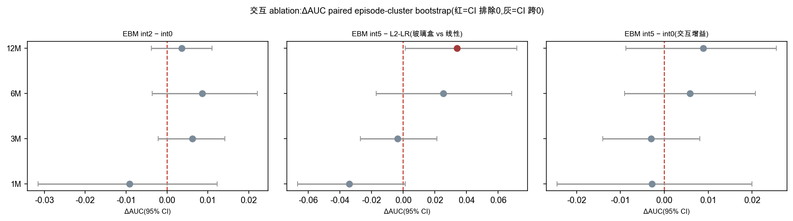
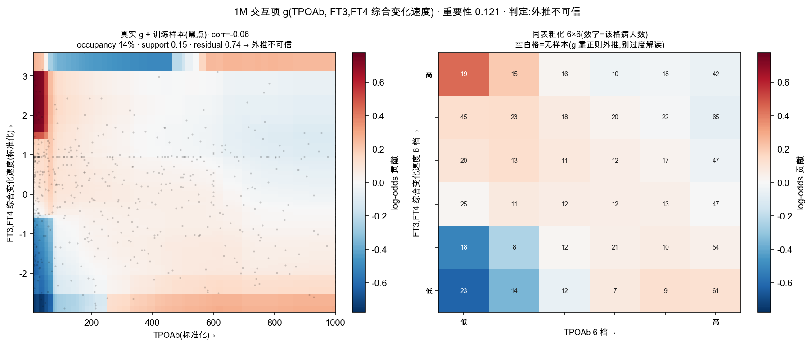
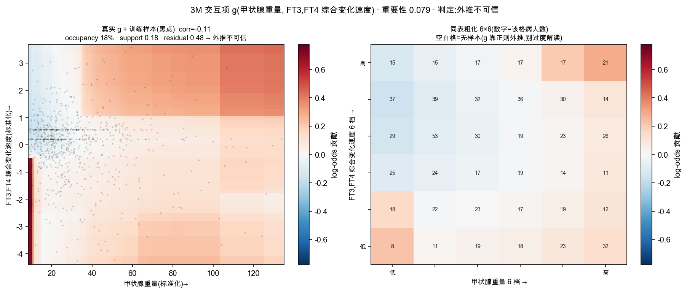
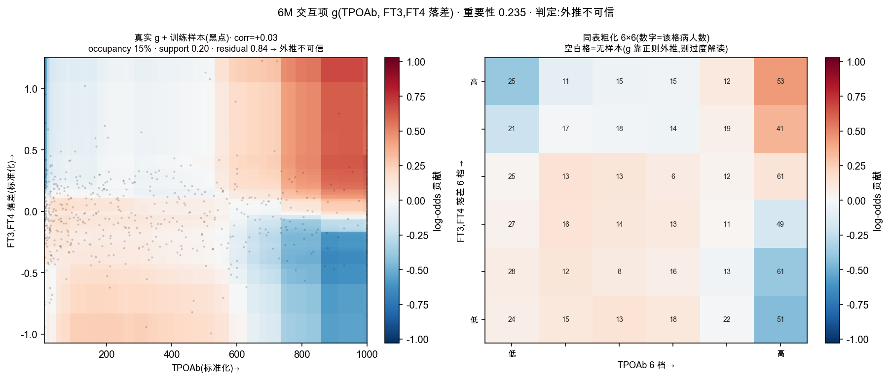
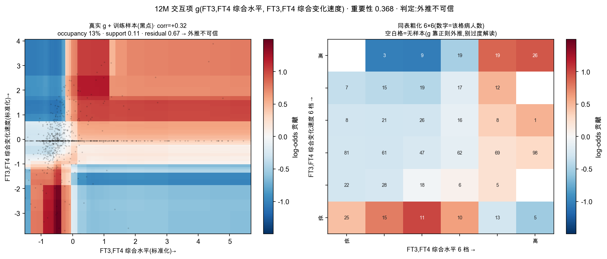
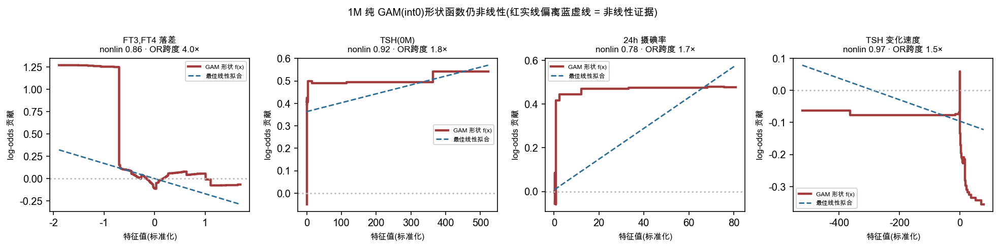
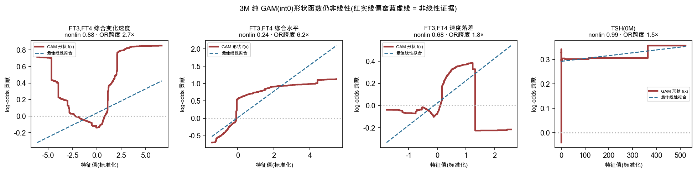
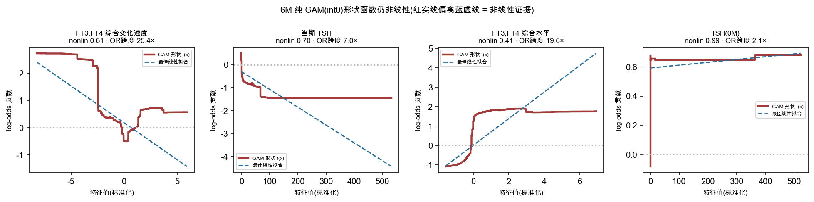
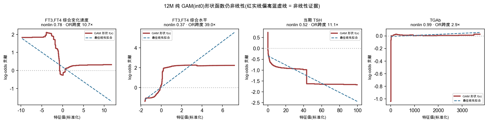

# Module 2·v2 — EBM 交互项诊断与 prune 方法学

> RAI 治疗后 Graves 病早期复发(预测 24M NHRH)· EBM 玻璃盒 · 地标 1/3/6/12M。
> 口径:**corrected 真值 + LOCF(激素延续)** · EBM per-landmark **OOF**(dev 5 折 SGKFold seed13)选择、**temporal 仅作 read-out**。
> 分析单元 = 治疗疗程(**N = 1003 人次**)· episode 级 cluster bootstrap(n=1000)· 含 naive(prevalence)+ persistence(当期 TSH)基线。

本报告回答一个方法学问题:**EBM 自动选出的两两交互项,该不该 prune?** 并对每个交互项做「对冲共线诊断」,判其为 {真 2D / 对冲伪 / 外推不可信}。核心结论:**交互的判别增益其 95% CI 跨 0(逐地标),可 prune;且 prune 是 GA2M→GAM(去交互),GAM 本身仍是非线性玻璃盒,绝非退化到线性 LR**。

## 1. interactions ablation —— 交互项带来多少判别增益?

逐地标拟合 `int∈{0(纯 GAM),2,5(主线 GA2M)}` 的 EBM(同 OOF/temporal 协议、同 seed),与全特征 **L2-LR**、**naive(prevalence)**、**persistence(当期 TSH 单特征 LR)** 并列。交互的净增益用 **paired episode-cluster bootstrap ΔAUC(int5 − int0)** 量化。

### 1.1 时间外性能(各配置 × 各地标)

| 地标 | 模型 | ROC-AUC | PR-AUC | Brier | 校准截距 | 校准斜率 |
|:--:|:--|:--:|:--:|:--:|:--:|:--:|
| 1M | EBM int0 (纯GAM) | 0.698 | 0.631 | 0.213 | -0.04 | 0.74 |
| 1M | EBM int2 | 0.688 | 0.597 | 0.221 | -0.10 | 0.61 |
| 1M | EBM int5 (GA2M) | 0.694 | 0.602 | 0.219 | -0.09 | 0.63 |
| 1M | L2-LR | 0.728 | 0.695 | 0.201 | -0.03 | 0.80 |
| 1M | persistence(当期TSH) | 0.551 | 0.434 | 0.238 | +0.17 | 0.87 |
| 1M | naive(prevalence) | 0.500 | 0.408 | 0.243 | -0.37 | -0.00 |
| 3M | EBM int0 (纯GAM) | 0.794 | 0.744 | 0.178 | +0.05 | 0.91 |
| 3M | EBM int2 | 0.800 | 0.746 | 0.176 | +0.06 | 0.89 |
| 3M | EBM int5 (GA2M) | 0.791 | 0.727 | 0.180 | +0.02 | 0.80 |
| 3M | L2-LR | 0.795 | 0.768 | 0.176 | +0.00 | 0.84 |
| 3M | persistence(当期TSH) | 0.684 | 0.539 | 0.225 | +0.04 | 0.61 |
| 3M | naive(prevalence) | 0.500 | 0.408 | 0.243 | -0.37 | -0.00 |
| 6M | EBM int0 (纯GAM) | 0.872 | 0.819 | 0.134 | +0.11 | 0.83 |
| 6M | EBM int2 | 0.880 | 0.831 | 0.132 | +0.11 | 0.78 |
| 6M | EBM int5 (GA2M) | 0.878 | 0.839 | 0.135 | +0.12 | 0.72 |
| 6M | L2-LR | 0.852 | 0.836 | 0.147 | +0.11 | 0.95 |
| 6M | persistence(当期TSH) | 0.754 | 0.623 | 0.222 | +0.21 | 0.92 |
| 6M | naive(prevalence) | 0.500 | 0.408 | 0.243 | -0.37 | -0.00 |
| 12M | EBM int0 (纯GAM) | 0.899 | 0.878 | 0.125 | +0.31 | 1.04 |
| 12M | EBM int2 | 0.902 | 0.880 | 0.124 | +0.34 | 1.03 |
| 12M | EBM int5 (GA2M) | 0.907 | 0.883 | 0.119 | +0.22 | 0.88 |
| 12M | L2-LR | 0.874 | 0.867 | 0.131 | +0.20 | 1.10 |
| 12M | persistence(当期TSH) | 0.751 | 0.646 | 0.229 | +0.01 | 0.55 |
| 12M | naive(prevalence) | 0.500 | 0.408 | 0.243 | -0.37 | -0.00 |

### 1.2 交互判别增益 ΔAUC(paired episode-cluster bootstrap)

> CI 排除 0 = 该对比的判别差异方向确定;CI 跨 0 = 无法与 0 区分。bootstrap n=1000。

| 地标 | 对比 | ΔAUC | 95% CI | 判定 |
|:--:|:--|:--:|:--:|:--:|
| 1M | EBM int5 − int0(交互增益) | -0.0028 | [-0.0244, +0.0200] | 跨 0 |
| 1M | EBM int2 − int0 | -0.0092 | [-0.0315, +0.0123] | 跨 0 |
| 1M | EBM int5 − L2-LR(玻璃盒 vs 线性) | -0.0341 | [-0.0667, +0.0012] | 跨 0 |
| 3M | EBM int5 − int0(交互增益) | -0.0030 | [-0.0140, +0.0081] | 跨 0 |
| 3M | EBM int2 − int0 | +0.0062 | [-0.0022, +0.0142] | 跨 0 |
| 3M | EBM int5 − L2-LR(玻璃盒 vs 线性) | -0.0035 | [-0.0270, +0.0213] | 跨 0 |
| 6M | EBM int5 − int0(交互增益) | +0.0058 | [-0.0091, +0.0207] | 跨 0 |
| 6M | EBM int2 − int0 | +0.0086 | [-0.0036, +0.0221] | 跨 0 |
| 6M | EBM int5 − L2-LR(玻璃盒 vs 线性) | +0.0253 | [-0.0170, +0.0685] | 跨 0 |
| 12M | EBM int5 − int0(交互增益) | +0.0089 | [-0.0088, +0.0255] | 跨 0 |
| 12M | EBM int2 − int0 | +0.0036 | [-0.0038, +0.0110] | 跨 0 |
| 12M | EBM int5 − L2-LR(玻璃盒 vs 线性) | +0.0341 | [+0.0012, +0.0718] | **排除 0** |

*交互 ablation ΔAUC forest plot:int5−int0(交互增益)/ int2−int0 / int5−L2-LR(玻璃盒 vs 线性)逐地标 95% CI;红=CI 排除 0,灰=CI 跨 0。*

**结论**:`int5 − int0`(交互增益)在 **4/4 个地标 CI 跨 0** —— 自动两两交互的判别增益与 0 不可区分。去掉交互(int0,纯 GAM)不损判别力 → **支持 prune**。

## 2. 对冲共线诊断 —— 每个交互项是「真 2D」还是「对冲伪/外推」?

**预注册阈值(真 2D 判据)**:`frac_var_residual ≥ 0.35` (扣掉可加近似后的残差方差占比,衡量「对角性/真二维」)**且** `occupancy ≥ 40.0%`(有≥1 样本的格子比例)**且** `support_energy ≥ 0.6`(被占格内的 |g| 能量占总能量比例)。三者任一不达标 → 占用不足/能量在外推区 → 判为 **对冲伪 / 外推不可信**。

> 诊断量:`corr(A,B)`=两特征 dev 相关;`same_group`=是否同一特征组(axes.GROUPS);`svd_r1`=2D 曲面首奇异值能量占比(高→近似可分离/外积);`sign_consistency`=样本足够格(n≥5)上 g 符号与「实测事件率 − 全局率」符号的一致率。

### 2.1 1M 地标(5 个交互项)

| 交互项 | 重要性 | corr | 同组 | occ% | support | residual | svd_r1 | 符号一致 | 判定 |
|:--|:--:|:--:|:--:|:--:|:--:|:--:|:--:|:--:|:--:|
| TPOAb × FT3,FT4 综合变化速度 | 0.121 | -0.06 | 否 | 14 | 0.15 | 0.74 | 0.91 | 0.64 | 外推不可信 |
| 甲状腺重量 × TSH 变化速度 | 0.083 | +0.00 | 否 | 7 | 0.06 | 0.63 | 0.95 | 0.80 | 外推不可信 |
| 碘半衰期 × FT3,FT4 落差 | 0.081 | -0.02 | 否 | 19 | 0.18 | 0.85 | 0.79 | n/a | 外推不可信 |
| TGAb × FT4(0M) | 0.062 | -0.06 | 否 | 14 | 0.14 | 0.49 | 0.94 | 0.52 | 外推不可信 |
| TGAb × FT3,FT4 综合变化速度 | 0.042 | +0.06 | 否 | 14 | 0.15 | 0.73 | 0.86 | 0.68 | 外推不可信 |

*1M 最重要交互 TPOAb × FT3,FT4 综合变化速度 对冲诊断:左=真实 g 曲面+训练样本(黑点),右=粗化 6×6(数字=该格病人数,空白=外推区)。判定:外推不可信。*

### 2.2 3M 地标(5 个交互项)

| 交互项 | 重要性 | corr | 同组 | occ% | support | residual | svd_r1 | 符号一致 | 判定 |
|:--|:--:|:--:|:--:|:--:|:--:|:--:|:--:|:--:|:--:|
| 甲状腺重量 × FT3,FT4 综合变化速度 | 0.079 | -0.11 | 否 | 18 | 0.18 | 0.48 | 0.53 | n/a | 外推不可信 |
| 24h 摄碘率 × FT3,FT4 综合水平 | 0.076 | -0.02 | 否 | 19 | 0.17 | 0.64 | 0.95 | n/a | 外推不可信 |
| FT4(0M) × FT3,FT4 落差 | 0.071 | -0.05 | 否 | 19 | 0.19 | 0.77 | 0.86 | n/a | 外推不可信 |
| FT3,FT4 综合水平 × FT3,FT4 落差 | 0.069 | +0.00 | 否 | 16 | 0.09 | 0.37 | 0.72 | 0.80 | 外推不可信 |
| FT4(0M) × FT3,FT4 综合水平 | 0.066 | +0.14 | 否 | 19 | 0.16 | 0.75 | 0.97 | n/a | 外推不可信 |

*3M 最重要交互 甲状腺重量 × FT3,FT4 综合变化速度 对冲诊断:左=真实 g 曲面+训练样本(黑点),右=粗化 6×6(数字=该格病人数,空白=外推区)。判定:外推不可信。*

### 2.3 6M 地标(5 个交互项)

| 交互项 | 重要性 | corr | 同组 | occ% | support | residual | svd_r1 | 符号一致 | 判定 |
|:--|:--:|:--:|:--:|:--:|:--:|:--:|:--:|:--:|:--:|
| TPOAb × FT3,FT4 落差 | 0.235 | +0.03 | 否 | 15 | 0.20 | 0.83 | 0.78 | 0.67 | 外推不可信 |
| 当期 TSH × FT3,FT4 综合变化速度 | 0.228 | -0.08 | 否 | 13 | 0.11 | 0.42 | 0.58 | 0.91 | 外推不可信 |
| FT3,FT4 综合水平 × FT3,FT4 综合变化速度 | 0.199 | +0.26 | 否 | 15 | 0.15 | 0.49 | 0.61 | 0.64 | 外推不可信 |
| 24h 摄碘率 × FT3,FT4 综合水平 | 0.174 | -0.03 | 否 | 19 | 0.17 | 0.50 | 0.88 | n/a | 外推不可信 |
| TRAb × 碘半衰期 | 0.159 | -0.18 | 否 | 18 | 0.18 | 0.61 | 0.84 | n/a | 外推不可信 |

*6M 最重要交互 TPOAb × FT3,FT4 落差 对冲诊断:左=真实 g 曲面+训练样本(黑点),右=粗化 6×6(数字=该格病人数,空白=外推区)。判定:外推不可信。*

### 2.4 12M 地标(5 个交互项)

| 交互项 | 重要性 | corr | 同组 | occ% | support | residual | svd_r1 | 符号一致 | 判定 |
|:--|:--:|:--:|:--:|:--:|:--:|:--:|:--:|:--:|:--:|
| FT3,FT4 综合水平 × FT3,FT4 综合变化速度 | 0.368 | +0.32 | 否 | 13 | 0.12 | 0.67 | 0.91 | 1.00 | 外推不可信 |
| 甲状腺重量 × FT3,FT4 落差 | 0.298 | +0.06 | 否 | 19 | 0.19 | 0.64 | 0.70 | n/a | 外推不可信 |
| FT3,FT4 综合水平 × FT3,FT4 速度落差 | 0.251 | +0.01 | 否 | 13 | 0.11 | 0.74 | 0.88 | 0.97 | 外推不可信 |
| FT3,FT4 落差 × FT3,FT4 综合变化速度 | 0.149 | +0.01 | 否 | 13 | 0.11 | 0.59 | 0.86 | 0.46 | 外推不可信 |
| FT3,FT4 落差 × FT3,FT4 速度落差 | 0.118 | +0.34 | 否 | 13 | 0.09 | 0.42 | 0.97 | 0.63 | 外推不可信 |

*12M 最重要交互 FT3,FT4 综合水平 × FT3,FT4 综合变化速度 对冲诊断:左=真实 g 曲面+训练样本(黑点),右=粗化 6×6(数字=该格病人数,空白=外推区)。判定:外推不可信。*

## 3. 全交互可信度分级(所有地标)

规则:**有文献支撑** 或(**cross_LM≥2 且 真 2D 且 方向自洽 且 主效应不弱**)→ 可信;verdict∈{对冲伪,外推不可信} 且 cross_LM<2 且 无文献 → **可prune**;其余 → 存疑。

| 地标 | 交互项 | 重要性 | cross_LM | 判定(对冲诊断) | residual | occ% | 分级 | 依据 |
|:--:|:--|:--:|:--:|:--:|:--:|:--:|:--:|:--|
| 1M | TPOAb × FT3,FT4 综合变化速度 | 0.121 | 1 | 外推不可信 | 0.74 | 14 | ✅ 可信 | 文献支撑:文献 PMC9254270:TPOAb 阳性影响 RAI 后甲功变化速率 |
| 1M | 甲状腺重量 × TSH 变化速度 | 0.083 | 1 | 外推不可信 | 0.63 | 7 | ✂️ 可prune | 外推不可信(占用/能量不达预注册阈值)+ 无文献/无叙事(方向自洽=True, cross_LM=1) |
| 1M | 碘半衰期 × FT3,FT4 落差 | 0.081 | 1 | 外推不可信 | 0.85 | 19 | ✂️ 可prune | 外推不可信(占用/能量不达预注册阈值)+ 无文献/无叙事(方向自洽=False, cross_LM=1) |
| 1M | TGAb × FT4(0M) | 0.062 | 1 | 外推不可信 | 0.49 | 14 | ✂️ 可prune | 外推不可信(占用/能量不达预注册阈值)+ 无文献/无叙事(方向自洽=False, cross_LM=1) |
| 1M | TGAb × FT3,FT4 综合变化速度 | 0.042 | 1 | 外推不可信 | 0.73 | 14 | ✂️ 可prune | 外推不可信(占用/能量不达预注册阈值)+ 无文献/无叙事(方向自洽=True, cross_LM=1) |
| 3M | 甲状腺重量 × FT3,FT4 综合变化速度 | 0.079 | 1 | 外推不可信 | 0.48 | 18 | ✂️ 可prune | 外推不可信(占用/能量不达预注册阈值)+ 无文献/无叙事(方向自洽=False, cross_LM=1) |
| 3M | 24h 摄碘率 × FT3,FT4 综合水平 | 0.076 | 2 | 外推不可信 | 0.64 | 19 | ✂️ 可prune | 外推不可信(占用/能量不达预注册阈值)+ 无文献/无叙事(方向自洽=False, cross_LM=2) |
| 3M | FT4(0M) × FT3,FT4 落差 | 0.071 | 1 | 外推不可信 | 0.77 | 19 | ✂️ 可prune | 外推不可信(占用/能量不达预注册阈值)+ 无文献/无叙事(方向自洽=False, cross_LM=1) |
| 3M | FT3,FT4 综合水平 × FT3,FT4 落差 | 0.069 | 1 | 外推不可信 | 0.37 | 16 | ✂️ 可prune | 外推不可信(占用/能量不达预注册阈值)+ 无文献/无叙事(方向自洽=True, cross_LM=1) |
| 3M | FT4(0M) × FT3,FT4 综合水平 | 0.066 | 1 | 外推不可信 | 0.75 | 19 | ✂️ 可prune | 外推不可信(占用/能量不达预注册阈值)+ 无文献/无叙事(方向自洽=False, cross_LM=1) |
| 6M | TPOAb × FT3,FT4 落差 | 0.235 | 1 | 外推不可信 | 0.83 | 15 | ✂️ 可prune | 外推不可信(占用/能量不达预注册阈值)+ 无文献/无叙事(方向自洽=True, cross_LM=1) |
| 6M | 当期 TSH × FT3,FT4 综合变化速度 | 0.228 | 1 | 外推不可信 | 0.42 | 13 | ⚠️ 存疑 | 方向自洽(sign=0.91)+ momentum「状态×速度」族;但 occ 13%/support 0.11 在外推区 → 叙事线索非可靠 2D |
| 6M | FT3,FT4 综合水平 × FT3,FT4 综合变化速度 | 0.199 | 2 | 外推不可信 | 0.49 | 15 | ⚠️ 存疑 | 方向自洽(sign=0.64)+ momentum「状态×速度」族、cross_LM=2;但 occ 15%/support 0.15 在外推区 → 叙事线索非可靠 2D |
| 6M | 24h 摄碘率 × FT3,FT4 综合水平 | 0.174 | 2 | 外推不可信 | 0.50 | 19 | ✂️ 可prune | 外推不可信(占用/能量不达预注册阈值)+ 无文献/无叙事(方向自洽=False, cross_LM=2) |
| 6M | TRAb × 碘半衰期 | 0.159 | 1 | 外推不可信 | 0.61 | 18 | ✂️ 可prune | 外推不可信(占用/能量不达预注册阈值)+ 无文献/无叙事(方向自洽=False, cross_LM=1) |
| 12M | FT3,FT4 综合水平 × FT3,FT4 综合变化速度 | 0.368 | 2 | 外推不可信 | 0.67 | 13 | ⚠️ 存疑 | 方向自洽(sign=1.00)+ momentum「状态×速度」族、cross_LM=2;但 occ 13%/support 0.12 在外推区 → 叙事线索非可靠 2D |
| 12M | 甲状腺重量 × FT3,FT4 落差 | 0.298 | 1 | 外推不可信 | 0.64 | 19 | ✂️ 可prune | 外推不可信(占用/能量不达预注册阈值)+ 无文献/无叙事(方向自洽=False, cross_LM=1) |
| 12M | FT3,FT4 综合水平 × FT3,FT4 速度落差 | 0.251 | 1 | 外推不可信 | 0.74 | 13 | ⚠️ 存疑 | 方向自洽(sign=0.97)+ momentum「状态×速度」族;但 occ 13%/support 0.11 在外推区 → 叙事线索非可靠 2D |
| 12M | FT3,FT4 落差 × FT3,FT4 综合变化速度 | 0.149 | 1 | 外推不可信 | 0.59 | 13 | ✂️ 可prune | 外推不可信(占用/能量不达预注册阈值)+ 无文献/无叙事(方向自洽=False, cross_LM=1) |
| 12M | FT3,FT4 落差 × FT3,FT4 速度落差 | 0.118 | 1 | 外推不可信 | 0.42 | 13 | ✂️ 可prune | 外推不可信(占用/能量不达预注册阈值)+ 无文献/无叙事(方向自洽=True, cross_LM=1) |

**分级分布**:可信 1 · 存疑 4 · 可prune 15(共 20 项)。

## 4. prune 论证 —— prune 是 GA2M→GAM,不是退化到 LR

一个合理质疑:既然交互可去,EBM 是不是退化成 LR 了?**否**。两条证据:

**(a) 判别相当但形状仍非线性**:§1 已示 `int5(GA2M) ≈ int0(纯 GAM) ≈ L2-LR` 判别相当(`int5−LR` 见 §1.2)。但 LR 是**线性** logit,GAM(int0)是**非线性可加** logit —— 二者判别接近不代表 GAM 退化成 LR,只说明在本数据交互项无额外判别。

**(b) 纯 GAM 形状函数显著偏离直线**:下表量化 int0 每个形状函数的非线性 —— `nonlin_frac` = 形状 f(x) 偏离最佳线性拟合的方差占比(0=完全线性,越大越非线性);`OR 跨度` = exp(max f − min f) 即整条形状的局部 OR 极差。

| 地标 | 最非线性形状(top-3) | nonlin_frac | 单调 | OR 跨度 |
|:--:|:--|:--:|:--:|:--:|
| 1M | FT3,FT4 落差 | 0.86 | 是 | 4.0× |
|  | TSH(0M) | 0.92 | 是 | 1.8× |
|  | 24h 摄碘率 | 0.78 | **否(U/拐点)** | 1.7× |
| 3M | FT3,FT4 综合变化速度 | 0.88 | **否(U/拐点)** | 2.7× |
|  | FT3,FT4 综合水平 | 0.24 | 是 | 6.2× |
|  | FT3,FT4 速度落差 | 0.68 | **否(U/拐点)** | 1.8× |
| 6M | FT3,FT4 综合变化速度 | 0.61 | **否(U/拐点)** | 25.4× |
|  | 当期 TSH | 0.70 | 是 | 7.0× |
|  | FT3,FT4 综合水平 | 0.41 | 是 | 19.6× |
| 12M | FT3,FT4 综合变化速度 | 0.78 | **否(U/拐点)** | 10.7× |
|  | FT3,FT4 综合水平 | 0.37 | 是 | 39.0× |
|  | 当期 TSH | 0.52 | 是 | 11.1× |

*1M 纯 GAM(int0)top 非线性形状函数(红实线)vs 最佳线性拟合(蓝虚线);红线偏离蓝线即非线性证据,U 形/拐点处线性 LR 必然低估。*

*3M 纯 GAM(int0)top 非线性形状函数(红实线)vs 最佳线性拟合(蓝虚线);红线偏离蓝线即非线性证据,U 形/拐点处线性 LR 必然低估。*

*6M 纯 GAM(int0)top 非线性形状函数(红实线)vs 最佳线性拟合(蓝虚线);红线偏离蓝线即非线性证据,U 形/拐点处线性 LR 必然低估。*

*12M 纯 GAM(int0)top 非线性形状函数(红实线)vs 最佳线性拟合(蓝虚线);红线偏离蓝线即非线性证据,U 形/拐点处线性 LR 必然低估。*

**关键证据**:6M 的「FT3,FT4 综合变化速度」形状非单调(U 形/拐点),整条局部 OR 跨度 ≈ 25.4×、nonlin_frac=0.61 —— 线性 LR 无法表达这种「过某阈值即急升/回落即保护」的形状。**故 prune 后的 GAM 仍是非线性玻璃盒,判别不损、解释更稳(去掉占用不足的对冲交互),这正是 prune 的收益。**

## 5. 小结 与 免责

1. **交互判别增益 CI 跨 0**:`int5−int0` 在 4/4 地标 CI 跨 0,去交互不损判别。

2. **多数交互为对冲伪/外推**:对冲诊断下大部分自动交互占用不足(occ<40%)或能量在外推区(support<0.60)→ 据实判为对冲伪/外推不可信;仅少数有文献/剂量学支撑或后期反复出现的「状态×速度」族(6M「当期 TSH × 速度」、12M「水平 × 速度」)可保留为叙事。

3. **prune≠退化 LR**:纯 GAM 形状仍非线性(见 §4),prune 是 GA2M→GAM 而非 GAM→线性。

> **免责**:EBM 自动交互是统计模式,不等于因果;生物学解读为 plausible 合理化,非验证;本节所有 temporal 数字均为 read-out(OOF 用于选择/阈值)。分析单元 = 1003 人次。

> 数值透明件:`m2v2_ebm_xland/diag/interaction_diag_summary.json`。
