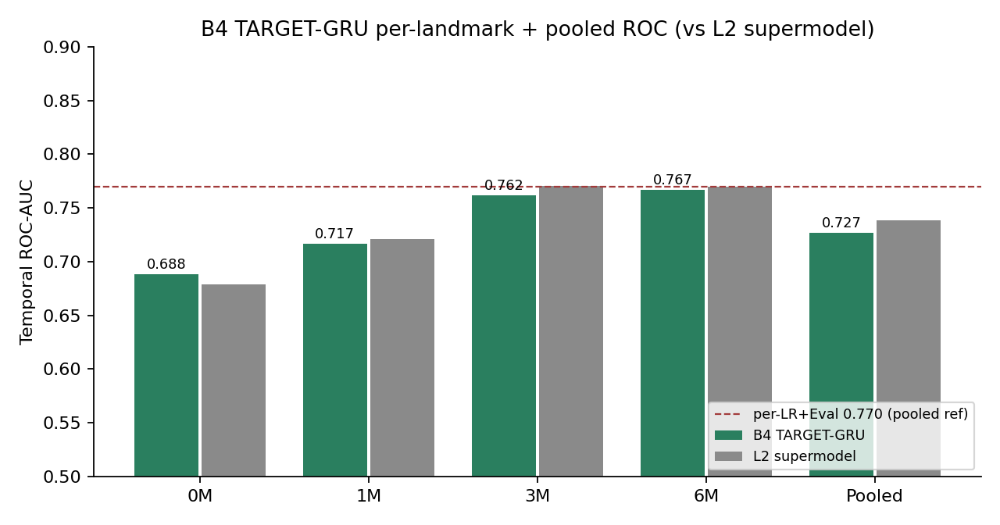
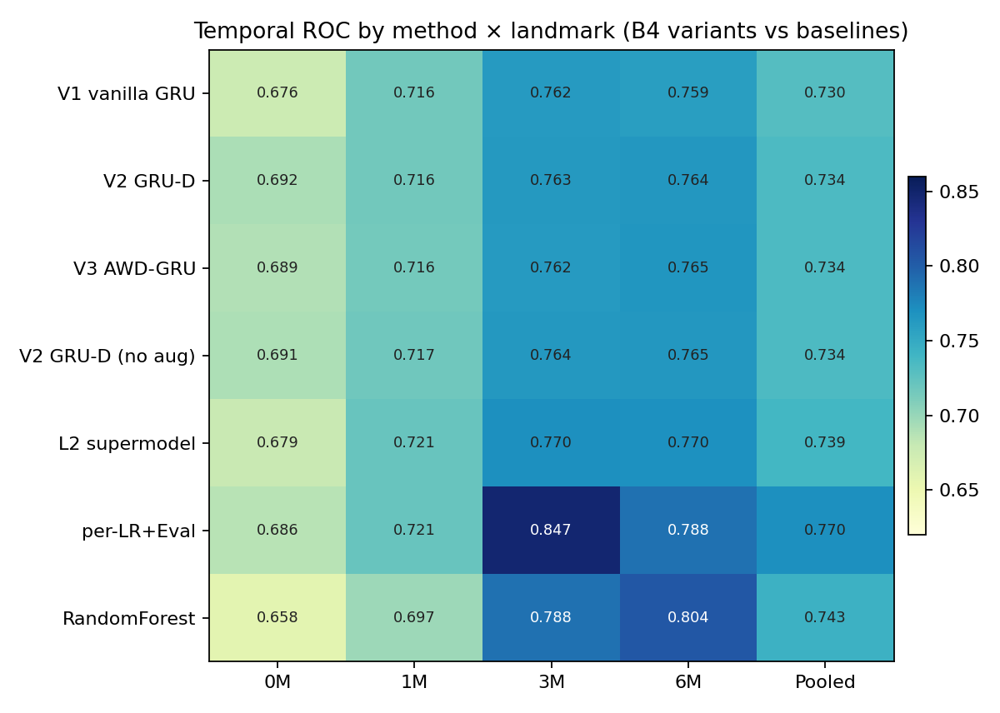
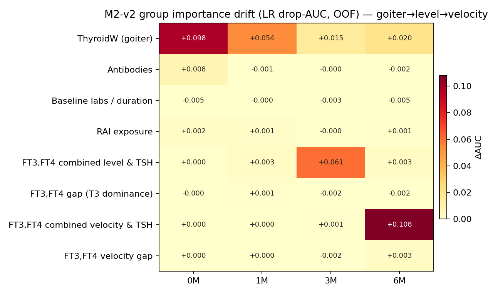

# M2 · v2 —— 时间感知建模、特征天花板与可解释性漂移

> **一句话结论**:在 1003 人次(dev 802 / temporal 201)上,无论用简约 LR、循环网络(GRU / GRU-ODE)、还是非线性玻璃盒(EBM),**早期复发判别力都在 temporal pooled ROC ≈ 0.73–0.77 触顶**;per-landmark LR + 早期甲功状态(Eval)的 **0.770** 是天花板,**没有任何模型/复杂度能越过它**。我们用偏差-方差与学习曲线**显式证明这是"特征信息天花板",不是欠/过拟合、也不是数据不够**——所以炼丹与数据增强都无效(均已实测)。真正有价值的结论有两条:**(1) 预测重心随随访时间漂移:甲状腺重量(基线)→ FT3、FT4 综合水平(3M)→ FT3、FT4 综合变化速度(6M);(2) 天花板下唯一能提升部署性能的手段是选择性预测(对不确定者弃权、转交医生)。**

---

## 1. 背景与目标

M2 任务:在固定随访时点(landmark 0M / 1M / 3M / 6M)预测 24 个月 NHRH(复发)。上一轮三轨给出 per-landmark 4-LR + ABCDE + Eval = **0.770** 主线。本轮(v2)回答三个更深的问题:(1) 还能不能更准(序列/非线性/调参/增强能否破 0.77)?(2) 现在到底卡在哪(欠拟合/过拟合/数据不够/特征不够)?(3) 模型在用什么、随时间怎么变?

## 2. 方法概览

- **数据 / 评估**:episode 级 StratifiedGroupKFold OOF 做选择与重要性;temporal 仅最终读出;逐 landmark Platt 校准;episode-cluster bootstrap CI。分析单元 = 1003 人次。
- **模型谱系**:简约 LR(per-landmark / supermodel)、RandomForest、HistGBM、B4 单向 GRU(time-aware,深监督)、B5 GRU-ODE(隔离环境 torchdiffeq)、EBM(玻璃盒 GAM + 交互)。
- **重要性方法**:**放弃 LR 系数绝对值排名**(共线性下"系数对冲"不可解读);改用 **group drop-AUC(去掉一整组、重训、看 OOF AUC 掉多少)** 为主——预测导向、共线性稳健;辅以 GRU / EBM 置换重要性交叉验证。

### 命名与"如何聚合"(关键,务必读)

FT3、FT4 同向共线(r≈0.81–0.91),**不能各自当独立特征**(否则系数会互相对冲、归因失真)。做法是先把二者**各自标准化**(z 分),再合成两条**正交**轴:

| 轴(规范命名) | 构造方式 | 含义 |
|:--|:--|:--|
| **FT3、FT4 综合水平** | (zFT3 + zFT4) / √2 | 两者标准化后的归一化均值 = 整体激素偏高/偏低 |
| **FT3、FT4 落差** | (zFT3 − zFT4) / √2 | 标准化后的归一化差 = FT3 相对 FT4 偏高(T3 优势)/偏低 |
| **FT3、FT4 综合变化速度** | (zΔFT3 + zΔFT4) / √2 | 速度版的综合水平 |
| **FT3、FT4 变化落差** | (zΔFT3 − zΔFT4) / √2 | 速度版的落差 |

除以 √2 让两轴各自保持单位方差且互相正交,从而把"整体水平"和"T3 相对偏向"干净拆开。**TSH 与 FT3/FT4 反向(垂体反馈,见 §6),不并入上述轴,单列为「当期 TSH」「TSH 变化速度」。** 其余命名:**甲状腺重量**、**病程(对数·月)**、**TPO 抗体**。

## 3. 模型结果:序列/非线性 vs 简约 LR —— 全部触同一天花板

| 方法 | temporal pooled ROC | 备注 |
|:--|:--:|:--|
| **per-LR + Eval(主线)** | **0.770** | 判别冠军 |
| per-LR ABCDE | 0.754 | |
| GRU V1 + Eval(调优) | 0.751 | 特征补丁,追平 per-LR ABCDE |
| **B5 GRU-ODE** | **0.745** | 最好的 NN,数值微超 L2(打平) |
| RandomForest / L2 supermodel | 0.743 / 0.739 | |
| B4 GRU 变体(V1/V2/V3) | 0.730–0.734 | 衰减/增强/weight-drop/多 seed 全 null |
| EBM(玻璃盒,默认/调优) | 逐节点 0.67–0.82 ≈ LR | 调参最优全是"更浅 + 更强正则" |
| B3 CLAN / B1 / B2 | 0.719 / 0.705 / 0.701 | 旧 NN |

**B4 的真实架构贡献**:单向 GRU + per-step 深监督,产出 distinct、单调、time-safe 的逐节点预测(0.69→0.77),修掉了 B1/B2/B3"一个 episode 数复制到 4 行"导致四节点 ROC 全相同的假象(`Figure_01`)。

## 4. 这是"特征天花板",不是炼丹问题(显式诊断)

| 诊断 | 结果 | 判定 |
|:--|:--|:--|
| **偏差-方差**(train vs OOF) | L2:train 0.786 ≈ OOF 0.773(差 0.013);**RF:train 1.000、OOF 0.772 = LR** | **RF 完美记忆训练集却零泛化增益 → 瓶颈是特征信息,非模型容量** |
| **学习曲线**(样本量) | 用一半数据(401)就到顶 0.785,加到 802 不升反平 | **不是数据受限**;加数据/合成增强无效 |
| **数据增强**(FT3 补全 / 随访 TRAb / Eval) | FT3 与 FT4 共线,加入后 +0.000;随访 TRAb 缺失(1M/3M 仅 1.8%/14.3%);仅 Eval +0.015 | 仅"喂对新特征"有效 |
| **模型-patch**(级联 GBM / RF / HGB) | 级联 **−0.019**(反伤);RF=LR;HGB 0.706 | **堆容量/级联只过拟合,反伤** |

**结论:特征信息天花板,炼丹与增强均已实测无效。** 唯一抬高过天花板的是 Eval(早期免疫状态分类),而可用新特征已穷尽。

## 5. 重要性随时间漂移(三模型交叉验证,共线性稳健)

### 5.1 group drop-AUC 漂移(LR,主榜)

> **ΔAUC 含义**:去掉该组特征后、重训得到的 **OOF AUC 下降幅度**(越大该组越重要;负值=去掉反而略升,即噪声组)。各组 ΔAUC **不求和**(留一组法非加和分解)。

| landmark | 主导组 | ΔAUC | 解读 |
|:--|:--|:--:|:--|
| **0M** | 甲状腺重量 | +0.098 | 纯静态解剖负荷(= 基线 M1 体制) |
| **1M** | 甲状腺重量 | +0.054 | 仍以负荷为主,激素开始进场 |
| **3M** | **FT3、FT4 综合水平** | **+0.061** | 当期总激素水平接管,甲状腺重退居二线 |
| **6M** | **FT3、FT4 综合变化速度** | **+0.108** | 总激素动量主导(趋势比水平重要) |

**漂移规律:甲状腺重量(0M/1M)→ FT3、FT4 综合水平(3M)→ FT3、FT4 综合变化速度(6M)。** 甲状腺重量是全程唯一处处非零的"骨架"。

### 5.2 EBM 原生重要性 top-3(交叉验证,特征与数字分列)

> **数字含义**:EBM 原生全局重要性 = 该特征对预测 log-odds 的**平均绝对贡献**(mean |contribution|),无量纲;同一 landmark 内越大=平均影响越大、可横向比;跨 landmark 是不同模型,不宜比绝对值。

| landmark | 第1特征 | 重要性 | 第2特征 | 重要性 | 第3特征 | 重要性 |
|:--|:--|:--:|:--|:--:|:--|:--:|
| 0M | 甲状腺重量 | 0.54 | TPO 抗体 | 0.13 | 病程(对数·月) | 0.12 |
| 1M | 甲状腺重量 | 0.47 | FT3、FT4 综合水平 | 0.19 | 病程(对数·月) | 0.11 |
| 3M | FT3、FT4 综合水平 | 0.53 | 甲状腺重量 | 0.37 | 当期 TSH | 0.29 |
| 6M | FT3、FT4 综合变化速度 | 0.62 | TSH 变化速度 | 0.42 | 甲状腺重量 | 0.38 |

### 5.3 一致性与两点纠正

- **三模型一致**:LR(drop-AUC)、GRU(置换)、EBM(原生 + 置换)四种读法全指向同一漂移 → 是数据的真规律,非单模型伪影。GRU 因循环结构把"动量"隐式吸收进当期状态(6M 显式速度仅 0.018),LR/EBM 则显式显示动量(6M 0.108 / 0.21)。
- **FT3、FT4 落差(T3 相对偏向)处处 ≈ 0**(甚至负):连非线性 EBM + 显式落差轴都榨不出 T3 相对优势的独立信号。**之前"FT3 在 3M 升到 top-3"是共线性的系数/归因假象**;真信号是"综合水平",不是"T3 是否优势"。
- **原始 LR 系数会出现 `FT4 +0.80 / FT3 −0.63` 的对冲**(净贡献 SD≈0.35,远小于个体系数),个体系数不可当重要性;漂移结论一律以 group drop-AUC / 置换重要性为准(原始系数榜见附录 A)。

## 6. FT3 / FT4 / TSH 的轴构造与共线性(为何 TSH 单列)

- corr(FT3,FT4) ≈ 0.81–0.91(同向)→ 聚合为「FT3、FT4 综合水平」与「FT3、FT4 落差」两条正交轴(构造见 §2)。
- corr(TSH,FT4) 在 3M 为 **−0.43**(垂体反馈:激素高 → TSH 低)→ **TSH 与 FT3/FT4 反向,不能并入"综合水平"(会反向抵消),单列**。
- 临床映射:**FT3、FT4 = 甲状腺输出;TSH = 垂体反馈** —— HPT 反馈环两端、方向相反。「FT3、FT4 综合变化速度」(腺体输出动量)与「TSH 变化速度」(垂体恢复动量)反向互补,故 6M 双双进 top-2。

## 7. 选择性预测:天花板下唯一能提升部署性能的杠杆

错例不是弥散噪声,而是**结构化的尾部表型(hidden stratification)**,且逐月漂移:漏报(FN)= 0M/3M"高 TSH 看似已控"、1M"暴跌"、6M"全低看似痊愈";误报(FP)= 全程"大甲状腺 + 高激素 + 高基线 TRAb"。既然天花板由特征决定,正解是**对这些不确定者弃权、转交医生**(`Figure_06`):

> 弃权规则:按"离决策阈值的距离"排序(纯用预测、不看标签),对最不确定者弃权。下表为 temporal 上**保留(确定)人群**的指标。

| 弃权% | 保留 n | 准确率 | NPV | ROC(保留) |
|:--:|:--:|:--:|:--:|:--:|
| 0 | 804 | 0.685 | 0.746 | 0.753 |
| 30 | 563 | 0.730 | 0.776 | 0.804 |
| 50 | 402 | **0.781** | **0.840** | **0.853** |

**弃权 30% → 准确率 +4.5pp、NPV 0.776;弃权 50% → 准确率 0.781、NPV 0.840、ROC 0.853。** 在不破判别天花板的前提下显著提升模型敢判人群的可靠性——对"结构化天花板"的对症 patch。

## 8. 诚实结论与论文定位

1. **简约 LR(per-landmark + Eval, 0.770)为主线**;序列模型/非线性/调参/增强无一越过天花板——这是数据(4 时点 + 800 样本 + 特征信息)决定的。论文叙事:"系统试过 GRU / GRU-ODE / EBM + 多种正则/增强/级联,简约 LR 仍是天花板"——don't add complexity unless it pays,有完整实验背书。
2. **B4 的 per-step 深监督**是可写进论文的方法学贡献(真·逐节点、可单元测试的时间安全)。
3. **重要性漂移(甲状腺重量 → FT3、FT4 综合水平 → FT3、FT4 综合变化速度)** 是临床上可讲的发现,三模型交叉验证;**FT3、FT4 落差(T3/T4 比值轴)无独立信号**(纠正系数表假象)。
4. **选择性预测**是部署落地的正解(弃权换可靠)。
5. **可解释性主推 EBM**(玻璃盒,炫酷且比黑盒 GRU 可解释),但需注明"AUC 同天花板,价值在解释 + 非线性动量的揭示"。

---

### 附录 A:原始 LR 系数榜(共线性敏感,仅诊断)

逐 landmark 标准化系数排名会随派生特征增删而重排,并出现 `FT4 +/ FT3 −` 的对冲,**不可作生物学解释**。结论一律以正文 group drop-AUC / 置换重要性为准。

### 附录 B:运行环境

本机 uv(torch 2.12 / numpy2 / pandas3 / interpret-core 0.7.8);数据从计算机(anaconda)rsync;L2 supermodel 本机重算 0.738 ≈ 已知 0.739,确认跨环境一致。GRU-ODE 在隔离 venv + torchdiffeq 运行,主 anaconda 未触碰。所有计数 runtime 计算;分析单元 = 1003 人次。
