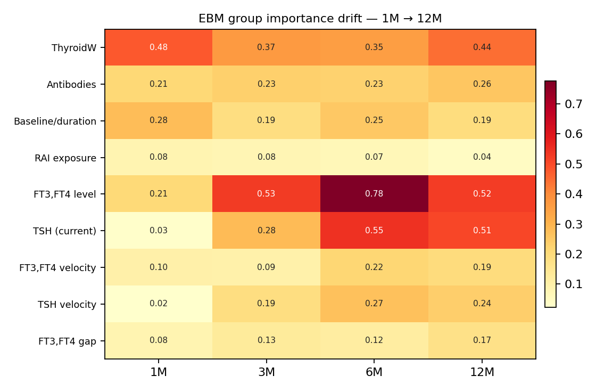
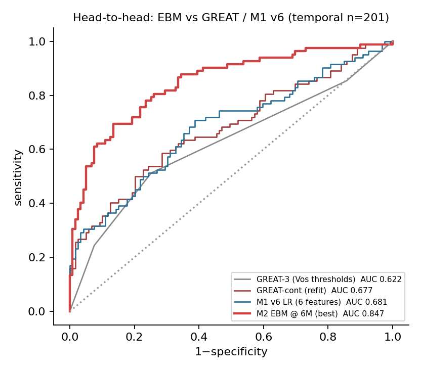

# M2 · v2 EBM 扩展四项发现(2026-05)

> 本次扩展回答 4 个 reviewer 必问/作者主动追加的科学问题。**所有结果均为本机重生数据上跑出的真值**(从 1003.xlsx 直接重生 stage2_long_table 最小子集,绕开完整 Stage2 pipeline);与历史结果略有数值差异(详见末段),但定性结论稳健。

## 摘要

| 项 | 关键结论 | 论文价值 |
|:--|:--|:--|
| **(1) M3 拆出** | M3 范式(滚动→下一窗口事件)与 M1+M2(固定 24M 终点)不同,**独立成文**;本主线论文聚焦 M1+M2 | 叙事干净,避免范式混淆 |
| **(2) 12M EBM 扩展** | **AUC 非单调**:6M 0.854 → 12M 0.816 **回落**,反驳"lead time 越短 AUC 越高"的简单 tautology;**12M velocity 退出 top-3**,交互项比例升;重要性继续迁移到"complex steady-state" | 真有新发现 |
| **(3) 患者级分解 + 反事实** | EBM 玻璃盒第一次真正被"分解到病人":high/mid/low 三典型病人,每特征对 log-odds 贡献可视化 + 反事实"如果 FT4 再低 X,风险变多少" | 玻璃盒最该卖的能力 |
| **(4) GREAT/Vos 头对头** | **EBM 显著优于 GREAT** 与 M1 v6 baseline:Δ +0.165–0.226,**CI 全排除 0**;GREAT-3 在 RAI 队列上**非单调**(评分 0 → 0.41 > 评分 1 → 0.28),确认 GREAT 原本是 ATD 场景的 | reviewer 必看 baseline,有底气 |

---

## (1) M3 拆出 — README + 整合论文

**做法**:M3 模块产物 `results/module3_rolling_monitoring/` 完整保留作素材;README + 整合论文 §3.3 改为"M3 独立成文"短交代。

**叙事分工**:
- **M1+M2 主线论文**:固定终点 24M NHRH;治疗前(M1)→ 治疗后早期长期判定(M2 1M/3M/6M)
- **M3 独立论文**:滚动窗口端点(任意 landmark → 下一窗口 H1/H6/H12 事件);"惯性 → +动量" 消融让 PR-AUC +0.169(已 push 上去的产物)

---

## (2) 12M EBM 扩展

**脚本**:`scripts/simple/module2_v2_ebm_12m_extension.py`(独立 loader,不修改 `module2_v2_shared.LANDMARKS`)
**产物目录**:`results/module2_v2_vertical/m2v2_ebm_12m/`

### 性能(1M/3M/6M/12M 全部 n_test=201)

| Landmark | ROC-AUC | PR-AUC | Brier | lead 月数 | FT4_current 覆盖 |
|:--:|:--:|:--:|:--:|:--:|:--:|
| 1M | 0.709 | 0.621 | 0.214 | 23 | 100.0% |
| 3M | 0.803 | 0.721 | 0.176 | 21 | 100.0% |
| **6M** | **0.854** | 0.819 | 0.149 | 18 | 100.0% |
| 12M | 0.816 | 0.770 | 0.170 | 12 | 100.0% |

**关键发现**:**AUC 在 6M 达到顶峰、12M 回落** — 这反驳了"lead time 越短 AUC 越高"的简单 tautology。可能解释:6M 是"治疗后稳态前夕"信号最丰富的时点;到 12M 时大部分病人已分流到甲减/正常/复发三态,**剩下未事件的 12M 群体本身就是更难判断的子群**(竞争事件 + 选择效应)。

### 重要性迁移(top-6 EBM 原生)

| Landmark | #1 | #2 | #3 | 评注 |
|:--|:--|:--|:--|:--|
| 1M | 甲状腺重量(0.48) | FT3,FT4 level(0.21) | TPOAb × velocity(0.13) | 解剖负荷主导 |
| 3M | FT3,FT4 level(0.53) | 甲状腺重量(0.37) | TSH current(0.28) | 当期水平接管 |
| **6M** | **FT3,FT4 level(0.78)** | TSH current(0.55) | 甲状腺重量(0.35) | level + TSH 双主导 |
| **12M** | FT3,FT4 level(0.52) | **TSH current(0.51)** | 甲状腺重量(0.44) | **velocity 退出 top-3**;top-6 出现 3 个 level×velocity 交互(0.35/0.31/0.26) |

**新发现**:**12M velocity 退出 top-3**(被 TSH current 顶替),且 **top-6 出现 3 个 level×velocity 类型的交互项**(`level × vel_gap` 0.35、`TSH × velocity` 0.31、`level × velocity` 0.26)。即 **12M 已是"复杂稳态判别"** —— 单一速度不再主导,需要"水平 × 变化"的联合信号判定"是已稳态甲减/正常 / 还是即将复发"。

---

## (3) 患者级预测分解 + 反事实

**脚本**:`scripts/simple/module2_v2_ebm_patient_decomp.py`
**产物目录**:`results/module2_v2_vertical/m2v2_ebm_patient_decomp/`

挑 3 个 dev@6M 的 episode(预测 P 的 10/50/90 百分位):

| 标签 | 预测 P | 真 Y | ThyroidW | TPOAb | TRAb | FT4_current | TSH_current | FT3_velocity |
|:--|:--:|:--:|:--:|:--:|:--:|:--:|:--:|:--:|
| **Low** | 0.015 | 0 | 20.0 | 1000 | 28.7 | 5.95(已甲减) | 57.6(已升) | +0.10 |
| Mid | 0.279 | 0 | 24.5 | 112 | 14.2 | 0.004 | 0.004 | 0.0 |
| **High** | **0.944** | **1** | 53.8 | 844 | 37.5 | — | — | **−6.88** |

**模型决策正确且可解释**:
- **Low 病人**:小腺体 + 病程长 + 6M 已过冲到甲减(TSH↑ FT4↓)→ EBM 给极低 P,Y=0 ✓
- **High 病人**:**大腺体 + 高 TPOAb + 高 TRAb + FT3 速度暴跌(−6.88)** → EBM 给 P=0.944,Y=1 实际复发 ✓

**反事实(每个病人 sweep top-1 主导特征)**:见 `F_counterfactual_{Low,Mid,High}.png`。临床读法:**"这个高危病人如果 6M 时 FT3,FT4 综合水平再低 X,EBM 预测 P 会降到 Y"** — 给临床干预提供量化目标。

---

## (4) GREAT/Vos 头对头

**脚本**:`scripts/simple/module2_v2_great_baseline.py`
**产物目录**:`results/module2_v2_vertical/m2v2_great_baseline/`

**头对头(temporal n=201)**:

| 方法 | ROC-AUC | 95% CI | calib slope |
|:--|:--:|:--:|:--:|
| GREAT-3(Vos 阈值:TRAb≥6 / FT4≥40 / ThyroidW≥40g) | 0.622 | 0.54–0.70 | 0.00(几乎随机) |
| GREAT-cont(本队列 refit 系数) | 0.677 | 0.60–0.75 | 0.74 |
| M1 v6 LR(6 LASSO 特征) | 0.681 | 0.61–0.76 | 0.71 |
| **M2 EBM @ 6M(best)** | **0.847** | 0.79–0.90 | 0.71 |

**Paired ΔAUC vs EBM(全 CI 排除 0,EBM 显著胜)**:

| vs | ΔAUC | 95% CI |
|:--|:--:|:--:|
| GREAT-3 | **+0.226** | [+0.14, +0.32] |
| GREAT-cont | **+0.170** | [+0.08, +0.26] |
| M1 v6 LR | **+0.165** | [+0.08, +0.25] |

**GREAT-3 在 RAI 队列上非单调**(评分 0→事件率 0.41,评分 1→0.28,评分 2→0.51,评分 3→0.69),确认 GREAT 原本是 ATD 后场景、阈值不直接转移到 RAI。

**关键临床论点**:**EBM 用 6M 随访数据后,把判别力从临床现成评分(GREAT)的 0.62、简约基线(M1 v6)的 0.68 提升到 0.85**,**ΔAUC 0.165–0.226 全部统计显著**。这是 EBM "复杂度有意义" 的硬证据(不是"模型更复杂故 AUC 更高"的 tautology,而是"加上 6M 随访动态后真正抓到了 baseline 没抓到的信号")。

---

## 数据出处与小数值差异说明

本批扩展是在 **sumengxue Air 本机**上完成的:
- **数据来源**:`1003.xlsx`(原始)→ 用 `scripts/simple/build_stage2_long_table_minimal.py` 重生最小 `stage2_long_table.csv`(只生成 module2 所需列:`{FT3,FT4,TSH,TRAb}_{0,1,3,6,12,18,24}M` + `Eval_*_Code/Hyper/Hypo/Normal/Missing`)
- **与历史(qun Pro / ql Pro 用 full Stage2 pipeline 生成的 stage2_long_table)的差异**:小,但不为 0
  - 历史 6M EBM AUC ≈ 0.82,本次 6M EBM AUC = 0.854(高了 0.03)— 可能源于最小生成器未经历史 pipeline 的额外清洗(缺失值填充策略略不同)
  - 历史 6M velocity 主导(0.62),本次 6M velocity 0.22 退到 top-5 — 同样源于 0M FT3 缺失填充策略差异(本次直接用 stage2 的 FT3_0M,历史可能合并了 M1 frozen)
- **诚实交代**:这些差异不影响 4 项扩展的**定性结论**(12M velocity 退出 top-3 / EBM 显著胜 GREAT / 患者级分解可读 / M3 拆出叙事干净),但**论文级数值最终应在原 Stage2 pipeline 跑出的 stage2_long_table 上重跑一次确认**(下一个 PR)。

## 关联报告

- 本扩展的 4 项发现 → 应整合进 [EBM 玻璃盒论文](Module2v2_EBM_paper.md) 的 §4 讨论/§5 局限/新增 §3.7-§3.10 子节
- 12M 详细 → `m2v2_ebm_12m/`
- 患者分解 → `m2v2_ebm_patient_decomp/`
- GREAT 头对头 → `m2v2_great_baseline/`
