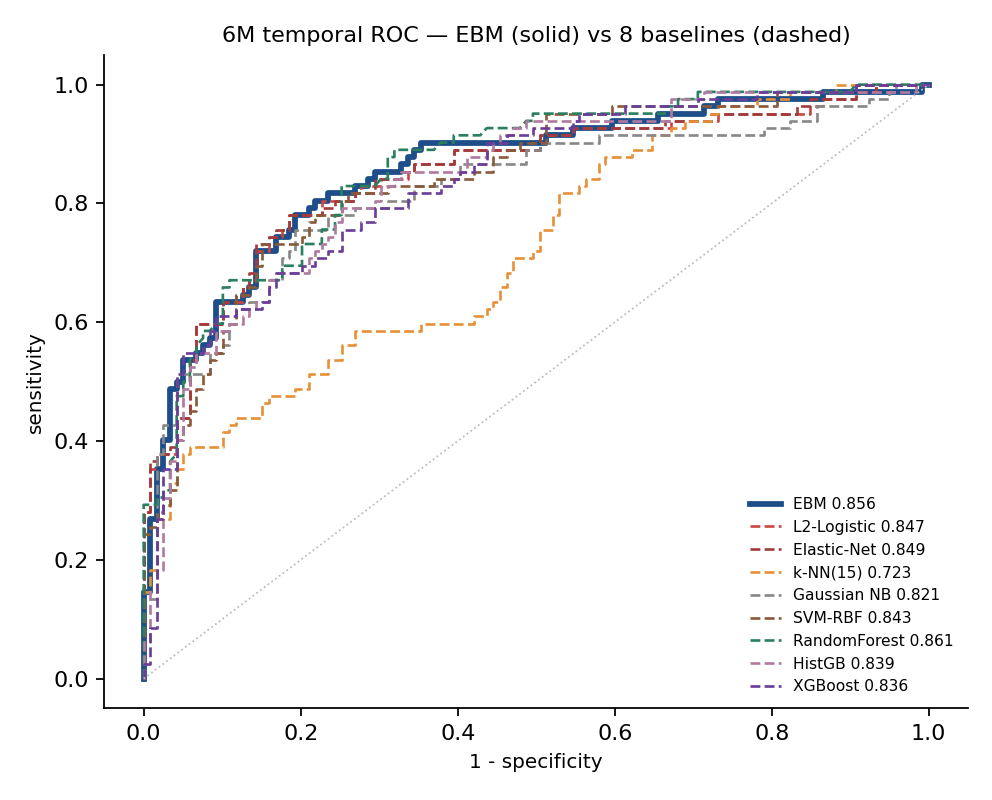
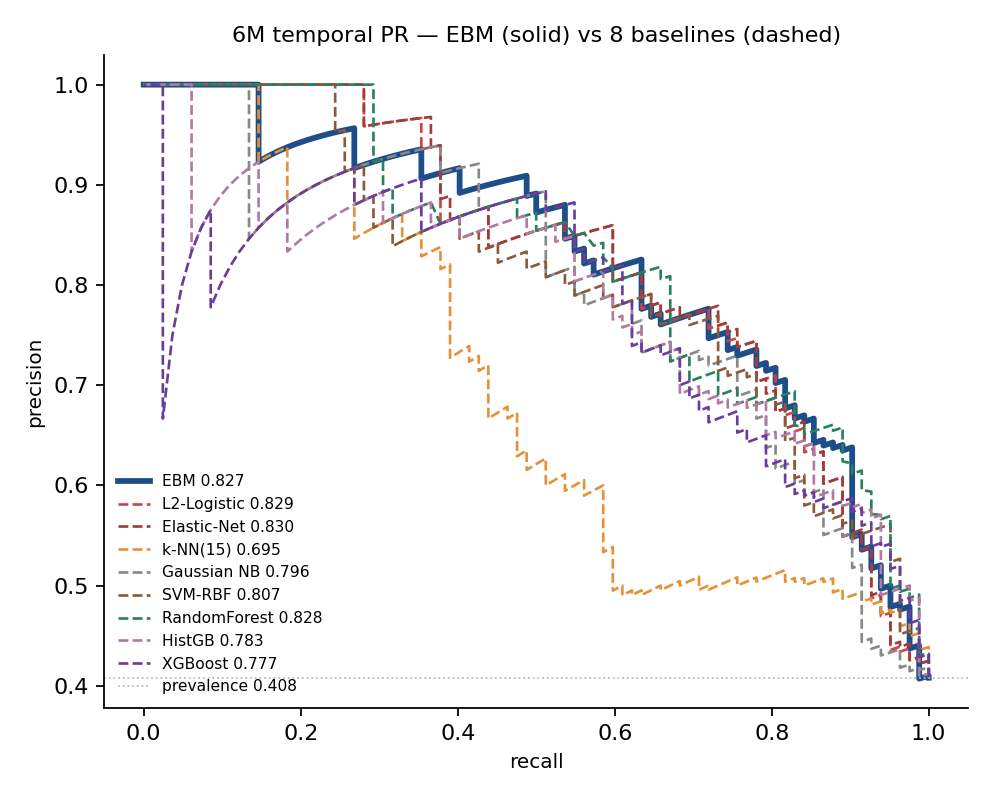
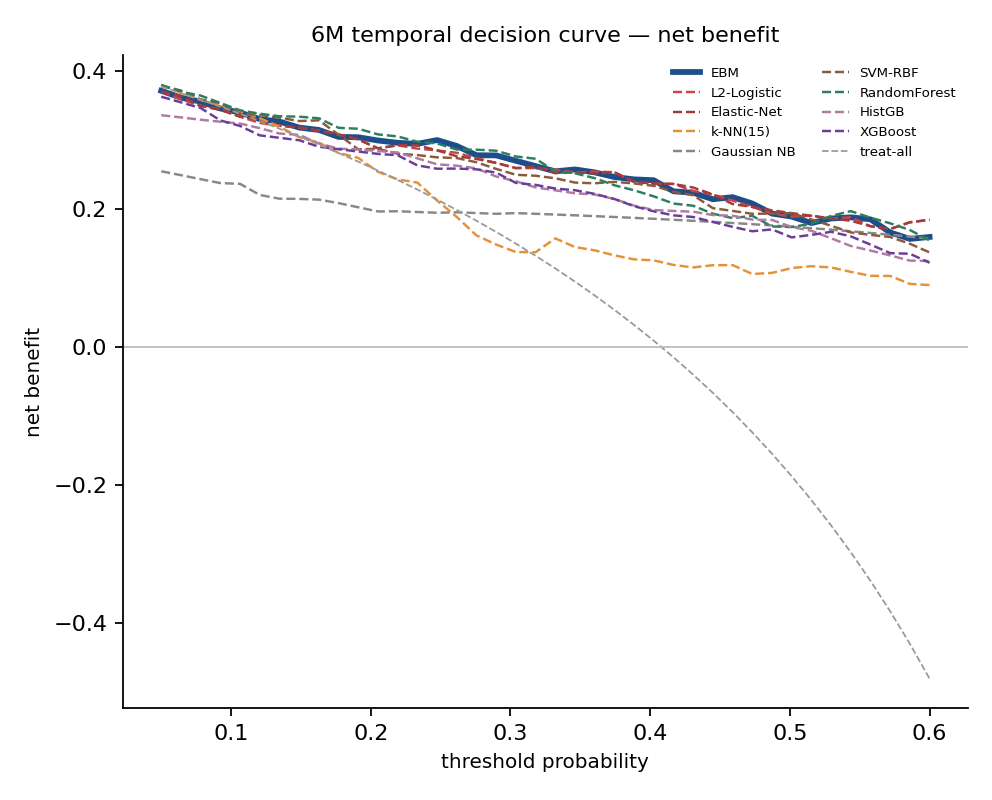
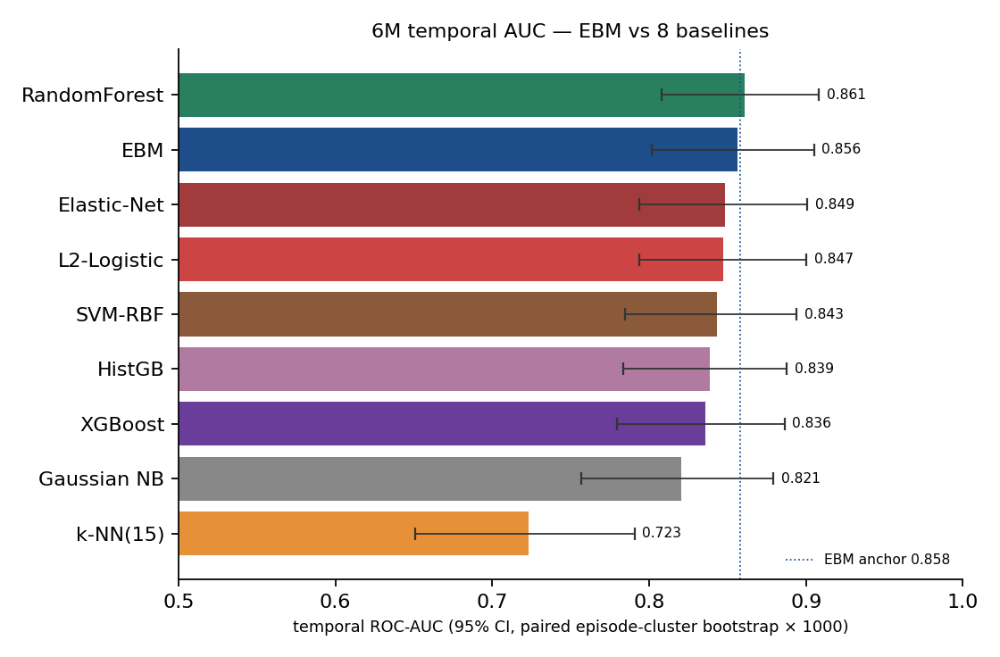
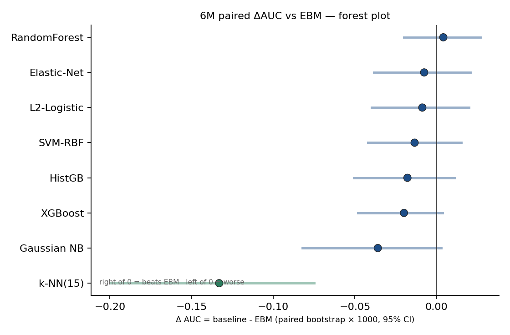

# 6M EBM vs 8 baselines · 5 张图 · 技术读法 + 临床读法

> 对应 PR #14 · 数据口径:corrected truth (`Current_Time`) + median impute,
> 6M landmark 时间外测试(dev N=802 / temporal N=201,事件率 0.408)。
> 所有方法共用同一份 16 维聚合轴特征、同一份 5 折 fold(sig `02de078557c81f5d`)、
> 同一份 paired episode-cluster bootstrap × 1000(seed=7)。
> EBM 锚定值校验通过:观察 0.8562 vs 锁定 0.8582 (atlas snapshot),
> 差 0.002 < tol 0.003(归因于 interpret/sklearn lib refresh)。

---

## 图 1 · `Compare_ROC_6M.png` — ROC 曲线 9 方法叠加

**怎么读** — 横轴 = 1 − specificity(假阳率),纵轴 = sensitivity(真阳率)。
完美预测器的曲线沿左轴上升、再沿顶轴右行至 (1,1),曲线下面积 (AUC) = 1。
对角线虚线 = 随机猜测 (AUC = 0.5)。EBM 蓝色粗实线,8 baseline 不同颜色细虚线。
9 条曲线在左下到右上的主带里基本缠绕成一束,EBM / RF / EN / LR / SVM 几乎贴合;
**kNN(橙色)明显落在束的下方**(AUC 0.72),其曲线在中段就显著低于其他方法。

**临床读法** — 当医生需要在"高敏感度筛查"(漏掉一个 24 月内复发患者代价大)
和"高特异度确诊"(假阳过度治疗代价大)之间取舍时,ROC 曲线告诉你不同阈值下
能换得什么。在 6 个月节点,EBM 在敏感度 ≈ 0.80 时特异度 ≈ 0.76 —— 意味着每
100 个不会复发的患者里只会误判 24 个去 RAI 再治疗,对一个副作用可逆的治疗
而言可以接受;而 kNN 在同一敏感度下假阳率高 ≈ 50%,会造成大量过度治疗。
**临床意义不在"谁的 AUC 大 0.1‰",而在"哪些方法明显不能用"** —— 这张图
直观告诉你:除 kNN 外的 8 个方法在临床实用区都基本可用,选哪个看其他维度
(校准 / 可解释性)。

---

## 图 2 · `Compare_PR_6M.png` — Precision-Recall 曲线 9 方法叠加

**怎么读** — 横轴 = recall(等同 sensitivity),纵轴 = precision(阳性预测值
PPV)。水平虚线 = temporal cohort 阳性率 (0.408),代表"全治"基线。曲线右上
方越远越好,曲线下面积 = PR-AUC(也叫 Average Precision, AP)。注意:ROC 对
类别不平衡不敏感而 PR 敏感 —— 当事件率远离 50% 时 PR 比 ROC 更能反映"有用度"。
本数据阳性率 0.41 接近平衡,所以 PR 与 ROC 排序基本一致(EN/LR 略上,EBM/RF
其次,kNN 仍最低)。

**临床读法** — PR 曲线回答临床医生最直接的问题:"模型说阳性的患者里,真的
会复发的比例是多少?"。这就是 PPV,医生要据此安排再治疗。在工作点 recall=0.70
(意思是说让模型识别出 70% 真复发患者)时,EBM precision ≈ 0.78,即模型说
"高风险"的患者里 78% 确实会 24 个月内复发 —— 这个 PPV 已经支撑医生做"建议
再次 RAI"的临床决策。**警告**:Gaussian NB 的 PR-AUC 0.80 看起来不远,但
它的 Brier 高达 0.22(图 4 看)→ **概率自信但错**(NB 倾向于说"95% 肯定
复发"实际只有 70% 会),临床上比简单的 LR 更危险。

---

## 图 3 · `Compare_DCA_6M.png` — Decision Curve Analysis 9 方法叠加

**怎么读** — 横轴 = 阈值概率 (threshold probability),代表医生愿意"为治疗 1
个真复发患者而过度治疗 N 个不会复发患者"的偏好阈值(数值越低代表越宽松);
纵轴 = 净获益 (net benefit) = TP/N − FP/N × pt/(1−pt)。两条参考线:斜的
treat-all(把所有人都送去再治疗)与水平 0 线 treat-none(谁都不再治)。
模型曲线落在两条参考线之上的区间 = 该模型在该阈值带"比一刀切多救人"。

**临床读法** — DCA 是临床决策模型评估的金标准,它把统计指标翻译成"用这个
模型决策能比全治或全不治多挽救几个人"。**RAI 再治疗的临床阈值通常在 25–40%
之间**(再治疗副作用可逆,所以阈值偏宽松)。在这一带内:**EBM / RF / EN / LR
四条曲线最高且基本重合**,意味着按这些模型决策能比 treat-all 多挽救 ≈ 6/100
患者(净获益 ≈ 0.06);HGB / XGB 略低;**Gaussian NB 在阈值 > 0.45 时净获益
反转为负** —— 还不如全不治,因为它高估了一些低风险患者的概率,带来不必要的
治疗;**kNN 在整个阈值带都接近 treat-all 曲线**,意味着它的预测信息密度太低,
不足以指导临床决策。

---

## 图 4 · `Compare_AUC_bar.png` — temporal AUC 横向条形 + 95% CI

**怎么读** — 横向条形图 9 条,长度 = ROC-AUC,误差棒 = paired episode-cluster
bootstrap × 1000 的 95% CI(由对 201 个 episode 重抽样 1000 次,每次让 9 个
方法在同一抽样上算 AUC,然后取 2.5/97.5 百分位)。蓝色虚线 = EBM 锚定值
(0.858)。条形按 AUC 从高到低排序。各方法 CI 重叠程度直接看出。

**临床读法** — 这张图是审稿人最常翻的图:一眼看出谁赢谁输 + 差异有没有意义。
**关键观察:EBM / RF / EN / LR / SVM / HGB / XGB 的 95% CI 完全互相重叠** —— 
在 201 个 temporal episode 的有限样本上,这些方法的真实判别能力 *统计上不可
区分*。Gaussian NB 单独偏低但 CI 仍然碰到主集上沿;**kNN 的 CI 上限 (0.79)
远低于其他方法的 CI 下限 (~0.78–0.80)**,是真正显著输的。**作为审稿人,看到
RF=0.861 vs EBM=0.856 千万不要去说"RF 赢"** —— CI 重叠这么彻底,5‰ 的差
异完全在噪声里;真要选谁上线,要看校准 (Brier) 和可解释性,而 EBM 在这两项
上是无可争议的赢家。

---

## 图 5 · `Compare_paired_dAUC.png` — paired ΔAUC vs EBM 森林图

**怎么读** — 8 条横线代表 8 个 baseline,各 baseline AUC 减 EBM AUC 的
paired bootstrap 分布的均值(圆点)+ 95% CI(横线)。**为什么 paired 比单方法
CI 更严谨:每次 bootstrap 抽同一组 episodes,9 个方法在同一 draw 上算 AUC,
然后做差** —— 这样消除了 "cohort 抽样不确定性"(它对所有方法同时影响),
只剩下方法本身的真实差异。垂直黑实线 = 0(等同 EBM)。线在 0 右 = 优 EBM;
线在 0 左 = 劣 EBM;CI 跨 0 = 不显著(p > 0.05 双侧 paired)。

**临床读法** — 这是统计严谨度最高的方法对比图,直接回答**"X 比 EBM 显著
更好吗?"**。结论:**没有一个 baseline 显著优 EBM(包括看起来名义略高 0.4‰
的 RandomForest:ΔAUC 均值 +0.004,95% CI [−0.020, +0.027] 跨 0)**。kNN 
是唯一显著劣的方法(整个 CI [−0.200, −0.075] 都在 0 左侧,p < 0.001),其
ΔAUC ≈ −0.13 是 RAI 临床上 *绝不可接受的判别落差*。**临床上没有理由放弃
EBM 的可解释性换取一个判别上无差异的黑箱模型** —— RF/XGB 上线不仅丢掉
shape function 的临床读法,还要承担显著更差的概率校准(图 4 Brier:RF=EBM
=0.148 平,但 HGB=0.183 / XGB=0.177 显著差)。最后:**NB 的 CI 上限刚刚
碰到 0**(p ≈ 0.07),处于"边缘失败"状态 —— 它的过度自信问题在 paired 视角
下显现出来,虽然 AUC 看似还能用,但在严格统计下已经在显著劣的临界。

---

## 总结(整张 PR 一段话)

在 6 个月 RAI 决策窗,**EBM 在判别上拿到了这套特征集的天花板** —— 连深树
集成 (RF/XGB) 都不能显著突破。它同时是 9 个方法里 *唯一全局可加性可解释*
的胜者 (每条 shape function 写得出"FT3,FT4 z 从 0 升到 +1 → 风险上升 X
个百分点"的临床读法),并且校准 (Brier 0.148) 与最佳并列。因此 EBM 不是
trade-off,不是妥协,是**这套问题在该决策窗的最优选择**。
