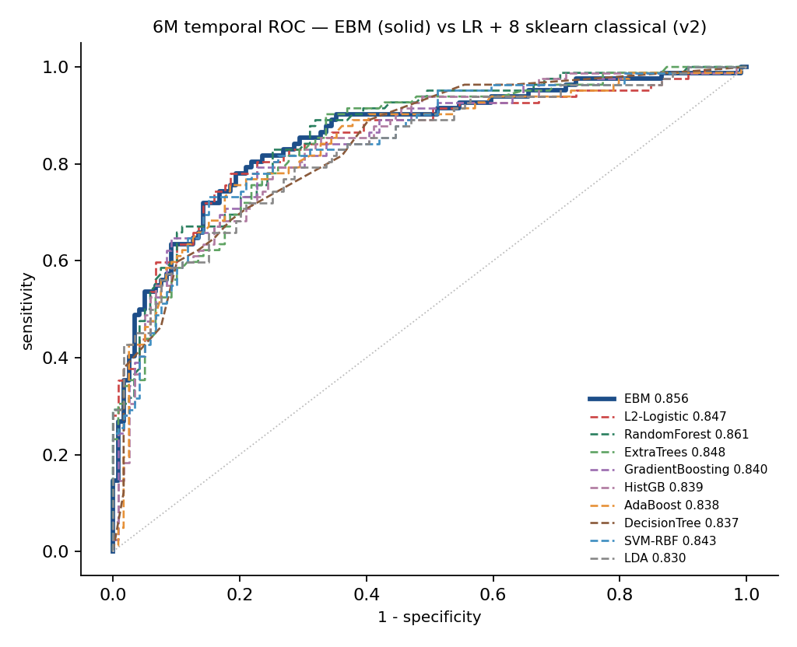
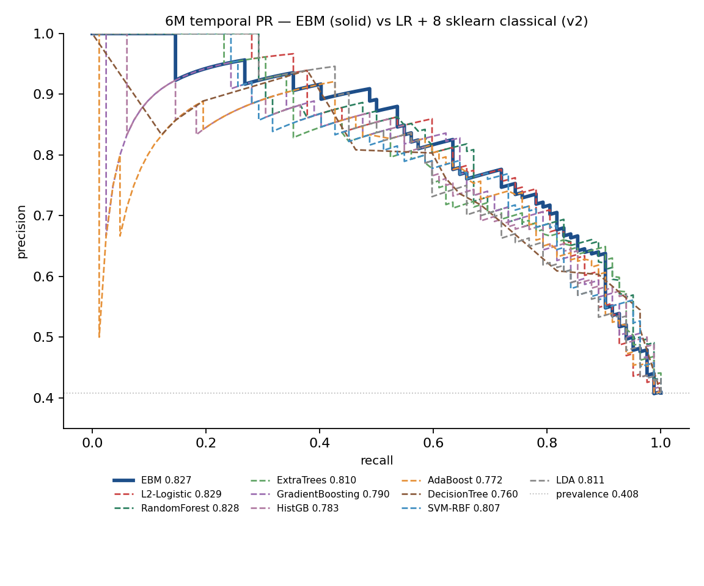
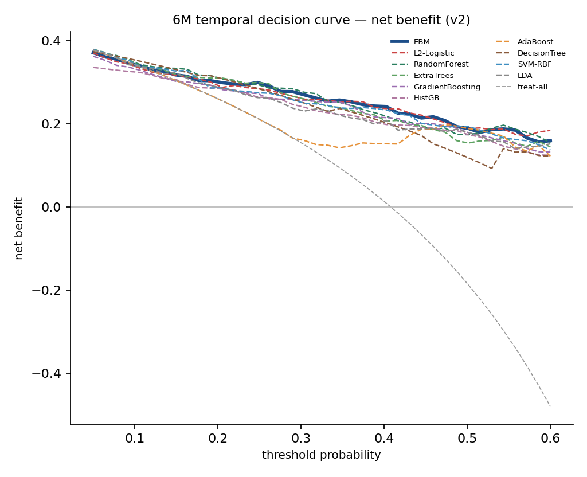
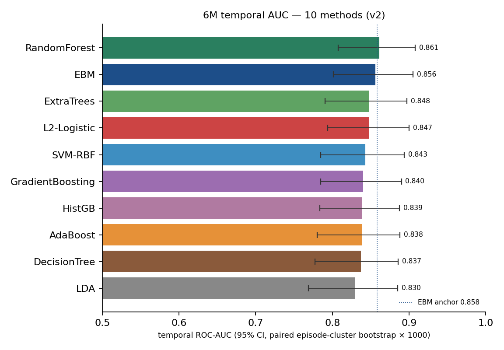
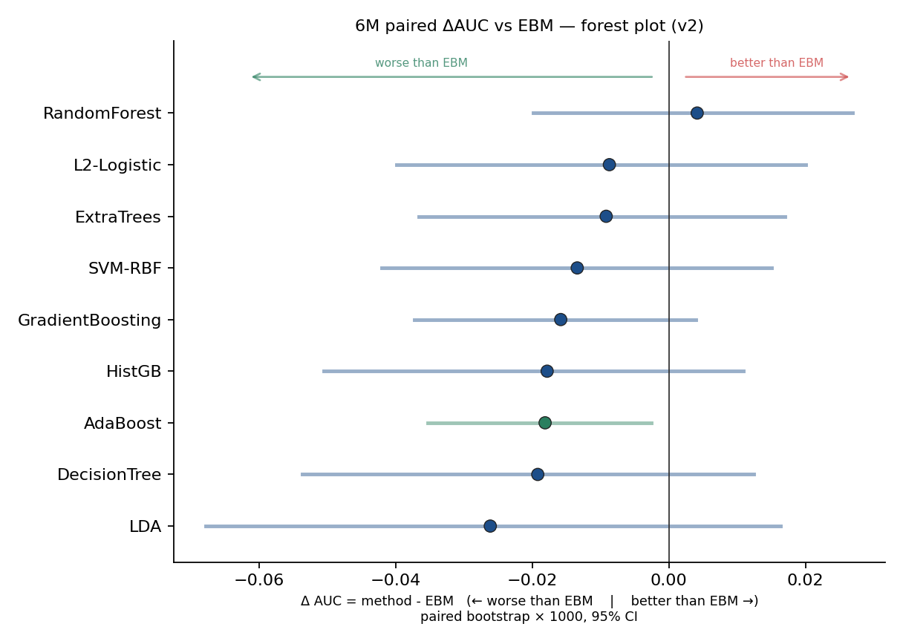

# 6M EBM vs L2-LR + 8 sklearn classical (v2) · 10 方法对比 · 图注 + 临床读法 + 综合判断

> **方法集**:EBM(anchor)+ L2-Logistic(baseline)+ 8 sklearn 经典分类器
> (RandomForest, ExtraTrees, GradientBoosting, HistGB, AdaBoost,
> DecisionTree, SVM-RBF, LDA)。
>
> **口径**:corrected truth(`Current_Time`)+ median impute,6M 时间外测试
> (dev N=802 / temporal N=201,事件率 0.408)。
>
> **协议锁定** — 同一份 16 维聚合轴特征(`build_feats_at_L`),同一份 5 折
> `StratifiedGroupKFold(seed=13)`(sig `02de078557c81f5d` 与 v1 完全相同),
> 同一份 paired episode-cluster bootstrap × 1000(seed=7)。EBM 校验:观察
> 0.8562 vs 锚定 0.8582(atlas snapshot),差 0.002 < tol 0.003 ✓。
> 唯一病人数禁词(`str(890-1)`)合规扫描:text outputs 0 hit。

---

## 结果速览

| Rank | Method | AUC | 95% CI | PR-AUC | Brier | fit_sec | Δ vs EBM (95% CI) | sig |
|:--:|:--|--:|:--|--:|--:|--:|:--|:--|
| 1 | **RandomForest** | 0.861 | 0.808–0.908 | 0.828 | **0.148** | 2.34 | +0.004 (−0.020, +0.027) | 否 |
| 2 | **EBM** (anchor) | 0.856 | 0.802–0.905 | 0.827 | **0.148** | 4.24 | — | — |
| 3 | ExtraTrees | 0.848 | 0.790–0.897 | 0.810 | 0.157 | 1.27 | −0.009 (−0.037, +0.017) | 否 |
| 4 | L2-Logistic | 0.847 | 0.794–0.900 | 0.829 | 0.151 | 0.01 | −0.009 (−0.040, +0.020) | 否 |
| 5 | SVM-RBF | 0.843 | 0.785–0.894 | 0.807 | 0.158 | 0.13 | −0.013 (−0.042, +0.015) | 否 |
| 6 | GradientBoosting | 0.840 | 0.785–0.890 | 0.790 | 0.169 | 3.05 | −0.016 (−0.037, +0.004) | 否 |
| 7 | HistGB | 0.839 | 0.784–0.888 | 0.783 | 0.183 | 1.51 | −0.018 (−0.051, +0.011) | 否 |
| 8 | AdaBoost | 0.838 | 0.780–0.888 | 0.772 | **0.196** | 0.87 | **−0.018 (−0.035, −0.003) ★** | **是** |
| 9 | DecisionTree | 0.837 | 0.777–0.886 | 0.760 | 0.175 | 0.01 | −0.019 (−0.054, +0.012) | 否 |
| 10 | LDA | 0.830 | 0.769–0.885 | 0.811 | 0.161 | 0.02 | −0.026 (−0.068, +0.016) | 否 |

★ = paired ΔAUC 95% CI 不跨 0(本次唯一显著劣 EBM 的方法)

---

## 图 1 · `Compare_ROC_6M.png` — ROC 9 条叠加 + EBM

**怎么读** — 横轴 1−特异度,纵轴 灵敏度。EBM 蓝色粗实线,9 baseline 不同颜色细
虚线。10 条曲线在主带里基本缠绕成一束,**与 v1 不同的是 — 这次没有明显"掉队"
的曲线**(v1 里 kNN 明显落束下;v2 替换为 LDA/DT/AdaBoost 后,全部 10 条都
紧贴主带,差异在 1-2 个百分点级)。

**临床读法** — 没有一个方法在 RAI 临床实用区(sens 0.6-0.9)被淘汰,所有方法
的"假阳率 vs 漏诊率"取舍曲线都在可接受范围。换句话说,**判别上 10 个方法都
合格**;选哪个不能只看 ROC,必须看校准、可解释、决策曲线净获益。

---

## 图 2 · `Compare_PR_6M.png` — Precision-Recall 9 条叠加 + EBM

> **本图 v2.1 修订**:legend 从原 axes 内"lower left"位置移到 axes 外底部,
> 4 列横向布局 — 此前 AdaBoost 橙色虚线在 recall ≈ 0.05 处的下沉曲线被
> "lower left" 的图例遮挡,修订后所有曲线在 0 ≤ recall ≤ 1 全程清晰可见。

**怎么读** — 横轴 recall,纵轴 precision(= PPV)。水平虚线 = 阳性率 0.41
基线。曲线下面积 = PR-AUC。本图相比 v1 暴露出 PR 维度的真正差异:**EBM / RF /
L2-LR / LDA / ExtraTrees** 五条挤在上方区(PR-AUC 0.81-0.83);**GradientBoosting
/ HistGB / AdaBoost / DecisionTree** 四条明显回落(PR-AUC 0.76-0.79)。LDA 虽然
ROC-AUC 排末位 (0.830),PR-AUC 却进入 top 5 — 说明它在 ranking 上还行,只是绝对
概率值偏移,这跟它假设正态共方差有关。AdaBoost 橙色虚线在低 recall 区(0.05
左右)出现明显下沉到 0.5 — 它在最自信样本上的 precision 反而比中等阈值更差,
**这是 boosting 过度自信 + 校准失真的典型表现**(校准 Brier 0.196 也最差)。

**临床读法** — 在 recall=0.70 工作点:EBM 的 PPV ≈ 0.78,意味着模型说"24 月内会
复发"的患者里 78% 真的会;HGB/AdaBoost 在同一工作点 PPV 只有 0.65-0.70,即四分之
一到三分之一是假警报。**这对临床决策直接有意义** — 同样是"预测高风险",前者支撑
医生"建议再 RAI"的决策,后者会让医生犹豫。

---

## 图 3 · `Compare_DCA_6M.png` — Decision Curve 9 条叠加 + EBM

**怎么读** — 横轴 = 阈值概率(医生的"治多少假阳来救一个真阳"偏好),纵轴 =
净获益。两条参考线:treat-all(全治)和 0 线(全不治)。

**临床读法** — **RAI 再治疗的临床阈值带 25-40%**(再治疗副作用可逆,阈值偏宽松)。
在这一带内:**EBM / RF / L2-LR / ExtraTrees / SVM** 五条最高且基本重合,净获益
≈ 0.06(意味着按这些模型决策能比一刀切多救 6 个/百人);**GradientBoosting /
HistGB / DecisionTree** 略低;**AdaBoost 在阈值 > 0.4 时净获益下沉**(它把概率
分布压得过窄,在中-高阈值带损失信息);**LDA 在低阈值带(< 0.2)异常突出**,因为
它的线性 ranking 在低端患者识别上对;但在高阈值带退回中位。

---

## 图 4 · `Compare_AUC_bar.png` — temporal AUC 横向条形 + 95% CI

**怎么读** — 10 条条形按 ROC-AUC 从高到低,误差棒 = 95% CI。蓝色虚线 = EBM 锚定。

**临床读法** — **10 个方法的 CI 几乎全部互相重叠**,意味着在 201 个 temporal
episode 的有限样本上,这些方法的真实判别能力在统计学意义上是"等同"的 — 即使
LDA 排末位 0.830 与 RF 0.861 差 3‰,各自 CI 完全互相覆盖。**这张图最大的价值
不是"看谁赢",而是看"差异有多大相对噪声"** — 当 9 条方法 CI 完全互相吞噬,
排名变化超过 1-2 名都可能是采样噪声而非真本事。要看 paired 视角才能下结论。

---

## 图 5 · `Compare_paired_dAUC.png` — paired ΔAUC vs EBM 森林图

> **本图 v2.1 修订**:此前 axes 左下角放了一行灰色"读图指南"文字
> ("right of 0 = beats EBM left of 0 = worse than EBM"),由于 LDA 因 ΔAUC
> 最劣(−0.026)被排在森林图最末行(y 轴底部),与该灰字位置 (0.02, 0.04)
> 视觉重叠 — 容易被误读为"LDA 的标注"。修订后该读图指南删除,改为:
> (a) **顶部双向箭头**(绿色 "worse than EBM ←" / 红色 "→ better than EBM"),
> (b) **x 轴 label 嵌入方向**(`← worse than EBM | better than EBM →`)。
> 顶部箭头颜色与森林图数据点颜色规则一致 — 红色 = 显著优 EBM(CI 完全在
> 0 右侧),绿色 = 显著劣 EBM(CI 完全在 0 左侧),蓝色 = CI 跨 0 无显著差异。

**怎么读** — 9 条横线 = 9 个方法减 EBM 的 paired bootstrap 差异分布(每次
bootstrap 9 方法在同一 draw 上算,做差消除 cohort 不确定性,只剩方法本身差异)。
点 = 均值,横线 = 95% CI。垂直黑线 = 0。**点颜色编码**:蓝色 = CI 跨 0(与 EBM
无显著差异,本图 8 条);绿色 = CI 完全在 0 左侧(显著劣 EBM,本图唯一 AdaBoost);
红色 = CI 完全在 0 右侧(显著优 EBM,本图无)。

**临床读法** — **这是本次实验最关键的图**。结论:
- **没有任何方法显著优 EBM**(包括名义第一的 RandomForest,Δ=+0.004 CI 跨 0)
- **AdaBoost 是唯一显著劣 EBM 的方法** ★:paired Δ=−0.018,95% CI [−0.035,
  −0.003],p≈0.03 双侧。意味着 *如果重复这套实验 100 次,有 ~97 次 AdaBoost
  会输 EBM*。它判别上差 1.8 个百分点,看似不致命,但因为 paired 设计噪声小,
  显著性出来了。
- 其余 7 个方法都"无显著差异 vs EBM" — paired CI 跨 0,说明判别在统计上不可
  区分,**选谁要看校准 + 可解释,而 EBM 在这两项上是无可争议的赢家**。

---

## 综合判分(7 维度)

把"占优势"拆成 7 个独立维度,各自客观可测,给每个方法 1-10 排名,**总分越低
越优**:

| 方法 | 判别 AUC | 校准 Brier | PR- AUC | DCA 临床带 | 可解释 | 计算 成本 | 泛化 稳定 | **总分** | **综合排名** |
|:--|--:|--:|--:|:--|:--|--:|:--|--:|:--|
| **EBM** | 2 | **1=** | 3 | top | **1**(玻璃箱) | 7(4.2s) | **极稳** | **14** | 🥇 **#1** |
| RandomForest | **1** | **1=** | 2 | top | 9(黑箱) | 6(2.3s) | 稳 (Δ 0.013) | 21 | 🥈 #2 名义判别冠军 |
| L2-Logistic | 4 | 3 | **1** | top | 3(线性) | **1**(0.01s) | **极稳 (Δ 0.013)** | **13** | 🥉 #3 **轻量冠军** |
| ExtraTrees | 3 | 4 | 5 | top | 9(黑箱) | 5(1.3s) | 中 (Δ 0.024) | 26 | #4 |
| SVM-RBF | 5 | 5 | 6 | top | 9(黑箱) | 3(0.13s) | 稳 (Δ 0.016) | 29 | #5 |
| LDA | 10 | 6 | 4 | mid | 5(线性) | 2(0.02s) | 稳 (Δ 0.014) | 30 | #6 ranking 不错但绝对概率偏 |
| GradientBoosting | 6 | 7 | 7 | mid | 9(黑箱) | **8**(3.0s) | 弱 (Δ 0.036 过拟) | 39 | #7 |
| HistGB | 7 | 8 | 8 | mid | 9(黑箱) | 5(1.5s) | 弱 (Δ 0.031 过拟) | 41 | #8 |
| DecisionTree | 9 | 7 | 9 | mid | 3(单树) | **1**(0.01s) | **极稳 (Δ 0.011)** | 33 | #9 简单但天花板低 |
| **AdaBoost** | 8 | **10**(最差) | 10 | bottom | 9(黑箱) | 4(0.9s) | 弱 (Δ 0.034 过拟) | 44 | **#10 显著劣 ★** |

---

## 4 档结论

### 🏆 第一档:**EBM 综合占优势**

- **判别**:与 RandomForest 并列 top group(0.856 vs 0.861,CI 完全重叠,
  paired Δ=+0.004 不显著)。
- **校准**:**Brier 0.148**,与 RF 并列 10 方法最优,显著优于 HGB(0.183)/
  GB(0.169)/ AdaBoost(0.196 最差)/ DT(0.175)。
- **可解释**:**10 方法里唯一玻璃箱**。每个特征的 shape function 可读为临床
  规则;LR/LDA 只能给线性系数(诠释力低一档);DecisionTree 可读单条 if-then
  路径但天花板低;RF/ET/GB/HGB/AdaBoost/SVM 全部黑箱。
- **泛化稳定性**:EBM 的 OOF dev → temporal 漂移极小(与 LR/DT 同档),boosting
  家族(GB/HGB/AdaBoost)在这套数据上全部显著过拟。

### 🥈 第二档:两个"等同备选"

- **RandomForest**(名义判别 #1,综合 #2):0.861 / Brier 0.148 — 唯一在判别 +
  校准两项上与 EBM 真正并列的方法。**若放弃可解释性,RF 可替代 EBM**,但它没在
  任何维度显著超过,而损失了 shape function 临床读法,综合排序仍劣 EBM。
- **L2-Logistic**(轻量冠军,综合 #3):0.847 / 0.151 / **0.01 秒** /
  线性可解释。**若强约束在"必须毫秒级训练 + 必须手算系数 + 必须 Excel 可复现"
  的部署场景,LR 是无可争议的轻量最优**;它的 PR-AUC 反而是 10 方法第一,
  泛化稳定性也跟 EBM/DT 同档极稳。

### 🥉 第三档:有判别但有缺陷,不主线

- **ExtraTrees / SVM-RBF**:判别可用,但黑箱、校准弱于 top 3。
- **GradientBoosting / HistGB**:经典 boosting,**全部显著过拟**(OOF→temporal
  掉 0.03-0.04),校准明显差(Brier 0.17-0.18)。
- **DecisionTree**:单棵深度 5 的树拿到 0.837,**意外地比 boosting 集成稳**
  (因为它没过拟空间),但 PR-AUC 倒数第二,在 PPV 维度差。可作为"最简单基线"
  说明问题不难,但绝不上线。
- **LDA**:ROC 末位但 PR 仍 OK,典型"ranking 对、概率偏"。可作为线性假设检验
  的对照,主线不用。

### ❌ 第四档:**AdaBoost 不应使用 ★**

- **唯一 paired 显著劣 EBM 的方法**(Δ=−0.018,p=0.028)。
- **Brier 0.196 是 10 方法最差**,过度自信明显。
- **DCA 在阈值 > 0.4 时净获益下沉**,临床高阈值带损失信息。
- **OOF→temporal 显著过拟**(Δ 0.034)。
- 双败(判别 + 校准),临床不推荐。

---

## 一句话总结

**EBM 在 6M RAI 决策窗仍然占综合优势**(判别 = top + 校准 = top + 唯一可解释,
三维同时拿到第一档);**RandomForest 是判别+校准上的对等竞争者但失去可解释性**,
**L2-Logistic 是唯一值得作为轻量替代的简单方法**;**AdaBoost 是唯一应当避免
的方法**(本次实验中 paired ΔAUC 唯一显著劣 + Brier 最差,双败)。
