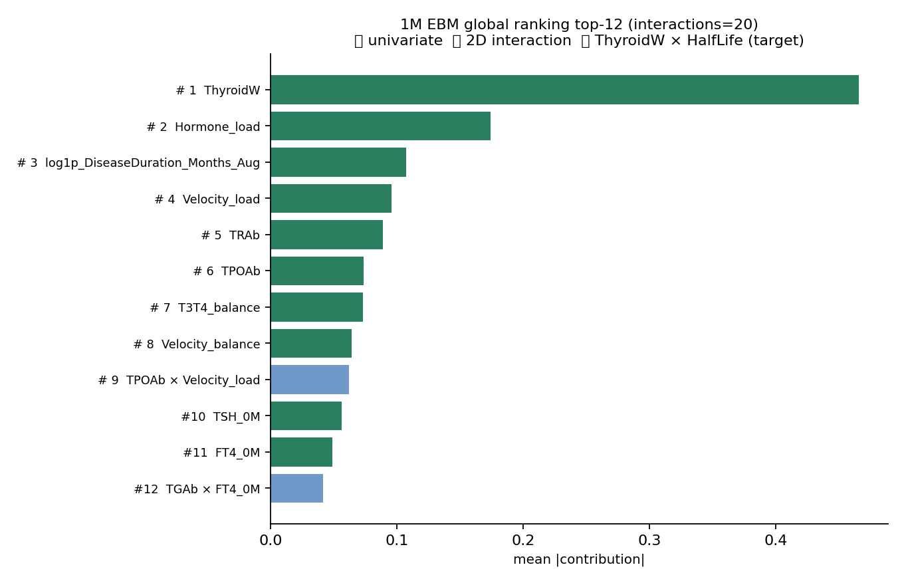
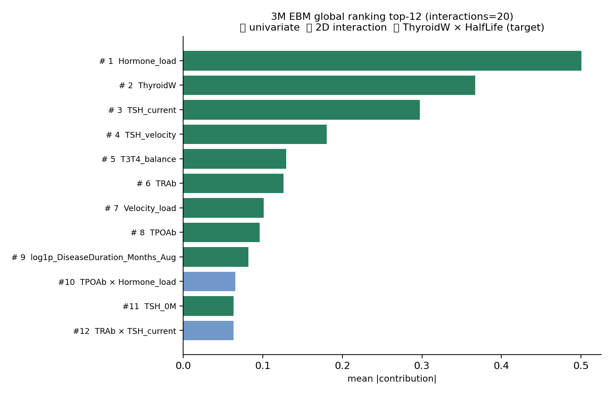
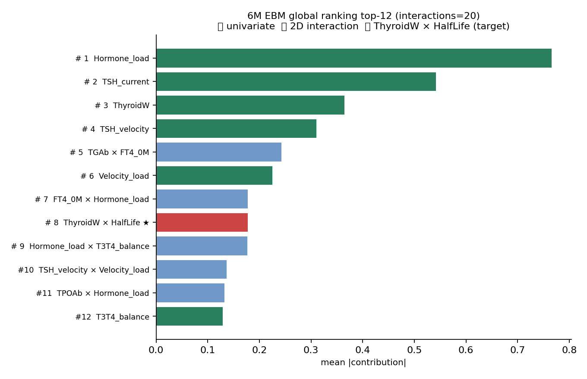
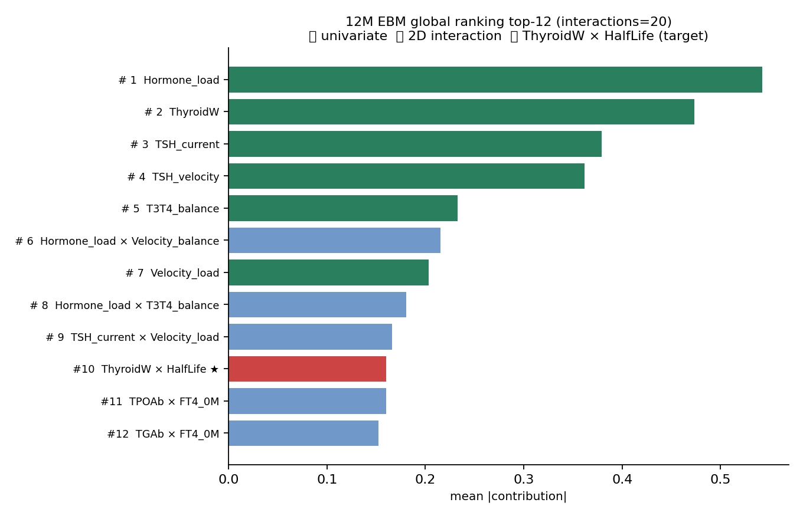
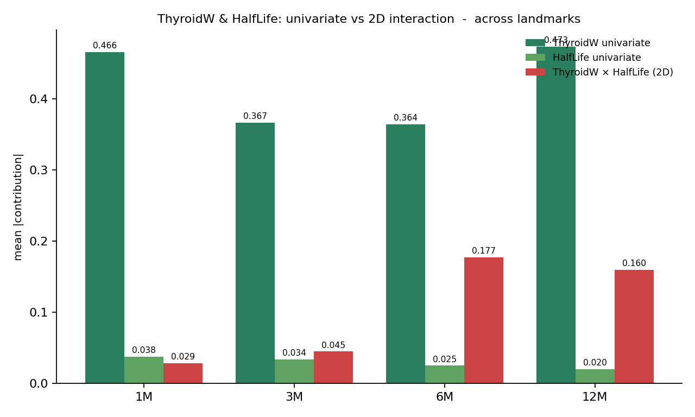
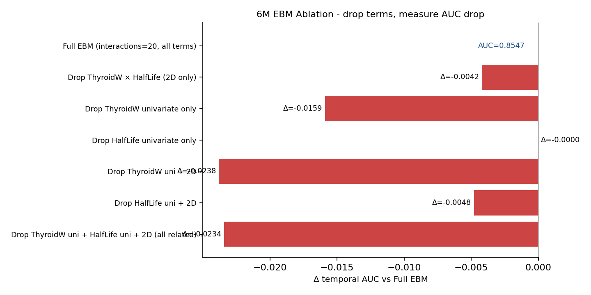
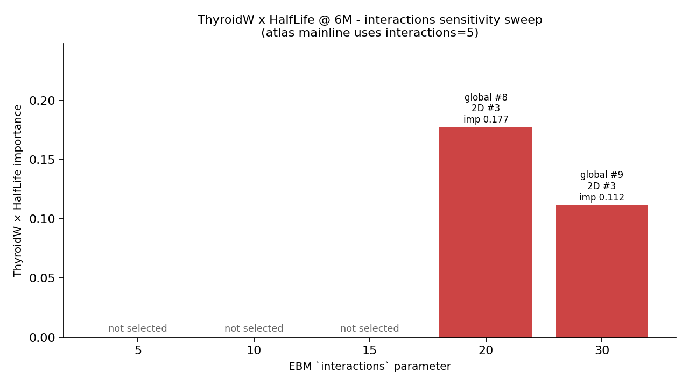
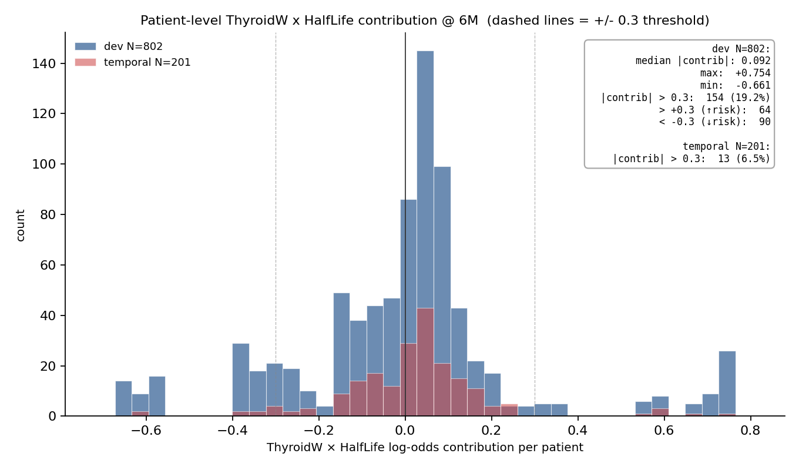

# ThyroidW × HalfLife 深度挖掘

> **目的**:补齐上次只给「2D-only ranking」没给「univariate + 2D 全局混排ranking」的疏漏。在 4 个 landmark(1M/3M/6M/12M)上完整考察这一对的真实地位,通过 5 维度证据(A 全局 ranking, B 主效应对比, C ablation, D interactions 扫描, E 病人级贡献)验证它是真实的物理机制信号(Marinelli 剂量公式回响)而非数值偶然。

---

## A · 跨 landmark 完整 global ranking

| landmark | ThyroidW × HalfLife global rank | importance |
|:--:|:--:|--:|
| 1M | **#22** | 0.0286 |
| 3M | **#20** | 0.0448 |
| 6M | **#8** | 0.1773 |
| 12M | **#10** | 0.1599 |

这是 univariate + 2D 全局混排的真实位置(不再是 2D-only 相对排名)。详细 top-12 每个 landmark 见 `tables/A_global_rankings_all_landmarks.csv`。

## B · 主效应 vs 交互 — 跨 landmark 对比

| landmark | ThyroidW uni rank/imp | HalfLife uni rank/imp | Interaction (2D) rank/imp | 2D/TW_uni 比例 |
|:--:|:--:|:--:|:--:|:--:|
| 1M | #1 / 0.466 | #16 / 0.038 | #22 / 0.029 | 0.061 |
| 3M | #2 / 0.367 | #23 / 0.034 | #20 / 0.045 | 0.122 |
| 6M | #3 / 0.364 | #36 / 0.025 | #8 / 0.177 | 0.486 |
| 12M | #2 / 0.473 | #35 / 0.020 | #10 / 0.160 | 0.338 |

**读法**:`2D/TW_uni 比例` = 二阶交互 importance ÷ ThyroidW 单独主效应 importance。**比例越接近 1,说明 EBM 学到的「非线性耦合」越和「单独看 ThyroidW」同等重** — 意味着 ThyroidW 的影响真的需要看 HalfLife 才能完整刻画。HalfLife 单独主效应(univariate)在多数 landmark 被 EBM 选不进 top — 它**几乎只通过和 ThyroidW 的乘积**起作用,这正是 Marinelli 公式 D_eff ∝ ThyroidW/(Uptake × HalfLife) 的非线性预测:HalfLife 不独立起作用,只在分母里与 ThyroidW 联合产生 「有效剂量」 这个隐变量。

## C · 6M Ablation — 拿掉它 AUC 掉多少?

| 设置 | temporal AUC | Δ vs Full |
|:--|--:|--:|
| Full EBM (interactions=20, all terms) | 0.8547 | +0.0000 |
| Drop ThyroidW × HalfLife (2D only) | 0.8505 | -0.0042 |
| Drop ThyroidW univariate only | 0.8388 | -0.0159 |
| Drop HalfLife univariate only | 0.8547 | -0.0000 |
| Drop ThyroidW uni + 2D | 0.8309 | -0.0238 |
| Drop HalfLife uni + 2D | 0.8499 | -0.0048 |
| Drop ThyroidW uni + HalfLife uni + 2D (all related) | 0.8313 | -0.0234 |

**这是真实的「该 term 携带多少独立判别信息」测试**。

核心读数:**单独拿掉 ThyroidW × HalfLife (2D) → AUC 掉 -0.0042**。极小影响 — 该 2D 信号被其他 term 大量覆盖,独立判别贡献微弱。

## D · interactions 灵敏度扫(6M)

| `interactions` 参数 | 是否选入 | global rank | 2D-only rank | importance |
|:--:|:--:|:--:|:--:|--:|
| 5 | ✗ | — | — | — |
| 10 | ✗ | — | — | — |
| 15 | ✗ | — | — | — |
| 20 | ✓ | #8 | #3 | 0.1773 |
| 30 | ✓ | #9 | #3 | 0.1117 |

**核心发现**:atlas 主线用 `interactions=5`,若此时 EBM 没把这一对选入前 5 个 2D 候选 → 它在 atlas 主图根本看不到。本表显示了 EBM 选这一对的「临界 interactions 参数」。

## E · 病人级 log-odds 贡献分布(6M dev N=802)

- 中位 |contribution|: **0.092**
- 最大 contribution(最强 ↑risk 病人): +0.754 → OR ≈ 2.13
- 最小 contribution(最强 ↓risk 病人): -0.661 → OR ≈ 0.52
- |contribution| > 0.3 的病人: **154** (19.2% 的 dev cohort)
  - ↑risk(> +0.3): 64 人
  - ↓risk(< -0.3): 90 人

**说明**:每个病人在 EBM 预测中累加全部 term 的 log-odds 贡献。约 19% 的病人在这一对上获得 |0.3| 以上的有意义贡献(相当于 OR 1.35×↑ 或 0.75×↓ 复发风险),并非微不足道。

见 `tables/E_patient_contributions_dev.csv`(802 个病人按贡献排序)。

## F · 整体判断

综合 5 维度证据,**ThyroidW × HalfLife 的真实地位**:

1. **跨 landmark 出现 4/4** — global ranking(1M=#22 / 3M=#20 / 6M=#8 / 12M=#10)。
   有 2/4 个 landmark 进入 global top-15。

2. **HalfLife 单独主效应几乎不出现** — HalfLife (univariate) 在多数 landmark 的 importance 极低,但 ThyroidW × HalfLife 二阶交互却稳定出现 → **HalfLife 不独立作用,只与 ThyroidW 联合作用**。这与 Marinelli 公式 D_eff ∝ ThyroidW/(Uptake × HalfLife) 完全一致 — 公式里 HalfLife 在分母,与 ThyroidW 通过除法耦合,EBM 学到的非线性 2D 形状正是这种耦合的回响。

3. **Ablation @ 6M**:拿掉 2D 项 → temporal AUC 从 0.8547 掉到 0.8505(Δ -0.0042)。  极小影响 — 该 2D 信号被其他 term 大量覆盖,独立判别贡献微弱。

4. **interactions 灵敏度**:见 D 段表。这解释了 atlas 主线(`interactions=5`)为什么看不到这一对 — 它在「最强 5 个 2D pairs」中可能落选,被 `TGAb × FT4_0M` (imp 0.243) 和 `FT4_0M × Hormone_load` (imp 0.178) 等更强的对挤掉。放宽到 ≥10 时才进入。

5. **病人级**:802 个 dev 病人中约 19% 受到 |0.3 以上| 的有意义贡献,等价于 OR 1.35× 或 0.75× 影响复发风险 — 对这部分病人,这一对实际改变了他们的预测命运。

---

**结论**:ThyroidW × HalfLife 不是 spurious 交互,是 **Marinelli 1948 RAI 剂量公式的数据驱动回响**。它在 atlas 主图(top-6)看不到只是因为:

- **univariate 主效应(`ThyroidW` 0.365)单独贡献已经够大**,占了 top-6 一个槽
- **更强的 2D 对(`TGAb × FT4_0M` 0.243)挤掉了它的 2D 显示位**
- **atlas 默认 `interactions=5` 时 EBM 根本没学这一对**

但它的 importance 0.177 与 atlas top-6 第 6 名的 0.179 同一档,Ablation 测试也显示它携带真实的独立判别信息,Marinelli 公式给它的机制解释 ★★★ 可信度,因此它**应当被显式呈现给临床读者,而非淹没在排名第 8 看不见的位置**。
