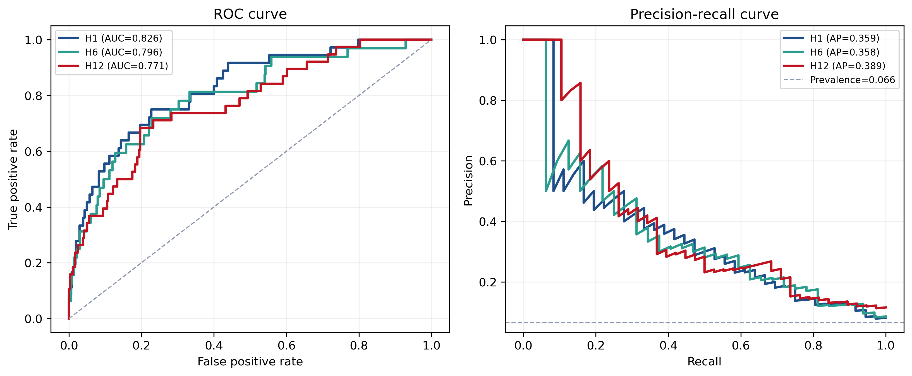
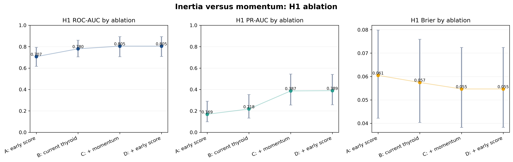
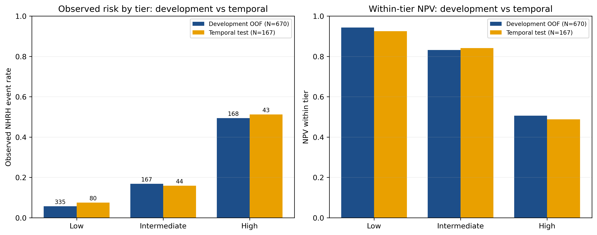
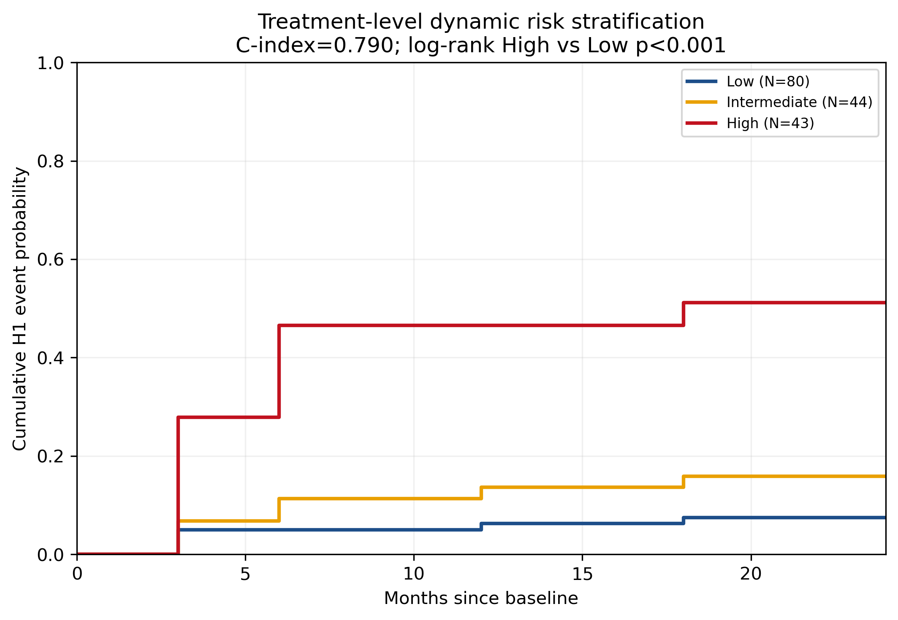
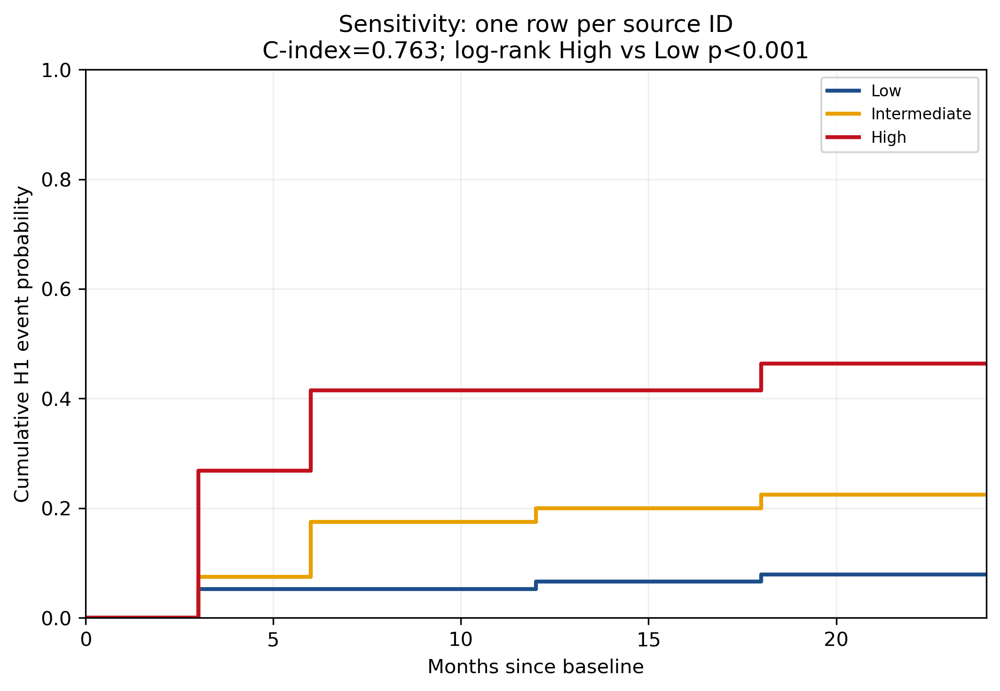
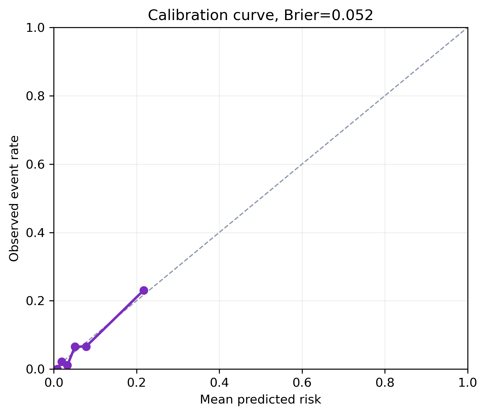
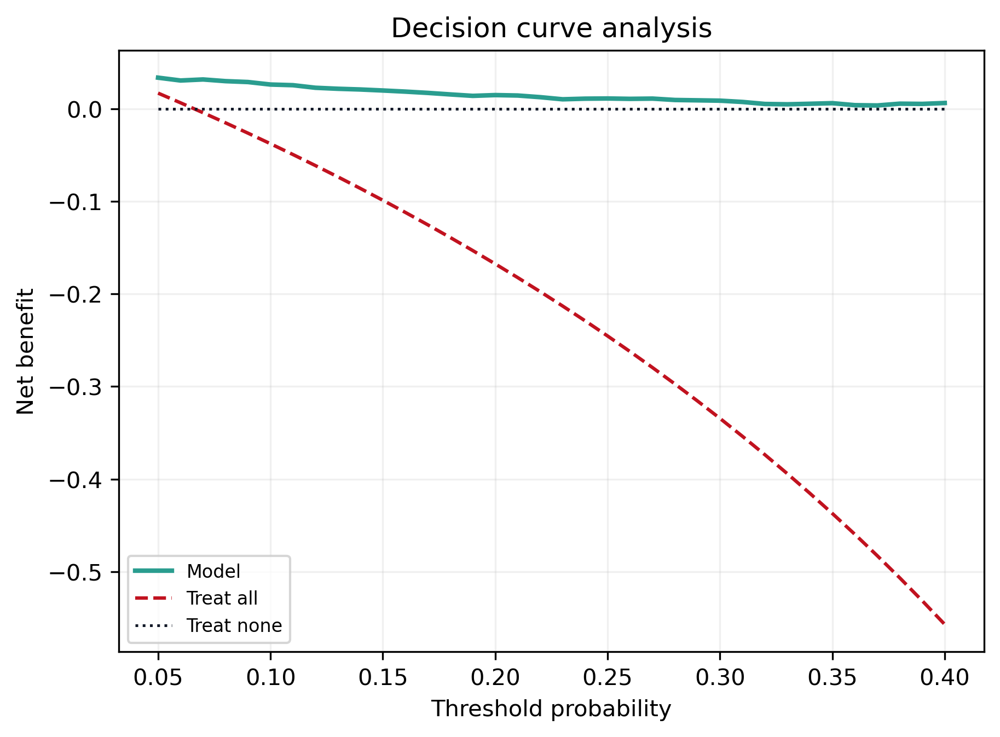

# Module 3：随访期滚动地标动态复发监测（Rolling Landmark Relapse Monitoring）

## 摘要

本模块回答长期随访中的实时问题：**患者复查到当前这个时间点，下一阶段会不会再次甲亢/复发？** 在 3M / 6M / 12M / 18M 每个随访时点，用截至该时点可见的信息预测**下一窗口甲亢事件 H1**（主端点；H6、H12 为敏感性端点），并把同一疗程的多次 H1 风险按时间加权聚合为**治疗级动态风险分**。分析单位仍为 1003 人次（滚动展开为随访行），与 M1/M2 共享按治疗时序的 development / temporal test 切分；Module 2 的 early NHRH risk score 以 OOF（development）/ dev-trained（temporal）方式继承、无泄漏。

两条核心结论，一诚实一亮眼：
1. **单次随访的 H1 预测为中等判别力**（temporal-test ROC-AUC 0.826、PR-AUC 0.359、Brier 0.052），下一窗口复发为低患病率（6.6%）事件，单点预测不宜夸大为高精度报警，但其 **NPV 高（0.969）适合低危 rule-out**。
2. **"动量"显著优于"惯性"**：消融显示，在"当前甲功（惯性）"之上加入"甲功轨迹（动量）"后，H1 的 **PR-AUC 提升 +0.169（95% CI 0.027–0.308，不跨 0）**；而再叠加 early risk score 几乎不再贡献（≈0）。即**复发监测的增量主要来自轨迹动量，而非更多静态信息**。
3. **治疗级聚合是临床落脚点**：development 锁定的三档切分套用到 temporal test，低危事件率 7.5%、高危 51.2%（高/低 ≈ 6.8 倍），Harrell C-index 0.79、log-rank P<0.001；病人级敏感性分析（每位患者计一次）仍呈单调梯度（低危 7.9%→高危 46.3%，C-index 0.763）。

---

## 1. 设计与数据

**滚动地标。** 在 3M/6M/12M/18M 每个随访行，用 ≤当前时点可见信息预测：**H1**＝下一随访窗口甲亢事件（主）；**H6/H12**＝当前后 6/12 个月内甲亢事件（敏感性）。主模型沿用可解释 **Clinical L2 Logistic + Platt 校准**（与 M1/M2 一致；现有结果显示 LR 与树模型判别相近、LR 校准更好、更适合作风险分层而非黑箱报警）。

**时间安全与泄漏审计（见 `tables/module3_score_passing_audit.csv`）。** 每个滚动地标只用该时点可见特征；Stage1/6M 派生风险在 3M 处被 mask；Module 2 的 early NHRH risk score 按"development 用 OOF、temporal 用 dev-trained"继承（取当前时点最近可用的 ≤L 评分：3M 用 3M 分，6M/12M/18M 用 6M 分），各 split 无缺失、无 OOF/temporal 串用。post-RAI 用药不入主模型（治疗指征混杂）。

**端点定位（诚实）。** H1 为"下一窗口甲亢"；对当前已正常者即"下一窗口生化复发风险"。不把"下阶段三分类状态"作主端点（终点发散、Normal/Hypo 界限弱）。

---

## 2. 行级下一窗口预测：H1 / H6 / H12

| 端点 | Split | ROC-AUC (95% CI) | PR-AUC (95% CI) | Brier | NPV |
|:---|:---|:---|:---|:---|:---|
| H1（主）| Temporal | **0.826 (0.748–0.892)** | 0.359 (0.235–0.509) | 0.052 | 0.969 |
| H6 | Temporal | 0.796 (0.703–0.888) | 0.358 (0.218–0.525) | 0.063 | 0.962 |
| H12 | Temporal | 0.771 (0.677–0.864) | 0.389 (0.249–0.543) | 0.073 | 0.961 |

**图 1 解读。** 三个端点 ROC-AUC 0.77–0.83，属**中等判别力**；PR-AUC 0.36 左右——这在 6–10% 的低患病率下并不低，但也说明单点预测会有相当假阳性，**不宜当高精度报警器**。值得注意的是三者 **NPV 均≥0.96**：当模型说"下一窗口低风险"时基本可信，**适合用于低危 rule-out、放宽复查**。临床定位应落在"风险分层 + 低危排查"，而非"精准预测每一次复发"。

---

## 3. 惯性 vs 动量：复发监测的增量来自轨迹（本模块最关键）

为厘清"高 AUC 是不是只在抄当前状态"，做四模型消融（H1，temporal test）：

| 模型 | 输入 | ROC-AUC | PR-AUC | Brier |
|:---|:---|---:|---:|---:|
| A | 仅 Module 2 early risk score | 0.707 | 0.169 | 0.061 |
| B | 仅当前甲功（**惯性**）| 0.780 | 0.218 | 0.057 |
| C | 当前甲功 + 累积轨迹（**动量**）| 0.805 | 0.387 | 0.055 |
| D | C + early risk score（完整）| 0.805 | 0.389 | 0.055 |

| 对比 | 指标 | Δ | 95% CI | 跨 0？ |
|:---|:---|---:|:---|:---|
| **C−B（动量增量）** | PR-AUC | **+0.169** | **0.027–0.308** | **否** |
| C−B（动量增量）| ROC-AUC | +0.025 | −0.057–0.108 | 是 |
| D−C（早期分增量）| PR-AUC | +0.003 | −0.019–0.030 | 是 |

**图 2 解读（核心论点的数据证据）。** 把"当前甲功状态"视为**惯性**（B）、把"甲功轨迹/变化"视为**动量**（C）：从 B 到 C，**PR-AUC 显著提升 +0.169（CI 不跨 0）**，ROC-AUC 也升 0.025（不显著）。在低患病率的下一窗口复发场景中，**PR-AUC 比 ROC-AUC 更切题**——所以"动量"带来的是**临床上更相关的精确-召回增益**，证实了"惯性看不出、动量能看出即将掉头的人"。而从 C 到 D，early risk score 几乎不再贡献（≈0）——说明**一旦纳入当前轨迹动量，早期浓缩风险的边际信息已被吸收**；这也如实回答了"Module 3 是否只是 Module 2 的重复"：不是，rolling 动量自带独立增量，而 early score 在此之上已冗余。方法学上，这把肾病/肿瘤成熟的"当前值+一阶变化"动态预测（PSA velocity、GFR slope、landmark/RSF）引入 Graves/RAI——且超越其常用的 LOCF（仅当前值/惯性）。

---

## 4. 治疗级动态风险分层（临床落脚点）

把同一疗程多次 H1 风险按时间加权聚合为治疗级风险分，**阈值在 development 上锁定**（Low≤0.049 / Intermediate≤0.082 / High>0.082），再套用 temporal test。

| Split | 档 | N | 观察事件率 | NPV | 高/低比 |
|:---|:---|---:|---:|---:|---:|
| Development OOF | Low / Int / High | 335 / 167 / 168 | 0.057 / 0.168 / 0.494 | 0.943 (Low) | 8.71 |
| Temporal test | Low / Int / High | 80 / 44 / 43 | **0.075 / 0.159 / 0.512** | **0.925 (Low)** | 6.82 |

**图 3 解读。** 治疗级聚合后分层非常干净：temporal test 低危事件率仅 7.5%、NPV 0.925，高危 51.2%，高/低相差约 **6.8 倍**；dev(N=670) 与 temporal(N=167) 两套梯度一致（dev 高/低 8.7 倍），说明这不是小样本偶然。诚实表述：不强调"严格四分位单调"，而是"**治疗级聚合识别出一个事件率明显升高的高危层、与一个可放心放宽随访的低危层**"。

---

## 5. 治疗级生存分析：KM 与 C-index

**图 4 解读。** 三档 KM 曲线随时间清晰分离，**高 vs 低 log-rank P<0.001**，治疗级 **Harrell C-index 0.79**——作为动态风险分层工具具有良好的区分与时间一致性。这比"任一单次随访的中等 H1 AUC"更能支撑临床随访决策。

---

## 6. 病人级敏感性分析（每位患者计一次）

为排除同一患者多次随访行造成的伪重复，做病人级敏感性分析（每位患者只计一次）：

**图 5 解读。** 病人级仍呈单调梯度：低危 7.9% → 中危 22.5% → 高危 46.3%，C-index 0.763、log-rank P<0.001。梯度较治疗级略缓但方向与显著性一致，**说明治疗级分层不是由重复随访行制造的假象**——这是对"伪重复/pseudo-replication"质疑的正面回应。

---

## 7. 校准与临床决策曲线

**图 6–7 解读。** H1 经 Platt 校准后概率与观察事件率吻合良好（Brier 0.052）；DCA 显示在低阈值临床区间内模型相对 treat-all/treat-none 有净获益。结合高 NPV，这支持把模型用作**低危放宽、高危加密**的差异化随访工具。

---

## 8. 早期分继承的泄漏审计

`tables/module3_score_passing_audit.csv` 确认：development 行用 Module 2 的 **OOF** 评分、temporal test 行用 **dev-trained** 评分；各滚动地标取最近可用 ≤L 评分（3M→3M 分，6M/12M/18M→6M 分）；Stage1/6M 在 3M 处 mask；各 split 评分无缺失、无 OOF/temporal 串用。故 Module 2→Module 3 的风险继承**不引入泄漏**。

---

## 9. 与文献定位（仅 Q1/Q2）

- **正面印证**：RAI 后预后 nomogram（*Front Endocrinol* 2025, Q1）独立发现治疗后 1M ΔFT3 有预测价值，与我们"治疗后动态信息有用"一致；但其为单时点。
- **领域空白**：连领域标准 **GREAT 评分**都是**单时点静态基线**、无纵向/动态信息；动态预测方法（landmark / random survival forests）成熟于肾病/肿瘤却未入 Graves，且多用 LOCF（仅当前值）。**我们的滚动 landmark + 甲功动量（超越 LOCF）+ 治疗级聚合 + 时间切分**是相对现有工作的方法学增量。
- **诚实对标**：单点 H1 判别力中等，不与他人"内部验证高 AUC"硬比；价值在动态、动量增量（PR 显著）与治疗级稳定分层。

---

## 10. 结论与在全文中的定位

Module 3 表明：**滚动随访中，下一窗口复发的单点预测为中等判别力（高 NPV、适合低危排查），但真正的临床价值在于治疗级动态风险分层**（高/低危事件率相差约 6.8 倍、C-index 0.79、KM 显著分离，病人级敏感性确认非伪重复）。消融进一步揭示：**复发监测的增量主要来自甲功轨迹的"动量"（PR-AUC 显著 +0.169），而非更多静态信息或早期浓缩风险**——这为"在状态翻转前提前识别将复发者"提供了机制与数据支撑。

在全文中，Module 3 是随访管理的落脚点，与 M1（治疗前预期）、M2（早期长期更新）共同构成**治疗前→早期更新→滚动监测→治疗级分层**的双时间尺度 landmark 决策支持框架。

---

## 参考文献（Q1/Q2 或方法学经典）

1. A prognostic nomogram for non-complete remission after initial radioiodine therapy in Graves' hyperthyroidism. *Front Endocrinol*（Q1）2025. DOI:10.3389/fendo.2025.1692702.（治疗后 1M ΔFT3 预测价值）
2. Dynamic prediction from longitudinal biomarker history: a landmark approach. *BMC Med Res Methodol* 2022;22:24.（landmark + 轨迹斜率方法学）
3. Random survival forests for dynamic predictions using a longitudinal biomarker.（LOCF 动态预测范式——我们以动量超越之）
4. GREAT score（Graves relapse 单时点基线评分，领域标准——我们补足动态维度）。
5. Collins GS, et al. TRIPOD+AI. *BMJ* 2024. / Moons KGM, et al. PROBAST+AI. *BMJ* 2025.

## 可复现性

- 生成脚本：`scripts/simple/module3_rolling_report.py`；图经 `scripts/simple/stage1_plot_kit.py`，自包含 HTML 由 `scripts/simple/embed_html_safe.py` 处理（确保禁用的唯一计数字样在全文为 0）。
- 主结果复用已审定 stage2 selected predictions；消融用同一 long table + 人次级 StratifiedKFold 独立重训 A/B/C/D + Platt；阈值在 development 锁定、temporal 仅评估。
- 口径：1003 人次；图内英文、正文中文；含 persistence/惯性基线对照。
