# 3M 表征增强的四分支动态复发预警模型

## 摘要

本报告聚焦一个动态复发模型：在每个随访 landmark `t`，仅使用 `t` 及之前可得信息，预测下一时间窗 `t -> t+1` 内是否复发。当前主模型记为 **4branch**，结构为 **static / local / global / z3M 四分支 + 单一 hazard head**。

在固定阈值 `0.785` 下，temporal test 达到 AUC `0.842`、PR-AUC `0.320`、F1 `0.347`、Recall `0.610`、Specificity `0.835`。该阈值锁定自开发流程中的 train-fit F1 选择，并补充 validation/test threshold sensitivity；temporal test 只用于最终报告。

### 研究亮点

- **四分支单头动态风险建模**：static、local、global 与 z3M early-response branch 分别学习背景、当前决策态、累积病程和 3M 早期反应，再由单一 hazard head 输出下一时间窗复发风险。
- **3M 表征不是硬拼特征**：z3M 作为独立分支进入模型，并由 `time_sigmoid` gate 调节；`Start_Time < 3M` 时 z3M 嵌入和 mask 均为 0，避免未来锚点信息提前进入。
- **面向概率校准、稀有事件排序和临床预警效用的训练目标**：主损失保留 patient-weighted BCE 以维持概率风险估计；hard-negative ranking 与 DCA-inspired soft net-benefit 仅作为小权重辅助正则，弱对齐低复发率场景下的高风险排序和临床报警阈值。
- **患者级 cluster bootstrap 性能不确定性估计**：bootstrap CI 按 `Patient_ID` 聚类抽样，而不是把同一患者的多个 interval 当作完全独立样本。
- **interval-level 与 patient-level 同时汇报**：既报告每个动态窗口的复发风险，也报告 patient-level max-risk warning，方便转化为随访预警策略。
- **模型解释、阈值敏感性和误差分析闭环**：报告包含 calibration、DCA、threshold sensitivity、top-k capture、错题本和 matched training-time branch removal。

## 队列与任务定义

动态任务定义为：给定患者截至 landmark `t` 的全部可得信息，预测 `t -> t+1` 区间是否出现 Normal→Hyper 复发。由于同一患者可贡献多个 at-risk interval，训练和评估均保留患者级分组意识。

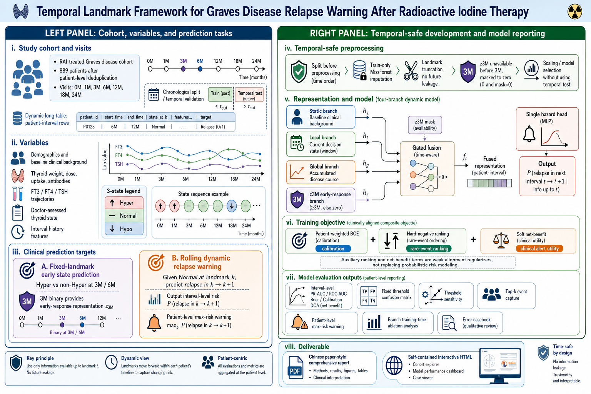

Figure 00 给出整篇工作的全局框架。左侧定义队列、随访时间点、动态长表、变量类型和两个临床预测任务：固定 landmark 早期状态识别，以及滚动 dynamic relapse warning。右侧强调开发流程的时间安全性：先按时间顺序切分，再进行 train-only MissForest 插补、landmark 截断、3M 表征 mask 和模型选择；temporal test 只用于最终报告。该图适合作为论文主图或方法总览图，帮助读者先理解“为什么这是一个动态随访预警问题”，再进入模型细节。

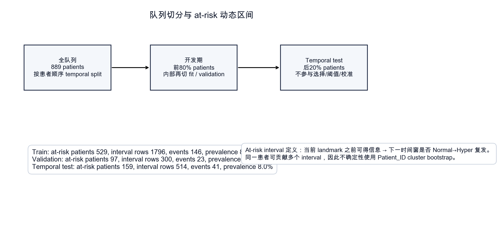

## 3M early-response encoder 背景

3M 固定锚点二分类模型提供早期治疗反应证据，但本报告不把 fixed-landmark 结果作为动态模型的最终输出。它只提供一个 z3M 表征，帮助动态模型在 3M 及之后利用早期反应轨道。

- 3M 二分类 top25 LGBM：Test Acc 0.822, AUC 0.860, PR-AUC 0.761

## 四分支模型结构

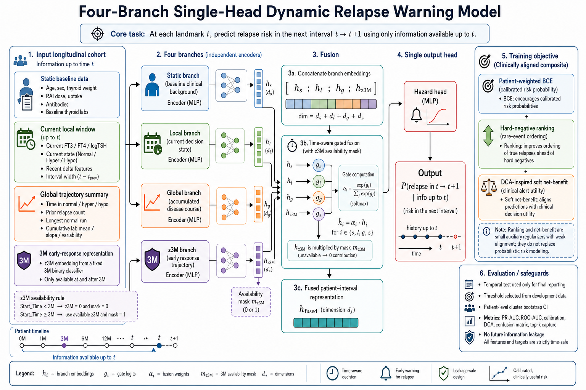

Figure 01B 展开当前主模型的结构细节。模型在每个 landmark `t` 只读取截至 `t` 可用的信息，分别经由 static、local、global 和 z3M 四个独立 encoder 得到分支表征；z3M branch 在 3M 前被置零并由 availability mask 控制，3M 后才提供早期反应轨道信息。四路表征先拼接，再进入 time-aware gated fusion，最终由单一 hazard head 输出下一时间窗 `t -> t+1` 的复发风险。右侧训练目标也对应正文方法：patient-weighted BCE 保留概率校准，hard-negative ranking 强化低事件率下的排序，soft net-benefit 弱对齐临床预警效用；evaluation safeguards 则说明 temporal test、阈值和 bootstrap 的边界。

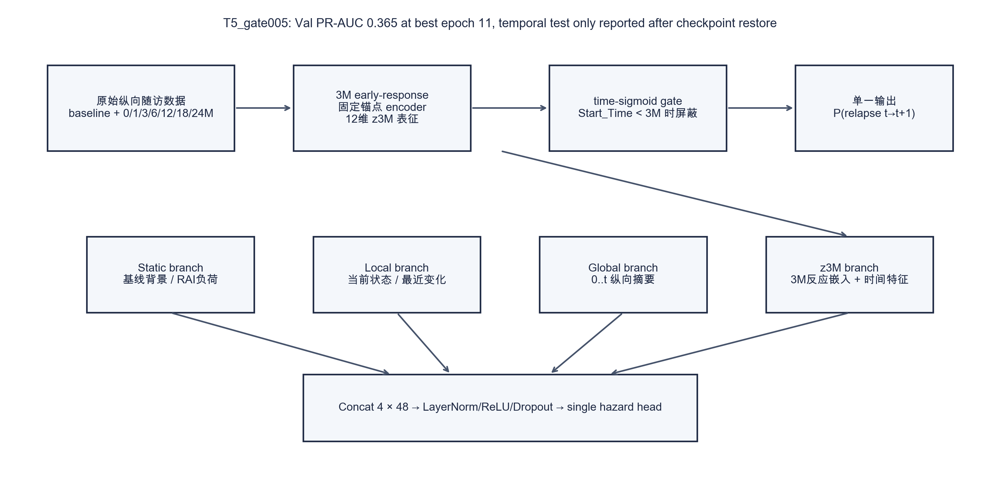

Figure 01 是报告内部使用的紧凑流程图，用于和后续指标、消融和解释图保持一致；Figure 01B 则作为更完整的论文式结构图，展示输入、分支、融合、训练目标和评估防护的完整链条。

模型配置要点：

| Parameter | Value |
| --- | --- |
| Threshold | 0.785 |
| Best_Epoch | 11 |
| BootstrapRows | 0 |
| Z3M_Mode | branch |
| ModelBranches | 4 |
| Z3MBranchLRScale | 1.000 |
| Z3MGateInit | 0.050 |
| Z3MGateMode | time_sigmoid |
| Z3MTimeFeatures | True |
| PretrainZ3MBranch | False |
| Z3MPretrainBestEpoch | 0 |
| Z3MPretrainBestValPRAUC |  |
| Z3MAuxLossWeight | 0.000 |
| Z3MPretrainTarget | z3m |
| DropStaticBranch | False |
| FeatureSelection |  |
| PatientWeightedBCE | True |
| RankLossWeight | 0.100 |

特征数量概览：

| Branch | Feature_Count |
| --- | --- |
| global | 22 |
| local | 13 |
| static | 16 |
| z3M | 14 |

## 特征构建与特征选择边界

当前动态复发模型没有启用额外的 `feature_selection_json` 筛选器；配置表中的 `FeatureSelection` 为空。因此，本版模型不应表述为“由 test 后反选变量得到”，也不把 SHAP、分支消融或错题本当作训练前筛选步骤。

特征策略采用更保守的临床建模口径：先由临床先验定义候选变量，再进行 temporal-safe 特征工程，最后按四个信息来源结构化输入模型。当前共使用 `65` 个输入特征：static `16` 个、local `13` 个、global `22` 个、z3M `14` 个。static branch 承载治疗前背景和疾病负荷；local branch 承载当前窗口的决策态；global branch 承载截至 landmark `t` 的累计病程摘要和窗口交互；z3M branch 承载固定 3M 早期反应模型输出的潜在表征，并在 3M 前强制 mask 为 0。

需要区分两个层次：固定 landmark 3M 二分类模型可报告 top25 LGBM / stable selection 作为早期状态识别模型的特征筛选结果；动态复发模型本身则没有再做显式稳定特征筛选。本报告中的 SHAP、matched training-time branch removal 和 error casebook 均属于 post-hoc explanation / audit，用于解释和审计模型行为，不参与模型训练、阈值选择、校准拟合或特征筛选。

## 训练目标：概率校准、稀有事件排序与临床预警效用

我们设计了一个面向区间级复发预警的临床对齐复合目标函数。该目标保留患者加权二元交叉熵以维持风险概率估计，加入难负样本排序项以改善低复发率场景下的稀有事件排序，并加入小权重、受决策曲线启发的软净获益项，使训练目标弱对齐临床预警阈值。

`L = L_patient-weighted BCE + lambda_r L_hard-rank + lambda_nb L_soft net benefit`

| 组件 | 工程含义 | 医学解释 |
| --- | --- | --- |
| patient-weighted BCE | 按患者加权的二分类交叉熵 | 避免随访更密集的患者在 interval-level 数据中被重复放大，使每位患者对概率学习贡献近似均衡。 |
| hard-negative ranking | 推动阳性 interval 分数高于高分阴性 interval | 在低复发率下优先优化高风险区排序，减少真正复发窗口被高风险假阳性淹没。 |
| soft net-benefit | 可导的 DCA-inspired 辅助项 | 把临床报警阈值附近的假阳性/假阴性权衡弱写入训练目标；DCA 本身仍作为最终临床效用评价。 |

训练目标按照任务的临床结构设计。由于长格式数据中同一患者可贡献多个 at-risk interval，我们使用患者加权 BCE，使每位患者对概率估计目标的贡献近似均衡。考虑到区间级复发率较低，我们加入难负样本排序项，惩罚复发 interval 的分数低于高分非复发 interval，从而改善临床高风险区的排序能力。最后，受 DCA 启发，我们在预设报警阈值附近加入小权重软净获益项，使训练目标弱对齐临床预警效用。

该复合目标不应被理解为替代标准概率风险建模。相反，BCE 被保留以维持概率校准，排序项和软净获益项仅作为小权重辅助正则，分别面向稀有事件预警和临床决策效用。这一设计与动态风险建模中结合概率目标和排序目标的范式一致，也符合临床预测模型中强调校准和决策曲线效用的评价方向。

## 正则化与抗过拟合控制

本模型的抗过拟合策略不是依赖单一强正则，而是由时间安全、患者级权重、辅助目标和模型选择约束共同完成。第一，所有 preprocessing、z3M 可用性和阈值选择都遵守 temporal-safe 规则：temporal test 不参与模型选择、阈值选择、校准拟合或解释层开发；3M 前的 z3M 组件、availability 和 time feature 均强制为 0。

第二，interval-level 长表中同一患者可贡献多个 at-risk interval，因此训练使用 `PatientWeightedBCE=True`，通过患者级 row weight 降低随访次数较多患者对 BCE 概率学习目标的重复放大。最终报告的不确定性估计也采用 `Patient_ID` cluster bootstrap，而不是把 interval 当作完全独立样本。

第三，训练目标中的辅助正则保持小权重：`RankLossWeight=0.1` 用于改善低复发率下的高风险区排序；`NetBenefitLossWeight=0.01`、`ClinicalThreshold=0.2`、`NetBenefitTemperature=0.7` 用于在临床报警阈值附近弱对齐 soft net-benefit。BCE 仍是概率建模主干，ranking 与 soft net-benefit 不替代概率风险学习。

第四，模型选择采用 development-only 约束：`MixedTrainWeight=0.3`、`MixedValWeight=1.0`、`MixedTestWeight=0.0`，且 `DisableTestSelection=True`。学习率调度为 `LRScheduler=plateau`，监控 `selected_score`，best epoch 为 `11`。当前最终报告没有启用 AP loss、LibAUC、z3M auxiliary loss、input/branch gate L1；训练历史中 `mixup_samples=0`，因此不把数据增强写作主模型贡献。公开 artifacts 中未保留最终 run 的 dropout、weight decay 或 branch-drop 数值，本报告不补写这些未确认配置。

## 主结果

主结果全部从 prediction CSV 重新计算，summary CSV 只作为核对来源。表名使用 `core_binary_metrics`，不硬称 15 项，因为实际包含更多临床性能字段。

| Split | N | Events | Prevalence | Threshold | TP | FP | TN | FN | AUC | PR_AUC | PR_AUC_Lift | Accuracy | Recall | Specificity | PPV | NPV | F1 | Balanced_Accuracy | Brier | Calibration_Intercept | Calibration_Slope |
| --- | --- | --- | --- | --- | --- | --- | --- | --- | --- | --- | --- | --- | --- | --- | --- | --- | --- | --- | --- | --- | --- |
| Train | 1796 | 146 | 0.081 | 0.785 | 97 | 284 | 1366 | 49 | 0.851 | 0.318 | 3.910 | 0.815 | 0.664 | 0.828 | 0.255 | 0.965 | 0.368 | 0.746 | 0.221 | -3.016 | 1.214 |
| Validation | 300 | 23 | 0.077 | 0.785 | 17 | 49 | 228 | 6 | 0.865 | 0.365 | 4.765 | 0.817 | 0.739 | 0.823 | 0.258 | 0.974 | 0.382 | 0.781 | 0.218 | -3.049 | 1.168 |
| TemporalTest | 514 | 41 | 0.080 | 0.785 | 25 | 78 | 395 | 16 | 0.842 | 0.320 | 4.008 | 0.817 | 0.610 | 0.835 | 0.243 | 0.961 | 0.347 | 0.722 | 0.219 | -2.878 | 1.084 |

Temporal test 关键指标的 Patient_ID cluster bootstrap 95% CI：

| Split | Metric | Point | CI_Low | CI_High | Bootstrap_Unit | Bootstrap_N |
| --- | --- | --- | --- | --- | --- | --- |
| TemporalTest | AUC | 0.842 | 0.787 | 0.890 | Patient_ID | 1000 |
| TemporalTest | PR_AUC | 0.320 | 0.212 | 0.473 | Patient_ID | 1000 |
| TemporalTest | F1 | 0.347 | 0.244 | 0.441 | Patient_ID | 1000 |
| TemporalTest | Brier | 0.219 | 0.203 | 0.236 | Patient_ID | 1000 |

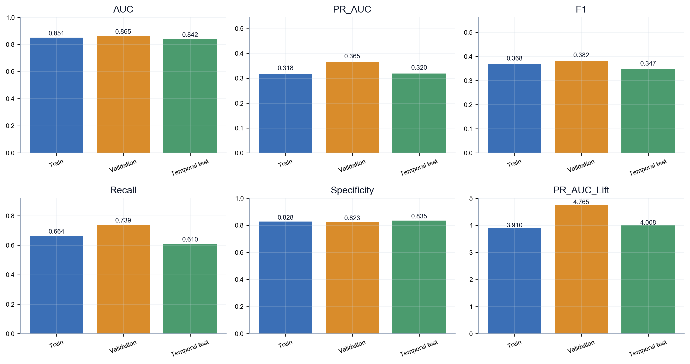

## PR / ROC / Calibration / DCA

PR 曲线中每个 split 都使用自己的 prevalence baseline；DCA 仅画临床更相关的 0.05–0.40 阈值范围。

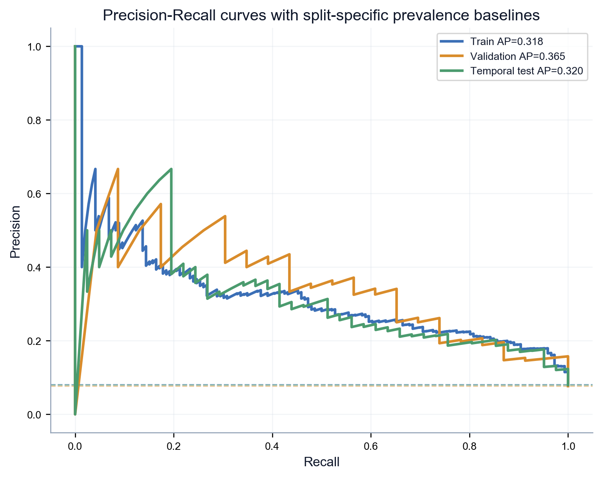

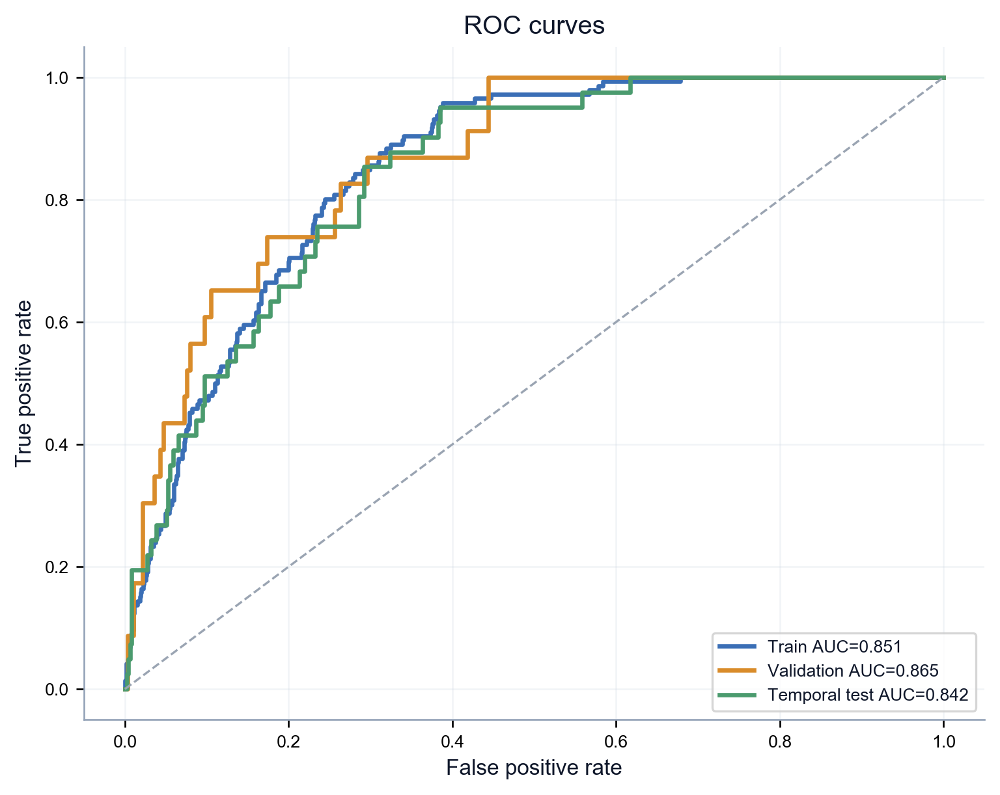

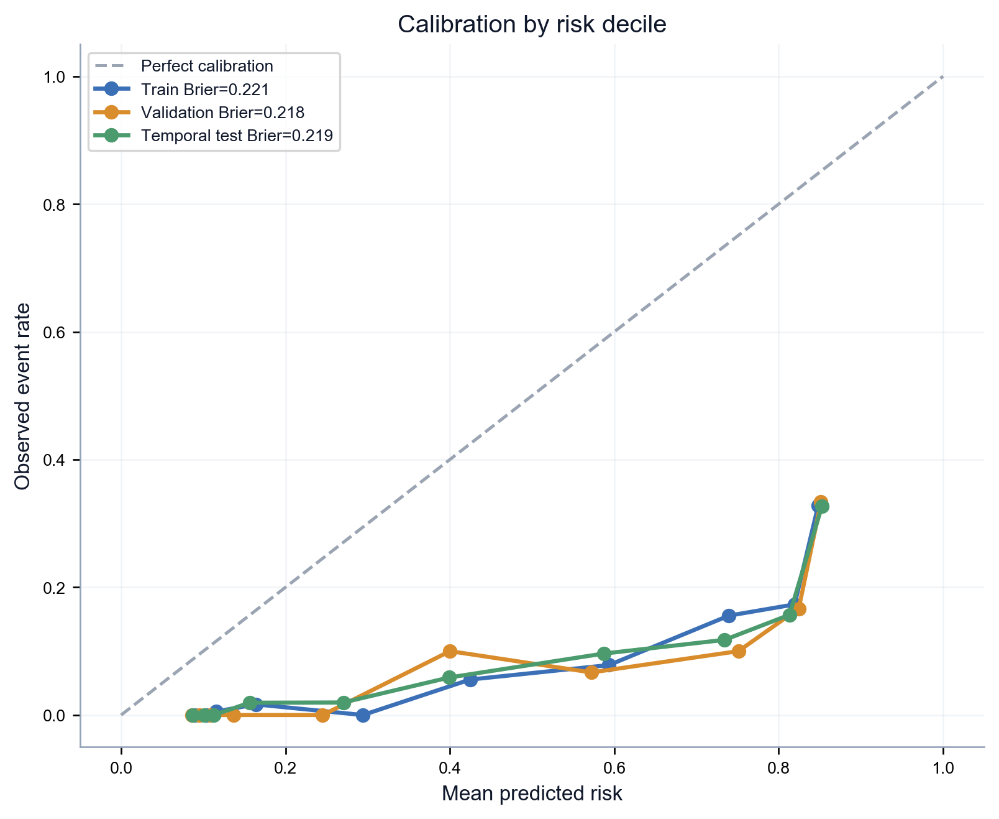

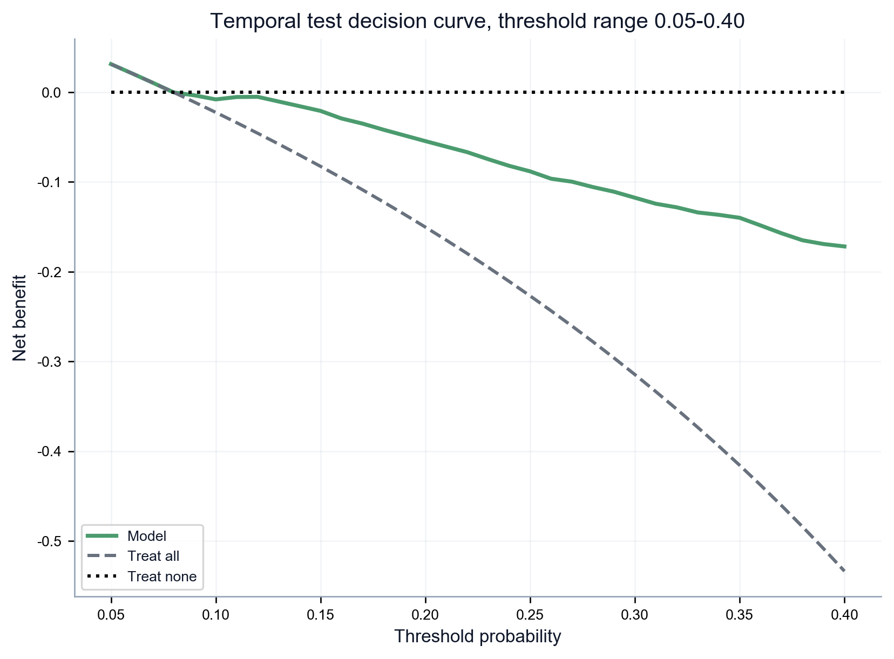

## 按随访窗口的复发检出能力

受复发事件数限制，本图按临床随访窗口汇总概率误差和阈值捕获；晚期 `12M->18M` 与 `18M->24M` 合并为 `12M->24M`。该分析只作为窗口级诊断补充，不参与模型选择、阈值选择或校准拟合。

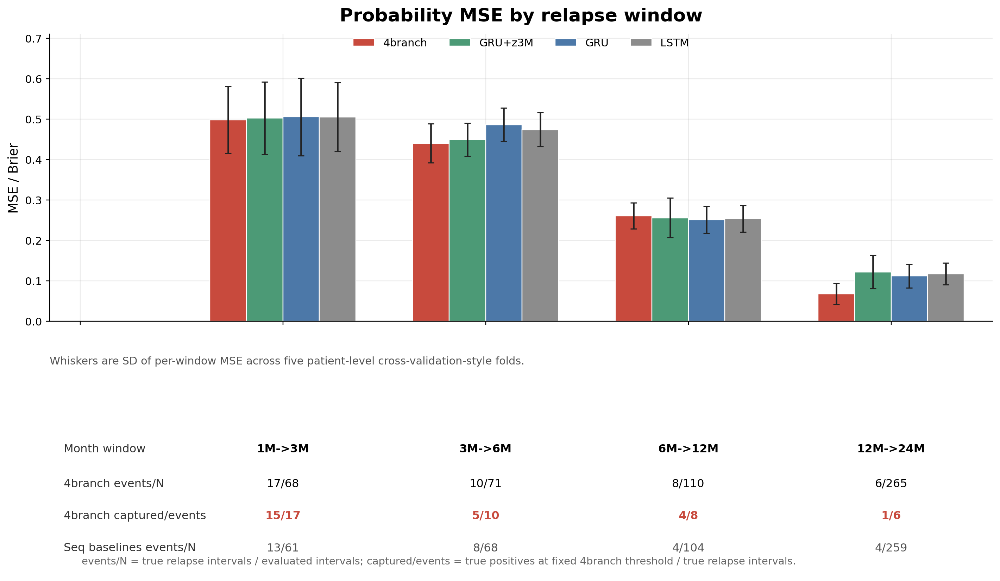

柱状图为 MSE / Brier，误差条为按 `Patient_ID` 构造 5 个交叉验证式 folds 后，各 fold 的 per-window MSE 标准差。下方 `events/N` 表示真实复发 interval 数 / 该窗口评估 interval 数；`captured/events` 表示固定阈值 `0.785` 下 4branch 正确报警的复发 interval 数 / 真实复发 interval 数。

4branch 主模型的窗口级结果如下。完整 PR-AUC 对照、阈值捕获和 MSE fold 来源分别见 `tables/window_prauc_comparison.csv`、`tables/window_threshold_capture_comparison.csv`、`tables/window_mse_fold_comparison.csv`。

| Window | Events/N | TP/Events | Alerts/N | Event_Capture_Mean | Precision_Mean | MSE_Mean | MSE_Fold_SD |
| --- | --- | --- | --- | --- | --- | --- | --- |
| 1M->3M | 17/68 | 15/17 | 57/68 | 0.882 | 0.263 | 0.498 | 0.083 |
| 3M->6M | 10/71 | 5/10 | 24/71 | 0.500 | 0.208 | 0.440 | 0.048 |
| 6M->12M | 8/110 | 4/8 | 17/110 | 0.500 | 0.235 | 0.261 | 0.032 |
| 12M->24M | 6/265 | 1/6 | 5/265 | 0.167 | 0.200 | 0.068 | 0.026 |

读图时重点看两件事：MSE 越低表示概率误差越小；`TP/Events` 才是固定阈值下真正抓住了多少复发窗口。

## 阈值、混淆矩阵与预警能力

主阈值 `0.785` 锁定自开发流程中的 train-fit F1 选择。Temporal test 不参与阈值选择；报告额外给出 validation/test threshold sensitivity，方便观察阈值移动时 sensitivity、specificity、PPV 和 F1 的变化。

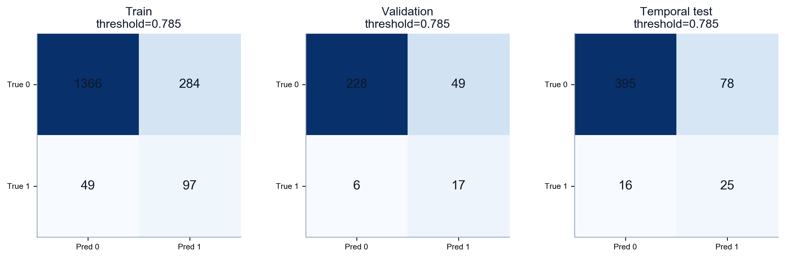

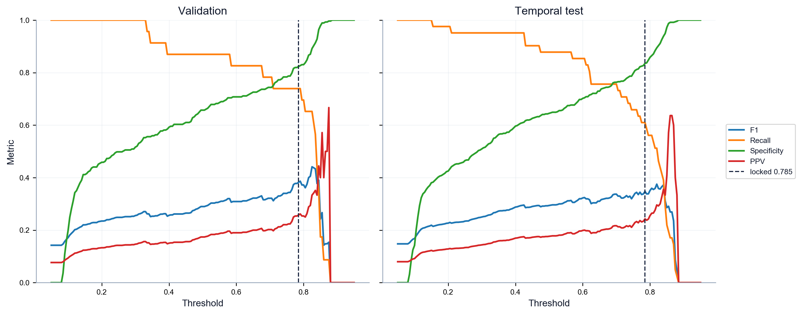

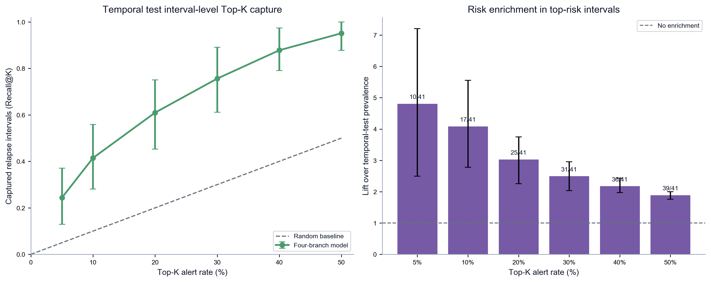

<!-- TOPK_CI_EXPLANATION_START -->
Figure 09 现在只展示 **temporal test interval-level Top-K capture**，对应主任务 `predict relapse in the next interval`。横轴不是固定概率阈值，而是“如果只预警预测风险最高的前 K% interval”；Panel A 显示这些 interval 捕获了多少真实复发窗口，Panel B 显示高风险区阳性率相对总体 temporal-test prevalence 的富集倍数。误差线均为按 `Patient_ID` 聚类抽样的 bootstrap 95% CI。

在 temporal test 中，Top 20% 最高风险 interval 捕获 `25/41` 个复发 interval，Recall@20% = `61.0%`，PPV@20% = `24.3%`，Lift@20% = `3.04x`。换句话说，在固定 20% 预警预算下，高风险区复发率相对于总体 prevalence 有明显富集。

| Top-K | Alerted intervals | Captured positives | Recall@K (95% CI) | PPV@K (95% CI) | Lift@K (95% CI) |
| --- | ---: | ---: | ---: | ---: | ---: |
| Top 10% | 52 | 17/41 | 41.5% (28.1%-55.9%) | 32.7% (19.6%-47.1%) | 4.10x (2.78-5.56) |
| Top 20% | 103 | 25/41 | 61.0% (45.2%-75.0%) | 24.3% (15.8%-33.3%) | 3.04x (2.26-3.75) |
| Top 30% | 155 | 31/41 | 75.6% (61.1%-89.1%) | 20.0% (13.5%-27.9%) | 2.51x (2.04-2.96) |
<!-- TOPK_CI_EXPLANATION_END -->

Patient-level max-risk warning：每个患者取所有 interval 里的最大预测风险。

| Split | N | Events | AUC | PR_AUC | Accuracy | Recall | Specificity | PPV | F1 | Brier |
| --- | --- | --- | --- | --- | --- | --- | --- | --- | --- | --- |
| Train | 529 | 134 | 0.741 | 0.481 | 0.565 | 0.896 | 0.453 | 0.357 | 0.511 | 0.400 |
| Validation | 97 | 20 | 0.816 | 0.554 | 0.577 | 1.000 | 0.468 | 0.328 | 0.494 | 0.410 |
| TemporalTest | 159 | 36 | 0.723 | 0.412 | 0.566 | 0.833 | 0.488 | 0.323 | 0.465 | 0.403 |

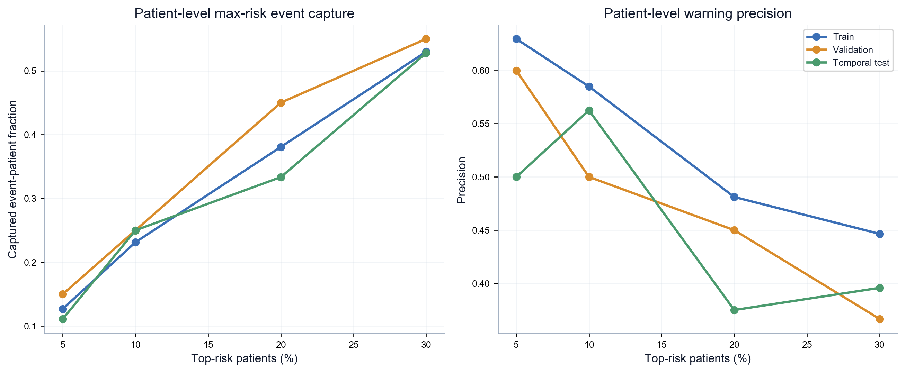

<!-- PATIENT_TOPK_CAPTURE_START -->
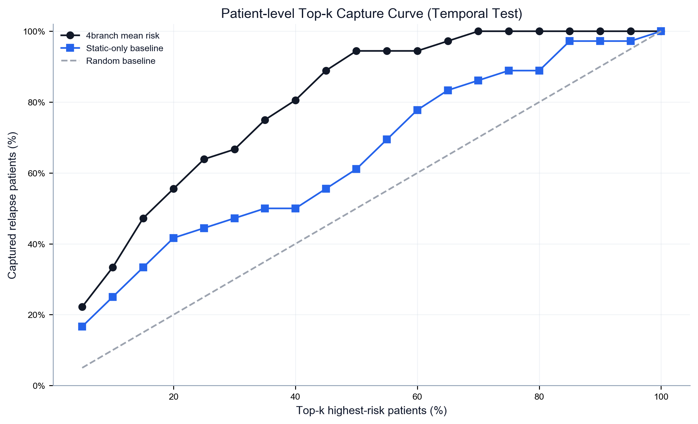

Figure 09B 将 Top-K capture 改到 patient level：每位患者取所有 interval 中的最大预测风险，再按患者风险从高到低排序。黑线是当前四分支模型，蓝线是只使用治疗前静态基线变量训练的 static-only logistic baseline，灰色虚线是随机选择基线。这个图回答的是临床分诊问题：如果只能重点随访风险最高的前 K% 患者，能够覆盖多少最终复发患者。

在 temporal test 中，Top 20% 最高风险患者覆盖 `12/36` 个最终复发患者；static-only baseline 在同一预算下覆盖 `15/36` 个。该图是 patient-level 补充，不替代 Figure 09 的 interval-level 主任务口径。
<!-- PATIENT_TOPK_CAPTURE_END -->

<!-- README4_RELAPSE_FIGURES_START -->
## 对齐仓库 README 第四章的复发模型补充图

这一节按仓库主 `README.md` 第四章的读图顺序，给当前四分支动态复发模型补齐对应图组。上文已经分别展示了校准、DCA、阈值敏感性和混淆矩阵；这里把它们和患者级风险分层、瀑布图、热图、典型病例放在同一个“主要结果图组”里，方便直接迁移到论文主文。

### 主要结果图组索引

| 对齐主 README 第四章 | 当前复发报告对应图 |
| --- | --- |
| 4.2 最终模型判别能力 | Figure 16：Train / Validation / Temporal test ROC 与 PR 曲线 |
| 4.3 校准情况 | Figure 06：risk-decile reliability curve + Brier |
| 4.4 决策曲线分析 | Figure 10：temporal test DCA, 0.05-0.40 阈值范围 |
| 4.5 阈值敏感性 | Figure 08：threshold vs F1 / Recall / Specificity / PPV |
| 4.6 混淆矩阵 | Figure 07：固定阈值 `0.785` 下三 split 混淆矩阵 |
| 4.7 患者级风险分层与 CI | Figure 17：temporal test Q1-Q4 cumulative risk strata |
| 4.8 患者级累计风险瀑布图 | Figure 18：temporal test cumulative-risk waterfall |
| 4.9 患者级风险热图 | Figure 19：patient-interval risk heatmap |
| 4.10 典型病例纵向风险更新 | Figure 20：三类典型患者风险轨迹 |

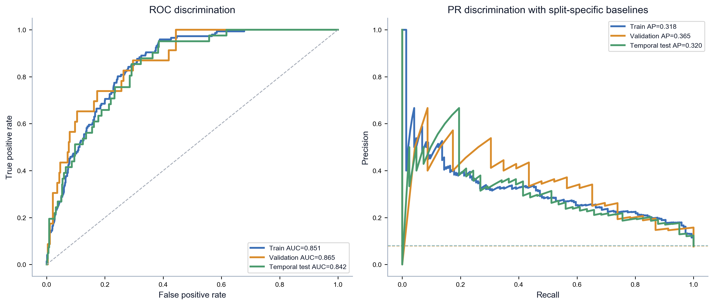

Figure 16 把 ROC 与 PR 放在同一张判别能力图里。PR 面板为每个 split 单独画 prevalence baseline，避免把 temporal test 的低事件率背景和训练/验证混在一起解释。

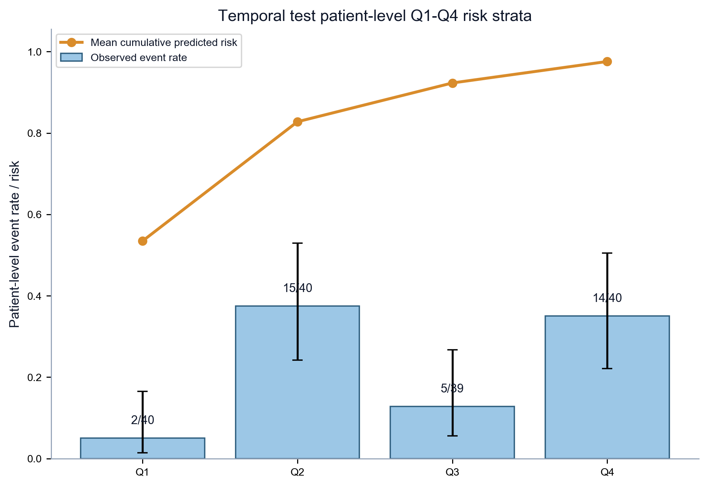

Figure 17 将 temporal test 患者按累计风险 `1 - product(1 - p_t)` 分为 Q1-Q4。柱为观察到的患者级复发率，误差条为 Wilson 95% CI，橙线为组内平均累计预测风险。当前四分位事件数为：Q1: 2/40, Q2: 15/40, Q3: 5/39, Q4: 14/40。

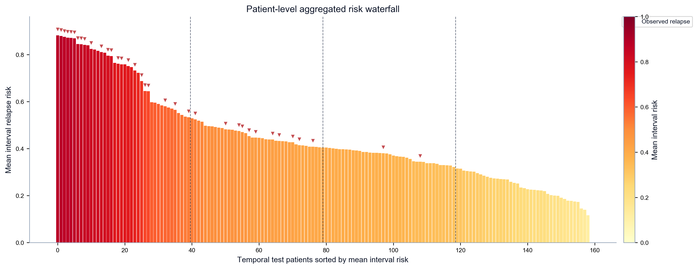

Figure 18 按患者级累计风险从高到低排序。柱体颜色表示累计风险强度，红色倒三角标记最终观察到复发的患者；这样可以同时看“模型给出的风险梯度”和“真实复发是否富集在高风险尾部”，避免把高风险未复发患者误画成低风险颜色。

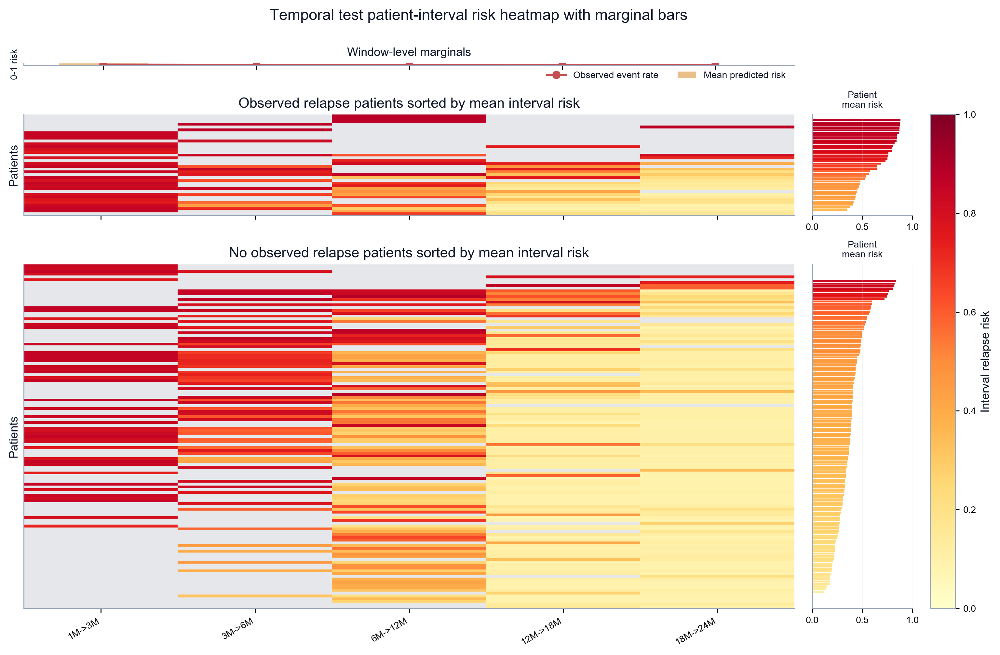

Figure 19 将 temporal test 的 patient-interval 风险矩阵化显示，并升级为带边际条图的热图：主矩阵中列是随访窗口、行是患者、颜色是该 interval 的复发风险；顶部边际条同时显示各窗口的平均预测风险和真实复发率；右侧边际条显示同一患者的累计风险 `1 - product(1 - p_t)`。复发患者和未复发患者分面展示，并在各自面板内按累计风险排序。

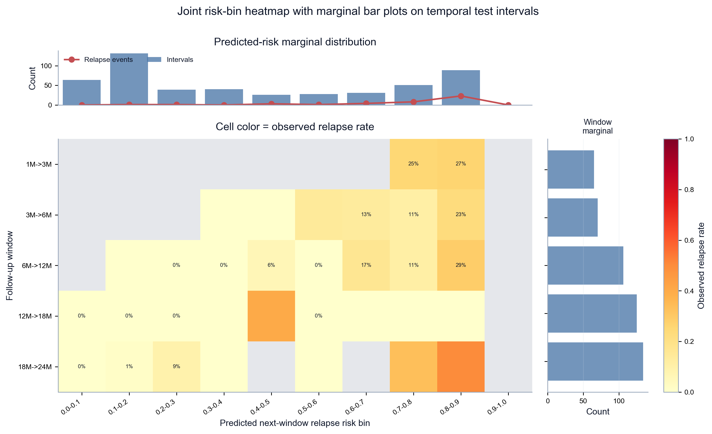

Figure 29 是标准的 joint heatmap with marginal bar plots。横轴为 temporal test interval 的预测复发风险分箱，纵轴为随访窗口；主体热图颜色表示该风险分箱与窗口交叉格内的真实复发率，顶部边际柱/线显示各风险分箱的 interval 数和复发事件数，右侧边际柱显示各窗口的 interval 数。它回答的是：高风险分箱是否真的富集复发，以及这种富集是否集中在某些随访窗口。

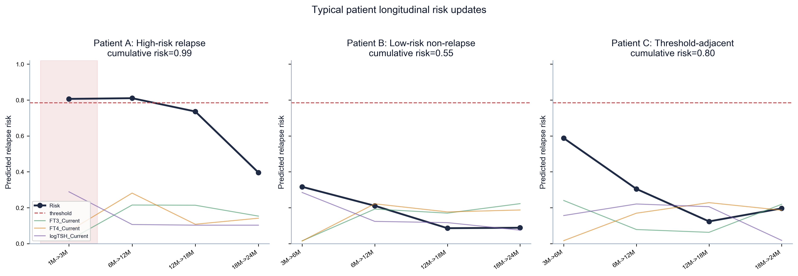

Figure 20 选择三个典型病例：高风险复发、低风险未复发、阈值邻近。黑线为每个 interval 的复发风险，虚线为固定阈值；浅红背景标记观察到复发的窗口。底部淡色线给出当前 FT3 / FT4 / logTSH 的标准化轨迹，只作临床背景参照。
<!-- README4_RELAPSE_FIGURES_END -->

## 训练时分支消融与错题本

分支消融采用 matched training-time branch removal：每个变体都使用同一损失函数和同一选择规则重新训练，只移除一个分支。数值为移除分支重训后相对 full model 的变化，负值代表性能下降。

| Variant | Removed_Branch | Best_Epoch | Threshold | AUC | PR_AUC | Brier | Accuracy | F1 | Recall | Specificity | Delta_AUC_vs_Full | Delta_PR_AUC_vs_Full | Delta_Brier_vs_Full |
| --- | --- | --- | --- | --- | --- | --- | --- | --- | --- | --- | --- | --- | --- |
| full | none | 11 | 0.785 | 0.842 | 0.320 | 0.219 | 0.817 | 0.347 | 0.610 | 0.835 | 0.000 | 0.000 | 0.000 |
| drop_static_train | static | 21 | 0.795 | 0.814 | 0.318 | 0.200 | 0.844 | 0.298 | 0.415 | 0.882 | -0.027 | -0.001 | -0.019 |
| drop_local_train | local | 16 | 0.745 | 0.841 | 0.278 | 0.194 | 0.823 | 0.355 | 0.610 | 0.841 | -0.001 | -0.042 | -0.025 |
| drop_global_train | global | 10 | 0.795 | 0.822 | 0.216 | 0.239 | 0.805 | 0.315 | 0.561 | 0.827 | -0.020 | -0.104 | 0.020 |
| drop_z3M_train | z3M | 14 | 0.770 | 0.837 | 0.287 | 0.226 | 0.813 | 0.333 | 0.585 | 0.833 | -0.004 | -0.032 | 0.007 |

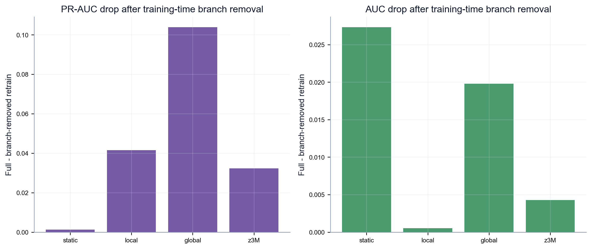

错题本按 TP / FP / FN / TN 复盘。若原始动态特征可完整合并，则输出特征画像；否则仅输出概率和病例轨迹。本次 `feature_merge_check.csv` 记录合并完整性。

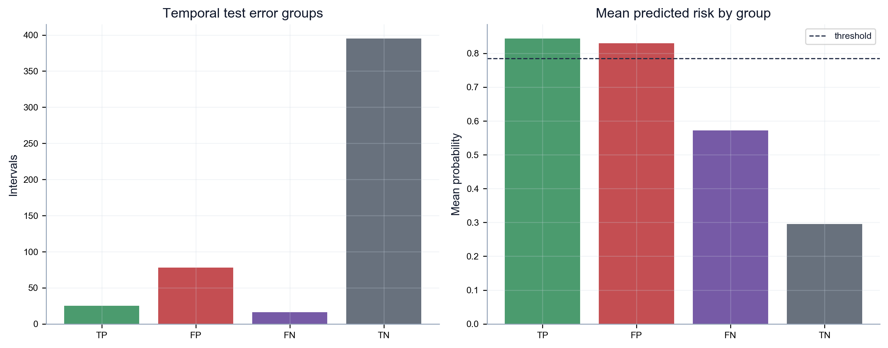

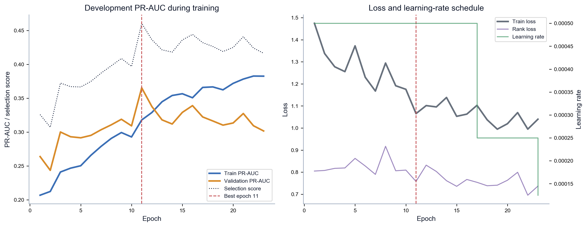

<!-- TRAIN_HISTORY_EXPLANATION_START -->
Figure 12 用于审计训练收敛与模型选择过程。左图只画 development 侧的 Train / Validation PR-AUC 与 selected score，不画 temporal test；右图画训练损失、ranking loss 和学习率调度。最终报告的 best epoch 为 `11`，该 epoch 的 Train PR-AUC = `0.318`、Validation PR-AUC = `0.365`、learning rate = `0.000500`。Temporal test 仍只在 checkpoint restore 后用于最终报告，不参与训练期选择。
<!-- TRAIN_HISTORY_EXPLANATION_END -->

<!-- CH5_EXPLAINABILITY_START -->
## 模型解释：门控、特征层 SHAP 与局部解释

本节对齐仓库主 `README.md` 第五章的解释层，但口径改为当前四分支单头动态复发模型。解释分析是 **post-hoc explanation**：不用于特征筛选、阈值选择、模型选择或校准拟合。主解释层使用 Train/Validation development rows；temporal test 只作为外推一致性检查和局部病例说明。SHAP 在 logit scale 上解释，正值表示提高下一时间窗复发风险。z3M embedding 维度只解释为 `3M early-response latent component`，不把单个 embedding 维度硬翻译成具体临床变量。

### 5.1 门控与分支贡献

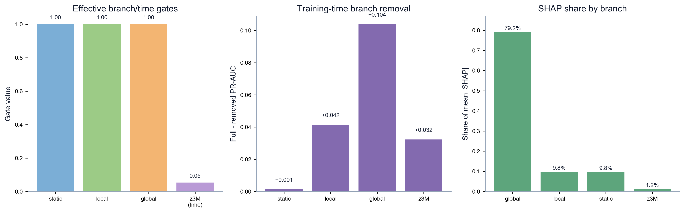

Figure 23 把三层解释放在一起：左侧是模型内显式 gate 或默认分支 multiplier，中间是 matched training-time branch removal 对 temporal-test PR-AUC 的影响，右侧是 development SHAP 在四个分支上的贡献占比。分支 SHAP 占比如下：

| Branch | Share |
| --- | --- |
| global | 79.2% |
| local | 9.8% |
| static | 9.8% |
| z3M | 1.2% |

### 5.2 Development feature-level SHAP

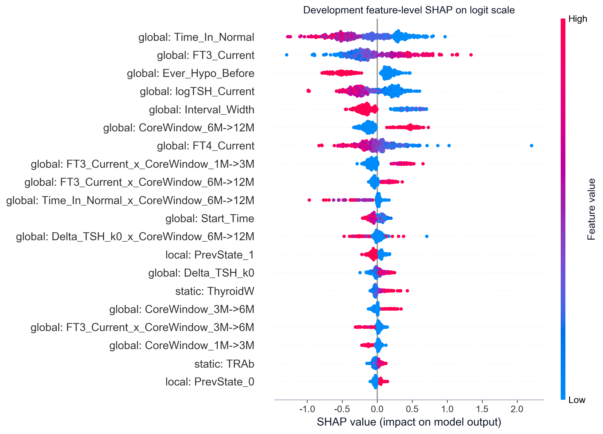

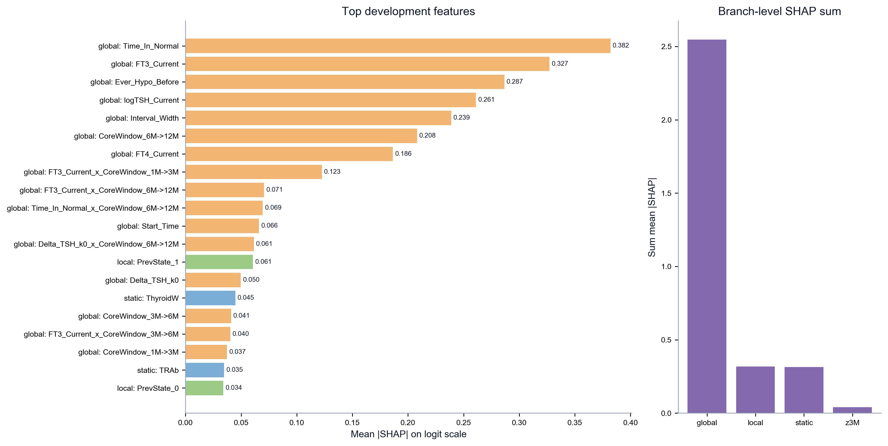

Figure 24-25 使用 `GradientExplainer`，background 仅来自 development train subset（`n=64`），解释 development 抽样 rows（`n=384`）。当前 development 解释层的前列特征包括：global: Time_In_Normal、global: FT3_Current、global: Ever_Hypo_Before、global: logTSH_Current、global: Interval_Width、global: CoreWindow_6M->12M、global: FT4_Current、global: FT3_Current_x_CoreWindow_1M->3M。这些图用于说明模型在工程特征层如何分配风险贡献，不改变模型本身。

### 5.3 Temporal-test SHAP consistency

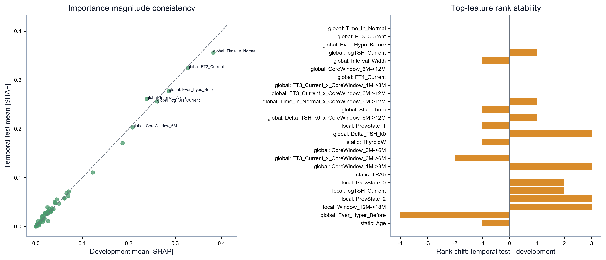

Figure 26 将 development 与 temporal test（解释抽样 `n=256`）的 mean(|SHAP|) 和 top-feature rank 做一致性对照。temporal test 的前列解释信号包括：global: Time_In_Normal、global: FT3_Current、global: Ever_Hypo_Before、global: Interval_Width、global: logTSH_Current、global: CoreWindow_6M->12M。该分析只用于描述外推解释是否大体稳定，不用于选择模型。

### 5.4 个体级局部解释

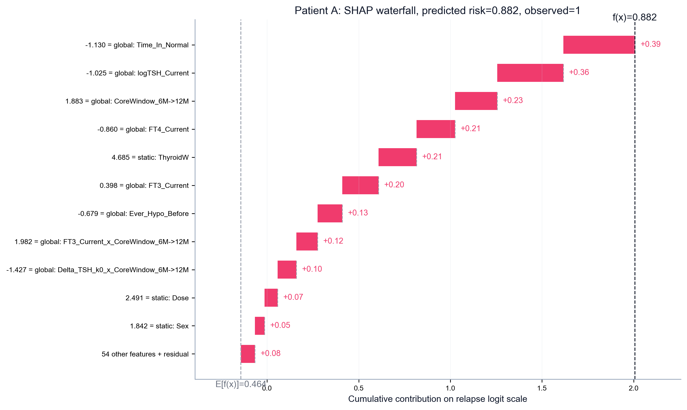

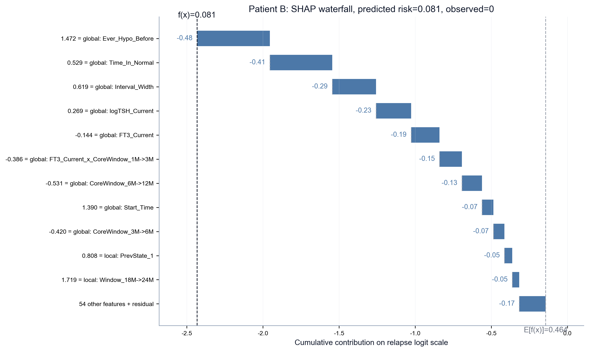

Figure 27-28 改为 waterfall-style 局部解释，不暴露真实 PID。每张图从 development background mean risk `E[f(x)]` 出发，逐项累加主要 SHAP contribution 到该患者预测风险 `f(x)`；红色表示提高复发风险，蓝色表示降低复发风险，`other features + residual` 汇总未展示的小贡献和近似残差。局部图的作用是审计单个预警或低风险判断由哪些输入驱动，而不是用个案替代总体性能评价。
<!-- CH5_EXPLAINABILITY_END -->

## 泄漏控制检查

- 阈值、模型选择、校准拟合不使用 temporal test。
- `MixedTestWeight = 0` 且 `DisableTestSelection = True`。
- `Start_Time < 3M` 的 interval 中 z3M 嵌入、availability 和 time feature 均应为 0。
- train z3M 使用 OOF / train-only 产物；validation 使用 fit-context；test 使用最终 fit+val encoder 产物。

| Split | Rows | Rows_StartBefore3M | Components_Zero_Before3M | Availability_Zero_Before3M | TimeFeature_Zero_Before3M | Z3M_Source_Rule |
| --- | --- | --- | --- | --- | --- | --- |
| Train | 1796 | 239 | True | True | True | fit uses OOF; validation uses fit-context; test uses final fit+val encoder |
| Validation | 300 | 43 | True | True | True | fit uses OOF; validation uses fit-context; test uses final fit+val encoder |
| TemporalTest | 514 | 68 | True | True | True | fit uses OOF; validation uses fit-context; test uses final fit+val encoder |

## 局限性

- 动态 interval 同一患者内相关，因此所有 CI 使用 Patient_ID cluster bootstrap，但样本量仍限制了小亚组稳定性。
- z3M branch 当前使用离线 3M 表征；真正 end-to-end pretrain-then-finetune 仍是下一版结构优化方向。
- 当前主模型未做动态复发任务的显式 train-only 稳定特征筛选；本版选择的是结构化临床候选变量与 post-hoc 可解释审计。后续可把 stable feature selection 作为单独消融，而不能使用 temporal test 反选变量。
- Temporal test 是严格时间外推，但仍属于单中心回顾性验证，外部验证可进一步增强证据等级。

## 附录 A. 患者级基线三线表

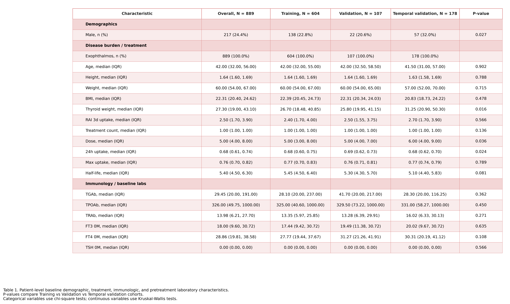

Figure 30 沿用原 README 的患者级三线表口径：每位患者只保留一条治疗前基线记录，按 Overall / Training / Validation / Temporal validation 汇总人口学、疾病负荷、治疗剂量、摄碘率、抗体和基线甲功。完整结构化数据另存为 `tables/baseline_characteristics_three_line_table.csv`。

## 附录 B. 特征英文名称与实际含义对照表

当前四分支动态复发模型共使用 `65` 个输入特征，按来源分为 Static / Local / Global / z3M 四组。下表给出报告中使用的英文特征名和临床/工程含义；z3M embedding 维度只解释为 3M early-response latent component，不把单个维度硬翻译成具体临床变量。完整 CSV 保存在 `tables/feature_dictionary_zh.csv`。

### 静态基线特征（Static branch）

| 英文特征名 | 中文含义 |
| --- | --- |
| static::Sex | 患者性别 |
| static::Age | 患者年龄 |
| static::Height | 身高 |
| static::Weight | 体重 |
| static::BMI | 体质指数 |
| static::Exophthalmos | 是否合并突眼症 |
| static::ThyroidW | 甲状腺重量/体积负荷 |
| static::RAI3d | 治疗后第 3 天残余辐射量 |
| static::TreatCount | 既往放射性碘治疗次数 |
| static::TGAb | 治疗前甲状腺球蛋白抗体（TGAb） |
| static::TPOAb | 治疗前甲状腺过氧化物酶抗体（TPOAb） |
| static::TRAb | 治疗前促甲状腺激素受体抗体（TRAb） |
| static::Uptake24h | 24 小时碘摄取率 |
| static::MaxUptake | 最大碘摄取率 |
| static::HalfLife | 放射性碘有效半衰期 |
| static::Dose | 放射性碘治疗剂量 |

### 局部近期窗口特征（Local branch）

| 英文特征名 | 中文含义 |
| --- | --- |
| local::FT3_Current | 当前游离三碘甲状腺原氨酸 FT3 |
| local::FT4_Current | 当前游离甲状腺素 FT4 |
| local::logTSH_Current | 当前 TSH 对数变换 |
| local::Delta_FT4_1step | 最近一步 FT4 变化 |
| local::Delta_TSH_1step | 最近一步 TSH 变化 |
| local::Window_12M->18M | 当前动态预测窗口指示变量：12M->18M |
| local::Window_18M->24M | 当前动态预测窗口指示变量：18M->24M |
| local::Window_1M->3M | 当前动态预测窗口指示变量：1M->3M |
| local::Window_3M->6M | 当前动态预测窗口指示变量：3M->6M |
| local::Window_6M->12M | 当前动态预测窗口指示变量：6M->12M |
| local::PrevState_0 | 当前窗口起点状态 one-hot：甲亢/Hyper |
| local::PrevState_1 | 当前窗口起点状态 one-hot：正常/Normal |
| local::PrevState_2 | 当前窗口起点状态 one-hot：甲减/Hypo |

### 全病程纵向特征（Global branch）

| 英文特征名 | 中文含义 |
| --- | --- |
| global::Time_In_Normal | 此前处于正常甲功状态的累计次数 |
| global::FT3_Current | 当前游离三碘甲状腺原氨酸 FT3 |
| global::Delta_TSH_k0 | 当前 TSH 相对基线变化 |
| global::FT4_Current | 当前游离甲状腺素 FT4 |
| global::logTSH_Current | 当前 TSH 对数变换 |
| global::Prior_Relapse_Count | 此前复发次数 |
| global::Ever_Hyper_Before | 此前是否出现过甲亢状态 |
| global::Ever_Hypo_Before | 此前是否出现过甲减状态 |
| global::Start_Time | 当前 landmark 时间（月） |
| global::Interval_Width | 当前预测区间宽度（月） |
| global::CoreWindow_1M->3M | 高风险窗口指示变量：1M->3M |
| global::Time_In_Normal_x_CoreWindow_1M->3M | 此前处于正常甲功状态的累计次数 与高风险窗口 1M->3M 的交互 |
| global::FT3_Current_x_CoreWindow_1M->3M | 当前游离三碘甲状腺原氨酸 FT3 与高风险窗口 1M->3M 的交互 |
| global::Delta_TSH_k0_x_CoreWindow_1M->3M | 当前 TSH 相对基线变化 与高风险窗口 1M->3M 的交互 |
| global::CoreWindow_3M->6M | 高风险窗口指示变量：3M->6M |
| global::Time_In_Normal_x_CoreWindow_3M->6M | 此前处于正常甲功状态的累计次数 与高风险窗口 3M->6M 的交互 |
| global::FT3_Current_x_CoreWindow_3M->6M | 当前游离三碘甲状腺原氨酸 FT3 与高风险窗口 3M->6M 的交互 |
| global::Delta_TSH_k0_x_CoreWindow_3M->6M | 当前 TSH 相对基线变化 与高风险窗口 3M->6M 的交互 |
| global::CoreWindow_6M->12M | 高风险窗口指示变量：6M->12M |
| global::Time_In_Normal_x_CoreWindow_6M->12M | 此前处于正常甲功状态的累计次数 与高风险窗口 6M->12M 的交互 |
| global::FT3_Current_x_CoreWindow_6M->12M | 当前游离三碘甲状腺原氨酸 FT3 与高风险窗口 6M->12M 的交互 |
| global::Delta_TSH_k0_x_CoreWindow_6M->12M | 当前 TSH 相对基线变化 与高风险窗口 6M->12M 的交互 |

### 3M early-response 表征特征（z3M branch）

| 英文特征名 | 中文含义 |
| --- | --- |
| z3M::selected_z3m_00 | 3M early-response encoder 的第 00 个潜在表征维度（不单独等同于某个临床变量） |
| z3M::selected_z3m_01 | 3M early-response encoder 的第 01 个潜在表征维度（不单独等同于某个临床变量） |
| z3M::selected_z3m_02 | 3M early-response encoder 的第 02 个潜在表征维度（不单独等同于某个临床变量） |
| z3M::selected_z3m_03 | 3M early-response encoder 的第 03 个潜在表征维度（不单独等同于某个临床变量） |
| z3M::selected_z3m_04 | 3M early-response encoder 的第 04 个潜在表征维度（不单独等同于某个临床变量） |
| z3M::selected_z3m_05 | 3M early-response encoder 的第 05 个潜在表征维度（不单独等同于某个临床变量） |
| z3M::selected_z3m_06 | 3M early-response encoder 的第 06 个潜在表征维度（不单独等同于某个临床变量） |
| z3M::selected_z3m_07 | 3M early-response encoder 的第 07 个潜在表征维度（不单独等同于某个临床变量） |
| z3M::selected_z3m_08 | 3M early-response encoder 的第 08 个潜在表征维度（不单独等同于某个临床变量） |
| z3M::selected_z3m_09 | 3M early-response encoder 的第 09 个潜在表征维度（不单独等同于某个临床变量） |
| z3M::selected_z3m_10 | 3M early-response encoder 的第 10 个潜在表征维度（不单独等同于某个临床变量） |
| z3M::selected_z3m_11 | 3M early-response encoder 的第 11 个潜在表征维度（不单独等同于某个临床变量） |
| z3M::z3m_available | 3M early-response 表征是否可用（3M 前为 0） |
| z3M::z3m_time_since_3m | 距离 3M landmark 的归一化时间（3M 前为 0） |
