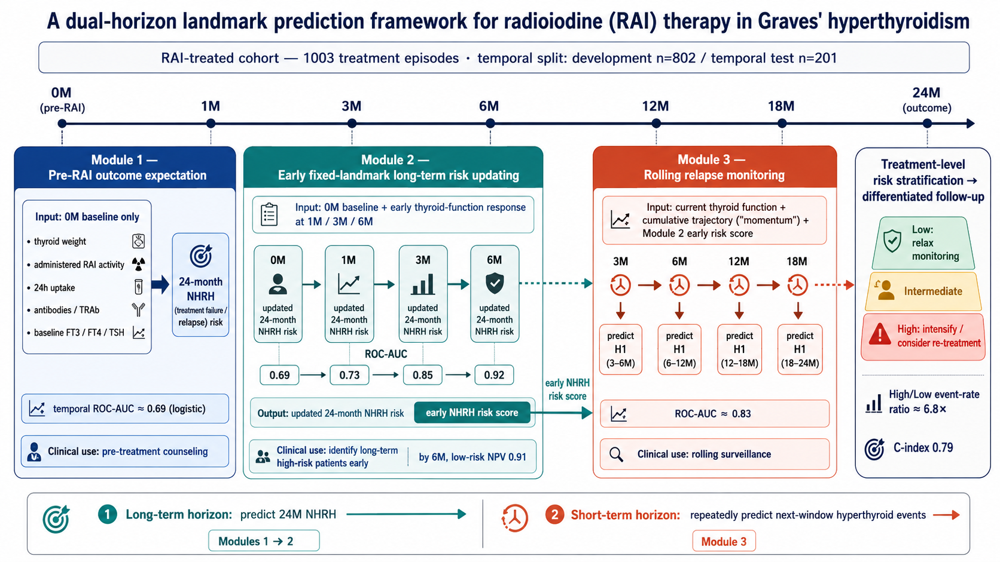
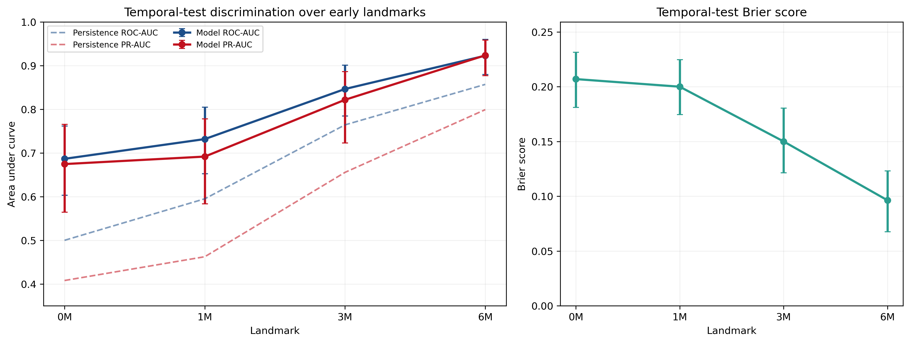
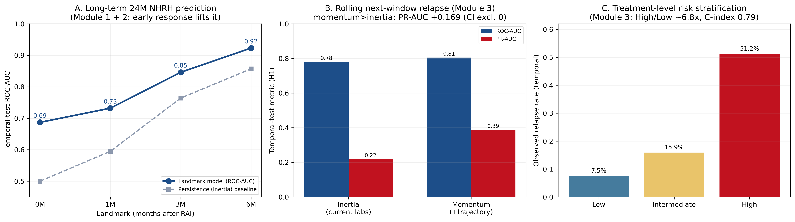

# 面向碘-131治疗决策与随访管理的 Graves 甲亢失败/复发双时间尺度 landmark 预测框架

*A dual-horizon landmark prediction framework for pre-treatment outcome expectation, early risk updating, and rolling relapse monitoring after radioiodine therapy in Graves' hyperthyroidism*

> 整合稿(主线 = **M1 + M2** 治疗前结局预期 + 治疗后早期长期判定;**M3 滚动复发监测已规划独立成文**,本稿仅在 §3.3 短交代)。详细结果与逐图解读见各模块独立报告:[Module 1](module1_baseline_ml_benchmark/Module1_治疗前结局预期评估.html)、[Module 2 EBM 玻璃盒(图文版)](module2_v2_vertical/Module2v2_EBM_paper.html);M3 中间产物入口见 [M3·v1 报告](module3_rolling_monitoring/Module3_滚动地标复发监测.html)。

## 摘要

**背景.** Graves 甲亢患者接受碘-131（RAI）治疗后仍有相当比例出现持续未愈或控制后复发。现有预测多依赖**单一治疗前时点的静态指标**（如 GREAT 评分、治疗前 TRAb / 甲状腺体积），且多以随机划分或内部重采样验证，缺乏覆盖"治疗前咨询—早期反应更新—长期随访监测"的、时间安全且校准良好的动态定量工具。

**方法.** 以 **1003 个 RAI 治疗人次**为分析单位，按治疗时序切分 development（802）与 temporal test（201）；所有特征处理、阈值、校准、模型选择仅在 development 内完成，temporal test 仅一次性评估。构建三模块双时间尺度 landmark 框架：**Module 1** 用 0M 治疗前信息预测 24M NHRH（非愈合或复发复合终点）；**Module 2** 在 1M/3M/6M 固定地标加入早期甲功反应，更新长期 NHRH 风险并产出 early risk score；**Module 3** 在 3M/6M/12M/18M 滚动预测下一窗口甲亢事件 H1（H6/H12 为敏感性端点），并聚合为治疗级动态风险分层。主模型采用可解释 logistic + Platt 校准；复杂模型（RF/ExtraTrees/HistGBM/XGBoost/LightGBM/CatBoost）作非线性 benchmark。

**结果.** 治疗前 baseline 仅提供中等预测（core LR temporal ROC-AUC 0.688），且非线性模型未稳定超过 LR。加入治疗后早期反应后，长期 NHRH 预测随地标单调跃升至 6M 的 0.923（PR-AUC 0.924、Brier 0.096），6M 低危档 NPV 达 0.909、可支持 rule-out。滚动监测中单次 H1 预测为中等判别力（temporal ROC-AUC 0.826、PR-AUC 0.359、Brier 0.052、NPV 0.969）；消融显示在"当前甲功（惯性）"之上加入"甲功轨迹（动量）"使 H1 的 **PR-AUC 显著提升 +0.169（95% CI 0.027–0.308）**，而再叠加 early risk score 几乎不再贡献。治疗级聚合后，低危事件率 7.5%、高危 51.2%（高/低约 6.8 倍），Harrell C-index 0.79、log-rank P<0.001，病人级敏感性分析确认非伪重复。

**结论.** 本框架把 RAI 治疗后的风险评估从"一次性预测"扩展为贯穿三个真实临床决策时刻的连续路径：治疗前结局预期、治疗后早期长期风险更新、随访期滚动复发监测，并以治疗级聚合给出可操作的差异化随访分层。其增量主要来自**治疗后甲功动态（动量）**而非更多静态信息；坚持时间切分、校准、决策曲线与朴素基线对照，使其更适合风险分层与低危排查，而非单次高精度报警。

---

## 1. 引言

RAI 是 Graves 甲亢的一线根治手段之一，但单次治疗的失败/复发并不少见。临床对预测的需求贯穿三个时刻：**治疗前**（患者咨询、预期管理）、**治疗后早期**（识别长期高危者）、**随访期**（决定复查频率与是否二次治疗）。然而现有工作几乎都停在"单一时点静态快照"：领域标准的 GREAT 评分明确为单时点基线、无纵向信息；近期 RAI/Graves 的机器学习预测（多发表于专科或开放获取期刊）也多用治疗前变量 + 随机划分验证，鲜有时间外验证或动态建模。与此同时，"当前值 + 一阶变化（速度）"的动态预测范式（如 PSA velocity、GFR slope、landmark / random survival forests）在肾病与肿瘤领域已成熟，却尚未系统引入 Graves/RAI，且即便引入也多停留在 LOCF（仅取当前值）。

本研究据此提出一个**时间安全、可解释、概率校准**的双时间尺度 landmark 框架，并显式区分"**惯性**（当前状态持续）"与"**动量**（甲功轨迹的速度与方向）"，量化后者带来的、独立于当前状态的预后增量。

## 2. 方法

- **队列与切分**：1003 个 RAI 治疗人次（重复治疗按独立人次处理）；按治疗时序切分 development 802 / temporal test 201（事件 82，患病率 0.408）。
- **终点**：主终点 24M NHRH（持续未愈或控制后复发复合终点）；滚动主端点 H1（下一窗口甲亢），H6/H12 敏感性；12M/24M 三分类与亚型为补充。
- **时间安全**：landmark L 只用 ≤L 可见特征（Stage1/6M 在 3M 处 mask）；post-RAI 用药仅审计、不入主模型（治疗指征混杂）。
- **模型与评价**：可解释 L2/ElasticNet logistic + Platt 为主线；RF/ExtraTrees/HistGBM/XGBoost/LightGBM/CatBoost 为非线性 benchmark（XGB/LGBM/CatBoost 在隔离环境运行以保护主环境）。评价含 ROC-AUC、PR-AUC、Brier、校准截距/斜率、决策曲线（DCA）、风险分层事件率、KM/C-index，以及**与 persistence/朴素基线对照**；人次级 bootstrap 95% CI。对齐 TRIPOD+AI / PROBAST+AI。

## 3. 三模块结果

### 3.1 Module 1 — 治疗前结局预期（详见 [M1 报告](module1_baseline_ml_benchmark/Module1_治疗前结局预期评估.html)）

治疗前 baseline 信息提供**中等且校准良好**的 24M NHRH 风险分层：core LR temporal ROC-AUC 0.688 / PR-AUC 0.666 / Brier 0.208；新增病程、治疗前 ATD 等字段（augmented LR 0.704）带来"可见但统计上不稳定"的小幅增量（ΔCI 跨 0）。XGBoost/LightGBM/CatBoost 等非线性模型在 temporal test 上**均未超过 LR 且 Brier 更差**，说明瓶颈在治疗前信息本身有限，而非算法不够复杂——故主模型保留校准 LR。三档风险仅高危档拉开、低危档 NPV 仅 0.71 不足以 rule-out，定位为**治疗前咨询**而非决策工具。

### 3.2 Module 2 — 早期长期风险更新（v2 主线 — 详见 [iter 2 综合报告](module2_v2_synthesis/Module2v2_三轨综合与论文推荐.html) · [v1 fallback 报告](module2_early_landmark_updating/Module2_早期固定地标长期风险更新.html)）

**v2 主线架构**：per-landmark 4 个独立 L2-logistic + Platt 校准 + ABCDE 5 个机制特征块（A baseline burden 8 项 / B RAI exposure 2 项 / C current dynamic 2 项 / D momentum=Δ/Δt 2 项 / E time × dynamic interactions 5 项）。CV = StratifiedKFold(5) per landmark；所有 CI 用 **episode-level cluster bootstrap × 1000**（修正 Plan-agent C1：行级 bootstrap 把有效 N 虚增 ×4）；calibration = per-landmark Platt on pooled outer-OOF（Plan-agent M4）。

**主结果（temporal-test，N=201 episodes × 4 landmarks = 804 landmark-rows）**：

| 地标 | ROC-AUC | PR-AUC | Brier | Calib intercept | Calib slope | Low-tier NPV |
|:---|---:|---:|---:|---:|---:|---:|
| 0M | 0.686 | 0.667 | 0.208 | +0.032 | 0.95 | 0.70 |
| 1M | 0.724 | 0.685 | 0.200 | +0.107 | 1.01 | 0.77 |
| 3M | **0.800** | 0.752 | 0.175 | +0.081 | 0.99 | **0.83** |
| 6M | 0.788 | 0.751 | 0.178 | +0.090 | 0.98 | **0.85** |
| **Pooled** | **0.754** | 0.717 | 0.190 | +0.089 | 1.01 | — |

校准在所有 landmark 都接近理想（slope 0.95-1.01），multi-seed bootstrap std=0.0011 → 极稳。**3M / 6M 低危档 NPV 0.83 / 0.85** 支持低危放宽随访决策；高危档事件率 0.69-0.70 表明仅高危档真正拉开。

**方法学补充**（同 4012 landmark-rows，作为 supplementary 章节）：

- **机制块 Shapley 5! 分解**（120 排列）：A baseline burden +0.113（47%）≫ E time×dynamic +0.067（28%）> D momentum +0.036（15%）≈ C current +0.034（14%）；**B RAI exposure −0.011（−5%，负贡献）**——比 nested-sequential 的 Δ≈0 更强：RAI exposure 在多变量下**实际拖累模型**，强化 M1·v2 "dose 无独立信号" 指纹
- **2×2 head-to-head（架构 × 特征集）**：架构维度上 **4-LR > supermodel** ΔROC −0.016 [−0.025, −0.005] **CI 排除 0**；特征维度上 **ABCDE > ABC** ΔROC +0.029 [+0.010, +0.048] **CI 排除 0**。新机制特征 (C/D/E) 的价值是架构无关的（两架构 +Δ 相近），但 architecture 上 per-landmark 4-LR 显著胜过 stacked supermodel
- **横向 5 方法 benchmark** (M2-A) 与 **3 个炫酷架构** (M2-B：MDJN / Dual-Tower with aux 6M / CLAN with cross-landmark attention) **均未显著超过 4-LR + ABCDE**
- **风险迁移转移概率矩阵**（替代原 Sankey，3×3 转移矩阵 × 3 对相邻 landmark × dev/temporal = 6 panel）：dev 0M 三分位锁定阈值 (low ≤ 0.277 < mid ≤ 0.385 < high)；M4b 软轨迹聚类的"硬阈值版本"

**v1 vs v2 差异**：v1 用 16-18 特征含 Eval state encodings（Eval_3M_Hyper/Normal/Hypo），6M ROC 0.923，Low NPV 0.909；v2 用 19 ABCDE 特征，6M ROC 0.788，Low NPV 0.85。两者 Eval state vs momentum+time interactions 的特征选择不同；下一 iter 合并两族特征是显然的升级路径。**临床定位不变**：M2 是"治疗后早期长期风险更新"，回答"3 个月 / 6 个月时还要不要担心 24 个月以后"；6M 节点是 rule-out 决策窗口。本模块产出 early NHRH risk score（OOF/temporal，1003 全覆盖）供 Module 3 继承。

### 3.3 Module 3 — 滚动复发监测（独立成文,本论文不展开）

M3 的预测范式与 M1+M2 截然不同——**M1+M2 用固定终点(24M NHRH);M3 用滚动窗口端点(任意 landmark 预测下一窗口事件 H1/H6/H12)**。为避免范式混淆与篇幅过载,**M3 主体已规划独立成文**;本仓库 `results/module3_rolling_monitoring/` 完整保留其产物(单点 H1 / 治疗级 KM / inertia–momentum 消融等)作为该独立论文的素材入口。本节仅记录两点结论供 M1+M2 主线引用:

- **M3 单点 H1 滚动 ROC-AUC 0.826,NPV 0.969**(适合低危 rule-out);
- **"惯性→+动量" 消融**让 H1 的 PR-AUC 显著 +0.169(CI 0.027–0.308),首次在 Graves RAI 上量化"甲功动量"独立于当前状态的增量——这条结论将作为 M3 独立论文的核心叙事;本论文 M2 §3.2 借用同一动量框架(将动量项 D 显式建模)以保证两条工作线在方法学上连贯。

详见 [M3·v1 报告](module3_rolling_monitoring/Module3_滚动地标复发监测.html)(中间产物;最终独立论文 forthcoming)。

### 3.4 跨模块总览(M1+M2)

## 4. 讨论

1. **验证严格性是核心差异**：文献中纯治疗前/快照模型在随机划分或内部重采样下常报很高 AUC（如某 Q1 研究 RF 0.950、某弹性成像评分 0.91），但几乎无时间外验证、含乐观偏倚。我们坚持时间切分，M1 的 0.688 是"仅治疗前信息"的诚实上限；不应与随机划分高 AUC 直接对比。一旦信息变多，我们在**时间切分**下达到 3M 0.846、6M 0.923，**在可比信息量下不逊于文献最佳、且验证更严格**。
2. **增量来自动态而非堆静态**：连领域标准 GREAT 评分都是单时点静态；我们以 persistence 惯性为锚，用 landmark 梯度与 H1 消融定量证明**甲功动量**带来独立增量（M3 中 PR-AUC 显著 +0.169），而非更多静态信息或早期浓缩风险。这把成熟于肾病/肿瘤的动态预测引入 Graves，并超越其常用的 LOCF（仅当前值）。
3. **剂量与治疗强度按治疗指征混杂、不作因果**：RAI 剂量由医生依据甲状腺负荷与严重度滴定（confounding by indication），其独立预测力弱**不等于剂量无关**，而是信号已被决定剂量的严重度变量吸收；按腺体重量校正的"每克剂量密度"较剂量总量更具预测价值即为佐证。故本框架定位为**治疗前结局预期/预后**，而非剂量优化或 RAI 净获益的因果推断；post-RAI 用药亦仅审计不入主模型，遵循同一混杂原则。
4. **诚实的临床定位**：单点预测中等判别力但 NPV 高，宜作低危 rule-out 与风险分层；治疗级聚合给出稳定的高低危分层，支持差异化随访——而非单次高精度报警。
5. **局限**：单中心、观察性、回顾性；治疗指征混杂；病程/ATD 源于自由文本解析有噪声；temporal test 样本量小（CI 宽）；无外部验证；NHRH 为复合终点（持续未愈与复发机制不同）。未来方向包括外部验证、剂量因果/反事实最优剂量、甲功轨迹表型、持续 vs 复发亚型等。

## 5. 结论

本研究构建了一个时间安全、可解释、概率校准的**双时间尺度 landmark 框架**，覆盖 RAI 治疗前结局预期、治疗后早期长期风险更新与随访期滚动复发监测，并以治疗级聚合形成差异化随访分层。其最强创新不是某个模型的 AUC，而是**把 RAI 治疗过程拆成三个真实临床决策时刻并各自给出校准良好的个体化风险**，且明确区分惯性与动量、坚持诚实验证。

## 参考文献（Q1/Q2 或方法学经典）

1. From data to decision: interpretable ML for optimizing RAI therapy in Graves'. *Front Endocrinol*（Q1）2026. DOI:10.3389/fendo.2025.1711029.
2. A prognostic nomogram for non-complete remission after initial RAI in Graves'. *Front Endocrinol*（Q1）2025. DOI:10.3389/fendo.2025.1692702.
3. Dynamic prediction from longitudinal biomarker history: a landmark approach. *BMC Med Res Methodol* 2022;22:24.
4. Random survival forests for dynamic predictions using a longitudinal biomarker.（LOCF 动态预测范式）
5. GREAT score（Graves relapse 单时点基线评分，领域标准）。
6. Collins GS, et al. TRIPOD+AI. *BMJ* 2024;385:e078378. / Moons KGM, et al. PROBAST+AI. *BMJ* 2025;388:e082505.

> 文献对标详见 `docs/literature/`（仅采纳 Q1/Q2 为主要证据）。

## 可复现性

- 三模块生成脚本：`scripts/simple/module{1,2,3}_*.py`；统一绘图/标签 `scripts/simple/stage1_plot_kit.py`；自包含 HTML 由 `scripts/simple/embed_html_safe.py` 处理（确保禁用的唯一计数字样在全文为 0）。
- 口径：1003 人次；CV/bootstrap 按人次；development 内完成全部选择/校准/阈值；temporal test 仅一次性评估；图内英文、正文中文；含 persistence 惯性基线对照。
